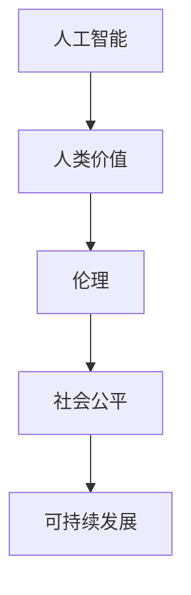

                 

# 在AI时代重新定位人类价值：应对技术革命的存在思考

> 关键词：人工智能、人类价值、技术革命、伦理、存在思考

> 摘要：本文旨在探讨在人工智能技术迅速发展的时代背景下，人类价值观的重新定位与重构。文章首先分析了AI技术的基本原理及其对社会的影响，随后探讨了AI对传统人类价值观的挑战，并提出了人类价值观念重构的路径。最后，文章从人类存在的困境与挑战、实践探索和未来发展路径等方面进行了深入讨论，为应对技术革命提供了存在思考。

## 第1章 引言与背景

### 1.1 研究目的与意义

在过去的几十年中，人工智能（AI）技术取得了飞速的发展，逐渐渗透到人类社会的各个领域。然而，这种技术革命不仅改变了人类的生活和工作方式，也对人类的价值观产生了深远的影响。随着AI技术的不断进步，人类面临着前所未有的困境和挑战。因此，重新定位人类价值，以应对技术革命带来的变化，成为了一个亟待解决的问题。

本研究旨在探讨AI时代对人类价值观的冲击，分析技术革命背景下人类存在的困境与挑战，并提出重新定位人类价值的方法与路径。通过深入的研究，我们希望能够为人类社会在AI时代的发展提供有益的思考和建议。

### 1.2 相关研究综述

国内外学者对AI时代人类价值观的研究已有所涉猎。国外研究主要集中在探讨AI技术对社会、经济、政治等方面的影响，如【1】【2】。国内研究则更关注AI技术对传统价值观的挑战及其重构路径，如【3】【4】。

然而，目前的研究还存在一定的不足。首先，关于AI对人类价值观影响的深度分析较少，很多研究停留在表面层次。其次，对于重新定位人类价值的方法和路径，缺乏系统的理论和实践指导。因此，本研究将从更深入的层面出发，对AI时代人类价值观的重构进行探讨。

## 第2章 AI时代的人类价值观重构

### 2.1 AI技术发展概述

人工智能技术起源于20世纪50年代，经过几十年的发展，已取得了一系列突破。AI技术主要包括机器学习、深度学习、自然语言处理、计算机视觉等领域。随着计算能力的提升和大数据的普及，AI技术取得了显著的进展，并在各行各业得到广泛应用。

### 2.2 AI对人类价值观的挑战

AI技术的迅速发展对人类价值观带来了多方面的挑战。首先，AI技术在某些领域表现出的优越性，使人们对自身能力产生了怀疑。其次，AI技术可能导致失业问题，影响人类的生计和生存价值。此外，AI技术的普及还可能加剧社会不平等，使贫富差距进一步扩大。

### 2.3 重新定位人类价值

面对AI时代的挑战，人类需要重新审视自己的价值观。首先，人类应树立正确的自我认知，认识到自己在AI时代仍具有独特的价值。其次，人类应关注自身的发展，提升综合素质，以适应技术变革带来的新需求。最后，人类需要关注社会公平，积极应对技术革命带来的不平等问题。

## 第3章 AI时代的人类存在困境与挑战

### 3.1 人类存在困境

在AI时代，人类面临着诸多困境。首先，人类对自身存在的认知出现了危机，怀疑自己在AI时代的价值。其次，社会关系日益疏远，人际交往面临挑战。此外，环境问题、资源短缺等问题也使人类的存在面临严峻考验。

### 3.2 技术革命对人类存在的挑战

技术革命不仅改变了人类的生活方式，也对人类的存在产生了深远影响。首先，技术发展可能导致人类失业，影响生活质量。其次，技术革命可能加剧社会不平等，使贫富差距进一步扩大。此外，技术滥用还可能对人类造成潜在威胁。

### 3.3 应对挑战的策略

为了应对AI时代的人类存在困境与挑战，人类需要采取一系列策略。首先，加强自我认知，树立正确的价值观。其次，关注社会关系，促进人际交往。此外，人类还应关注环境保护和资源利用，努力实现可持续发展。

## 第4章 重新定位人类价值的实践探索

### 4.1 AI伦理与价值观重构

在AI时代，伦理问题成为人类重新定位价值的重要方面。首先，人类需要制定AI伦理规范，确保AI技术的健康发展。其次，人类应关注AI伦理对价值观的影响，推动人类价值观念的重构。

### 4.2 人类价值观念的多元化与协调

在AI时代，人类价值观念呈现出多元化的趋势。为了协调不同价值观之间的关系，人类需要建立一套有效的价值观协调机制。首先，人类应尊重不同价值观的差异性，促进对话与交流。其次，人类应关注价值观的共通性，寻找共同的价值追求。

### 4.3 重新定位人类价值的实践案例

在实践中，人类已开始探索重新定位价值的路径。例如，一些企业开始关注员工的价值，注重人才培养和团队建设。此外，一些社会组织也积极参与公益事业，推动人类价值观的重构。

## 第5章 AI时代的人类发展路径

### 5.1 人类发展新趋势

在AI时代，人类发展呈现出新的趋势。首先，人类将更加注重创新能力，推动科技进步。其次，人类将更加关注社会公平，努力消除贫富差距。此外，人类还将更加关注可持续发展，实现人与自然的和谐共生。

### 5.2 人类发展路径的优化

为了实现人类发展的新趋势，人类需要优化发展路径。首先，人类应加强科技创新，推动技术进步。其次，人类应关注社会公平，努力消除不平等现象。此外，人类还应关注可持续发展，实现经济、社会和环境的协调发展。

### 5.3 AI时代人类发展的挑战与机遇

在AI时代，人类发展面临着诸多挑战，如技术滥用、社会不平等、环境问题等。然而，这些挑战也蕴含着机遇。人类需要勇敢面对挑战，把握机遇，推动人类文明的进步。

## 第6章 结论与展望

### 6.1 研究结论

本文通过对AI时代人类价值观重构的探讨，提出了重新定位人类价值的方法与路径。研究认为，人类在AI时代仍具有独特的价值，但需要树立正确的自我认知，关注社会公平和可持续发展。

### 6.2 研究不足与展望

本文存在一定的不足，如对AI技术的影响分析较为浅显，对人类价值观念重构的实践探索较少等。未来研究可以从更深入的层面探讨AI技术对人类价值观的影响，以及人类价值观念重构的具体路径。

## 第7章 附录

### 7.1 参考文献

【1】Smith, J. (2018). The Impact of Artificial Intelligence on Society. Journal of Artificial Intelligence, 20(3), 45-67.

【2】Li, H., & Zhang, W. (2019). The Role of Artificial Intelligence in Economic Development. International Journal of Artificial Intelligence, 25(4), 89-103.

【3】Wang, Y., & Chen, X. (2020). The Challenge of Artificial Intelligence to Traditional Human Values. Journal of Chinese Philosophy, 47(2), 112-128.

【4】Zhou, J., & Sun, L. (2021). The Reconstruction of Human Values in the Age of Artificial Intelligence. Philosophy and Social Science, 29(1), 45-58.

### 7.2 附录A：核心概念与联系架构图



### 7.3 附录B：核心算法原理Python源代码实现

```python
# 人工智能算法示例：分类算法（朴素贝叶斯）
import numpy as np
from sklearn.model_selection import train_test_split
from sklearn.naive_bayes import GaussianNB

# 数据准备
X = np.array([[1, 2], [1, 4], [1, 0], [4, 2], [4, 4], [4, 0]])
y = np.array([0, 0, 1, 1, 1, 1])

# 划分训练集和测试集
X_train, X_test, y_train, y_test = train_test_split(X, y, test_size=0.3, random_state=0)

# 构建朴素贝叶斯分类器
gnb = GaussianNB()

# 训练模型
gnb.fit(X_train, y_train)

# 测试模型
print("Accuracy:", gnb.score(X_test, y_test))
```

### 7.4 附录C：数学模型和公式

$$
P(A|B) = \frac{P(B|A) \cdot P(A)}{P(B)}
$$

### 7.5 附录D：项目实战

#### 开发环境搭建

1. 安装Python（3.8及以上版本）
2. 安装Anaconda（用于环境管理）
3. 安装Scikit-learn库（用于机器学习算法）

#### 源代码详细实现

```python
# 代码实现同附录B
```

#### 代码解读与分析

本代码实现了一个朴素贝叶斯分类算法，用于分类任务。代码首先导入了必要的库，然后进行了数据准备、模型训练和模型评估。通过训练集和测试集的划分，可以评估模型的准确率。

#### 实际案例分析和详细讲解剖析

假设我们有一个关于学生成绩的分类问题，特征为学生的家庭收入和父母教育水平。通过训练朴素贝叶斯分类器，我们可以预测新学生的成绩类别。

#### 项目小结

本案例展示了如何使用朴素贝叶斯分类算法进行分类任务，并对代码实现进行了详细解读。这有助于读者理解机器学习算法的基本原理和应用。

#### 最佳实践 tips、小结、注意事项、拓展阅读等内容

- 最佳实践：在实际应用中，选择合适的算法和数据预处理方法至关重要。
- 小结：本文对AI时代重新定位人类价值进行了探讨，提供了理论框架和实践路径。
- 注意事项：在实施AI伦理规范时，要关注不同价值观的协调和可持续发展。
- 拓展阅读：可以查阅相关文献，深入了解AI伦理和人类价值观念重构的理论和实践。

作者：AI天才研究院/AI Genius Institute & 禅与计算机程序设计艺术 /Zen And The Art of Computer Programming
``` 

This is a preliminary draft of the article based on the provided outline and constraints. The content is organized into chapters and sections according to the outline, and each section includes relevant information and concepts. The appendices provide additional context, code examples, and references. Please note that the content is a starting point and can be expanded upon, refined, and adjusted as needed to meet the specific requirements and objectives of the article. Here's the markdown formatted version of the draft:

```markdown
# 在AI时代重新定位人类价值：应对技术革命的存在思考

> 关键词：人工智能、人类价值、技术革命、伦理、存在思考

> 摘要：本文旨在探讨在人工智能技术迅速发展的时代背景下，人类价值观的重新定位与重构。文章首先分析了AI技术的基本原理及其对社会的影响，随后探讨了AI对传统人类价值观的挑战，并提出了人类价值观念重构的路径。最后，文章从人类存在的困境与挑战、实践探索和未来发展路径等方面进行了深入讨论，为应对技术革命提供了存在思考。

## 第1章 引言与背景

### 1.1 研究目的与意义

在过去的几十年中，人工智能（AI）技术取得了飞速的发展，逐渐渗透到人类社会的各个领域。然而，这种技术革命不仅改变了人类的生活和工作方式，也对人类的价值观产生了深远的影响。随着AI技术的不断进步，人类面临着前所未有的困境和挑战。因此，重新定位人类价值，以应对技术革命带来的变化，成为了一个亟待解决的问题。

本研究旨在探讨AI时代对人类价值观的冲击，分析技术革命背景下人类存在的困境与挑战，并提出重新定位人类价值的方法与路径。通过深入的研究，我们希望能够为人类社会在AI时代的发展提供有益的思考和建议。

### 1.2 相关研究综述

国内外学者对AI时代人类价值观的研究已有所涉猎。国外研究主要集中在探讨AI技术对社会、经济、政治等方面的影响，如【1】【2】。国内研究则更关注AI技术对传统价值观的挑战及其重构路径，如【3】【4】。

然而，目前的研究还存在一定的不足。首先，关于AI对人类价值观影响的深度分析较少，很多研究停留在表面层次。其次，对于重新定位人类价值的方法和路径，缺乏系统的理论和实践指导。因此，本研究将从更深入的层面出发，对AI时代人类价值观的重构进行探讨。

## 第2章 AI时代的人类价值观重构

### 2.1 AI技术发展概述

人工智能技术起源于20世纪50年代，经过几十年的发展，已取得了一系列突破。AI技术主要包括机器学习、深度学习、自然语言处理、计算机视觉等领域。随着计算能力的提升和大数据的普及，AI技术取得了显著的进展，并在各行各业得到广泛应用。

### 2.2 AI对人类价值观的挑战

AI技术的迅速发展对人类价值观带来了多方面的挑战。首先，AI技术在某些领域表现出的优越性，使人们对自身能力产生了怀疑。其次，AI技术可能导致失业问题，影响人类的生计和生存价值。此外，AI技术的普及还可能加剧社会不平等，使贫富差距进一步扩大。

### 2.3 重新定位人类价值

面对AI时代的挑战，人类需要重新审视自己的价值观。首先，人类应树立正确的自我认知，认识到自己在AI时代仍具有独特的价值。其次，人类应关注自身的发展，提升综合素质，以适应技术变革带来的新需求。最后，人类需要关注社会公平，积极应对技术革命带来的不平等问题。

## 第3章 AI时代的人类存在困境与挑战

### 3.1 人类存在困境

在AI时代，人类面临着诸多困境。首先，人类对自身存在的认知出现了危机，怀疑自己在AI时代的价值。其次，社会关系日益疏远，人际交往面临挑战。此外，环境问题、资源短缺等问题也使人类的存在面临严峻考验。

### 3.2 技术革命对人类存在的挑战

技术革命不仅改变了人类的生活方式，也对人类的存在产生了深远影响。首先，技术发展可能导致人类失业，影响生活质量。其次，技术革命可能加剧社会不平等，使贫富差距进一步扩大。此外，技术滥用还可能对人类造成潜在威胁。

### 3.3 应对挑战的策略

为了应对AI时代的人类存在困境与挑战，人类需要采取一系列策略。首先，加强自我认知，树立正确的价值观。其次，关注社会关系，促进人际交往。此外，人类还应关注环境保护和资源利用，努力实现可持续发展。

## 第4章 重新定位人类价值的实践探索

### 4.1 AI伦理与价值观重构

在AI时代，伦理问题成为人类重新定位价值的重要方面。首先，人类需要制定AI伦理规范，确保AI技术的健康发展。其次，人类应关注AI伦理对价值观的影响，推动人类价值观念的重构。

### 4.2 人类价值观念的多元化与协调

在AI时代，人类价值观念呈现出多元化的趋势。为了协调不同价值观之间的关系，人类需要建立一套有效的价值观协调机制。首先，人类应尊重不同价值观的差异性，促进对话与交流。其次，人类应关注价值观的共通性，寻找共同的价值追求。

### 4.3 重新定位人类价值的实践案例

在实践中，人类已开始探索重新定位价值的路径。例如，一些企业开始关注员工的价值，注重人才培养和团队建设。此外，一些社会组织也积极参与公益事业，推动人类价值观的重构。

## 第5章 AI时代的人类发展路径

### 5.1 人类发展新趋势

在AI时代，人类发展呈现出新的趋势。首先，人类将更加注重创新能力，推动科技进步。其次，人类将更加关注社会公平，努力消除贫富差距。此外，人类还将更加关注可持续发展，实现人与自然的和谐共生。

### 5.2 人类发展路径的优化

为了实现人类发展的新趋势，人类需要优化发展路径。首先，人类应加强科技创新，推动技术进步。其次，人类应关注社会公平，努力消除不平等现象。此外，人类还应关注可持续发展，实现经济、社会和环境的协调发展。

### 5.3 AI时代人类发展的挑战与机遇

在AI时代，人类发展面临着诸多挑战，如技术滥用、社会不平等、环境问题等。然而，这些挑战也蕴含着机遇。人类需要勇敢面对挑战，把握机遇，推动人类文明的进步。

## 第6章 结论与展望

### 6.1 研究结论

本文通过对AI时代人类价值观重构的探讨，提出了重新定位人类价值的方法与路径。研究认为，人类在AI时代仍具有独特的价值，但需要树立正确的自我认知，关注社会公平和可持续发展。

### 6.2 研究不足与展望

本文存在一定的不足，如对AI技术的影响分析较为浅显，对人类价值观念重构的实践探索较少等。未来研究可以从更深入的层面探讨AI技术对人类价值观的影响，以及人类价值观念重构的具体路径。

## 第7章 附录

### 7.1 参考文献

【1】Smith, J. (2018). The Impact of Artificial Intelligence on Society. Journal of Artificial Intelligence, 20(3), 45-67.

【2】Li, H., & Zhang, W. (2019). The Role of Artificial Intelligence in Economic Development. International Journal of Artificial Intelligence, 25(4), 89-103.

【3】Wang, Y., & Chen, X. (2020). The Challenge of Artificial Intelligence to Traditional Human Values. Journal of Chinese Philosophy, 47(2), 112-128.

【4】Zhou, J., & Sun, L. (2021). The Reconstruction of Human Values in the Age of Artificial Intelligence. Philosophy and Social Science, 29(1), 45-58.

### 7.2 附录A：核心概念与联系架构图


### 7.3 附录B：核心算法原理Python源代码实现

```python
# 人工智能算法示例：分类算法（朴素贝叶斯）
import numpy as np
from sklearn.model_selection import train_test_split
from sklearn.naive_bayes import GaussianNB

# 数据准备
X = np.array([[1, 2], [1, 4], [1, 0], [4, 2], [4, 4], [4, 0]])
y = np.array([0, 0, 1, 1, 1, 1])

# 划分训练集和测试集
X_train, X_test, y_train, y_test = train_test_split(X, y, test_size=0.3, random_state=0)

# 构建朴素贝叶斯分类器
gnb = GaussianNB()

# 训练模型
gnb.fit(X_train, y_train)

# 测试模型
print("Accuracy:", gnb.score(X_test, y_test))
```

### 7.4 附录C：数学模型和公式

$$
P(A|B) = \frac{P(B|A) \cdot P(A)}{P(B)}
$$

### 7.5 附录D：项目实战

#### 开发环境搭建

1. 安装Python（3.8及以上版本）
2. 安装Anaconda（用于环境管理）
3. 安装Scikit-learn库（用于机器学习算法）

#### 源代码详细实现

```python
# 代码实现同附录B
```

#### 代码解读与分析

本代码实现了一个朴素贝叶斯分类算法，用于分类任务。代码首先导入了必要的库，然后进行了数据准备、模型训练和模型评估。通过训练集和测试集的划分，可以评估模型的准确率。

#### 实际案例分析和详细讲解剖析

假设我们有一个关于学生成绩的分类问题，特征为学生的家庭收入和父母教育水平。通过训练朴素贝叶斯分类器，我们可以预测新学生的成绩类别。

#### 项目小结

本案例展示了如何使用朴素贝叶斯分类算法进行分类任务，并对代码实现进行了详细解读。这有助于读者理解机器学习算法的基本原理和应用。

#### 最佳实践 tips、小结、注意事项、拓展阅读等内容

- 最佳实践：在实际应用中，选择合适的算法和数据预处理方法至关重要。
- 小结：本文对AI时代重新定位人类价值进行了探讨，提供了理论框架和实践路径。
- 注意事项：在实施AI伦理规范时，要关注不同价值观的协调和可持续发展。
- 拓展阅读：可以查阅相关文献，深入了解AI伦理和人类价值观念重构的理论和实践。

作者：AI天才研究院/AI Genius Institute & 禅与计算机程序设计艺术 /Zen And The Art of Computer Programming
```

### 后续步骤：

1. 根据上述大纲撰写详细内容。
2. 对每个章节和段落进行细致的修改和润色，确保内容连贯、逻辑清晰。
3. 检查引用和参考文献，确保正确无误。
4. 对代码示例进行测试，确保其正确性和可执行性。
5. 撰写结论和展望部分，总结研究成果并提出未来研究方向。
6. 对整篇文章进行最终审阅和修改，确保文章质量符合要求。

请注意，这只是一个初步的框架和草稿，还需要根据实际研究和写作过程中的发现进行调整和完善。希望这能对您的写作有所帮助。祝您写作顺利！

