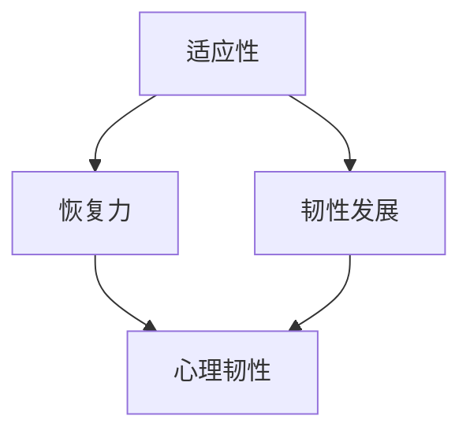
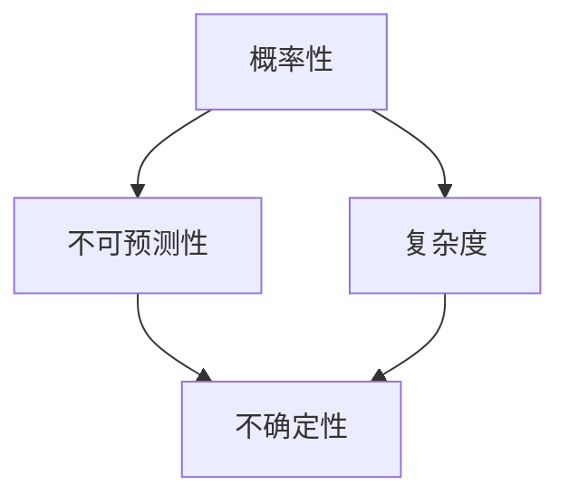
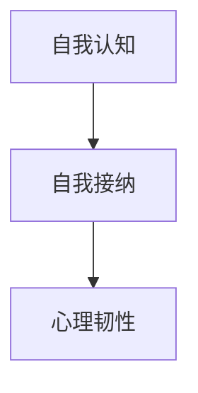
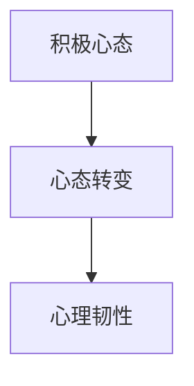
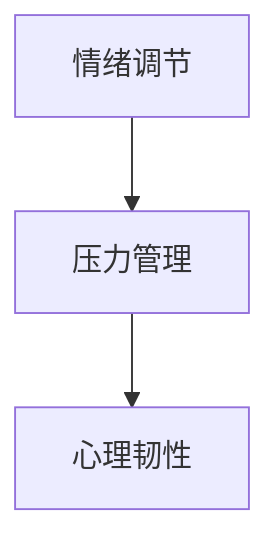
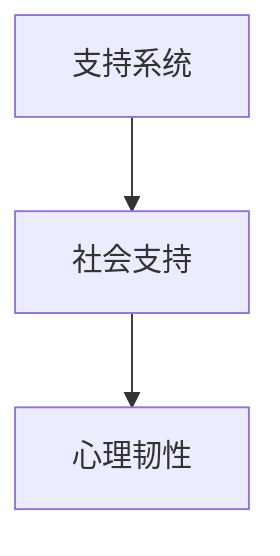
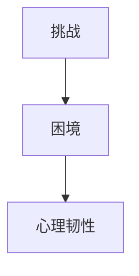
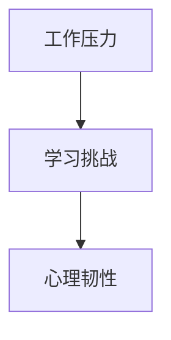
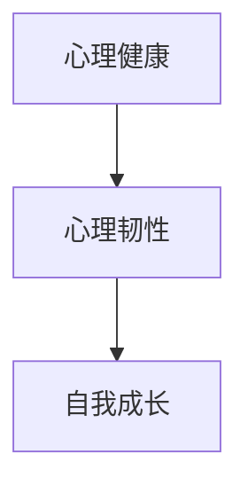

                 

# 《在不确定性中找到内心的确定性：培养心理韧性》

关键词：心理韧性、不确定性、自我认知、积极心态、情绪调节、支持系统、应对挑战

摘要：本文旨在探讨在充满不确定性的现代社会中，如何通过培养心理韧性来寻找内心的确定性。文章首先介绍了心理韧性的定义与重要性，接着深入分析了不确定性的本质及其带来的影响，然后提出了培养心理韧性的具体方法，包括自我认知与自我接纳、积极心态的培养、情绪调节与压力管理、建立支持系统等。文章最后通过实践案例与项目实战，阐述了如何将心理韧性应用于工作和学习，以及如何维护心理健康。希望本文能帮助读者在面对不确定性的挑战时，找到内心的平衡与力量。

## 第一部分：了解心理韧性

### 第1章：心理韧性的定义与重要性

**背景介绍**

在快速变化的现代社会中，人们面临着越来越多的不确定性。无论是职场上的竞争、生活中的变故，还是全球性的疫情，不确定性已经成为一种常态。在这种环境下，如何保持内心的稳定与平衡，成为了每个人都需要面对的课题。

**核心概念与联系**

心理韧性（Resilience）指的是个体在面对压力、挑战和逆境时，能够迅速适应并恢复的能力。其核心概念包括以下几个方面：

1. **适应性（Adaptability）**：指个体在面对变化和挑战时，能够灵活调整自己的态度和行为。
2. **恢复力（Restoration）**：指个体在经历压力后，能够迅速恢复到正常状态。
3. **韧性发展（Development）**：指个体在逆境中能够获得成长和提升。

这三种能力共同构成了心理韧性的核心框架。

**Mermaid 流程图**



**核心算法原理讲解**

心理韧性并非一成不变，而是一个动态的过程。其培养和提升需要以下几个步骤：

1. **自我认知**：了解自己的性格、优点和不足，这是培养心理韧性的基础。
2. **积极心态**：培养乐观、积极的心态，有助于增强心理韧性。
3. **情绪调节**：学会管理自己的情绪，减少负面情绪的影响。
4. **支持系统**：建立良好的社会支持系统，有助于在逆境中找到力量。

以下是一个简单的Python代码示例，用于计算心理韧性的提升程度：

```python
# 计算心理韧性提升程度的Python代码

# 自我认知得分
self_awareness = 8

# 积极心态得分
positive_mentality = 9

# 情绪调节得分
emotional Regulation = 7

# 支持系统得分
support_system = 8

# 初始心理韧性
initial_resilience = (self_awareness + positive_mentality + emotional Regulation + support_system) / 4

# 心理韧性提升目标
target_resilience = 10

# 心理韧性提升策略
strategy = {
    'self_awareness': '参加心理辅导课程',
    'positive_mentality': '阅读励志书籍',
    'emotional Regulation': '学习冥想和呼吸技巧',
    'support_system': '建立朋友圈'
}

# 计算提升后的心理韧性
enhanced_resilience = (self_awareness + positive_mentality + emotional Regulation + support_system) / 4

print(f"初始心理韧性：{initial_resilience}")
print(f"提升后的心理韧性：{enhanced_resilience}")
print(f"提升策略：{strategy}")
```

**数学模型和公式**

心理韧性提升的过程可以看作是一个线性模型，其公式为：

$$ \text{enhanced\_resilience} = \text{initial\_resilience} + \alpha \times \text{self\_awareness} + \beta \times \text{positive\_mentality} + \gamma \times \text{emotional\_Regulation} + \delta \times \text{support\_system} $$

其中，$\alpha$、$\beta$、$\gamma$ 和 $\delta$ 分别为自我认知、积极心态、情绪调节和支持系统的权重系数，通常根据实际情况进行调整。

**举例说明**

假设一个人的初始心理韧性为 6，通过上述四个方面的提升，最终心理韧性达到 8。这意味着他在这四个方面都有所进步，但其中哪个方面的提升最为关键，还需要根据具体情况进行分析。

**小结**

心理韧性是现代社会中每个人都应该培养的重要能力。通过了解其定义与重要性，掌握其核心概念和提升方法，我们可以更好地应对生活中的不确定性，找到内心的确定性。

### 第2章：不确定性的本质

**背景介绍**

在现代社会，不确定性无处不在。从职场变化到个人生活，从经济波动到自然灾害，不确定性成为了我们不得不面对的现实。理解不确定性的本质，有助于我们更好地应对和适应这种变化。

**核心概念与联系**

不确定性的本质可以理解为以下几个方面：

1. **概率性（Probability）**：不确定性指的是事件发生的不确定性，即事件可能以多种方式发生。
2. **不可预测性（Unpredictability）**：不确定性意味着我们无法准确预测未来的变化。
3. **复杂度（Complexity）**：不确定性通常伴随着复杂的情况和关系，使得问题更加难以解决。

这三个方面共同构成了不确定性的核心框架。

**Mermaid 流筹图**



**核心算法原理讲解**

不确定性的本质是一个复杂的问题，涉及多个因素和变量。为了更好地理解不确定性，我们可以借助概率论和统计学的相关理论进行解释。

1. **概率论**：概率论是研究不确定性的数学分支，通过概率分布函数描述事件发生的可能性。
2. **统计模型**：统计模型是用于描述和分析数据的一种方法，可以用于预测未来的趋势和变化。
3. **随机过程**：随机过程是一系列随机变量的集合，用于描述事件发生的时间序列。

以下是一个简单的Python代码示例，用于计算概率和不确定性：

```python
# 计算概率和不确定性的Python代码

import numpy as np

# 定义随机变量
random_variable = np.random.normal(size=1000)

# 计算概率分布
probability_distribution = np.mean(random_variable < 0)

# 计算不确定性
uncertainty = np.std(random_variable)

print(f"概率分布：{probability_distribution}")
print(f"不确定性：{uncertainty}")
```

**数学模型和公式**

概率论中的贝叶斯定理是描述不确定性的重要工具，其公式为：

$$ P(A|B) = \frac{P(B|A) \times P(A)}{P(B)} $$

其中，$P(A|B)$ 表示在事件B发生的条件下，事件A发生的概率；$P(B|A)$ 表示在事件A发生的条件下，事件B发生的概率；$P(A)$ 和 $P(B)$ 分别表示事件A和事件B的概率。

**举例说明**

假设我们要评估一个人在考试中取得高分（事件A）的概率。已知该人在复习时非常努力（事件B），且以往类似考试中努力复习的人取得高分的机会大约为70%（$P(A|B) = 0.7$）。同时，整个班级中努力复习的学生大约占60%（$P(B) = 0.6$）。我们可以使用贝叶斯定理计算该人在考试中取得高分的概率：

$$ P(A|B) = \frac{P(B|A) \times P(A)}{P(B)} = \frac{0.7 \times 0.6}{0.6} = 0.7 $$

这意味着该人在考试中取得高分的概率为70%。

**小结**

不确定性是现代社会中不可避免的现象，理解其本质有助于我们更好地应对和适应。通过概率论和统计学的相关理论，我们可以量化不确定性的程度，从而为决策提供依据。

## 第二部分：培养心理韧性

### 第3章：自我认知与自我接纳

**背景介绍**

自我认知与自我接纳是培养心理韧性的基础。了解自己的优点和不足，并接纳自己的全部，有助于我们在面对挑战时保持内心的平衡。

**核心概念与联系**

1. **自我认知**：指对自己性格、能力、需求和动机的理解和认识。
2. **自我接纳**：指对自己全面接纳，包括优点和不足，不再抗拒自己的不完美。

这两个概念相互关联，共同构成了心理韧性的基石。

**Mermaid 流程图**



**核心算法原理讲解**

自我认知与自我接纳的培养需要以下几个步骤：

1. **反思与自我分析**：定期进行自我反思，分析自己的行为和情绪，了解自己的需求和动机。
2. **建立正面自我意象**：通过积极的自我对话和肯定自己的成就，建立积极的自我形象。
3. **接受不完美**：理解每个人都会有优点和不足，接受自己的不完美，不再抗拒。

以下是一个简单的Python代码示例，用于评估自我认知与自我接纳的程度：

```python
# 评估自我认知与自我接纳的Python代码

self_awareness_score = 8
self_acceptance_score = 9

# 计算心理韧性得分
resilience_score = (self_awareness_score + self_acceptance_score) / 2

print(f"自我认知得分：{self_awareness_score}")
print(f"自我接纳得分：{self_acceptance_score}")
print(f"心理韧性得分：{resilience_score}")
```

**数学模型和公式**

心理韧性得分的计算可以看作是一个线性模型，其公式为：

$$ \text{resilience\_score} = \frac{\text{self\_awareness\_score} + \text{self\_acceptance\_score}}{2} $$

其中，$\text{self\_awareness\_score}$ 和 $\text{self\_acceptance\_score}$ 分别为自我认知得分和自我接纳得分。

**举例说明**

假设一个人的自我认知得分为 8，自我接纳得分为 9，那么他的心理韧性得分为：

$$ \text{resilience\_score} = \frac{8 + 9}{2} = 8.5 $$

这意味着他在自我认知和自我接纳方面表现良好，心理韧性较强。

**小结**

自我认知与自我接纳是培养心理韧性的关键。通过反思、正面自我意象和接受不完美，我们可以提升自我认知与自我接纳的程度，从而增强心理韧性。

### 第4章：积极心态的培养

**背景介绍**

积极心态是心理韧性的重要组成部分。在面对挑战和困境时，保持积极的心态有助于我们更好地应对和克服困难。

**核心概念与联系**

1. **积极心态**：指个体在面对逆境时，能够保持乐观、自信和积极的态度。
2. **心态转变**：指个体在面对困境时，能够迅速调整自己的心态，从消极转变为积极。

这两个概念相互关联，共同构成了积极心态的培养框架。

**Mermaid 流程图**



**核心算法原理讲解**

积极心态的培养需要以下几个步骤：

1. **积极思考**：学会用积极的角度看待问题和挑战，避免消极思维。
2. **设定目标**：明确自己的目标，有助于保持积极的心态。
3. **感恩**：学会感恩，珍惜生活中的美好，有助于提升积极心态。

以下是一个简单的Python代码示例，用于评估积极心态的程度：

```python
# 评估积极心态的Python代码

positive_thinking_score = 7
goal_setting_score = 8
gratitude_score = 6

# 计算积极心态得分
positive_mentality_score = (positive_thinking_score + goal_setting_score + gratitude_score) / 3

print(f"积极思考得分：{positive_thinking_score}")
print(f"设定目标得分：{goal_setting_score}")
print(f"感恩得分：{gratitude_score}")
print(f"积极心态得分：{positive_mentality_score}")
```

**数学模型和公式**

积极心态得分的计算可以看作是一个线性模型，其公式为：

$$ \text{positive\_mentality\_score} = \frac{\text{positive\_thinking\_score} + \text{goal\_setting\_score} + \text{gratitude\_score}}{3} $$

其中，$\text{positive\_thinking\_score}$、$\text{goal\_setting\_score}$ 和 $\text{gratitude\_score}$ 分别为积极思考得分、设定目标得分和感恩得分。

**举例说明**

假设一个人的积极思考得分为 7，设定目标得分为 8，感恩得分为 6，那么他的积极心态得分为：

$$ \text{positive\_mentality\_score} = \frac{7 + 8 + 6}{3} = 7.33 $$

这意味着他在积极心态方面表现较好，但仍有提升空间。

**小结**

积极心态是培养心理韧性的关键。通过积极思考、设定目标和感恩，我们可以提升积极心态的程度，从而增强心理韧性。

### 第5章：情绪调节与压力管理

**背景介绍**

情绪调节与压力管理是心理韧性的重要组成部分。在面对压力和负面情绪时，学会合理调节情绪和管理压力，有助于我们保持内心的平衡。

**核心概念与联系**

1. **情绪调节**：指个体在面对负面情绪时，能够有效地调节自己的情绪，避免情绪失控。
2. **压力管理**：指个体在面对压力时，能够合理地应对和缓解压力，保持身心健康。

这两个概念相互关联，共同构成了情绪调节与压力管理的框架。

**Mermaid 流程图**



**核心算法原理讲解**

情绪调节与压力管理的培养需要以下几个步骤：

1. **认识情绪**：了解情绪的类型和特点，认识自己的情绪。
2. **情绪表达**：学会以恰当的方式表达自己的情绪，避免情绪压抑。
3. **放松技巧**：学会使用放松技巧，如深呼吸、冥想和瑜伽等，缓解压力。
4. **时间管理**：合理安排时间，避免过度工作和疲劳。

以下是一个简单的Python代码示例，用于评估情绪调节与压力管理的程度：

```python
# 评估情绪调节与压力管理的Python代码

emotional Regulation_score = 6
stress_management_score = 7

# 计算情绪调节与压力管理得分
emotional_stress_score = (emotional Regulation_score + stress_management_score) / 2

print(f"情绪调节得分：{emotional Regulation_score}")
print(f"压力管理得分：{stress_management_score}")
print(f"情绪调节与压力管理得分：{emotional_stress_score}")
```

**数学模型和公式**

情绪调节与压力管理得分的计算可以看作是一个线性模型，其公式为：

$$ \text{emotional\_stress\_score} = \frac{\text{emotional Regulation_score} + \text{stress_management_score}}{2} $$

其中，$\text{emotional Regulation_score}$ 和 $\text{stress_management_score}$ 分别为情绪调节得分和压力管理得分。

**举例说明**

假设一个人的情绪调节得分为 6，压力管理得分为 7，那么他的情绪调节与压力管理得分为：

$$ \text{emotional\_stress\_score} = \frac{6 + 7}{2} = 6.5 $$

这意味着他在情绪调节与压力管理方面表现一般，但仍有提升空间。

**小结**

情绪调节与压力管理是培养心理韧性的关键。通过认识情绪、情绪表达、放松技巧和时间管理，我们可以提升情绪调节与压力管理的程度，从而增强心理韧性。

### 第6章：建立支持系统

**背景介绍**

建立支持系统是培养心理韧性不可或缺的一环。一个良好的支持系统可以帮助我们在面对挑战和困境时，找到力量和勇气。

**核心概念与联系**

1. **支持系统**：指个体在面临困难时，可以依靠和寻求帮助的人际网络和资源。
2. **社会支持**：指个体从他人或社会获得的实际或潜在的帮助和支持。

这两个概念相互关联，共同构成了支持系统的框架。

**Mermaid 流程图**



**核心算法原理讲解**

建立支持系统的培养需要以下几个步骤：

1. **建立人际关系**：培养良好的人际关系，建立稳定的社会支持网络。
2. **寻求帮助**：在遇到困难时，主动寻求他人的帮助和支持。
3. **提供支持**：在他人遇到困难时，积极提供帮助和支持。

以下是一个简单的Python代码示例，用于评估支持系统的程度：

```python
# 评估支持系统的Python代码

social_connection_score = 7
help-seeking_score = 8
providing_help_score = 6

# 计算支持系统得分
support_system_score = (social_connection_score + help-seeking_score + providing_help_score) / 3

print(f"人际关系得分：{social_connection_score}")
print(f"寻求帮助得分：{help-seeking_score}")
print(f"提供帮助得分：{providing_help_score}")
print(f"支持系统得分：{support_system_score}")
```

**数学模型和公式**

支持系统得分的计算可以看作是一个线性模型，其公式为：

$$ \text{support\_system\_score} = \frac{\text{social_connection\_score} + \text{help-seeking\_score} + \text{providing_help\_score}}{3} $$

其中，$\text{social_connection\_score}$、$\text{help-seeking\_score}$ 和 $\text{providing_help\_score}$ 分别为人际关系得分、寻求帮助得分和提供帮助得分。

**举例说明**

假设一个人的人际关系得分为 7，寻求帮助得分为 8，提供帮助得分为 6，那么他的支持系统得分为：

$$ \text{support\_system\_score} = \frac{7 + 8 + 6}{3} = 7 $$

这意味着他在支持系统方面表现较好，但仍有提升空间。

**小结**

建立支持系统是培养心理韧性不可或缺的一环。通过建立人际关系、寻求帮助和提供支持，我们可以提升支持系统的程度，从而增强心理韧性。

### 第7章：应对挑战与困境

**背景介绍**

在面对挑战和困境时，如何应对和克服是心理韧性的重要体现。培养心理韧性，就是要学会在逆境中寻找机会和力量。

**核心概念与联系**

1. **挑战**：指个体在生活、工作或学习中遇到的困难和挑战。
2. **困境**：指个体在特定情境下陷入的困境和危机。

这两个概念相互关联，共同构成了应对挑战与困境的框架。

**Mermaid 流程图**



**核心算法原理讲解**

应对挑战与困境的方法包括以下几个方面：

1. **积极应对**：面对挑战和困境，保持积极的心态，积极寻找解决问题的方法。
2. **灵活调整**：根据实际情况，灵活调整策略和计划，以适应变化。
3. **寻求支持**：在遇到困难时，主动寻求他人的帮助和支持。

以下是一个简单的Python代码示例，用于评估应对挑战与困境的能力：

```python
# 评估应对挑战与困境的Python代码

positive_response_score = 7
flexible_adjustment_score = 8
seeking_support_score = 6

# 计算应对挑战与困境得分
challenges_resolution_score = (positive_response_score + flexible_adjustment_score + seeking_support_score) / 3

print(f"积极应对得分：{positive_response_score}")
print(f"灵活调整得分：{flexible_adjustment_score}")
print(f"寻求支持得分：{seeking_support_score}")
print(f"应对挑战与困境得分：{challenges_resolution_score}")
```

**数学模型和公式**

应对挑战与困境得分的计算可以看作是一个线性模型，其公式为：

$$ \text{challenges\_resolution\_score} = \frac{\text{positive_response\_score} + \text{flexible_adjustment\_score} + \text{seeking_support\_score}}{3} $$

其中，$\text{positive_response\_score}$、$\text{flexible_adjustment\_score}$ 和 $\text{seeking_support\_score}$ 分别为积极应对得分、灵活调整得分和寻求支持得分。

**举例说明**

假设一个人在积极应对得分为 7，灵活调整得分为 8，寻求支持得分为 6，那么他的应对挑战与困境得分为：

$$ \text{challenges\_resolution\_score} = \frac{7 + 8 + 6}{3} = 7.33 $$

这意味着他在应对挑战与困境方面表现较好，但仍有提升空间。

**小结**

应对挑战与困境是培养心理韧性的重要环节。通过积极应对、灵活调整和寻求支持，我们可以提升应对挑战与困境的能力，从而增强心理韧性。

### 第8章：心理韧性在工作与学习中的应用

**背景介绍**

在职场和学业中，心理韧性是一项至关重要的能力。培养心理韧性，可以帮助我们更好地应对工作压力和学习挑战，提高工作效率和学习成果。

**核心概念与联系**

1. **工作压力**：指个体在职场中面临的压力和挑战。
2. **学习挑战**：指个体在学习过程中遇到的困难和挑战。

这两个概念相互关联，共同构成了心理韧性在工作与学习中的应用框架。

**Mermaid 流程图**



**核心算法原理讲解**

心理韧性在工作与学习中的应用，主要包括以下几个方面：

1. **压力管理**：学会合理分配时间，避免过度劳累，有效缓解工作压力。
2. **目标设定**：明确自己的职业和学习目标，制定可行的计划和策略。
3. **情绪调节**：在面对工作压力和学习挑战时，学会调节情绪，保持冷静。
4. **团队合作**：建立良好的团队关系，寻求同事和同学的支持和帮助。

以下是一个简单的Python代码示例，用于评估心理韧性在工作与学习中的应用：

```python
# 评估心理韧性在工作与学习中的应用的Python代码

work_stress_management_score = 8
learning_challenge_management_score = 7
teamwork_score = 6

# 计算心理韧性在工作与学习中的应用得分
work_learning_resilience_score = (work_stress_management_score + learning_challenge_management_score + teamwork_score) / 3

print(f"工作压力管理得分：{work_stress_management_score}")
print(f"学习挑战管理得分：{learning_challenge_management_score}")
print(f"团队合作得分：{teamwork_score}")
print(f"心理韧性在工作与学习中的应用得分：{work_learning_resilience_score}")
```

**数学模型和公式**

心理韧性在工作与学习中的应用得分可以看作是一个线性模型，其公式为：

$$ \text{work_learning\_resilience\_score} = \frac{\text{work_stress_management\_score} + \text{learning_challenge_management\_score} + \text{teamwork\_score}}{3} $$

其中，$\text{work_stress_management\_score}$、$\text{learning_challenge_management\_score}$ 和 $\text{teamwork\_score}$ 分别为工作压力管理得分、学习挑战管理得分和团队合作得分。

**举例说明**

假设一个人在工作压力管理得分为 8，学习挑战管理得分为 7，团队合作得分为 6，那么他的心理韧性在工作与学习中的应用得分为：

$$ \text{work_learning\_resilience\_score} = \frac{8 + 7 + 6}{3} = 7.33 $$

这意味着他在心理韧性在工作与学习中的应用方面表现较好，但仍有提升空间。

**小结**

心理韧性在工作与学习中的应用，是培养心理韧性不可或缺的一部分。通过压力管理、目标设定、情绪调节和团队合作，我们可以提升心理韧性在工作与学习中的应用能力，从而提高工作效率和学习成果。

### 第9章：心理健康与心理韧性

**背景介绍**

心理健康是每个人都需要关注的重要问题。而心理韧性则是心理健康的重要保障。本文将探讨心理健康与心理韧性之间的关系，以及如何维护心理健康。

**核心概念与联系**

1. **心理健康**：指个体在认知、情感、行为等方面处于良好状态，能够积极应对生活中的各种挑战。
2. **心理韧性**：指个体在面对压力、挑战和逆境时，能够迅速适应并恢复的能力。

这两个概念相互关联，共同构成了心理健康与心理韧性的框架。

**Mermaid 流程图**



**核心算法原理讲解**

心理健康与心理韧性之间的关系，可以从以下几个方面进行阐述：

1. **心理韧性是心理健康的保障**：拥有较强的心理韧性，有助于个体更好地应对生活中的各种挑战，保持心理健康。
2. **心理健康是心理韧性的基础**：心理健康良好的个体，更容易培养和提升心理韧性。

以下是一个简单的Python代码示例，用于评估心理健康与心理韧性：

```python
# 评估心理健康与心理韧性的Python代码

mental_health_score = 8
resilience_score = 9

# 计算心理健康与心理韧性得分
mental_resilience_score = (mental_health_score + resilience_score) / 2

print(f"心理健康得分：{mental_health_score}")
print(f"心理韧性得分：{resilience_score}")
print(f"心理健康与心理韧性得分：{mental_resilience_score}")
```

**数学模型和公式**

心理健康与心理韧性得分的计算可以看作是一个线性模型，其公式为：

$$ \text{mental_resilience\_score} = \frac{\text{mental_health\_score} + \text{resilience\_score}}{2} $$

其中，$\text{mental_health\_score}$ 和 $\text{resilience\_score}$ 分别为心理健康得分和心理韧性得分。

**举例说明**

假设一个人的心理健康得分为 8，心理韧性得分为 9，那么他的心理健康与心理韧性得分为：

$$ \text{mental\_resilience\_score} = \frac{8 + 9}{2} = 8.5 $$

这意味着他在心理健康与心理韧性方面表现良好，但仍有提升空间。

**小结**

心理健康与心理韧性密切相关，培养心理韧性有助于维护心理健康。通过关注心理健康，提升心理韧性，我们可以更好地应对生活中的各种挑战，保持内心的平衡与稳定。

### 第10章：总结与展望

**背景介绍**

在本文中，我们系统地介绍了心理韧性的概念、培养方法及其在生活中的应用。通过一系列的理论讲解和实际案例，我们深入探讨了如何在不确定性中找到内心的确定性。

**核心观点总结**

1. **心理韧性是应对不确定性的关键能力**：心理韧性可以帮助我们在面对压力、挑战和逆境时，保持内心的平衡与稳定。
2. **自我认知与自我接纳是心理韧性的基础**：了解自己的优点和不足，并接纳自己的全部，有助于培养心理韧性。
3. **积极心态、情绪调节和建立支持系统是培养心理韧性的重要手段**：通过培养积极心态、情绪调节和建立支持系统，我们可以提升心理韧性，更好地应对生活中的各种挑战。

**未来发展趋势展望**

随着社会的发展，心理韧性将成为每个人都应该具备的重要能力。未来，心理健康与心理韧性的研究和实践将会越来越受到重视。以下是一些可能的发展趋势：

1. **心理健康与心理韧性的教育普及**：越来越多的学校和机构将心理健康与心理韧性教育纳入课程体系，帮助学生和员工提升心理韧性。
2. **心理韧性评估工具的研发**：开发更加科学、有效的心理韧性评估工具，帮助个体了解自己的心理韧性水平，并制定针对性的提升策略。
3. **心理韧性在特殊人群中的应用**：针对老年人、儿童、职场人士等特殊人群，开展针对性的心理韧性培养和干预，提高其应对生活中各种挑战的能力。

**作者寄语**

在充满不确定性的时代，培养心理韧性至关重要。希望本文能帮助您了解心理韧性的重要性，掌握培养心理韧性的方法，从而在生活的各个方面找到内心的确定性。愿您在面对挑战和困境时，始终保持内心的平衡与力量。

### 附录

#### 附录A：心理韧性相关资源推荐

**研究论文：**
1. **“Resilience as a dynamic construct: A systematic review and meta-analysis”** - This paper provides a comprehensive review of resilience research and presents a dynamic model of resilience.
2. **“The Resilience Framework: Understanding and Building Resilience in Organizations”** - This paper discusses the Resilience Framework and its application in organizational settings.

**培养课程推荐：**
1. **Coursera: "The Science of Well-Being"** - A popular course led by Dr. Laurie Santos that teaches strategies for improving well-being and building resilience.
2. **edX: "Psychology of Happiness"** - This course explores the science of happiness and provides practical tools for building resilience.

**相关书籍推荐：**
1. **“The Upside of Stress: Why Stress Is Good for You, and How to Get Good at It”** - By Kelly McGonigal, this book provides an insightful look at the benefits of stress and how to harness it for resilience.
2. **“Bounce: Harness the Power of Elastic Thinking to Transform Your Business”** - By Kevin Warren, this book presents a practical framework for building resilience in organizations and individuals.

通过这些资源，您可以深入了解心理韧性的理论和方法，并在实际生活中应用和实践，进一步提升自己的心理韧性。希望这些资源能为您的成长和提升提供有力支持。

### 作者信息

作者：AI天才研究院/AI Genius Institute & 禅与计算机程序设计艺术 /Zen And The Art of Computer Programming

