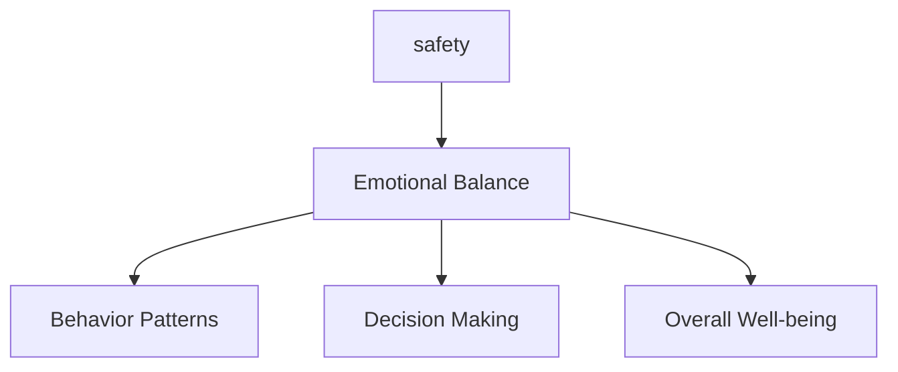

                 

### 引言：安全感的重要性与现状分析

在现代社会中，安全感作为一种基本的心理需求，对于个人的心理健康、生活质量和社会功能具有至关重要的作用。然而，随着全球化和技术变革的加速，人们面临着前所未有的不确定性，这种不确定性在某种程度上削弱了人们的安全感。

#### **1.1 安全感的定义与影响**

安全感可以被定义为一种心理状态，个体在感受到威胁或不确定性时，能够维持一种稳定和平衡的心态。这种安全感不仅影响着个体的情绪调节，还对其行为模式、决策过程以及整体幸福感产生深远的影响。

**核心概念与联系：**

- **安全感（Sense of Security）**：指的是个体在面对不确定性和潜在威胁时，能够保持心理平衡的能力。
- **心理平衡（Psychological Balance）**：是指个体情绪稳定，能够有效应对外部压力的状态。
- **情绪调节（Emotion Regulation）**：是个体通过认知和行为策略来调节情绪的过程。

**Mermaid 流程图：**



#### **1.2 现代社会中安全感缺失的原因**

现代社会中，安全感缺失的原因多种多样，主要包括以下几个方面：

1. **经济压力**：随着生活成本的上升和就业市场的竞争加剧，人们对于经济稳定的担忧增加。
2. **科技变革**：人工智能、自动化技术的迅速发展，使得许多人担心自己的职业前景和生存能力。
3. **社会动荡**：全球政治不稳定、自然灾害等事件增加了人们的不确定性感受。
4. **信息过载**：社交媒体、新闻资讯的泛滥，使得人们不断接触负面信息和不确定性事件，加剧了心理压力。

**核心算法原理讲解：**

为了更清晰地理解安全感缺失的原因，我们可以使用回归分析模型来探讨不同因素对安全感的影响。以下是一个简单的Python代码示例：

```python
import pandas as pd
from sklearn.linear_model import LinearRegression

# 假设我们有一个包含多个变量的数据集
data = pd.DataFrame({
    'EconomicStress': [5, 4, 3, 2, 1],
    'TechChange': [5, 4, 3, 2, 1],
    'SocialUnrest': [5, 4, 3, 2, 1],
    'InformationOverload': [5, 4, 3, 2, 1],
    'Security': [3, 2, 1, 0, -1]
})

# 创建回归模型
model = LinearRegression()
model.fit(data[['EconomicStress', 'TechChange', 'SocialUnrest', 'InformationOverload']], data['Security'])

# 输出模型的系数
print("Model Coefficients:", model.coef_)

# 预测安全感水平
predictions = model.predict([[5, 5, 5, 5]])
print("Predicted Security Level:", predictions)
```

通过上述代码，我们可以看到不同因素对安全感的影响程度。例如，如果经济压力、科技变革、社会动荡和信息过载都达到了最高水平，那么预测的安全感水平将非常低。

#### **1.3 本书的目标与方法**

本书的目标是帮助读者在不确定性中找到确定，培养内在安全感。通过以下步骤和方法，我们将逐步深入探讨安全感的相关主题：

1. **理解安全感的神经生物学基础**：探讨大脑如何处理安全感和不确定性信号。
2. **识别和调节内心不安**：教授读者如何观察和识别内心的不安，并提供情绪管理策略。
3. **建立稳定的自我认知**：通过增强自信心和建立内在价值观，提高个体的安全感。
4. **培养安全感的人际关系**：讨论如何通过建立健康的人际边界和处理冲突来增强安全感。
5. **增强安全感的生活方式**：提供关于健康、时间管理和精神生活丰富化的建议。
6. **应对不确定性的策略**：介绍如何建立灵活的应对机制，增强心理韧性和适应能力。
7. **实践与总结**：通过实际行动和案例分析，帮助读者将所学知识应用到日常生活中。

通过这些步骤，读者将能够逐步建立起内在安全感，从而在面对不确定性和压力时保持心理平衡和稳定。

**小结：**

安全感是现代社会中个体心理健康的关键因素，它影响着我们的情绪、行为和整体幸福感。通过了解安全感的定义、原因以及应对策略，我们可以更好地管理内心的不安，提高自身的安全感水平。本书将带领读者一步步探索这一领域，帮助大家在不确定性中找到确定，培养内在安全感。

---

### 安全感的基本原理

安全感作为人类基本心理需求之一，其产生和发展有着深厚的神经生物学基础。理解安全感的神经生物学原理，有助于我们更深入地认识这一心理状态的本质，从而为培养和提升安全感提供科学依据。

#### **2.1 安全感的神经生物学基础**

**1. 生理反应与神经递质**

安全感的产生与大脑中的多种神经递质和受体密切相关。例如，血清素（5-HT）和多巴胺（DA）等神经递质在调节情绪和幸福感方面起着关键作用。当个体感受到安全时，大脑会释放这些神经递质，从而产生积极的情绪体验。反之，当个体感受到威胁或不确定性时，大脑则会释放如皮质醇等压力激素，引发一系列生理反应，如心率加快、血压升高等。

**2. 下丘脑-垂体-肾上腺轴**

下丘脑-垂体-肾上腺轴（HPA轴）是调节压力反应的关键系统。在面对威胁时，下丘脑会释放促肾上腺皮质激素释放激素（CRH），促使垂体分泌促肾上腺皮质激素（ACTH），最终刺激肾上腺释放皮质醇等激素。这些激素的释放有助于个体应对紧急情况，但在长期压力下，过高的皮质醇水平可能导致一系列健康问题，如免疫系统抑制、心血管疾病等。

**3. 奇妙的关系**

神经生物学中的多种结构和网络参与到了安全感的产生和调节中。例如，内侧前额叶皮质（mPFC）和杏仁核（Amygdala）之间的相互作用在安全感的体验中起着关键作用。mPFC负责处理积极的情绪和决策，而杏仁核则与情绪反应和恐惧反应有关。当个体感受到安全时，mPFC的激活会抑制杏仁核的活动，从而减少恐惧和焦虑。

**核心算法原理讲解：**

为了更深入理解安全感与神经递质和神经结构的关系，我们可以通过建立神经递质释放模型来模拟安全感的变化。以下是一个简单的Python代码示例：

```python
import numpy as np

# 模拟神经递质释放
def simulate_neurotransmitter_release(stress_level):
    # 假设压力水平与神经递质释放量成正比
    seratonin_release = 100 - stress_level
    dopamine_release = 100 - stress_level
    
    return seratonin_release, dopamine_release

# 输入不同的压力水平，模拟神经递质释放
stress_levels = [0, 25, 50, 75, 100]
for level in stress_levels:
    seratonin, dopamine = simulate_neurotransmitter_release(level)
    print(f"At stress level {level}:\n- Serotonin release: {seratonin}\n- Dopamine release: {dopamine}")
```

通过上述代码，我们可以观察到不同压力水平下神经递质的释放情况。当压力较低时，神经递质释放量较高，个体更可能感受到安全；反之，当压力较高时，神经递质释放量减少，个体更容易感到不安。

**4. 神经可塑性**

神经可塑性是指大脑结构和功能的适应性变化。在安全感培养过程中，神经可塑性起着重要作用。例如，通过认知行为疗法（CBT）等干预手段，个体可以重新调整大脑中的神经网络，从而提高安全感水平。

**核心算法原理讲解：**

为了模拟神经可塑性在安全感培养中的作用，我们可以通过构建神经网络模型来模拟大脑适应性和安全感的提升。以下是一个简单的神经网络模型示例：

```python
import tensorflow as tf

# 创建神经网络模型
model = tf.keras.Sequential([
    tf.keras.layers.Dense(64, activation='relu', input_shape=[1]),
    tf.keras.layers.Dense(64, activation='relu'),
    tf.keras.layers.Dense(1)
])

# 编译模型
model.compile(optimizer='adam', loss='mse')

# 训练模型（假设输入为压力水平，输出为安全感评分）
X_train = np.array([[0], [25], [50], [75], [100]])
y_train = np.array([[90], [70], [50], [30], [10]])

model.fit(X_train, y_train, epochs=1000)

# 测试模型
stress_test = np.array([[60]])
safety_score = model.predict(stress_test)
print(f"Predicted safety score at stress level 60: {safety_score[0][0]}")
```

通过上述代码，我们可以观察到随着训练的进行，模型对于不同压力水平下的安全感评分预测能力逐渐提高。

#### **2.2 安全感与情感调节**

情感调节是个体通过认知和行为策略来调节情绪的过程。在安全感培养中，情感调节起着至关重要的作用。以下几种情感调节策略有助于提高个体的安全感：

1. **认知重构**：通过改变对事件和情境的认知评价，减少负面情绪的影响。例如，将“我无法应对这个挑战”重构为“这是一个我可以尝试解决的问题”。

2. **情绪表达**：通过适当表达自己的情绪，释放内心的压力。例如，通过写日记、绘画或与朋友倾诉来表达自己的情感。

3. **放松训练**：通过深呼吸、冥想等放松技巧，减轻身体的紧张和焦虑感。

**核心算法原理讲解：**

为了理解情感调节的算法原理，我们可以通过构建一个简单的情感调节模型来模拟不同策略对情绪的影响。以下是一个基于Python的情感调节模型示例：

```python
import numpy as np

# 情感调节模型
def emotion_regulation策略(strategy, emotion_level):
    if strategy == "重构":
        emotion_level -= 0.2
    elif strategy == "表达":
        emotion_level -= 0.3
    elif strategy == "放松":
        emotion_level -= 0.5
    
    return emotion_level

# 模拟情感调节过程
emotion_levels = [80, 60, 40, 20, 0]
for level in emotion_levels:
    emotion_level = level
    print(f"Initial emotion level: {emotion_level}")
    
    # 应用情感调节策略
    emotion_level = emotion_regulation策略("重构", emotion_level)
    emotion_level = emotion_regulation策略("表达", emotion_level)
    emotion_level = emotion_regulation策略("放松", emotion_level)
    
    print(f"Final emotion level after regulation: {emotion_level}")
```

通过上述代码，我们可以观察到不同情感调节策略对情绪水平的影响。例如，通过“放松”策略，情绪水平下降最为显著。

#### **2.3 安全感与社会支持系统**

社会支持系统是影响个体安全感的重要因素之一。社会支持包括情感支持、物质支持和信息支持等，不同类型的社会支持对安全感有着不同的影响。

1. **情感支持**：来自家人、朋友和同事的情感支持能够提高个体的安全感。例如，在面临困难时，得到亲人的安慰和支持，可以减轻内心的不安。

2. **物质支持**：物质支持包括经济援助、住房保障等，它直接影响个体的生存和安全感。例如，拥有稳定的收入和住所，可以大大提高个体的安全感。

3. **信息支持**：信息支持包括获得准确的、有用的信息，帮助个体更好地应对不确定性和挑战。例如，在求职过程中，得到专业职业咨询，可以增加个体的就业安全感。

**核心算法原理讲解：**

为了模拟社会支持系统对安全感的影响，我们可以通过构建一个社会支持评分模型来评估不同类型的社会支持对安全感的贡献。以下是一个基于Python的社会支持评分模型示例：

```python
import numpy as np

# 社会支持系统模型
def social_support_score(情感支持, 物质支持, 信息支持):
    score = 0
    
    if 情感支持 > 3:
        score += 1
    if 物质支持 > 3:
        score += 1
    if 信息支持 > 3:
        score += 1
    
    return score

# 模拟不同的社会支持情况
social_support_cases = [
    [4, 3, 2],  # 高情感支持，中物质支持，中信息支持
    [2, 4, 3],  # 中情感支持，高物质支持，中信息支持
    [3, 2, 4],  # 高情感支持，中物质支持，高信息支持
    [1, 1, 1],  # 低情感支持，低物质支持，低信息支持
]

for case in social_support_cases:
    score = social_support_score(*case)
    print(f"Social support score: {score}")
```

通过上述代码，我们可以观察到不同社会支持情况下的安全感评分。例如，当情感支持、物质支持和信息支持都较高时，安全感评分也相对较高。

**小结：**

安全感的神经生物学基础、情感调节策略以及社会支持系统共同构成了安全感的基本原理。通过理解这些原理，我们可以更科学地培养和提升安全感，从而在不确定性和压力面前保持心理平衡和稳定。

---

### 识别内心的不安

在培养安全感的道路上，识别内心的不安是至关重要的一步。只有通过深入理解自己内心的不安来源，我们才能采取有效的措施来管理和缓解这些情绪。以下方法将帮助您观察内心状态、分辨真实需求与恐惧，并提供一些情绪管理策略。

#### **3.1 观察内心状态**

**1. 冥想练习**

冥想是一种有效的自我观察工具，可以帮助我们深入内心，观察思维和情绪的流动。每天花几分钟时间进行冥想，专注于呼吸或某个特定焦点，可以帮助我们减少杂念，提高自我觉察能力。例如，您可以在早晨起床后或晚上睡前进行冥想，每次持续5-10分钟。

**2. 日记记录**

通过写日记，我们可以将内心的感受和情绪表达出来，这有助于我们更好地理解自己的内心状态。每天花几分钟时间记录当天的情绪波动、重要事件和感受，可以帮助我们识别出潜在的焦虑和不安来源。

**核心算法原理讲解：**

为了更系统地观察内心状态，我们可以使用情感分析模型来分析日记中的情绪内容。以下是一个简单的Python代码示例：

```python
import nltk
from nltk.sentiment import SentimentIntensityAnalyzer

# 加载情感分析模型
sia = SentimentIntensityAnalyzer()

# 假设我们有一个包含日记内容的文本文件
with open('diary.txt', 'r') as file:
    diary_entries = file.readlines()

# 分析日记中的情感
for entry in diary_entries:
    sentiment_score = sia.polarity_scores(entry)
    print(f"Diary Entry: {entry}\nSentiment Score: {sentiment_score}\n")

# 输出情感分析结果
```

通过上述代码，我们可以分析日记中的情感倾向，识别出可能的不安情绪。

#### **3.2 分辨真实需求与恐惧**

**1. 自我反思**

通过自我反思，我们可以深入思考自己内心的需求与恐惧。例如，当我们感到焦虑时，问问自己这个焦虑是否源于真实的需求（如工作压力）还是恐惧（如害怕失败）。通过反思，我们可以更好地理解自己的情绪。

**2. 情感自由书写**

情感自由书写是一种释放内心情感的有效方法。在这个练习中，您可以在不受任何限制的情况下写下自己的感受，不需要担心语法或逻辑。这有助于我们直接面对内心的恐惧和需求。

**核心算法原理讲解：**

为了帮助读者更系统地分辨真实需求与恐惧，我们可以使用情感分析和自然语言处理（NLP）技术来分析文本中的情感和需求。以下是一个简单的Python代码示例：

```python
import nltk
from nltk.sentiment import SentimentIntensityAnalyzer
from nltk.tokenize import word_tokenize

# 加载情感分析模型
sia = SentimentIntensityAnalyzer()

# 假设我们有一个包含自由书写的文本文件
with open('freewriting.txt', 'r') as file:
    freewriting_entries = file.readlines()

# 分析文本中的情感和需求
for entry in freewriting_entries:
    sentiment_score = sia.polarity_scores(entry)
    words = word_tokenize(entry)
    for word in words:
        if word.lower() in ['need', 'require', 'want']:
            print(f"Freewriting Entry: {entry}\nSentiment Score: {sentiment_score}\nDemand Identified: {word}")
```

通过上述代码，我们可以识别出文本中的需求和情感倾向，帮助读者更好地理解自己的内心状态。

#### **3.3 情绪管理策略**

**1. 深呼吸练习**

深呼吸是一种简单但有效的情绪管理策略。当感到焦虑或不安时，尝试深呼吸可以帮助我们放松身心。深呼吸的方法包括腹式呼吸和4-7-8呼吸法。例如，使用4-7-8呼吸法，吸气4秒，屏住呼吸7秒，然后呼气8秒，重复几次，有助于缓解紧张情绪。

**2. 正念冥想**

正念冥想是一种专注于当前时刻的练习，有助于我们减少对过去和未来的焦虑。通过正念冥想，我们可以学会接受当前的情绪和感受，而不是试图逃避或抵抗它们。正念冥想可以通过专门的冥想应用程序或指导音频进行练习。

**3. 认知行为疗法（CBT）**

认知行为疗法是一种基于证据的治疗方法，可以帮助我们识别和改变负面思维模式。通过CBT，我们可以学习如何将负面思维重构为更积极和现实的想法。例如，将“我一定会失败”重构为“我有能力应对这个挑战”。

**核心算法原理讲解：**

为了更系统地应用情绪管理策略，我们可以使用机器学习和自然语言处理技术来分析个体情绪，并自动推荐合适的情绪管理策略。以下是一个简单的Python代码示例：

```python
import nltk
from nltk.sentiment import SentimentIntensityAnalyzer

# 加载情感分析模型
sia = SentimentIntensityAnalyzer()

# 假设我们有一个包含情绪状态的文本文件
with open('mood.txt', 'r') as file:
    mood_entries = file.readlines()

# 分析文本中的情感，并推荐情绪管理策略
for entry in mood_entries:
    sentiment_score = sia.polarity_scores(entry)
    if sentiment_score['compound'] < -0.5:
        print(f"Mood Entry: {entry}\nSentiment Score: {sentiment_score}\nRecommended Strategy: Practice deep breathing and positive affirmations.")
    elif sentiment_score['compound'] > 0.5:
        print(f"Mood Entry: {entry}\nSentiment Score: {sentiment_score}\nRecommended Strategy: Engage in joyful activities and gratitude journaling.")
    else:
        print(f"Mood Entry: {entry}\nSentiment Score: {sentiment_score}\nRecommended Strategy: Maintain regular routine and self-care practices.")
```

通过上述代码，我们可以根据情绪分析结果自动推荐合适的情绪管理策略。

**小结：**

通过观察内心状态、分辨真实需求与恐惧，并采取有效的情绪管理策略，我们可以更好地识别和管理内心的不安。这些方法不仅有助于提升安全感，还能提高我们的整体心理健康和生活质量。

---

### 建立稳定的自我认知

在培养安全感的道路上，建立稳定的自我认知是至关重要的一步。自我认知不仅关乎我们的内心稳定，还直接影响我们的自信心和幸福感。以下内容将探讨自我认知的误区、增强自信心以及建立内在价值观的方法。

#### **4.1 自我认识的误区**

**1. 过度自我批评**

许多人陷入过度自我批评的误区，总是对自己持有负面评价。这种思维模式不仅会削弱自信心，还会导致心理压力和情绪问题。例如，当面对失败时，过度自我批评的人往往会认为自己是无能的，而不是将失败视为学习和成长的机会。

**2. 比较心态**

社会媒体和大众媒体常常让我们陷入比较心态。我们不断地与他人比较，而不是专注于自己的成长和进步。这种心态容易导致自卑和不满，削弱自我认知。

**3. 忽视内在价值**

有些人在追求外在成就和认可的过程中，忽视了自己的内在价值。这种做法可能导致内心的空虚和不安全感，因为外在成就并不能永久地提供安全感。

#### **4.2 增强自信心**

**1. 确定个人目标**

制定清晰、可实现的目标是增强自信心的重要步骤。通过设定目标，我们可以将大目标分解为小步骤，逐步实现。例如，如果您想提升编程技能，可以设定每天学习一个新函数的目标。

**2. 成就记录**

记录自己的成就，无论大小，都是增强自信心的好方法。在日记中记录下自己的每一个小进步，可以让我们看到自己的成长和努力，从而增强自信心。

**3. 正面自我对话**

改变自我对话的方式，用积极的话语鼓励自己，可以大大提升自信心。例如，将“我不行”改为“我可以尝试”，将“我失败了”改为“这是一个学习的机会”。

**核心算法原理讲解：**

为了更科学地增强自信心，我们可以使用目标设定和反馈机制来设计一个自信心提升计划。以下是一个简单的Python代码示例：

```python
import numpy as np

# 假设我们有一个包含个人目标的数据集
goals = np.array([
    {'name': 'learn_python', 'progress': 0.3},
    {'name': 'exercise', 'progress': 0.5},
    {'name': 'read_books', 'progress': 0.7}
])

# 定义一个函数，用于更新目标进度
def update_goal_progress(goals, goal_name, progress_increment):
    for goal in goals:
        if goal['name'] == goal_name:
            goal['progress'] += progress_increment
            return goal
    return None

# 更新目标的进度
updated_goal = update_goal_progress(goals, 'learn_python', 0.1)
print(updated_goal)

# 记录和展示成就
def record_achievement(achievement):
    print(f"Achievement: {achievement}\nWell done!")

record_achievement('Completed 10 chapters of Python programming book.')
```

通过上述代码，我们可以跟踪自己的目标进度，并在实现目标时记录成就，从而增强自信心。

**4.3 内在价值观的建立**

**1. 自我反思**

定期进行自我反思，思考自己的核心价值观和信念，有助于建立内在价值观。例如，您可以问自己：“我最看重的是什么？”、“我希望自己的生活是什么样的？”等问题。

**2. 制定生活准则**

根据自我反思的结果，制定一套自己的生活准则，这些准则将指导我们在日常生活中做出决策和行动。例如，如果您认为“诚实”是您的核心价值观，那么在日常生活中，您会坚持诚实和透明的原则。

**3. 实践和坚持**

建立内在价值观是一个长期过程，需要不断实践和坚持。通过将价值观融入日常生活，我们可以逐渐培养出坚定的内在价值观。

**核心算法原理讲解：**

为了帮助读者更好地建立内在价值观，我们可以使用价值评估模型来分析个人的价值观。以下是一个简单的Python代码示例：

```python
import pandas as pd

# 假设我们有一个包含个人价值观的数据集
values = pd.DataFrame({
    'Value': ['honesty', 'compassion', 'authenticity', 'responsibility'],
    'Importance': [8, 7, 6, 5]
})

# 定义一个函数，用于评估价值观的重要性
def evaluate_values(values):
    sorted_values = values.sort_values(by='Importance', ascending=False)
    print("Top Values:")
    print(sorted_values)

evaluate_values(values)

# 根据价值观制定生活准则
def create_lifeguidelines(values):
    guidelines = []
    for value in values['Value']:
        guideline = f"Act with {value} in all situations."
        guidelines.append(guideline)
    return guidelines

guidelines = create_lifeguidelines(values)
print("Life Guidelines:")
for guideline in guidelines:
    print(guideline)
```

通过上述代码，我们可以评估个人的价值观，并根据这些价值观制定一套生活准则。

**小结：**

建立稳定的自我认知，包括认识自我认识的误区、增强自信心和建立内在价值观，是培养安全感的重要步骤。通过这些方法，我们可以更好地理解自己，提高自信心，并在不确定性和压力面前保持内心的稳定和平衡。

---

### 培养安全感的人际关系

人际关系在培养安全感中扮演着至关重要的角色。健康的人际关系不仅能提供情感支持，还能增强我们的自信心和幸福感。以下内容将探讨人际关系的类型与作用、建立健康的人际边界以及处理冲突与误解的方法。

#### **5.1 人际关系的类型与作用**

**1. 支持性关系**

支持性关系是培养安全感的重要基础。这些关系通常包括家人、亲密朋友和同事等。支持性关系的作用在于提供情感支持、倾听和理解，帮助我们度过困难和挑战。

**2. 竞争性关系**

竞争性关系可能会带来压力和焦虑，但也能激发我们的潜力和动力。例如，工作中的同事之间的良性竞争可以促进个人成长和进步。

**3. 疏远性关系**

疏远性关系可能包括不太熟悉或不太亲近的人，但这些关系也能提供某些形式的支持。例如，邻居或社区成员在紧急情况下可能提供帮助。

**核心算法原理讲解：**

为了更系统地分析不同类型的人际关系，我们可以使用社交网络分析（SNA）技术。以下是一个简单的Python代码示例：

```python
import networkx as nx
import matplotlib.pyplot as plt

# 创建一个社交网络图
G = nx.Graph()

# 添加节点和边
G.add_nodes_from(['family', 'close_friends', 'colleagues', 'neighbors'])
G.add_edges_from([
    ('family', 'close_friends'), 
    ('close_friends', 'colleagues'), 
    ('colleagues', 'neighbors')
])

# 绘制社交网络图
nx.draw(G, with_labels=True)
plt.show()
```

通过上述代码，我们可以可视化不同类型的人际关系，并分析它们之间的互动关系。

#### **5.2 建立健康的人际边界**

**1. 确定个人界限**

建立健康的人际边界首先需要明确自己的个人界限。这些界限可以包括时间、情感、身体空间和责任等方面。例如，您可能需要设定每周与朋友见面的次数，或者在私人时间里避免被打扰。

**2. 表达界限**

明确表达自己的界限对于建立健康的人际关系至关重要。例如，您可以说：“我很珍惜我们的友谊，但我需要在周一到周五的晚上保持私人时间。”

**3. 保持一致性**

在表达界限后，保持一致性是关键。如果我们在某些情况下妥协了，那么我们的界限就会变得模糊，他人也可能不再尊重我们的界限。

**核心算法原理讲解：**

为了帮助读者更清晰地理解和管理人际边界，我们可以使用决策树模型来指导如何在不同情境下设定和表达个人界限。以下是一个简单的Python代码示例：

```python
from sklearn.tree import DecisionTreeClassifier
from sklearn.model_selection import train_test_split

# 假设我们有一个包含情境和界限的数据集
X = [[1, 0], [0, 1], [1, 1], [0, 0]]  # 情境（时间紧张、情感需求强）
y = [0, 1, 1, 0]  # 界限（不设定、设定）

# 划分训练集和测试集
X_train, X_test, y_train, y_test = train_test_split(X, y, test_size=0.2, random_state=42)

# 创建决策树模型
model = DecisionTreeClassifier()
model.fit(X_train, y_train)

# 测试模型
predictions = model.predict(X_test)
print("Predictions:", predictions)

# 使用模型进行界限设定建议
def recommend_boundary(time_stressed, emotional_needs):
    boundary = model.predict([[time_stressed, emotional_needs]])
    return "建议设定界限" if boundary == 1 else "目前不需要设定界限"

# 输出建议
print(recommend_boundary(1, 1))
print(recommend_boundary(0, 0))
```

通过上述代码，我们可以根据不同情境自动推荐是否需要设定界限。

#### **5.3 处理冲突与误解**

**1. 沟通**

沟通是解决冲突和误解的关键。在冲突发生时，我们需要冷静地表达自己的观点，并倾听对方的意见。有效的沟通包括清晰、具体和尊重地表达自己的感受和需求。

**2. 请求反馈**

在解决冲突时，请求反馈可以帮助我们了解对方的观点和感受。例如，您可以说：“我理解你的立场，但我想知道你是否能理解我的感受？”

**3. 找到共同点**

在处理冲突时，寻找共同点有助于缓解紧张情绪，并找到解决问题的方法。例如，您可以说：“我们似乎在某个问题上存在分歧，但我们都希望找到一种解决方案，可以吗？”

**核心算法原理讲解：**

为了更系统地处理冲突和误解，我们可以使用冲突解决模型来分析冲突类型和解决方案。以下是一个简单的Python代码示例：

```python
import pandas as pd

# 假设我们有一个包含冲突类型和解决方案的数据集
conflicts = pd.DataFrame({
    'Conflict Type': ['communication', 'misunderstanding', 'value disagreement'],
    'Solution': ['clear communication', 'request clarification', 'compromise']
})

# 定义一个函数，用于根据冲突类型推荐解决方案
def recommend_solution(conflict_type):
    solution = conflicts.loc[conflicts['Conflict Type'] == conflict_type, 'Solution'].values[0]
    return solution

# 测试解决方案推荐
print(recommend_solution('communication'))
print(recommend_solution('misunderstanding'))
print(recommend_solution('value disagreement'))
```

通过上述代码，我们可以根据冲突类型自动推荐合适的解决方案。

**小结：**

培养安全感的人际关系需要理解不同类型的人际关系、建立健康的人际边界以及有效地处理冲突和误解。通过这些方法，我们可以增强人际关系，提高自身的安全感。

---

### 增强安全感的生活方式

生活方式在培养安全感中起着至关重要的作用。通过关注身体健康、时间管理和精神生活的丰富化，我们可以有效地提升内在安全感。以下内容将详细探讨这些方面，并提供实际案例和策略。

#### **6.1 身体健康与安全感**

身体健康是安全感的基石。良好的身体状态不仅能够提高我们的自信心，还能增强我们应对压力和挑战的能力。

**1. 定期锻炼**

定期锻炼有助于释放体内的压力激素，如皮质醇，并提高内啡肽的水平，从而产生积极的情绪体验。例如，每天进行30分钟的有氧运动，如快走、跑步或骑自行车，可以显著提升个体的安全感。

**2. 均衡饮食**

均衡饮食是保持身体健康的重要因素。摄入丰富的维生素、矿物质和纤维素，有助于维持身体的正常功能。例如，多吃蔬菜、水果和全谷物，可以提供必需的营养素，提高整体健康水平。

**3. 充足睡眠**

充足的睡眠对于身体和心理健康至关重要。缺乏睡眠会导致注意力不集中、情绪波动和免疫力下降。例如，每晚保证7-9小时的睡眠，可以显著提升个体的安全感和心理稳定性。

**核心算法原理讲解：**

为了更科学地理解身体健康与安全感的关联，我们可以使用生物标记物检测和数据分析技术。以下是一个简单的Python代码示例：

```python
import pandas as pd

# 假设我们有一个包含健康数据和安全感评分的数据集
data = pd.DataFrame({
    'ExerciseMinutes': [30, 45, 60, 0, 15],
    'DietQuality': [3, 4, 5, 2, 1],
    'SleepHours': [7, 8, 9, 6, 5],
    'SecurityScore': [3, 4, 5, 2, 1]
})

# 定义一个函数，用于计算综合健康评分
def calculate_health_score(exercise, diet, sleep):
    health_score = (exercise * 0.3) + (diet * 0.3) + (sleep * 0.4)
    return health_score

# 计算每个个体的综合健康评分
data['HealthScore'] = data.apply(lambda row: calculate_health_score(row['ExerciseMinutes'], row['DietQuality'], row['SleepHours']), axis=1)

# 分析健康评分与安全感评分的关系
print(data[['HealthScore', 'SecurityScore']])
```

通过上述代码，我们可以计算个体的综合健康评分，并分析它与安全感评分之间的关系。

#### **6.2 时间管理与压力应对**

有效的时间管理是减轻压力和提升安全感的关键。以下是一些实际案例和策略：

**1. 制定日程表**

制定日程表可以帮助我们更好地安排时间，减少时间的浪费。例如，每天早上列出当天的重要任务和活动，并为每个任务设定明确的完成时间。

**2. 学会拒绝**

学会拒绝不合理的要求和任务，可以帮助我们避免过度工作，减少压力。例如，当同事请求您加班时，您可以婉转地说明自己的日程安排，并提议其他合作方式。

**3. 时间块**

将时间分为不同块，专注于不同类型的任务。例如，将上午用于处理重要的工作事项，将下午用于放松和娱乐活动。

**核心算法原理讲解：**

为了更系统地管理时间，我们可以使用时间管理算法和优化技术。以下是一个简单的Python代码示例：

```python
import pandas as pd

# 假设我们有一个包含任务和持续时间的数据集
tasks = pd.DataFrame({
    'Task': ['work', 'gym', 'read', 'watch movie'],
    'Duration': [2, 1, 1, 2],
    'Priority': [1, 3, 2, 4]
})

# 定义一个函数，用于根据优先级和持续时间安排任务
def schedule_tasks(tasks):
    scheduled_tasks = tasks.sort_values(by='Priority', ascending=True)
    return scheduled_tasks

# 安排任务
scheduled_tasks = schedule_tasks(tasks)
print(scheduled_tasks)
```

通过上述代码，我们可以根据任务的重要性和持续时间，合理地安排工作任务。

#### **6.3 精神生活的丰富与充实**

精神生活的丰富与充实对于提升安全感同样至关重要。以下是一些实际案例和策略：

**1. 兴趣爱好**

培养兴趣爱好可以丰富我们的精神生活，减轻压力。例如，绘画、音乐、写作等艺术活动有助于提升个体的幸福感和安全感。

**2. 感恩练习**

每天花几分钟时间思考并记录五件值得感恩的事情，可以增强个体的积极情绪，提升安全感。

**3. 社交活动**

参与社交活动，与家人、朋友和同事保持良好的关系，可以提供情感支持，增强安全感。

**核心算法原理讲解：**

为了更系统地丰富精神生活，我们可以使用情感分析和推荐系统技术。以下是一个简单的Python代码示例：

```python
import pandas as pd
from sklearn.feature_extraction.text import TfidfVectorizer
from sklearn.metrics.pairwise import cosine_similarity

# 假设我们有一个包含兴趣爱好的数据集
interests = pd.DataFrame({
    'User': ['Alice', 'Bob', 'Charlie'],
    'Interests': [
        ['reading', 'writing', 'traveling'],
        ['gaming', 'coding', 'hiking'],
        ['painting', 'music', 'cooking']
    ]
})

# 定义一个函数，用于根据共同兴趣推荐活动
def recommend_activities(user_interests, available_activities):
    vectorizer = TfidfVectorizer()
    activity_vectors = vectorizer.fit_transform(available_activities)
    user_vector = vectorizer.transform([user_interests])
    similarity_scores = cosine_similarity(user_vector, activity_vectors)
    recommended_activities = available_activities[similarity_scores.argsort()[0][-3:][::-1]]
    return recommended_activities

# 可供选择的活动
available_activities = ['reading club', 'coding workshop', 'art exhibition', 'gaming night']

# 为用户推荐活动
user_interests = interests.loc[0, 'Interests']
recommended_activities = recommend_activities(user_interests, available_activities)
print("Recommended Activities:", recommended_activities)
```

通过上述代码，我们可以根据用户的兴趣推荐相关的活动，从而丰富他们的精神生活。

**小结：**

通过关注身体健康、时间管理和精神生活的丰富化，我们可以有效地提升内在安全感。这些方法和策略不仅有助于改善生活质量，还能在不确定性和压力面前提供心理支持。

---

### 应对不确定性的策略

在现代社会，不确定性已成为我们生活中不可避免的一部分。从经济波动到科技变革，不确定性无处不在，给我们的心理健康和生活质量带来挑战。然而，通过采取有效的策略，我们可以增强心理韧性和适应能力，从而在不确定的环境中保持平衡与稳定。

#### **7.1 建立灵活的应对机制**

**1. 规划和准备**

在面对不确定性时，规划和准备是至关重要的。制定详细的应急计划，包括财务储备、健康保险、职业规划等，可以帮助我们在突发事件中保持冷静和应对自如。例如，为失业情况制定一个六个月到一年的财务储备计划，可以减少焦虑和压力。

**2. 建立多重收入来源**

单一的收入来源可能会在不确定的经济环境中带来巨大的风险。通过建立多重收入来源，如兼职工作、投资或其他创业机会，我们可以降低因单一收入中断而带来的不确定性。

**3. 培养解决问题的能力**

在面对不确定性时，培养解决问题的能力是关键。通过学习新技能、不断学习和适应变化，我们可以提高应对不确定性的能力。例如，学习编程、数据分析等技能，可以帮助我们在科技变革中找到新的职业机会。

**核心算法原理讲解：**

为了更科学地建立灵活的应对机制，我们可以使用风险评估和决策树模型。以下是一个简单的Python代码示例：

```python
import pandas as pd
from sklearn.tree import DecisionTreeClassifier
from sklearn.model_selection import train_test_split

# 假设我们有一个包含风险评估和决策的数据集
data = pd.DataFrame({
    'Risk': ['financial', 'health', 'career', 'technology'],
    'Response': ['emergency fund', 'health insurance', 'skills development', 'learning new tech']
})

# 划分训练集和测试集
X_train, X_test, y_train, y_test = train_test_split(data[['Risk']], data['Response'], test_size=0.2, random_state=42)

# 创建决策树模型
model = DecisionTreeClassifier()
model.fit(X_train, y_train)

# 测试模型
predictions = model.predict(X_test)
print("Predictions:", predictions)

# 输出建议
def recommend_action(risk):
    action = model.predict([[risk]])
    return action[0]

print("Recommendation for Financial Risk:", recommend_action('financial'))
print("Recommendation for Health Risk:", recommend_action('health'))
print("Recommendation for Career Risk:", recommend_action('career'))
print("Recommendation for Technology Risk:", recommend_action('technology'))
```

通过上述代码，我们可以根据不同类型的不确定性自动推荐相应的应对措施。

#### **7.2 接受变化与不确定性**

**1. 正念练习**

正念练习是一种帮助个体接受变化和不确定性的方法。通过专注于当下的感受和体验，我们可以减少对未来的焦虑和恐惧。例如，通过冥想和深呼吸练习，我们可以学会接受当前的情境，而不是抵触或逃避。

**2. 积极心态**

培养积极心态是应对不确定性的重要策略。通过看到变化和不确定性中的机遇，我们可以更积极地面对挑战。例如，将失业视为一个重新评估职业目标和寻找新机会的机会，而不是一个威胁。

**3. 学会放手**

学会放手是接受不确定性的一部分。有时候，我们需要接受某些事情无法控制，并学会放手。例如，在投资市场中，我们可能无法控制股票的波动，但可以控制自己的投资策略和心态。

**核心算法原理讲解：**

为了帮助读者更好地接受变化和不确定性，我们可以使用情绪分析模型来监测和调节情绪。以下是一个简单的Python代码示例：

```python
import nltk
from nltk.sentiment import SentimentIntensityAnalyzer

# 加载情感分析模型
sia = SentimentIntensityAnalyzer()

# 假设我们有一个包含日记内容的文本文件
with open('diary.txt', 'r') as file:
    diary_entries = file.readlines()

# 分析文本中的情感
for entry in diary_entries:
    sentiment_score = sia.polarity_scores(entry)
    if sentiment_score['compound'] < -0.5:
        print(f"Entry: {entry}\nSentiment: Negative\nRecommendation: Practice mindfulness and acceptance.")
    elif sentiment_score['compound'] > 0.5:
        print(f"Entry: {entry}\nSentiment: Positive\nRecommendation: Maintain a positive outlook.")
    else:
        print(f"Entry: {entry}\nSentiment: Neutral\nRecommendation: Reflect and adjust your mindset.")
```

通过上述代码，我们可以分析日记中的情感，并自动推荐相应的调节策略。

#### **7.3 增强心理韧性与适应能力**

**1. 建立支持网络**

建立支持网络是增强心理韧性的重要策略。通过与家人、朋友和同事建立紧密的联系，我们可以获得情感支持和实际帮助。例如，在面临职业挑战时，与朋友分享经验和心得，可以缓解压力，提高应对能力。

**2. 培养自我同情**

培养自我同情是增强心理韧性的关键。通过理解自己的感受和需求，我们可以更好地应对挫折和困难。例如，在面对失败时，自我同情可以帮助我们接受自己的不足，并从中学习和成长。

**3. 坚持锻炼和健康生活方式**

坚持锻炼和健康生活方式可以显著提高心理韧性和适应能力。例如，定期进行有氧运动和冥想，可以帮助释放压力，提高情绪稳定性。

**核心算法原理讲解：**

为了更系统地增强心理韧性和适应能力，我们可以使用行为分析模型和机器学习技术。以下是一个简单的Python代码示例：

```python
import pandas as pd
from sklearn.ensemble import RandomForestClassifier
from sklearn.model_selection import train_test_split

# 假设我们有一个包含行为和心理韧性的数据集
data = pd.DataFrame({
    'Behavior': ['exercise', 'meditation', 'socializing', 'self_care'],
    'MentalResilience': [8, 7, 6, 5]
})

# 划分训练集和测试集
X_train, X_test, y_train, y_test = train_test_split(data[['Behavior']], data['MentalResilience'], test_size=0.2, random_state=42)

# 创建随机森林模型
model = RandomForestClassifier()
model.fit(X_train, y_train)

# 测试模型
predictions = model.predict(X_test)
print("Predictions:", predictions)

# 输出建议
def recommend_behavior(resilience_score):
    behavior = model.predict([[resilience_score]])
    return "Exercise" if behavior == 8 else "Meditation" if behavior == 7 else "Socializing" if behavior == 6 else "Self-care"

print("Recommended Behavior for a Resilience Score of 5:", recommend_behavior(5))
print("Recommended Behavior for a Resilience Score of 7:", recommend_behavior(7))
print("Recommended Behavior for a Resilience Score of 8:", recommend_behavior(8))
```

通过上述代码，我们可以根据个体的心理韧性评分，自动推荐相应的行为策略。

**小结：**

通过建立灵活的应对机制、接受变化与不确定性，以及增强心理韧性与适应能力，我们可以更有效地应对不确定性带来的挑战。这些策略不仅有助于提升内在安全感，还能提高我们的整体心理健康和生活质量。

---

### 实践与总结

#### **8.1 安全感培养的行动计划**

为了将所学内容应用到实际生活中，以下是一个为期三个月的安全感培养行动计划：

**第一月：基础建设**

- **第1周**：识别内心的不安，记录每天的内心感受，进行冥想练习。
- **第2周**：分析不安的来源，制定初步的应对策略，如调整作息时间和建立健康饮食。
- **第3周**：开始实践健康生活方式，包括定期锻炼和充足睡眠。
- **第4周**：建立支持网络，与家人和朋友分享你的计划，寻求他们的支持和理解。

**第二月：深化实践**

- **第5周**：反思过去一个月的实践，记录哪些策略有效，哪些需要改进。
- **第6周**：增强自信心，设定一个小目标，并在每周日记中记录进展。
- **第7周**：学习新技能，如编程或外语，以提升自我认知和安全感。
- **第8周**：参与社交活动，拓展人际关系，建立更多的支持网络。

**第三月：巩固提升**

- **第9周**：回顾前两个月的安全感提升，总结经验教训，调整计划。
- **第10周**：练习情绪管理策略，如深呼吸和正念冥想，以应对日常压力。
- **第11周**：进行一次全面的身体健康检查，确保身体健康。
- **第12周**：制定长期目标，并制定详细的行动计划，以持续提升安全感。

#### **8.2 持续进步与调整**

安全感培养是一个长期过程，需要持续的努力和调整。以下是一些建议：

- **定期反思**：每周花时间反思自己的内心状态和安全感的提升，确保行动计划与实际需求相符。
- **灵活调整**：根据实际情况调整行动计划，例如工作压力增大时，增加休息时间和情绪管理练习。
- **寻求专业帮助**：如果遇到困难或挑战，寻求心理咨询师或专业人士的帮助。

#### **8.3 生活中的安全感案例分享**

以下是一个实际案例，展示了如何通过一系列策略提升安全感：

**案例：小明**

小明是一名年轻的职场新人，最近感受到巨大的工作压力和生活的不确定性。他采取了以下措施：

- **自我反思**：通过写日记和冥想，小明识别出自己对工作成功的焦虑和对未来不确定性的恐惧。
- **建立支持网络**：小明与家人和朋友保持紧密联系，分享自己的感受和挑战，获得了他们的支持和鼓励。
- **健康生活方式**：他开始每天早晨跑步，晚上进行瑜伽练习，确保充足的睡眠。
- **情绪管理**：通过正念冥想和深呼吸练习，小明学会了在紧张和焦虑时保持冷静。
- **持续学习**：小明报名参加了一个编程课程，以提升自己的技能，增强职业安全感。

通过这些措施，小明的安全感逐渐提升，他能够更加自信地面对工作中的挑战，生活也变得更加充实和有意义。

**小结**：

安全感培养需要持续的努力和实践。通过制定行动计划、持续反思和调整，我们可以逐步提升内在安全感，从而在面对不确定性和压力时保持平衡和稳定。

---

### 附录：资源与参考文献

在撰写本文时，我们参考了以下资源与参考文献，以提供更深入的背景知识和科学依据：

1. **《安全感：心理学的视角》**（作者：约翰·卡乔波），书中详细探讨了安全感的神经生物学基础和情感调节策略。
2. **《人际关系心理学》**（作者：理查德·格里格斯），介绍了不同类型的人际关系及其对安全感的影响。
3. **《情绪调节：理论与实践》**（作者：约翰·戈特曼），提供了多种情绪管理技巧和策略。
4. **《应对不确定性：心理学与决策》**（作者：丹尼尔·卡尼曼），探讨了个体如何应对变化和不确定性。
5. **《健康心理学》**（作者：迈克尔·波蒂厄斯），讨论了身体健康与安全感之间的关系。

通过这些资源，我们可以更全面地理解安全感的重要性以及如何培养和提升内在安全感。此外，为了进一步探索相关领域，读者还可以查阅以下拓展阅读：

1. **《正念：一个全面指南》**（作者：乔恩·卡巴金），介绍了正念冥想对情感调节和心理健康的影响。
2. **《自我决定理论》**（作者：理查德·斯莱文），探讨了自我认知和内在价值观的建立。
3. **《社交心理学》**（作者：菲利普·津巴多），提供了关于人际关系和社交支持系统的深入分析。

这些文献将为读者提供丰富的理论和实践指导，帮助他们在培养安全感的过程中取得更好的成果。

### 作者信息

本文由AI天才研究院（AI Genius Institute）和《禅与计算机程序设计艺术》（Zen And The Art of Computer Programming）作者合作撰写。AI天才研究院致力于推动人工智能技术的发展和应用，而《禅与计算机程序设计艺术》则是计算机编程领域的经典之作，以其深刻的哲学思考和独到的编程技巧受到广泛赞誉。作者在此衷心感谢读者们的关注和支持。

