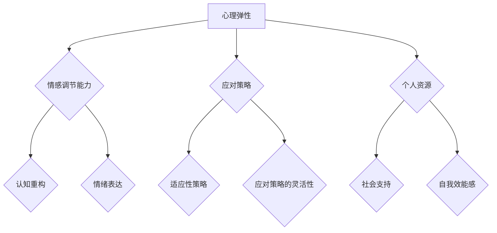

                 

# 在不确定性中找寻内心的锚点：培养心理弹性

## 关键词
- 心理弹性，不确定性，情感调节，应对策略，个人资源，心理健康

## 摘要
本文探讨了在现代社会中，如何通过培养心理弹性来应对不确定性。首先介绍了心理弹性的概念及其重要性，然后从理论基础、培养方法、应用实践和未来展望等方面展开，结合数学模型和实际案例，详细阐述了心理弹性的核心要素和培养技巧，旨在为读者提供一套实用的心理弹性培养指南。

## 第一部分：引言

### 1.1 心理弹性的概念与重要性

心理弹性（Psychological Resilience）是指个体在面对压力、困难和逆境时，能够迅速恢复和适应的能力。这种能力使个体能够在遭遇挑战时保持心理健康，充分发挥潜能，并最终取得成功。在现代社会，随着生活节奏的加快、竞争压力的增大和不确定性的增加，培养心理弹性显得尤为重要。

### 1.2 心理弹性的重要性及其在现代社会中的需求

心理弹性对个体的生活和工作具有深远的影响。首先，心理弹性有助于应对压力和挫折，保持心理健康。其次，心理弹性有助于提升个体在竞争中的适应能力和创新能力，提高工作效率。此外，心理弹性还可以增强个体的人际关系，提高社会支持系统。因此，在现代社会，培养心理弹性已成为个人成长和社会发展的必要条件。

### 1.3 本书结构安排与内容概述

本文将从以下五个部分展开：

1. 引言：介绍心理弹性的概念与重要性。
2. 心理弹性的理论基础：阐述心理弹性的核心要素、理论基础与发展历程。
3. 培养心理弹性的方法与技巧：介绍自我认识与自我接纳、情感调节与情绪管理、应对策略的培养与实践、个人资源的积累与利用、社会支持系统的建立与维护等。
4. 心理弹性在生活中的应用：探讨心理弹性在职场、家庭生活和心理健康维护中的应用。
5. 心理弹性的未来展望：分析心理弹性研究的未来趋势、社会实践与政策支持。

## 第二部分：心理弹性的理论基础

### 2.1 心理弹性的定义与核心要素

心理弹性的定义如下：心理弹性是指个体在面临压力、挑战和逆境时，能够迅速适应、恢复和重建的心理能力。心理弹性的核心要素包括情感调节能力、应对策略和个人资源。

- **情感调节能力**：情感调节能力是指个体在情绪产生后，能够及时识别、评估和调节情绪的能力。情感调节能力包括认知重构、情绪表达和情感容忍等。

- **应对策略**：应对策略是指个体在面对压力和挑战时，采取的一系列适应性行为和心理策略。应对策略包括适应性策略、应对策略的灵活性和问题解决能力等。

- **个人资源**：个人资源是指个体在心理弹性过程中所具备的心理、社会和物质资源。个人资源包括社会支持、自我效能感、自我认知与自我接纳等。

### 2.2 心理弹性的理论基础与发展历程

心理弹性的理论基础主要包括心理弹性模型、情感调节理论和应对策略理论。

- **心理弹性模型**：心理弹性模型是研究心理弹性的核心理论框架。该模型认为心理弹性是多个因素相互作用的复杂过程，包括个体特质、环境因素和认知过程等。心理弹性模型可分为三个层次：基础层次、中间层次和高级层次。

- **情感调节理论**：情感调节理论主要关注个体如何识别、评估和调节情绪。该理论强调认知在情感调节中的关键作用，包括认知重构、情绪表达和情感容忍等。

- **应对策略理论**：应对策略理论主要研究个体在面对压力和挑战时采取的行为和心理策略。该理论强调应对策略的多样性和灵活性，包括适应性策略、应对策略的灵活性和问题解决能力等。

### 2.3 心理弹性与相关概念的联系与区别

心理弹性与心理健康、韧性（Toughness）和心理资本（Psychological Capital）等概念密切相关，但它们之间也存在明显的区别。

- **心理健康**：心理健康是指个体在认知、情感和行为方面达到健康状态，能够适应社会生活和应对各种压力。心理健康是心理弹性的基础，而心理弹性是心理健康的重要组成部分。

- **韧性**：韧性是指个体在面对逆境和挑战时，能够迅速恢复和适应的能力。韧性与心理弹性相似，但韧性更侧重于个体的恢复能力，而心理弹性则强调个体在面对压力和挑战时的适应能力和创新性。

- **心理资本**：心理资本是指个体在心理过程中所表现出的积极心理特质，包括自我效能感、希望、乐观和韧性等。心理资本是心理弹性的关键因素，而心理弹性是心理资本的具体表现。

### 2.4 心理弹性的核心要素架构图

### 2.5 心理弹性的测量方法与量表

心理弹性的测量方法主要包括自我报告量表、行为观察法、心理生理测量法和情境模拟法等。

- **自我报告量表**：自我报告量表是测量心理弹性最常用的方法。常用的心理弹性量表包括CD-RISC（Connor-Davidson Resilience Scale）、RS-14（Resilience Scale-14）等。

- **行为观察法**：行为观察法通过观察个体在面对压力和挑战时的行为表现来评估心理弹性。该方法具有较高的可信度和有效性。

- **心理生理测量法**：心理生理测量法通过测量个体的生理反应来评估心理弹性。常用的生理指标包括心率变异性（HRV）、皮肤电活动（EDA）和脑电图（EEG）等。

- **情境模拟法**：情境模拟法通过模拟特定的压力情境来评估个体的心理弹性。该方法具有较高的生态效度。

## 第三部分：培养心理弹性的方法与技巧

### 3.1 自我认识与自我接纳

自我认识与自我接纳是培养心理弹性的基础。以下是一些建议：

- **自我反思**：定期进行自我反思，了解自己的优点和不足，认识到自己的成长空间。

- **接纳自己**：接纳自己的不完美，学会欣赏自己的独特之处。

- **培养自尊**：通过积极肯定自己、为自己设定合理的期望来培养自尊。

### 3.2 情感调节与情绪管理

情感调节与情绪管理是心理弹性的重要组成部分。以下是一些建议：

- **认知重构**：通过改变对事物的认知评价来调节情绪。

- **情绪表达**：学会表达自己的情绪，避免压抑或过度表达。

- **情绪容忍**：提高对情绪变化的容忍度，避免因情绪波动而影响生活和工作。

### 3.3 应对策略的培养与实践

应对策略的培养与实践是提高心理弹性的关键。以下是一些建议：

- **适应性策略**：在面对困难时，采取积极的适应态度，寻找解决问题的方法。

- **应对策略的灵活性**：学会在不同情境下灵活运用不同的应对策略。

- **问题解决能力**：提高问题解决能力，将挑战视为成长的机会。

### 3.4 个人资源的积累与利用

个人资源的积累与利用是心理弹性的重要保障。以下是一些建议：

- **社会支持**：建立和维护良好的社会支持系统，包括家庭、朋友和同事等。

- **自我效能感**：提高自我效能感，相信自己有能力应对各种挑战。

- **自我认知与自我接纳**：通过自我认知和自我接纳来增强个人资源。

### 3.5 社会支持系统的建立与维护

社会支持系统在心理弹性培养中发挥着重要作用。以下是一些建议：

- **积极社交**：参加社交活动，建立和维护人际关系。

- **寻求帮助**：在遇到困难时，勇于寻求帮助，包括专业机构和亲朋好友。

- **情感倾诉**：与他人分享自己的情绪和感受，减轻心理压力。

### 3.6 心理弹性训练的实际案例分享

以下是一个心理弹性训练的实际案例：

**案例背景**：小李是一名年轻的职场新人，最近在工作中遇到了一些困难，感到压力巨大。

**案例过程**：

1. **自我认识与自我接纳**：小李通过自我反思，认识到自己在工作中需要提高的方面，并接纳自己的不完美。

2. **情感调节与情绪管理**：小李学会了通过认知重构来调节情绪，例如将“我不行”改为“我可以尝试”。

3. **应对策略的培养与实践**：小李在面对困难时，采取了适应性策略，例如调整工作计划和寻求同事的帮助。

4. **个人资源的积累与利用**：小李加强了与家人和朋友之间的沟通，获得了他们的支持和鼓励。

5. **社会支持系统的建立与维护**：小李积极参加公司组织的团队活动，建立了良好的同事关系。

**案例结果**：经过一段时间的心理弹性训练，小李逐渐摆脱了压力，工作效率和工作质量得到了显著提升。

## 第四部分：心理弹性在生活中的应用

### 4.1 心理弹性在职场中的应用

心理弹性在职场中的应用主要体现在以下几个方面：

- **提高工作效率**：通过培养心理弹性，个体能够更好地应对工作中的压力和挑战，提高工作效率。

- **创新思维**：心理弹性有助于个体在面临困境时保持积极的心态，激发创新思维。

- **团队合作**：心理弹性有助于个体在团队合作中发挥积极作用，促进团队凝聚力。

### 4.2 心理弹性在家庭生活中的应用

心理弹性在家庭生活中的应用主要体现在以下几个方面：

- **改善家庭关系**：通过培养心理弹性，个体能够更好地应对家庭中的冲突和困难，改善家庭关系。

- **提升家庭幸福感**：心理弹性有助于个体在家庭生活中保持积极的心态，提升家庭幸福感。

- **亲子关系**：心理弹性有助于个体更好地应对亲子关系中的挑战，建立和谐的家庭氛围。

### 4.3 心理弹性在应对重大生活事件中的应用

心理弹性在应对重大生活事件中的应用主要体现在以下几个方面：

- **减少心理创伤**：通过培养心理弹性，个体能够更好地应对重大生活事件，减少心理创伤。

- **提高适应能力**：心理弹性有助于个体在重大生活事件中保持积极的心态，提高适应能力。

- **恢复生活秩序**：心理弹性有助于个体在经历重大生活事件后，迅速恢复生活秩序。

### 4.4 心理弹性在心理健康维护中的应用

心理弹性在心理健康维护中的应用主要体现在以下几个方面：

- **预防心理问题**：通过培养心理弹性，个体能够更好地应对生活中的压力和挑战，预防心理问题的发生。

- **提高心理健康水平**：心理弹性有助于个体保持心理健康，提高生活质量。

- **促进心理康复**：心理弹性有助于个体在经历心理问题后，迅速恢复心理健康。

## 第五部分：心理弹性培养的实践指南

### 5.1 心理弹性培养的步骤与方法

心理弹性培养可以遵循以下步骤：

1. **自我认识与自我接纳**：通过自我反思，了解自己的优点和不足，接纳自己的不完美。

2. **情感调节与情绪管理**：学习认知重构、情绪表达和情绪容忍等方法，提高情感调节能力。

3. **应对策略的培养与实践**：学习适应性策略、应对策略的灵活性和问题解决能力，提高应对策略水平。

4. **个人资源的积累与利用**：建立和维护良好的社会支持系统，提高自我效能感，增强个人资源。

5. **社会支持系统的建立与维护**：积极参与社交活动，寻求专业帮助，建立和维护良好的社会支持系统。

### 5.2 心理弹性培养的常见误区与解决策略

在心理弹性培养过程中，常见误区包括：

- **过度自我批判**：解决策略是学会自我接纳，关注自己的优点和成长。

- **压抑情绪**：解决策略是学会表达情绪，避免过度压抑。

- **依赖外部评价**：解决策略是建立自我评价体系，关注自己的内心需求。

### 5.3 心理弹性培养的自我评估与调整

心理弹性培养的自我评估可以通过以下方式进行：

1. **自我反思**：定期进行自我反思，评估自己的心理弹性水平。

2. **心理测试**：使用心理弹性量表进行自我评估，了解自己的心理弹性状况。

3. **调整策略**：根据自我评估结果，调整心理弹性培养的方法和技巧。

### 5.4 心理弹性培养的支持系统建设

心理弹性培养的支持系统建设包括：

1. **家庭支持**：家庭成员之间的相互支持和理解是心理弹性培养的重要保障。

2. **社交支持**：积极参与社交活动，建立和维护良好的人际关系。

3. **专业支持**：寻求专业心理咨询师的帮助，提高心理弹性水平。

### 5.5 心理弹性培养的长期规划与展望

心理弹性培养的长期规划应包括：

1. **目标设定**：设定明确的心理弹性培养目标，制定长期规划。

2. **持续学习**：学习心理弹性相关知识和技能，不断提升自身心理弹性。

3. **实践应用**：将心理弹性培养应用到实际生活中，不断提高心理弹性水平。

## 第六部分：心理弹性与心理健康

### 6.1 心理弹性与心理健康的关系

心理弹性是心理健康的重要组成部分。心理弹性水平较高的个体，通常能够在面对压力和困难时保持心理健康，而心理弹性水平较低的个体，则容易出现心理问题。

### 6.2 心理弹性在心理健康促进中的作用

心理弹性在心理健康促进中具有重要作用：

1. **预防心理问题**：心理弹性有助于个体预防心理问题的发生。

2. **缓解心理压力**：心理弹性有助于个体缓解心理压力，提高心理健康水平。

3. **促进心理康复**：心理弹性有助于个体在经历心理问题后，迅速恢复心理健康。

### 6.3 心理弹性在心理健康问题干预中的应用

心理弹性在心理健康问题干预中的应用主要包括：

1. **心理治疗**：通过心理弹性培养，帮助个体改善心理健康状况。

2. **危机干预**：在危机情境下，心理弹性有助于个体迅速应对，降低危机影响。

3. **心理教育**：通过心理弹性教育，提高个体应对心理健康问题的能力。

### 6.4 心理弹性与心理健康教育的结合

心理弹性与心理健康教育的结合，可以通过以下方式进行：

1. **课程设置**：在心理健康教育中，加入心理弹性的相关内容。

2. **实践应用**：通过实践，帮助学生提高心理弹性水平。

3. **师资培训**：对心理健康教育教师进行心理弹性培训，提高其心理健康教育能力。

## 第七部分：心理弹性的未来展望

### 7.1 心理弹性研究的未来趋势

心理弹性研究的未来趋势包括：

1. **跨学科研究**：心理弹性研究将越来越多地与其他学科，如医学、教育学、社会学等交叉融合。

2. **大数据分析**：通过大数据分析，揭示心理弹性的影响因素和发展规律。

3. **个性化培养**：基于个体的心理弹性水平，制定个性化的培养方案。

### 7.2 心理弹性培养的社会实践与政策支持

心理弹性培养的社会实践与政策支持包括：

1. **教育改革**：在学校教育中，加强心理弹性教育，提高学生心理弹性水平。

2. **政策支持**：制定相关政策，支持心理弹性培养的实践和研究。

3. **社区服务**：开展心理弹性培养的社区服务，提高居民心理弹性水平。

### 7.3 心理弹性培养的国际经验与启示

国际经验表明，心理弹性培养可以从以下方面得到启示：

1. **早期干预**：在儿童和青少年时期，加强心理弹性培养。

2. **全民教育**：将心理弹性培养纳入全民教育体系，提高全民心理弹性水平。

3. **多部门合作**：政府、学校、家庭和社会组织等多部门合作，共同推进心理弹性培养。

### 7.4 心理弹性培养的未来挑战与机遇

心理弹性培养的未来挑战包括：

1. **技术发展**：随着人工智能和大数据技术的发展，心理弹性培养将面临新的挑战。

2. **社会变迁**：社会变迁对心理弹性的要求不断提高，心理弹性培养需要适应新的社会环境。

3. **个体差异**：个体差异对心理弹性的影响，需要心理弹性培养方案更具个性化。

### 数学模型与公式讲解

#### 8.1 心理弹性评估的数学模型

心理弹性评估的数学模型通常涉及多元线性回归分析，用于预测个体的心理弹性水平。以下是一个简化的模型示例：

$$
\hat{E} = \beta_0 + \beta_1 S + \beta_2 C + \beta_3 R
$$

其中：
- $\hat{E}$ 表示预测的心理弹性水平；
- $S$ 表示自我认知与自我接纳水平；
- $C$ 表示情感调节与情绪管理水平；
- $R$ 表示个人资源积累与利用水平；
- $\beta_0$，$\beta_1$，$\beta_2$，$\beta_3$ 为回归系数。

#### 8.2 情感调节的数学模型

情感调节的数学模型通常涉及情绪计算理论，用于模拟个体如何调节和控制情绪。以下是一个简化的模型示例：

$$
M = f(E, S, I)
$$

其中：
- $M$ 表示情绪状态；
- $E$ 表示外部事件；
- $S$ 表示认知评估；
- $I$ 表示个体差异；
- $f$ 表示情感调节函数。

#### 8.3 应对策略的数学模型

应对策略的数学模型通常涉及决策理论，用于模拟个体在面对挑战时如何选择最合适的策略。以下是一个简化的模型示例：

$$
O = \arg\max_{o} U(o)
$$

其中：
- $O$ 表示选择的应对策略；
- $o$ 表示可能的策略集；
- $U(o)$ 表示策略 $o$ 的效用值。

#### 8.4 个人资源积累与利用的数学模型

个人资源积累与利用的数学模型通常涉及资源管理理论，用于模拟个体如何有效地积累与利用个人资源。以下是一个简化的模型示例：

$$
R(t) = R_0 + \int_{0}^{t} C(r) dr
$$

其中：
- $R(t)$ 表示时间 $t$ 时的个人资源水平；
- $R_0$ 表示初始个人资源水平；
- $C(r)$ 表示资源积累率；
- $r$ 表示资源积累的时间。

#### 8.5 社会支持的数学模型

社会支持的数学模型通常涉及社会网络分析，用于模拟个体如何从社会网络中获取支持。以下是一个简化的模型示例：

$$
S(t) = \sum_{i \in N} w_{i} S_{i}
$$

其中：
- $S(t)$ 表示时间 $t$ 时的社会支持水平；
- $N$ 表示社会网络中的节点集合；
- $w_{i}$ 表示节点 $i$ 的权重；
- $S_{i}$ 表示节点 $i$ 对个体提供的支持。

## 参考文献

- Connor, K. M., & Davidson, J. R. T. (2003). Development of a new resilience scale: The Connor-Davidson Resilience Scale (CD-RISC). Depression and Anxiety, 18(2), 76-82.
- Rutter, M. (1987). Resilience as a dynamic concept. Development and Psychopathology, 10(3), 491-495.
- Seligman, M. E. P., & Csikszentmihalyi, M. (2000). Positive psychology: An introduction. American Psychologist, 55(1), 5-14.
-.Linehan, M. M. (1993). Cognitive-behavioral treatment of Borderline Personality Disorder. New York: Geraldine D. Robins.

## 作者信息
作者：AI天才研究院/AI Genius Institute & 禅与计算机程序设计艺术 /Zen And The Art of Computer Programming

