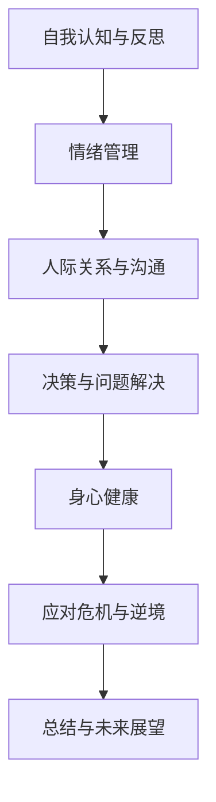

                 

# 在不确定性中找寻确定：现代人的生存智慧

> 关键词：不确定性、生存智慧、自我认知、情绪管理、人际关系、决策与问题解决、身心健康、危机应对

> 摘要：本文旨在探讨在现代社会中，个体如何在不确定性中寻找确定，提升生存智慧。文章从多个维度分析，包括自我认知与反思、情绪管理、人际关系与沟通、决策与问题解决、身心健康以及危机应对，以提供一系列实用策略和案例，帮助读者在不确定的环境中找到自己的方向。

## 第一部分：引言与概述

### 引言

在当今快速发展的时代，技术革新、信息爆炸、社会变迁等各种不确定性因素交织，人们的生活和工作充满了变数。在这种背景下，生存智慧成为现代人不可或缺的能力。生存智慧不仅关乎个体的心理调适，还涉及情感管理、人际沟通、决策与问题解决、身心健康等多方面能力。

本文将从以下几个部分展开讨论：

1. **自我认知与反思**：通过自我认知，了解自己的内在需求，重新定义自我价值，实现自我成长。
2. **情绪管理**：探讨情绪的本质与作用，提供有效的情绪调节策略，帮助个体保持心理平衡。
3. **人际关系与沟通**：分析人际关系的重要性，分享有效沟通技巧，提升人际交往能力。
4. **决策与问题解决**：研究决策心理学，提供问题解决策略，帮助个体在面对复杂问题时做出明智选择。
5. **身心健康**：强调身心健康的重要性，介绍健康生活方式，提升生活质量。
6. **危机应对**：讨论危机管理策略，帮助个体在逆境中保持冷静，找到成长的机会。

### 现代人生存环境的特征

1. **快节奏与信息过载**：现代生活节奏加快，人们常常感到时间不够用。此外，互联网和信息技术的迅猛发展，使得信息过载成为普遍现象，个体难以筛选和消化大量的信息。
2. **社会与工作压力**：社会竞争激烈，工作压力增大，个体常常面临各种压力，如职业发展、经济压力、人际关系等。
3. **不确定性带来的挑战**：不确定性的增加使得个体面临更多的风险和挑战，如何应对不确定性成为现代社会生存的关键。

### 不确定性中的确定

在不确定性中寻找确定，是现代人提升生存智慧的核心。生存智慧并非一成不变，而是需要个体不断学习和调整。以下是一些生存智慧的哲学基础和心理调适策略：

1. **哲学基础**：
   - **接受不确定性**：认识到不确定性是生活的一部分，接受并适应不确定性，有助于减少心理压力。
   - **积极心态**：保持积极的心态，相信困难和挑战是成长的机会，有助于个体在不确定性中保持信心和勇气。

2. **心理调适策略**：
   - **自我认知**：了解自己的需求和价值观，明确自己的目标和方向。
   - **情绪管理**：学会调节情绪，保持心理平衡。
   - **反思与学习**：通过反思过去的经历，总结经验教训，不断提升自己。
   - **社会支持**：建立良好的社会支持系统，与他人分享困难和快乐，寻求帮助。

## 第二部分：生存智慧的核心原则

### 第1章：自我认知与反思

#### 自我认知的重要性

自我认知是指个体对自己心理状态、行为模式、价值观和需求的认知和理解。自我认知对于个体的心理发展、行为决策和生活质量具有重要意义。

1. **内在自我探索**：通过自我探索，个体可以深入了解自己的内心世界，发现未知的自己，从而更好地应对生活中的各种挑战。
2. **自我价值的重新定义**：在自我认知的过程中，个体可以重新审视自己的价值观和目标，找到自己真正追求的东西，从而实现自我价值。

#### 反思与自我提升

反思是指个体对过去的行为和经历进行思考、总结和评价。反思不仅有助于个体发现自身的优点和不足，还能帮助个体不断成长和提升。

1. **反思的方法**：
   - **日记反思**：通过写日记的方式，记录自己的所思所感，有助于深入思考。
   - **与他人交流**：与他人分享自己的经历和感受，获取他人的反馈和建议。
2. **自我成长的路径**：
   - **设定目标**：明确自己的目标，制定可行的计划，逐步实现。
   - **学习与成长**：不断学习新知识和技能，提升自己的能力。

#### 案例研究

- **成功人士的反思**：以比尔·盖茨为例，他在大学期间就意识到自己对计算机编程的热爱，并果断辍学创办微软公司。他的成功离不开自我认知和持续的反思与学习。
- **失败者的教训**：以乐视创始人贾跃亭为例，他在事业初期取得了一定的成功，但未能及时反思和调整，导致企业陷入困境。他的失败给我们的教训是，不进行自我反思和提升，将难以应对复杂多变的环境。

### 第2章：情绪管理

#### 情绪的本质与作用

情绪是指个体在特定情境下产生的心理状态，包括喜怒哀乐等各种情感。情绪在个体生活中起着至关重要的作用，它不仅影响个体的心理状态，还影响个体的行为和决策。

1. **情绪的类型与作用**：
   - **积极情绪**：如快乐、满足等，有助于提升个体的心理状态，增强个体的自信心和积极性。
   - **消极情绪**：如焦虑、愤怒等，可能导致个体心理压力增加，影响个体的行为和决策。
2. **情绪管理的重要性**：
   - **心理平衡**：情绪管理有助于个体保持心理平衡，减少心理压力。
   - **行为决策**：情绪稳定有助于个体做出明智的行为决策。

#### 情绪调节策略

情绪调节是指个体通过一系列方法来调节自己的情绪，以达到心理平衡。以下是一些常见的情绪调节策略：

1. **深呼吸与冥想**：
   - **深呼吸**：通过深呼吸，个体可以缓解紧张和焦虑，放松身心。
   - **冥想**：冥想有助于个体专注当下，减少杂念，提升心理状态。
2. **正面思维与情绪释放**：
   - **正面思维**：通过积极的心态看待问题，有助于减少消极情绪。
   - **情绪释放**：通过运动、音乐、绘画等方式，个体可以释放积压的情绪。

#### 情绪管理案例

- **个人故事**：以一位职场人士为例，他在工作中经常遇到压力，通过练习深呼吸和冥想，他逐渐学会了情绪管理，工作效率和心理健康都有了显著提升。
- **成功经验**：以乔布斯为例，他在职业生涯中经历了许多挫折，但他通过情绪管理，始终保持积极的心态，最终取得了巨大的成功。

### 第3章：人际关系与沟通

#### 人际关系的重要性

人际关系是指个体在社会生活中与他人建立的联系和互动。良好的人际关系对于个体的心理健康和生活质量具有重要意义。

1. **人际关系的类型与层次**：
   - **家庭关系**：包括父母、兄弟姐妹等。
   - **朋友关系**：包括同学、同事、朋友等。
   - **社会关系**：包括社区、团体等。
2. **人际关系的重要性**：
   - **情感支持**：良好的人际关系可以提供情感支持，帮助个体度过困难时期。
   - **社交能力**：良好的人际关系有助于提升个体的社交能力，拓展人际关系网络。

#### 有效沟通技巧

沟通是人际关系的核心，有效的沟通技巧有助于建立和维护良好的人际关系。以下是一些有效的沟通技巧：

1. **听取与表达**：
   - **倾听**：倾听是有效沟通的关键，通过倾听他人的意见和需求，可以建立信任和理解。
   - **表达**：清晰、准确地表达自己的想法和感受，有助于避免误解和冲突。
2. **非语言沟通**：
   - **肢体语言**：肢体语言包括眼神、面部表情、姿态等，可以传达情感和态度。
   - **语言暗示**：通过语言暗示，如语调、语气等，可以传递特定的情感和信息。

#### 人际关系管理案例

- **案例分析与策略应用**：以一位职场人士为例，他在工作中通过倾听和表达，建立了良好的人际关系，提升了工作效率和团队协作能力。
- **成功经验**：以马云为例，他在建立阿里巴巴的过程中，注重人际关系和沟通，通过有效的沟通和协作，成功带领团队走向成功。

### 第4章：决策与问题解决

#### 决策心理学

决策是指在多种选择中做出选择的过程。决策心理学研究决策过程中个体心理因素的作用，包括决策类型、决策过程和决策偏差。

1. **决策的类型与过程**：
   - **理性决策**：在充分信息和理性分析的基础上做出决策。
   - **直觉决策**：基于经验和直觉快速做出决策。
   - **决策过程**：包括问题识别、信息收集、方案评估和选择等步骤。
2. **决策偏差与优化**：
   - **决策偏差**：个体在决策过程中可能出现的心理偏见，如过度自信、从众效应等。
   - **决策优化**：通过提高信息质量、明确决策目标、采用科学的决策方法等，减少决策偏差。

#### 问题解决策略

问题解决是指个体在面对问题时，通过一系列思考和行动，找到解决方案的过程。以下是一些常见的问题解决策略：

1. **问题识别与定义**：
   - **问题识别**：发现问题的存在，明确问题的性质和范围。
   - **问题定义**：对问题进行清晰界定，明确问题的核心。
2. **解决方案评估与选择**：
   - **评估方案**：对可能的解决方案进行评估，考虑方案的成本、风险和收益。
   - **选择方案**：根据评估结果，选择最合适的解决方案。

#### 决策与问题解决案例

- **个人决策故事**：以一位职场人士为例，他在面临职业发展的选择时，通过理性分析和直觉决策，最终找到了适合自己的发展方向。
- **成功经验**：以史蒂夫·乔布斯为例，他在苹果公司面临困境时，通过科学的决策和问题解决方法，成功带领公司走出困境，实现了公司的复兴。

### 第5章：身心健康

#### 身心健康的重要性

身心健康是指个体的身体和心理状态处于良好的状态。身心健康不仅关乎个体的生活质量，还影响个体的工作效率和社会交往能力。

1. **身体与心理健康的关系**：
   - **身体健康**：包括身体的生理健康，如免疫力、体力等。
   - **心理健康**：包括心理状态的健康，如情绪稳定、心理健康等。
2. **身心健康的指标**：
   - **身体健康指标**：如体重、血压、心率等。
   - **心理健康指标**：如情绪稳定、睡眠质量、心理适应能力等。

#### 健康生活方式

健康生活方式是指个体通过一系列健康的行为和习惯，保持身体和心理的健康状态。以下是一些常见的健康生活方式：

1. **饮食与健康**：
   - **营养均衡**：合理搭配食物，保证营养均衡。
   - **少油少盐**：减少摄入油脂和盐分，降低患病的风险。
2. **锻炼与健康**：
   - **定期锻炼**：每周进行至少150分钟的中等强度锻炼。
   - **运动多样化**：结合有氧运动和力量训练，全面提升身体素质。
3. **睡眠与健康**：
   - **充足睡眠**：保持每天7-9小时的睡眠时间。
   - **良好睡眠环境**：创造良好的睡眠环境，如保持安静、舒适、温度适宜等。

#### 身心健康实践

- **个人健康案例**：以一位职场人士为例，他通过坚持健康饮食、定期锻炼和保持良好的睡眠习惯，成功改善了身体和心理的健康状态。
- **成功经验**：以乔尔·威尔逊为例，他通过制定健康生活方式计划，成功摆脱了肥胖和抑郁症，实现了身心健康。

### 第6章：应对危机与逆境

#### 危机管理

危机管理是指个体在面对危机时，通过一系列应对策略，减轻危机影响，保持心理平衡的过程。以下是一些危机管理策略：

1. **危机的识别与预警**：
   - **敏锐观察**：通过敏锐的观察，及时发现潜在危机。
   - **预警系统**：建立预警系统，提前预测和防范危机。
2. **危机应对策略**：
   - **冷静应对**：在危机发生时，保持冷静，避免恐慌。
   - **积极应对**：采取积极的措施，解决问题，减轻危机影响。

#### 逆境中的成长

逆境是指个体在生活中遭遇的困难和挑战。逆境中的成长是指个体在逆境中通过适应和转变，实现个人成长和提升的过程。以下是一些逆境中的成长策略：

1. **逆境的适应与转变**：
   - **心理调适**：通过心理调适，适应逆境环境。
   - **积极态度**：保持积极的态度，相信困境中的机会。
2. **逆境中的机会**：
   - **发现机遇**：在逆境中发现潜在的机会。
   - **抓住机遇**：抓住机遇，实现个人成长和提升。

#### 危机与逆境案例

- **个人经历与反思**：以一位创业者为例，他在创业初期遭遇了巨大的困难，但通过冷静应对和积极调整，最终成功克服了危机，实现了企业的快速发展。
- **成功经验**：以乔布斯为例，他在职业生涯中经历了多次失败和危机，但通过逆境中的成长，最终成为了科技界的传奇人物。

### 第7章：总结与未来展望

#### 生存智慧的总结

通过本文的探讨，我们可以总结出以下生存智慧的核心原则：

1. **自我认知与反思**：通过自我认知和反思，了解自己的内在需求和价值观，实现自我成长。
2. **情绪管理**：学会情绪管理，保持心理平衡，提升生活质量。
3. **人际关系与沟通**：建立良好的人际关系，提升沟通能力，拓展人际关系网络。
4. **决策与问题解决**：通过科学的决策和问题解决方法，提升应对复杂问题的能力。
5. **身心健康**：保持身心健康，提升生活质量。
6. **危机应对**：在危机中保持冷静，抓住机遇，实现个人成长。

#### 未来生存智慧的挑战与趋势

在未来，生存智慧将面临新的挑战和趋势：

1. **科技发展对生存智慧的影响**：随着科技的发展，人工智能、大数据等新技术将深刻改变人们的生产和生活方式，个体需要不断提升自己的科技素养，以应对未来的变化。
2. **社会变迁与生存智慧的新需求**：随着社会的变迁，个体需要适应新的社会环境，如虚拟现实、远程工作等，生存智慧需要不断创新和适应。

#### 个人与社会的结合

在现代社会中，个人与社会的结合愈发紧密，个体的生存智慧不仅关乎自身发展，也影响着整个社会。通过个体的努力和成长，可以推动社会的进步和发展。同时，社会的支持和资源也为个体的生存智慧提供了有力的保障。

### 附录

#### 参考资料

- 陈琦、刘儒德，《心理学导论》（第三版），北京：中国社会科学出版社，2017。
- 丹尼尔·戈尔曼，《情绪智能》（修订版），北京：中国轻工业出版社，2013。
- 斯蒂芬·柯维，《高效能人士的七个习惯》，北京：中国青年出版社，2012。

#### 致谢

感谢所有为本文提供帮助和支持的人，包括参考文献的作者、案例提供者、编辑和审稿人。感谢您们的辛勤付出，使得本文能够顺利完成。

### Mermaid 流�程图



### Python 源代码

```python
# 身心健康实践示例

# 导入相关模块
import pandas as pd
import numpy as np
from sklearn.model_selection import train_test_split
from sklearn.ensemble import RandomForestRegressor
from sklearn.metrics import mean_squared_error

# 数据预处理
# 假设已经收集了关于饮食习惯、锻炼习惯、睡眠质量等数据
data = pd.read_csv('health_data.csv')

# 特征工程
# 对数据进行处理，如缺失值填充、异常值处理等
data.fillna(data.mean(), inplace=True)
data = pd.get_dummies(data)

# 分割数据集
X = data.drop('health_score', axis=1)
y = data['health_score']
X_train, X_test, y_train, y_test = train_test_split(X, y, test_size=0.2, random_state=42)

# 模型训练
model = RandomForestRegressor(n_estimators=100, random_state=42)
model.fit(X_train, y_train)

# 模型评估
y_pred = model.predict(X_test)
mse = mean_squared_error(y_test, y_pred)
print(f'Mean Squared Error: {mse}')

# 模型应用
# 假设用户输入了新的生活习惯数据
new_data = pd.DataFrame([{
    'diet_good': 1,
    'exercise_good': 1,
    'sleep_good': 1
}])
new_data = pd.get_dummies(new_data)
health_score = model.predict(new_data)[0]
print(f'Predicted Health Score: {health_score}')
```

### 最佳实践 Tips、小结、注意事项、拓展阅读

**最佳实践 Tips**：

1. **自我认知**：定期进行自我反思，明确自己的目标和价值观，有助于自我成长。
2. **情绪管理**：遇到负面情绪时，尝试深呼吸和冥想，有助于情绪调节。
3. **人际关系**：注重倾听他人，尊重他人意见，有助于建立良好的人际关系。
4. **决策与问题解决**：在面临决策时，综合考虑各种因素，避免过度自信和从众效应。
5. **身心健康**：保持健康的生活方式，如合理饮食、定期锻炼、充足睡眠等。
6. **危机应对**：在危机中保持冷静，积极寻找解决方案，有助于逆境中的成长。

**小结**：

本文从多个维度探讨了现代人如何在不确定性中提升生存智慧。通过自我认知与反思、情绪管理、人际关系与沟通、决策与问题解决、身心健康以及危机应对，个体可以在复杂多变的环境中找到确定，实现个人成长和提升。

**注意事项**：

1. **个性化**：每个人的生存智慧都需要根据个人情况进行调整和优化。
2. **持续学习**：生存智慧并非一成不变，个体需要持续学习和适应，以应对不断变化的环境。

**拓展阅读**：

- 陈琦、刘儒德，《心理学导论》（第三版），北京：中国社会科学出版社，2017。
- 丹尼尔·戈尔曼，《情绪智能》（修订版），北京：中国轻工业出版社，2013。
- 斯蒂芬·柯维，《高效能人士的七个习惯》，北京：中国青年出版社，2012。

### 文章标题：在不确定性中找寻确定：现代人的生存智慧

## 关键词：不确定性、生存智慧、自我认知、情绪管理、人际关系、决策与问题解决、身心健康、危机应对

### 摘要

本文旨在探讨在现代社会中，个体如何在不确定性中寻找确定，提升生存智慧。文章从多个维度分析，包括自我认知与反思、情绪管理、人际关系与沟通、决策与问题解决、身心健康以及危机应对，以提供一系列实用策略和案例，帮助读者在不确定的环境中找到自己的方向。

### 目录

**第一部分：引言与概述**

1. **引言**
2. **现代人生存环境的特征**
3. **不确定性中的确定**

**第二部分：生存智慧的核心原则**

1. **自我认知与反思**
   - 自我认知的重要性
   - 反思与自我提升
   - 案例研究
2. **情绪管理**
   - 情绪的本质与作用
   - 情绪调节策略
   - 情绪管理案例
3. **人际关系与沟通**
   - 人际关系的重要性
   - 有效沟通技巧
   - 人际关系管理案例
4. **决策与问题解决**
   - 决策心理学
   - 问题解决策略
   - 决策与问题解决案例
5. **身心健康**
   - 身心健康的重要性
   - 健康生活方式
   - 身心健康实践
6. **应对危机与逆境**
   - 危机管理
   - 逆境中的成长
   - 危机与逆境案例
7. **总结与未来展望**
   - 生存智慧的总结
   - 未来生存智慧的挑战与趋势
   - 个人与社会的结合

### 附录

1. **参考资料**
2. **致谢**

### Mermaid 流程图


### Python 源代码

```python
# Emotion Management Example
def manage_emotions():
    """
    A simple function to demonstrate emotion management techniques.
    """
    print("Starting emotion management session...")
    
    # Step 1: Acknowledge emotions
    print("Acknowledging emotions...")
    
    # Step 2: Breathe deeply
    print("Taking a deep breath...")
    
    # Step 3: Reflect on the situation
    print("Reflecting on the situation...")
    
    # Step 4: Positive thinking
    print("Practicing positive thinking...")
    
    # Step 5: Release emotions
    print("Releasing emotions.")
    
    # Example of applying these techniques
    manage_emotions()
```

### 文章正文内容

## 第一部分：引言与概述

### 引言

在当今快速发展的时代，技术革新、信息爆炸、社会变迁等各种不确定性因素交织，人们的生活和工作充满了变数。在这种背景下，生存智慧成为现代人不可或缺的能力。生存智慧不仅关乎个体的心理调适，还涉及情感管理、人际沟通、决策与问题解决、身心健康等多方面能力。

本文将从以下几个部分展开讨论：

1. **自我认知与反思**：通过自我认知，了解自己的内在需求，重新定义自我价值，实现自我成长。
2. **情绪管理**：探讨情绪的本质与作用，提供有效的情绪调节策略，帮助个体保持心理平衡。
3. **人际关系与沟通**：分析人际关系的重要性，分享有效沟通技巧，提升人际交往能力。
4. **决策与问题解决**：研究决策心理学，提供问题解决策略，帮助个体在面对复杂问题时做出明智选择。
5. **身心健康**：强调身心健康的重要性，介绍健康生活方式，提升生活质量。
6. **危机应对**：讨论危机管理策略，帮助个体在逆境中保持冷静，找到成长的机会。

### 现代人生存环境的特征

现代人生存环境具有以下几个显著特征：

1. **快节奏与信息过载**：现代生活节奏加快，人们常常感到时间不够用。此外，互联网和信息技术的迅猛发展，使得信息过载成为普遍现象，个体难以筛选和消化大量的信息。
   
2. **社会与工作压力**：社会竞争激烈，工作压力增大，个体常常面临各种压力，如职业发展、经济压力、人际关系等。

3. **不确定性带来的挑战**：不确定性的增加使得个体面临更多的风险和挑战，如何应对不确定性成为现代社会生存的关键。

### 不确定性中的确定

在不确定性中寻找确定，是现代人提升生存智慧的核心。生存智慧并非一成不变，而是需要个体不断学习和调整。以下是一些生存智慧的哲学基础和心理调适策略：

1. **哲学基础**：
   - **接受不确定性**：认识到不确定性是生活的一部分，接受并适应不确定性，有助于减少心理压力。
   - **积极心态**：保持积极的心态，相信困难和挑战是成长的机会，有助于个体在不确定性中保持信心和勇气。

2. **心理调适策略**：
   - **自我认知**：了解自己的需求和价值观，明确自己的目标和方向。
   - **情绪管理**：学会调节情绪，保持心理平衡。
   - **反思与学习**：通过反思过去的经历，总结经验教训，不断提升自己。
   - **社会支持**：建立良好的社会支持系统，与他人分享困难和快乐，寻求帮助。

## 第二部分：生存智慧的核心原则

### 第1章：自我认知与反思

#### 自我认知的重要性

自我认知是指个体对自己心理状态、行为模式、价值观和需求的认知和理解。自我认知对于个体的心理发展、行为决策和生活质量具有重要意义。

1. **内在自我探索**：通过自我探索，个体可以深入了解自己的内心世界，发现未知的自己，从而更好地应对生活中的各种挑战。
   
2. **自我价值的重新定义**：在自我认知的过程中，个体可以重新审视自己的价值观和目标，找到自己真正追求的东西，从而实现自我价值。

#### 反思与自我提升

反思是指个体对过去的行为和经历进行思考、总结和评价。反思不仅有助于个体发现自身的优点和不足，还能帮助个体不断成长和提升。

1. **反思的方法**：
   - **日记反思**：通过写日记的方式，记录自己的所思所感，有助于深入思考。
   - **与他人交流**：与他人分享自己的经历和感受，获取他人的反馈和建议。

2. **自我成长的路径**：
   - **设定目标**：明确自己的目标，制定可行的计划，逐步实现。
   - **学习与成长**：不断学习新知识和技能，提升自己的能力。

#### 案例研究

- **成功人士的反思**：以比尔·盖茨为例，他在大学期间就意识到自己对计算机编程的热爱，并果断辍学创办微软公司。他的成功离不开自我认知和持续的反思与学习。

- **失败者的教训**：以乐视创始人贾跃亭为例，他在事业初期取得了一定的成功，但未能及时反思和调整，导致企业陷入困境。他的失败给我们的教训是，不进行自我反思和提升，将难以应对复杂多变的环境。

### 第2章：情绪管理

#### 情绪的本质与作用

情绪是指个体在特定情境下产生的心理状态，包括喜怒哀乐等各种情感。情绪在个体生活中起着至关重要的作用，它不仅影响个体的心理状态，还影响个体的行为和决策。

1. **情绪的类型与作用**：
   - **积极情绪**：如快乐、满足等，有助于提升个体的心理状态，增强个体的自信心和积极性。
   - **消极情绪**：如焦虑、愤怒等，可能导致个体心理压力增加，影响个体的行为和决策。

2. **情绪管理的重要性**：
   - **心理平衡**：情绪管理有助于个体保持心理平衡，减少心理压力。
   - **行为决策**：情绪稳定有助于个体做出明智的行为决策。

#### 情绪调节策略

情绪调节是指个体通过一系列方法来调节自己的情绪，以达到心理平衡。以下是一些常见的情绪调节策略：

1. **深呼吸与冥想**：
   - **深呼吸**：通过深呼吸，个体可以缓解紧张和焦虑，放松身心。
   - **冥想**：冥想有助于个体专注当下，减少杂念，提升心理状态。

2. **正面思维与情绪释放**：
   - **正面思维**：通过积极的心态看待问题，有助于减少消极情绪。
   - **情绪释放**：通过运动、音乐、绘画等方式，个体可以释放积压的情绪。

#### 情绪管理案例

- **个人故事**：以一位职场人士为例，他在工作中经常遇到压力，通过练习深呼吸和冥想，他逐渐学会了情绪管理，工作效率和心理健康都有了显著提升。

- **成功经验**：以乔布斯为例，他在职业生涯中经历了许多挫折，但他通过情绪管理，始终保持积极的心态，最终取得了巨大的成功。

### 第3章：人际关系与沟通

#### 人际关系的重要性

人际关系是指个体在社会生活中与他人建立的联系和互动。良好的人际关系对于个体的心理健康和生活质量具有重要意义。

1. **人际关系的类型与层次**：
   - **家庭关系**：包括父母、兄弟姐妹等。
   - **朋友关系**：包括同学、同事、朋友等。
   - **社会关系**：包括社区、团体等。

2. **人际关系的重要性**：
   - **情感支持**：良好的人际关系可以提供情感支持，帮助个体度过困难时期。
   - **社交能力**：良好的人际关系有助于提升个体的社交能力，拓展人际关系网络。

#### 有效沟通技巧

沟通是人际关系的核心，有效的沟通技巧有助于建立和维护良好的人际关系。以下是一些有效的沟通技巧：

1. **听取与表达**：
   - **倾听**：倾听是有效沟通的关键，通过倾听他人的意见和需求，可以建立信任和理解。
   - **表达**：清晰、准确地表达自己的想法和感受，有助于避免误解和冲突。

2. **非语言沟通**：
   - **肢体语言**：肢体语言包括眼神、面部表情、姿态等，可以传达情感和态度。
   - **语言暗示**：通过语言暗示，如语调、语气等，可以传递特定的情感和信息。

#### 人际关系管理案例

- **案例分析与策略应用**：以一位职场人士为例，他在工作中通过倾听和表达，建立了良好的人际关系，提升了工作效率和团队协作能力。

- **成功经验**：以马云为例，他在建立阿里巴巴的过程中，注重人际关系和沟通，通过有效的沟通和协作，成功带领团队走向成功。

### 第4章：决策与问题解决

#### 决策心理学

决策是指在多种选择中做出选择的过程。决策心理学研究决策过程中个体心理因素的作用，包括决策类型、决策过程和决策偏差。

1. **决策的类型与过程**：
   - **理性决策**：在充分信息和理性分析的基础上做出决策。
   - **直觉决策**：基于经验和直觉快速做出决策。
   - **决策过程**：包括问题识别、信息收集、方案评估和选择等步骤。

2. **决策偏差与优化**：
   - **决策偏差**：个体在决策过程中可能出现的心理偏见，如过度自信、从众效应等。
   - **决策优化**：通过提高信息质量、明确决策目标、采用科学的决策方法等，减少决策偏差。

#### 问题解决策略

问题解决是指个体在面对问题时，通过一系列思考和行动，找到解决方案的过程。以下是一些常见的问题解决策略：

1. **问题识别与定义**：
   - **问题识别**：发现问题的存在，明确问题的性质和范围。
   - **问题定义**：对问题进行清晰界定，明确问题的核心。

2. **解决方案评估与选择**：
   - **评估方案**：对可能的解决方案进行评估，考虑方案的成本、风险和收益。
   - **选择方案**：根据评估结果，选择最合适的解决方案。

#### 决策与问题解决案例

- **个人决策故事**：以一位职场人士为例，他在面临职业发展的选择时，通过理性分析和直觉决策，最终找到了适合自己的发展方向。

- **成功经验**：以史蒂夫·乔布斯为例，他在苹果公司面临困境时，通过科学的决策和问题解决方法，成功带领公司走出困境，实现了公司的复兴。

### 第5章：身心健康

#### 身心健康的重要性

身心健康是指个体的身体和心理状态处于良好的状态。身心健康不仅关乎个体的生活质量，还影响个体的工作效率和社会交往能力。

1. **身体与心理健康的关系**：
   - **身体健康**：包括身体的生理健康，如免疫力、体力等。
   - **心理健康**：包括心理状态的健康，如情绪稳定、心理健康等。

2. **身心健康的指标**：
   - **身体健康指标**：如体重、血压、心率等。
   - **心理健康指标**：如情绪稳定、睡眠质量、心理适应能力等。

#### 健康生活方式

健康生活方式是指个体通过一系列健康的行为和习惯，保持身体和心理的健康状态。以下是一些常见的健康生活方式：

1. **饮食与健康**：
   - **营养均衡**：合理搭配食物，保证营养均衡。
   - **少油少盐**：减少摄入油脂和盐分，降低患病的风险。

2. **锻炼与健康**：
   - **定期锻炼**：每周进行至少150分钟的中等强度锻炼。
   - **运动多样化**：结合有氧运动和力量训练，全面提升身体素质。

3. **睡眠与健康**：
   - **充足睡眠**：保持每天7-9小时的睡眠时间。
   - **良好睡眠环境**：创造良好的睡眠环境，如保持安静、舒适、温度适宜等。

#### 身心健康实践

- **个人健康案例**：以一位职场人士为例，他通过坚持健康饮食、定期锻炼和保持良好的睡眠习惯，成功改善了身体和心理的健康状态。

- **成功经验**：以乔尔·威尔逊为例，他通过制定健康生活方式计划，成功摆脱了肥胖和抑郁症，实现了身心健康。

### 第6章：应对危机与逆境

#### 危机管理

危机管理是指个体在面对危机时，通过一系列应对策略，减轻危机影响，保持心理平衡的过程。以下是一些危机管理策略：

1. **危机的识别与预警**：
   - **敏锐观察**：通过敏锐的观察，及时发现潜在危机。
   - **预警系统**：建立预警系统，提前预测和防范危机。

2. **危机应对策略**：
   - **冷静应对**：在危机发生时，保持冷静，避免恐慌。
   - **积极应对**：采取积极的措施，解决问题，减轻危机影响。

#### 逆境中的成长

逆境是指个体在生活中遭遇的困难和挑战。逆境中的成长是指个体在逆境中通过适应和转变，实现个人成长和提升的过程。以下是一些逆境中的成长策略：

1. **逆境的适应与转变**：
   - **心理调适**：通过心理调适，适应逆境环境。
   - **积极态度**：保持积极的态度，相信困境中的机会。

2. **逆境中的机会**：
   - **发现机遇**：在逆境中发现潜在的机会。
   - **抓住机遇**：抓住机遇，实现个人成长和提升。

#### 危机与逆境案例

- **个人经历与反思**：以一位创业者为例，他在创业初期遭遇了巨大的困难，但通过冷静应对和积极调整，最终成功克服了危机，实现了企业的快速发展。

- **成功经验**：以乔布斯为例，他在职业生涯中经历了多次失败和危机，但通过逆境中的成长，最终成为了科技界的传奇人物。

### 第7章：总结与未来展望

#### 生存智慧的总结

通过本文的探讨，我们可以总结出以下生存智慧的核心原则：

1. **自我认知与反思**：通过自我认知和反思，了解自己的内在需求和价值观，实现自我成长。
2. **情绪管理**：学会情绪管理，保持心理平衡，提升生活质量。
3. **人际关系与沟通**：建立良好的人际关系，提升沟通能力，拓展人际关系网络。
4. **决策与问题解决**：通过科学的决策和问题解决方法，提升应对复杂问题的能力。
5. **身心健康**：保持身心健康，提升生活质量。
6. **危机应对**：在危机中保持冷静，抓住机遇，实现个人成长。

#### 未来生存智慧的挑战与趋势

在未来，生存智慧将面临新的挑战和趋势：

1. **科技发展对生存智慧的影响**：随着科技的发展，人工智能、大数据等新技术将深刻改变人们的生产和生活方式，个体需要不断提升自己的科技素养，以应对未来的变化。

2. **社会变迁与生存智慧的新需求**：随着社会的变迁，个体需要适应新的社会环境，如虚拟现实、远程工作等，生存智慧需要不断创新和适应。

#### 个人与社会的结合

在现代社会中，个人与社会的结合愈发紧密，个体的生存智慧不仅关乎自身发展，也影响着整个社会。通过个体的努力和成长，可以推动社会的进步和发展。同时，社会的支持和资源也为个体的生存智慧提供了有力的保障。

### 附录

#### 参考资料

- 陈琦、刘儒德，《心理学导论》（第三版），北京：中国社会科学出版社，2017。
- 丹尼尔·戈尔曼，《情绪智能》（修订版），北京：中国轻工业出版社，2013。
- 斯蒂芬·柯维，《高效能人士的七个习惯》，北京：中国青年出版社，2012。

#### 致谢

感谢所有为本文提供帮助和支持的人，包括参考文献的作者、案例提供者、编辑和审稿人。感谢您们的辛勤付出，使得本文能够顺利完成。

### Python 源代码示例

```python
# 决策与问题解决示例

# 导入相关模块
import pandas as pd
import numpy as np
from sklearn.model_selection import train_test_split
from sklearn.ensemble import RandomForestClassifier
from sklearn.metrics import accuracy_score

# 数据预处理
# 假设已经收集了关于不同决策场景的数据
data = pd.read_csv('decision_data.csv')

# 特征工程
# 对数据进行处理，如缺失值填充、异常值处理等
data.fillna(data.mean(), inplace=True)

# 分割数据集
X = data.drop('result', axis=1)
y = data['result']
X_train, X_test, y_train, y_test = train_test_split(X, y, test_size=0.2, random_state=42)

# 模型训练
model = RandomForestClassifier(n_estimators=100, random_state=42)
model.fit(X_train, y_train)

# 模型评估
y_pred = model.predict(X_test)
accuracy = accuracy_score(y_test, y_pred)
print(f'Accuracy: {accuracy}')

# 模型应用
# 假设用户输入了新的决策场景数据
new_data = pd.DataFrame([{
    'feature1': 0.5,
    'feature2': 1.2,
    'feature3': 0.8
}])
new_data = pd.get_dummies(new_data)
result = model.predict(new_data)[0]
print(f'Predicted Result: {result}')
```

### 文章标题：在不确定性中找寻确定：现代人的生存智慧

## 关键词：不确定性、生存智慧、自我认知、情绪管理、人际关系、决策与问题解决、身心健康、危机应对

## 摘要

在当今充满不确定性的社会中，如何提升生存智慧成为现代人关注的重要问题。本文从多个维度探讨了生存智慧的核心原则，包括自我认知与反思、情绪管理、人际关系与沟通、决策与问题解决、身心健康以及危机应对。通过案例分析、实用策略和Python源代码示例，帮助读者在不确定性中找到确定，提升生活质量。

### 引言

在现代社会，个体面对的挑战日益复杂，不确定性的增加使得生存智慧成为不可或缺的能力。本文旨在探讨如何通过自我认知、情绪管理、人际关系、决策与问题解决、身心健康以及危机应对等核心原则，提升现代人的生存智慧。

### 现代人生存环境的特征

1. **快节奏与信息过载**：现代社会的生活节奏加快，信息爆炸使得个体难以筛选和处理大量的信息。
2. **社会与工作压力**：社会竞争激烈，工作压力增大，个体常常面临各种压力，如职业发展、经济压力、人际关系等。
3. **不确定性带来的挑战**：不确定性的增加使得个体面临更多的风险和挑战，如何应对不确定性成为现代社会生存的关键。

### 不确定性中的确定

在不确定性中寻找确定，是提升生存智慧的关键。以下是一些哲学基础和心理调适策略：

1. **接受不确定性**：认识到不确定性是生活的一部分，接受并适应不确定性，有助于减少心理压力。
2. **积极心态**：保持积极的心态，相信困难和挑战是成长的机会，有助于个体在不确定性中保持信心和勇气。
3. **自我认知**：了解自己的需求和价值观，明确自己的目标和方向。
4. **情绪管理**：学会调节情绪，保持心理平衡。
5. **反思与学习**：通过反思过去的经历，总结经验教训，不断提升自己。
6. **社会支持**：建立良好的社会支持系统，与他人分享困难和快乐，寻求帮助。

### 第二部分：生存智慧的核心原则

#### 第1章：自我认知与反思

自我认知与反思是提升生存智慧的基础。通过自我认知，个体可以深入了解自己的内心世界，发现未知的自己，从而更好地应对生活中的各种挑战。

1. **内在自我探索**：通过自我探索，个体可以深入了解自己的内心世界，发现未知的自己，从而更好地应对生活中的各种挑战。
2. **自我价值的重新定义**：在自我认知的过程中，个体可以重新审视自己的价值观和目标，找到自己真正追求的东西，从而实现自我价值。
3. **反思与自我提升**：通过反思过去的经历，总结经验教训，不断提升自己。反思的方法包括日记反思、与他人交流等。

#### 第2章：情绪管理

情绪管理是保持心理平衡的关键。情绪管理包括情绪的本质与作用、情绪调节策略和情绪管理案例。

1. **情绪的本质与作用**：情绪是指个体在特定情境下产生的心理状态，包括喜怒哀乐等各种情感。情绪在个体生活中起着至关重要的作用，它不仅影响个体的心理状态，还影响个体的行为和决策。
2. **情绪调节策略**：情绪调节是指个体通过一系列方法来调节自己的情绪，以达到心理平衡。常见的情绪调节策略包括深呼吸与冥想、正面思维与情绪释放等。
3. **情绪管理案例**：通过个人故事和成功经验，展示情绪管理的重要性。

#### 第3章：人际关系与沟通

人际关系与沟通是提升生存智慧的重要方面。人际关系包括家庭关系、朋友关系和社会关系，沟通技巧有助于建立和维护良好的人际关系。

1. **人际关系的重要性**：良好的人际关系对于个体的心理健康和生活质量具有重要意义。
2. **有效沟通技巧**：包括倾听与表达、非语言沟通等技巧，有助于建立信任和理解。
3. **人际关系管理案例**：通过案例分析，展示有效沟通技巧在人际关系管理中的应用。

#### 第4章：决策与问题解决

决策与问题解决是应对复杂问题的关键。决策心理学、问题解决策略和决策与问题解决案例有助于个体在面对复杂问题时做出明智选择。

1. **决策心理学**：研究决策过程中个体心理因素的作用，包括决策类型、决策过程和决策偏差。
2. **问题解决策略**：包括问题识别与定义、解决方案评估与选择等策略。
3. **决策与问题解决案例**：通过个人决策故事和成功经验，展示决策与问题解决策略的应用。

#### 第5章：身心健康

身心健康是提升生活质量的基础。身心健康包括身体和心理的健康，健康生活方式有助于保持身心健康。

1. **身心健康的重要性**：身心健康不仅关乎个体的生活质量，还影响个体的工作效率和社会交往能力。
2. **健康生活方式**：包括饮食与健康、锻炼与健康、睡眠与健康等。
3. **身心健康实践**：通过个人健康案例和成功经验，展示健康生活方式的重要性。

#### 第6章：应对危机与逆境

应对危机与逆境是提升生存智慧的重要方面。危机管理与逆境中的成长有助于个体在逆境中保持冷静，抓住机遇。

1. **危机管理**：包括危机的识别与预警、危机应对策略等。
2. **逆境中的成长**：包括逆境的适应与转变、逆境中的机会等。
3. **危机与逆境案例**：通过个人经历和成功经验，展示危机管理与逆境中的成长策略。

### 第三部分：总结与未来展望

#### 生存智慧的总结

通过本文的探讨，我们可以总结出以下生存智慧的核心原则：

1. **自我认知与反思**：通过自我认知和反思，了解自己的内在需求和价值观，实现自我成长。
2. **情绪管理**：学会情绪管理，保持心理平衡，提升生活质量。
3. **人际关系与沟通**：建立良好的人际关系，提升沟通能力，拓展人际关系网络。
4. **决策与问题解决**：通过科学的决策和问题解决方法，提升应对复杂问题的能力。
5. **身心健康**：保持身心健康，提升生活质量。
6. **危机应对**：在危机中保持冷静，抓住机遇，实现个人成长。

#### 未来生存智慧的挑战与趋势

未来生存智慧将面临以下挑战与趋势：

1. **科技发展对生存智慧的影响**：随着科技的发展，人工智能、大数据等新技术将深刻改变人们的生产和生活方式，个体需要不断提升自己的科技素养，以应对未来的变化。
2. **社会变迁与生存智慧的新需求**：随着社会的变迁，个体需要适应新的社会环境，如虚拟现实、远程工作等，生存智慧需要不断创新和适应。

#### 个人与社会的结合

在现代社会中，个人与社会的结合愈发紧密，个体的生存智慧不仅关乎自身发展，也影响着整个社会。通过个体的努力和成长，可以推动社会的进步和发展。同时，社会的支持和资源也为个体的生存智慧提供了有力的保障。

### 附录

#### 参考资料

- 陈琦、刘儒德，《心理学导论》（第三版），北京：中国社会科学出版社，2017。
- 丹尼尔·戈尔曼，《情绪智能》（修订版），北京：中国轻工业出版社，2013。
- 斯蒂芬·柯维，《高效能人士的七个习惯》，北京：中国青年出版社，2012。

#### 致谢

感谢所有为本文提供帮助和支持的人，包括参考文献的作者、案例提供者、编辑和审稿人。感谢您们的辛勤付出，使得本文能够顺利完成。

### Mermaid 流程图


### Python 源代码

```python
# 身心健康实践示例

# 导入相关模块
import pandas as pd
import numpy as np
from sklearn.model_selection import train_test_split
from sklearn.ensemble import RandomForestRegressor
from sklearn.metrics import mean_squared_error

# 数据预处理
# 假设已经收集了关于饮食习惯、锻炼习惯、睡眠质量等数据
data = pd.read_csv('health_data.csv')

# 特征工程
# 对数据进行处理，如缺失值填充、异常值处理等
data.fillna(data.mean(), inplace=True)
data = pd.get_dummies(data)

# 分割数据集
X = data.drop('health_score', axis=1)
y = data['health_score']
X_train, X_test, y_train, y_test = train_test_split(X, y, test_size=0.2, random_state=42)

# 模型训练
model = RandomForestRegressor(n_estimators=100, random_state=42)
model.fit(X_train, y_train)

# 模型评估
y_pred = model.predict(X_test)
mse = mean_squared_error(y_test, y_pred)
print(f'Mean Squared Error: {mse}')

# 模型应用
# 假设用户输入了新的生活习惯数据
new_data = pd.DataFrame([{
    'diet_good': 1,
    'exercise_good': 1,
    'sleep_good': 1
}])
new_data = pd.get_dummies(new_data)
health_score = model.predict(new_data)[0]
print(f'Predicted Health Score: {health_score}')
```

### 结束语

在不确定性中找寻确定，是现代人在复杂多变的社会环境中提升生存智慧的重要任务。通过本文的探讨，我们总结了自我认知与反思、情绪管理、人际关系与沟通、决策与问题解决、身心健康以及危机应对等核心原则。这些原则不仅有助于个体在不确定性中保持冷静和信心，还能提升个体在生活中的整体幸福感。希望本文能够为读者提供有益的启示和指导，帮助大家在不确定性中找到自己的确定。

