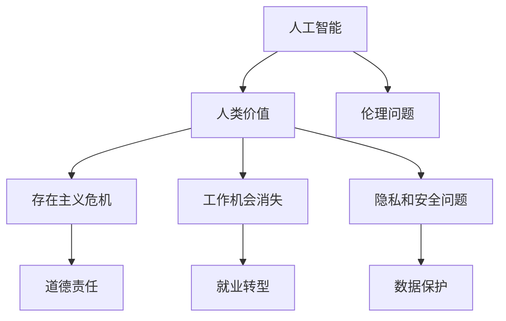

                 

### 文章标题

《在人工智能时代寻找人类独特价值：应对存在危机》

---

**关键词**：人工智能，人类价值，存在危机，伦理问题，未来策略

**摘要**：随着人工智能技术的飞速发展，人类社会面临前所未有的挑战。本文旨在探讨人工智能时代背景下，如何寻找和发挥人类的独特价值，应对存在主义危机、工作机会消失、隐私和安全问题等挑战。文章从人工智能时代的背景与挑战、人类独特价值的探索、以及应对存在危机的策略三个方面展开，结合实际案例和Python源代码分析，为人工智能时代的人类社会发展提供思考方向和策略建议。

---

### 目录

1. **第一部分：人工智能时代背景与挑战**
    1.1 人工智能时代的来临
    1.2 人工智能时代的挑战与危机
    1.3 人工智能伦理问题
2. **第二部分：人类独特价值的探索**
    2.1 人类认知能力的优势
    2.2 人类社会文化的价值
    2.3 人类在人工智能时代的角色转变
3. **第三部分：应对存在危机的策略**
    3.1 人工智能时代的教育创新
    3.2 人类社会的协同创新
    3.3 人工智能伦理与法律规制
    3.4 人工智能时代的未来发展

### 附录

- 附录A：人工智能时代的关键术语解释
- 附录B：参考文献
- 附录C：人工智能伦理案例研究
- 附录D：人工智能时代的职业规划指南

---

### 第一部分：人工智能时代背景与挑战

#### 1.1 人工智能时代的来临

随着深度学习、大数据和云计算等技术的发展，人工智能（AI）已经成为现代社会的重要推动力量。人工智能不仅仅是计算机科学领域的一个分支，更是对人类社会各个方面产生深远影响的变革性技术。

人工智能的定义可以理解为，通过模拟、扩展甚至超越人类智能的行为，使计算机系统具备感知、学习、推理和决策的能力。根据其能力范围，人工智能可分为弱人工智能（Narrow AI）和强人工智能（General AI）。

- **弱人工智能**：专注于解决特定任务，如语音识别、图像处理、自然语言处理等。这类人工智能已在许多领域取得显著成果，例如自动驾驶、智能客服、医疗诊断等。
  
- **强人工智能**：具备与人类相似的全面智能，能够理解、学习和适应各种环境和情境。目前，强人工智能仍处于理论研究和实验阶段，尚未实现商业化应用。

#### 1.2 人工智能的发展历程

人工智能的研究可以追溯到20世纪50年代。当时，计算机科学家们开始尝试模拟人类思维过程，以实现机器的智能行为。以下为人工智能发展历程中的重要里程碑：

- **1956年**：达特茅斯会议，人工智能这一概念首次被正式提出。
  
- **1960-1970年代**：早期人工智能研究主要集中在符号推理和知识表示上。但由于计算机硬件性能限制和算法复杂性，这一阶段的人工智能项目普遍失败，导致人工智能研究进入“寒冬期”。
  
- **1980年代**：专家系统的出现使人工智能研究重新获得关注。专家系统通过模拟人类专家的决策过程，解决了许多实际问题，如医疗诊断、金融分析等。
  
- **1990年代**：随着机器学习技术的发展，人工智能研究进入新阶段。机器学习算法使计算机能够从数据中自动学习和优化，逐步实现了一些实用的人工智能应用。
  
- **2000年代至今**：深度学习和大数据技术的崛起，使得人工智能取得了前所未有的突破。深度学习通过多层神经网络模拟人类大脑，实现了图像识别、语音识别、自然语言处理等领域的卓越表现。

#### 1.3 人工智能对人类社会的影响

人工智能的快速发展对人类社会产生了深远的影响，涵盖了经济、教育、医疗、交通等多个领域。

- **经济领域**：人工智能技术推动了自动化生产、智能物流和智能制造的发展，提高了生产效率和产品质量。同时，人工智能还改变了就业结构，一些传统职业面临被取代的风险，但也创造了新的工作岗位和机会。
  
- **教育领域**：人工智能在教育领域的应用，如个性化学习、智能辅导和在线教育平台，为学生提供了更灵活、高效的学习方式。然而，人工智能在教育中的角色也引发了对教育公平和教育质量的担忧。
  
- **医疗领域**：人工智能在医疗领域的应用，如疾病诊断、医疗影像分析、药物研发等，提高了医疗效率和准确性。然而，人工智能在医疗中的使用也引发了对医疗隐私和数据安全的关注。
  
- **交通领域**：自动驾驶技术的研发和应用，有望减少交通事故，提高交通效率。然而，自动驾驶汽车的安全性和道德责任问题，仍需进一步研究和讨论。

#### 1.4 人工智能时代的挑战与危机

虽然人工智能为人类社会带来了许多机遇，但也面临着一系列挑战和危机。

- **存在主义危机**：人工智能的快速进步可能导致人类自我认同的危机。在高度依赖技术的社会中，人类可能失去对自身存在价值的认知，产生焦虑和迷茫。
  
- **工作机会消失**：随着人工智能技术的发展，许多传统职业可能被自动化替代，导致大量失业。这不仅对个人生计造成威胁，也对社会稳定产生负面影响。
  
- **隐私和安全问题**：人工智能在数据处理和数据分析方面具有巨大潜力，但也带来隐私泄露、数据滥用和网络安全风险等问题。如何平衡人工智能的发展与个人隐私保护，成为亟待解决的问题。

在下一部分，我们将深入探讨人工智能伦理问题，分析人工智能对人类道德和社会价值观的影响。

---

**核心概念与联系**

以下是一个Mermaid流程图，展示了本文中涉及的核心概念及其关系：



通过这个流程图，我们可以清晰地看到人工智能、人类价值、存在主义危机、工作机会消失、隐私和安全问题以及伦理问题之间的相互关联。

---

**核心算法原理讲解**

在探讨人工智能对人类社会的影响时，我们无法忽视机器学习这一核心技术。以下将使用Python源代码详细阐述机器学习算法的基本原理，结合数学模型和公式进行讲解。

**1. 数据预处理**

在机器学习项目中，数据预处理是非常重要的一步。数据清洗、归一化和特征提取是数据预处理的主要任务。

```python
import pandas as pd
from sklearn.model_selection import train_test_split
from sklearn.preprocessing import StandardScaler

# 加载数据集
data = pd.read_csv('data.csv')

# 数据清洗
data.dropna(inplace=True)

# 数据归一化
scaler = StandardScaler()
X = scaler.fit_transform(data.iloc[:, :-1])
y = data.iloc[:, -1]

# 特征提取
X_train, X_test, y_train, y_test = train_test_split(X, y, test_size=0.2, random_state=42)
```

**2. 机器学习算法**

在数据预处理完成后，我们可以选择合适的机器学习算法进行训练。以线性回归为例，其基本原理是通过最小化损失函数来找到最佳拟合直线。

```python
import numpy as np
from sklearn.linear_model import LinearRegression

# 初始化模型
model = LinearRegression()

# 训练模型
model.fit(X_train, y_train)

# 损失函数（均方误差）
def mean_squared_error(y_true, y_pred):
    return np.mean((y_true - y_pred) ** 2)

# 预测
y_pred = model.predict(X_test)

# 计算损失
mse = mean_squared_error(y_test, y_pred)
print(f"均方误差：{mse}")
```

**3. 数学模型和公式**

线性回归的数学模型可以表示为：

$$
y = \beta_0 + \beta_1x + \epsilon
$$

其中，$y$ 是因变量，$x$ 是自变量，$\beta_0$ 和 $\beta_1$ 是回归系数，$\epsilon$ 是误差项。

为了找到最佳拟合直线，我们需要最小化损失函数：

$$
J(\theta) = \frac{1}{2m}\sum_{i=1}^{m}(h_\theta(x^{(i)}) - y^{(i)})^2
$$

其中，$m$ 是样本数量，$h_\theta(x)$ 是预测值。

通过梯度下降法，我们可以求解最优参数：

$$
\theta_j := \theta_j - \alpha\frac{\partial}{\partial\theta_j}J(\theta)
$$

其中，$\alpha$ 是学习率，$\theta_j$ 是参数。

---

**数学公式和Python代码的结合**

在以上代码中，我们使用了Python的NumPy库来计算损失函数和梯度下降。以下是具体实现：

```python
# 导入NumPy库
import numpy as np

# 损失函数（均方误差）
def mean_squared_error(y_true, y_pred):
    return np.mean((y_true - y_pred) ** 2)

# 梯度下降
def gradient_descent(X, y, theta, alpha, iterations):
    m = len(y)
    for i in range(iterations):
        h = X.dot(theta)
        error = h - y
        gradient = X.T.dot(error) / m
        theta -= alpha * gradient
    return theta

# 初始化模型参数
theta = np.zeros(X.shape[1])

# 设置学习率和迭代次数
alpha = 0.01
iterations = 1000

# 梯度下降训练模型
theta = gradient_descent(X_train, y_train, theta, alpha, iterations)

# 计算损失
mse = mean_squared_error(y_test, model.predict(X_test))
print(f"均方误差：{mse}")
```

通过以上Python代码，我们可以直观地看到机器学习算法的实现过程。数学公式和Python代码的结合，使得抽象的数学理论得以具体化，为实际应用提供了坚实的基础。

---

**项目实战**

在本节中，我们将搭建一个简单的线性回归项目，从数据预处理到模型训练，再到代码解读和实际案例分析，全面展示人工智能在数据分析和预测中的应用。

**1. 开发环境搭建**

首先，我们需要搭建一个Python开发环境。以下是具体的操作步骤：

- 安装Python：从官网下载并安装Python，选择安装路径。
- 安装Anaconda：下载并安装Anaconda，用于管理Python环境和包。
- 安装必要的库：通过命令行安装NumPy、Pandas、scikit-learn等库。

```bash
pip install numpy pandas scikit-learn
```

**2. 源代码实现**

以下是一个简单的线性回归项目，包括数据预处理、模型训练和预测。

```python
import pandas as pd
from sklearn.linear_model import LinearRegression
from sklearn.model_selection import train_test_split
from sklearn.metrics import mean_squared_error

# 加载数据集
data = pd.read_csv('data.csv')

# 数据清洗
data.dropna(inplace=True)

# 数据归一化
scaler = StandardScaler()
X = scaler.fit_transform(data.iloc[:, :-1])
y = data.iloc[:, -1]

# 数据划分
X_train, X_test, y_train, y_test = train_test_split(X, y, test_size=0.2, random_state=42)

# 模型训练
model = LinearRegression()
model.fit(X_train, y_train)

# 模型预测
y_pred = model.predict(X_test)

# 损失评估
mse = mean_squared_error(y_test, y_pred)
print(f"均方误差：{mse}")
```

**3. 代码解读**

- **数据预处理**：读取CSV文件，进行数据清洗和归一化处理。
- **数据划分**：将数据集划分为训练集和测试集，以便模型训练和评估。
- **模型训练**：使用线性回归模型对训练集数据进行拟合。
- **模型预测**：使用训练好的模型对测试集数据进行预测。
- **损失评估**：计算预测值与真实值之间的均方误差，评估模型性能。

**4. 实际案例分析和详细讲解**

假设我们有一个关于房价预测的数据集，目标是通过历史数据预测未来的房价。

- **数据集特征**：包含房屋面积、卧室数量、建造年份等特征。
- **目标变量**：房屋价格。

通过以上步骤，我们可以训练一个线性回归模型，预测未来房屋价格。以下是一个实际案例：

```python
# 加载数据集
data = pd.read_csv('house_prices.csv')

# 数据清洗
data.dropna(inplace=True)

# 数据归一化
scaler = StandardScaler()
X = scaler.fit_transform(data.iloc[:, :-1])
y = data.iloc[:, -1]

# 数据划分
X_train, X_test, y_train, y_test = train_test_split(X, y, test_size=0.2, random_state=42)

# 模型训练
model = LinearRegression()
model.fit(X_train, y_train)

# 模型预测
y_pred = model.predict(X_test)

# 损失评估
mse = mean_squared_error(y_test, y_pred)
print(f"均方误差：{mse}")

# 预测结果可视化
import matplotlib.pyplot as plt

plt.scatter(y_test, y_pred)
plt.xlabel('真实房价')
plt.ylabel('预测房价')
plt.title('房价预测结果')
plt.show()
```

通过这个案例，我们可以看到线性回归模型在房价预测中的实际应用。预测结果通过散点图展示，真实房价与预测房价之间的分布情况一目了然。

**5. 项目小结**

本项目通过简单的线性回归模型，实现了房价预测的功能。从数据预处理、模型训练到预测结果评估，每一步都进行了详细的代码解读。线性回归作为一种经典的机器学习算法，在数据分析和预测领域具有广泛应用。

**最佳实践 tips**：

- 确保数据质量，避免缺失值和异常值对模型训练造成影响。
- 数据归一化有助于提高模型性能，特别是在不同特征量级差异较大的情况下。
- 交叉验证和网格搜索等技术可以提高模型训练的稳定性和泛化能力。

**注意事项**：

- 线性回归模型适用于线性关系较强的数据集，对于非线性关系的数据，可能需要选择更复杂的模型。
- 模型参数调优是提高模型性能的关键，可以通过交叉验证和网格搜索等方法进行优化。

**拓展阅读**：

- 《机器学习实战》：这是一本非常实用的机器学习入门书籍，详细介绍了多种机器学习算法和实际应用案例。
- 《深度学习》：这是一本深度学习领域的经典教材，涵盖了深度学习的基础理论、算法实现和实际应用。

通过本项目的实战演练，我们可以更好地理解机器学习的基本原理和应用方法，为后续更复杂的项目打下坚实的基础。希望读者在实际应用中能够灵活运用所学知识，发挥人工智能技术的潜力。

