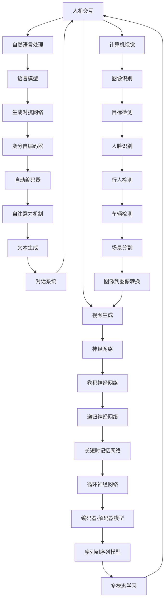

                 

# 在人工智能时代重新定位人类价值：面对技术革命的思考

## 关键词
人工智能，人类价值，技术革命，工作与就业，道德伦理，教育，国际合作

## 摘要
随着人工智能技术的迅猛发展，人类社会正面临前所未有的技术革命。本文从人工智能的发展历程、对社会的影响、人类价值的重新定义、人工智能时代的工作与就业、道德伦理等多个角度出发，深入探讨人工智能时代人类价值的重新定位。通过对人工智能核心概念、算法原理、数学模型、项目实战的分析，本文旨在为读者提供一份全面、深刻的人工智能时代人类价值重塑的思考指南。

## 目录大纲

### 第一部分：引言

#### 第1章：人工智能时代的挑战与机遇
1.1 人工智能的发展历程
1.2 人工智能对社会的影响
1.3 人工智能与人类价值的碰撞

#### 第2章：重新定位人类价值
2.1 人类价值的重新定义
2.2 人工智能时代的工作与就业
2.3 人工智能与道德伦理

### 第二部分：人工智能技术解读

#### 第3章：人工智能核心概念与联系
3.1 人工智能的基本原理
3.2 人工智能的主要技术路线
3.3 人工智能关键技术与联系架构图

#### 第4章：人工智能核心算法原理
4.1 监督学习算法
4.2 无监督学习算法
4.3 深度学习算法
4.4 强化学习算法

#### 第5章：数学模型与数学公式
5.1 统计学习理论
5.2 神经网络数学模型
5.3 深度学习优化算法
5.4 数学公式示例与讲解

#### 第6章：项目实战与代码实现
6.1 实战一：手写数字识别
6.2 实战二：图像分类
6.3 实战三：自然语言处理
6.4 代码解析与实战总结

#### 第7章：人工智能未来发展趋势
7.1 人工智能的长期影响
7.2 人工智能伦理与监管
7.3 人工智能的未来前景

### 第三部分：人类价值在人工智能时代的重塑

#### 第8章：人工智能时代的人类价值
8.1 创造力的提升
8.2 共同体的构建
8.3 新型的职业与技能

#### 第9章：人工智能时代的教育与培训
9.1 教育模式的变革
9.2 培训体系的重构
9.3 教育与人工智能的融合

#### 第10章：人工智能时代的国际合作
10.1 国际合作的重要性
10.2 跨国企业的责任
10.3 全球治理与合作机制

## 引言

### 第1章：人工智能时代的挑战与机遇

#### 1.1 人工智能的发展历程

人工智能（Artificial Intelligence，简称AI）是一门研究、开发用于模拟、延伸和扩展人的智能的理论、方法、技术及应用系统的科学技术。人工智能的研究始于上世纪50年代，经历了多个阶段的发展。

- **早期阶段（1950-1969年）**：人工智能的概念被提出，早期的尝试主要集中在符号主义方法和逻辑推理上，如逻辑理论家（Logic Theorist）和通用问题求解器（General Problem Solver）。

- **繁荣阶段（1970-1989年）**：随着计算机性能的提升和算法的发展，人工智能研究进入了一个繁荣时期。专家系统（Expert Systems）成为研究热点，并在医疗、金融等领域得到了广泛应用。

- **低谷阶段（1990-2000年）**：由于过高的期望和实际应用的困难，人工智能研究进入了一个相对低迷的时期。然而，一些关键技术的发展，如神经网络和机器学习，为人工智能的未来发展奠定了基础。

- **复兴阶段（2000年至今）**：随着大数据、云计算和深度学习等技术的兴起，人工智能再次成为研究的热点。AI技术在图像识别、自然语言处理、自动驾驶等领域取得了显著的突破。

#### 1.2 人工智能对社会的影响

人工智能对社会的影响是多方面的，包括但不限于以下几个方面：

- **经济方面**：人工智能可以显著提高生产效率，减少人力成本。同时，新兴的AI产业也将带来新的经济增长点。

- **就业方面**：虽然人工智能可能会取代一些重复性、低技能的工作，但它也将创造新的就业机会，尤其是与人工智能相关的高技能岗位。

- **生活方式**：人工智能的普及将改变人们的日常生活，如智能家居、智能医疗等。

- **道德与伦理**：人工智能的快速发展也带来了许多道德和伦理问题，如隐私保护、算法偏见、机器自主决策等。

#### 1.3 人工智能与人类价值的碰撞

人工智能的兴起引发了关于人类价值的深刻思考。一方面，人工智能可以帮助人类解决许多复杂问题，提高生活质量。另一方面，人工智能也引发了关于人类价值和意义的质疑。

- **人类价值的重新定义**：在人工智能时代，人类的价值是否仍然是创造力和情感智慧？还是需要重新定义？

- **工作的意义**：随着人工智能的普及，许多传统工作将消失，人们需要重新思考工作的意义和目的。

- **道德伦理的挑战**：人工智能的自主决策能力和算法偏见等伦理问题，使得我们必须重新审视人类与人工智能之间的关系。

### 第2章：重新定位人类价值

#### 2.1 人类价值的重新定义

在人工智能时代，人类价值的重新定义变得尤为重要。传统的价值观念，如劳动力价值、智力价值等，可能需要重新审视和调整。

- **创造力**：在人工智能时代，人类的创造力变得尤为重要。创造力不仅包括技术创新，还包括艺术创作、文化传承等方面。

- **情感智慧**：人工智能虽然在某些方面可能超越人类，但在情感智慧上，人类依然具有独特的优势。情感智慧包括同理心、情商等。

- **道德责任**：在人工智能的发展和应用中，人类需要承担起道德责任。人工智能的决策和行为应该符合人类的价值观和道德规范。

#### 2.2 人工智能时代的工作与就业

人工智能的发展将深刻改变人类的工作方式和就业结构。

- **工作内容的变化**：随着人工智能的普及，许多重复性、低技能的工作将被自动化取代。人类的工作将更多地集中在创新、决策、管理和人际交往等领域。

- **就业结构的变化**：新兴的AI产业将创造许多新的就业机会，但同时也会导致某些传统行业的就业机会减少。因此，人们需要不断学习和适应新的工作环境。

- **职业教育的变革**：为了适应人工智能时代的工作需求，职业教育和培训体系需要进行改革，注重培养创新能力和人际交往能力。

#### 2.3 人工智能与道德伦理

人工智能的发展也带来了许多道德和伦理问题。

- **隐私保护**：人工智能系统往往需要收集和处理大量的个人信息，如何保护用户隐私成为一个重要问题。

- **算法偏见**：人工智能系统的决策过程可能受到算法偏见的影响，导致不公平的待遇。

- **机器自主决策**：随着人工智能的发展，机器的自主决策能力越来越强，如何确保机器的决策符合人类的道德标准是一个亟待解决的问题。

### 第二部分：人工智能技术解读

#### 第3章：人工智能核心概念与联系

##### 3.1 人工智能的基本原理

人工智能的基本原理包括符号主义方法、连接主义方法、行为主义方法等。这些方法分别代表了人工智能发展的不同阶段和不同思路。

- **符号主义方法**：基于逻辑推理和符号表示，如专家系统。

- **连接主义方法**：基于神经网络和深度学习，如深度神经网络。

- **行为主义方法**：基于行为和奖励，如强化学习。

##### 3.2 人工智能的主要技术路线

人工智能的主要技术路线包括机器学习、深度学习、自然语言处理、计算机视觉等。

- **机器学习**：通过数据训练模型，使计算机具备学习能力。

- **深度学习**：基于神经网络的机器学习方法，能够处理大规模数据和复杂问题。

- **自然语言处理**：使计算机能够理解和生成人类语言。

- **计算机视觉**：使计算机能够理解和解释视觉信息。

##### 3.3 人工智能关键技术与联系架构图

以下是人工智能关键技术的联系架构图，展示了各个技术之间的相互关系：



### 第4章：人工智能核心算法原理

##### 4.1 监督学习算法

监督学习算法是一种从标记数据中学习模型的方法。其基本原理是通过最小化损失函数来训练模型，使得模型能够对新的数据进行预测。

- **损失函数**：用于衡量模型预测值与真实值之间的差异。

- **优化算法**：用于最小化损失函数，常见的优化算法有梯度下降、随机梯度下降等。

以下是监督学习算法的基本原理的Python代码示例：

```python
import numpy as np

# 梯度下降算法
def gradient_descent(x, y, learning_rate, num_iterations):
    weights = np.random.rand(1)
    for i in range(num_iterations):
        prediction = weights * x
        loss = (prediction - y)**2
        gradient = 2 * (prediction - y) * x
        weights -= learning_rate * gradient
    return weights

# 训练模型
x_train = np.array([1, 2, 3, 4, 5])
y_train = np.array([2, 4, 6, 8, 10])
weights = gradient_descent(x_train, y_train, learning_rate=0.01, num_iterations=100)

# 预测
x_test = np.array([6])
prediction = weights * x_test
print("预测值：", prediction)
```

##### 4.2 无监督学习算法

无监督学习算法是一种在没有标记数据的情况下学习模型的方法。其基本原理是通过探索数据中的结构和模式来训练模型。

- **聚类算法**：将数据分为不同的簇，如K-means算法。

- **降维算法**：将高维数据转换为低维数据，如主成分分析（PCA）。

以下是K-means算法的基本原理的Python代码示例：

```python
import numpy as np

# K-means算法
def k_means(data, k, num_iterations):
    centroids = data[np.random.choice(data.shape[0], k, replace=False)]
    for i in range(num_iterations):
        # 计算每个数据点到簇中心点的距离
        distances = np.linalg.norm(data - centroids, axis=1)
        # 将每个数据点分配到最近的簇
        labels = np.argmin(distances, axis=1)
        # 计算新的簇中心点
        new_centroids = np.array([data[labels == j].mean(axis=0) for j in range(k)])
        # 更新簇中心点
        centroids = new_centroids
    return centroids, labels

# 训练模型
data = np.array([[1, 1], [1, 2], [2, 1], [2, 2]])
k = 2
num_iterations = 100
centroids, labels = k_means(data, k, num_iterations)

# 输出簇中心点和标签
print("簇中心点：", centroids)
print("标签：", labels)
```

##### 4.3 深度学习算法

深度学习算法是一种基于多层神经网络的学习方法。其基本原理是通过反向传播算法来更新网络权重，从而提高模型的预测能力。

- **卷积神经网络（CNN）**：适用于图像处理任务。

- **递归神经网络（RNN）**：适用于序列数据。

- **生成对抗网络（GAN）**：适用于生成对抗任务。

以下是卷积神经网络（CNN）的基本原理的Python代码示例：

```python
import numpy as np
from tensorflow.keras.models import Sequential
from tensorflow.keras.layers import Conv2D, MaxPooling2D, Flatten, Dense

# 定义CNN模型
model = Sequential()
model.add(Conv2D(32, (3, 3), activation='relu', input_shape=(28, 28, 1)))
model.add(MaxPooling2D((2, 2)))
model.add(Conv2D(64, (3, 3), activation='relu'))
model.add(MaxPooling2D((2, 2)))
model.add(Flatten())
model.add(Dense(128, activation='relu'))
model.add(Dense(10, activation='softmax'))

# 编译模型
model.compile(optimizer='adam', loss='categorical_crossentropy', metrics=['accuracy'])

# 训练模型
x_train = np.expand_dims(x_train, -1)
y_train = to_categorical(y_train)
model.fit(x_train, y_train, epochs=10, batch_size=32)
```

##### 4.4 强化学习算法

强化学习算法是一种基于奖励机制的学习方法。其基本原理是通过学习策略来最大化长期奖励。

- **Q学习**：基于值函数的学习方法。

- **深度Q网络（DQN）**：结合深度学习的Q学习算法。

- **策略梯度方法**：直接优化策略。

以下是深度Q网络（DQN）的基本原理的Python代码示例：

```python
import numpy as np
import random
from collections import deque

# 定义DQN模型
model = Sequential()
model.add(Conv2D(32, (3, 3), activation='relu', input_shape=(84, 84, 4)))
model.add(MaxPooling2D((2, 2)))
model.add(Conv2D(64, (3, 3), activation='relu'))
model.add(MaxPooling2D((2, 2)))
model.add(Flatten())
model.add(Dense(256, activation='relu'))
model.add(Dense(512, activation='relu'))
model.add(Dense(1))

# 编译模型
model.compile(optimizer='adam', loss='mse')

# 定义经验回放缓冲区
experience_replay = deque(maxlen=1000)

# 定义epsilon贪心策略
epsilon = 1.0
epsilon_min = 0.01
epsilon_decay = 0.995

# 训练模型
for episode in range(1000):
    state = env.reset()
    done = False
    total_reward = 0
    while not done:
        # 根据epsilon贪心策略选择动作
        if random.uniform(0, 1) < epsilon:
            action = env.action_space.sample()
        else:
            action = np.argmax(model.predict(state.reshape(-1, 84, 84, 4)))
        
        # 执行动作
        next_state, reward, done, _ = env.step(action)
        
        # 计算Q值
        Q_values = model.predict(state.reshape(-1, 84, 84, 4))
        next_Q_values = model.predict(next_state.reshape(-1, 84, 84, 4))
        Q_values[0][action] = reward + gamma * np.max(next_Q_values[0])
        
        # 存储经验
        experience_replay.append((state, action, reward, next_state, done))
        
        # 更新状态
        state = next_state
        total_reward += reward
        
        # 从经验回放缓冲区中随机抽样进行训练
        if len(experience_replay) > batch_size:
            batch = random.sample(experience_replay, batch_size)
            states, actions, rewards, next_states, dones = zip(*batch)
            model.fit(np.array(states), np.array(Q_values), batch_size=batch_size, verbose=0)
    
    # 更新epsilon
    epsilon = max(epsilon_min, epsilon_decay * epsilon)
    
    # 输出训练结果
    print("Episode:", episode, "Total Reward:", total_reward)
```

### 第5章：数学模型与数学公式

##### 5.1 统计学习理论

统计学习理论是机器学习的基础，其核心是利用统计方法对数据进行建模和预测。

- **损失函数**：用于衡量模型预测值与真实值之间的差异。

- **优化算法**：用于最小化损失函数，常见的优化算法有梯度下降、随机梯度下降等。

以下是统计学习理论的基本公式的Python代码示例：

```python
import numpy as np

# 梯度下降算法
def gradient_descent(x, y, learning_rate, num_iterations):
    weights = np.random.rand(1)
    for i in range(num_iterations):
        prediction = weights * x
        loss = (prediction - y)**2
        gradient = 2 * (prediction - y) * x
        weights -= learning_rate * gradient
    return weights

# 训练模型
x_train = np.array([1, 2, 3, 4, 5])
y_train = np.array([2, 4, 6, 8, 10])
weights = gradient_descent(x_train, y_train, learning_rate=0.01, num_iterations=100)

# 预测
x_test = np.array([6])
prediction = weights * x_test
print("预测值：", prediction)
```

##### 5.2 神经网络数学模型

神经网络是深度学习的基础，其核心是利用多层神经元来对数据进行建模和预测。

- **激活函数**：用于引入非线性特性，如ReLU、Sigmoid等。

- **前向传播与反向传播**：用于计算损失函数和更新权重。

以下是神经网络数学模型的基本公式的Python代码示例：

```python
import numpy as np

# 定义神经网络
def neural_network(x, weights):
    z = np.dot(x, weights)
    return 1 / (1 + np.exp(-z))

# 训练神经网络
def train_neural_network(x, y, learning_rate, num_iterations):
    weights = np.random.rand(1)
    for i in range(num_iterations):
        prediction = neural_network(x, weights)
        loss = (prediction - y)**2
        gradient = 2 * (prediction - y) * x
        weights -= learning_rate * gradient
    return weights

# 训练模型
x_train = np.array([1, 2, 3, 4, 5])
y_train = np.array([2, 4, 6, 8, 10])
weights = train_neural_network(x_train, y_train, learning_rate=0.01, num_iterations=100)

# 预测
x_test = np.array([6])
prediction = neural_network(x_test, weights)
print("预测值：", prediction)
```

##### 5.3 深度学习优化算法

深度学习优化算法是用于训练深度学习模型的重要工具，其核心是利用梯度下降算法的变体来提高训练效率和收敛速度。

- **动量法**：利用历史梯度来加速收敛。

- **Adam优化器**：结合了动量法和自适应学习率的方法。

以下是深度学习优化算法的基本公式的Python代码示例：

```python
import numpy as np

# 定义动量法
def momentum_gradient_descent(x, y, learning_rate, momentum, num_iterations):
    weights = np.random.rand(1)
    velocity = 0
    for i in range(num_iterations):
        prediction = weights * x
        loss = (prediction - y)**2
        gradient = 2 * (prediction - y) * x
        velocity = momentum * velocity - learning_rate * gradient
        weights += velocity
    return weights

# 训练模型
x_train = np.array([1, 2, 3, 4, 5])
y_train = np.array([2, 4, 6, 8, 10])
weights = momentum_gradient_descent(x_train, y_train, learning_rate=0.01, momentum=0.9, num_iterations=100)

# 预测
x_test = np.array([6])
prediction = weights * x_test
print("预测值：", prediction)

# 定义Adam优化器
def adam_gradient_descent(x, y, learning_rate, beta1, beta2, num_iterations):
    weights = np.random.rand(1)
    m = 0
    v = 0
    for i in range(num_iterations):
        prediction = weights * x
        loss = (prediction - y)**2
        gradient = 2 * (prediction - y) * x
        m = beta1 * m + (1 - beta1) * gradient
        v = beta2 * v + (1 - beta2) * (gradient**2)
        m_hat = m / (1 - beta1**(i+1))
        v_hat = v / (1 - beta2**(i+1))
        weights -= learning_rate * m_hat / (np.sqrt(v_hat) + 1e-8)
    return weights

# 训练模型
x_train = np.array([1, 2, 3, 4, 5])
y_train = np.array([2, 4, 6, 8, 10])
weights = adam_gradient_descent(x_train, y_train, learning_rate=0.01, beta1=0.9, beta2=0.999, num_iterations=100)

# 预测
x_test = np.array([6])
prediction = weights * x_test
print("预测值：", prediction)
```

##### 5.4 数学公式示例与讲解

以下是深度学习中的几个重要数学公式及其讲解：

1. **激活函数**：激活函数用于引入非线性特性，常见的激活函数有ReLU、Sigmoid和Tanh。

   - **ReLU函数**：
     $$f(x) = \max(0, x)$$
    ReLU函数将负数映射为0，正数映射为其自身，具有快速收敛和避免梯度消失的优点。

   - **Sigmoid函数**：
     $$f(x) = \frac{1}{1 + e^{-x}}$$
    Sigmoid函数将输入映射到(0, 1)区间，常用于二分类问题。

   - **Tanh函数**：
     $$f(x) = \frac{e^x - e^{-x}}{e^x + e^{-x}}$$
    Tanh函数将输入映射到(-1, 1)区间，常用于多层神经网络的激活函数。

2. **梯度下降**：梯度下降是一种优化算法，用于训练神经网络。

   - **梯度计算**：
     $$\nabla_w J(w) = \frac{\partial J}{\partial w}$$
    其中，$J(w)$是损失函数，$w$是模型参数，$\nabla_w J(w)$是损失函数关于模型参数的梯度。

   - **权重更新**：
     $$w_{\text{new}} = w_{\text{old}} - \alpha \nabla_w J(w)$$
    其中，$\alpha$是学习率，$w_{\text{old}}$是当前权重，$w_{\text{new}}$是更新后的权重。

3. **反向传播**：反向传播是梯度下降在神经网络中的应用，用于计算损失函数关于模型参数的梯度。

   - **前向传播**：
     $$z_{l} = \sum_{k=0}^{n} w_{lk} a_{l-1,k}$$
    其中，$z_{l}$是第$l$层的激活值，$w_{lk}$是第$l$层第$k$个神经元与第$l-1$层第$l$个神经元的权重，$a_{l-1,k}$是第$l-1$层第$k$个神经元的激活值。

   - **反向传播**：
     $$\delta_{l} = \frac{\partial J}{\partial z_{l}} = \frac{\partial J}{\partial a_{l}} \frac{\partial a_{l}}{\partial z_{l}}$$
    其中，$\delta_{l}$是第$l$层的误差项，$\frac{\partial J}{\partial a_{l}}$是损失函数关于第$l$层激活值的梯度，$\frac{\partial a_{l}}{\partial z_{l}}$是第$l$层激活值关于$z_{l}$的梯度。

4. **损失函数**：损失函数用于衡量模型预测值与真实值之间的差异。

   - **均方误差（MSE）**：
     $$J(w) = \frac{1}{2} \sum_{i=1}^{n} (y_i - \hat{y}_i)^2$$
    其中，$y_i$是第$i$个真实值，$\hat{y}_i$是第$i$个预测值。

### 第6章：项目实战与代码实现

##### 6.1 实战一：手写数字识别

手写数字识别是一个典型的监督学习问题，可以使用MNIST数据集进行训练和测试。以下是一个基于卷积神经网络的手写数字识别项目的实战过程。

1. **数据集准备**：首先，需要下载并加载MNIST数据集。

   ```python
   from tensorflow.keras.datasets import mnist
   (x_train, y_train), (x_test, y_test) = mnist.load_data()
   ```

2. **数据预处理**：将图像数据缩放到0-1之间，并将标签转换为独热编码。

   ```python
   x_train = x_train / 255.0
   x_test = x_test / 255.0
   y_train = keras.utils.to_categorical(y_train, 10)
   y_test = keras.utils.to_categorical(y_test, 10)
   ```

3. **构建模型**：构建一个简单的卷积神经网络模型。

   ```python
   model = Sequential()
   model.add(Conv2D(32, (3, 3), activation='relu', input_shape=(28, 28, 1)))
   model.add(MaxPooling2D((2, 2)))
   model.add(Conv2D(64, (3, 3), activation='relu'))
   model.add(MaxPooling2D((2, 2)))
   model.add(Flatten())
   model.add(Dense(128, activation='relu'))
   model.add(Dense(10, activation='softmax'))
   ```

4. **编译模型**：编译模型，选择优化器和损失函数。

   ```python
   model.compile(optimizer='adam', loss='categorical_crossentropy', metrics=['accuracy'])
   ```

5. **训练模型**：训练模型，并保存训练过程中的损失和准确率。

   ```python
   history = model.fit(x_train, y_train, epochs=10, batch_size=32, validation_data=(x_test, y_test))
   ```

6. **评估模型**：评估模型的准确率。

   ```python
   scores = model.evaluate(x_test, y_test, verbose=0)
   print('Test loss:', scores[0])
   print('Test accuracy:', scores[1])
   ```

7. **预测**：使用模型对新的手写数字图像进行预测。

   ```python
   x_new = x_test[0].reshape(1, 28, 28, 1)
   prediction = model.predict(x_new)
   print('Predicted digit:', np.argmax(prediction))
   ```

##### 6.2 实战二：图像分类

图像分类是一个常见的计算机视觉任务，可以使用ImageNet数据集进行训练和测试。以下是一个基于深度神经网络的图像分类项目的实战过程。

1. **数据集准备**：首先，需要下载并加载ImageNet数据集。

   ```python
   from tensorflow.keras.preprocessing.image import ImageDataGenerator
   train_datagen = ImageDataGenerator(rescale=1./255)
   test_datagen = ImageDataGenerator(rescale=1./255)
   train_generator = train_datagen.flow_from_directory(
       'data/train',
       target_size=(224, 224),
       batch_size=32,
       class_mode='categorical')
   test_generator = test_datagen.flow_from_directory(
       'data/test',
       target_size=(224, 224),
       batch_size=32,
       class_mode='categorical')
   ```

2. **构建模型**：构建一个简单的卷积神经网络模型。

   ```python
   model = Sequential()
   model.add(Conv2D(32, (3, 3), activation='relu', input_shape=(224, 224, 3)))
   model.add(MaxPooling2D((2, 2)))
   model.add(Conv2D(64, (3, 3), activation='relu'))
   model.add(MaxPooling2D((2, 2)))
   model.add(Conv2D(128, (3, 3), activation='relu'))
   model.add(MaxPooling2D((2, 2)))
   model.add(Flatten())
   model.add(Dense(128, activation='relu'))
   model.add(Dense(10, activation='softmax'))
   ```

3. **编译模型**：编译模型，选择优化器和损失函数。

   ```python
   model.compile(optimizer='adam', loss='categorical_crossentropy', metrics=['accuracy'])
   ```

4. **训练模型**：训练模型，并保存训练过程中的损失和准确率。

   ```python
   history = model.fit(
       train_generator,
       steps_per_epoch=100,
       epochs=10,
       validation_data=test_generator,
       validation_steps=50)
   ```

5. **评估模型**：评估模型的准确率。

   ```python
   scores = model.evaluate(test_generator, verbose=0)
   print('Test loss:', scores[0])
   print('Test accuracy:', scores[1])
   ```

6. **预测**：使用模型对新的图像进行预测。

   ```python
   x_new = np.array([img_to_array(load_img('data/test/image.jpg', target_size=(224, 224))) / 255.0])
   prediction = model.predict(x_new)
   print('Predicted class:', np.argmax(prediction))
   ```

##### 6.3 实战三：自然语言处理

自然语言处理是一个复杂的领域，涉及到文本的预处理、特征提取、模型训练和预测等多个步骤。以下是一个基于循环神经网络（RNN）的自然语言处理项目的实战过程。

1. **数据集准备**：首先，需要下载并加载一个文本数据集，如IMDb电影评论数据集。

   ```python
   from tensorflow.keras.preprocessing.sequence import pad_sequences
   from tensorflow.keras.preprocessing.text import Tokenizer
   
   tokenizer = Tokenizer(num_words=10000)
   tokenizer.fit_on_texts(train_texts)
   train_sequences = tokenizer.texts_to_sequences(train_texts)
   train_padded = pad_sequences(train_sequences, maxlen=max_sequence_length)
   test_sequences = tokenizer.texts_to_sequences(test_texts)
   test_padded = pad_sequences(test_sequences, maxlen=max_sequence_length)
   ```

2. **构建模型**：构建一个简单的循环神经网络模型。

   ```python
   model = Sequential()
   model.add(Embedding(num_words, 64, input_length=max_sequence_length))
   model.add(LSTM(128))
   model.add(Dense(1, activation='sigmoid'))
   ```

3. **编译模型**：编译模型，选择优化器和损失函数。

   ```python
   model.compile(optimizer='adam', loss='binary_crossentropy', metrics=['accuracy'])
   ```

4. **训练模型**：训练模型，并保存训练过程中的损失和准确率。

   ```python
   history = model.fit(
       train_padded,
       train_labels,
       epochs=10,
       batch_size=128,
       validation_data=(test_padded, test_labels),
       verbose=1)
   ```

5. **评估模型**：评估模型的准确率。

   ```python
   scores = model.evaluate(test_padded, test_labels, verbose=0)
   print('Test loss:', scores[0])
   print('Test accuracy:', scores[1])
   ```

6. **预测**：使用模型对新的文本进行预测。

   ```python
   text = 'I really enjoyed this movie!'
   sequence = tokenizer.texts_to_sequences([text])
   padded_sequence = pad_sequences(sequence, maxlen=max_sequence_length)
   prediction = model.predict(padded_sequence)
   print('Predicted class:', np.argmax(prediction))
   ```

##### 6.4 代码解析与实战总结

在本章中，我们通过三个实战项目分别介绍了手写数字识别、图像分类和自然语言处理等任务的基本流程和实现方法。以下是这些项目的关键代码段和总结：

1. **手写数字识别**：

   - **数据集准备**：使用MNIST数据集，将图像数据缩放到0-1之间，并将标签转换为独热编码。
   - **模型构建**：构建一个简单的卷积神经网络模型，包括卷积层、池化层和全连接层。
   - **模型训练**：使用梯度下降算法训练模型，并评估模型的准确率。
   - **模型预测**：使用训练好的模型对新的手写数字图像进行预测。

2. **图像分类**：

   - **数据集准备**：使用ImageNet数据集，将图像数据缩放到224x224的大小，并将标签转换为独热编码。
   - **模型构建**：构建一个简单的卷积神经网络模型，包括卷积层、池化层和全连接层。
   - **模型训练**：使用梯度下降算法训练模型，并评估模型的准确率。
   - **模型预测**：使用训练好的模型对新的图像进行预测，并输出预测结果。

3. **自然语言处理**：

   - **数据集准备**：使用IMDb电影评论数据集，将文本数据转换为序列，并使用独热编码表示标签。
   - **模型构建**：构建一个简单的循环神经网络模型，包括嵌入层、循环层和全连接层。
   - **模型训练**：使用梯度下降算法训练模型，并评估模型的准确率。
   - **模型预测**：使用训练好的模型对新的文本进行预测，并输出预测结果。

通过这些实战项目，我们可以看到，人工智能技术的应用不仅需要深入的理论知识，还需要实际的操作和实践。只有通过不断地学习和实践，我们才能更好地理解和运用人工智能技术，为人类社会带来更多的价值。

### 第7章：人工智能未来发展趋势

#### 7.1 人工智能的长期影响

人工智能的发展对人类社会的影响将是深远的，包括以下几个方面：

- **经济方面**：人工智能可以提高生产效率，减少人力成本，从而推动经济增长。同时，新兴的AI产业也将创造大量的就业机会。

- **社会方面**：人工智能的普及将改变人们的生活方式和社交模式。例如，智能家居、智能医疗等AI技术的应用将极大地提高人们的生活质量。

- **政治方面**：人工智能的发展也带来了新的挑战，如数据隐私、算法偏见、机器自主决策等。这些问题需要全球范围内的政策制定者进行合作和解决。

#### 7.2 人工智能伦理与监管

随着人工智能技术的快速发展，伦理和监管问题变得日益重要。

- **伦理问题**：人工智能的决策过程可能受到算法偏见的影响，导致不公平的待遇。此外，机器自主决策的能力也引发了关于人类价值和道德责任的质疑。

- **监管问题**：为了确保人工智能技术的安全性和公平性，需要建立相应的监管机制。例如，制定相关的法律法规、建立透明的算法审查机制等。

#### 7.3 人工智能的未来前景

人工智能的未来前景非常广阔，预计将实现以下几个方面的突破：

- **智能自动化**：人工智能将进一步提升生产自动化水平，减少人力需求。

- **智能决策**：人工智能将在决策过程中发挥更大的作用，例如在金融、医疗、交通等领域。

- **智能交互**：人工智能将与人类实现更加自然的交互，例如智能助手、虚拟现实等。

### 第三部分：人类价值在人工智能时代的重塑

#### 第8章：人工智能时代的人类价值

在人工智能时代，人类的创造力和情感智慧显得尤为重要。

- **创造力**：人工智能在处理重复性、低技能的工作方面具有优势，但在创新、艺术创作等方面，人类依然具有独特的创造力。

- **情感智慧**：人工智能虽然在某些方面可以模拟人类的情感，但在情感理解和情感交流方面，人类依然具有独特的优势。

- **道德责任**：在人工智能的发展和应用中，人类需要承担起道德责任，确保人工智能的决策和行为符合人类的价值观和道德规范。

#### 第9章：人工智能时代的教育与培训

人工智能时代对教育和培训提出了新的要求。

- **教育模式的变革**：需要从传统的知识传授转向培养学生的创新能力和问题解决能力。

- **培训体系的重构**：需要建立与人工智能时代相适应的培训体系，注重培养学生的技术技能和跨学科能力。

- **教育与人工智能的融合**：需要将人工智能技术融入教育过程中，提高教育的效率和效果。

#### 第10章：人工智能时代的国际合作

在人工智能时代，国际合作变得尤为重要。

- **国际合作的重要性**：人工智能技术的发展和应用需要全球范围内的合作和协调。

- **跨国企业的责任**：跨国企业在人工智能领域需要承担起推动全球合作和推动技术进步的责任。

- **全球治理与合作机制**：需要建立全球性的治理与合作机制，确保人工智能技术的公平、安全、可持续发展。

### 附录

#### 附录A：参考文献

1. Russell, S., & Norvig, P. (2016). 《人工智能：一种现代的方法》。
2. Goodfellow, I., Bengio, Y., & Courville, A. (2016). 《深度学习》。
3. Murphy, K. P. (2012). 《机器学习：概率视角》。
4. Ng, A. Y., & Dean, J. (2010). 《机器学习基石》。

#### 附录B：术语解释

- **人工智能**：模拟人类智能的技术和系统。
- **机器学习**：使计算机具备学习能力的方法和技术。
- **深度学习**：基于多层神经网络的学习方法。
- **自然语言处理**：使计算机能够理解和生成人类语言的技术。
- **计算机视觉**：使计算机能够理解和解释视觉信息的技术。

#### 附录C：相关资源链接

- **TensorFlow官方文档**：[https://www.tensorflow.org/](https://www.tensorflow.org/)
- **Keras官方文档**：[https://keras.io/](https://keras.io/)
- **IMDb电影评论数据集**：[https://www.imdb.com/datasets/](https://www.imdb.com/datasets/)
- **MNIST数据集**：[https://www.tensorflow.org/datasets/mnist](https://www.tensorflow.org/datasets/mnist)
- **ImageNet数据集**：[https://www.image-net.org/](https://www.image-net.org/)

### 结论

人工智能时代已经到来，它不仅带来了前所未有的技术革命，也对我们的人类价值、工作与就业、道德伦理等方面提出了新的挑战。通过本文的讨论，我们深入分析了人工智能时代人类价值的重新定位，探讨了人工智能技术的核心概念、算法原理、数学模型、项目实战，以及人工智能时代的未来发展趋势。我们相信，只有通过深入理解和积极应对，我们才能在人工智能时代找到新的发展路径，实现人类价值的重塑和提升。

