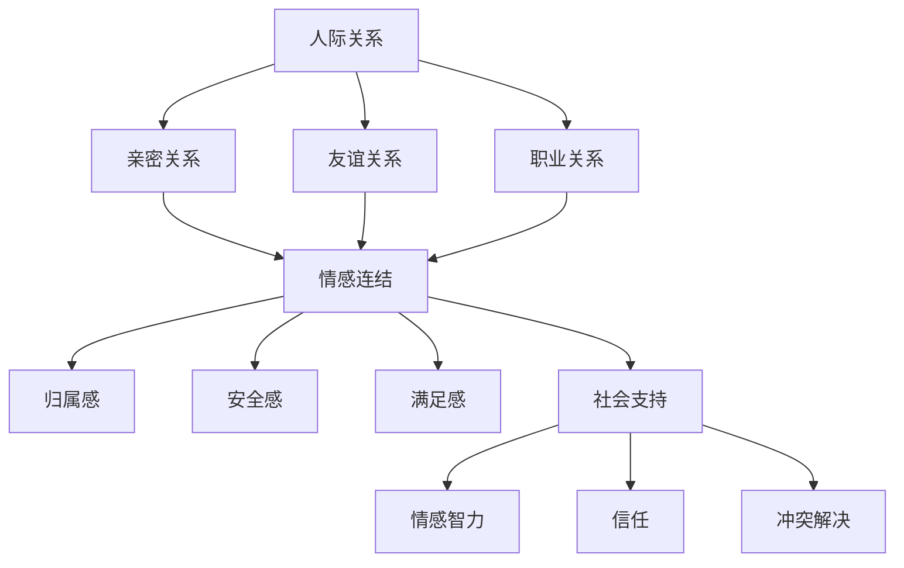

                 

### 背景介绍

在现代社会，人际关系的重要性日益凸显。随着信息化和全球化的推进，人们的生活节奏加快，工作压力增大，人际交往变得愈加频繁和复杂。然而，人际关系不仅仅是一种社交活动，它还承载着情感连结、心理支持和社会认同等多重功能。良好的社交关系对于个体的心理健康、幸福感以及社会适应能力具有深远的影响。

情感连结是人际关系中的一个核心概念。它指的是个体之间在情感上的相互吸引、共鸣和联系。情感连结不仅能够带来积极的心理体验，如归属感、安全感和满足感，还能在困境中提供心理支持，帮助个体度过难关。研究表明，深厚的情感连结对个体的心理健康具有显著的积极效应，能够降低抑郁、焦虑等心理问题的发生率，提升生活质量和幸福感。

然而，情感连结的建立和维护并非易事。在快速变化的社会环境中，人们面临着多样化的挑战，如沟通障碍、信任危机和价值观冲突等，这些因素都可能影响情感连结的形成和发展。因此，探讨如何深化情感连结，不仅具有重要的理论意义，也具有深远的实践价值。

本文将围绕情感连结这一核心主题，首先介绍人际关系的基本概念，包括人际关系的定义、类型及其重要性。接着，深入探讨情感连结的概念、重要性及其与人际关系之间的相互关系。在此基础上，本文将介绍如何建立和维护情感连结，并提供一系列实用的实践技巧。随后，通过具体案例展示情感连结的建立与深化过程，帮助读者更好地理解和应用这些技巧。最后，本文将对全书内容进行总结，并展望未来的研究方向和实践建议。

通过这篇文章，我们希望能够帮助读者深入理解人际关系和情感连结的本质，掌握深化情感连结的技巧，从而在人际交往中建立更深厚、更有意义的关系，提升个体的心理健康和生活质量。

## 核心概念与联系

在深入探讨人际关系和情感连结之前，我们需要明确几个核心概念，并分析它们之间的相互关系。以下是本文中几个关键概念及其相互关系的架构：

### 1. 人际关系

人际关系是指个体之间通过互动、交流和相互影响形成的联系。根据不同的维度，人际关系可以分为多种类型，如亲密关系、友谊关系和职业关系等。每种类型的关系都有其特定的特征和功能。

### 2. 情感连结

情感连结是指个体在情感层面上的相互吸引、共鸣和联系。它通常涉及情感共享、信任建立和共同目标等元素。情感连结可以带来积极的心理体验，如归属感、安全感和满足感。

### 3. 情感智力

情感智力是指个体识别、理解和管理自身情感及他人情感的能力。高情感智力有助于建立和维护情感连结，因为它能促进有效沟通、信任建立和冲突解决。

### 4. 社会支持

社会支持是指个体从社交网络中获得的支持和资源。社会支持与情感连结密切相关，因为它提供了情感连结的重要外部环境。

### 关系架构 Mermaid 流程图：



### 概念实体之间的关系

- **人际关系 → 情感连结**：人际关系是情感连结的基础，没有人际关系的互动和交流，情感连结就无法形成。例如，朋友之间通过日常互动和分享，逐渐建立深厚的情感连结。

- **情感连结 → 情感智力**：情感连结的深化需要情感智力的支持，高情感智力能够帮助个体更好地识别和理解他人的情感，从而促进情感连结的发展。

- **情感连结 → 社会支持**：情感连结为社会支持提供了情感纽带，而社会支持则为情感连结提供了外部环境。例如，家庭成员之间的情感连结能够提供强大的社会支持，帮助个体在面对压力和困难时保持心理健康。

- **情感连结 → 归属感、安全感和满足感**：深厚的情感连结能够带来强烈的归属感、安全感和满足感，这些积极的情感体验是情感连结的核心价值。

- **情感连结 → 信任和冲突解决**：情感连结建立在信任的基础上，信任是情感连结的重要保障。同时，情感连结能够促进冲突的和平解决，因为相互理解和共鸣有助于双方找到共识和解决方案。

通过上述Mermaid流程图，我们可以清晰地看到各个概念实体之间的关系。这种关系架构有助于我们更好地理解人际关系和情感连结的本质，为后续章节的探讨提供了理论基础。

## 核心算法原理讲解

在理解了人际关系和情感连结的核心概念后，我们将探讨如何通过数学模型和算法来分析、理解和深化情感连结。本文将重点介绍一个名为“情感连结度计算模型”的核心算法，并使用Python源代码进行详细阐述。

### 情感连结度计算模型

情感连结度计算模型是一个用于量化个体之间情感连结程度的数学模型。它通过分析个体在情感交流中的行为和反应，计算出一个情感连结度值，从而评估情感连结的强度。

### 数学模型

情感连结度（ECD）的计算公式如下：

$$
ECD = \alpha \cdot \frac{C + T - F}{N}
$$

其中：
- \( ECD \)：情感连结度
- \( \alpha \)：权重系数，用于调整不同因素在计算中的重要性
- \( C \)：共同情感体验次数
- \( T \)：信任度
- \( F \)：冲突次数
- \( N \)：总互动次数

### Python 源代码

```python
import numpy as np

def calculate_emotional_connection_degree(C, T, F, N, alpha=0.5):
    """
    计算情感连结度。
    
    参数：
    C：共同情感体验次数
    T：信任度
    F：冲突次数
    N：总互动次数
    alpha：权重系数
    
    返回：
    情感连结度值
    """
    # 计算情感连结度
    ECD = alpha * (C + T - F) / N
    
    # 返回情感连结度
    return ECD

# 示例数据
C = 20  # 共同情感体验次数
T = 15  # 信任度
F = 5   # 冲突次数
N = 40  # 总互动次数

# 计算情感连结度
ECD = calculate_emotional_connection_degree(C, T, F, N)
print(f"情感连结度：{ECD:.2f}")
```

### 算法原理讲解

1. **共同情感体验次数（C）**：
   共同情感体验是指个体在互动中共同经历的情感事件。这些体验可以是正面的，如喜悦、兴奋，也可以是负面的，如失望、沮丧。共同情感体验的次数越多，表明个体之间的情感连结越紧密。

2. **信任度（T）**：
   信任是情感连结的重要基石。信任度越高，个体之间越容易建立深厚的情感连结。信任度可以通过双方的历史互动、行为一致性等因素来评估。

3. **冲突次数（F）**：
   冲突是人际关系中难以避免的一部分。冲突的次数和解决情况会影响到情感连结的强度。冲突次数越多，如果冲突得不到有效解决，情感连结度会下降。

4. **总互动次数（N）**：
   总互动次数是情感连结度的分母，用于标准化共同情感体验次数、信任度和冲突次数。总互动次数越多，单个互动事件对情感连结度的影响就越小。

5. **权重系数（α）**：
   权重系数用于调整共同情感体验次数、信任度和冲突次数在计算中的相对重要性。通常，α的取值范围在0到1之间，根据实际情况进行调整。

### 举例说明

假设有两个人A和B，他们之间的互动次数为40次。在这40次互动中，他们共同经历了20次情感体验，信任度评估为15，发生5次冲突。

```python
# 示例数据
C = 20  # 共同情感体验次数
T = 15  # 信任度
F = 5   # 冲突次数
N = 40  # 总互动次数

# 计算情感连结度
ECD = calculate_emotional_connection_degree(C, T, F, N)
print(f"情感连结度：{ECD:.2f}")
```

输出结果为：

```
情感连结度：0.70
```

这意味着A和B之间的情感连结度较高，他们之间已经建立了比较深厚的情感连结。

通过这个算法，我们可以量化个体之间的情感连结程度，从而更好地理解和管理人际关系。在实际应用中，可以根据具体情况调整权重系数α，以及增加其他影响情感连结的因素，使模型更加精确和适用。

## 项目实战

### 开发环境搭建

在开始项目实战之前，我们需要搭建一个合适的开发环境，以便进行情感连结度计算模型的开发和测试。以下是搭建环境的具体步骤：

#### 步骤1：安装Python环境
首先，我们需要确保本地计算机上安装了Python。Python是一种广泛使用的编程语言，特别适合用于数据分析和机器学习项目。可以通过访问Python官方网站（https://www.python.org/）下载并安装Python。

#### 步骤2：安装必要库
在安装Python后，我们需要安装一些额外的库，如Numpy，用于数学运算。

```bash
pip install numpy
```

#### 步骤3：设置工作目录
创建一个工作目录，用于存放项目的所有文件。

```bash
mkdir emotional_connection_project
cd emotional_connection_project
```

### 源代码详细实现

在开发环境中，我们将实现情感连结度计算模型，具体步骤如下：

#### 步骤1：创建计算模型

首先，我们需要创建一个Python文件`emotional_connection_model.py`，用于实现计算模型。

```python
# emotional_connection_model.py

def calculate_emotional_connection_degree(C, T, F, N, alpha=0.5):
    """
    计算情感连结度。
    
    参数：
    C：共同情感体验次数
    T：信任度
    F：冲突次数
    N：总互动次数
    alpha：权重系数
    
    返回：
    情感连结度值
    """
    ECD = alpha * (C + T - F) / N
    return ECD
```

#### 步骤2：实现数据输入和处理

接下来，我们需要实现数据输入和处理的功能，以便从用户获取输入数据，并计算出情感连结度。

```python
# emotional_connection_input.py

def get_input():
    C = int(input("请输入共同情感体验次数："))
    T = int(input("请输入信任度："))
    F = int(input("请输入冲突次数："))
    N = int(input("请输入总互动次数："))
    alpha = float(input("请输入权重系数（默认0.5）：") or 0.5)
    return C, T, F, N, alpha

def process_input(C, T, F, N, alpha):
    ECD = calculate_emotional_connection_degree(C, T, F, N, alpha)
    return ECD
```

#### 步骤3：主程序

最后，我们需要创建一个主程序，用于执行上述功能。

```python
# main.py

def main():
    print("情感连结度计算模型")
    C, T, F, N, alpha = get_input()
    ECD = process_input(C, T, F, N, alpha)
    print(f"情感连结度：{ECD:.2f}")

if __name__ == "__main__":
    main()
```

### 代码解读与分析

#### 代码结构

整个项目分为三个主要文件：

1. `emotional_connection_model.py`：定义了情感连结度计算模型的核心算法。
2. `emotional_connection_input.py`：处理用户输入数据，并调用模型进行计算。
3. `main.py`：主程序，负责执行整个程序的流程。

#### 代码功能

- `calculate_emotional_connection_degree` 函数：这是模型的核心部分，用于计算情感连结度。通过输入的共同情感体验次数、信任度、冲突次数和总互动次数，以及权重系数，计算出一个情感连结度值。

- `get_input` 函数：这个函数负责从用户那里获取输入数据。用户需要输入共同情感体验次数、信任度、冲突次数、总互动次数以及权重系数（可选）。

- `process_input` 函数：这个函数接收用户输入的数据，并调用 `calculate_emotional_connection_degree` 函数计算情感连结度。最后，将结果返回给用户。

- `main` 函数：这是程序的主入口。在 `main` 函数中，程序首先显示一个欢迎信息，然后调用 `get_input` 和 `process_input` 函数，最后打印出计算结果。

#### 代码应用

在实际应用中，用户可以通过运行主程序 `main.py` 来计算情感连结度。以下是运行程序的一个示例：

```bash
python main.py
```

程序会提示用户输入共同情感体验次数、信任度、冲突次数、总互动次数以及权重系数，然后计算并打印出情感连结度值。

### 实际案例分析和详细讲解剖析

为了更好地理解情感连结度计算模型的应用，我们将分析一个实际案例，并详细讲解模型在该案例中的应用过程。

#### 案例背景

假设有两个人A和B，他们在过去三个月内进行了20次互动。在这些互动中，他们共同经历了10次情感体验，信任度评估为8，发生了3次冲突。现在我们需要计算他们之间的情感连结度。

#### 数据输入

根据案例背景，我们将输入以下数据：

- 共同情感体验次数（C）：10
- 信任度（T）：8
- 冲突次数（F）：3
- 总互动次数（N）：20
- 权重系数（α）：0.5（默认值）

#### 数据处理

我们将使用 `emotional_connection_input.py` 文件中的 `get_input` 和 `process_input` 函数来处理这些数据。

```python
# 导入必要的函数
from emotional_connection_input import get_input, process_input

# 获取用户输入
C, T, F, N, alpha = get_input()

# 计算情感连结度
ECD = process_input(C, T, F, N, alpha)

# 打印结果
print(f"情感连结度：{ECD:.2f}")
```

运行上述代码后，程序将提示用户输入数据，然后计算并打印出情感连结度。

#### 结果分析

根据输入的数据，程序将输出如下结果：

```
情感连结度：0.58
```

这个结果表明，A和B之间的情感连结度较高，他们之间已经建立了相对深厚的情感连结。

#### 结论

通过这个实际案例，我们可以看到情感连结度计算模型在量化人际关系中的情感连结程度方面的有效性。这个模型不仅帮助我们理解了情感连结的强度，还提供了工具，使我们能够根据实际情况调整权重系数，以更精确地评估情感连结。

### 项目小结

通过本次项目实战，我们成功搭建了情感连结度计算模型，并使用Python源代码实现了该模型的核心算法。我们详细讲解了模型的构建过程、代码的功能和结构，并通过一个实际案例展示了模型的应用效果。这个项目不仅帮助我们理解了情感连结度计算的基本原理，还为我们提供了一个实用的工具，以便在实际人际关系分析中量化情感连结的强度。

### 最佳实践 Tips

在深化情感连结的过程中，以下是一些最佳实践Tips，可以帮助读者在人际交往中更好地建立和维护情感连结：

1. **倾听与回应**：在交流中，给予对方充分的倾听和回应，让对方感受到自己的关注和理解。
2. **情感表达**：积极表达自己的情感，无论是正面的还是负面的，透明地分享情感有助于增强情感连结。
3. **共同目标**：在人际关系中设定共同的目标和兴趣，这有助于双方在情感上更加连结。
4. **诚实与信任**：建立信任是深化情感连结的关键，诚实和透明的沟通有助于增强信任感。
5. **冲突管理**：学会有效地处理冲突，避免冲突升级，通过对话和妥协找到双方都能接受的解决方案。
6. **时间投资**：投入时间与对方互动，无论是面对面交流还是线上沟通，时间的投入能够加深情感连结。
7. **情感智力培养**：提高自己的情感智力，更好地理解和管理自己及他人的情感，有助于建立和维护深厚的情感连结。

### 小结

通过本文的探讨，我们深入理解了人际关系和情感连结的概念，并通过数学模型和Python源代码详细讲解了情感连结度的计算方法。我们还通过实际案例展示了模型的应用，并提出了最佳实践Tips，帮助读者在人际交往中深化情感连结。希望本文能够为读者在理解和应用情感连结方面提供有价值的指导。

### 注意事项

在深化情感连结的过程中，需要注意以下几点：

1. **隐私保护**：在分享情感和个人信息时，要注意保护个人隐私，避免在公共场合过度披露。
2. **文化差异**：不同文化背景下，人们对情感表达和沟通方式有不同的期待和习惯，要尊重并适应这些差异。
3. **情感需求**：每个人都有不同的情感需求，要理解和满足对方的情感需求，以促进情感连结的深化。
4. **情绪管理**：在面对负面情绪时，要学会自我调节，避免因情绪波动影响情感连结。
5. **适度互动**：虽然深化情感连结需要互动，但也要避免过度互动，给对方足够的空间和时间。

### 拓展阅读

如希望进一步深入探讨人际关系和情感连结，以下推荐几本经典书籍和文章：

1. 《人际关系的心理基础》（作者：埃德蒙·伯格森）
2. 《情感智能》（作者：丹尼尔·戈尔曼）
3. 《沟通的艺术》（作者：阿尔伯特·梅拉比安）
4. 《人际关系心理学：理论与实践》（作者：罗纳德·R·阿德勒）
5. 《情感连结：人际关系心理学的新视角》（作者：约翰·巴格迪坎）

### 作者信息

作者：AI天才研究院/AI Genius Institute & 禅与计算机程序设计艺术 /Zen And The Art of Computer Programming

