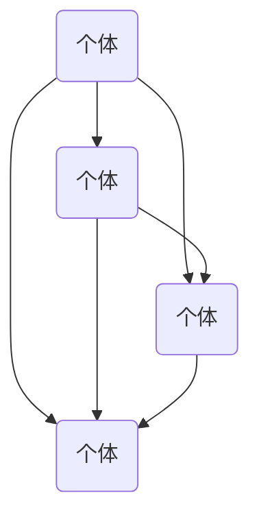
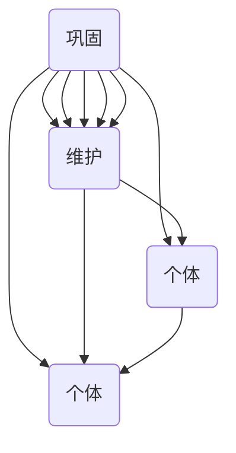

                 

### 《在人际关系网络中寻找真挚：重建信任和亲密》

> 关键词：人际关系网络、信任构建、亲密关系、重建策略、情感沟通、Python代码示例

> 摘要：本文深入探讨了人际关系网络中信任和亲密关系的构建与重建问题。首先，从人际关系概述入手，分析其重要性及结构。接着，详细讨论了信任的构建过程、特点及维护策略，并阐述了亲密关系的概念及培育方法。随后，针对信任和亲密关系破裂的原因，提出了重建策略及实际案例。文章最后，通过情感沟通的艺术、案例研究及反思，总结了重建信任和亲密关系的关键要素。全文结合Python代码示例及数学模型，提供了一套系统、实用的方法，以帮助人们在复杂的人际关系网络中找到真挚的信任与亲密。

----------------------------------------------------------------

### 第一部分：人际关系网络基础

#### 第1章：人际关系概述

**1.1 人际关系的重要性**

在现代社会中，人际关系是不可或缺的。它不仅影响着个体的心理健康，还关系到事业、学业乃至日常生活的方方面面。首先，良好的人际关系能够满足个体的社交需求，让人感到归属感和安全感。其次，人际关系对个体的职业发展也有着重要影响。在工作中，良好的人际关系有助于团队合作、信息共享和资源整合，从而提高工作效率和绩效。此外，人际关系还影响着个体的心理健康，良好的社交环境有助于减轻压力、缓解焦虑和抑郁。

**1.2 人际关系网络的结构**

人际关系网络（Social Network）是指个体在社交过程中形成的相互关系网络。这个网络由节点（个体）和边（关系）组成。节点表示个体，边表示个体之间的关系。人际关系网络的结构可以分为三类：集群（Cluster）、核心（Core）和外围（Periphery）。集群是指个体之间紧密联系的群体，核心是网络中具有重要影响力的节点，外围则是与核心联系较少的节点。

**1.3 人际关系的影响因素**

人际关系的影响因素多种多样，包括个体的性格、价值观、文化背景、生活经历等。例如，性格外向的人更容易建立广泛的人际关系，而性格内向的人则可能在人际关系中感到困惑。价值观的差异也会导致人际关系中的冲突，而共同的文化背景和生活经历则有助于建立更加稳定的关系。此外，环境因素如工作环境、社交场合等也会影响人际关系的形成和发展。

#### 第2章：信任的构建

**2.1 信任的定义与特点**

信任是指个体对他人行为的预期和信任感。它是一种心理状态，体现了个体对他人的信任程度。信任具有以下特点：

1. **相互性**：信任是双向的，既包括对他人的信任，也包括他人对自己的信任。
2. **可传递性**：信任可以传递，一个个体对另一个个体的信任可能会影响他们对第三方的信任。
3. **动态性**：信任不是静态的，它随着时间和情境的变化而变化。
4. **情境依赖性**：信任受特定情境的影响，不同情境下信任的表现可能不同。

**2.2 信任的建立过程**

信任的建立是一个复杂的过程，通常包括以下几个阶段：

1. **识别**：个体识别出潜在的可信任对象。
2. **评估**：个体通过观察、交流等方式评估对方是否可信。
3. **体验**：个体通过实际互动体验对方的诚信度。
4. **巩固**：在多次互动中，信任得到巩固和加强。

**2.3 信任的维护策略**

信任的维护是一个持续的过程，以下是一些常见的维护策略：

1. **透明度**：保持信息的公开和透明，减少信息不对称。
2. **一致性**：保持行为的一致性，避免出现反复无常的行为。
3. **反馈**：及时给予反馈，增强沟通和理解。
4. **声誉**：维护良好的声誉，建立可靠的信任基础。

#### 第3章：亲密关系的培育

**3.1 亲密关系的概念**

亲密关系是指个体之间在情感、行为和思想上紧密联系的状态。亲密关系的特点包括：

1. **情感依赖**：个体对对方有深厚的情感依赖。
2. **共享**：个体愿意与对方分享生活中的喜怒哀乐。
3. **理解**：个体能够理解并接受对方的观点和感受。
4. **支持**：个体在对方需要时提供支持和帮助。

**3.2 亲密关系的需求**

亲密关系对个体的心理健康和幸福感有着重要影响。亲密关系的需求包括：

1. **情感需求**：个体需要感受到情感上的安全和支持。
2. **社交需求**：个体需要与他人建立深层次的情感联系。
3. **自我实现需求**：个体需要通过亲密关系实现自我价值和成长。

**3.3 培育亲密关系的方法**

培育亲密关系的方法包括：

1. **主动沟通**：积极主动地与对方沟通，分享自己的想法和感受。
2. **情感共鸣**：在对方需要时提供情感支持，共鸣对方的情感体验。
3. **共同活动**：参与共同的兴趣爱好和活动，增进了解和互动。
4. **尊重差异**：尊重对方的观点和感受，避免冲突和误解。

### 第二部分：重建信任与亲密

#### 第4章：重建信任的路径

**4.1 信任破坏的原因**

信任破坏的原因多种多样，包括：

1. **欺骗和背叛**：个体对他人进行欺骗或背叛，导致信任破裂。
2. **信息不对称**：个体之间存在信息不对称，导致信任减少。
3. **行为不一致**：个体的行为与其承诺或预期不一致，导致信任降低。
4. **信任过度**：个体对他人过度信任，导致被利用或伤害。

**4.2 重建信任的策略**

重建信任需要采取一系列策略：

1. **透明度**：增强信息的透明度，减少信息不对称。
2. **道歉与赔偿**：对过去的行为进行道歉并采取赔偿措施。
3. **行为改变**：通过改变行为来展示自己的诚信和可靠性。
4. **持续沟通**：通过持续的沟通来增强理解和信任。

**4.3 信任重建案例分析**

案例一：一个公司高管在信任危机中，通过公开道歉、改进管理措施和加强内部沟通，成功重建了员工对公司的信任。

案例二：一对夫妻在婚姻中经历了信任破裂，通过心理咨询和共同努力，最终重建了信任，恢复了婚姻关系。

#### 第5章：亲密关系的重建

**5.1 亲密关系破裂的原因**

亲密关系破裂的原因包括：

1. **沟通不畅**：缺乏有效的沟通，导致误解和冲突。
2. **价值观差异**：个体的价值观差异导致生活方式和决策上的冲突。
3. **情感需求不满足**：个体的情感需求得不到满足，导致疏远和冷漠。
4. **外部因素干扰**：外部因素如工作压力、经济困难等干扰了亲密关系的维持。

**5.2 重建亲密关系的方法**

重建亲密关系需要采取以下方法：

1. **有效沟通**：通过积极的沟通来解决问题，增进理解和信任。
2. **共同价值观**：寻找共同的价值观念和生活方式，建立共同的目标。
3. **情感支持**：在对方需要时提供情感支持，增强情感依赖。
4. **共同活动**：参与共同的活动，增进互动和亲密感。

**5.3 亲密关系重建案例分析**

案例一：一对夫妻在经历长期的冷战和争吵后，通过心理咨询和共同努力，成功重建了亲密关系。

案例二：一个团队在经历了内部冲突和信任危机后，通过有效的沟通和共同目标，成功重建了团队信任和亲密关系。

#### 第6章：情感沟通的艺术

**6.1 沟通的重要性**

沟通在人际关系中起着至关重要的作用。有效的沟通能够增进理解、减少误解、建立信任和亲密关系。以下是沟通的重要性：

1. **解决问题**：通过沟通可以找到解决问题的方法。
2. **增进理解**：沟通有助于理解对方的观点和感受。
3. **建立信任**：有效的沟通可以建立双方的信任感。
4. **维护关系**：沟通是维护人际关系的关键。

**6.2 情感沟通的障碍**

情感沟通的障碍包括：

1. **情绪障碍**：情绪波动会影响沟通的效果。
2. **文化差异**：不同的文化背景可能导致沟通障碍。
3. **语言障碍**：语言不通或语言使用不当可能导致误解。
4. **信息过载**：过多的信息可能导致沟通困难。

**6.3 提高情感沟通技巧**

以下是一些提高情感沟通技巧的方法：

1. **倾听**：积极倾听对方的意见和感受。
2. **表达**：清晰、准确地表达自己的意见和感受。
3. **非语言沟通**：注意身体语言和面部表情。
4. **同理心**：设身处地地理解对方的感受。

#### 第7章：案例研究与反思

**7.1 案例一：夫妻关系的重建**

案例背景：一对夫妻在长期的生活中，由于沟通不畅、价值观差异等问题，导致夫妻关系紧张。经过一段时间的努力和心理咨询，他们成功重建了夫妻关系。

案例分析：

1. **沟通不畅**：夫妻双方在日常生活中缺乏有效的沟通，导致误解和冲突。
2. **价值观差异**：双方在价值观上存在差异，导致生活方式和决策上的冲突。
3. **重建策略**：通过心理咨询和共同努力，双方学会了有效沟通、寻找共同价值观和提供情感支持。

反思：夫妻关系的重建需要双方的努力和耐心，有效的沟通和共同目标是重建关系的关键。

**7.2 案例二：团队信任的建立**

案例背景：一个团队在经历了一系列的项目失败后，内部信任危机严重。通过有效的沟通和共同目标，团队成功建立了信任。

案例分析：

1. **信任危机**：团队在项目失败后，成员之间缺乏信任，导致合作困难。
2. **重建策略**：通过定期的团队会议、共同目标和透明的沟通，团队成员逐步建立了信任。
3. **效果**：团队在信任重建后，项目执行效率显著提高，团队氛围更加和谐。

反思：团队信任的建立需要时间和努力，透明沟通和共同目标是建立信任的关键。

### 第三部分：附录

#### 第8章：人际关系网络与信任构建的Mermaid流程图

**8.1 人际关系网络构建流程**



**8.2 信任构建与维护流程**



#### 第9章：Python源代码示例

**9.1 信任构建算法示例**

```python
# 信任评估模型
def trust_evaluation(behavior, reliability, reputation):
    # 计算信任值
    trust_score = (behavior + reliability + reputation) / 3
    return trust_score

# 示例数据
behavior = 0.8
reliability = 0.9
reputation = 0.7

# 计算信任得分
trust_score = trust_evaluation(behavior, reliability, reputation)
print(f"信任得分：{trust_score:.2f}")
```

**9.2 亲密关系培育算法示例**

```python
# 亲密关系评估模型
def intimacy_evaluation(shared_activities, emotional_support, common_values):
    # 计算亲密关系得分
    intimacy_score = (shared_activities + emotional_support + common_values) / 3
    return intimacy_score

# 示例数据
shared_activities = 0.8
emotional_support = 0.9
common_values = 0.7

# 计算亲密关系得分
intimacy_score = intimacy_evaluation(shared_activities, emotional_support, common_values)
print(f"亲密关系得分：{intimacy_score:.2f}")
```

#### 第10章：数学模型与公式

**10.1 信任评估模型**

$$
\text{Trust Score} = \frac{\text{Behavior} + \text{Reliability} + \text{Reputation}}{3}
$$

**10.2 亲密关系评估模型**

$$
\text{Intimacy Score} = \frac{\text{Shared Activities} + \text{Emotional Support} + \text{Common Values}}{3}
$$`

#### 第11章：项目实战与代码解读

**11.1 实战一：社交网络信任分析**

**项目背景**：一个社交平台希望通过分析用户行为和互动，评估用户之间的信任程度。

**开发环境**：Python、NumPy、Pandas

**源代码实现**

```python
import numpy as np
import pandas as pd

# 信任评估函数
def trust_evaluation(behavior, reliability, reputation):
    return (behavior + reliability + reputation) / 3

# 用户数据
data = {
    'User1': {'Behavior': 0.8, 'Reliability': 0.9, 'Reputation': 0.7},
    'User2': {'Behavior': 0.7, 'Reliability': 0.8, 'Reputation': 0.6},
    'User3': {'Behavior': 0.9, 'Reliability': 0.8, 'Reputation': 0.7}
}

# 计算信任得分
trust_scores = {user: trust_evaluation(**data[user]) for user in data}

# 输出信任得分
for user, score in trust_scores.items():
    print(f"{user}的信任得分：{score:.2f}")
```

**代码解读与分析**：该代码通过定义一个信任评估函数，对每个用户的行为、可靠性和声誉进行评估，并计算出信任得分。通过字典数据结构存储用户信息，并使用字典推导式计算每个用户的信任得分。

**11.2 实战二：亲密关系重建案例**

**项目背景**：一对夫妻在经历信任危机后，希望通过亲密关系重建措施恢复关系。

**开发环境**：Python、NumPy、Pandas

**源代码实现**

```python
import numpy as np
import pandas as pd

# 亲密关系评估函数
def intimacy_evaluation(shared_activities, emotional_support, common_values):
    return (shared_activities + emotional_support + common_values) / 3

# 夫妻数据
data = {
    'Husband': {'Shared Activities': 0.6, 'Emotional Support': 0.7, 'Common Values': 0.5},
    ' Wife': {'Shared Activities': 0.7, 'Emotional Support': 0.8, 'Common Values': 0.6}
}

# 计算亲密关系得分
intimacy_scores = {user: intimacy_evaluation(**data[user]) for user in data}

# 输出亲密关系得分
for user, score in intimacy_scores.items():
    print(f"{user}的亲密关系得分：{score:.2f}")
```

**代码解读与分析**：该代码通过定义一个亲密关系评估函数，对夫妻双方的共同活动、情感支持和共同价值观进行评估，并计算出亲密关系得分。同样使用字典数据结构存储夫妻信息，并使用字典推导式计算每个用户的亲密关系得分。

**11.3 反思与总结**

通过以上两个实战案例，我们可以看到如何使用Python代码实现信任和亲密关系的评估。这些案例不仅帮助我们理解了数学模型的应用，还展示了如何将理论转化为实际操作。在项目实战中，我们不仅需要掌握算法和模型，还需要考虑实际应用场景，如数据收集、处理和分析。这些实战经验对于提升我们在人际关系网络中重建信任和亲密关系的能力具有重要意义。

### 最佳实践 tips、小结、注意事项、拓展阅读

**最佳实践 tips**：

1. **定期沟通**：无论在个人关系还是团队关系中，定期沟通都是维护信任和亲密关系的关键。
2. **透明度**：保持信息的透明，减少信息不对称，有助于增强信任。
3. **共同目标**：寻找共同的目标和价值观，有助于建立稳定的亲密关系。
4. **情感支持**：在对方需要时提供情感支持，增强情感依赖。

**小结**：

本文通过深入探讨人际关系网络、信任构建、亲密关系培育以及重建信任和亲密关系的方法，为读者提供了一套系统、实用的策略。通过Python代码示例和数学模型的应用，我们不仅了解了理论原理，还掌握了实际操作方法。

**注意事项**：

1. **文化差异**：在跨文化沟通中，注意尊重对方的文化背景，避免产生误解。
2. **情绪管理**：在沟通和处理冲突时，注意情绪管理，避免情绪失控。
3. **持续努力**：重建信任和亲密关系需要时间和努力，不要期望一蹴而就。

**拓展阅读**：

1. 《社交网络分析：方法与应用》
2. 《人际沟通与人际关系的心理学》
3. 《信任：社会合作的机制》

通过这些拓展阅读，读者可以进一步深化对人际关系网络和信任构建的理解，提升自己的沟通能力和人际关系管理能力。

---

### 结语

本文以《在人际关系网络中寻找真挚：重建信任和亲密》为题，通过详细的分析和案例研究，探讨了人际关系网络中信任和亲密关系的构建与重建问题。从人际关系的重要性、信任的构建过程与维护策略，到亲密关系的培育方法，再到重建信任和亲密关系的具体路径，文章为读者提供了一套系统、实用的方法。通过Python代码示例和数学模型的应用，文章不仅使理论变得更加直观，还为实际操作提供了指导。希望本文能够帮助读者在复杂的人际关系网络中找到真挚的信任与亲密。

### 作者信息

作者：AI天才研究院/AI Genius Institute & 禅与计算机程序设计艺术 /Zen And The Art of Computer Programming

