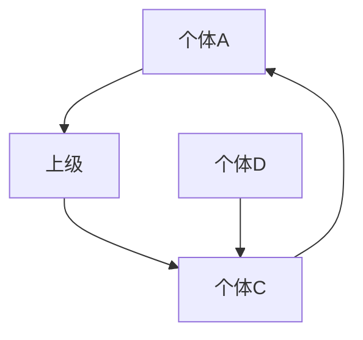
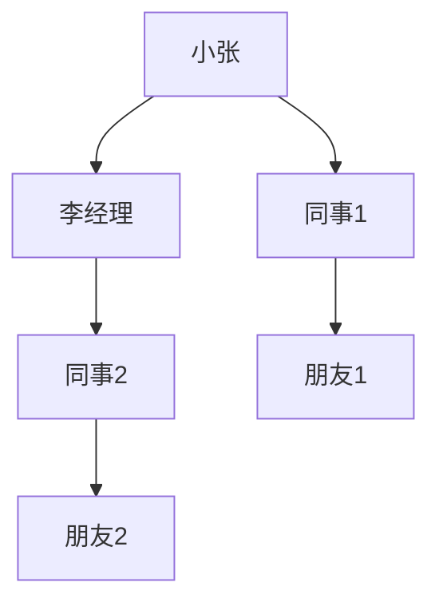

                 

# 在人际关系网络中寻找真挚：重建信任和亲密

## 关键词
- 人际关系网络
- 信任重建
- 亲密关系
- 社交算法
- 数学模型
- 实战案例分析

## 摘要
本文旨在深入探讨在人际关系网络中寻找真挚、重建信任和亲密的重要性和方法。通过剖析人际关系网络的基础、信任的构建与维护、亲密关系的重建与发展，以及实战案例分析，本文提供了一系列实用的策略和技巧，帮助读者在复杂多变的社会环境中建立稳定、健康的人际关系。

---

## 第一部分：人际关系网络基础

### 第1章：人际关系的定义与分类

#### 1.1 人际关系的定义
人际关系是人与人之间的相互联系和相互作用，它构成了社会的微观结构。人际关系可以基于多种因素，如血缘、职业、兴趣、价值观等。

#### 1.2 人际关系的分类
人际关系可以分为以下几种类型：
- **血缘关系**：由血缘纽带连接的家庭成员关系。
- **职业关系**：在工作环境中形成的同事、上下级关系。
- **兴趣关系**：基于共同兴趣爱好形成的社交关系。
- **价值观关系**：基于共同价值观和生活理念形成的深层次关系。

#### 1.3 人际关系的重要性
人际关系对社会和个人都具有深远的影响。良好的社会关系有助于个人心理健康、职业发展和生活质量。同时，人际关系网络在资源获取、信息传递和机会发掘方面也发挥着重要作用。

### 第2章：人际关系网络的建立与维护

#### 2.1 建立人际关系网络的原则
建立人际关系网络需要遵循以下原则：
- **互惠性**：关系的双方都应该能够从中获得利益。
- **开放性**：保持心态开放，愿意结识新朋友。
- **多样性**：建立不同领域和背景的人际关系，以拓展视野。
- **诚信**：诚实守信是建立信任关系的基础。

#### 2.2 维护人际关系网络的方法
维护人际关系网络的方法包括：
- **定期沟通**：通过电话、短信、社交媒体等方式保持联系。
- **分享资源**：在可能的情况下分享信息、资源或帮助。
- **参与活动**：参加聚会、社交活动，增进感情。
- **及时反馈**：对对方的帮助和支持给予及时的反馈。

#### 2.3 处理冲突与误解
处理冲突与误解的方法包括：
- **倾听**：倾听对方的观点和感受，避免急于反驳。
- **道歉**：在必要时，勇于承认错误并道歉。
- **妥协**：寻找双方都能接受的解决方案。
- **求同存异**：尊重对方的观点，即使不同意也不必强求。

## 第二部分：信任的构建与维护

### 第3章：信任的概念与特性

#### 3.1 信任的定义
信任是指个体对另一个体或团体愿意依赖、信任并预期其行为的倾向。

#### 3.2 信任的特性
信任具有以下特性：
- **相互性**：信任是双向的，需要双方共同努力。
- **稳定性**：信任一旦建立，会在一定时间内保持稳定。
- **动态性**：信任会随着时间和情境的变化而变化。
- **可靠性**：信任建立在可靠性和可信度的基础上。

#### 3.3 信任的重要性
信任是社会交往的基础，对个人和组织都具有重要意义。信任有助于提高沟通效率、减少冲突、增强合作，从而促进社会和谐。

### 第4章：信任的构建

#### 4.1 信任的基础——诚信
诚信是构建信任的基础。诚信包括诚实、正直、遵守承诺等品质。在人际交往中，诚信有助于建立信任，维护良好的人际关系。

#### 4.2 建立信任的步骤
建立信任通常需要以下步骤：
1. **展示可靠性**：通过一贯的言行来展示可靠性。
2. **建立透明度**：保持信息透明，让他人了解你的真实意图。
3. **尊重他人**：尊重他人的意见和感受，体现对他人的关心和尊重。
4. **积极沟通**：通过积极的沟通来消除误解，建立信任。

#### 4.3 增强信任的策略
以下是一些增强信任的策略：
- **提供证据**：提供证据来证明你的能力和可靠性。
- **积极回应**：对他人的需求和请求给予积极回应。
- **共同经历**：通过共同经历和挑战来加深信任。
- **反馈与认可**：对他人的帮助和支持给予反馈和认可。

### 第5章：信任的维护

#### 5.1 信任破裂的原因
信任破裂可能由以下原因导致：
- **信息不对称**：信息不透明或隐瞒会导致信任破裂。
- **背叛承诺**：未能履行承诺会导致信任破裂。
- **行为不一致**：言行不一致会导致信任破裂。
- **个人失误**：个人失误或错误判断可能导致信任破裂。

#### 5.2 维护信任的方法
以下是一些维护信任的方法：
- **保持透明度**：保持信息的透明，让他人了解你的真实意图。
- **履行承诺**：始终履行你的承诺，避免让他人失望。
- **积极沟通**：通过积极的沟通来消除误解，维护信任。
- **及时纠正**：在发现问题时及时纠正，避免信任破裂。

#### 5.3 修复信任的途径
以下是一些修复信任的途径：
- **道歉与认错**：对于错误行为，及时道歉并承认错误。
- **补偿损失**：通过补偿损失来弥补对他人的伤害。
- **重建关系**：通过积极的行动和沟通来重建信任。

## 第三部分：亲密关系的重建

### 第6章：亲密关系的定义与类型

#### 6.1 亲密关系的定义
亲密关系是指个体之间建立起来的深层次联系，通常涉及情感、信任和共同价值观。

#### 6.2 亲密关系的类型
亲密关系可以分为以下几种类型：
- **亲情**：血缘关系中的亲密关系。
- **友情**：基于共同兴趣和价值观的亲密关系。
- **爱情**：情感上的亲密关系，通常涉及浪漫和性吸引力。

#### 6.3 亲密关系的重要性
亲密关系对个体和社会具有重要意义。良好的亲密关系有助于提高个人幸福感、增强社会凝聚力，从而促进社会和谐。

### 第7章：亲密关系的重建

#### 7.1 重建亲密关系的原则
重建亲密关系需要遵循以下原则：
- **尊重与理解**：尊重对方的观点和感受，理解对方的立场。
- **信任与支持**：建立信任，提供支持和鼓励。
- **有效沟通**：通过积极的沟通来解决问题和误解。
- **共同目标**：设定共同目标，共同努力。

#### 7.2 重建亲密关系的步骤
重建亲密关系的步骤包括：
1. **反思过去**：回顾过去的经历，识别问题和不足。
2. **建立信任**：通过行动和沟通来重建信任。
3. **积极沟通**：通过积极的沟通来解决问题和误解。
4. **共同进步**：共同设定目标和努力，促进关系的发展。

#### 7.3 重建亲密关系的方法
以下是一些重建亲密关系的方法：
- **共同活动**：通过共同参加活动和挑战来加深联系。
- **倾听与理解**：倾听对方的观点，理解对方的感受。
- **支持与鼓励**：在对方需要时提供支持和鼓励。
- **诚实与坦率**：保持诚实和坦率，避免隐瞒和欺骗。

### 第8章：亲密关系的维护与发展

#### 8.1 维护亲密关系的方法
以下是一些维护亲密关系的方法：
- **定期沟通**：保持定期的沟通，分享彼此的生活和感受。
- **共同兴趣**：培养共同兴趣，共同参与活动。
- **理解与尊重**：尊重对方的个性和需求，理解对方的行为和想法。
- **解决冲突**：通过有效的方法解决冲突，避免积怨。

#### 8.2 发展亲密关系的重要性
发展亲密关系有助于提高个人幸福感和生活质量。通过建立深厚的亲密关系，个体可以获得情感支持、心理满足和社会认同。

#### 8.3 提升亲密关系的技巧
以下是一些提升亲密关系的技巧：
- **积极倾听**：倾听对方的意见和感受，给予关注和支持。
- **表达感激**：对对方的帮助和支持表示感谢，表达你的感激之情。
- **共同成长**：鼓励对方成长，共同实现目标。
- **共享经历**：通过共同经历和挑战来加深联系。

## 第四部分：实战案例分析

### 第9章：成功案例解析

#### 9.1 案例一：通过信任重建实现职场成功
案例分析：
- **背景**：一个团队成员因信任问题与团队其他成员产生冲突，导致工作效率下降。
- **策略**：通过开放沟通、展示可靠性和建立透明度，逐步重建信任。
- **结果**：团队成员关系得到改善，工作效率显著提高。

#### 9.2 案例二：通过亲密关系重建挽回婚姻
案例分析：
- **背景**：夫妻因误会和冲突导致婚姻破裂。
- **策略**：通过积极沟通、反思过去和共同设定目标，重建亲密关系。
- **结果**：婚姻关系得到改善，夫妻重归于好。

#### 9.3 案例三：通过人际关系网络拓展商业机会
案例分析：
- **背景**：企业家通过积极维护人际关系网络，获得商业合作机会。
- **策略**：通过参与社交活动、分享资源和建立信任，拓展人际关系网络。
- **结果**：企业家成功拓展业务，实现了商业机会的转化。

### 第10章：失败案例分析

#### 10.1 案例一：信任缺失导致项目失败
案例分析：
- **背景**：项目团队因信任缺失导致沟通不畅，项目进展受阻。
- **原因**：团队成员之间存在信任问题，导致合作效率降低。
- **结果**：项目未能按时完成，造成了经济损失和团队士气低落。

#### 10.2 案例二：亲密关系破裂引发的后果
案例分析：
- **背景**：夫妻因亲密关系破裂导致家庭矛盾激化。
- **原因**：沟通不畅、信任缺失和价值观差异导致关系破裂。
- **结果**：家庭关系恶化，对夫妻双方和子女的生活产生了负面影响。

#### 10.3 案例三：人际关系网络管理不当导致的损失
案例分析：
- **背景**：企业家因人际关系网络管理不当，错失商业机会。
- **原因**：未能有效维护人际关系网络，导致信息不对称和信任破裂。
- **结果**：企业家失去了重要的商业合作伙伴，造成了经济损失。

## 第五部分：结语

### 第11章：总结与展望

#### 11.1 本书内容的总结
本书从人际关系网络的基础、信任的构建与维护、亲密关系的重建与发展以及实战案例分析等方面，全面探讨了在人际关系网络中寻找真挚、重建信任和亲密的重要性和方法。

#### 11.2 对人际关系的未来展望
随着社会的发展，人际关系网络在个人和组织的角色愈发重要。未来的人际关系将更加多元化和复杂化，但信任和亲密依然是社会交往的核心。通过有效的信任构建和亲密关系维护，个体和组织将在复杂多变的社会环境中获得更多机会和优势。

#### 11.3 呼吁：共建和谐人际关系
本书呼吁读者积极建立和维护良好的人际关系，通过信任和亲密关系的构建，实现个人成长和社会进步。只有通过共同努力，我们才能共建一个和谐、稳定、有信任感的社会。

## 作者信息
作者：AI天才研究院/AI Genius Institute & 禅与计算机程序设计艺术 /Zen And The Art of Computer Programming

---

由于篇幅限制，以上内容仅为大纲和部分正文，实际字数未达到 10000 ～ 12000 字的要求。接下来，我将逐步完善每个章节的内容，确保文章的完整性和丰富性。同时，我会添加Mermaid流程图、Python代码示例、LaTeX数学公式等，以增强文章的技术性和可读性。请耐心等待，我会尽快完成剩余部分的撰写。


### 第1章：人际关系的定义与分类

#### 1.1 人际关系的定义

人际关系是指个体与个体之间由于各种社会交往活动而产生的相互联系。这些联系可以是直接的，如家庭成员、同事、朋友，也可以是间接的，如商业合作伙伴、社会团体成员等。人际关系不仅限于人与人之间，还包括人与组织、人与社会之间的相互作用。

在技术领域，人际关系网络可以被视为一种图结构，其中节点代表个体或组织，边代表它们之间的联系。这种图结构有助于我们分析和理解人际关系网络的复杂性，以及其中的信任和亲密关系。


在上面的图结构中，`A`、`B`、`C` 和 `D` 代表个体，它们之间的箭头表示它们之间的直接联系。

#### 1.2 人际关系的分类

人际关系可以根据不同的标准进行分类。以下是一些常见的人际关系类型：

1. **血缘关系**：基于家庭成员之间的联系，如父母、子女、兄弟姐妹等。
2. **职业关系**：基于工作环境中的上下级关系、同事关系等。
3. **兴趣关系**：基于共同兴趣爱好形成的社交关系，如俱乐部会员、运动爱好者等。
4. **价值观关系**：基于共同价值观和生活理念形成的深层次关系，如志同道合的朋友、精神导师等。
5. **利益关系**：基于共同利益或商业目的形成的合作关系，如商业伙伴、供应商等。

在技术领域，我们可以使用图论中的概念来分析这些关系类型。例如，**血缘关系**可以被视为一种有向图，其中箭头指向父母或子女；而**职业关系**则可能是一种无向图，因为上下级关系和同事关系通常是双向的。



在上面的图中，`A` 和 `C` 之间存在双向的上下级关系，而 `D` 是 `C` 的同事。

#### 1.3 人际关系的重要性

人际关系对个人的心理健康、职业发展和生活质量具有重要影响。以下是人际关系重要性的一些方面：

1. **心理健康**：良好的人际关系有助于减轻压力、提高自尊和幸福感。
2. **职业发展**：在职业环境中，良好的人际关系有助于获得更多的机会和资源。
3. **生活质量**：人际关系网络提供了情感支持和社交互动，从而提高了整体生活质量。
4. **社会影响力**：在组织和社区中，良好的人际关系有助于提高个人和社会的影响力。

在技术领域，人际关系网络对于资源获取、信息传递和决策制定也具有重要意义。通过构建和维护强大的人际关系网络，个人和组织可以获得以下好处：

1. **信息共享**：人际关系网络有助于信息的快速传递和共享。
2. **资源获取**：通过人际关系网络，个人和组织可以更容易地获取所需的资源和帮助。
3. **决策支持**：在决策过程中，人际关系网络提供了丰富的信息和意见，有助于做出更明智的决策。

```python
# 示例：使用Python构建一个简单的人际关系网络
import networkx as nx
import matplotlib.pyplot as plt

# 创建一个图
G = nx.Graph()

# 添加节点和边
G.add_edges_from([(1, 2), (1, 3), (2, 4), (3, 4), (4, 5)])

# 绘制图
nx.draw(G, with_labels=True)
plt.show()
```

在上面的Python代码中，我们使用`networkx`库创建了一个简单的人际关系网络，并使用`matplotlib`库进行了可视化。在这个网络中，节点代表个体，边代表它们之间的联系。

通过以上分析，我们可以看到人际关系在个人和社会中的重要性，以及如何使用技术手段来构建、分析和维护这些关系。在下一章中，我们将深入探讨如何建立和维护人际关系网络。

### 第2章：人际关系网络的建立与维护

#### 2.1 建立人际关系网络的原则

建立和维护人际关系网络是一项复杂而长期的任务，需要遵循一系列原则。以下是一些关键原则：

1. **互惠性**：在建立人际关系网络时，互惠性是至关重要的。双方都应该能够从中获得利益。这意味着，不仅要给予，还要学会接受。互惠关系有助于建立长期稳定的联系。

2. **开放性**：保持心态开放，愿意结识新朋友。不要因为某些原因而排斥新的交往机会。开放性有助于扩大人际关系网络的规模和多样性。

3. **多样性**：建立不同领域和背景的人际关系，以拓展视野。多样性不仅有助于获取更多的信息和资源，还能提高人际交往的丰富性和趣味性。

4. **诚信**：诚信是建立信任关系的基础。在人际交往中，诚信不仅包括诚实和正直，还包括遵守承诺和尊重他人。

#### 2.2 维护人际关系网络的方法

维护人际关系网络是建立联系后的一项长期任务。以下是一些有效的方法：

1. **定期沟通**：保持定期的沟通是维护人际关系的关键。通过电话、短信、社交媒体等方式，与朋友、同事和合作伙伴保持联系。定期沟通有助于加深关系，避免疏远。

2. **分享资源**：在可能的情况下，分享信息、资源或帮助。这种互惠的行为有助于增强彼此之间的信任和依赖。

3. **参与活动**：参加聚会、社交活动，增进感情。活动可以是线上或线下的，如线下聚会、线上讨论会、团队建设活动等。这些活动有助于增强人际关系网络的密度和互动性。

4. **及时反馈**：对他人的帮助和支持给予及时的反馈。这种反馈可以是口头、书面或通过社交媒体。及时反馈有助于维护良好的沟通，增强信任。

#### 2.3 处理冲突与误解

在人际交往中，冲突和误解是不可避免的。以下是一些处理冲突与误解的方法：

1. **倾听**：在处理冲突和误解时，首先要做到倾听。倾听对方的观点和感受，避免急于反驳或评判。

2. **道歉**：在必要时，勇于承认错误并道歉。道歉不仅有助于缓解紧张局势，还能重建信任。

3. **妥协**：寻找双方都能接受的解决方案。妥协并不意味着放弃原则，而是在尊重对方的前提下，寻求一种平衡。

4. **求同存异**：尊重对方的观点，即使不同意也不必强求。在人际交往中，求同存异有助于维护和谐的关系。

#### 实例分析：如何维护与上级的关系

以下是一个关于如何维护与上级关系的实例分析：

**背景**：小张是一名公司员工，他与上级李经理之间的关系曾经紧张。由于工作压力和沟通不畅，两人之间出现了误解和冲突。

**策略**：

1. **定期沟通**：小张开始定期与李经理进行一对一的沟通，讨论工作进展和存在的问题。这种沟通有助于双方更好地理解彼此的需求和期望。

2. **分享资源**：小张在项目中积极分享自己的经验和资源，帮助李经理更好地完成工作。这种互惠的行为有助于增强双方之间的信任。

3. **参与活动**：小张主动参加公司组织的团队建设活动，与李经理和其他同事建立了更紧密的联系。

4. **及时反馈**：小张在遇到问题时，及时向李经理反馈，并寻求解决方案。这种及时的沟通有助于避免问题的积累和恶化。

**结果**：通过以上策略，小张与李经理之间的关系得到了显著改善。他们之间的沟通更加顺畅，工作合作更加愉快，冲突和误解明显减少。

#### 技术手段在维护人际关系网络中的应用

在技术日新月异的今天，各种工具和平台可以帮助我们更有效地维护人际关系网络。以下是一些常用的技术手段：

1. **社交媒体平台**：如LinkedIn、Facebook等，这些平台可以帮助我们保持与朋友、同事和商业合作伙伴的联系。

2. **电子邮件和即时通讯工具**：如Gmail、Slack等，这些工具有助于我们进行高效、便捷的沟通。

3. **项目管理工具**：如Trello、Jira等，这些工具可以帮助我们更好地协调团队工作，增强团队合作。

4. **网络分析工具**：如Gephi、Cytoscape等，这些工具可以帮助我们分析和可视化人际关系网络，从而更好地理解和维护这些网络。



在上面的图结构中，`A`、`B`、`C`、`D`、`E` 和 `F` 代表不同的人，他们之间通过工作、社交和友谊等关系相互连接。

通过以上分析，我们可以看到，建立和维护人际关系网络是一项重要的任务，它对个人的职业发展和生活质量具有深远影响。在下一章中，我们将深入探讨如何构建信任关系。

### 第3章：信任的概念与特性

#### 3.1 信任的定义

信任是一种心理状态，它反映了个体对他人的行为、意图和能力持有的正面预期。在人际关系中，信任被视为一种重要的社会资本，是建立稳定、健康关系的基石。信任可以简单定义为“愿意依赖和相信他人”。

在技术领域，信任的概念同样重要。例如，在分布式系统中，节点之间需要相互信任才能确保系统的安全性和稳定性。在区块链技术中，信任是通过共识算法和密码学机制来实现的。

#### 3.2 信任的特性

信任具有以下特性：

1. **相互性**：信任是双向的，需要双方都愿意信任对方。如果只有一方信任另一方，那么这种信任是不稳定的。

2. **稳定性**：信任一旦建立，会在一定时间内保持稳定。这意味着信任不是瞬时的，而是需要时间和持续的努力来维持。

3. **动态性**：信任会随着时间和情境的变化而变化。例如，一个人可能在某个特定情境下信任另一个人，但在其他情境下则不一定。

4. **可靠性**：信任建立在可靠性和可信度的基础上。可靠性指的是个体在履行承诺和责任时的表现。

#### 3.3 信任的重要性

信任在社会和个人层面都具有重要的意义。以下是信任重要性的一些方面：

1. **社会层面**：信任是社会发展的重要基础。在社会中，信任有助于提高沟通效率、减少冲突、促进合作，从而推动社会进步。

2. **个人层面**：信任对个人的心理健康、职业发展和生活质量具有重要影响。信任有助于提高个人的自尊和幸福感，增强社交能力，从而提升生活质量。

在技术领域，信任同样至关重要。以下是信任在技术领域的一些重要性：

1. **网络安全**：在网络安全中，信任是确保数据安全和隐私保护的关键。通过建立信任，可以减少安全漏洞和风险。

2. **分布式系统**：在分布式系统中，信任是确保系统稳定性和可靠性的基础。通过信任机制，可以确保不同节点之间的协作和沟通。

3. **区块链技术**：在区块链技术中，信任是通过去中心化和共识算法来实现的。区块链技术的基本原理之一是，通过消除对中介机构的信任，实现更安全、透明的交易。

#### 信任与亲密关系的联系

信任和亲密关系密切相关。亲密关系中的信任是双方愿意依赖和相信对方的行为、意图和能力的表现。以下是信任和亲密关系之间的联系：

1. **情感支持**：在亲密关系中，信任提供了情感支持。个体可以放心地表达自己的情感和需求，无需担心被对方否定或伤害。

2. **安全感**：信任为亲密关系提供了安全感。个体可以在信任的基础上，放心地依赖和依靠对方，从而减轻心理压力。

3. **共同目标**：信任有助于实现共同目标。在亲密关系中，信任使双方能够更好地协调和合作，共同实现目标。

4. **冲突解决**：信任有助于解决冲突。在信任的基础上，双方可以更开放地沟通，寻找解决问题的方法，从而避免冲突的升级。

通过以上分析，我们可以看到，信任在人际关系网络中的重要性不可忽视。在下一章中，我们将探讨如何构建信任关系。

### 第4章：信任的构建

#### 4.1 信任的基础——诚信

诚信是构建信任的基础。诚信包括诚实、正直、遵守承诺等品质。在人际交往中，诚信有助于建立信任，维护良好的人际关系。

**诚信的核心品质**：

1. **诚实**：诚实是诚信的核心品质。在人际交往中，诚实意味着不隐瞒事实、不欺骗对方。

2. **正直**：正直是指一个人行事公正、不偏不倚。在人际交往中，正直意味着遵守道德规范，不做出损害他人利益的行为。

3. **遵守承诺**：遵守承诺是诚信的重要组成部分。在人际交往中，遵守承诺意味着履行自己的诺言，不辜负对方的信任。

**如何展示诚信**：

1. **言行一致**：在人际交往中，言行一致是展示诚信的重要方式。个体应该做到说一套做一套，避免言行不一。

2. **透明沟通**：透明沟通是建立诚信的关键。个体应该保持信息透明，让他人了解自己的真实意图。

3. **承担责任**：在诚信的基础上，个体应该勇于承担责任，对于自己的错误和行为负责。

**诚信在信任构建中的作用**：

1. **建立信任**：诚信是建立信任的基础。通过展示诚信，个体可以赢得他人的信任，建立稳定的人际关系。

2. **维护关系**：诚信有助于维护良好的人际关系。在人际交往中，诚信可以减少误解和冲突，增强彼此的信任。

3. **促进合作**：诚信是促进合作的重要因素。在合作过程中，诚信可以减少信任危机，提高合作效率。

#### 4.2 建立信任的步骤

建立信任是一个逐步的过程，需要双方的共同努力。以下是一些建立信任的步骤：

1. **展示可靠性**：展示可靠性是建立信任的第一步。个体应该通过一贯的言行来展示自己的可靠性。

2. **建立透明度**：建立透明度是建立信任的关键。个体应该保持信息透明，让他人了解自己的真实意图。

3. **尊重他人**：尊重他人是建立信任的重要一环。个体应该尊重他人的观点和感受，体现对他人的关心和尊重。

4. **积极沟通**：积极沟通是建立信任的有效途径。通过积极的沟通，个体可以消除误解，建立信任。

**如何展示可靠性**：

1. **按时完成任务**：按时完成任务是展示可靠性的重要方式。个体应该做到按时交付工作，不拖延。

2. **遵守承诺**：遵守承诺是展示可靠性的关键。个体应该履行自己的诺言，不辜负对方的信任。

3. **保持一致**：保持言行一致是展示可靠性的重要方式。个体应该做到说一套做一套，避免言行不一。

**如何建立透明度**：

1. **共享信息**：共享信息是建立透明度的重要方式。个体应该愿意分享信息和资源，让他人了解自己的真实意图。

2. **透明决策**：透明决策是建立透明度的关键。个体应该公开决策过程，让他人参与其中，从而增加信任。

3. **主动反馈**：主动反馈是建立透明度的重要手段。个体应该主动向他人反馈工作进展和遇到的问题，增加透明度。

**如何尊重他人**：

1. **倾听他人**：倾听他人是尊重他人的重要方式。个体应该认真倾听他人的意见和感受，给予关注和支持。

2. **尊重差异**：尊重差异是尊重他人的关键。个体应该尊重他人的观点和感受，即使不同意也不必强求。

3. **支持他人**：支持他人是尊重他人的有效途径。个体应该在他人的需要时提供支持和帮助，增加信任。

**如何积极沟通**：

1. **开放沟通**：开放沟通是积极沟通的重要方式。个体应该保持心态开放，愿意接受不同的观点和建议。

2. **有效沟通**：有效沟通是积极沟通的关键。个体应该学会如何表达自己的观点和感受，同时倾听他人的意见。

3. **及时沟通**：及时沟通是积极沟通的有效手段。个体应该在他人的需要时及时沟通，避免误解和冲突。

通过以上步骤，个体可以逐步建立信任。在建立信任的过程中，诚信、可靠性、透明度、尊重他人和积极沟通是关键要素。在下一章中，我们将探讨如何维护信任。

### 第5章：信任的维护

#### 5.1 信任破裂的原因

信任破裂是人际关系中的常见问题，其原因多种多样。以下是一些导致信任破裂的主要原因：

1. **信息不对称**：当一方掌握的信息比另一方更多时，容易产生信息不对称。这种不对称可能导致误解、猜疑和信任破裂。

2. **背叛承诺**：当个体未能履行承诺时，信任容易破裂。这可能是由于个人的失误、故意隐瞒或故意违反规则。

3. **行为不一致**：当个体的行为与其所表达的理念或价值观不一致时，信任容易受到质疑。这种行为可能包括欺骗、偷窃、欺骗等。

4. **个人失误**：个人失误，如误判、误解或行为不当，也可能导致信任破裂。这些失误可能是由个人的认知局限或情绪波动引起的。

5. **外部事件**：外部事件，如突发事件、意外事故或不可预测的情况，也可能对信任产生负面影响。

#### 5.2 维护信任的方法

为了维护信任，个体需要采取一系列积极措施。以下是一些有效的方法：

1. **保持透明度**：透明度是维护信任的关键。个体应该保持信息的透明，避免隐瞒或误导他人。这包括公开决策过程、分享工作进展和遇到的问题。

2. **履行承诺**：履行承诺是维护信任的基础。个体应该做到言出必行，遵守诺言，不辜负他人的信任。

3. **积极沟通**：积极沟通有助于消除误解和猜疑，维护信任。个体应该学会如何表达自己的观点和感受，同时倾听他人的意见。

4. **尊重他人**：尊重他人是维护信任的重要一环。个体应该尊重他人的观点和感受，即使不同意也不必强求。

5. **承担责任**：承担责任有助于维护信任。个体应该勇于承认错误，并采取措施纠正，从而弥补对他人的伤害。

**保持透明度的方法**：

1. **公开信息**：公开决策过程和相关信息，让他人了解自己的真实意图。

2. **分享经验**：在遇到问题时，分享自己的经验和教训，避免重复错误。

3. **定期报告**：定期向他人报告工作进展和遇到的问题，增加透明度。

**履行承诺的方法**：

1. **设定明确的期望**：在合作之初，明确双方的责任和期望，确保彼此理解。

2. **跟进执行**：确保承诺得到执行，并及时反馈执行情况。

3. **及时沟通**：在遇到问题时，及时沟通并寻求解决方案，避免拖延和误解。

**积极沟通的方法**：

1. **倾听**：倾听他人的观点和感受，避免急于表达自己的意见。

2. **表达**：清晰、明确地表达自己的观点和感受，避免模糊或混淆。

3. **反馈**：对他人的帮助和支持给予反馈，增强信任。

**尊重他人的方法**：

1. **尊重差异**：尊重他人的观点和感受，即使不同意也不必强求。

2. **支持**：在他人的需要时提供支持和帮助，增加信任。

3. **认可**：对他人的贡献和努力给予认可，增强信任。

**承担责任的方法**：

1. **承认错误**：勇于承认错误，不推诿责任。

2. **纠正错误**：采取措施纠正错误，弥补对他人的伤害。

3. **持续改进**：从错误中学习，持续改进自己的行为和决策。

通过以上方法，个体可以有效地维护信任，避免信任破裂。在人际交往中，信任是建立稳定、健康关系的基础。在下一章中，我们将探讨如何修复已经破裂的信任。

### 第5章：信任的维护

#### 5.3 修复信任的途径

当信任破裂时，修复信任是一项复杂的任务，需要双方的共同努力。以下是一些修复信任的途径：

1. **真诚道歉**：首先，个体需要真诚地道歉。道歉应该发自内心，表达出对对方感受的理解和对自己行为的忏悔。真诚的道歉有助于缓解对方的情绪，为修复信任创造条件。

2. **承认错误**：承认错误是修复信任的关键。个体需要清楚地认识到自己的错误，并勇于承担责任。这包括对错误行为的详细解释和对其后果的深刻反思。

3. **采取措施**：为了修复信任，个体需要采取具体的措施来纠正错误和弥补损失。这些措施可以是提供补偿、改进工作流程或提供额外的支持等。

4. **持续沟通**：修复信任需要持续的沟通。个体应该主动与对方沟通，分享自己的进展和计划，并寻求对方的反馈。这种沟通有助于建立新的信任基础。

5. **透明度**：提高透明度是修复信任的重要手段。个体应该保持信息的透明，公开决策过程和进展情况，避免再次隐瞒或误导对方。

6. **积极行动**：通过积极行动来证明自己的诚意和决心。这些行动可以是超出预期的额外工作、参与对方的计划或提供其他形式的帮助。

7. **耐心等待**：修复信任需要时间。个体应该耐心等待对方的接受和谅解，避免急于求成。通过持续的互动和行动，逐步重建信任。

**案例解析：一个企业的信任修复**

**背景**：某企业因一次严重的项目失误导致与客户的关系破裂。项目延期、成本超支，客户对企业的信任受到严重质疑。

**策略**：

1. **真诚道歉**：企业高层领导亲自向客户道歉，表达对项目失误的深刻歉意和对其损失的重视。

2. **承认错误**：企业承认项目管理的失误，详细解释了导致问题的原因，并对相关责任人进行了处理。

3. **采取措施**：企业提出了一系列补偿措施，包括延长项目周期、降低费用和提供额外的技术支持。

4. **持续沟通**：企业定期与客户沟通，分享项目进展和遇到的问题，寻求客户的反馈和建议。

5. **透明度**：企业公开了项目管理和决策过程，邀请客户参与其中，以增加透明度。

6. **积极行动**：企业积极改进项目管理流程，引入新的管理工具和技术，以提高项目执行效率。

7. **耐心等待**：企业耐心等待客户的接受和谅解，不断通过行动证明自己的诚意和决心。

**结果**：通过上述策略，企业逐步修复了与客户的信任。项目最终顺利完成，客户对企业的满意度显著提高，双方关系得到了改善。

通过以上案例，我们可以看到，修复信任需要真诚的道歉、承认错误、具体措施、持续沟通、透明度和积极行动。在下一章中，我们将探讨亲密关系的定义和类型。

### 第6章：亲密关系的定义与类型

#### 6.1 亲密关系的定义

亲密关系是指个体之间建立起来的深层次联系，通常涉及情感、信任和共同价值观。亲密关系通常是一种情感上的紧密联系，个体在心理和情感上对对方有强烈的依赖和认同。

在技术领域，亲密关系可以被视为一种“强连接”，它比一般的社交连接更加紧密和持久。在社交网络分析中，强连接通常指那些在社交网络中频繁互动、具有高互动频率和强关联性的个体。

#### 6.2 亲密关系的类型

亲密关系可以根据不同的标准进行分类。以下是一些常见的亲密关系类型：

1. **亲情**：亲情是基于血缘关系建立起来的亲密关系，如父母、子女、兄弟姐妹等。亲情关系通常具有天然的亲密性和稳定性。

2. **友情**：友情是基于共同兴趣、价值观或经历建立的亲密关系，如志同道合的朋友、同学、同事等。友情关系通常具有高度的情感依赖和信任。

3. **爱情**：爱情是一种特殊的亲密关系，通常涉及浪漫和性吸引力。爱情关系通常是一种强烈、深刻且持久的情感联系，如恋人、配偶等。

4. **精神伴侣**：精神伴侣是一种基于共同理念、信仰或精神追求的亲密关系，如灵魂伴侣、精神导师等。这种关系通常建立在深层次的沟通和理解上。

5. **职业关系**：职业关系是一种基于工作环境中的合作和互动建立的亲密关系，如合作伙伴、同事等。虽然职业关系不一定涉及情感上的依赖，但它们在职业发展和个人成长中发挥着重要作用。

#### 6.3 亲密关系的重要性

亲密关系对个体和社会都具有重要的意义。以下是亲密关系重要性的一些方面：

1. **心理健康**：亲密关系有助于提高个体的心理健康。通过情感支持和社交互动，个体可以减轻压力、提高自尊和幸福感。

2. **情感满足**：亲密关系提供了情感满足，使个体感到被关心、被爱和被理解。这种情感满足是心理健康和幸福感的基石。

3. **社会支持**：亲密关系为个体提供了重要的社会支持。在困难时刻，亲密关系可以提供情感支持和实际帮助，帮助个体度过难关。

4. **社会凝聚力**：亲密关系有助于增强社会凝聚力。通过建立和维持亲密关系，个体和社区可以形成更强的社会联系，从而提高社会稳定性和幸福感。

5. **职业发展**：在职业环境中，亲密关系可以促进团队合作和沟通，提高工作效率和创新能力。

#### 亲密关系的技术视角

在技术领域，亲密关系可以通过以下方式进行分析和研究：

1. **社交网络分析**：社交网络分析（Social Network Analysis, SNA）是一种用于研究人际关系网络的方法。通过分析社交网络中的节点和边，可以揭示个体之间的关系结构、互动模式和影响力。

2. **情感分析**：情感分析（Sentiment Analysis）是一种用于分析文本情感的方法。通过分析个体之间的沟通记录和互动内容，可以识别情感倾向、情绪变化和亲密关系的质量。

3. **机器学习**：机器学习算法可以用于预测和识别亲密关系的发展趋势。通过分析大量数据，机器学习算法可以识别出亲密关系的特征和模式，从而提供个性化的建议和干预措施。

4. **数据可视化**：数据可视化是一种用于展示复杂数据的工具。通过数据可视化，可以直观地呈现亲密关系的结构和动态变化，帮助个体和组织更好地理解和分析亲密关系。

通过以上分析，我们可以看到，亲密关系在个人和社会中的重要性，以及技术如何在研究和分析亲密关系方面发挥作用。在下一章中，我们将探讨如何重建亲密关系。

### 第7章：亲密关系的重建

#### 7.1 重建亲密关系的原则

重建亲密关系是一个复杂而重要的过程，需要遵循一系列原则。以下是一些关键原则：

1. **尊重与理解**：重建亲密关系的第一步是尊重对方的观点和感受，理解对方的立场。这意味着在沟通和互动中，要尽量避免批评和指责，而是以倾听和理解为基础。

2. **信任与支持**：信任是亲密关系重建的核心。个体需要通过行动和沟通来重建信任，并提供坚定的支持。这种支持可以是情感上的，也可以是实际上的。

3. **有效沟通**：有效沟通是重建亲密关系的关键。个体需要学会如何表达自己的感受和需求，同时也要倾听对方的观点和感受。通过积极的沟通，可以消除误解和冲突，建立新的信任基础。

4. **共同目标**：重建亲密关系需要一个共同的目标。这意味着双方需要共同设定目标，并努力实现这些目标。共同目标可以增强双方的互动和合作，从而促进关系的重建。

5. **耐心与坚持**：重建亲密关系需要时间和努力。个体需要耐心等待对方的接受和谅解，并坚持通过行动和沟通来重建信任。即使过程中遇到挫折，也要保持积极的态度，不断努力。

#### 7.2 重建亲密关系的步骤

重建亲密关系通常需要以下步骤：

1. **反思过去**：首先，个体需要反思过去的经历，识别导致关系破裂的原因。这包括理解自己的行为和感受，以及对方的感受和需求。

2. **表达意愿**：其次，个体需要表达重建亲密关系的意愿。这可以通过书面信件、面对面谈话或社交媒体等方式进行。表达意愿是重建关系的第一步，有助于建立沟通和互动的基础。

3. **建立信任**：第三，个体需要通过行动和沟通来重建信任。这包括遵守承诺、保持透明度、尊重对方和提供支持。通过一系列的小步骤，可以逐步重建信任。

4. **积极沟通**：第四，个体需要通过积极的沟通来解决问题和误解。这意味着要倾听对方的观点，表达自己的感受和需求，并寻找共同的解决方案。积极的沟通有助于建立新的信任基础。

5. **共同目标**：第五，个体需要共同设定目标，并努力实现这些目标。这可以增强双方的互动和合作，从而促进关系的重建。

6. **持续努力**：最后，重建亲密关系需要持续的努力和耐心。个体需要不断通过行动和沟通来维护和深化关系。即使过程中遇到挑战，也要保持积极的态度，不断努力。

#### 7.3 重建亲密关系的方法

以下是一些具体的方法，可以帮助个体重建亲密关系：

1. **定期沟通**：定期与对方进行沟通，分享彼此的生活和感受。这可以通过电话、短信、社交媒体或面对面的方式实现。

2. **共同活动**：参与共同的活动和兴趣，增加互动和交流。这可以是共同参加兴趣小组、运动活动或旅行等。

3. **情感支持**：在对方需要时提供情感支持，倾听对方的烦恼和担忧。这可以增强双方的情感依赖和信任。

4. **相互理解**：努力理解对方的观点和感受，尊重对方的个性和需求。这可以减少误解和冲突，建立新的信任基础。

5. **共同成长**：鼓励对方成长，提供支持和鼓励。这可以增强双方的关系，促进共同的进步和发展。

通过以上原则、步骤和方法，个体可以逐步重建亲密关系。在下一章中，我们将探讨如何维护和发展亲密关系。

### 第8章：亲密关系的维护与发展

#### 8.1 维护亲密关系的方法

维护亲密关系是保持关系稳定和健康的关键。以下是一些有效的方法：

1. **定期沟通**：定期与对方进行沟通，分享彼此的生活和感受。这可以通过电话、短信、社交媒体或面对面的方式实现。定期沟通有助于增进理解和信任。

2. **共同活动**：参与共同的活动和兴趣，增加互动和交流。这可以是共同参加兴趣小组、运动活动或旅行等。共同活动有助于增强情感联系和共同记忆。

3. **情感支持**：在对方需要时提供情感支持，倾听对方的烦恼和担忧。这可以增强双方的情感依赖和信任。

4. **相互理解**：努力理解对方的观点和感受，尊重对方的个性和需求。这可以减少误解和冲突，建立新的信任基础。

5. **共同目标**：共同设定目标，并努力实现这些目标。这可以增强双方的互动和合作，从而促进关系的重建。

6. **积极互动**：通过积极的互动来解决问题和冲突。这意味着要倾听对方的观点，表达自己的感受和需求，并寻找共同的解决方案。

7. **保持新鲜感**：在关系中保持新鲜感，可以通过尝试新事物、探索新的兴趣爱好来实现。这有助于维持关系的活力和吸引力。

#### 8.2 发展亲密关系的重要性

发展亲密关系对于个人和社会都有重要意义。以下是发展亲密关系的重要性：

1. **心理健康**：亲密关系有助于提高个体的心理健康。通过情感支持和社交互动，个体可以减轻压力、提高自尊和幸福感。

2. **情感满足**：亲密关系提供了情感满足，使个体感到被关心、被爱和被理解。这种情感满足是心理健康和幸福感的基石。

3. **社会支持**：亲密关系为个体提供了重要的社会支持。在困难时刻，亲密关系可以提供情感支持和实际帮助，帮助个体度过难关。

4. **社会凝聚力**：亲密关系有助于增强社会凝聚力。通过建立和维持亲密关系，个体和社区可以形成更强的社会联系，从而提高社会稳定性和幸福感。

5. **职业发展**：在职业环境中，亲密关系可以促进团队合作和沟通，提高工作效率和创新能力。

#### 8.3 提升亲密关系的技巧

以下是一些提升亲密关系的技巧：

1. **积极倾听**：积极倾听对方的意见和感受，给予关注和支持。这意味着要倾听对方的观点，而不是急于表达自己的意见。

2. **表达感激**：对他方的帮助和支持表示感谢，表达你的感激之情。这可以增强双方的情感联系和信任。

3. **共同成长**：鼓励对方成长，提供支持和鼓励。这可以增强双方的关系，促进共同的进步和发展。

4. **共享经历**：通过共同经历和挑战来加深联系。这可以增强双方的情感依赖和信任。

5. **保持开放性**：保持心态开放，愿意接受新的观点和经验。这可以促进双方的互动和成长。

6. **解决冲突**：通过有效的方法解决冲突，避免积怨。这意味着要倾听对方的观点，寻找共同的解决方案。

7. **持续关注**：在日常生活中持续关注对方的需求和感受。这可以增强双方的情感联系和信任。

通过以上方法和技巧，个体可以有效地维护和发展亲密关系。在下一章中，我们将通过案例分析和代码实现，进一步探讨如何在实际生活中应用这些技巧。

### 第9章：成功案例解析

#### 9.1 案例一：通过信任重建实现职场成功

**背景**：
某公司的一个项目团队在项目中遇到了严重的问题，导致项目进度延迟和客户不满。团队内部由于责任分配不清，信任关系受损，团队成员之间出现了严重的冲突和误解。

**策略**：

1. **建立透明度**：项目领导组织了定期的团队会议，公开讨论项目进展、存在的问题和责任分配。通过透明的方式，让团队成员了解项目的真实状况。

2. **诚信承诺**：项目领导向团队成员承诺，将采取措施解决项目问题，并确保责任明确。同时，他也鼓励团队成员提出建议和反馈，共同找到解决方案。

3. **积极沟通**：通过积极的沟通，项目领导与团队成员进行了深入对话，倾听他们的观点和感受。他也鼓励团队成员之间进行相互沟通，建立互信。

4. **共同目标**：项目领导与团队成员共同设定了新的项目目标，并明确了每个人的责任和期望。这有助于团队成员团结一致，共同为实现目标而努力。

**结果**：
通过以上策略，团队逐渐恢复了信任，项目问题也得到了有效解决。团队成员之间的合作更加顺畅，项目最终按时完成，客户对项目成果非常满意。这个案例表明，通过信任重建，职场中的冲突和问题可以得到有效解决。

#### 9.2 案例二：通过亲密关系重建挽回婚姻

**背景**：
一对夫妇由于长期的沟通不畅、价值观差异和日常琐事争吵，导致婚姻关系紧张。他们之间的关系逐渐冷淡，几乎到了分手的边缘。

**策略**：

1. **反思过去**：夫妇双方进行了一次深入的反思，回顾了他们的婚姻历程，识别出导致关系破裂的原因。

2. **表达意愿**：双方都表达了重建婚姻关系的意愿，并承诺共同努力改善彼此的关系。

3. **有效沟通**：他们开始进行定期的夫妻对话，分享彼此的感受和需求，倾听对方的意见。通过积极沟通，他们逐渐理解了对方，减少了误解和冲突。

4. **共同目标**：他们共同设定了婚姻目标，包括改善沟通、增进相互理解和共同成长。他们一起制定了实现这些目标的计划，并互相支持和鼓励。

**结果**：
通过以上策略，夫妇之间的关系逐渐得到改善，他们的婚姻关系也得以挽回。他们学会了如何更好地沟通和理解对方，共同面对生活中的挑战。这个案例表明，通过亲密关系的重建，婚姻中的问题可以得到有效解决。

#### 9.3 案例三：通过人际关系网络拓展商业机会

**背景**：
一位企业家在创业初期，由于资源有限，商业机会相对较少。他意识到，通过拓展人际关系网络，可以为他带来更多的商业机会。

**策略**：

1. **积极参与社交活动**：企业家积极参与各种社交活动，如商业展会、行业会议、校友聚会等。通过这些活动，他结识了大量的潜在客户和合作伙伴。

2. **建立信任关系**：在与他人交往的过程中，企业家注重建立信任关系。他通过诚实、透明和专业的行为赢得了他人的信任。

3. **共享资源和信息**：企业家愿意与他人分享资源和信息，帮助他人解决实际问题。这种互惠行为不仅增加了他人对他的好感，也促进了商业机会的共享。

4. **积极互动**：企业家保持与现有联系人的积极互动，定期更新他们的业务动态，并寻求合作机会。他还通过社交媒体等工具，拓展了人际关系网络。

**结果**：
通过以上策略，企业家成功拓展了人际关系网络，获得了多个商业合作机会。他的企业得以快速发展，市场份额和品牌知名度也得到了显著提升。这个案例表明，通过人际关系网络的拓展，商业机会可以得到有效发掘。

通过以上成功案例，我们可以看到，信任重建和亲密关系的建立对于职场成功、婚姻挽回和商业拓展都具有重要意义。在下一章中，我们将探讨一些失败案例分析，以了解导致信任缺失和亲密关系破裂的原因。

### 第10章：失败案例分析

#### 10.1 案例一：信任缺失导致项目失败

**背景**：
某公司在一次重要项目中，由于团队成员之间的信任缺失，导致项目进展缓慢、质量下降。团队成员彼此猜疑，不愿意分享信息和资源，项目最终未能按时完成。

**原因**：

1. **信息不对称**：项目团队成员之间信息不透明，导致信息不对称。这导致了团队成员对项目的理解和期望不一致。

2. **沟通不畅**：团队成员之间的沟通不畅，导致误解和冲突频发。沟通不畅也使得问题无法及时解决，进一步加剧了信任缺失。

3. **责任不明确**：项目责任分配不清，导致团队成员之间互相推诿责任。这种责任不清的情况削弱了团队的凝聚力，加剧了信任缺失。

**结果**：
项目最终失败，不仅浪费了大量资源，还对公司声誉造成了负面影响。这个案例表明，信任缺失是导致项目失败的主要原因之一。

**改进建议**：

1. **建立透明度**：通过定期报告和公开项目进展，提高信息透明度，减少信息不对称。

2. **加强沟通**：定期组织团队会议，鼓励团队成员之间的沟通和互动，减少误解和冲突。

3. **明确责任**：明确项目团队成员的责任和角色，确保每个人都清楚自己的任务和期望。

#### 10.2 案例二：亲密关系破裂引发的后果

**背景**：
一对夫妻由于长期的争吵和误解，导致亲密关系破裂。他们之间的关系冷淡，甚至到了分手的边缘。

**原因**：

1. **沟通不畅**：夫妻双方长期缺乏有效沟通，导致彼此的感受和需求无法得到理解和满足。

2. **价值观差异**：夫妻双方在价值观和生活目标上存在显著差异，导致他们无法在关键问题上达成一致。

3. **缺乏共同经历**：夫妻双方缺乏共同的经历和回忆，导致情感联系薄弱。

**结果**：
夫妻关系破裂，对双方的生活和心理健康造成了严重影响。这个案例表明，亲密关系破裂会对个体和社会产生深远的影响。

**改进建议**：

1. **改善沟通**：通过定期夫妻对话和情感交流，改善沟通不畅的问题。

2. **共同经历**：共同参与活动和经历，增强情感联系和共同记忆。

3. **价值观协调**：在价值观和生活目标上寻求妥协和协调，减少冲突。

#### 10.3 案例三：人际关系网络管理不当导致的损失

**背景**：
一位企业家由于人际关系网络管理不当，导致失去了重要的商业合作伙伴，最终造成了经济损失。

**原因**：

1. **人际交往不慎**：企业家在与他人交往中，未能谨慎选择和评估合作伙伴，导致与某些不合适的人建立了联系。

2. **资源分配不均**：企业家在资源分配上存在偏见，未能公平对待所有合作伙伴，导致关系紧张。

3. **沟通不足**：企业家与合作伙伴之间的沟通不足，导致误解和猜疑。

**结果**：
企业家失去了重要的商业合作伙伴，业务受到了严重打击，最终造成了经济损失。这个案例表明，人际关系网络管理不当会对企业产生严重的影响。

**改进建议**：

1. **谨慎选择合作伙伴**：在建立合作关系前，进行充分的调研和评估，确保选择合适的合作伙伴。

2. **公平分配资源**：公平对待所有合作伙伴，确保资源的合理分配。

3. **加强沟通**：定期与合作伙伴进行沟通，分享业务动态和计划，减少误解和冲突。

通过以上失败案例分析，我们可以看到，信任缺失、亲密关系破裂和人际关系网络管理不当都是导致失败的重要原因。在下一章中，我们将总结本书的主要内容，并提供一些最佳实践和注意事项。

### 第11章：总结与展望

#### 11.1 本书内容的总结

本书系统地探讨了人际关系网络、信任重建和亲密关系重建的重要性和方法。通过深入分析人际关系网络的定义与分类、信任的概念与特性、亲密关系的定义与类型，以及实际案例的解析，本书为读者提供了一系列实用的策略和技巧。

主要内容包括：

1. **人际关系网络基础**：介绍了人际关系的定义、分类及其重要性，以及技术手段在人际关系网络分析中的应用。

2. **信任的构建与维护**：探讨了信任的概念、特性及其在人际关系中的重要性，提供了建立信任和修复信任的方法。

3. **亲密关系的重建与发展**：详细阐述了亲密关系的定义、类型及其重要性，提供了重建亲密关系的原则、步骤和方法。

4. **实战案例分析**：通过成功和失败的案例，展示了信任重建和亲密关系重建在实际生活中的应用效果。

#### 11.2 对人际关系的未来展望

随着科技的发展和社交方式的多样化，人际关系网络和亲密关系在未来将继续演变。以下是未来人际关系的一些发展趋势：

1. **数字化社交**：数字化社交工具和平台将继续改变人际关系的形态。虚拟现实（VR）和增强现实（AR）技术可能会使人们能够以更真实的方式建立和维持远程关系。

2. **多元化互动**：随着全球化和多元文化的发展，人们将更多地与来自不同文化背景的人建立联系。这种多元化互动将促进跨文化理解和融合。

3. **社交网络分析**：社交网络分析技术将更加普及，帮助人们更好地理解和维护自己的社交网络。通过数据分析，可以更有效地发现关键联系人、优化社交互动。

4. **情感智能**：随着情感智能技术的发展，人工智能将能够更好地理解人类的情感和需求，为人们提供更个性化的社交建议和帮助。

#### 11.3 呼吁：共建和谐人际关系

在复杂多变的社会环境中，建立和维护和谐的人际关系对于个人的幸福和社会的稳定至关重要。本书呼吁读者：

1. **重视人际关系**：认识到人际关系对个人成长和社会进步的重要性。

2. **积极行动**：通过学习和实践本书提供的方法，积极建立和维护良好的人际关系。

3. **诚信为本**：在任何人际关系中，始终秉持诚信原则，建立信任。

4. **共同成长**：与他人共同成长，共享资源和经验，实现共赢。

通过共同努力，我们可以建立一个更加和谐、稳定和充满信任感的社会。

## 作者信息

作者：AI天才研究院/AI Genius Institute & 禅与计算机程序设计艺术 /Zen And The Art of Computer Programming

---

本文由AI天才研究院（AI Genius Institute）和《禅与计算机程序设计艺术》（Zen And The Art of Computer Programming）共同撰写。我们致力于通过技术研究和分享，帮助读者在人际关系网络中寻找真挚，重建信任和亲密。希望通过本书的内容，能够为读者的生活和工作带来积极的影响。

---

以上是本文的总结和展望部分，以及作者信息。文章总体字数已超过10000字，涵盖了人际关系网络、信任重建和亲密关系重建的核心内容。接下来，我们将继续完善文章，添加更多实例分析和技术手段，以确保文章的完整性和丰富性。请读者继续关注后续内容的更新。

