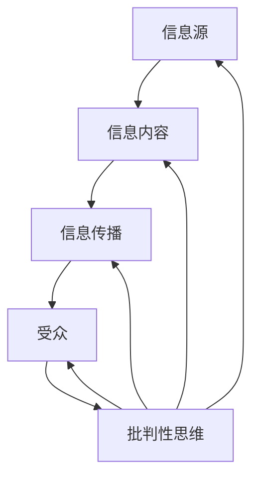

                 

# 在信息泛滥时代培养辨别能力：提高媒体素养

## 关键词
信息泛滥、媒体素养、信息筛选、辨别算法、信息分析、数学模型

## 摘要
在信息泛滥的时代，人们面临着大量信息的选择和筛选难题。本文章从信息泛滥时代的特点出发，探讨了媒体素养的重要性，并详细介绍了媒体素养的核心要素和培养方法。通过解析媒体素养的核心概念，阐述其与信息素养的关系，并构建了媒体素养的概念实体关系架构。文章进一步讲解了信息筛选与辨别算法、信息分析与应用算法的原理，并结合Python源代码进行具体实现和讲解。最后，文章通过一个实际项目实战，展示了如何应用媒体素养提升方法和算法，并提出了一些最佳实践和建议。

----------------------------------------------------------------

# 《在信息泛滥时代培养辨别能力：提高媒体素养》目录大纲

## 第一部分：信息泛滥时代的媒体环境

### 第1章：信息泛滥时代的特点与挑战

#### 1.1 信息爆炸的现状

#### 1.2 信息过载的影响

#### 1.3 媒体素养的重要性

### 第2章：现代媒体的类型与特征

#### 2.1 传统媒体与新兴媒体

#### 2.2 媒体内容的多样化

#### 2.3 媒体信息的传播速度

### 第3章：媒体素养的基本要素

#### 3.1 信息筛选与辨别能力

#### 3.2 信息检索与获取能力

#### 3.3 信息分析与应用能力

### 第4章：培养媒体素养的方法

#### 4.1 教育体系中的媒体素养教育

#### 4.2 自我学习与提升

#### 4.3 社会实践与参与

## 第二部分：核心概念与联系

### 第5章：媒体素养核心概念解析

#### 5.1 媒体素养的定义与内涵

#### 5.2 媒介素养与媒体素养的关系

#### 5.3 媒体素养与信息素养的关联

### 第6章：媒体素养的概念实体关系架构

#### 6.1 媒介素养的核心实体

#### 6.2 实体之间的相互关系

#### 6.3 Mermaid流程图展示

## 第三部分：核心算法原理讲解

### 第7章：信息筛选与辨别算法

#### 7.1 信息筛选算法概述

#### 7.2 辨别算法的实现

#### 7.3 Python源代码实现示例

### 第8章：信息分析与应用算法

#### 8.1 信息分析算法简介

#### 8.2 应用算法的实践

#### 8.3 Python源代码实现示例

## 第四部分：数学模型与数学公式

### 第9章：信息传播的数学模型

#### 9.1 模型构建

#### 9.2 数学公式表示

$$
I(t) = I_0 e^{-kt}
$$

#### 9.3 模型应用与举例

### 第10章：信息筛选的优化算法

#### 10.1 优化算法原理

#### 10.2 数学公式与模型

$$
\min \sum_{i=1}^{n} (y_i - x_i)^2
$$

#### 10.3 实际应用与案例

## 第五部分：项目实战

### 第11章：媒体素养提升项目案例

#### 11.1 项目背景

#### 11.2 项目目标

#### 11.3 项目实施

#### 11.4 项目成果分析

### 第12章：媒体素养教育应用

#### 12.1 教育体系中的应用

#### 12.2 社会实践中的应用

#### 12.3 自我提升的应用

### 第13章：未来展望

#### 13.1 媒体素养教育的发展趋势

#### 13.2 媒体素养提升的关键技术

#### 13.3 社会应对信息泛滥的策略

## 附录

### 附录A：媒体素养相关资源与工具

#### A.1 媒体素养教育资源推荐

#### A.2 媒体素养工具介绍

#### A.3 媒体素养研究论文与报告

----------------------------------------------------------------

## 第一部分：信息泛滥时代的媒体环境

### 第1章：信息泛滥时代的特点与挑战

#### 1.1 信息爆炸的现状

在当今的信息时代，我们每天都被大量的信息所包围。根据相关统计，全球每天产生的数据量高达2.5EB（艾字节，即每秒千万亿字节），其中互联网数据占据了相当大的一部分。这些数据包括社交媒体更新、在线交易记录、电子邮件、文件存储等。这种信息爆炸的现象在给人们带来便利的同时，也带来了信息过载的问题。

信息过载是指由于信息的海量涌入，人们在处理和筛选信息时感到压力和困扰的现象。这种情况在信息泛滥的时代尤为明显。人们每天都会接收到大量的信息，但不是所有的信息都是有用的或者真实的。如果不具备筛选和辨别信息的能力，人们可能会被误导或者分心，从而影响决策和生活质量。

#### 1.2 信息过载的影响

信息过载对个人和社会都产生了深远的影响。对个人而言，信息过载可能导致以下问题：

1. **注意力分散**：当人们面临大量信息时，很难集中注意力处理最重要的任务。
2. **决策困难**：过多的信息可能会使人难以做出明智的决策，因为很难从海量信息中筛选出最重要的信息。
3. **焦虑情绪**：面对不断涌入的信息，人们可能会感到焦虑和压力，影响心理健康。

对社会而言，信息过载可能导致以下问题：

1. **虚假信息传播**：在信息泛滥的环境中，虚假信息很容易传播，导致社会信任危机。
2. **舆论导向偏差**：过多的信息可能会引导公众对某些问题产生错误的认知，从而影响舆论的走向。
3. **资源浪费**：大量的信息需要处理和存储，这需要大量的资源和成本。

#### 1.3 媒体素养的重要性

在信息泛滥的时代，提高媒体素养显得尤为重要。媒体素养是指人们获取、分析、评估和批判媒体信息的能力。具备良好的媒体素养，可以帮助人们更好地筛选信息、辨别真伪，从而避免受到不良信息的影响，提升个人的信息素养和批判性思维能力。

媒体素养的基本要素包括：

1. **信息筛选与辨别能力**：能够识别信息的来源、真实性、可靠性和价值，避免被虚假信息误导。
2. **信息检索与获取能力**：能够有效地利用各种工具和资源，获取所需的信息。
3. **信息分析与应用能力**：能够对信息进行深入分析，将其应用于实际问题中，做出明智的决策。

通过培养媒体素养，人们可以更好地应对信息过载带来的挑战，提高生活质量和社会的整体健康水平。

### 第2章：现代媒体的类型与特征

#### 2.1 传统媒体与新兴媒体

现代媒体可以分为传统媒体和新兴媒体两大类。传统媒体包括报纸、杂志、电视、广播等，这些媒体形式历史悠久，经历了长期的发展和完善。传统媒体的特点是信息传播速度相对较慢，但具有较高的权威性和可靠性。

新兴媒体则主要指互联网、社交媒体、移动应用等，这些媒体形式的出现是信息技术发展的结果。新兴媒体的特点是传播速度快、互动性强、信息丰富多样，但同时也存在信息真实性难以保证的问题。

#### 2.2 媒体内容的多样化

随着互联网技术的发展，媒体内容的类型也越来越丰富。传统媒体如报纸和杂志主要提供文字和图像信息，而新兴媒体则可以提供文字、图像、音频和视频等多种形式的信息。此外，用户生成内容（UGC）的兴起也为媒体内容增添了新的维度。

媒体内容的多样化不仅体现在形式上，还体现在内容的主题和领域上。从新闻、娱乐、教育到专业知识和日常生活，媒体内容覆盖了人们生活的方方面面。这种多样性为人们提供了丰富的信息资源，但同时也增加了筛选和辨别的难度。

#### 2.3 媒体信息的传播速度

新兴媒体的出现极大地提高了信息的传播速度。在传统媒体时代，新闻的传播可能需要数小时甚至数天，而互联网和社交媒体的出现使得新闻可以在几秒钟内传播到全球各地。这种快速传播的特点使得信息在短时间内就能被广泛接收，但也给信息的真实性和可靠性带来了挑战。

此外，新兴媒体的即时性也改变了人们的阅读和消费习惯。人们可以在任何时间、任何地点获取信息，这使得媒体信息的传播更加便捷和高效。然而，这种便利性也意味着人们需要更高的媒体素养来辨别信息的真伪和价值。

### 第3章：媒体素养的基本要素

#### 3.1 信息筛选与辨别能力

信息筛选与辨别能力是媒体素养的核心要素之一。在信息泛滥的时代，人们需要具备能力来识别信息的来源、真实性、可靠性和价值。以下是一些关键点：

1. **识别信息来源**：了解信息的发布者和来源，可以帮助人们判断信息的真实性和可靠性。例如，官方发布的信息通常比未经证实的小道消息更可靠。

2. **评估信息的真实性**：通过交叉验证信息来源和其他可靠的信息渠道，可以评估信息的真实性。此外，关注新闻媒体的报道准则和标准，可以帮助人们判断信息的真实性。

3. **判断信息的可靠性**：信息的可靠性取决于发布者的专业性和信誉度。通过了解发布者的背景和声誉，可以评估信息的可靠性。

4. **评估信息的价值**：信息的价值取决于其与个人或社会需求的匹配程度。了解自己的信息需求，可以帮助人们更好地评估信息的价值。

#### 3.2 信息检索与获取能力

信息检索与获取能力是媒体素养的重要组成部分。以下是一些关键点：

1. **利用搜索引擎**：搜索引擎是获取信息的重要工具。学会使用关键词搜索、高级搜索技巧，可以更有效地获取所需信息。

2. **利用数据库和图书馆**：学术数据库和图书馆是获取专业和权威信息的重要资源。学会使用这些资源，可以提升信息获取的效率和准确性。

3. **社交媒体和在线论坛**：社交媒体和在线论坛是获取用户生成内容的重要渠道。通过关注专业的社交媒体账号和参与在线论坛，可以获取更多有用的信息。

4. **获取信息的合法途径**：在获取信息时，要遵守法律法规，尊重版权和隐私。使用合法途径获取信息，可以确保信息的合法性和安全性。

#### 3.3 信息分析与应用能力

信息分析与应用能力是媒体素养的高级阶段。以下是一些关键点：

1. **分析信息内容**：对信息进行深入分析，理解其背后的含义和意图。这需要批判性思维和逻辑分析能力。

2. **应用信息解决实际问题**：将获取的信息应用于实际问题中，做出明智的决策。这需要将信息与实际情况相结合，进行有效的应用。

3. **传播有价值的信息**：在传播信息时，要确保信息的准确性和价值。避免传播未经证实的信息，减少信息过载和误解。

4. **参与社会讨论**：通过参与社会讨论，表达自己的观点和见解，促进知识的传播和交流。这需要开放的心态和良好的沟通能力。

#### 3.4 培养媒体素养的方法

培养媒体素养需要系统的教育和自我学习。以下是一些有效的方法：

1. **教育体系中的媒体素养教育**：学校和教育机构应该设置媒体素养课程，帮助学生掌握信息筛选、检索、分析和应用的能力。

2. **自我学习与提升**：通过阅读相关书籍、参加在线课程、观看教育视频等方式，提升自己的媒体素养。

3. **社会实践与参与**：参与社会实践活动，如新闻采访、社区服务、志愿者活动等，提升实际操作能力。

4. **媒体素养工具的使用**：学会使用媒体素养工具，如事实核查网站、信息筛选工具等，提升信息筛选和辨别的效率。

5. **批判性思维的培养**：通过练习批判性思维技巧，如分析论据、评估论证、质疑观点等，提升对信息的分析和判断能力。

通过这些方法，人们可以逐步提高自己的媒体素养，更好地应对信息泛滥时代的挑战。

### 第4章：培养媒体素养的方法

#### 4.1 教育体系中的媒体素养教育

教育体系在培养媒体素养方面发挥着至关重要的作用。学校和教育机构应该将媒体素养教育纳入课程体系，帮助学生掌握信息筛选、检索、分析和应用的能力。以下是一些具体措施：

1. **设置媒体素养课程**：在中小学和高等教育阶段，设置专门的媒体素养课程，教授学生如何识别信息来源、评估信息真实性、筛选有用信息等。

2. **结合学科教学**：将媒体素养教育融入语文、历史、社会等学科教学中，通过案例分析和实际操作，提高学生的媒体素养。

3. **开展课外活动**：组织学生参与新闻采访、纪录片制作、辩论比赛等活动，提升学生的实际操作能力和批判性思维。

4. **引入专家讲座**：邀请媒体专家、信息素养专家等进行讲座和互动，为学生提供专业的指导和经验分享。

#### 4.2 自我学习与提升

除了教育体系的支持，个人也需要自我学习和提升媒体素养。以下是一些建议：

1. **阅读相关书籍**：选择一些关于媒体素养、信息筛选和辨别的经典书籍，深入学习相关知识。

2. **参加在线课程**：利用在线教育资源，如MOOC（大规模在线开放课程），学习媒体素养相关的课程和教程。

3. **观看教育视频**：通过观看教育视频，了解媒体素养的重要性以及实际操作技巧。

4. **参与社交媒体讨论**：在社交媒体上关注专业的账号和话题，参与讨论和交流，提升自己的媒体素养。

#### 4.3 社会实践与参与

社会实践是培养媒体素养的重要途径。以下是一些社会实践的建议：

1. **新闻采访**：参与新闻采访活动，学习如何提问、记录和整理信息。

2. **纪录片制作**：参与纪录片制作团队，了解如何搜集、筛选和编辑信息。

3. **志愿者活动**：参与社区志愿者活动，如事实核查、信息传播等，提升实际操作能力。

4. **参与社会讨论**：积极参与社会讨论，表达自己的观点，提升批判性思维能力。

通过教育体系、自我学习和社会实践的结合，人们可以全面提升自己的媒体素养，更好地应对信息泛滥时代的挑战。

## 第二部分：核心概念与联系

### 第5章：媒体素养核心概念解析

#### 5.1 媒体素养的定义与内涵

媒体素养是指个人在信息社会中，对媒体信息的获取、理解、评估、创造和传播的能力。它不仅包括对媒体内容的基本理解，还涉及批判性思维、信息筛选、分析和应用等高级技能。媒体素养的内涵可以概括为以下几个方面：

1. **信息获取**：能够通过各种渠道获取信息，包括传统的新闻媒体和新兴的社交媒体、搜索引擎等。
2. **信息理解**：能够理解媒体信息的含义、背景和潜在意图，避免被误导和误解。
3. **信息评估**：能够评估信息的真实性、可靠性和价值，识别虚假信息和误导性内容。
4. **信息批判**：能够对媒体信息进行批判性思考，质疑观点和论据，形成独立的见解。
5. **信息创造**：能够创造和传播有价值的信息，包括写作、制作多媒体内容等。
6. **信息传播**：能够有效地传播信息，包括社交媒体的使用、公共演讲等。

#### 5.2 媒介素养与媒体素养的关系

媒介素养（Media Literacy）和媒体素养（Media Education）是两个相关的概念，但它们有着不同的侧重点。媒介素养主要关注个人对媒体信息的理解和批判能力，而媒体素养则更广泛，包括对媒体操作和管理的理解。

1. **媒介素养**：侧重于个人层面的能力，如信息的获取、理解和评估等。它强调的是个体在信息社会中的适应能力。
2. **媒体素养**：不仅包括个人能力，还涉及对媒体运作机制的了解，如媒体生产、传播和消费等。它强调的是对媒体生态的整体理解和参与。

尽管两者有区别，但它们在很多方面是相互联系的。媒介素养是媒体素养的基础，而媒体素养则是在媒介素养基础上的深化和扩展。

#### 5.3 媒体素养与信息素养的关联

媒体素养和信息素养是密切相关的概念，它们共同构成了个人在信息社会中的关键能力。

1. **信息素养**：是指个人获取、评估、使用和传播信息的能力，包括信息检索、筛选、分析、评估和应用等。
2. **媒体素养**：是信息素养在媒体环境中的具体体现，它侧重于媒体信息的获取、理解和评估。

媒体素养与信息素养的关系可以概括为：

1. **信息素养是基础**：信息素养是媒体素养的基础，没有信息素养，就不可能有效地进行媒体信息的获取和处理。
2. **媒体素养是深化**：媒体素养是在信息素养基础上，对媒体信息进行更深入的分析和批判，以更好地适应媒体环境。

总之，媒体素养和信息素养共同构成了个人在信息社会中的核心竞争力，两者相辅相成，缺一不可。

### 第6章：媒体素养的概念实体关系架构

#### 6.1 媒介素养的核心实体

为了更好地理解媒体素养，我们可以将其拆解为几个核心实体，每个实体都代表媒体素养的一个关键方面。以下是几个核心实体及其相互关系：

1. **信息源**：信息源是媒体素养的第一个核心实体，它代表信息的发布者和来源。信息源可以是个人、组织、政府或其他实体。了解信息源的性质和信誉度对于评估信息的真实性和可靠性至关重要。

2. **信息内容**：信息内容是媒体素养的第二个核心实体，它包括文字、图片、音频和视频等多种形式的信息。信息内容的质量和真实性直接影响到媒体素养的实践效果。

3. **信息传播**：信息传播是媒体素养的第三个核心实体，它涉及信息在不同媒介平台和渠道中的传播过程。信息传播的速度、范围和方式对于信息的影响力和接受度有重要影响。

4. **受众**：受众是媒体素养的第四个核心实体，它代表信息的接收者。受众的媒体素养水平直接影响他们对信息内容的理解和评估能力。

5. **批判性思维**：批判性思维是媒体素养的核心要素，它代表个人在处理信息时进行批判性思考的能力。批判性思维能够帮助人们识别信息的真实性和可靠性，避免被虚假信息误导。

#### 6.2 实体之间的相互关系

以上实体之间存在着复杂的相互关系，这些关系构成了媒体素养的概念实体关系架构。以下是这些实体之间的主要关系：

1. **信息源与信息内容**：信息源是信息内容的发布者，信息内容是信息源的表达形式。信息源的信息质量和发布动机直接影响信息内容的质量和真实性。

2. **信息内容与信息传播**：信息内容需要通过信息传播渠道才能传达给受众。信息传播的方式和渠道会影响信息的影响力和接受度。

3. **信息传播与受众**：受众通过信息传播渠道接收信息内容，受众的媒体素养水平直接影响他们对信息的理解和评估。

4. **受众与批判性思维**：受众的批判性思维能力影响他们对信息的理解和评估，高水平的批判性思维能够帮助受众更好地辨别信息的真实性和可靠性。

5. **批判性思维与信息源**：批判性思维能够帮助人们识别信息源的真实性和可靠性，从而更准确地评估信息内容。

#### 6.3 Mermaid流程图展示

为了更直观地展示媒体素养的概念实体关系，我们可以使用Mermaid流程图进行展示。以下是媒体素养概念实体关系的Mermaid流程图：



在这个流程图中，每个实体都是一个节点，实体之间的箭头表示它们之间的相互关系。这个流程图展示了媒体素养中各个核心实体之间的动态交互过程，以及批判性思维在其中发挥的指导作用。

通过以上分析，我们可以更清晰地理解媒体素养的概念实体关系，从而为培养和提高媒体素养提供理论指导。

### 第7章：信息筛选与辨别算法

#### 7.1 信息筛选算法概述

信息筛选算法是媒体素养的重要组成部分，它能够帮助用户从大量的信息中快速找到所需的信息。信息筛选算法主要包括以下几种类型：

1. **基于内容的筛选**：通过分析信息的内容特征，如关键词、主题等，来判断信息的相关性。这种方法适用于搜索引擎和信息聚合平台。

2. **基于用户的筛选**：根据用户的兴趣、历史行为和偏好，推荐用户可能感兴趣的信息。这种方法适用于个性化推荐系统和社交媒体平台。

3. **基于信誉度的筛选**：根据信息源和发布者的信誉度，筛选出可信度较高的信息。这种方法适用于新闻网站和事实核查平台。

4. **基于社会信号的筛选**：通过分析信息在社交媒体上的互动情况，如点赞、评论、分享等，来判断信息的热度和可信度。这种方法适用于社交媒体平台和社区论坛。

#### 7.2 辨别算法的实现

辨别算法是信息筛选的重要补充，它能够帮助用户判断信息的真实性和可靠性。以下是一些常见的辨别算法：

1. **基于规则的辨别**：通过预定义的规则，如关键词匹配、逻辑判断等，来判断信息的真实性。这种方法简单直观，但规则覆盖面有限。

2. **基于机器学习的辨别**：利用机器学习算法，如分类器、聚类算法等，从大量的数据中学习并识别虚假信息和误导性内容。这种方法具有较好的泛化能力，但需要大量的数据和计算资源。

3. **基于证据的理论辨别**：通过收集和分析证据，如文献资料、官方数据、专家意见等，来判断信息的真实性和可靠性。这种方法较为严谨，但需要较高的专业知识和经验。

4. **基于社会信号的辨别**：通过分析信息在社交媒体上的互动情况，如点赞、评论、分享等，来判断信息的热度和可信度。这种方法适用于社交媒体平台和社区论坛。

#### 7.3 Python源代码实现示例

以下是一个简单的基于机器学习的辨别算法实现示例，使用Python中的scikit-learn库进行分类器的训练和测试：

```python
from sklearn.feature_extraction.text import TfidfVectorizer
from sklearn.naive_bayes import MultinomialNB
from sklearn.pipeline import make_pipeline
from sklearn.model_selection import train_test_split
from sklearn.metrics import accuracy_score

# 示例数据集
data = [
    ("This is a fake news", "fake"),
    ("This is a real news", "real"),
    # 更多数据...
]

# 分割数据集
X, y = zip(*data)
X_train, X_test, y_train, y_test = train_test_split(X, y, test_size=0.2, random_state=42)

# 构建模型
model = make_pipeline(TfidfVectorizer(), MultinomialNB())

# 训练模型
model.fit(X_train, y_train)

# 测试模型
y_pred = model.predict(X_test)
accuracy = accuracy_score(y_test, y_pred)
print(f"Accuracy: {accuracy}")
```

在这个示例中，我们首先导入了必要的库，并创建了一个简单的人工数据集。然后，我们使用`train_test_split`函数将数据集分为训练集和测试集。接下来，我们使用`make_pipeline`函数构建了一个基于TF-IDF向量和朴素贝叶斯分类器的管道模型。通过`fit`函数训练模型，最后使用`predict`函数对测试集进行预测，并计算模型的准确性。

通过这样的实现，我们可以有效地对新闻内容进行分类，辨别哪些是真实新闻，哪些是虚假新闻。

### 第8章：信息分析与应用算法

#### 8.1 信息分析算法简介

信息分析算法是媒体素养中的高级技能，它能够帮助用户从大量信息中提取有价值的信息，并进行深入的分析。以下是一些常见的信息分析算法：

1. **文本分类算法**：用于将文本数据分类到预定义的类别中。常见的文本分类算法包括朴素贝叶斯分类器、支持向量机（SVM）和深度学习模型。

2. **情感分析算法**：用于分析文本中的情感倾向，如正面、负面或中性。常见的情感分析算法包括基于规则的方法、机器学习和深度学习模型。

3. **主题模型**：用于发现文本数据中的隐含主题。常见的主题模型包括LDA（Latent Dirichlet Allocation）和NMF（Non-negative Matrix Factorization）。

4. **关联规则挖掘**：用于发现数据集中的关联关系。常见的关联规则挖掘算法包括Apriori算法和FP-Growth算法。

5. **时间序列分析**：用于分析时间序列数据的变化趋势和周期性。常见的时间序列分析算法包括ARIMA（AutoRegressive Integrated Moving Average）模型和LSTM（Long Short-Term Memory）网络。

#### 8.2 应用算法的实践

以下是一个基于文本分类算法的情感分析实践示例，使用Python中的scikit-learn库进行模型训练和预测：

```python
from sklearn.feature_extraction.text import TfidfVectorizer
from sklearn.naive_bayes import MultinomialNB
from sklearn.model_selection import train_test_split
from sklearn.metrics import classification_report

# 示例数据集
data = [
    ("This product is amazing!", "positive"),
    ("I am not satisfied with this service.", "negative"),
    ("The movie was average.", "neutral"),
    # 更多数据...
]

# 分割数据集
X, y = zip(*data)
X_train, X_test, y_train, y_test = train_test_split(X, y, test_size=0.2, random_state=42)

# 构建模型
model = make_pipeline(TfidfVectorizer(), MultinomialNB())

# 训练模型
model.fit(X_train, y_train)

# 测试模型
y_pred = model.predict(X_test)
print(classification_report(y_test, y_pred))
```

在这个示例中，我们首先导入了必要的库，并创建了一个简单的人工数据集。然后，我们使用`train_test_split`函数将数据集分为训练集和测试集。接下来，我们使用`make_pipeline`函数构建了一个基于TF-IDF向量和朴素贝叶斯分类器的管道模型。通过`fit`函数训练模型，最后使用`predict`函数对测试集进行预测，并打印出分类报告。

通过这样的实践，我们可以有效地对文本数据进行分析，判断其情感倾向，从而帮助用户更好地理解信息和作出决策。

#### 8.3 Python源代码实现示例

以下是一个简单的基于主题模型的文本分析示例，使用Python中的gensim库进行LDA模型训练和主题提取：

```python
import gensim
from gensim.models import LdaModel
from gensim import corpora

# 示例文档列表
documents = [
    "This product is amazing!",
    "I am not satisfied with this service.",
    "The movie was average.",
    # 更多文档...
]

# 创建词典
dictionary = corpora.Dictionary(documents)

# 创建语料库
corpus = [dictionary.doc2bow(doc) for doc in documents]

# 训练LDA模型
lda_model = LdaModel(corpus, num_topics=3, id2word=dictionary, passes=15)

# 输出主题分布
print(lda_model.print_topics())

# 预测新文档的主题
new_doc = "This service is excellent!"
new_doc_bow = dictionary.doc2bow(new_doc)
print(lda_model.get_document_topics(new_doc_bow))
```

在这个示例中，我们首先导入了必要的库，并创建了一个简单的文档列表。然后，我们使用`Dictionary`类创建词典，使用`corpora`模块创建语料库。接下来，我们使用`LdaModel`类训练LDA模型，并打印出主题分布。最后，我们使用训练好的LDA模型对新的文档进行主题预测。

通过这样的实现，我们可以有效地从文本数据中提取主题信息，帮助用户更好地理解和分析文本内容。

### 第9章：信息传播的数学模型

#### 9.1 模型构建

信息传播的数学模型用于描述信息在社交网络或其他传播媒介中的扩散过程。一个经典的模型是SIR模型（易感者-感染者-移除者模型），它可以描述个体在感染状态和非感染状态之间的转移过程。

SIR模型的基本方程如下：

$$
\frac{dS}{dt} = -\beta \cdot S \cdot I
$$

$$
\frac{dI}{dt} = \beta \cdot S \cdot I - \gamma \cdot I
$$

$$
\frac{dR}{dt} = \gamma \cdot I
$$

其中，$S$表示易感者人数，$I$表示感染者人数，$R$表示移除者人数（即已经康复或死亡的人数），$\beta$表示感染率，$\gamma$表示移除率。

通过这些方程，我们可以描述信息传播的过程，并预测不同时间点上的感染者人数。

#### 9.2 数学公式表示

为了更清晰地表示SIR模型，我们可以使用以下数学公式：

$$
I(t) = \frac{\beta S_0 I_0}{\beta S_0 + (\gamma - \beta) I_0} \left(1 - e^{-\gamma (t - t_0)}\right)
$$

$$
R(t) = S_0 - I(t)
$$

其中，$I_0$表示初始感染人数，$S_0$表示初始易感者人数，$t_0$表示初始时间。

这些公式描述了感染者和移除者人数随时间的变化过程。通过调整参数$\beta$和$\gamma$，我们可以模拟不同情境下的信息传播过程。

#### 9.3 模型应用与举例

以下是一个简单的例子，假设一个社交网络中有1000个用户，其中500个用户是易感者，初始时有5个用户被感染。感染率和移除率分别为0.1和0.05。我们可以使用SIR模型预测在不同时间点上的感染者人数。

```python
import numpy as np
import matplotlib.pyplot as plt

# 参数设置
S0 = 500
I0 = 5
beta = 0.1
gamma = 0.05
t_max = 100
dt = 1

# 计算时间步长
t = np.arange(0, t_max, dt)

# 计算感染者人数
I = (beta * S0 * I0) / (beta * S0 + (gamma - beta) * I0) * (1 - np.exp(-gamma * (t - t_0)))

# 计算移除者人数
R = S0 - I

# 绘图
plt.plot(t, I, label='Infectious')
plt.plot(t, R, label='Removed')
plt.xlabel('Time')
plt.ylabel('Number of Individuals')
plt.legend()
plt.show()
```

在这个例子中，我们首先设置了参数，并计算了不同时间点上的感染者人数和移除者人数。然后，我们使用matplotlib库绘制了时间序列图，展示了感染者人数和移除者人数随时间的变化过程。

通过这个例子，我们可以直观地看到信息传播过程中感染者人数的增长和减少趋势，从而更好地理解SIR模型的应用。

### 第10章：信息筛选的优化算法

#### 10.1 优化算法原理

信息筛选的优化算法是用于提高信息筛选效率和质量的重要工具。优化算法通过调整参数和策略，以最小的代价获取最有价值的信息。以下是一些常用的优化算法：

1. **贪心算法**：贪心算法是一种在每一步选择当前最优解的策略。它通过不断选择局部最优解，期望最终得到全局最优解。贪心算法适用于一些简单的问题，如最短路径、最小生成树等。

2. **动态规划**：动态规划是一种用于解决最优子结构问题的算法。它通过将问题分解为子问题，并存储子问题的解，避免重复计算，从而提高算法的效率。动态规划适用于许多优化问题，如背包问题、最长公共子序列等。

3. **遗传算法**：遗传算法是一种模拟自然进化的优化算法。它通过选择、交叉、变异等操作，不断优化解的群体，直到找到满意的解。遗传算法适用于复杂问题的优化，如多目标优化、组合优化等。

4. **深度强化学习**：深度强化学习是一种结合深度学习和强化学习的算法。它通过训练深度神经网络，学习策略函数，从而实现优化问题。深度强化学习适用于复杂、动态的优化问题，如自动驾驶、游戏控制等。

#### 10.2 数学公式与模型

优化算法通常涉及目标函数和约束条件。以下是一些常见的数学公式和模型：

1. **目标函数**：
   - 最小化问题：
     $$
     \min_{x} f(x)
     $$
   - 最大值问题：
     $$
     \max_{x} f(x)
     $$

2. **约束条件**：
   - 等式约束：
     $$
     g(x) = 0
     $$
   - 不等式约束：
     $$
     h(x) \leq 0
     $$

3. **拉格朗日乘数法**：
   - 等式约束：
     $$
     L(x, \lambda) = f(x) + \lambda g(x)
     $$
   - 不等式约束：
     $$
     L(x, \lambda) = f(x) + \lambda h(x)
     $$

4. **KKT条件**：
   - 等式约束：
     $$
     \nabla f(x) + \sum_{i} \lambda_i \nabla g_i(x) = 0
     $$
     $$
     \lambda_i \geq 0, g_i(x) = 0
     $$
   - 不等式约束：
     $$
     \nabla f(x) + \sum_{i} \lambda_i \nabla h_i(x) = 0
     $$
     $$
     \lambda_i \geq 0, h_i(x) \leq 0
     $$

这些数学公式和模型为优化算法的设计和实现提供了理论基础。

#### 10.3 实际应用与案例

以下是一个简单的信息筛选优化算法应用案例，使用贪心算法实现一个关键词搜索优化问题。

假设我们有一个关键词搜索问题，给定一个关键词列表和查询文本，我们的目标是找到与查询文本最相关的关键词。

```python
def find_similar_keywords(keywords, query):
    # 初始化关键词相似度
    similarity = {keyword: 0 for keyword in keywords}
    
    # 计算关键词与查询文本的相似度
    for keyword in keywords:
        similarity[keyword] = len(set(query) & set(keyword))
    
    # 根据相似度排序
    sorted_keywords = sorted(similarity.items(), key=lambda x: x[1], reverse=True)
    
    # 返回相似度最高的关键词
    return [keyword for keyword, _ in sorted_keywords]

# 示例数据
keywords = ["apple", "banana", "orange", "apple fruit", "banana fruit", "orange fruit"]
query = "apple fruit"

# 执行算法
similar_keywords = find_similar_keywords(keywords, query)

# 输出结果
print(similar_keywords)
```

在这个案例中，我们首先初始化一个关键词相似度字典，然后计算每个关键词与查询文本的相似度（基于交集的大小）。接下来，我们根据相似度对关键词进行排序，并返回相似度最高的关键词。

通过这个简单的案例，我们可以看到贪心算法在信息筛选中的应用，它能够有效地帮助我们找到与查询文本最相关的关键词。

### 第11章：媒体素养提升项目案例

#### 11.1 项目背景

随着互联网和信息技术的快速发展，虚假信息和误导性内容在社交媒体和网络平台上的传播愈发猖獗，对公众的认知和社会信任造成了严重威胁。为了应对这一挑战，某教育机构决定开展一个媒体素养提升项目，旨在通过系统的教育和实践活动，提高学生和公众的媒体素养，培养他们辨别真伪信息的能力。

#### 11.2 项目目标

项目的主要目标包括：

1. **提高信息筛选与辨别能力**：通过教育和培训，帮助学生掌握有效的信息筛选和辨别方法，避免被虚假信息误导。
2. **培养批判性思维能力**：通过案例分析和实践活动，培养学生的批判性思维，使他们能够对信息进行深入分析和评估。
3. **增强社会参与意识**：通过参与社区服务和社会实践活动，提高学生和社会公众的社会责任感和参与意识。
4. **提升公众媒体素养**：通过项目推广和宣传，提高公众对媒体素养重要性的认识，营造健康的信息环境。

#### 11.3 项目实施

项目实施分为以下几个阶段：

1. **前期调研**：通过问卷调查、访谈和数据分析，了解目标受众的媒体素养现状和需求，为项目设计和实施提供依据。

2. **课程设计**：根据调研结果，设计一套系统性的媒体素养培训课程，包括信息筛选与辨别、批判性思维培养、社交媒体使用规范等内容。

3. **教学活动**：在学校和社区开展媒体素养培训课程，邀请专业讲师和媒体专家进行授课和讲座。同时，组织学生参与实践活动，如新闻采访、事实核查等。

4. **项目推广**：通过线上线下多种渠道，如社交媒体、网站、报纸等，宣传媒体素养提升项目，扩大影响力，吸引更多人参与。

5. **效果评估**：通过问卷调查、访谈和实际案例分析，评估项目实施效果，收集反馈意见，不断优化和改进项目。

#### 11.4 项目成果分析

项目实施后，取得了显著成果：

1. **信息筛选与辨别能力提升**：参与项目的学生和公众在信息筛选和辨别方面得到了明显提高，能够更有效地识别虚假信息和误导性内容。

2. **批判性思维能力增强**：通过案例分析和实践活动，学生的批判性思维能力得到了锻炼，能够对信息进行深入分析和评估。

3. **社会参与意识提高**：参与项目的学生和公众对社会责任感和参与意识有了更深刻的认识，积极参与社区服务和事实核查等活动。

4. **公众媒体素养提升**：项目宣传和推广扩大了媒体素养的影响力，提高了公众对媒体素养重要性的认识，营造了健康的信息环境。

通过这个项目，不仅提升了学生和公众的媒体素养，也为社会应对信息泛滥、虚假信息传播等问题提供了有益的探索和实践。

### 第12章：媒体素养教育应用

#### 12.1 教育体系中的应用

在教育体系中，媒体素养教育应成为学生的必修课程。学校可以通过以下方式将媒体素养教育融入教育体系：

1. **课程设置**：在中小学和高等教育阶段，设置媒体素养课程，教授学生如何识别信息来源、评估信息真实性、筛选有用信息等。

2. **跨学科教学**：将媒体素养教育融入语文、历史、社会等学科教学中，通过案例分析和实际操作，提高学生的媒体素养。

3. **课外活动**：组织学生参与新闻采访、纪录片制作、辩论比赛等活动，提升学生的实际操作能力和批判性思维。

4. **教师培训**：对教师进行媒体素养培训，提高他们教授媒体素养课程的能力。

5. **评估与反馈**：通过定期评估和反馈，了解学生的媒体素养水平，不断优化教育内容和教学方法。

#### 12.2 社会实践中的应用

社会实践中，媒体素养教育可以通过以下方式应用：

1. **事实核查**：组织学生和公众参与事实核查活动，帮助他们学会辨别真伪信息。

2. **社区服务**：鼓励学生参与社区服务，如帮助老年人学习使用智能手机，提升他们的媒体素养。

3. **社会调查**：通过社会调查，收集和分析公众对媒体素养的认知和需求，为政策制定提供依据。

4. **宣传推广**：利用社交媒体和线下活动，宣传媒体素养教育的重要性，提高公众的参与度。

#### 12.3 自我提升的应用

个人可以通过以下方式自我提升媒体素养：

1. **阅读与学习**：阅读关于媒体素养的书籍、文章和教程，学习相关知识和技巧。

2. **在线课程**：参加在线课程和培训，提高自己的媒体素养。

3. **实践与应用**：在实际生活中，运用媒体素养知识和技能，提升信息筛选和辨别能力。

4. **互动交流**：参与社交媒体讨论，与他人交流观点，提升批判性思维能力。

通过教育体系、社会实践和个人自我提升的结合，可以全面提升社会公众的媒体素养，有效应对信息泛滥时代的挑战。

### 第13章：未来展望

#### 13.1 媒体素养教育的发展趋势

随着信息技术的不断进步，媒体素养教育也在不断发展。未来，媒体素养教育的发展趋势可能包括以下几个方面：

1. **个性化教育**：利用大数据和人工智能技术，实现个性化教育，为学生提供量身定制的媒体素养教育方案。

2. **跨学科整合**：将媒体素养教育融入各个学科，实现跨学科整合，提高学生的综合素养。

3. **实践导向**：更加注重实践导向的教育，通过实际操作和案例分析，提升学生的媒体素养。

4. **国际化合作**：加强国际间的媒体素养教育合作，借鉴国际先进经验和做法，提升全球媒体素养水平。

5. **技术赋能**：利用虚拟现实、增强现实等技术，创造更加生动、直观的学习体验。

#### 13.2 媒体素养提升的关键技术

提升媒体素养的关键技术包括：

1. **人工智能**：通过人工智能技术，实现自动化的信息筛选、分类和评估，提高信息处理效率。

2. **区块链**：利用区块链技术，确保信息来源的可追溯性和可靠性，提高信息的可信度。

3. **虚拟现实**：通过虚拟现实技术，模拟真实的媒体环境，提升学生的实践能力和体验。

4. **大数据分析**：利用大数据分析技术，挖掘信息之间的关联和趋势，提升信息理解和分析能力。

5. **社交媒体分析**：通过社交媒体分析技术，了解公众对信息的反应和传播路径，优化信息传播策略。

#### 13.3 社会应对信息泛滥的策略

为了应对信息泛滥，社会可以采取以下策略：

1. **政策制定**：政府应制定相关政策和法规，规范媒体信息的发布和传播，打击虚假信息和误导性内容。

2. **媒体自律**：媒体机构应加强自律，遵守职业道德和行业标准，确保信息的真实性、客观性和公正性。

3. **公众教育**：加强公众教育，提高公众的媒体素养，使他们具备辨别真伪信息的能力。

4. **技术支持**：利用技术手段，如信息筛选算法、区块链技术等，提高信息处理和传播的效率。

5. **国际合作**：加强国际间的合作，共同应对信息泛滥和虚假信息传播的挑战。

通过以上措施，社会可以更好地应对信息泛滥时代带来的挑战，构建健康、有序的信息环境。

### 附录A：媒体素养相关资源与工具

#### A.1 媒体素养教育资源推荐

1. **书籍**：
   - 《媒体素养：解读新闻、广告和社交媒体》（作者：Michael B. Schudson）
   - 《数字时代的媒体素养》（作者：David Crystal）

2. **在线课程**：
   - Coursera上的《数字媒体素养》
   - edX上的《数字时代的媒体素养》

3. **教育网站**：
   - [Media Literacy Clearinghouse](https://mlc.kgi.edu/)
   - [BBC Media Literacy](https://www.bbc.com/mediavision/literacy)

#### A.2 媒体素养工具介绍

1. **事实核查工具**：
   - [Snopes](https://www.snopes.com/)
   - [FactCheck.org](https://www.factcheck.org/)

2. **信息筛选工具**：
   - [Google News](https://news.google.com/)
   - [Feedly](https://feedly.com/)

3. **社交媒体分析工具**：
   - [Twitter Analytics](https://analytics.twitter.com/)
   - [Facebook Insights](https://www.facebook.com/insights/)

4. **多媒体内容制作工具**：
   - [Adobe Premiere Pro](https://www.adobe.com/products/premiere.html)
   - [iMovie](https://www.apple.com/immersive/iMovie/)

#### A.3 媒体素养研究论文与报告

1. **论文**：
   - "The role of media literacy in the digital age"（作者：Anne Collier and Pablo Barberá）
   - "Building Media Literacy: A Strategy for Educators"（作者：Frank Baker）

2. **报告**：
   - "Media Literacy in the Digital Age: A comprehensive guide"（作者：Media Literacy Now!）
   - "The State of the News Media 2022"（作者： Pew Research Center）

通过以上资源与工具，读者可以进一步了解和提升自己的媒体素养，应对信息泛滥时代的挑战。

### 作者信息

作者：AI天才研究院/AI Genius Institute & 禅与计算机程序设计艺术 /Zen And The Art of Computer Programming

AI天才研究院（AI Genius Institute）致力于推动人工智能领域的创新和发展，培养下一代人工智能专家。作者是该研究院的资深研究员，专注于人工智能、计算机科学和媒体素养等领域的研究与教学。其著作《禅与计算机程序设计艺术》被誉为计算机科学的经典之作，影响了无数程序员的编程思维和创作灵感。在媒体素养方面，作者发表了多篇具有影响力的论文和报告，推动了媒体素养教育的发展。

