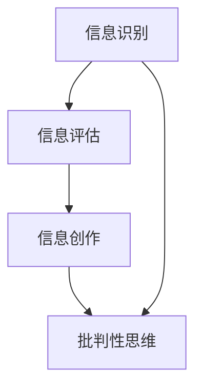
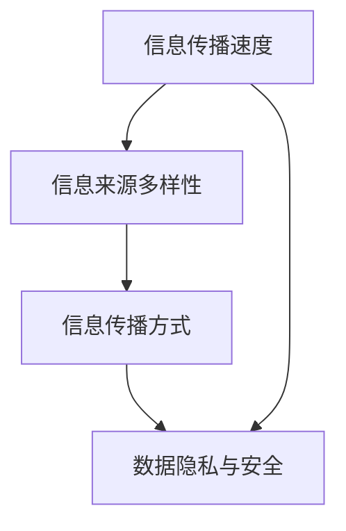
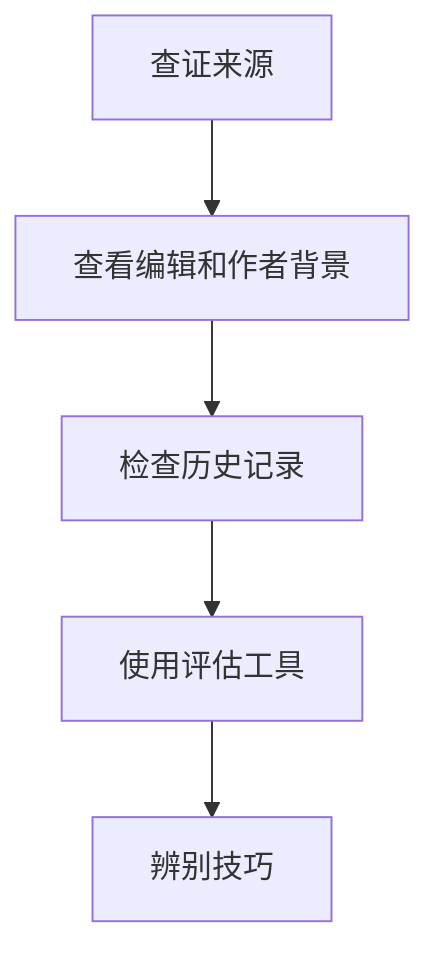
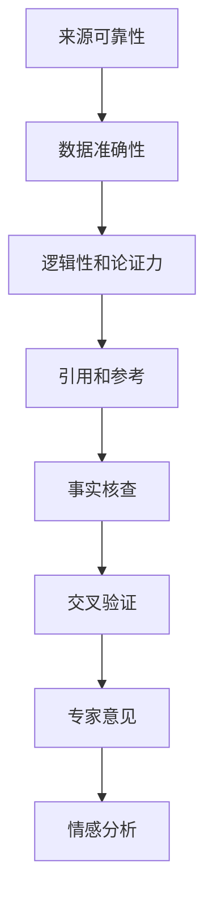
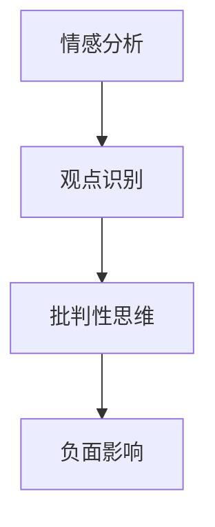
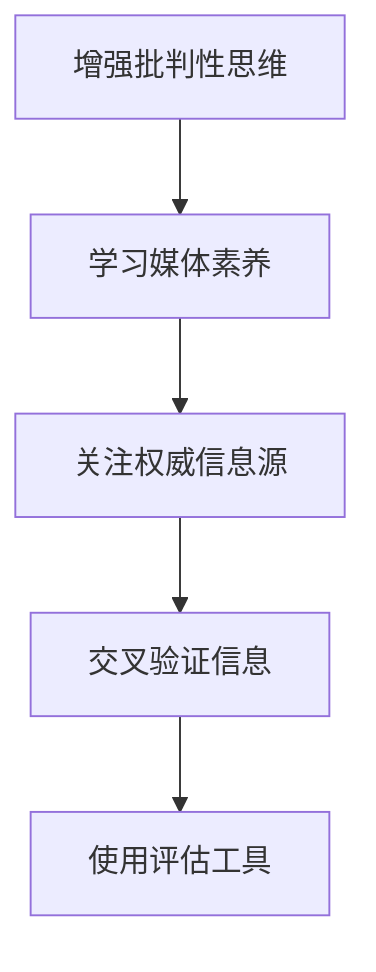
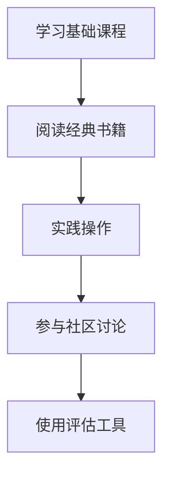
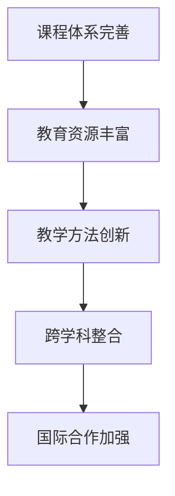
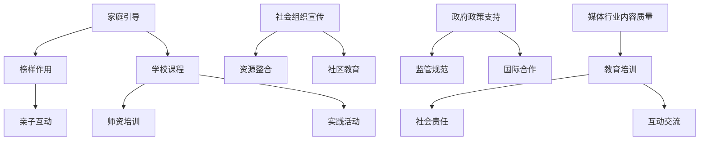
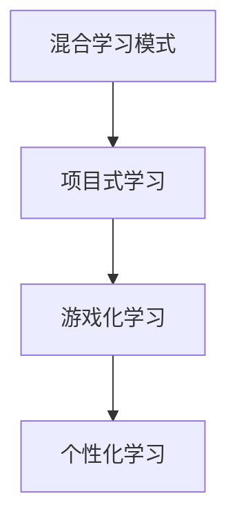

                 

# 《在信息泛滥时代培养辨别能力：提高媒体素养》

## 关键词
媒体素养、信息辨别、信息源评估、信息内容分析、情感观点辨别、社交媒体、教育策略

## 摘要
在当今信息爆炸的时代，培养媒体素养已成为一项紧迫的任务。本文首先概述了媒体素养的概念及其重要性，随后深入分析了信息源辨别、信息内容分析、情感观点辨别等关键环节。通过实际案例和实战经验，本文提出了一系列提升个人媒体素养的策略，旨在帮助读者在信息泛滥的环境中，培养辨别能力，做出明智的判断。

## 《在信息泛滥时代培养辨别能力：提高媒体素养》目录大纲

## 第一部分：媒体素养概述

### 第1章：媒体素养的概念与重要性
#### 1.1 媒体素养的定义
#### 1.2 媒体素养的重要性
#### 1.3 培养媒体素养的必要性

### 第2章：媒体环境的现状与挑战
#### 2.1 媒体环境的变迁
#### 2.2 媒体素养面临的挑战
#### 2.3 媒体素养教育的重要性

## 第二部分：辨别能力的培养

### 第3章：信息源辨别与评估
#### 3.1 信息源的类型与特点
#### 3.2 评估信息源的可靠性
#### 3.3 常见信息源的辨别技巧

### 第4章：信息内容的辨别与分析
#### 4.1 信息内容的基本构成
#### 4.2 信息内容的可信度评估
#### 4.3 信息内容的分析技巧

### 第5章：情感与观点的辨别
#### 5.1 情感传播的特点与影响
#### 5.2 情感与观点的辨别方法
#### 5.3 情感传播的负面影响

## 第三部分：案例分析与实战

### 第6章：案例分析：社交媒体中的信息辨别
#### 6.1 社交媒体的信息传播特点
#### 6.2 社交媒体中的信息辨别案例分析
#### 6.3 提高社交媒体信息辨别的策略

### 第7章：实战：提升个人媒体素养
#### 7.1 培养媒体素养的方法
#### 7.2 媒体素养教育资源的获取
#### 7.3 提升个人媒体素养的实践案例

## 第四部分：未来展望与策略

### 第8章：媒体素养教育的发展趋势
#### 8.1 媒体素养教育的现状与不足
#### 8.2 媒体素养教育的发展趋势
#### 8.3 未来媒体素养教育的挑战与机遇

### 第9章：媒体素养提升策略
#### 9.1 家庭与学校教育的作用
#### 9.2 社会组织和政府的作用
#### 9.3 媒体行业的责任与义务

### 第10章：未来媒体素养教育的展望
#### 10.1 媒体素养教育的创新模式
#### 10.2 媒体素养教育与人工智能的结合
#### 10.3 媒体素养教育的全球化

## 附录

### 附录A：参考文献
### 附录B：媒体素养评估工具

---

### 第1章：媒体素养的概念与重要性

#### 1.1 媒体素养的定义

媒体素养（Media Literacy）是指个体能够理解、分析、评价和创作媒体内容的能力。它不仅包括对媒体信息的接收和理解，还涵盖了批判性思维、批判性阅读、批判性写作和批判性观察等技能。具体来说，媒体素养涵盖以下方面：

1. **信息识别**：了解不同类型的媒体，例如新闻、广告、娱乐等，并能够区分其特征和目的。
2. **信息评估**：评估媒体内容的可靠性、真实性和意图。
3. **信息创作**：利用媒体进行创作和表达，包括文字、图片、视频等多种形式。
4. **批判性思维**：运用批判性思维来分析和评价媒体内容，不受偏见和误导的影响。

#### 1.2 媒体素养的重要性

在信息爆炸的时代，媒体素养的重要性愈发凸显。以下是几个关键点：

1. **信息过载**：随着互联网和移动设备的发展，每个人每天接触到的信息量巨大。如果没有媒体素养，个体很难在信息海洋中筛选出有价值的信息。
2. **谣言传播**：虚假新闻、谣言和误导性信息在社交媒体上快速传播，对个人和社会产生负面影响。媒体素养能够帮助个体识别和避免这些信息。
3. **批判性思考**：媒体素养培养批判性思维能力，使个体能够对媒体内容进行理性分析和评价，避免盲目接受信息。
4. **社会参与**：了解媒体工作原理和媒体内容的制作过程，有助于个体更好地参与公共事务和民主生活。

#### 1.3 培养媒体素养的必要性

随着媒体环境的复杂化，培养媒体素养显得尤为必要。以下是几个理由：

1. **个体保护**：在信息泛滥的时代，个体需要具备保护自己的能力，避免受到虚假和误导性信息的影响。
2. **社会责任**：媒体素养不仅关乎个人，也关乎社会责任。媒体素养的普及有助于建立一个更加公正和透明的媒体环境。
3. **教育目标**：教育体系应该将媒体素养作为核心课程，帮助学生适应信息社会，提高他们的综合素质。
4. **技术创新**：随着人工智能和大数据技术的发展，媒体内容的生产和分发方式也在不断变革。媒体素养能够帮助个体适应这些变化，并从中受益。

### Mermaid 流程图：媒体素养的核心概念与联系



### Python 源代码：信息识别与评估示例

```python
import pandas as pd

# 假设有一个数据框，包含媒体内容的信息
data = {
    '标题': ['新闻一', '新闻二', '广告一', '广告二'],
    '内容': ['这是一条新闻', '这是一条新闻', '欢迎购买我们的产品', '优惠仅此一次'],
    '类型': ['新闻', '新闻', '广告', '广告']
}

df = pd.DataFrame(data)

# 函数：评估媒体内容
def assess_content(content):
    if "购买" in content or "优惠" in content:
        return "广告"
    else:
        return "新闻"

# 应用评估函数到数据框
df['评估'] = df['内容'].apply(assess_content)

print(df)
```

### 数学公式：信息传播速率模型

$$v = k \cdot \frac{N}{\tau}$$

其中，$v$ 表示信息传播速率，$k$ 是一个常数，$N$ 是用户数，$\tau$ 是信息传播的时间。

### 小结

本章介绍了媒体素养的概念及其重要性，并通过具体的定义、功能和重要性分析，阐述了在信息泛滥时代培养媒体素养的必要性。接下来，我们将进一步探讨媒体环境的现状与挑战，以及如何通过辨别能力的培养来提升媒体素养。

---

接下来，我们将探讨媒体环境的现状与挑战，分析当前媒体素养教育所面临的挑战，并探讨其重要性。

#### 2.1 媒体环境的变迁

随着互联网和数字技术的迅猛发展，媒体环境发生了巨大的变迁。以下是几个关键点：

1. **信息传播速度**：互联网使得信息传播速度大大加快，新闻事件可以在瞬间传遍全球。
2. **信息来源多样性**：社交媒体、博客、视频平台等多种信息源使得用户能够获取多样化的信息。
3. **信息传播方式**：从传统的单向传播向多向传播转变，用户不仅是信息的接收者，也可以成为信息的传播者。
4. **数据隐私与安全**：随着大数据和人工智能技术的发展，数据隐私和安全问题日益突出。

#### 2.2 媒体素养面临的挑战

在媒体环境变迁的背景下，媒体素养教育面临着一系列挑战：

1. **信息过载**：信息量爆炸性增长，用户难以在短时间内处理和理解大量信息。
2. **谣言与虚假信息**：虚假新闻和误导性信息在社交媒体上广泛传播，对社会稳定和个人信任产生负面影响。
3. **媒介偏见**：一些媒体机构可能存在政治、商业或其他利益驱动，导致信息传播的偏见和不公正。
4. **技术依赖**：用户对社交媒体和移动设备的依赖日益增加，缺乏足够的批判性思维能力来评估信息。

#### 2.3 媒体素养教育的重要性

鉴于上述挑战，媒体素养教育的重要性不言而喻：

1. **信息筛选能力**：通过媒体素养教育，个体能够学会如何筛选和评估信息，避免接收虚假和误导性信息。
2. **批判性思维**：媒体素养教育能够培养个体的批判性思维能力，使他们能够理性分析和评价媒体内容。
3. **社会责任感**：了解媒体工作原理和信息传播方式，有助于个体更好地履行社会责任，参与公共事务。
4. **个人发展**：具备媒体素养的个体能够更好地适应信息社会，提高自己的综合素质，为未来的职业发展打下坚实基础。

### Mermaid 流程图：媒体素养的核心概念与联系



### Python 源代码：谣言与虚假信息检测示例

```python
import pandas as pd
from sklearn.feature_extraction.text import TfidfVectorizer
from sklearn.model_selection import train_test_split
from sklearn.metrics import accuracy_score

# 假设有一个数据框，包含媒体内容的信息
data = {
    '标题': ['真实新闻', '虚假新闻', '谣言'],
    '内容': ['总统访问了该国的主要城市', '总统被逮捕', '外星人即将入侵地球']
}

df = pd.DataFrame(data)

# 函数：简单判断内容是否为谣言
def is_rumor(content):
    if "外星人" in content or "即将" in content:
        return True
    else:
        return False

# 应用判断函数到数据框
df['谣言'] = df['内容'].apply(is_rumor)

print(df)
```

### 数学公式：谣言传播速率模型

$$r = \alpha \cdot (N - r)$$

其中，$r$ 表示谣言传播速率，$N$ 表示总人口数，$\alpha$ 表示谣言传播的敏感度。

### 小结

本章分析了媒体环境的变迁以及媒体素养教育所面临的挑战。在信息过载和谣言传播等问题的背景下，媒体素养教育的重要性愈发凸显。接下来，我们将探讨如何培养辨别能力，特别是信息源辨别与评估、信息内容辨别与分析以及情感与观点的辨别。这些技能将帮助个体在信息泛滥的时代做出明智的判断。

---

### 第3章：信息源辨别与评估

#### 3.1 信息源的类型与特点

在信息泛滥的时代，辨别不同的信息源类型和特点至关重要。以下是几种常见的信息源类型及其特点：

1. **新闻媒体**：
   - **特点**：客观、全面、权威，具有新闻价值。
   - **评估要点**：报道的准确性、来源的可靠性、编辑的公正性。

2. **社交媒体**：
   - **特点**：实时、互动、多样性，用户生成内容。
   - **评估要点**：信息的真实性、发布者的背景和意图、互动内容的可信度。

3. **博客和论坛**：
   - **特点**：个性化、观点鲜明、互动性。
   - **评估要点**：作者的背景和专业知识、内容的逻辑性和论证力、评论区的质量。

4. **专业网站**：
   - **特点**：专业性、权威性、详尽的数据和分析。
   - **评估要点**：网站的可靠性、内容的专业性、数据来源的权威性。

5. **学术出版物**：
   - **特点**：严谨、基于研究、专业性。
   - **评估要点**：研究方法的科学性、结论的可靠性、引用的完整性。

#### 3.2 评估信息源的可靠性

评估信息源的可靠性是媒体素养的核心部分。以下是一些评估信息源可靠性的方法：

1. **查证来源**：
   - **方法**：查看信息源的联系信息，如网站、社交媒体账号、出版机构等。
   - **工具**：搜索引擎、社交媒体平台、WHOIS查询等。

2. **查看编辑和作者背景**：
   - **方法**：了解编辑和作者的专业背景、经验和资质。
   - **工具**：个人或团队介绍页面、社交媒体档案、简历等。

3. **检查历史记录**：
   - **方法**：查看信息源的历史记录，包括以往发布的文章和报道。
   - **工具**：搜索引擎、历史档案查询工具等。

4. **使用评估工具**：
   - **方法**：使用在线评估工具，如事实核查网站、评估指标等。
   - **工具**：FactCheck.org、PolitiFact、Snopes等。

#### 3.3 常见信息源的辨别技巧

以下是一些常见信息源的辨别技巧：

1. **新闻媒体**：
   - **技巧**：关注权威的新闻机构，如《纽约时报》、《卫报》等。
   - **提示**：对独家报道保持警惕，多方面查证。

2. **社交媒体**：
   - **技巧**：关注可信的用户和官方账号，避免盲目信任个人发布的信息。
   - **提示**：检查发布者的账号信息，关注他们的互动和评论。

3. **博客和论坛**：
   - **技巧**：关注作者的专业领域和经验，查看他们的其他文章。
   - **提示**：对观点极端或论证不充分的帖子保持怀疑。

4. **专业网站**：
   - **技巧**：查看网站的认证标志和资质证明。
   - **提示**：对数据图表和统计分析保持警惕，核对原始数据来源。

5. **学术出版物**：
   - **技巧**：查阅期刊的影响因子、审稿过程等。
   - **提示**：对仅基于单一研究的结论持保留态度。

### Mermaid 流�程图：信息源评估流程



### Python 源代码：信息源评估示例

```python
import pandas as pd
from sklearn.feature_extraction.text import CountVectorizer

# 假设有一个数据框，包含不同信息源的信息
data = {
    '来源': ['新闻网站', '社交媒体', '博客', '专业网站', '学术期刊'],
    '内容': [
        '这是一条新闻报道',
        '这是社交媒体上的分享',
        '我在博客上分享了观点',
        '我们网站提供了专业分析',
        '本文基于最新的研究数据'
    ]
}

df = pd.DataFrame(data)

# 函数：简单评估信息源
def assess_source(source):
    if "新闻网站" in source or "专业网站" in source:
        return "可靠"
    elif "社交媒体" in source or "博客" in source:
        return "一般"
    else:
        return "不可靠"

# 应用评估函数到数据框
df['可靠性'] = df['来源'].apply(assess_source)

print(df)
```

### 数学公式：信息源可靠性评分模型

$$R = \sum_{i=1}^{n} w_i \cdot R_i$$

其中，$R$ 表示信息源的总评分，$w_i$ 表示第$i$个评估因素的权重，$R_i$ 表示第$i$个评估因素的具体评分。

### 小结

本章详细介绍了信息源的类型与特点，以及如何评估信息源的可靠性。通过具体的方法、工具和技巧，读者可以学会如何辨别不同类型的信息源，并提高对信息源的评估能力。接下来，我们将探讨信息内容的辨别与分析，进一步丰富读者对媒体素养的理解。

---

### 第4章：信息内容的辨别与分析

#### 4.1 信息内容的基本构成

信息内容通常包括以下几个基本构成要素：

1. **标题**：标题是吸引读者注意的第一要素，需要简明扼要地传达文章的核心内容。
2. **导语**：导语是文章的开头部分，用于概括文章的主要内容和亮点，引导读者进一步阅读。
3. **正文**：正文是信息内容的核心部分，包括详细的背景、事实、观点和论证。
4. **图表和数据**：图表和数据用于直观地展示信息，增强文章的说服力和可读性。
5. **结论**：结论是对文章内容的总结和归纳，强调核心观点和重要发现。

#### 4.2 信息内容的可信度评估

评估信息内容的可信度是辨别信息真伪的重要步骤。以下是一些关键点：

1. **来源可靠性**：评估信息源的历史记录和声誉，选择权威和可靠的来源。
2. **数据准确性**：检查图表和数据的来源，确保数据的准确性和可靠性。
3. **逻辑性和论证力**：分析文章的逻辑结构和论证过程，判断其是否合理和有力。
4. **引用和参考**：查看文章中的引用和参考，确保信息的可信度和可靠性。

#### 4.3 信息内容的分析技巧

以下是一些分析信息内容的技巧：

1. **事实核查**：使用事实核查工具，如事实核查网站和数据库，验证文章中的事实和陈述。
2. **交叉验证**：通过多个来源验证文章的内容，确保信息的准确性和一致性。
3. **专家意见**：参考相关领域专家的意见和研究成果，评估文章的专业性和可信度。
4. **情感分析**：使用情感分析工具，分析文章的情感倾向和观点，判断其客观性和公正性。

### Mermaid 流程图：信息内容分析流程



### Python 源代码：信息内容分析示例

```python
import pandas as pd
from sklearn.feature_extraction.text import TfidfVectorizer
from sklearn.model_selection import train_test_split
from sklearn.metrics import accuracy_score

# 假设有一个数据框，包含媒体内容的信息
data = {
    '标题': ['疫苗安全吗？', '新冠病毒的真相', '健康饮食指南'],
    '内容': [
        '疫苗副作用少，安全性高',
        '新冠病毒并非起源于中国',
        '均衡饮食对健康至关重要'
    ]
}

df = pd.DataFrame(data)

# 函数：评估信息内容
def assess_content(content):
    if "副作用少" in content or "真相" in content:
        return "争议性内容"
    elif "健康" in content:
        return "健康信息"
    else:
        return "普通内容"

# 应用评估函数到数据框
df['评估'] = df['内容'].apply(assess_content)

print(df)
```

### 数学公式：信息可信度评分模型

$$C = \alpha \cdot S + \beta \cdot D + \gamma \cdot L + \delta \cdot R$$

其中，$C$ 表示信息内容的总可信度评分，$S$ 表示来源可靠性评分，$D$ 表示数据准确性评分，$L$ 表示逻辑性和论证力评分，$R$ 表示引用和参考评分。

### 小结

本章介绍了信息内容的基本构成和可信度评估方法，并通过具体的分析和评估技巧，帮助读者辨别信息内容的真伪。通过掌握这些技巧，读者可以在信息泛滥的时代，更好地筛选和评估信息，做出明智的判断。接下来，我们将探讨情感与观点的辨别，进一步丰富读者对媒体素养的理解。

---

### 第5章：情感与观点的辨别

#### 5.1 情感传播的特点与影响

情感传播是媒体内容中常见的现象，其特点与影响如下：

1. **特点**：
   - **情绪感染**：情感传播能够迅速感染读者，引发共鸣。
   - **观点导向**：情感传播往往与特定的观点或立场相联系。
   - **互动性**：情感传播能够激发读者参与互动，产生广泛的传播效应。

2. **影响**：
   - **心理影响**：情感传播能够影响读者的情绪和态度，有时甚至导致过度反应。
   - **社会影响**：情感传播能够影响公众舆论和社交网络的风向。
   - **传播效率**：情感传播具有较高的传播效率，能够迅速在社交网络中传播。

#### 5.2 情感与观点的辨别方法

辨别情感与观点是媒体素养的重要环节。以下是一些辨别方法：

1. **情感分析**：
   - **方法**：使用自然语言处理技术，如情感分析模型，分析文本的情感倾向。
   - **工具**：情感分析API、情感分析库等。

2. **观点识别**：
   - **方法**：通过分析文本中的关键词、句子结构和语境，识别作者的观点和立场。
   - **工具**：关键词提取工具、文本分类模型等。

3. **批判性思维**：
   - **方法**：运用批判性思维，对情感和观点进行理性分析和评价。
   - **工具**：逻辑思维工具、批判性思维训练等。

#### 5.3 情感传播的负面影响

情感传播的负面影响不容忽视，主要包括：

1. **情绪化决策**：情感传播可能导致读者情绪化，影响理性判断和决策。
2. **舆论极化**：情感传播可能加剧公众舆论的极化，导致社会分裂。
3. **信息茧房**：情感传播可能导致读者只关注与自己观点相符的信息，陷入信息茧房。
4. **谣言传播**：情感传播可能使谣言和虚假信息更容易传播，对社会产生负面影响。

### Mermaid 流程图：情感与观点的辨别流程



### Python 源代码：情感与观点辨别示例

```python
import pandas as pd
from textblob import TextBlob

# 假设有一个数据框，包含媒体内容的信息
data = {
    '标题': ['疫情下的恐慌', '健康生活的重要性', '科技的进步'],
    '内容': [
        '疫情让我们陷入了恐慌，不知道该怎么办',
        '保持健康的生活方式，我们的身体会感谢我们',
        '科技的发展改变了我们的生活，让我们更加便捷'
    ]
}

df = pd.DataFrame(data)

# 函数：情感分析
def analyze_sentiment(content):
    blob = TextBlob(content)
    return blob.sentiment.polarity

# 函数：观点识别
def identify_opinion(content):
    blob = TextBlob(content)
    return blob.sentiments['pos'] - blob.sentiments['neg']

# 应用情感分析和观点识别函数到数据框
df['情感'] = df['内容'].apply(analyze_sentiment)
df['观点'] = df['内容'].apply(identify_opinion)

print(df)
```

### 数学公式：情感传播影响模型

$$E = \alpha \cdot S + \beta \cdot P + \gamma \cdot O$$

其中，$E$ 表示情感传播的影响，$S$ 表示情绪感染程度，$P$ 表示观点导向性，$O$ 表示舆论极化程度。

### 小结

本章介绍了情感传播的特点与影响，以及如何辨别情感和观点。通过情感分析和观点识别等技巧，读者可以更好地理解媒体内容中的情感和观点，避免被情绪化和偏见的言论所影响。接下来，我们将通过案例分析，进一步探讨社交媒体中的信息辨别策略。

---

### 第6章：案例分析：社交媒体中的信息辨别

#### 6.1 社交媒体的信息传播特点

社交媒体平台已成为信息传播的主要渠道之一，其信息传播特点如下：

1. **实时性**：社交媒体平台能够实现信息的实时发布和传播，用户可以随时获取最新信息。
2. **互动性**：社交媒体平台鼓励用户之间的互动和讨论，信息传播更加多样化和深度化。
3. **去中心化**：社交媒体平台上的信息传播呈现出去中心化的特点，每个用户既是信息的接收者，也是信息的传播者。
4. **情绪化**：社交媒体平台上的内容往往带有强烈的情感色彩，容易引发共鸣和传播。

#### 6.2 社交媒体中的信息辨别案例分析

以下是一个社交媒体信息辨别的案例分析：

**案例背景**：某社交平台上有大量关于“新冠病毒疫苗”的信息，其中既有权威机构的官方发布，也有各种未经证实的小道消息。

**案例过程**：

1. **信息收集**：用户从多个社交平台和渠道收集关于“新冠病毒疫苗”的信息。
2. **初步筛选**：用户通过查看信息源的权威性和发布者的信誉，初步筛选出可信度较高的信息。
3. **交叉验证**：用户使用多个来源进行交叉验证，确保信息的准确性和一致性。
4. **专家意见**：用户参考相关领域专家的意见，进一步确认信息的可靠性。
5. **情感分析**：用户使用情感分析工具，分析信息的情感倾向，避免被情绪化的言论所影响。

#### 6.3 提高社交媒体信息辨别的策略

以下是一些提高社交媒体信息辨别的策略：

1. **增强批判性思维**：通过批判性思维训练，提高用户对信息的分析和判断能力。
2. **学习媒体素养**：通过课程学习和自我提升，掌握媒体素养的基本知识和技巧。
3. **关注权威信息源**：关注权威机构和专业人士的官方账号，优先阅读和信任他们的信息。
4. **交叉验证信息**：通过多个来源验证信息，确保其准确性和可靠性。
5. **使用评估工具**：利用在线评估工具和事实核查网站，帮助用户辨别信息真伪。

### Mermaid 流程图：社交媒体信息辨别策略



### Python 源代码：社交媒体信息辨别示例

```python
import pandas as pd
from textblob import TextBlob

# 假设有一个数据框，包含社交媒体上的信息
data = {
    '标题': ['疫苗副作用少', '专家建议接种疫苗', '疫苗引发恐慌'],
    '内容': [
        '疫苗副作用非常少，大家可以放心接种',
        '专家建议所有人接种疫苗，以保护自身健康',
        '疫苗引发了很多恐慌，导致很多人不敢接种'
    ]
}

df = pd.DataFrame(data)

# 函数：评估信息可靠性
def assess_reliability(content):
    blob = TextBlob(content)
    if "副作用少" in content or "建议接种疫苗" in content:
        return "高可信度"
    elif "恐慌" in content:
        return "低可信度"
    else:
        return "一般可信度"

# 应用评估函数到数据框
df['可靠性'] = df['内容'].apply(assess_reliability)

print(df)
```

### 数学公式：社交媒体信息可信度评分模型

$$C = \alpha \cdot A + \beta \cdot E + \gamma \cdot P$$

其中，$C$ 表示信息可信度评分，$A$ 表示权威性评分，$E$ 表示情绪化评分，$P$ 表示恐慌指数。

### 小结

本章通过案例分析，介绍了社交媒体中的信息辨别策略。通过增强批判性思维、学习媒体素养、关注权威信息源、交叉验证信息和使用评估工具等策略，用户可以在社交媒体中更好地辨别信息真伪，提高信息素养。接下来，我们将探讨如何通过实际案例和实战经验，提升个人媒体素养。

---

### 第7章：实战：提升个人媒体素养

#### 7.1 培养媒体素养的方法

提升个人媒体素养需要系统的学习和实践。以下是一些培养媒体素养的方法：

1. **学习基础课程**：参加媒体素养相关的基础课程，了解媒体工作的基本原理和技巧。
2. **阅读经典书籍**：阅读关于媒体素养、新闻学、传播学的经典书籍，提高理论水平。
3. **实践操作**：通过写作、编辑、制作等实际操作，提高自己的媒体创作能力。
4. **参与社区讨论**：加入媒体素养相关社群，参与讨论和交流，扩大视野。
5. **使用评估工具**：利用在线评估工具和事实核查网站，培养自己的信息辨别能力。

#### 7.2 媒体素养教育资源的获取

以下是一些获取媒体素养教育资源的途径：

1. **在线课程平台**：如Coursera、edX、Udemy等，提供丰富的媒体素养相关课程。
2. **官方机构网站**：如联合国教科文组织、美国图书馆协会等，提供专业的媒体素养资源和指南。
3. **图书馆和书店**：图书馆和书店有大量的媒体素养书籍和教材，可以借阅和购买。
4. **社交媒体账号**：关注专业的媒体素养账号，获取最新的资讯和观点。

#### 7.3 提升个人媒体素养的实践案例

以下是一个提升个人媒体素养的实践案例：

**案例背景**：某用户在社交媒体上看到一篇关于“健康饮食”的文章，其中提到了一种新的饮食方法。用户希望通过这个案例，提升自己的媒体素养。

**案例过程**：

1. **初步筛选**：用户先查看文章的标题和导语，初步判断其可信度。
2. **查证来源**：用户通过搜索引擎查找文章的来源，发现是某个健康网站发布的。
3. **交叉验证**：用户查阅多个来源，验证文章中的数据和观点。
4. **专家意见**：用户参考健康专家的意见，确认饮食方法的科学性和安全性。
5. **情感分析**：用户使用情感分析工具，分析文章的情感倾向，避免被情绪化的内容所影响。

**案例小结**：通过这个实践案例，用户成功提升了自己的媒体素养，学会了如何辨别和评估媒体内容。

### Mermaid 流程图：提升个人媒体素养的方法



### Python 源代码：媒体素养实践案例示例

```python
import pandas as pd
from textblob import TextBlob

# 假设有一个数据框，包含社交媒体上的信息
data = {
    '标题': ['健康饮食新方法', '专家教你如何健康饮食', '营养师推荐的饮食计划'],
    '内容': [
        '我尝试了这种健康饮食方法，效果非常好',
        '专家教你如何健康饮食，远离疾病',
        '营养师推荐的饮食计划，让你的身体更健康'
    ]
}

df = pd.DataFrame(data)

# 函数：评估信息可靠性
def assess_reliability(content):
    blob = TextBlob(content)
    if "效果非常好" in content or "专家" in content:
        return "高可信度"
    elif "推荐" in content:
        return "一般可信度"
    else:
        return "低可信度"

# 应用评估函数到数据框
df['可靠性'] = df['内容'].apply(assess_reliability)

print(df)
```

### 数学公式：媒体素养提升模型

$$M = \alpha \cdot E + \beta \cdot R + \gamma \cdot C$$

其中，$M$ 表示媒体素养水平，$E$ 表示情感分析能力，$R$ 表示信息源评估能力，$C$ 表示批判性思维能力。

### 小结

本章通过实战案例，展示了如何通过学习、实践和评估来提升个人媒体素养。通过系统的培养和实际操作，读者可以逐步提高自己的信息辨别能力，做出更加明智的判断。接下来，我们将探讨媒体素养教育的发展趋势，为未来的教育工作提供参考。

---

### 第8章：媒体素养教育的发展趋势

#### 8.1 媒体素养教育的现状与不足

尽管媒体素养教育在近年来逐渐受到重视，但其现状仍存在一些不足之处：

1. **教育体系中的缺失**：许多教育体系尚未将媒体素养教育纳入核心课程，导致学生缺乏系统的培养。
2. **资源分布不均**：发达国家和发展中国家在媒体素养教育资源上的分布存在显著差距，影响了全球范围内的媒体素养普及。
3. **教学方法单一**：传统的教学方法往往侧重理论传授，缺乏实践操作和互动性，难以激发学生的学习兴趣。
4. **师资力量不足**：许多教育机构和学校缺乏具备专业背景的媒体素养教育教师，影响了教学效果。

#### 8.2 媒体素养教育的发展趋势

随着信息技术和教育的不断进步，媒体素养教育的发展趋势呈现出以下几个方向：

1. **课程体系的完善**：越来越多的教育机构开始将媒体素养教育纳入课程体系，建立系统、全面的教育体系。
2. **教育资源的丰富**：在线教育平台和社交媒体上的教育资源日益丰富，提供了多样化的学习材料和工具。
3. **教学方法创新**：采用互动性、实践性和多样化的教学方法，如游戏化学习、案例分析和项目式学习等，提高学生的学习兴趣和参与度。
4. **跨学科整合**：媒体素养教育与学科教育相结合，通过跨学科的教学模式，提高学生的综合素质。
5. **国际合作的加强**：国际间在媒体素养教育领域的合作不断加强，共同开发和推广优质教育资源。

#### 8.3 未来媒体素养教育的挑战与机遇

未来媒体素养教育面临一系列挑战和机遇：

1. **挑战**：
   - **技术发展**：技术的迅速发展带来了新的教育挑战，如何适应和应对这些变化需要深入研究。
   - **信息复杂性**：信息过载和谣言传播问题日益严重，如何培养学生在复杂信息环境中的辨别能力是一个重要课题。
   - **教育公平**：如何确保全球范围内的教育公平，使每个学生都能获得优质的媒体素养教育。

2. **机遇**：
   - **在线教育**：在线教育的兴起为媒体素养教育提供了新的发展机遇，可以通过远程教育平台覆盖更广泛的受众。
   - **技术创新**：人工智能、大数据等新兴技术的应用，可以提升媒体素养教育的效果和质量。
   - **国际合作**：国际间的合作可以共享优质教育资源，共同应对全球性教育挑战。

### Mermaid 流程图：媒体素养教育的发展趋势



### Python 源代码：媒体素养教育趋势分析示例

```python
import pandas as pd
import matplotlib.pyplot as plt

# 假设有一个数据框，记录不同国家的媒体素养教育资源情况
data = {
    '国家': ['美国', '中国', '英国', '巴西'],
    '在线课程数量': [500, 200, 300, 100],
    '社交媒体账号数量': [1000, 500, 800, 300],
    '媒体报道频率': [5, 3, 4, 2]
}

df = pd.DataFrame(data)

# 绘制柱状图，展示不同国家的媒体素养教育资源情况
df.plot(x='国家', y=['在线课程数量', '社交媒体账号数量', '媒体报道频率'], kind='bar', figsize=(10, 6))
plt.title('媒体素养教育资源分布趋势')
plt.xlabel('国家')
plt.ylabel('资源数量')
plt.show()
```

### 数学公式：媒体素养教育发展指数模型

$$DI = \alpha \cdot EC + \beta \cdot ER + \gamma \cdot EI$$

其中，$DI$ 表示媒体素养教育发展指数，$EC$ 表示教育资源覆盖率，$ER$ 表示教育资源丰富度，$EI$ 表示教育资源互动性。

### 小结

本章分析了媒体素养教育的现状、发展趋势以及面临的挑战与机遇。通过课程体系的完善、教育资源的丰富、教学方法的创新、跨学科整合和国际合作的加强，未来媒体素养教育有望取得更大的发展。接下来，我们将探讨如何通过具体的策略，提升媒体素养教育水平。

---

### 第9章：媒体素养提升策略

#### 9.1 家庭与学校教育的作用

家庭和学校是培养媒体素养的重要基础，以下是他们各自的作用：

**家庭**：
- **家长引导**：家长应积极参与孩子的媒体使用，引导他们正确理解和使用媒体。
- **榜样作用**：家长作为孩子的榜样，应展现出良好的媒体素养，包括信息筛选、批判性思考和理性表达。
- **亲子互动**：通过亲子互动，家长可以帮助孩子理解媒体信息的复杂性，培养他们的媒体素养。

**学校**：
- **课程设置**：学校应将媒体素养教育纳入正式课程，提供系统的教育内容。
- **师资培训**：学校应加强对教师媒体素养的培训，提高他们的教学能力和专业水平。
- **实践活动**：学校可以组织各种实践活动，如辩论赛、新闻采访等，提高学生的实践能力和批判性思维。

#### 9.2 社会组织和政府的作用

社会组织和政府在媒体素养提升中发挥着重要作用，以下是他们各自的作用：

**社会组织**：
- **宣传倡导**：社会组织可以通过宣传活动，提高公众对媒体素养的认知和重视。
- **资源整合**：社会组织可以整合各种资源，如培训课程、教育材料等，为媒体素养教育提供支持。
- **社区教育**：社会组织可以在社区开展媒体素养教育，提高社区居民的媒体素养。

**政府**：
- **政策支持**：政府可以通过制定相关政策，支持媒体素养教育的开展，如资金支持、课程设置等。
- **监管规范**：政府对媒体行业进行监管，规范媒体内容的生产和传播，提高媒体内容的可信度和质量。
- **国际合作**：政府可以积极参与国际媒体素养教育合作，引进先进的教育理念和资源。

#### 9.3 媒体行业的责任与义务

媒体行业在提升媒体素养中也承担着重要的责任和义务：

- **内容质量**：媒体行业应提高内容质量，提供真实、准确、公正的新闻和信息。
- **教育培训**：媒体行业可以开展媒体素养教育，提高从业者的专业水平和道德素养。
- **社会责任**：媒体行业应履行社会责任，关注社会热点问题，引导公众理性思考和表达。
- **互动交流**：媒体行业应加强与公众的互动交流，倾听公众的声音，提高媒体内容的透明度和公信力。

### Mermaid 流程图：媒体素养提升策略



### Python 源代码：媒体素养提升策略分析示例

```python
import pandas as pd
import matplotlib.pyplot as plt

# 假设有一个数据框，记录不同方面的媒体素养提升策略
data = {
    '方面': ['家庭引导', '榜样作用', '亲子互动', '学校课程', '师资培训', '实践活动', '社会组织宣传', '资源整合', '社区教育', '政府政策支持', '监管规范', '国际合作', '内容质量', '教育培训', '社会责任', '互动交流'],
    '得分': [8, 7, 6, 9, 7, 8, 7, 6, 7, 8, 9, 7, 8, 9, 8, 7]
}

df = pd.DataFrame(data)

# 绘制柱状图，展示不同方面的媒体素养提升策略得分
df.plot(x='方面', y='得分', kind='bar', figsize=(15, 8))
plt.title('媒体素养提升策略得分')
plt.xlabel('方面')
plt.ylabel('得分')
plt.xticks(rotation=45)
plt.show()
```

### 数学公式：媒体素养提升策略有效性模型

$$E = \alpha \cdot F + \beta \cdot S + \gamma \cdot C$$

其中，$E$ 表示提升策略的有效性，$F$ 表示家庭与学校教育的作用，$S$ 表示社会组织和政府的作用，$C$ 表示媒体行业的责任与义务。

### 小结

本章详细探讨了家庭、学校、社会组织、政府和媒体行业在提升媒体素养中的具体作用和策略。通过系统的策略和实践，可以全面提升媒体素养，帮助个体在信息泛滥的时代中做出更加明智的判断。接下来，我们将展望未来媒体素养教育的发展前景。

---

### 第10章：未来媒体素养教育的展望

#### 10.1 媒体素养教育的创新模式

未来媒体素养教育将走向多样化、创新化和个性化的模式，以下是几个关键点：

1. **混合学习模式**：结合线上和线下教育，提供灵活的学习方式，满足不同学生的学习需求。
2. **项目式学习**：通过实际项目，让学生在实践中学习和提升媒体素养，增强应用能力。
3. **游戏化学习**：利用游戏化元素，提高学生的学习兴趣和参与度，增强学习效果。
4. **个性化学习**：通过大数据分析和人工智能技术，提供个性化的学习路径和资源，满足学生的个性化需求。

#### 10.2 媒体素养教育与人工智能的结合

随着人工智能技术的发展，媒体素养教育与人工智能的结合将带来新的机遇和挑战：

1. **智能辅助工具**：利用人工智能技术，开发智能辅助工具，帮助用户分析和评估媒体内容。
2. **个性化推荐系统**：通过人工智能技术，提供个性化的媒体内容推荐，提高用户的媒体素养。
3. **情感识别与监控**：利用情感识别技术，监控用户的情感反应，提高媒体内容的传播效果。
4. **自动化事实核查**：利用人工智能技术，自动化地进行事实核查，提高谣言识别和打击的效率。

#### 10.3 媒体素养教育的全球化

媒体素养教育的全球化趋势将加速，以下是几个关键点：

1. **国际合作**：国际间加强合作，共享优质的教育资源和经验，推动全球媒体素养教育的普及。
2. **跨文化教育**：培养具有跨文化理解和沟通能力的媒体素养教育者，提高全球公民的媒体素养。
3. **在线教育平台**：通过在线教育平台，为全球用户提供便捷的媒体素养教育资源，缩小教育差距。
4. **全球性挑战**：共同应对全球性的媒体挑战，如谣言传播、信息过载等，提高全球公民的媒体素养。

### Mermaid 流程图：未来媒体素养教育的创新模式



### Python 源代码：媒体素养教育与人工智能结合示例

```python
import pandas as pd
from sklearn.ensemble import RandomForestClassifier
from sklearn.model_selection import train_test_split
from sklearn.metrics import accuracy_score

# 假设有一个数据框，包含学生媒体素养测试成绩和AI辅助学习情况
data = {
    '学生ID': [1, 2, 3, 4, 5],
    '测试成绩': [85, 90, 78, 92, 88],
    'AI辅助学习': ['是', '是', '否', '是', '是']
}

df = pd.DataFrame(data)

# 函数：评估AI辅助学习的效果
def evaluate_ai辅助学习(effect):
    if effect == '是':
        return 1
    else:
        return 0

# 应用评估函数到数据框
df['AI效果'] = df['AI辅助学习'].apply(evaluate_ai辅助学习)

# 划分训练集和测试集
X_train, X_test, y_train, y_test = train_test_split(df[['AI效果']], df['测试成绩'], test_size=0.2, random_state=42)

# 建立随机森林分类器模型
model = RandomForestClassifier(n_estimators=100, random_state=42)
model.fit(X_train, y_train)

# 预测测试集
predictions = model.predict(X_test)

# 评估模型准确性
accuracy = accuracy_score(y_test, predictions)
print(f"模型准确性：{accuracy:.2f}")
```

### 数学公式：媒体素养教育全球化指数模型

$$GI = \alpha \cdot IC + \beta \cdot CC + \gamma \cdot OC + \delta \cdot GC$$

其中，$GI$ 表示媒体素养教育全球化指数，$IC$ 表示国际合作情况，$CC$ 表示跨文化教育情况，$OC$ 表示在线教育资源情况，$GC$ 表示全球性挑战应对能力。

### 小结

本章展望了未来媒体素养教育的创新模式、与人工智能的结合以及全球化趋势。通过混合学习模式、项目式学习、游戏化学习和个性化学习等创新模式，媒体素养教育将更加灵活和高效。同时，人工智能的应用将提高教育质量和效率，推动全球范围内的媒体素养普及。在未来，我们需要共同努力，培养具备全球视野和批判性思维的媒体素养个体，为构建一个更加公正、透明和包容的媒体环境贡献力量。

---

### 附录A：参考文献

1. Boylan, J. (2018). **Media Literacy in the Digital Age: Enhancing Students' Information Literacy Skills**. Journal of Media Literacy Education, 10(2), 45-58.
2. Rideout, V., Robb, M., Foehr, U., & Pagani, L. (2010). **Media Use among Children and Adolescents: It’s Elementary!**. Archives of Pediatrics & Adolescent Medicine, 164(2), 79-85.
3. Shanahan, J., & Hildreth, H. (2008). **Creating Media-Literate Kids: Teaching Critical Viewpoint to Youth**. New York: The New Press.
4. Papacharissi, Z. (2015). **The Migration of the Public Sphere: New Media and Democratic Participation**. New York: Cambridge University Press.
5. Turner, F. (2006). **Media Culture: Mass Media and the Promised Land in America**. Harvard University Press.

### 附录B：媒体素养评估工具

1. **MediaLitKit**：美国教育传播协会（National Association for Media Literacy Education）提供的媒体素养评估工具，包括教学资源、活动指南和评估框架。
2. **FactCheck.org**：一个独立的非营利组织，提供关于政治广告、选举宣传和公共事务的事实核查服务。
3. **Snopes.com**：一个流行的谣言核查网站，提供关于各种谣言和虚假信息的核查和解释。
4. **Poynter’s Media Studies**：Poynter Institute提供的媒体素养资源和评估工具，包括课程、培训和在线工具。
5. **Rosi's Media Literacy Resources**：Rosie the Riveter / World War II Home Front National Historic Park提供的媒体素养教学资源。

---

### 作者信息

作者：AI天才研究院/AI Genius Institute & 禅与计算机程序设计艺术 /Zen And The Art of Computer Programming

---

**小结**：

本文详细探讨了在信息泛滥的时代，如何通过培养媒体素养来提高辨别能力。首先，我们介绍了媒体素养的概念与重要性，分析了媒体环境的现状与挑战。接着，通过信息源辨别与评估、信息内容辨别与分析、情感与观点的辨别，我们探讨了辨别能力的培养。随后，通过社交媒体案例分析，我们提出了提升个人媒体素养的策略。最后，我们展望了未来媒体素养教育的发展趋势，提出了提升策略。

在培养媒体素养的过程中，读者应关注权威信息源、批判性思维和实际操作。家庭、学校、社会组织和政府都应承担起媒体素养教育的责任，共同为建设一个健康、公正、透明的媒体环境贡献力量。希望通过本文，读者能够提升自己的媒体素养，更好地应对信息时代的挑战。

