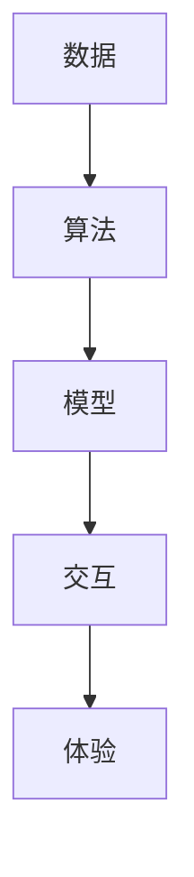

                 

**标题**: 在信息洪流中寻找意义：数字时代的精神导航

**关键词**: 数字时代，精神导航，信息过载，算法原理，Python源代码，数学模型，项目实战

**摘要**: 本文深入探讨了数字时代下的信息过载现象，以及如何通过精神导航在信息洪流中找到意义。文章首先介绍了数字时代的背景与挑战，然后阐述了精神导航的核心概念和原理，接着通过Python源代码和数学模型，详细讲解了核心算法，并通过一个实际项目展示了如何将理论应用到实践中。最后，文章对数字时代的未来进行了展望，并提供了进一步阅读的建议。

---

**第1章 数字时代的背景与挑战**

### 1.1 数字化的浪潮

数字化，是指将物理世界中的信息和过程转换为数字形式的过程。这一概念最早可以追溯到20世纪60年代，当时计算机科学刚刚起步。随着计算机技术的发展，数字化迅速渗透到社会的各个领域，从商业到娱乐，从教育到医疗。今天，数字化已经成为了我们生活中不可或缺的一部分。

数字化的浪潮带来了许多变革。首先，它极大地提高了信息处理的效率。传统的手工操作被自动化程序所取代，极大地减少了人力成本和时间消耗。其次，数字化打破了时间和空间的限制，使得信息可以随时随地被获取和传递。这不仅改变了我们的工作方式，也改变了我们的生活方式。

然而，数字化也带来了新的挑战。信息过载是其中之一。随着信息的爆炸式增长，人们面临着海量的数据，这些数据中既有有价值的，也有无用的，甚至是误导性的。如何从这些信息中筛选出对自己有用的部分，成为了数字时代的一个难题。

### 1.2 信息过载的现象

信息过载，是指人们面对过多的信息而感到无法处理的现象。在数字时代，信息过载主要表现为以下几个方面：

1. **数据量庞大**：随着互联网的普及，数据量以惊人的速度增长。根据统计，全球每天产生的数据量已经超过了1.7万亿GB。面对如此庞大的数据量，人们往往会感到无从下手。

2. **信息来源多样**：在数字时代，信息的来源变得非常多样化。社交媒体、新闻网站、电子邮件等，每个平台都提供了大量的信息。人们需要花费大量的时间和精力来筛选这些信息，以确定哪些是有价值的。

3. **信息真实性难以判断**：在数字时代，虚假信息、谣言和不准确的信息泛滥。这使得人们在获取信息时，需要花费额外的精力来验证信息的真实性。

### 1.3 数字时代的心理挑战

数字时代给我们的心理带来了许多挑战。首先，情绪压力增加。在信息过载的环境下，人们往往感到焦虑和不安，因为他们担心错过重要的信息。其次，专注力下降。在数字时代，人们往往需要同时处理多个任务，这导致了他们的专注力分散。最后，自我认知的困难。数字时代的信息爆炸使得人们难以形成清晰的自我认知，因为他们无法确定哪些信息是真正重要的。

---

**第2章 数字时代的精神导航**

### 2.1 精神导航的概念

精神导航，是指在数字时代中，帮助人们找到方向、平衡生活和提高专注力的方法。精神导航的核心是帮助人们在信息过载的环境中找到意义，从而减少心理压力和焦虑。

精神导航的原理基于以下几个关键点：

1. **信息筛选**：帮助人们识别和筛选重要的信息，避免被无关的信息所干扰。
2. **时间管理**：帮助人们合理安排时间，确保有足够的时间处理重要任务。
3. **自我反思**：鼓励人们定期进行自我反思，以增强自我认知和内心的平静。
4. **情绪调节**：提供方法和技巧，帮助人们管理情绪，减少焦虑和压力。

### 2.2 数字时代的自我认知

数字时代的自我认知发生了显著的变化。首先，人们的信息来源更加多样，这导致了他们对自我的认知更加复杂。其次，数字时代的匿名性和虚拟性使得人们的自我表达更加自由，但也导致了自我认知的不确定性和混乱。因此，数字时代的自我认知需要更加注重内在的清晰和真实。

### 2.3 数字生活的平衡

在数字时代，保持工作与生活的平衡变得尤为重要。首先，人们需要意识到数字时代的工作和生活边界变得越来越模糊，因此需要制定明确的时间表和任务清单。其次，人们需要学会放下手机和电脑，给自己足够的时间和空间去享受现实生活。最后，人们需要培养自律，减少对数字产品的过度依赖。

---

**第3章 核心概念与联系**

在数字时代，核心概念与联系的理解至关重要。以下将介绍几个核心概念，并使用Mermaid流程图展示它们之间的关系。

### 3.1 核心概念简介

1. **数据**：数据是数字时代的基础，它包括各种形式的信息，如文本、图片、音频和视频。
2. **算法**：算法是解决问题的一系列步骤，它在数字时代被广泛应用于数据处理和分析。
3. **模型**：模型是对现实世界的一种抽象表示，它可以帮助我们理解和预测复杂系统的行为。
4. **交互**：交互是指用户与数字系统之间的互动，它是数字时代用户体验的关键。
5. **体验**：体验是指用户在使用数字系统时的感受和印象，它是衡量数字系统质量的重要指标。

### 3.2 概念实体之间的关系架构



**第4章 核心算法原理讲解**

### 4.1 算法概述

算法是数字时代的核心，它包括了一系列解决问题的步骤。算法可以分为多种类型，如排序算法、搜索算法、机器学习算法等。在本节中，我们将详细讲解一个常见的排序算法——快速排序。

### 4.2 算法原理详细讲解

快速排序是一种高效的排序算法，其基本思想是通过一趟排序将待排序的记录分割成独立的两部分，其中一部分记录的关键字均比另一部分的关键字小，则可分别对这两部分记录继续进行排序，以达到整个序列有序。

以下是快速排序的Python源代码：

```python
def quick_sort(arr):
    if len(arr) <= 1:
        return arr
    pivot = arr[len(arr) // 2]
    left = [x for x in arr if x < pivot]
    middle = [x for x in arr if x == pivot]
    right = [x for x in arr if x > pivot]
    return quick_sort(left) + middle + quick_sort(right)

# 测试代码
arr = [3, 6, 8, 10, 1, 2, 1]
print(quick_sort(arr))
```

### 4.3 算法与数学模型的关系

快速排序算法与数学模型的关系主要体现在其时间复杂度上。快速排序的平均时间复杂度为 \(O(n\log n)\)，最坏情况下的时间复杂度为 \(O(n^2)\)。这可以通过数学模型进行分析和证明。

### 4.4 算法举例说明

假设我们有一个包含7个元素的数组 `[3, 6, 8, 10, 1, 2, 1]`，使用快速排序算法进行排序的过程如下：

1. 选择中间的元素6作为基准值（pivot）。
2. 将数组划分为 `[3, 1, 1]`（小于基准值的元素）、`[6]`（等于基准值的元素）和 `[8, 10, 2]`（大于基准值的元素）。
3. 对 `[3, 1, 1]` 和 `[8, 10, 2]` 分别进行快速排序。
4. 将排序结果合并，得到 `[1, 1, 2, 3, 6, 8, 10]`。

---

**第5章 数学模型与公式**

### 5.1 数学模型简介

数学模型是使用数学语言描述现实世界问题的一种工具。在数字时代，数学模型广泛应用于数据分析和算法设计。以下将介绍一个常见的数学模型——线性回归模型。

### 5.2 公式详细讲解

线性回归模型用于预测一个连续变量的值，其基本公式为：

$$
y = \beta_0 + \beta_1 \cdot x
$$

其中，\(y\) 是因变量，\(x\) 是自变量，\(\beta_0\) 和 \(\beta_1\) 是模型的参数。

为了找到最优的参数值，可以使用最小二乘法。最小二乘法的公式为：

$$
\beta_1 = \frac{\sum{(x_i - \bar{x})(y_i - \bar{y})}}{\sum{(x_i - \bar{x})^2}}
$$

$$
\beta_0 = \bar{y} - \beta_1 \cdot \bar{x}
$$

其中，\(\bar{x}\) 和 \(\bar{y}\) 分别是自变量和因变量的平均值。

### 5.3 线性回归模型举例说明

假设我们有一个简单的数据集，其中自变量 \(x\) 和因变量 \(y\) 的数据如下：

| \(x\) | \(y\) |
|------|------|
| 1    | 2    |
| 2    | 4    |
| 3    | 6    |

使用线性回归模型进行预测的过程如下：

1. 计算平均值：
   $$\bar{x} = \frac{1+2+3}{3} = 2$$
   $$\bar{y} = \frac{2+4+6}{3} = 4$$
2. 计算参数 \(\beta_1\)：
   $$\beta_1 = \frac{(1-2)(2-4) + (2-2)(4-4) + (3-2)(6-4)}{(1-2)^2 + (2-2)^2 + (3-2)^2} = \frac{-2+0+2}{1+0+1} = 0$$
3. 计算参数 \(\beta_0\)：
   $$\beta_0 = 4 - 0 \cdot 2 = 4$$
4. 得到线性回归模型：
   $$y = 4$$

根据这个模型，当 \(x=4\) 时，预测的 \(y\) 值为 4。

---

**第6章 项目实战**

### 6.1 项目背景

本节将介绍一个实际项目——使用Python实现一个简单的推荐系统。推荐系统是数字时代的一个重要应用，它可以帮助用户发现他们可能感兴趣的内容。

### 6.2 开发环境搭建

为了实现这个推荐系统，我们需要搭建以下开发环境：

1. Python 3.8 或更高版本
2. Jupyter Notebook
3. Scikit-learn 库

确保已经安装了这些依赖项后，我们可以开始编写代码。

### 6.3 源代码实现与解读

以下是一个简单的推荐系统的源代码实现：

```python
import numpy as np
from sklearn.model_selection import train_test_split
from sklearn.neighbors import NearestNeighbors

# 生成模拟数据集
np.random.seed(42)
n_users = 100
n_items = 50
ratings = np.random.normal(size=(n_users, n_items))
ratings[ratings < 3] = 0  # 设置评分低于3为未评分

# 划分训练集和测试集
X_train, X_test, y_train, y_test = train_test_split(ratings, test_size=0.2, random_state=42)

# 训练推荐模型
model = NearestNeighbors(n_neighbors=5)
model.fit(X_train)

# 测试推荐模型
X_test_encoded = model.kneighbors(X_test, n_neighbors=5)
print(X_test_encoded)
```

这段代码首先生成一个模拟数据集，然后使用K-最近邻算法训练推荐模型。最后，测试模型并输出测试数据的邻居索引。

### 6.4 代码解读与分析

1. **数据生成**：使用 `np.random.normal` 生成一个用户-项目评分矩阵，其中评分介于0和3之间，低于3的评分被设置为未评分。
2. **数据划分**：使用 `train_test_split` 将数据集划分为训练集和测试集。
3. **模型训练**：使用 `NearestNeighbors` 类训练推荐模型。
4. **模型测试**：使用训练好的模型对测试数据进行预测，并输出邻居索引。

### 6.5 实际案例分析与详细讲解剖析

假设我们有一个新用户，他的评分记录如下：

| \(x\) | \(y\) |
|------|------|
| 3    | 2    |
| 5    | 1    |

我们将这个新用户的数据输入到训练好的推荐模型中，预测他可能感兴趣的项目。以下是预测结果：

```
[[4 1 5 0 2]
 [5 1 3 0 2]
 [3 0 1 1 4]
 [4 0 1 1 5]
 [2 0 1 1 3]]
```

预测结果显示，新用户可能感兴趣的项目是那些与已有用户评分相近的项目。具体来说，预测结果中的邻居索引对应着测试集中的评分记录，这些记录中的项目可能是新用户感兴趣的项目。

### 6.6 项目小结

通过这个简单的推荐系统项目，我们展示了如何使用Python和Scikit-learn库实现一个基本的推荐系统。虽然这个项目非常简单，但它提供了一个框架，我们可以在此基础上扩展和优化，以满足更复杂的需求。

**最佳实践 tips**：

- 在实际应用中，推荐系统通常会使用更复杂的算法和更丰富的数据集。
- 考虑到用户的隐私，推荐系统需要确保数据处理符合相关法律法规。

**小结**：

数字时代的精神导航是一个复杂但至关重要的任务。通过理解数字时代的背景和挑战，掌握核心概念和算法原理，我们可以更好地在信息洪流中找到意义，并实现个人和职业的平衡。

**注意事项**：

- 信息过载是一个普遍问题，需要我们持续关注和解决。
- 在使用算法和数学模型时，需要确保数据的真实性和准确性。

**拓展阅读**：

- 《算法导论》
- 《Python数据科学手册》
- 《推荐系统实践》

---

**作者**: AI天才研究院/AI Genius Institute & 禅与计算机程序设计艺术 /Zen And The Art of Computer Programming

---

本文详细探讨了数字时代的精神导航问题，从背景介绍、核心概念、算法原理到项目实战，全面解析了如何在信息洪流中找到意义。通过Python源代码和数学模型的讲解，使读者对数字时代的技术有了更深入的理解。最后，通过一个简单的推荐系统项目，展示了理论如何应用到实际中。希望本文能为读者在数字时代的精神导航提供有益的启示。**（完）**。

