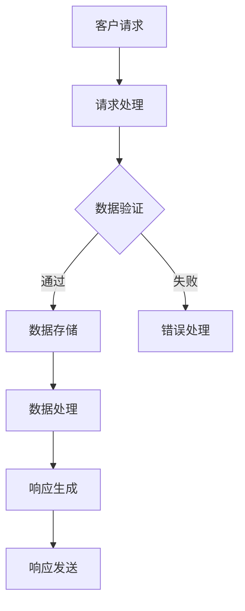

                 

### 摘要

本文旨在探讨在信息爆炸时代培养独立思考能力的重要性及具体方法。随着互联网和大数据技术的飞速发展，知识获取变得前所未有的便捷，但同时也带来了信息过载和选择困境。在这种情况下，独立思考能力显得尤为重要，它不仅能够帮助我们筛选有价值的信息，还能培养批判性思维、逻辑分析和创造性解决问题的能力。本文将从信息爆炸时代的影响、培养独立思考能力的原则、方法与实践、情感管理、个人成长、教育和社会环境等方面，详细分析独立思考能力的培养策略。通过成功案例的研究和对策的提出，文章将提供一套系统的行动指南，帮助读者在实际生活中提升独立思考能力，以应对未来社会的挑战。

## 第一部分：独立思考能力的重要性

### 第1章：信息爆炸时代的影响

#### 1.1 知识的泛滥与选择的困境

在信息爆炸的时代，知识的生产、传播和获取速度达到了前所未有的高度。互联网、社交媒体、在线教育平台等使得知识的获取变得极为便捷，几乎每个人都可以随时随地获取到海量信息。然而，这种便利性也带来了知识的泛滥和选择的困境。面对海量的信息，人们往往会感到不知所措，不知道哪些信息是有价值的，哪些信息是无效的。

首先，知识的泛滥导致了信息过载。每个人每天都会接收到大量的信息，而这些信息中只有一小部分是真正有价值的。过多的信息不仅会消耗我们的时间和精力，还会导致我们的注意力分散，无法集中精力进行深度思考。这种信息过载的现象在现代社会尤为明显，人们常常感到疲于应对。

其次，选择困境也是信息爆炸时代的一个显著问题。在如此多的信息面前，人们往往难以做出明智的选择。选择困难综合症（Choice Overload Syndrome）就是这种现象的一个典型例子。研究表明，当人们面临过多的选择时，不仅会感到压力和焦虑，还可能会做出较差的决策。这是因为过多的选择会让我们陷入决策疲劳，难以进行有效的判断和选择。

#### 1.2 思考能力的重要性

在面对信息泛滥和选择困境的情况下，独立思考能力显得尤为重要。独立思考能力不仅能够帮助我们筛选有价值的信息，还能培养我们的批判性思维、逻辑分析和创造性解决问题的能力。

首先，独立思考能力有助于筛选信息。在信息爆炸的时代，我们需要具备筛选信息的能力，能够区分哪些信息是有价值的，哪些信息是无效的。通过独立思考，我们可以对信息进行深入分析和判断，从而筛选出真正有价值的信息。

其次，独立思考能力有助于培养批判性思维。批判性思维是一种能够对信息进行深入分析和判断的能力。通过独立思考，我们可以对信息进行多角度、多层次的思考，从而培养出批判性思维能力。这种能力不仅有助于我们更好地理解世界，还能帮助我们在面对复杂问题时做出更明智的决策。

再次，独立思考能力有助于逻辑分析。逻辑分析是一种对信息进行系统分析和推理的能力。通过独立思考，我们可以对信息进行逻辑分析，从而揭示信息的本质和内在联系。这种能力不仅有助于我们更好地理解复杂问题，还能帮助我们在解决问题时找到更有效的解决方案。

最后，独立思考能力有助于创造性解决问题的能力。在面对问题时，独立思考能力可以帮助我们跳出传统思维模式，从不同角度和不同层次思考问题，从而找到更创新的解决方案。这种能力在现代社会尤为重要，因为创新是推动社会进步的重要动力。

总之，在信息爆炸的时代，独立思考能力的重要性不言而喻。它不仅能够帮助我们应对信息过载和选择困境，还能培养我们的批判性思维、逻辑分析和创造性解决问题的能力。因此，培养独立思考能力已经成为现代社会的一项重要任务。

### 第2章：培养独立思考能力的原则

#### 2.1 知识筛选与辨别

在信息爆炸的时代，知识的筛选与辨别显得尤为重要。随着互联网的普及，各种信息来源层出不穷，其中不乏虚假信息、误导性信息和低质量信息。因此，培养独立思考能力的第一步就是要学会筛选和辨别信息。

首先，我们需要培养对信息来源的敏感度。在获取信息时，要尽量选择权威和可靠的来源，如学术期刊、知名媒体和专业网站。同时，对于来自非权威渠道的信息，我们要保持怀疑的态度，进行进一步的核实和验证。

其次，我们需要掌握信息验证的方法。在判断信息真伪时，可以采用交叉验证的方法，即通过多个来源的信息进行比对，以确认信息的准确性。此外，我们还可以利用网络工具和技术，如搜索引擎、数据库和专业软件，对信息进行深入分析和验证。

最后，我们需要培养对信息内容的批判性思维。在获取信息后，要对信息的内容进行深入分析和思考，从中筛选出有价值的信息，并辨别出其中的误导性信息和虚假信息。通过批判性思维，我们可以更好地理解信息的本质，避免被误导和误解。

#### 2.2 逻辑思维与批判性思考

逻辑思维和批判性思考是独立思考能力的重要组成部分。逻辑思维是一种通过推理和分析，从已知事实得出合理结论的能力。批判性思考则是一种对信息、观点和结论进行深入分析和评价的能力。这两种思维能力相辅相成，共同构成了独立思考的核心。

首先，逻辑思维需要遵循一系列基本原则，如同一律、矛盾律和排中律。这些原则有助于我们进行理性思考和推理，避免逻辑错误和谬误。例如，同一律要求我们在推理过程中保持概念的一致性，避免混淆概念；矛盾律要求我们在推理过程中避免自相矛盾；排中律要求我们在推理过程中要么肯定，要么否定，避免模糊不清。

其次，批判性思考要求我们对信息、观点和结论进行多角度、多层次的分析和评价。在批判性思考中，我们要学会质疑和挑战现有的观点和结论，从中发现其中的问题和不足。例如，在阅读一篇文章时，我们要思考作者的论证过程是否合理，论据是否充分，结论是否可靠；在听取他人观点时，我们要思考这些观点是否有道理，是否有其他角度和观点可以补充或反驳。

最后，逻辑思维和批判性思考需要我们在实践中不断锻炼和应用。通过阅读、写作、讨论和解决问题等实践活动，我们可以不断提高自己的逻辑思维和批判性思考能力。例如，在阅读时，我们可以尝试从不同的角度解读文本，分析作者的论证过程和逻辑结构；在写作时，我们可以尝试用逻辑清晰、论据充分的方式表达自己的观点；在讨论时，我们可以积极倾听他人的观点，并提出合理的质疑和反驳。

#### 2.3 开放性与多元视角

在培养独立思考能力的过程中，开放性和多元视角也是至关重要的。开放性意味着我们要保持对未知和不同观点的接纳和包容，不固守一己之见，愿意接受新的思想和观点。多元视角则意味着我们要学会从多个角度和维度看待问题，不局限于单一视角和思维模式。

首先，开放性可以帮助我们拓宽视野，开阔思维。在面对新事物和新观点时，我们要学会保持开放的心态，不急于否定或接受，而是进行深入思考和探讨。通过开放性，我们可以更好地理解世界，发现新的知识和观点。

其次，多元视角有助于我们全面、客观地看待问题。在现实生活中，许多问题都是复杂和多面的，没有单一的解决方案。通过多元视角，我们可以从不同的角度和维度分析问题，找到更全面、更合理的解决方案。

最后，开放性和多元视角也是培养独立思考能力的重要保障。在独立思考的过程中，我们需要不断接受新的信息和观点，进行多角度、多层次的思考。通过开放性和多元视角，我们可以更好地培养自己的独立思考能力，不局限于单一思维模式，从而更好地应对复杂多变的社会环境。

总之，知识筛选与辨别、逻辑思维与批判性思考、开放性与多元视角是培养独立思考能力的重要原则。通过遵循这些原则，我们可以更好地应对信息爆炸时代的挑战，提升自己的独立思考能力，为个人成长和社会进步做出积极贡献。

### 第3章：独立思考的方法与实践

#### 3.1 系统性思考

独立性思考不仅仅是单一维度的思考，它更要求我们能够从系统性和全局性的角度进行思考。在信息爆炸的时代，系统性思考尤为重要。这种思维方式可以帮助我们更好地理解复杂问题的本质，找到更有效的解决方案。

首先，系统性思考要求我们具备整体观。在分析问题时，我们要从整体上把握问题的各个方面，理解它们之间的相互关系。例如，在处理一个企业项目时，我们需要考虑项目的技术、市场、资源、团队等多个方面，而不仅仅是技术层面的实现。

其次，系统性思考强调因果关系。在分析问题时，我们要深入挖掘问题的因果关系，了解问题的根本原因。这有助于我们找到解决问题的根本途径，而不仅仅是表面的应对措施。例如，在解决一个软件系统性能问题时，我们需要从代码、数据库、网络等多个层面查找原因，而不仅仅是调整代码。

最后，系统性思考需要我们具备模型构建能力。通过建立系统模型，我们可以更直观地理解问题的结构和关系，从而更好地进行决策和规划。例如，我们可以使用Mermaid等工具绘制系统架构图，帮助团队更好地理解项目的整体架构和运行机制。

以下是使用Mermaid绘制的系统架构图示例：

#### 3.2 创造性思维

在信息爆炸的时代，创造性思维是独立思考能力的另一个关键要素。创造性思维不仅能够帮助我们解决问题，还能激发我们的创新能力，推动科技进步和社会发展。

首先，创造性思维要求我们具备想象力。想象力是创造性思维的基础，它可以帮助我们突破传统的思维模式，提出新颖的想法和解决方案。例如，在开发新的软件系统时，我们可以通过想象力设计出独特的用户界面和交互体验。

其次，创造性思维需要我们具备联想能力。联想能力可以帮助我们将不同领域的知识进行交叉融合，从而产生新的创意。例如，在解决一个复杂问题时，我们可以尝试将生物学、物理学甚至艺术等领域的知识引入到问题解决过程中。

最后，创造性思维需要我们具备实践能力。只有将创造性思维转化为实际行动，才能真正实现创新。例如，我们可以通过原型设计和迭代测试，不断优化和完善我们的创新想法。

以下是一个创造性思维的例子：

假设我们想要开发一个智能助手，我们可以从以下几个方面进行思考：

1. **用户需求**：分析用户需求，了解他们希望智能助手能做什么。
2. **技术实现**：思考现有的技术如何应用到智能助手的开发中。
3. **用户体验**：设计一个直观易用的用户界面，提高用户体验。
4. **业务模式**：探讨智能助手的商业模式，确保项目的可持续发展。

通过以上几个方面的创造性思考，我们可以设计出一个具有竞争力的智能助手。

#### 3.3 阅读与写作

阅读和写作是培养独立思考能力的重要手段。通过阅读，我们可以获取大量的知识和信息，通过写作，我们可以整理和表达自己的思考和观点。

首先，阅读可以帮助我们扩展知识面。在信息爆炸的时代，阅读是获取知识的重要途径。通过阅读各种书籍、文章和报告，我们可以了解不同领域的知识，从而拓宽我们的视野。

其次，阅读可以培养我们的批判性思维。在阅读过程中，我们要对信息进行筛选和判断，理解作者的论点和论证过程，从而培养出批判性思维能力。

再次，写作可以帮助我们整理和表达自己的思考。通过写作，我们可以将零散的思考整理成系统化的内容，从而更好地理解和掌握所学知识。同时，写作也可以提高我们的逻辑表达和沟通能力。

最后，阅读和写作需要持续和深入的实践。通过定期阅读和写作，我们可以不断提高自己的思考能力和知识水平，从而更好地应对信息爆炸时代的挑战。

以下是一个阅读和写作的例子：

假设我们阅读了一篇关于人工智能技术发展的文章，我们可以从以下几个方面进行思考：

1. **文章主旨**：总结文章的主要观点和结论。
2. **论证分析**：分析作者使用的论据和论证过程，评估其合理性。
3. **观点评价**：评价文章的观点和结论，提出自己的看法。
4. **知识应用**：思考如何将文章中的观点应用到实际工作中。

通过以上几个方面的思考和写作，我们可以更深入地理解和应用所学知识。

### 第4章：独立思考与情感管理

#### 4.1 情感与思维的关系

在信息爆炸的时代，独立思考能力的培养不仅仅依赖于逻辑思维和知识积累，还与情感管理密切相关。情感和思维之间的关系是复杂而微妙的，它们相互影响，共同塑造我们的认知和行为。

首先，情感可以影响我们的思维方式和判断力。积极的情感，如乐观、自信和兴奋，可以激发我们的创造力和解决问题的能力。相反，消极的情感，如焦虑、沮丧和恐惧，可能会阻碍我们的思维过程，导致判断失误。

其次，思维过程也会影响我们的情感状态。当我们进行深度思考和逻辑分析时，大脑会释放多巴胺等神经递质，产生积极的情感体验。而当我们面对复杂或不确定的问题时，思维活动可能会引发焦虑和压力。

最后，情感管理和思维能力的培养是相辅相成的。通过有效的情感管理，我们可以更好地控制情绪，从而保持清晰的思维，提高独立思考的能力。同时，通过培养独立思考能力，我们可以更好地应对情绪波动，提高情感调节能力。

#### 4.2 情绪调节与自我反思

情绪调节是培养独立思考能力的重要组成部分。在信息爆炸的时代，情绪波动更加频繁和复杂，因此，学会调节情绪尤为重要。

首先，情绪调节可以通过多种方法进行。认知行为疗法（CBT）是一种常用的情绪调节方法，它通过改变消极思维模式来调节情绪。例如，当面对工作压力时，我们可以通过认知重构技术，将“我无法完成任务”的消极思维转变为“这是一个挑战，我可以寻求帮助并找到解决方案”的积极思维。

其次，自我反思是情绪调节的重要工具。通过自我反思，我们可以深入了解自己的情绪状态和思维模式，找到情绪波动的根源。例如，每天花时间进行自我反思，记录下自己的情绪变化和触发因素，有助于我们更好地理解自己的情绪，并找到有效的调节方法。

此外，身体锻炼和冥想也是有效的情绪调节方法。身体锻炼可以释放身体中的紧张和压力，提高情绪稳定性。冥想则可以帮助我们集中注意力，减少杂念，提高自我觉察和情绪调节能力。

以下是一个情绪调节的实例：

假设我们面对一项紧急任务，感到非常焦虑。在这种情况下，我们可以采取以下步骤进行情绪调节：

1. **深呼吸**：通过深呼吸来放松身体，减轻紧张感。
2. **认知重构**：将“我必须立刻完成任务”转变为“这是一个机会，我可以一步一步地解决问题”。
3. **自我反思**：花几分钟时间反思自己的情绪状态，找到焦虑的根源。
4. **身体锻炼**：进行短暂的跑步或瑜伽，释放身体中的紧张和压力。
5. **制定计划**：制定一个实际的行动计划，逐步完成任务。

通过这些步骤，我们可以有效地调节情绪，提高独立思考的能力，从而更好地应对紧急任务。

#### 4.3 自信心与自我激励

自信心和自我激励是培养独立思考能力的动力源泉。在信息爆炸的时代，自信心可以帮助我们克服困难和挑战，自我激励则可以持续推动我们不断进步。

首先，自信心是独立思考的基础。只有相信自己能够解决问题，我们才会勇于面对复杂和不确定的情况。例如，在处理一个技术难题时，如果我们缺乏自信，可能会过早放弃，而有了自信，我们会坚持不懈，找到解决方案。

其次，自我激励可以帮助我们克服倦怠和拖延。在追求独立思考的过程中，难免会遇到困难和挫折。这时，自我激励可以帮助我们保持积极的态度，继续努力。例如，通过设定短期和长期目标，我们可以为自己设定明确的努力方向，并通过奖励机制来激励自己。

此外，自我激励还可以通过自我肯定和自我表扬来增强自信心。当我们取得进步或成功时，要给自己充分的肯定和奖励。这不仅能增强自信心，还能激励我们继续努力。

以下是一个自我激励的实例：

假设我们在学习一项新技能时，遇到了困难。在这种情况下，我们可以采取以下步骤进行自我激励：

1. **设定目标**：明确我们想要达到的目标，并将其分解为可行的步骤。
2. **自我肯定**：每当完成一个步骤时，给自己积极的反馈，肯定自己的努力和进步。
3. **奖励机制**：为完成每个步骤设定奖励，如休息一会儿、享受美食或进行一次短途旅行。
4. **持续学习**：通过学习新的知识和技能，不断提升自己，保持自我激励的动力。

通过这些步骤，我们可以有效地增强自信心和自我激励，从而更好地培养独立思考能力。

### 第5章：独立思考与个人成长

#### 5.1 独立思考与职业发展

在职业生涯中，独立思考能力是职业发展的关键因素。它不仅能够帮助我们更好地理解行业趋势和技术发展方向，还能提高我们的创新能力，推动职业成长。

首先，独立思考能力可以帮助我们把握职业发展的方向。在快速变化的市场环境中，只有具备独立思考能力，我们才能准确判断行业趋势，找到适合自己的职业路径。例如，在技术行业，新兴技术的出现和发展速度非常快，只有具备独立思考能力，我们才能及时了解并掌握这些新技术，从而抓住职业发展的机遇。

其次，独立思考能力可以提升我们的创新能力。在职业发展中，创新能力是至关重要的。通过独立思考，我们可以跳出传统的思维框架，提出新颖的解决方案和产品构想。例如，在开发新产品时，独立思考能力可以帮助我们找到独特的市场定位，从而在竞争激烈的市场中脱颖而出。

此外，独立思考能力还可以增强我们的问题解决能力。在职业生涯中，难免会遇到各种问题和挑战。通过独立思考，我们可以深入分析问题，找到根本原因，并设计出有效的解决方案。例如，在项目开发中，独立思考能力可以帮助我们识别潜在的风险和问题，提前进行预防和管理。

以下是一个独立思考在职业发展中的应用实例：

假设我们在一家科技公司工作，负责开发一款新软件。在这种情况下，我们可以采取以下步骤进行独立思考：

1. **市场调研**：了解市场需求和竞争态势，找到产品的市场定位。
2. **用户研究**：通过用户访谈和调研，了解用户的需求和使用习惯。
3. **技术评估**：评估现有技术方案，选择最适合的技术栈和开发工具。
4. **问题分析**：识别项目中的潜在风险和问题，设计解决方案。
5. **持续迭代**：在开发过程中，不断收集用户反馈，进行迭代优化。

通过这些步骤，我们可以充分利用独立思考能力，推动职业发展。

#### 5.2 独立思考与生活规划

独立思考能力不仅在职业生涯中具有重要意义，也在我们的生活规划中发挥着关键作用。通过独立思考，我们可以更清晰地规划自己的未来，提高生活质量。

首先，独立思考能力可以帮助我们制定明确的生活目标。在规划生活时，我们需要明确自己的价值观和人生目标，通过独立思考，我们可以更清楚地了解自己的需求和期望，从而制定出切实可行的生活目标。

其次，独立思考能力可以增强我们的决策能力。在生活中，我们常常需要做出各种决策，独立思考能力可以帮助我们理性分析各种选择，做出最优决策。例如，在购买房屋或汽车时，独立思考能力可以帮助我们权衡各种因素，选择最适合自己的产品。

此外，独立思考能力还可以帮助我们应对生活中的挑战和变化。在生活中，难免会遇到各种突发状况和不确定性，通过独立思考，我们可以更好地应对这些情况，找到解决问题的方法。

以下是一个独立思考在生活规划中的应用实例：

假设我们计划在未来五年内买房，我们可以采取以下步骤进行独立思考：

1. **需求分析**：明确自己的购房需求和预算。
2. **市场调研**：了解不同地区的房价、交通和生活配套设施。
3. **风险评估**：评估购房过程中可能遇到的风险，如贷款利率变动、房价波动等。
4. **决策分析**：权衡各种购房选择，选择最合适的购房方案。
5. **持续跟踪**：在购房过程中，不断收集市场信息和数据，调整购房计划。

通过这些步骤，我们可以充分利用独立思考能力，做出明智的生活规划。

#### 5.3 独立思考与人际关系

独立思考能力不仅对个人成长和职业发展至关重要，也在人际关系中发挥着重要作用。通过独立思考，我们可以更有效地沟通、理解和协调与他人的关系。

首先，独立思考能力有助于提高沟通效果。在沟通中，独立思考能力可以帮助我们更清晰地表达自己的观点和需求，同时也能够更好地理解他人的观点和需求。例如，在团队项目中，独立思考能力可以帮助我们提出有建设性的意见和建议，促进项目的顺利进行。

其次，独立思考能力可以增强我们的同理心。通过独立思考，我们可以更深入地理解他人的情感和需求，从而更好地关心和支持他人。例如，在家庭生活中，独立思考能力可以帮助我们更好地理解孩子的需求和情绪，从而更好地照顾和引导孩子。

此外，独立思考能力还可以帮助我们处理冲突和解决问题。在人际关系中，难免会遇到冲突和矛盾，通过独立思考，我们可以理性分析问题的根本原因，找到解决问题的方法。例如，在职场中，独立思考能力可以帮助我们有效地处理同事之间的矛盾，维护良好的工作关系。

以下是一个独立思考在人际关系中的应用实例：

假设我们与同事之间出现了意见分歧，我们可以采取以下步骤进行独立思考：

1. **理性分析**：了解双方的观点和立场，分析问题的根本原因。
2. **沟通表达**：通过有效的沟通表达自己的观点，同时尊重对方的意见。
3. **寻求共识**：寻找双方都可以接受的解决方案，达成共识。
4. **持续改进**：在执行解决方案的过程中，不断收集反馈，进行改进和优化。

通过这些步骤，我们可以充分利用独立思考能力，改善人际关系，提高沟通和协作效率。

### 第6章：教育中的独立思考培养

#### 6.1 教育体系的变革

在信息爆炸的时代，传统教育体系面临着巨大的挑战。为了培养具备独立思考能力的下一代，教育体系需要进行深刻的变革。

首先，教育目标需要从知识传授转向能力培养。在传统教育中，知识传授是核心目标，而忽视了学生能力的培养。在信息爆炸的时代，知识的获取变得极为便捷，因此，教育目标需要转向培养学生的独立思考能力、批判性思维和创新能力。

其次，教育内容需要与时俱进，注重实践和应用的结合。传统教育内容往往偏重理论知识的传授，而忽视了实践能力的培养。在信息爆炸的时代，我们需要将教育内容与实际应用相结合，通过实践项目和案例分析，培养学生的实际操作能力和问题解决能力。

此外，教育方式也需要创新，注重个体差异和个性化教育。传统教育方式往往采用统一的授课模式，而忽视了学生的个体差异。在信息爆炸的时代，我们需要采用多元化的教育方式，如在线教育、翻转课堂和项目式学习等，以满足不同学生的需求，激发他们的独立思考能力。

以下是一个教育体系变革的实例：

假设我们正在改革一所高中教育，我们可以采取以下步骤：

1. **课程设计**：设计涵盖多领域的课程，注重知识与实践的结合。
2. **教学方式**：采用项目式学习，鼓励学生自主探究和合作学习。
3. **评估机制**：采用多元化的评估方式，如项目报告、课堂表现和考试等。
4. **资源支持**：提供丰富的在线资源和实践平台，支持学生的自主学习和项目实践。

通过这些步骤，我们可以推动教育体系的变革，培养学生的独立思考能力。

#### 6.2 教师的角色与责任

在培养独立思考能力的过程中，教师扮演着至关重要的角色。他们不仅是知识的传递者，更是学生思维能力和创新能力的培养者。

首先，教师需要具备独立思考能力。作为教育者，教师需要具备批判性思维和创新能力，能够引导学生进行深度思考和问题解决。例如，在课堂上，教师可以通过设计开放性问题，引导学生从不同角度思考问题，培养他们的独立思考能力。

其次，教师需要关注学生的个体差异。每个学生都有自己独特的学习风格和思维方式，教师需要因材施教，关注每个学生的需求，提供个性化的指导和帮助。例如，对于思维活跃的学生，教师可以提供更多的挑战性问题和项目，激发他们的创新能力。

此外，教师还需要具备良好的沟通能力和团队合作能力。在教育改革中，教师需要与学生、家长和同事进行有效沟通，共同推动教育创新。例如，在项目式学习中，教师需要与学生合作，共同制定项目目标和评估标准。

以下是一个教师角色的实例：

假设一位数学教师正在教授“函数与图像”这一章节，她可以采取以下步骤：

1. **引入问题**：通过实际案例引入函数的概念，激发学生的兴趣。
2. **教学演示**：使用图形计算器或软件演示函数的图像，帮助学生理解函数的性质。
3. **互动讨论**：组织学生进行小组讨论，让他们探索不同函数的图像特点。
4. **实践项目**：布置一个项目，让学生设计并绘制一个自定义函数的图像，并解释其特征。

通过这些步骤，教师可以有效地培养学生的独立思考能力。

#### 6.3 学生的自我驱动

在培养独立思考能力的过程中，学生的自我驱动是关键因素。自我驱动不仅能够激发学生的学习兴趣和动力，还能培养他们的自主学习和创新能力。

首先，学生需要明确自己的学习目标。通过设定明确的学习目标，学生可以更有方向性地进行学习，提高学习效率。例如，学生可以设定短期和长期的学习目标，如掌握某项技能或通过某个考试。

其次，学生需要培养自主学习的习惯。在信息爆炸的时代，自主学习能力尤为重要。学生可以通过阅读书籍、参加在线课程、参与学术讨论等方式，主动获取知识和信息。例如，学生可以定期阅读学术期刊或技术博客，了解最新的学术动态和技术进展。

此外，学生还需要积极参与实践活动。通过实践项目或实验，学生可以将所学知识应用到实际情境中，提高解决问题的能力。例如，学生可以参加科学竞赛或技术竞赛，锻炼自己的创新能力和团队协作能力。

以下是一个学生自我驱动的实例：

假设一名高中生正在学习“机器学习”这一课程，他可以采取以下步骤：

1. **设定目标**：明确学习机器学习的目的，如掌握基本的机器学习算法和应用。
2. **自主学习**：通过在线课程和教材，自主学习和理解机器学习的基本概念和算法。
3. **实践应用**：通过编程实现简单的机器学习项目，如手写数字识别或垃圾邮件分类。
4. **学术讨论**：参加机器学习研讨会或小组讨论，与同学和老师交流学习心得和问题。

通过这些步骤，学生可以有效地培养自我驱动能力，提高独立思考能力。

### 第7章：社会环境与独立思考

#### 7.1 社会文化对思考能力的影响

社会文化在培养独立思考能力方面起着至关重要的作用。一个开放、包容和多元化的社会文化可以为独立思考提供良好的环境和土壤。相反，保守、封闭和单一的社会文化可能会限制独立思考的发展。

首先，社会文化对思考能力的培养有深远的影响。在一个鼓励创新和探索的社会文化中，人们更愿意尝试新事物，接受不同的观点和理念，从而培养出批判性思维和创新能力。例如，在西方社会，自由思想传统深厚，人们普遍尊重个体的观点和表达，这种社会文化环境有助于培养独立思考能力。

其次，社会文化对教育体系有重要影响。一个重视教育和知识传播的社会文化会推动教育体系的改革和创新，从而更好地培养独立思考能力。例如，在东亚一些国家，虽然重视教育，但传统的教育模式往往偏重知识传授，忽视了学生的思考和创新能力培养。这种社会文化背景下，教育体系需要进行深刻的变革，以更好地适应信息爆炸时代的挑战。

此外，社会文化还会影响人们的价值观和行为方式。在一个注重合作和团队精神的社会文化中，人们更愿意倾听他人的意见，进行集体讨论和协作，从而促进独立思考能力的发展。例如，在一些企业文化和团队文化中，鼓励员工提出不同的意见和观点，通过集体讨论和协商找到最佳解决方案，这种文化氛围有助于培养独立思考能力。

#### 7.2 社交媒体与独立思考

随着社交媒体的普及，它对独立思考能力的影响也日益显著。社交媒体为人们提供了丰富的信息来源和互动平台，但同时也带来了信息过载、误导性信息和群体思维等挑战。

首先，社交媒体的信息过载问题对独立思考能力产生了负面影响。社交媒体上的信息量庞大，人们往往难以筛选出有价值的信息。这种信息过载可能导致我们的注意力分散，难以进行深度思考和批判性分析。例如，在社交媒体上，用户可能会频繁切换不同的话题和信息，导致思维无法集中，难以形成深入的观点和思考。

其次，社交媒体上的误导性信息也威胁着独立思考能力。社交媒体上的信息来源多样，其中不乏虚假信息和误导性信息。这些信息可能会误导用户的判断和决策，影响独立思考的准确性。例如，社交媒体上流传的一些不实消息和谣言，可能会误导用户，影响他们对某一事件或问题的看法。

此外，社交媒体上的群体思维现象也可能削弱独立思考能力。在社交媒体上，用户往往受到群体观点和行为的影响，容易形成群体思维。这种情况下，个人独立思考的能力可能会受到压制，导致盲目跟从群体观点。例如，在一些社交媒体平台上，用户可能会受到热门话题或流行观点的影响，放弃自己的独立思考，而是选择跟随大多数人的看法。

为了应对社交媒体对独立思考能力的负面影响，我们可以采取以下策略：

1. **信息筛选与辨别**：在社交媒体上获取信息时，要具备筛选和辨别信息的能力，尽量选择权威和可靠的来源，避免被误导性信息所影响。

2. **保持独立思考**：在社交媒体上，要勇于表达自己的观点和想法，不盲目跟从群体思维，坚持独立思考。

3. **多元化信息获取**：通过多种渠道获取信息，包括书籍、专业网站和学术期刊等，以获得更全面和客观的信息。

4. **批判性思维训练**：通过批判性思维的训练，提高对信息的分析和判断能力，避免被误导性信息所影响。

#### 7.3 民主与独立思考的关系

民主制度在培养独立思考能力方面具有重要作用。民主制度鼓励公民参与决策，尊重个体观点和自由表达，这有助于培养独立思考能力。

首先，民主制度为公民提供了表达和讨论观点的平台。在民主社会中，公民可以通过选举、请愿、公众讨论等方式参与政治和社会事务的决策。这种参与过程不仅有助于公民理解社会问题，还能培养他们的批判性思维和独立思考能力。例如，在选举过程中，公民需要了解候选人的政策立场和行动方案，从而进行理性选择，这要求他们具备独立思考能力。

其次，民主制度鼓励多元化观点的交流。在民主社会中，不同群体和个人可以自由表达自己的观点，这种多元化观点的交流有助于拓宽视野，激发创新思维。例如，在学术讨论和公共辩论中，不同观点的碰撞和交流可以激发新的思考方式和解决方案。

此外，民主制度还强调法律和制度的约束。在民主社会中，法律和制度对公民行为进行规范，保障公民的权利和自由。这种制度约束有助于公民在思考和表达观点时遵守法律和道德规范，培养理性思考和独立判断的能力。

然而，民主制度本身也存在一些挑战，可能对独立思考能力产生负面影响。例如，民主制度可能导致群体思维和舆论导向，影响独立思考的独立性。此外，民主制度中存在的信息过载和误导性信息问题，也可能削弱独立思考的能力。

为了充分发挥民主制度对独立思考能力的积极作用，我们可以采取以下措施：

1. **提高信息素养**：培养公民的信息筛选和辨别能力，提高他们对信息真实性和可靠性的判断力。

2. **促进公众讨论**：鼓励公民参与公共讨论，提高他们的批判性思维和独立思考能力。

3. **加强法治教育**：通过法治教育，培养公民遵守法律和制度的意识，增强他们的理性思考和独立判断能力。

4. **多元化信息来源**：鼓励公民通过多种渠道获取信息，拓宽视野，提高独立思考的全面性。

### 第二部分：案例分析

#### 第8章：成功案例研究

在信息爆炸的时代，独立思考能力的重要性日益凸显。以下我们将通过几个成功案例，探讨独立思考在不同领域的应用和成效。

#### 8.1 案例一：企业领导者的独立思考

在现代企业中，领导者独立思考的能力直接影响到企业的创新和竞争力。以苹果公司（Apple Inc.）的创始人史蒂夫·乔布斯（Steve Jobs）为例，他的独立思考能力为公司的发展带来了巨大的成功。

首先，乔布斯以其独特的设计哲学和对产品的严格要求，推动了苹果公司的创新。他坚信产品的美学和用户体验应该放在首位，这促使苹果推出了一系列革命性的产品，如iPod、iPhone和iPad。通过独立思考，乔布斯能够从用户的需求和市场趋势中找到新的机会，从而引领苹果不断突破自我，保持市场领先地位。

其次，乔布斯的独立思考还体现在他对技术和商业的深刻理解上。他不仅关注产品的技术实现，还考虑产品的商业可行性和市场前景。例如，他坚持使用自主开发的操作系统，从而确保苹果产品的统一性和用户体验的完整性。这种跨领域的独立思考，帮助苹果建立了一套独特的竞争优势。

具体来说，乔布斯在推出iPhone时，不仅考虑了智能手机的功能和性能，还关注了用户界面和用户体验。他亲自设计了iPhone的用户界面，确保其简洁、直观和易用。这种对细节的极致追求，使得iPhone一经推出便受到市场的热烈欢迎，彻底改变了智能手机市场格局。

总之，乔布斯的独立思考能力不仅推动了苹果公司的创新和成长，也为企业领导者树立了榜样。通过独立思考，乔布斯不仅找到了产品的新机会，还建立了独特的竞争优势，从而在激烈的市场竞争中脱颖而出。

#### 8.2 案例二：教育改革中的独立思考

在教育领域，独立思考能力的培养一直是教育改革的重要目标。以芬兰为例，该国在教育改革中取得了显著成效，其教育体系被誉为全球最成功的案例之一。

首先，芬兰的教育改革强调学生的自主学习能力。芬兰的学校鼓励学生通过自主探究和合作学习来获取知识，而不是简单地灌输知识。例如，在课堂上，教师通常会提供一些问题或主题，让学生自主查找资料、讨论和解决问题。这种学习方式不仅培养了学生的独立思考能力，还提高了他们的批判性思维和创新能力。

其次，芬兰的教育改革注重个性化教育。每个学生都有自己的学习计划和目标，教师会根据学生的兴趣和需求进行个性化指导。例如，有些学生可能在数学方面有天赋，教师会为他们提供更多的挑战性问题和项目，以促进他们的深入学习和创新。这种个性化教育有助于培养学生的独立思考能力，使他们能够根据自己的兴趣和优势进行自我发展。

此外，芬兰的教育改革还强调教师的专业发展。教师需要不断学习和更新知识，以提高教学水平和培养学生的独立思考能力。例如，芬兰政府提供了一系列教师培训项目，包括专业发展课程和海外交流项目，帮助教师提升教学技能和拓展教育视野。

具体来说，芬兰的一所小学采用了项目式学习的方法，学生通过自主探究和合作完成各种项目。例如，学生可以自发组成一个小组，选择一个感兴趣的主题进行深入研究，如环境保护、历史文化等。在项目过程中，学生不仅需要查找资料、分析数据，还需要进行实际操作和实验，从而培养他们的独立思考能力和实践能力。

总之，芬兰的教育改革通过强调自主学习、个性化教育和教师专业发展，有效地培养了学生的独立思考能力。这种教育模式不仅提高了学生的学术成绩，还培养了他们的创新能力和批判性思维，为他们的未来发展奠定了坚实的基础。

#### 8.3 案例三：科技创新中的独立思考

在科技创新领域，独立思考能力是推动技术进步和产业变革的关键因素。以特斯拉（Tesla, Inc.）的创始人埃隆·马斯克（Elon Musk）为例，他的独立思考能力不仅改变了汽车产业，还推动了能源和航天领域的创新。

首先，马斯克以其对电动汽车的坚持和创新的思维方式，引领了汽车产业的变革。他相信电动汽车是未来交通的发展方向，并通过独立思考找到了实现这一目标的最佳路径。例如，特斯拉的车型不仅在性能和续航方面领先于传统汽车，还在智能化和自动驾驶技术上取得了突破。通过独立思考，马斯克不仅为电动汽车技术的发展提供了新的思路，还推动了整个汽车产业的转型。

其次，马斯克在能源领域的独立思考也取得了显著成果。他创办了SolarCity，致力于太阳能技术的研发和应用，推动了可再生能源的发展。通过独立思考，马斯克看到了太阳能技术与电动汽车技术的结合点，从而提出了一系列创新的解决方案，如太阳能屋顶和太阳能电池储能系统。这些创新不仅提高了能源利用效率，还降低了能源成本，为可持续发展提供了新的路径。

此外，马斯克在航天领域的独立思考同样令人瞩目。他创办了SpaceX，旨在降低太空探索的成本，推动人类实现多星球居住。通过独立思考，马斯克设计出了一系列创新的航天技术，如可重复使用的火箭和龙飞船。这些技术不仅提高了航天器的效率，还降低了太空探索的成本，为人类探索宇宙提供了新的可能性。

具体来说，马斯克在研发SpaceX火箭时，采用了独特的回收技术，使得火箭可以重复使用，从而大大降低了航天成本。这一创新不仅引起了业界的关注，还为整个航天产业带来了新的变革。通过独立思考，马斯克不仅找到了航天技术的突破点，还为整个行业树立了创新的标杆。

总之，马斯克的独立思考能力在科技创新领域发挥了重要作用。通过独立思考，他不仅推动了技术进步和产业变革，还为人类的可持续发展提供了新的思路和解决方案。这些成功案例证明了独立思考能力在科技创新中的关键作用，也为其他科技创业者提供了借鉴和启示。

### 第9章：挑战与对策

在信息爆炸的时代，独立思考能力的培养面临着诸多挑战。这些挑战不仅源于信息过载和误导性信息的泛滥，还涉及个体心理和行为层面。为了有效应对这些挑战，我们需要采取一系列对策，包括培养批判性思维、建立多元化知识体系等。

#### 9.1 挑战一：信息的过度依赖

在信息爆炸的时代，人们容易对信息产生过度依赖。这种依赖不仅影响独立思考能力，还可能导致思维惰化和判断力下降。为了应对这一挑战，我们可以采取以下对策：

1. **减少信息过载**：通过设定固定的信息消费时间，限制每天接收的信息量，从而减少信息过载的影响。例如，可以设定每天阅读新闻和社交媒体的时间不超过1小时。

2. **培养信息筛选能力**：通过学习和实践，提高对信息的筛选和辨别能力，选择权威和可靠的信息来源。例如，可以定期阅读学术期刊和知名媒体的报道，避免被虚假信息和误导性信息所误导。

3. **实践思维训练**：通过逻辑思维和批判性思维的训练，提高独立思考和判断能力。例如，可以参加思维训练课程或阅读相关书籍，学习如何从不同角度分析问题和提出解决方案。

#### 9.2 挑战二：思维的局限

在信息爆炸的时代，个体思维容易受到各种局限，如传统观念、社会习俗和文化背景等。这些局限可能阻碍独立思考的发展。为了克服这一挑战，我们可以采取以下对策：

1. **拓宽知识视野**：通过学习不同领域的知识和文化，拓宽思维视野。例如，可以阅读不同学科的书籍，了解不同文化背景下的思维方式和价值观。

2. **培养多元化思维**：通过实践多元视角和多角度思考，培养多元化思维。例如，可以参与跨学科的项目合作，与不同背景的人交流，从而开阔思维。

3. **批判性思维训练**：通过批判性思维的训练，学会质疑和反思现有的观点和假设，从而打破思维局限。例如，可以定期进行自我反思和批判性思考练习，提高思维的灵活性和深度。

#### 9.3 对策一：培养批判性思考能力

批判性思考能力是独立思考的核心要素，能够帮助我们更好地应对信息爆炸时代的挑战。为了培养批判性思考能力，我们可以采取以下措施：

1. **提出质疑**：在学习新知识时，不仅要接受，还要质疑和反思。例如，可以问自己：“这个观点是否有逻辑错误？”“是否有其他解释方式？”等。

2. **分析论据和论证**：在阅读和分析文章时，要关注作者的论据和论证过程，评估其合理性和有效性。例如，可以分析作者使用了哪些论据，这些论据是否充分，论证过程是否严谨。

3. **跨领域比较**：通过跨领域比较，发现不同领域之间的共通性和差异性，从而提高批判性思维能力。例如，可以将经济学原理应用于社会学问题，探讨不同领域的思维方式和解决策略。

#### 9.4 对策二：建立多元化知识体系

多元化知识体系是独立思考的基础，能够帮助我们更好地理解和应对复杂问题。为了建立多元化知识体系，我们可以采取以下措施：

1. **多学科学习**：通过学习不同学科的知识，建立跨学科的知识结构。例如，可以学习计算机科学、心理学、经济学等领域的知识，提高跨学科思维和解决问题的能力。

2. **实践应用**：通过实践应用所学知识，加深对知识的理解和掌握。例如，可以将理论知识应用于实际项目或生活中，通过实践检验和巩固知识。

3. **持续学习**：在信息爆炸的时代，知识更新速度极快。为了保持知识的更新和多元化，我们需要持续学习。例如，可以定期参加培训课程、阅读最新学术期刊和参加专业会议，保持知识的活力。

通过以上对策，我们可以有效地应对信息爆炸时代对独立思考能力的挑战，培养批判性思考能力，建立多元化知识体系，从而更好地应对复杂多变的社会环境。

### 第10章：如何开始培养独立思考能力

#### 10.1 设定目标和计划

培养独立思考能力是一个长期的过程，需要明确的目标和详细的计划。首先，我们需要设定一个具体的、可实现的目标。这个目标可以是短期的，如每周阅读一本书或参加一个思维训练课程，也可以是长期的，如掌握一项新技能或完成一个复杂项目。例如，设定一个目标：在接下来的三个月内，通过每天阅读30分钟的技术博客，提高编程技能。

其次，我们需要制定一个详细的计划，包括具体的时间表和行动步骤。例如，我们可以将三个月分为三个阶段，每个阶段设定一个具体的任务，如第一个月专注于学习Python基础，第二个月学习数据结构与算法，第三个月进行实战项目。通过这样的计划，我们可以确保每个阶段都有明确的任务和目标，从而稳步提升独立思考能力。

#### 10.2 持续学习与思考

持续学习与思考是培养独立思考能力的关键。首先，我们需要选择合适的学习资源。这包括专业书籍、学术论文、在线课程和技术博客等。例如，我们可以选择《深度学习》作为学习资源，通过系统学习深度学习的基础理论和应用，提高技术能力。

其次，我们需要将学习与思考相结合。在学习过程中，不仅要理解和记忆知识点，还要思考其背后的原理和应用。例如，在学习神经网络时，我们可以思考神经网络如何通过多层结构实现特征提取和分类，从而更好地理解深度学习的本质。

此外，定期进行总结和反思也是非常重要的。我们可以定期（例如每周或每月）对自己的学习过程和成果进行总结，反思哪些方法有效，哪些需要改进。例如，在每周结束时，我们可以回顾本周的学习内容，总结学习心得，并制定下周的学习计划。

#### 10.3 实践与应用

独立思考能力不仅体现在理论知识的掌握上，更需要通过实践来检验和提升。首先，我们需要选择合适的实践项目。这可以是技术项目、社会项目或个人兴趣项目等。例如，我们可以选择开发一个简单的社交应用，通过实际编程和调试过程，提高编程技能和问题解决能力。

其次，在实践过程中，我们需要积极思考和解决问题。遇到问题时，不要急于求成或依赖他人，而是通过独立思考和分析，找到解决方案。例如，在开发社交应用时，如果遇到用户数据存储问题，我们可以通过分析不同数据库的特点，选择最适合的数据库解决方案。

此外，实践中的应用能力也非常重要。我们需要将所学知识应用到实际问题中，通过实践来加深理解和掌握。例如，在完成社交应用开发后，我们可以进行用户测试和反馈，优化应用功能，提高用户体验。

#### 10.4 反思与调整

反思与调整是培养独立思考能力的重要环节。首先，我们需要定期反思自己的学习和实践过程。例如，每周或每月结束时，我们可以回顾自己的学习目标和计划，评估自己的进展和成果，反思哪些方面做得好，哪些方面需要改进。

其次，根据反思结果，我们需要及时调整学习计划和策略。例如，如果发现自己在某个领域存在明显不足，我们可以增加该领域的学习时间，或者寻找更合适的指导资源。例如，如果发现自己对算法和数据结构理解不够深入，我们可以增加相关书籍和在线课程的学习。

此外，我们还可以通过与他人交流和分享学习心得，获取反馈和建议，从而更好地调整自己的学习方向和方法。例如，可以参加技术研讨会或学术会议，与同行交流学习经验，取长补短，共同进步。

通过设定目标、持续学习、实践应用和反思调整，我们可以有效地培养独立思考能力，为个人成长和社会进步做出贡献。

### 第11章：独立思考能力的评估与提升

#### 11.1 自我评估

独立思考能力的评估与提升是一个动态的过程，需要通过自我评估来了解自身的能力水平，并制定相应的提升策略。以下是一些自我评估的方法：

1. **反思日志**：通过定期记录反思日志，回顾自己在学习、工作和生活中的思考和决策过程，分析其逻辑性和合理性。例如，每周可以花时间记录一次自己面对的问题和解决方案，评估其独立思考的程度。

2. **问题解决记录**：记录自己在面对问题和挑战时的思考过程，包括问题分析、解决方案评估和实施效果。通过对比不同问题的解决方式，可以识别自己在独立思考方面的优点和不足。

3. **学习成果评估**：定期回顾自己的学习成果，包括知识掌握情况、技能提升和解决问题的能力。可以通过设定学习目标，评估自己是否达到了预期目标，从而了解独立思考能力的提升情况。

#### 11.2 学习与反思

为了提升独立思考能力，持续的学习与反思是至关重要的。以下是一些建议：

1. **深度学习**：选择具有挑战性的学习内容，如高级编程技术、复杂算法或深奥的哲学理论。通过深度学习，可以培养深入分析和独立思考的能力。

2. **跨领域学习**：学习不同领域的知识，如心理学、经济学、艺术等，以拓宽思维视野。跨领域的知识可以为独立思考提供新的视角和工具。

3. **定期反思**：通过定期反思自己的学习过程和思考方式，识别并解决存在的问题。例如，可以每周或每月进行一次深入的自我反思，总结学习心得和经验。

4. **主动提问**：在学习过程中，不仅要被动接受知识，还要主动提问和探索。通过提出问题，可以激发深入思考和批判性思维。

#### 11.3 经验分享与交流

经验分享与交流是提升独立思考能力的重要途径。以下是一些建议：

1. **参与研讨会和讲座**：参加相关领域的研讨会和讲座，与专家和同行交流，获取新的见解和思考方法。

2. **加入学习小组**：加入学习小组或社群，与他人一起学习和讨论，通过互动和交流，提升独立思考能力。

3. **撰写和发表文章**：通过撰写和发表文章，将自己的思考和研究成果分享给他人，不仅可以加深自己的理解，还能得到同行的反馈和建议。

4. **参与学术研究**：参与学术研究项目，与导师和同学一起进行深入的研究和讨论，提升独立思考和科研能力。

#### 11.4 持续提升

独立思考能力的提升是一个持续的过程，需要不断学习和实践。以下是一些建议：

1. **设立长期目标**：设立长期的学习和思考目标，如掌握一项新技术、解决一个复杂问题或完成一项学术研究。通过明确的长期目标，可以保持持续的学习动力。

2. **定期评估和调整**：定期对自己的学习和思考过程进行评估，根据评估结果调整学习计划和策略。例如，每半年或一年进行一次全面的评估，了解自己的进步和不足，并制定相应的提升计划。

3. **实践应用**：将所学知识应用到实际问题中，通过实践来检验和提升独立思考能力。例如，参与实际项目或解决工作中的问题，通过实际操作来巩固和提高独立思考能力。

4. **持续学习**：在信息爆炸的时代，知识更新速度极快。为了保持独立思考能力的竞争力，需要持续学习和更新知识。例如，定期参加培训课程、阅读最新的学术期刊和技术博客。

通过自我评估、持续学习与反思、经验分享与交流以及实践应用，我们可以不断提升独立思考能力，为个人成长和社会进步做出贡献。

### 结论

在信息爆炸的时代，独立思考能力的重要性日益凸显。它不仅是我们应对信息过载和选择困境的关键，也是我们在职业生涯中取得成功、实现个人成长和建立健康人际关系的重要保障。通过培养独立思考能力，我们可以更好地理解复杂问题，提出创新的解决方案，提高决策质量和执行力。

首先，独立思考能力使我们能够从海量的信息中筛选出有价值的内容，避免被误导和误导性信息所影响。通过批判性思维和逻辑分析，我们可以对信息进行深入理解和判断，从而做出更明智的决策。例如，在职业选择中，独立思考能力可以帮助我们评估不同选择的优缺点，找到最适合自己的职业路径。

其次，独立思考能力在职业发展中发挥着至关重要的作用。在快速变化的市场环境中，只有具备独立思考能力，我们才能迅速适应新技术和新趋势，找到新的发展机会。通过创造性思维和系统性思考，我们可以提出新颖的产品构想和业务模式，推动企业的创新和发展。

此外，独立思考能力也是我们在生活中做出明智决策的基础。在家庭、社交和社区生活中，独立思考能力可以帮助我们更好地理解和处理复杂的人际关系，做出符合自己价值观的决策。通过开放性和多元视角，我们可以从不同角度分析问题，找到更全面和合理的解决方案。

面对未来，培养独立思考能力将是我们应对各种挑战和机遇的重要手段。随着人工智能和大数据技术的不断发展，信息的获取和处理变得更加便捷，但同时也带来了新的挑战。只有具备独立思考能力，我们才能在复杂多变的环境中保持清晰的思维和准确的判断，应对未来的不确定性。

为了培养独立思考能力，我们需要采取一系列策略。首先，我们要明确培养独立思考能力的目标和计划，设定具体的学习和实践目标。其次，我们要持续学习和反思，不断扩展知识面和提升思维能力。同时，我们要积极参与实践和应用，将所学知识应用到实际生活中，通过实际操作来巩固和提高独立思考能力。

最后，我们要营造一个支持独立思考的社会环境。这包括培养开放和包容的社会文化，鼓励个体表达不同的观点和意见，提供多元化的教育资源和支持。通过社会各界的共同努力，我们可以为每个人提供培养独立思考能力的机会和平台，共同推动社会的进步和发展。

总之，在信息爆炸的时代，独立思考能力的重要性不言而喻。通过培养独立思考能力，我们可以更好地应对未来的挑战，实现个人成长和社会进步。让我们共同努力，积极培养和提升独立思考能力，为构建一个更加智慧、创新和包容的未来社会贡献力量。

### 附录

#### 第13章：参考资源与推荐阅读

为了更好地培养独立思考能力，以下是一些推荐的书籍、论文和在线资源，供读者参考。

#### 13.1 参考文献

1. **《批判性思维工具》** - 理查德·保罗（Richard Paul） & 林恩·恩布里奇（Lynette Kenney）
2. **《思考，快与慢》** - 丹尼尔·卡尼曼（Daniel Kahneman）
3. **《独立思考的力量》** - 斯蒂芬·R·平克（Stephen Pinker）
4. **《深度学习》** - 伊恩·古德费洛（Ian Goodfellow）、约书亚·本吉奥（Joshua Bengio）与Aaron Courville

#### 13.2 推荐书籍与论文

1. **《认知心理学导论》** - 理查德·J·格里高利（Richard J. Gerrig）
2. **《未来简史》** - 尤瓦尔·赫拉利（Yuval Noah Harari）
3. **《人工智能：一种现代的方法》** - 斯图尔特·罗素（Stuart Russell） & 彼得·诺维格（Peter Norvig）
4. **《技术创新与创业》** - 罗伯特·D·奥斯本（Robert D. Osborn）
5. **《科技想要什么？》** - 汤姆·凯利（Tom Kelly）

#### 13.3 在线资源与工具

1. **Coursera** - 提供各类在线课程，涵盖计算机科学、心理学、经济学等多个领域。
2. **edX** - 一个开放的教育平台，提供由世界顶尖大学提供的免费在线课程。
3. **Khan Academy** - 一个非营利性教育网站，提供丰富的免费教育资源，涵盖数学、科学等多个学科。
4. **Mermaid** - 一个基于Markdown的图表绘制工具，适用于绘制流程图、时序图等。
5. **LaTeX** - 一个高质量的排版系统，适用于撰写科学论文和技术文档。

通过这些参考资源，读者可以进一步了解独立思考能力的培养策略和实践方法，为自己的学习和成长提供支持。

