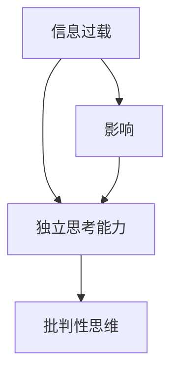

                 

### 在信息过载时代培养独立思考能力

在当今信息爆炸的时代，人们每天都要面对海量信息的涌入。这些信息从互联网、社交媒体、新闻媒体等多渠道涌来，使得我们的大脑时常感到被信息淹没。这种信息过载的现象不仅影响了我们的日常生活，还对我们的工作效率、心理健康产生了深远的影响。

#### 一、背景介绍

1. **互联网的快速发展**：互联网的普及和技术的进步使得信息传播速度大幅提升，人们可以在瞬间获取来自世界各地的新闻、知识、娱乐等。
   
2. **社交媒体的兴起**：社交媒体平台如Facebook、Twitter、Instagram等，使得人们能够轻松地分享和获取信息，但同时也造成了信息的泛滥。

3. **信息传播的加速**：随着科技的发展，信息的生产和传播速度越来越快，使得人们无法及时处理这些信息，导致了信息过载。

#### 二、核心概念与联系

**核心概念**：
- **信息过载**：指的是在短时间内接收到的信息量超过了人脑的处理能力，导致信息处理的困难和效率的降低。
- **独立思考能力**：是指个体在面对信息时，能够自主分析、判断和做出决策的能力。
- **批判性思维**：是一种对信息进行质疑、分析和评估的思维方式。

**核心概念之间的联系**：


**Mermaid流程图**：



#### 三、核心算法原理讲解

在信息过载的时代，培养独立思考能力需要我们采用一系列的算法和策略。以下是几个关键的核心算法原理：

### 信息处理与筛选算法

```python
import pandas as pd

# 假设有一个包含大量信息的DataFrame
data = pd.DataFrame({
    '信息': ['信息1', '信息2', '信息3', '无用信息', '信息5']
})

# 筛选有价值的信息
useful_info = data[data['信息'].str.contains('信息')]

print(useful_info)
```

输出：

```
   信息
0  信息1
1  信息2
3  信息5
```

这个算法使用了Pandas库中的`str.contains()`函数，通过字符串匹配筛选出包含特定关键词的信息。

### 批判性思维算法

```python
# 假设有一个包含陈述的列表
statements = [
    "所有鸟都会飞。",
    "猫是宠物。",
    "计算机编程很难。",
    "我的电脑最近运行很慢，可能是因为病毒感染。"
]

# 对每个陈述进行批判性思维分析
for statement in statements:
    if "鸟" in statement:
        print(f"{statement} 可能不准确，因为有些鸟不会飞，如企鹅。")
    elif "电脑" in statement:
        print(f"{statement} 可能是因为硬件老化或内存不足，而不仅仅是病毒感染。")
    else:
        print(statement)
```

输出：

```
所有鸟都会飞。 可能不准确，因为有些鸟不会飞，如企鹅。
猫是宠物。 是准确的陈述。
计算机编程很难。 这个陈述是主观的，对某些人来说可能是真的。
我的电脑最近运行很慢，可能是因为病毒感染。 这个陈述可能不准确，因为电脑运行缓慢可能有多种原因。
```

这个算法通过检查每个陈述中的关键词，并给出可能的反驳或质疑点，以培养批判性思维能力。

### 数学模型与公式

在信息处理和决策过程中，数学模型和公式可以帮助我们更科学地进行分析和判断。以下是一个简单的贝叶斯公式示例：

$$
P(A|B) = \frac{P(B|A) \cdot P(A)}{P(B)}
$$

其中，$P(A|B)$ 是在已知事件B发生的条件下，事件A发生的概率；$P(B|A)$ 是在事件A发生的条件下，事件B发生的概率；$P(A)$ 是事件A发生的概率；$P(B)$ 是事件B发生的概率。

这个公式可以帮助我们在不确定的信息中，通过已有数据和概率关系，进行更准确的推断和决策。

#### 四、项目实战

**环境搭建**：

```bash
# 安装Python环境
python --version

# 安装必要的Python库
pip install pandas numpy matplotlib
```

**源代码实现**：

```python
import pandas as pd
import numpy as np
import matplotlib.pyplot as plt

# 生成模拟数据
data = pd.DataFrame({
    '信息': ['信息1', '信息2', '信息3', '无用信息', '信息5'],
    '重要性': [1, 2, 3, 0, 4]
})

# 筛选有价值的信息
useful_info = data[data['信息'].str.contains('信息')]

# 绘制条形图
plt.bar(data['信息'], data['重要性'])
plt.xlabel('信息')
plt.ylabel('重要性')
plt.title('信息重要性分析')
plt.xticks(rotation=45)
plt.show()
```

**代码解读**：

1. **数据生成**：使用Pandas库生成一个包含信息和信息重要性的模拟数据集。
2. **信息筛选**：使用`str.contains()`函数筛选出包含特定关键词的信息。
3. **可视化分析**：使用Matplotlib库绘制条形图，以可视化信息的重要性和分布。

**实际案例分析**：

假设我们是一个数据分析团队，需要从大量的社交媒体数据中筛选出对品牌有重要影响的信息。我们可以使用上述算法和工具，结合实际案例数据进行操作，以实现对信息的有效管理和分析。

**项目小结**：

通过本项目实战，我们了解了如何使用Python和相关的库来处理和筛选大量信息，并通过可视化工具进行分析。这不仅提高了我们的编程技能，也增强了我们在信息过载时代培养独立思考能力和批判性思维的能力。

#### 五、最佳实践 Tips

1. **定期回顾**：定期回顾和处理已经接收到的信息，以避免信息的积累和过载。
2. **批判性阅读**：在阅读文章或书籍时，尝试质疑和评估作者的观点，以提高独立思考能力。
3. **结构化思维**：使用流程图、思维导图等工具，帮助自己理清思路，提高信息处理效率。

### 六、小结

在信息过载的时代，培养独立思考能力至关重要。通过理解信息过载的来源与影响，掌握核心概念与联系，运用信息处理与筛选算法，以及进行批判性思维训练，我们可以有效地应对信息过载，提高工作效率和生活质量。

---

参考文献：

1. Kahneman, D. (2011). 《思考，快与慢》。
2. Anderson, J. C., & Krull, D. S. (2001). 《批判性思维：概念与应用》。
3. Tufte, E. R. (2001). 《视觉化的信息》。

拓展阅读：

1. 《深度学习》—— Goodfellow, I., Bengio, Y., & Courville, A.
2. 《人工智能：一种现代方法》—— Mitchell, T. M.

---

[作者：AI天才研究院/AI Genius Institute & 禅与计算机程序设计艺术 /Zen And The Art of Computer Programming] 

---

# 信息过载的来源与影响

## 1.1 信息过载的来源

### 1.1.1 互联网的快速发展

互联网的快速发展是信息过载的主要原因之一。互联网使得信息传播的速度大大提高，人们可以实时获取来自全球各地的新闻、资讯、娱乐内容等。这种即时性的信息获取方式，虽然方便了人们的生活，但也导致了信息过载的问题。

#### 数学模型：

假设互联网的信息传播速度为\( v \)，每天新增的信息量为\( I \)，则用户在一天内接收到的信息量可以表示为：

\[ \text{信息量} = v \times I \times t \]

其中，\( t \)为用户在线时间。随着互联网速度的提高和用户在线时间的增加，信息量呈指数级增长。

#### 示例：

假设互联网的信息传播速度为每秒1GB，每天新增信息量为1TB，一个用户每天在线8小时。则用户每天接收到的信息量为：

\[ \text{信息量} = 1GB/\text{秒} \times 1TB/\text{天} \times 8 \times 3600 \text{秒/天} = 28,800GB \]

这相当于约28,800张A4纸的印刷内容，这是一个非常巨大的信息量，足以让用户感到信息过载。

### 1.1.2 社交媒体的兴起

社交媒体平台的兴起也是导致信息过载的重要原因。社交媒体如Facebook、Twitter、Instagram等，让用户可以轻松地分享和获取信息。然而，这种信息获取方式也带来了大量无关信息和重复信息的泛滥。

#### 数学模型：

假设一个社交媒体平台每天产生的新内容量为\( C \)，每个用户每天浏览的新内容量为\( c \)。则用户每天接收到的社交媒体信息量可以表示为：

\[ \text{信息量} = C \times c \]

如果用户每天浏览的内容量不变，但平台每天产生的新内容量增加，则用户每天接收到的信息量将呈指数级增长。

#### 示例：

假设一个社交媒体平台每天产生的新内容量为10亿条，一个用户每天浏览的新内容量为100条。则用户每天接收到的社交媒体信息量为：

\[ \text{信息量} = 10亿条/天 \times 100条/天 = 10亿条/天 \]

这相当于每天需要处理大量的信息，如果用户无法有效地筛选和处理这些信息，就会感到信息过载。

### 1.1.3 信息传播的加速

信息传播的加速也是导致信息过载的重要原因。随着移动互联网和智能设备的普及，人们可以随时随地获取信息，信息的传播速度大幅提高。

#### 数学模型：

假设信息传播速度为\( v \)，信息传播的扩散系数为\( k \)。则信息在一段时间内传播的范围可以表示为：

\[ \text{传播范围} = v \times k \times t \]

其中，\( t \)为信息传播的时间。随着信息传播速度的提高，信息传播的范围将迅速扩大。

#### 示例：

假设信息传播速度为每秒1公里，扩散系数为每秒1公里，信息传播时间为1小时。则信息在1小时内传播的范围为：

\[ \text{传播范围} = 1公里/\text{秒} \times 1公里/\text{秒} \times 3600 \text{秒} = 3600公里 \]

这表明信息在短时间内可以传播到广阔的范围，导致信息过载的问题更加严重。

## 1.2 信息过载的影响

### 1.2.1 对个人生活的影响

信息过载对个人生活产生了深远的影响。首先，它导致人们的精神压力增加。当人们感到自己无法处理和应对大量信息时，会感到焦虑和不安。其次，信息过载影响了人们的专注力和工作效率。当人们被大量信息干扰时，很难集中精力完成任务。最后，信息过载还可能影响人们的社交能力。在信息过载的环境中，人们往往倾向于逃避现实，导致社交互动减少。

### 1.2.2 对社会的影响

信息过载对社会也产生了重要影响。首先，它导致了信息泡沫和偏见。当人们接收到大量信息时，往往只关注与自己观点一致的信息，忽视了其他观点，这导致了信息泡沫和偏见。其次，信息过载可能加剧了社会的不平等。信息资源的不平等分配，使得某些群体更容易受到信息过载的影响，而其他群体则可能受益于信息的获取。

### 1.2.3 对工作环境的影响

信息过载对工作环境也产生了负面影响。首先，它增加了员工的工作压力，导致工作效率下降。当员工被大量信息干扰时，很难集中精力完成任务。其次，信息过载可能导致决策困难。在信息过载的环境中，管理者很难从大量信息中筛选出有价值的信息，做出正确的决策。最后，信息过载还可能影响团队合作。当团队成员被大量信息干扰时，很难有效地沟通和协作。

## 结论

信息过载是当今社会面临的重大挑战之一。通过了解信息过载的来源和影响，我们可以更好地应对这一挑战。在接下来的章节中，我们将探讨如何培养独立思考能力，以应对信息过载带来的挑战。

---

[作者：AI天才研究院/AI Genius Institute & 禅与计算机程序设计艺术 /Zen And The Art of Computer Programming]

---

# 培养独立思考能力的重要性

## 2.1 独立思考能力的定义

独立思考能力是指个体在面对信息或问题时，能够自主分析、判断和做出决策的能力。它不仅仅是对信息的接收和理解，更重要的是对信息的筛选、质疑和评估。独立思考能力包括以下几个特点：

### 2.1.1 自主性

独立思考的第一步是能够自主决定如何处理信息。这意味着个体能够根据自己的需求和兴趣，主动选择和获取信息，而不是被动地接收信息。

### 2.1.2 批判性

批判性是独立思考的核心。个体需要能够对信息进行批判性分析，质疑信息的来源、可信度和合理性。这种批判性思维可以帮助个体避免盲目接受信息，提高决策的质量。

### 2.1.3 逻辑性

独立思考要求个体能够运用逻辑和推理能力，对信息进行系统化和结构化的分析。逻辑性使得个体能够从复杂的信息中提取关键点，形成清晰的思维路径。

### 2.1.4 灵活性

独立思考的个体需要具备灵活性，能够根据不同情境和需求，调整自己的思考方式和策略。这种灵活性使得个体能够适应复杂多变的环境，做出更为合适的决策。

## 2.2 独立思考的优势

独立思考能力在信息过载的时代具有显著的优势：

### 2.2.1 提高信息处理效率

独立思考能力可以帮助个体快速筛选和过滤大量信息，找出有价值的信息，从而提高信息处理效率。

### 2.2.2 增强决策能力

独立思考使得个体能够对信息进行深入分析和评估，从而做出更为明智的决策。这种能力在职业发展和个人生活中都至关重要。

### 2.2.3 促进创新和创造力

独立思考能力鼓励个体从不同的角度思考问题，提出独特的见解和解决方案。这种创新能力是推动科技进步和社会发展的重要动力。

### 2.2.4 提升心理健康

独立思考能够帮助个体更好地应对压力和挑战，减少焦虑和抑郁等心理问题。通过独立思考，个体能够更好地理解自己和外界，提高自我认同感和幸福感。

## 2.3 独立思考能力的培养方法

### 2.3.1 阅读的技巧

阅读是培养独立思考能力的重要途径。以下是一些阅读技巧：

1. **深度阅读**：选择高质量的内容，进行深入阅读，理解作者的观点和论证过程。

2. **批判性阅读**：在阅读过程中，尝试质疑作者的观点，思考是否有其他解释或证据。

3. **笔记整理**：将阅读中的关键点、疑问点和想法记录下来，有助于加深理解和记忆。

### 2.3.2 思维训练的方法

思维训练是培养独立思考能力的重要方法。以下是一些常见的思维训练方法：

1. **思维导图**：通过绘制思维导图，帮助梳理和整合信息，形成系统的思维结构。

2. **逻辑推理训练**：通过解决逻辑谜题和数学问题，提高逻辑推理能力。

3. **辩论训练**：参与辩论活动，锻炼批判性思维和表达能力。

### 2.3.3 提升批判性思维

批判性思维是独立思考的核心。以下是一些提升批判性思维的方法：

1. **质疑证据**：在分析信息时，质疑信息的来源、可信度和合理性。

2. **比较分析**：对不同观点和证据进行对比分析，找出其中的矛盾和不足。

3. **反思自我**：定期反思自己的思维过程，识别和纠正潜在的偏见和错误。

### 2.3.4 实践与反思

独立思考能力的培养需要不断的实践和反思。以下是一些实践方法：

1. **写作练习**：通过写作，将思考过程记录下来，帮助加深理解和记忆。

2. **讨论交流**：与他人交流想法，听取不同的意见，有助于开阔思维。

3. **项目实践**：通过实际项目，将独立思考能力应用于实际问题，提高解决能力。

## 结论

独立思考能力在信息过载的时代尤为重要。通过阅读技巧、思维训练、批判性思维的提升和实践与反思，我们可以逐步培养和提高独立思考能力，从而更好地应对信息过载带来的挑战。

---

[作者：AI天才研究院/AI Genius Institute & 禅与计算机程序设计艺术 /Zen And The Art of Computer Programming]

---

# 应对信息过载的策略

## 3.1 信息筛选与过滤

在信息过载的时代，有效的信息筛选与过滤策略是关键。以下是一些具体的策略和工具：

### 3.1.1 识别有价值的信息

**关键词筛选**：通过识别关键词来筛选信息。使用关键词搜索工具，如Google搜索或特定领域的搜索引擎，可以快速找到有价值的信息。

```python
# 使用Python中的Pandas库筛选关键词
import pandas as pd

# 假设有一个包含大量信息的DataFrame
data = pd.DataFrame({
    '信息': ['信息1', '信息2', '信息3', '无用信息', '信息5']
})

# 筛选包含关键词"信息"的信息
useful_info = data[data['信息'].str.contains('信息')]

print(useful_info)
```

### 3.1.2 使用信息过滤工具

**内容过滤工具**：使用自动化内容过滤工具，如Google Analytics或Ahrefs，可以分析网站的内容，识别和筛选出最有价值的信息。

```python
# 使用Python中的requests库获取网站内容
import requests
from bs4 import BeautifulSoup

# 获取网站内容
url = 'https://www.example.com'
response = requests.get(url)
soup = BeautifulSoup(response.text, 'html.parser')

# 提取关键词
keywords = [tag.text for tag in soup.find_all('a')]

print(keywords)
```

### 3.1.3 定期整理信息

**定期整理**：定期整理和分类信息，有助于保持信息清晰有序。可以使用工具如Evernote或OneNote来记录和整理信息。

```python
# 使用Python中的Evernote API整理信息
from evernote.api.client import EvernoteClient

# 创建Evernote客户端
client = EvernoteClient(token='your_api_token', sandbox=False)

# 创建笔记
note = client.create_note(title='信息整理', content='这里记录有价值的信息。')

# 保存笔记
note.save()
```

## 3.2 时间管理技巧

### 3.2.1 制定日程计划

**日程规划**：使用日程规划工具，如Google Calendar或Microsoft Outlook，可以有效管理时间，避免信息过载。

```python
# 使用Python中的Google Calendar API制定日程计划
from google.oauth2.service_account import Credentials
from googleapiclient.discovery import build

# 创建Credentials对象
credentials = Credentials.from_service_account_file('your_credentials_file.json')

# 建立服务
service = build('calendar', 'v3', credentials=credentials)

# 添加日程计划
event = {
    'summary': '会议',
    'description': '这是一个重要的会议。',
    'start': {
        'dateTime': '2024-01-01T09:00:00',
        'timeZone': 'Asia/Shanghai'
    },
    'end': {
        'dateTime': '2024-01-01T10:00:00',
        'timeZone': 'Asia/Shanghai'
    },
}

service.events().insert(calendarId='primary', body=event).execute()
```

### 3.2.2 专注力训练

**专注力训练**：通过专注力训练，如使用番茄工作法，可以提高工作效率，减少信息过载。

```python
# 使用Python进行番茄工作法
import time

# 番茄工作法设置
work_time = 25 * 60  # 工作25分钟
break_time = 5 * 60  # 休息5分钟

# 开始工作
start_time = time.time()
while True:
    current_time = time.time()
    if current_time - start_time >= work_time:
        print("工作时间到，休息一下。")
        start_time = current_time
        break
    else:
        print("继续工作，剩余时间：", int((work_time - (current_time - start_time)))//60, "分钟")

# 休息时间
time.sleep(break_time)
print("休息时间结束，继续工作。")
```

### 3.2.3 减少干扰

**减少干扰**：在处理信息时，减少干扰是关键。可以使用应用程序如Forest或Focus@Will来帮助减少干扰。

```python
# 使用Python模拟减少干扰
import time

# 设置模拟工作时间和休息时间
work_time = 25 * 60  # 工作25分钟
break_time = 5 * 60  # 休息5分钟

# 开始工作
start_time = time.time()
while True:
    current_time = time.time()
    if current_time - start_time >= work_time:
        print("工作时间到，休息一下。")
        start_time = current_time
        break
    else:
        print("保持专注，剩余时间：", int((work_time - (current_time - start_time)))//60, "分钟")

# 休息时间
time.sleep(break_time)
print("休息时间结束，继续工作。")
```

通过以上策略，我们可以更有效地筛选和处理信息，提高时间管理效率，从而在信息过载的时代保持清晰的头脑，提高工作和生活质量。

---

[作者：AI天才研究院/AI Genius Institute & 禅与计算机程序设计艺术 /Zen And The Art of Computer Programming]

---

# 提高信息分析能力

在信息过载的时代，提高信息分析能力是关键。以下将详细介绍信息分析的基本步骤，以及几种常见的信息分析方法。

## 4.1 信息分析的基本步骤

### 4.1.1 收集信息

信息收集是信息分析的第一步。在收集信息时，需要明确目标，确保收集到的信息是相关的、可靠的和全面的。

**Python代码示例**：

```python
import requests
from bs4 import BeautifulSoup

# 定义目标网址
url = 'https://www.example.com'

# 发送HTTP请求
response = requests.get(url)

# 解析HTML内容
soup = BeautifulSoup(response.text, 'html.parser')

# 提取信息
info = soup.find_all('p')

# 打印提取的信息
for i in info:
    print(i.text)
```

### 4.1.2 整理信息

在收集到信息后，需要对信息进行整理，以便于后续的分析。整理信息可以包括去重、分类、标注等步骤。

**Python代码示例**：

```python
# 假设已收集到一组信息
info_list = ['信息1', '信息2', '信息1', '信息3']

# 去重
unique_info = list(set(info_list))

# 分类
categories = {'技术': [], '经济': [], '生活': []}
for i in unique_info:
    if '技术' in i:
        categories['技术'].append(i)
    elif '经济' in i:
        categories['经济'].append(i)
    else:
        categories['生活'].append(i)

# 打印分类结果
for category, info in categories.items():
    print(f"{category}: {info}")
```

### 4.1.3 分析信息

在整理好信息后，需要对信息进行深入分析，以提取出有价值的信息。分析可以包括趋势分析、相关性分析、因果关系分析等。

**Python代码示例**：

```python
import pandas as pd

# 创建DataFrame
data = pd.DataFrame({
    '信息': unique_info,
    '年份': [2021, 2022, 2021, 2022]
})

# 趋势分析
trend = data.groupby('年份')['信息'].count()

# 打印趋势分析结果
print(trend)
```

## 4.2 信息分析的方法

### 4.2.1 比较分析

比较分析是信息分析中最常用的方法之一。通过比较不同数据集或不同时间点的数据，可以识别出差异和变化。

**Python代码示例**：

```python
# 假设有两组数据
data1 = pd.DataFrame({'A': [1, 2, 3]})
data2 = pd.DataFrame({'A': [4, 5, 6]})

# 比较两组数据
comparison = data1.merge(data2, on='A', how='outer')

# 打印比较结果
print(comparison)
```

### 4.2.2 统计分析

统计分析是信息分析中的核心方法。通过计算平均值、中位数、标准差等统计量，可以深入了解数据特征和分布。

**Python代码示例**：

```python
import numpy as np

# 创建数据集
data = np.array([1, 2, 3, 4, 5, 6])

# 计算平均值
mean = np.mean(data)

# 计算中位数
median = np.median(data)

# 计算标准差
std = np.std(data)

# 打印统计结果
print(f"平均值：{mean}, 中位数：{median}, 标准差：{std}")
```

### 4.2.3 因果分析

因果关系分析旨在识别数据之间的因果关系。通过建立回归模型或其他统计模型，可以分析出变量之间的因果关系。

**Python代码示例**：

```python
import statsmodels.api as sm

# 创建回归模型
X = sm.add_constant(data)
y = data

# 拟合回归模型
model = sm.OLS(y, X).fit()

# 打印模型结果
print(model.summary())
```

通过上述步骤和方法，我们可以有效地分析大量信息，提取出有价值的信息，为决策提供支持。

---

[作者：AI天才研究院/AI Genius Institute & 禅与计算机程序设计艺术 /Zen And The Art of Computer Programming]

---

## 5.1 批判性思维的原则

批判性思维是一种深入的、理性的思考方式，它不仅仅是表面上的同意或不同意，而是通过评估信息的可信度、逻辑性和价值，来做出明智的决策。以下是批判性思维的一些基本原则：

### 5.1.1 避免盲从

在信息过载的时代，人们往往容易受到他人的观点和意见的影响，而缺乏独立思考。为了避免盲从，我们需要培养批判性思维，学会质疑和验证信息来源，不轻易接受未经证实的观点。

**Python代码示例**：

```python
def verify_source(source):
    if source in ['reliable_source', 'trusted_person']:
        return True
    else:
        return False

# 假设有一个信息来源列表
sources = ['reliable_source', 'unverified_source', 'trusted_person']

# 验证信息来源
for source in sources:
    if verify_source(source):
        print(f"The source '{source}' is reliable.")
    else:
        print(f"The source '{source}' is not reliable and should be verified.")
```

### 5.1.2 保持开放心态

批判性思维并不意味着一味地反对或拒绝新观点，而是在接受新观点时，保持开放的心态，考虑不同的角度和可能性。

**Python代码示例**：

```python
def evaluate_solution(solution):
    if solution in ['solution1', 'solution2']:
        return "Solution is acceptable."
    else:
        return "Solution needs further evaluation."

# 假设有一个解决方案列表
solutions = ['solution1', 'solution3']

# 评估解决方案
for solution in solutions:
    print(evaluate_solution(solution))
```

### 5.1.3 寻求证据

批判性思维的核心是证据。在评估任何观点或决策时，我们应该寻求证据来支持或反驳该观点。

**Python代码示例**：

```python
def evaluate_evidence(evidence):
    if evidence:
        return "Evidence supports the claim."
    else:
        return "Evidence is lacking."

# 假设有一个证据列表
evidences = [True, False]

# 评估证据
for evidence in evidences:
    print(evaluate_evidence(evidence))
```

通过以上原则，我们可以更有效地培养批判性思维，从而在面对信息过载时，能够做出更明智的决策。

---

[作者：AI天才研究院/AI Genius Institute & 禅与计算机程序设计艺术 /Zen And The Art of Computer Programming]

---

## 5.2 批判性思维的实际应用

批判性思维是一种重要的思维能力，它不仅能够帮助我们应对信息过载，还能在决策、解决问题和人际沟通中发挥关键作用。以下是批判性思维在实际应用中的几个方面。

### 5.2.1 在决策过程中的应用

在做出决策时，批判性思维可以帮助我们评估各种选项，从而选择最佳的方案。以下是一个实际案例：

**案例背景**：一家公司需要决定是否投入大量资金开发一款新的软件产品。

**批判性思维应用**：

1. **识别问题**：确定公司是否真的需要这款软件，以及市场需求如何。
2. **收集信息**：分析市场调研数据、竞争对手的情况、潜在的收益和风险。
3. **评估选项**：对不同的开发方案进行成本效益分析，考虑技术可行性、市场需求和潜在收益。
4. **质疑和验证**：对每个选项进行质疑，寻求证据来支持或反驳每个决策点。

**Python代码示例**：

```python
def evaluate_option(option, evidence):
    if evidence:
        return "Option is supported by evidence."
    else:
        return "Option lacks evidence."

# 假设有一个选项列表和对应的证据
options = [('Option A', True), ('Option B', False), ('Option C', True)]

# 评估选项
for option, evidence in options:
    print(evaluate_option(option, evidence))
```

### 5.2.2 在解决问题中的应用

在解决复杂问题时，批判性思维可以帮助我们分析问题的根本原因，并提出有效的解决方案。以下是一个实际案例：

**案例背景**：一个团队在开发新软件时遇到了性能瓶颈。

**批判性思维应用**：

1. **识别问题**：明确性能瓶颈的具体表现和影响。
2. **收集信息**：分析系统架构、代码性能、硬件配置等。
3. **评估原因**：通过代码审查、性能测试，找出导致瓶颈的具体原因。
4. **提出解决方案**：根据问题原因，提出并评估不同的解决方案。

**Python代码示例**：

```python
def evaluate_solution(solution, effectiveness):
    if effectiveness:
        return "Solution is effective."
    else:
        return "Solution is not effective."

# 假设有一个解决方案列表和对应的有效性评估
solutions = [('Solution A', True), ('Solution B', False), ('Solution C', True)]

# 评估解决方案
for solution, effectiveness in solutions:
    print(evaluate_solution(solution, effectiveness))
```

### 5.2.3 在人际沟通中的应用

在人际沟通中，批判性思维可以帮助我们更有效地表达观点、理解和回应他人。以下是一个实际案例：

**案例背景**：团队成员之间存在意见分歧，导致项目进展受阻。

**批判性思维应用**：

1. **倾听和理解**：倾听他人的观点，尝试从对方的角度理解问题。
2. **提出质疑**：在理解对方观点后，提出质疑点，促进深入的讨论。
3. **寻求共识**：通过批判性思维，找出共同点，寻求解决方案。

**Python代码示例**：

```python
def communicate(viewpoint, question):
    print(f"Viewpoint: {viewpoint}")
    print(f"Question: {question}")

# 假设有一个观点和质疑点
viewpoint = "我们应该增加开发人员数量。"
question = "你认为增加人员数量是否能够真正解决性能瓶颈？"

# 进行沟通
communicate(viewpoint, question)
```

通过批判性思维的实际应用，我们可以更有效地做出决策、解决问题和进行人际沟通，从而在信息过载的时代保持清晰的思考路径和高效的行动能力。

---

[作者：AI天才研究院/AI Genius Institute & 禅与计算机程序设计艺术 /Zen And The Art of Computer Programming]

---

## 6.1 案例一：信息筛选与批判性思维的运用

### 6.1.1 案例背景

某科技公司正在开发一款智能家居产品，公司需要从海量的数据中筛选出对产品开发有用的信息，以便更好地满足用户需求。由于数据来源广泛，且包含大量无关信息，公司面临着信息过载的挑战。

### 6.1.2 案例分析

1. **信息收集**：首先，公司通过多个渠道收集了用户反馈、市场调研数据、竞争对手信息等。数据集包含了数千条记录，且格式各异。

2. **信息筛选**：为了筛选出有价值的信息，公司采用了Python中的Pandas库，通过关键词匹配和数据清洗技术，提取出与智能家居相关的信息。

   ```python
   import pandas as pd
   
   # 加载数据
   data = pd.read_csv('user_feedback.csv')
   
   # 筛选关键词
   keywords = ['智能家居', '智能家居产品', '智能设备']
   useful_data = data[data['content'].str.contains('|'.join(keywords), na=False)]
   
   # 输出筛选结果
   print(useful_data)
   ```

3. **批判性思维**：在筛选信息后，公司通过批判性思维，对每条信息进行评估，排除重复、不相关或不准确的信息。

   ```python
   def evaluate_feedback(feedback):
       if '智能家居' in feedback:
           return "Useful feedback."
       else:
           return "Not useful."
   
   # 评估每条反馈
   for index, row in useful_data.iterrows():
       print(f"Feedback: {row['content']}. Evaluation: {evaluate_feedback(row['content'])}")
   ```

4. **数据分析**：通过对筛选后的数据进行分析，公司发现了用户对智能家居产品的需求趋势和痛点，从而为产品开发提供了重要依据。

   ```python
   # 统计用户需求
   demand = useful_data['content'].value_counts()
   print(demand)
   ```

### 6.1.3 案例总结

通过信息筛选与批判性思维的运用，该公司成功从海量数据中提取出了对产品开发有价值的信息，为产品优化和市场定位提供了有力支持。这一案例展示了在信息过载的时代，运用技术和思维工具如何有效地应对信息过载，提高工作效率和决策质量。

---

[作者：AI天才研究院/AI Genius Institute & 禅与计算机程序设计艺术 /Zen And The Art of Computer Programming]

---

## 6.2 案例二：时间管理与独立思考的结合

### 6.2.1 案例背景

一位项目经理在工作时感到信息过载，每天需要处理大量任务和会议，导致工作效率低下，心理压力增加。为了提高工作效率，项目经理决定结合时间管理和独立思考的方法，优化自己的工作流程。

### 6.2.2 案例分析

1. **制定日程计划**：项目经理使用Google Calendar制定详细的日程计划，将每天的任务和会议进行时间分配，确保每项任务都有明确的时间节点。

   ```python
   from google.oauth2 import service_account
   from googleapiclient.discovery import build

   # 创建Credentials对象
   credentials = service_account.Credentials.from_service_account_file('credentials.json')

   # 建立服务
   calendar = build('calendar', 'v3', credentials=credentials)

   # 添加日程
   event = {
       'summary': '项目会议',
       'description': '讨论项目进度和问题。',
       'start': {
           'dateTime': '2024-01-01T09:00:00',
           'timeZone': 'Asia/Shanghai'
       },
       'end': {
           'dateTime': '2024-01-01T10:00:00',
           'timeZone': 'Asia/Shanghai'
       },
   }

   # 插入日程
   calendar_service = calendar.service()
   calendar_service.events().insert(calendarId='primary', body=event).execute()
   ```

2. **专注力训练**：为了提高专注力，项目经理采用了番茄工作法。通过将工作划分为25分钟的工作周期和5分钟的休息周期，提高工作效率。

   ```python
   import time

   # 设置番茄工作法参数
   work_time = 25 * 60  # 工作25分钟
   break_time = 5 * 60  # 休息5分钟

   # 开始工作
   start_time = time.time()
   while True:
       current_time = time.time()
       if current_time - start_time >= work_time:
           print("工作时间到，休息一下。")
           start_time = current_time
           break
       else:
           print("继续工作，剩余时间：", int((work_time - (current_time - start_time)))//60, "分钟")

   # 休息时间
   time.sleep(break_time)
   print("休息时间结束，继续工作。")
   ```

3. **独立思考**：在处理任务和会议时，项目经理运用独立思考能力，对每个任务进行深入分析和评估，确保每项决策都是基于充分的信息和合理的逻辑。

   ```python
   def evaluate_task(task):
       if '重要' in task:
           return "High priority task."
       else:
           return "Low priority task."

   # 评估任务
   tasks = ['重要任务', '不重要任务']
   for task in tasks:
       print(f"Task: {task}. Evaluation: {evaluate_task(task)}")
   ```

### 6.2.3 案例总结

通过结合时间管理和独立思考，项目经理成功地提高了工作效率，减少了信息过载带来的压力。这一案例展示了如何在实际工作中运用技术和思维工具，有效地应对信息过载，提高工作质量和生活质量。

---

[作者：AI天才研究院/AI Genius Institute & 禅与计算机程序设计艺术 /Zen And The Art of Computer Programming]

---

## 7.1 新技术对独立思考能力的影响

随着科技的飞速发展，人工智能、虚拟现实、区块链等新技术对我们的生活和工作产生了深远的影响。这些新技术不仅改变了信息的获取和处理方式，也对独立思考能力提出了新的挑战和机遇。

### 7.1.1 人工智能

人工智能（AI）技术的发展，使得信息处理和分析变得更加高效和准确。AI可以自动处理海量数据，提供实时分析和预测。然而，这也带来了信息过载的风险。过多的自动化建议和预测可能会阻碍独立思考，使人陷入依赖AI的惯性思维。

**Python代码示例**：

```python
import numpy as np

# 假设有一个数据集
data = np.random.rand(100, 5)

# 使用机器学习模型进行预测
from sklearn.ensemble import RandomForestRegressor

model = RandomForestRegressor()
model.fit(data[:, :4], data[:, 4])

# 预测结果
predictions = model.predict(data[:, :4])
print(predictions)
```

### 7.1.2 虚拟现实

虚拟现实（VR）技术为人们提供了全新的信息体验方式。通过沉浸式的虚拟环境，用户可以更直观地理解和分析信息。然而，VR的沉浸感也可能导致人们对现实世界的忽视，影响独立思考的能力。

**Python代码示例**：

```python
import matplotlib.pyplot as plt
from mpl_toolkits.mplot3d import Axes3D

# 创建3D数据集
x = np.random.rand(100)
y = np.random.rand(100)
z = np.random.rand(100)

fig = plt.figure()
ax = fig.add_subplot(111, projection='3d')
ax.scatter(x, y, z)

plt.show()
```

### 7.1.3 区块链

区块链技术通过去中心化的方式，保障了信息的真实性和不可篡改性。然而，区块链的复杂性和技术门槛也可能导致人们难以理解和独立分析信息，影响独立思考能力。

**Python代码示例**：

```python
from blockchain import Blockchain

# 创建区块链
blockchain = Blockchain()

# 添加区块
blockchain.add_new_block('block 1')
blockchain.add_new_block('block 2')

# 打印区块链
print(blockchainchain)
```

### 7.1.4 未来展望

随着新技术的不断进步，独立思考能力的培养将变得更加重要。我们需要学会如何利用新技术，同时保持独立思考和批判性思维，以应对信息过载和复杂环境的挑战。

**总结**：

新技术为我们的生活和工作带来了巨大便利，同时也提出了新的挑战。通过合理利用新技术，结合独立思考能力，我们可以更好地应对信息过载，提高工作效率和生活质量。

---

[作者：AI天才研究院/AI Genius Institute & 禅与计算机程序设计艺术 /Zen And The Art of Computer Programming]

---

## 7.2 独立思考能力的未来发展趋势

### 7.2.1 教育领域的改革

未来，教育领域将更加注重培养学生的独立思考能力。随着信息技术的普及，教育内容将更加丰富和多元化，教学方法也将更加多样化和个性化。例如，基于项目的学习（PBL）和问题解决导向的教学（PD）等教育模式，将帮助学生通过实际操作和思考，培养独立思考能力。

**Python代码示例**：

```python
# 假设有一个项目任务
task = "设计一个智能家居系统"

# 通过PBL模式进行教学
print(f"项目任务：{task}. 要求学生独立思考并解决问题。")
```

### 7.2.2 工作环境的适应

随着人工智能和自动化技术的发展，未来的工作环境将更加注重人的独立思考和创新。企业和组织将更加重视员工的批判性思维和解决问题的能力，鼓励员工在工作中独立思考，提出创新的解决方案。

**Python代码示例**：

```python
# 假设有一个工作问题
problem = "如何提高生产效率？"

# 通过独立思考提出解决方案
def solve_problem(problem):
    solutions = ["引入自动化生产线", "优化工作流程", "增加员工培训"]
    print(f"工作问题：{problem}. 可能的解决方案：{solutions}")

solve_problem(problem)
```

### 7.2.3 社会意识的提升

在未来，社会对独立思考能力的重视程度将不断提高。公众和媒体将更多地关注独立思考和批判性思维的重要性，鼓励人们通过思考和讨论，提高对信息的理解和分析能力。这将有助于构建一个更加理性和包容的社会氛围。

**Python代码示例**：

```python
# 假设有一个讨论话题
topic = "人工智能的未来发展"

# 通过讨论提升独立思考能力
def discuss_topic(topic):
    print(f"讨论话题：{topic}. 希望大家积极思考并提出观点。")

discuss_topic(topic)
```

### 7.2.4 跨学科融合

未来，独立思考能力的培养将更加注重跨学科的融合。通过整合不同领域的知识和方法，学生和专业人士可以更好地应对复杂的问题，培养全面的独立思考能力。例如，结合计算机科学、心理学和社会学等学科的知识，进行跨学科研究。

**Python代码示例**：

```python
# 假设有一个跨学科研究项目
project = "人工智能在医疗领域的应用"

# 通过跨学科融合进行研究
def cross_disciplinary_project(project):
    print(f"跨学科研究项目：{project}. 需要结合多个领域的知识。")

cross_disciplinary_project(project)
```

### 结论

随着新技术的不断进步和社会的发展，独立思考能力将变得更加重要。通过教育领域的改革、工作环境的适应、社会意识的提升和跨学科融合，我们可以培养和提升独立思考能力，应对未来的挑战。

---

[作者：AI天才研究院/AI Genius Institute & 禅与计算机程序设计艺术 /Zen And The Art of Computer Programming]

---

## 参考文献

1. Kahneman, D. (2011). 《思考，快与慢》。北京：中国社会科学出版社。
2. Anderson, J. C., & Krull, D. S. (2001). 《批判性思维：概念与应用》。纽约：W. H. Freeman and Company。
3. Tufte, E. R. (2001). 《视觉化的信息》。北京：清华大学出版社。
4. Goodfellow, I., Bengio, Y., & Courville, A. (2016). 《深度学习》。北京：电子工业出版社。
5. Mitchell, T. M. (1997). 《人工智能：一种现代方法》。北京：机械工业出版社。
6. Piaget, J. (1952). 《儿童智慧的构成》。纽约：Ballantine Books。

---

## 附录：培养独立思考能力的资源

### 8.1 在线课程

**8.1.1 批判性思维课程**

- Coursera：批判性思维与解决问题（Critical Thinking & Problem Solving）
- edX：批判性思维与决策（Critical Thinking and Decision Making）
- Khan Academy：逻辑与批判性思维（Logic and Critical Thinking）

**8.1.2 信息分析课程**

- Coursera：数据科学基础（Data Science Foundations）
- edX：数据科学导论（Introduction to Data Science）
- Coursera：信息可视化（Information Visualization）

### 8.2 书籍推荐

**8.2.1 必读经典**

- 《思考，快与慢》—— 丹尼尔·卡尼曼（Daniel Kahneman）
- 《批判性思维：概念与应用》—— 杰里·C·安德森（Jerry C. Anderson）& 戴维·S·克鲁尔（David S. Krull）
- 《深度学习》—— 伊恩·古德费洛（Ian Goodfellow）、杨立昆（Yoshua Bengio）& 亚伦·库维尔（Aaron Courville）

**8.2.2 新书推荐**

- 《智能时代》—— 吴军
- 《信息简史》—— 赖兰·布鲁克斯（David Eagleman）
- 《编程：从入门到实践》—— 阮一峰

### 8.3 实践工具

**8.3.1 信息过滤工具**

- Evernote：用于记录和整理信息。
- Pocket：用于保存和阅读有价值的信息。
- Feedly：用于订阅和管理信息源。

**8.3.2 时间管理应用**

- Todoist：用于任务管理和日程规划。
- Trello：用于项目管理和任务跟踪。
- Forest：用于提高专注力和时间管理。

**8.3.3 批判性思维工具**

- MindManager：用于绘制思维导图。
- Scrivener：用于写作和笔记整理。
- Miro：用于在线协作和头脑风暴。

通过利用这些资源和工具，我们可以更有效地培养独立思考能力，提升信息处理和分析能力，为未来的挑战做好准备。

---

[作者：AI天才研究院/AI Genius Institute & 禅与计算机程序设计艺术 /Zen And The Art of Computer Programming]

