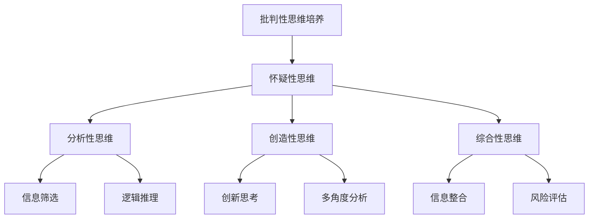

                 

### 引言

在当今信息化时代，我们面临着前所未有的信息过载现象。据统计，每天人类产生的内容量高达数百万亿字节（zettabytes），而每个人每天接收到的信息量也在不断增加。在这种背景下，如何从海量的信息中筛选出有价值的内容，培养批判性思维能力，成为了一个迫切需要解决的问题。

批判性思维（Critical Thinking）是指对信息、观点和理论进行评估和分析，从而形成自己的判断和见解的能力。它不仅是一种智力技能，更是一种生活方式和思考习惯。在信息过载的时代，培养批判性思维能力，可以帮助我们更好地应对复杂多变的环境，做出明智的决策，提高个人的认知水平和生活质量。

本文将围绕批判性思维这一主题，深入探讨其定义、重要性以及在实际中的应用。文章将从以下几部分展开：

1. **信息过载现象及其影响**：介绍信息过载的定义和特征，分析其对个人和社会的影响。
2. **批判性思维的定义与重要性**：解释批判性思维的概念，探讨其在个人成长和社会进步中的重要性。
3. **批判性思维的要素**：详细讨论怀疑性思维、分析性思维、创造性思维和综合性思维的内涵、作用和实践方法。
4. **批判性思维的应用**：分析在媒体、决策、学习和工作中的批判性思维应用。
5. **结论**：总结批判性思维的重要性，展望未来培养批判性思维的方向。

通过本文的阅读，希望能够帮助读者深入了解批判性思维，并在实际生活中培养和应用这一重要的思维能力，从而在信息过载的时代中寻找到真正的智慧。

---

## 信息过载现象及其影响

### 1.1 信息过载的定义与特征

信息过载（Information Overload）指的是当信息量超过个体处理能力时，个体无法有效地处理和理解这些信息的现象。这种现象在现代社会中越来越普遍，主要体现在以下几个方面：

1. **信息量的爆炸性增长**：随着互联网的普及和数字化技术的发展，信息传播的速度和范围得到了前所未有的扩展。每天，我们都会接收到大量的新闻、广告、社交媒体更新、电子邮件等，这些信息以文字、图片、音频和视频等多种形式存在。
2. **信息获取的便捷性**：互联网的普及使得信息的获取变得前所未有的方便。通过搜索引擎、社交媒体、新闻网站等，我们可以轻松地获取到海量的信息。然而，这种便捷性也带来了信息筛选的难题，如何从这些信息中找到有价值的内容，成为了一个挑战。
3. **注意力资源的有限性**：人类的注意力资源是有限的。当信息量超过个体的处理能力时，个体往往需要花费大量时间和精力来筛选和处理信息，这会导致注意力资源的分散，降低个体的工作效率和生活质量。

### 1.2 信息过载对个人和社会的影响

信息过载对个人和社会的影响是深远而广泛的。以下是一些主要的影响：

1. **心理压力增加**：面对大量的信息，个体往往会感到焦虑和压力。为了应对这种压力，个体可能会采取逃避或者放弃的方式，从而影响其心理健康。
2. **决策困难**：在信息过载的环境下，个体在做出决策时往往需要花费更多的时间和精力来收集和分析信息。然而，由于信息量的庞大，个体很难找到所有必要的信息，这会导致决策困难，甚至可能导致错误的决策。
3. **社交关系的疏远**：在社交媒体上，个体会接收到大量的社交信息，这些信息可能会分散个体的注意力，减少与亲朋好友面对面交流的机会，从而导致社交关系的疏远。
4. **社会效率降低**：在组织和社会层面上，信息过载会导致工作效率的降低。员工在处理大量信息时可能会感到疲劳，从而影响其工作效率和创造力。同时，组织在处理大量信息时，也可能会面临信息过载的问题，导致决策缓慢，竞争力下降。

### 1.3 信息过载的应对策略

为了应对信息过载，个体和组织可以采取以下策略：

1. **信息筛选**：通过使用过滤器、搜索引擎等工具，对信息进行筛选，只关注与当前任务相关的信息，从而减少信息过载。
2. **时间管理**：合理安排时间，分配专门的时间段来处理信息，避免信息处理时间过长，从而减少心理压力。
3. **培养批判性思维**：通过培养批判性思维，提高对信息的分析和评估能力，从而减少信息的干扰，做出更明智的决策。
4. **技术支持**：利用技术工具，如自动化系统、人工智能等，来辅助信息处理和决策，从而提高工作效率。

总之，信息过载是现代社会面临的一个重要问题。通过采取有效的应对策略，我们可以更好地处理信息，提高生活质量，为个人和社会的发展创造更有利的条件。

### 2. 批判性思维的定义与重要性

批判性思维（Critical Thinking）是一种对信息、观点和理论进行评估和分析，从而形成自己判断和见解的能力。它不仅是一种智力技能，更是一种思考方式和生活方式。在信息过载的时代，批判性思维显得尤为重要。

#### 2.1 批判性思维的概念

批判性思维可以理解为一种理性的思考过程，它包括以下几个关键要素：

1. **怀疑性思维**：对接受到的信息保持怀疑，不轻易接受，而是通过提问和验证来评估其真实性。
2. **分析性思维**：对信息进行深入分析，找出其中的逻辑关系和假设前提，以便更好地理解其含义和影响。
3. **创造性思维**：在分析的基础上，通过创新和假设来提出新的观点和解决方案。
4. **综合性思维**：将多个信息源和观点进行整合，从不同角度进行全面分析，形成更全面和客观的判断。

批判性思维不仅仅是识别错误和反驳他人的观点，更重要的是通过自我反思和评估，形成独立的判断和见解。它要求个体具备以下几个能力：

- **信息评估能力**：能够识别信息的真实性和可靠性，避免被误导。
- **逻辑推理能力**：能够通过逻辑分析，找出信息之间的关联和逻辑关系。
- **批判性分析能力**：能够对信息进行深入剖析，识别其假设和前提。
- **创造性思维能力**：能够在分析的基础上提出新的观点和解决方案。

#### 2.2 批判性思维的重要性

批判性思维在个人和社会层面都具有重要意义：

1. **个人成长**：批判性思维可以帮助个体更好地应对复杂多变的环境，提高自我认知和决策能力。通过批判性思维，个体能够更清晰地认识自己的优点和不足，从而进行有效的自我提升。
2. **知识获取**：批判性思维有助于个体在大量信息中筛选出有价值的内容，避免信息过载。它能够帮助个体深入理解和掌握知识，提高学习效率。
3. **决策质量**：批判性思维在决策过程中起到关键作用。通过批判性思维，个体能够全面分析各种选项，识别潜在的风险和机会，做出更明智的决策。
4. **社会进步**：在社会层面，批判性思维有助于提高公众的思辨能力和媒体素养，促进社会的理性发展和进步。它能够帮助人们更好地理解社会问题，提出合理的解决方案。

总之，批判性思维是信息过载时代的重要工具。通过培养批判性思维，个体能够更好地应对信息挑战，提高生活质量；而社会整体也能通过批判性思维的发展，实现更理性、更进步的变革。

#### 2.3 批判性思维的发展与培养

批判性思维并非与生俱来，而是可以通过后天的培养和实践逐步发展和提高。以下是一些培养批判性思维的方法：

1. **教育**：在学校教育中，应注重批判性思维的培养。通过开设批判性思维课程，教授逻辑学、哲学、心理学等学科知识，帮助学生建立批判性思维的基本框架。
2. **实践**：通过日常生活中的实践活动，如阅读、写作、辩论等，锻炼批判性思维。例如，阅读时不仅要理解文章的内容，还要分析作者的论证方式和逻辑结构；在写作和辩论中，学会提出质疑和反驳对方的观点。
3. **自我反思**：定期进行自我反思，回顾自己的思考过程和决策，识别其中的不足和错误，并尝试改进。通过自我反思，能够不断优化思考方法，提高批判性思维水平。
4. **跨学科学习**：批判性思维涉及到多个领域，通过跨学科学习，能够拓宽知识面，提高对不同领域问题的理解能力。例如，学习数学可以提高逻辑推理能力，学习心理学可以提高对人类行为和心理的理解。
5. **批判性思维工具**：使用一些批判性思维工具，如SWOT分析、五力模型等，帮助系统性地分析问题，提高思考的深度和广度。

总之，批判性思维是应对信息过载时代的重要能力。通过教育、实践、自我反思和跨学科学习，我们可以逐步培养和发展批判性思维，提高自己的认知水平和生活质量。同时，社会也应重视批判性思维的培养，为个体和社会的进步创造更有利的条件。

### 第一部分：批判性思维的要素

批判性思维不仅仅是一种抽象的能力，它由多个具体的思维要素构成，每个要素都有其独特的定义和作用。在这部分，我们将详细探讨四个关键要素：怀疑性思维、分析性思维、创造性思维和综合性思维。

#### 第1章：怀疑性思维

怀疑性思维（Skeptical Thinking）是指对所接受的信息保持怀疑和质疑的态度，不轻信任何信息，而是通过提问和验证来评估其真实性和可靠性。怀疑性思维的核心在于质疑一切，直到有足够的证据来支持某个观点。

1. **怀疑性思维的定义与作用**

怀疑性思维的定义可以简单概括为：对信息的来源、内容和论证方式进行批判性评估，从而确保信息的真实性和可信度。其作用主要体现在以下几个方面：

- **提高信息的准确性**：通过怀疑性思维，个体能够识别和纠正错误信息，避免被误导。
- **增强逻辑推理能力**：怀疑性思维要求个体对信息进行深入分析，这有助于提高逻辑推理能力。
- **促进独立思考**：怀疑性思维鼓励个体独立思考，不依赖他人的观点，从而形成自己的判断和见解。

2. **怀疑性思维的实践方法**

- **提问技巧**：在接收信息时，学会提出关键问题，如“这个信息的来源是什么？”“这个论证方式是否合理？”“是否有其他解释？”等。通过提问，可以揭示信息的潜在假设和逻辑漏洞。
- **验证信息的来源与准确性**：在接收信息后，应通过多种途径验证其来源和准确性。例如，查阅权威资料、咨询专家意见、查看原始数据等。通过验证，可以确保信息的真实性和可靠性。

3. **案例分析**

假设你看到一篇报道，声称某个新产品的效果非常好。为了应用怀疑性思维，你可以采取以下步骤：

- **提问**：首先，你可以问自己，“这篇报道的来源是什么？”“这个效果是否经过科学验证？”“是否有其他研究支持这一结论？”
- **验证**：然后，你可以查阅相关的研究论文、咨询行业专家，或者查看产品的用户评价。通过这些方法，你可以验证报道的真实性和可靠性。

通过怀疑性思维的实践，你能够更理性地评估信息，避免盲目接受，从而提高自己的判断力。

#### 第2章：分析性思维

分析性思维（Analytical Thinking）是指通过逻辑分析和推理，将复杂的信息分解成更简单的组成部分，以便更好地理解其本质和内在逻辑。分析性思维是批判性思维的核心要素之一，它要求个体具备识别信息间关联和逻辑关系的能力。

1. **分析性思维的定义与作用**

分析性思维的定义可以简单概括为：通过逻辑分析和推理，将复杂问题分解为简单组成部分，以便更好地理解和解决。其作用主要体现在以下几个方面：

- **提高理解能力**：分析性思维能够帮助个体深入理解复杂问题，发现其内在的逻辑关系和关键要素。
- **优化决策过程**：通过分析性思维，个体能够全面评估各种决策方案，识别潜在的风险和机会，从而做出更明智的决策。
- **增强解决问题的能力**：分析性思维能够帮助个体系统地分析问题，提出有效的解决方案。

2. **分析性思维的实践方法**

- **基本的分析框架**：在分析问题时，可以采用以下基本框架：

  - **目标明确**：首先明确分析的目标和问题。
  - **信息收集**：收集与问题相关的所有信息。
  - **逻辑推理**：通过逻辑分析和推理，找出信息之间的关联和内在逻辑。
  - **验证与调整**：验证分析结果，并根据实际情况进行调整。

- **使用证据和逻辑进行论证**：在分析过程中，应注重使用证据和逻辑进行论证。例如，引用权威数据、专家观点、历史案例等，以确保分析的科学性和可信度。

3. **案例分析**

假设你正在分析一个企业的市场策略。为了应用分析性思维，你可以采取以下步骤：

- **目标明确**：首先明确你要分析的市场策略的目标和问题。
- **信息收集**：收集与市场策略相关的所有信息，如市场数据、竞争对手分析、消费者行为等。
- **逻辑推理**：通过逻辑分析和推理，找出市场策略的内在逻辑和关键要素。
- **验证与调整**：验证分析结果，根据实际情况进行调整，确保市场策略的有效性。

通过分析性思维的实践，你能够更系统地分析和解决复杂问题，提高决策的质量和效率。

#### 第3章：创造性思维

创造性思维（Creative Thinking）是指通过创新的视角和方法，提出新的观点、解决方案或创意。创造性思维是批判性思维的另一个重要要素，它要求个体具备跳出传统思维框架，创造性地解决问题的能力。

1. **创造性思维的定义与作用**

创造性思维的定义可以简单概括为：通过创新的方法和思路，提出新的观点、解决方案或创意。其作用主要体现在以下几个方面：

- **激发创新**：创造性思维能够激发个体的创新潜能，推动新技术、新产品和新思路的出现。
- **解决复杂问题**：通过创造性思维，个体能够跳出传统思维框架，提出独特的解决方案，解决复杂的问题。
- **促进个人发展**：创造性思维能够帮助个体在职业生涯中脱颖而出，提高个人的竞争力和影响力。

2. **创造性思维的实践方法**

- **思维导图的应用**：思维导图是一种有效的创造性思维工具，它可以帮助个体梳理思路，发现新的关联和创意。通过绘制思维导图，个体可以从不同的角度思考问题，提出新的解决方案。
- **演绎法与归纳法的结合**：演绎法是从一般原理推导出具体结论，而归纳法是从具体实例归纳出一般规律。将演绎法和归纳法结合，可以更全面地分析问题，提出创新的解决方案。

3. **案例分析**

假设你正在设计一款新的教育产品。为了应用创造性思维，你可以采取以下步骤：

- **思维导图**：首先，通过思维导图列出与教育产品相关的所有要素，如学生需求、教师需求、技术手段等。
- **演绎法与归纳法**：然后，从一般原理出发，推导出教育产品的基本特征，并结合具体实例进行调整和优化。

通过创造性思维的实践，你能够提出独特且有效的解决方案，推动教育产品的创新和发展。

#### 第4章：综合性思维

综合性思维（Synthetic Thinking）是指将多个信息源和观点进行整合，从不同角度进行全面分析，形成更全面和客观的判断。综合性思维是批判性思维的最后一个重要要素，它要求个体具备整合信息和多角度思考的能力。

1. **综合性思维的定义与作用**

综合性思维的定义可以简单概括为：通过整合多个信息源和观点，从不同角度进行全面分析，形成更全面和客观的判断。其作用主要体现在以下几个方面：

- **提高决策质量**：综合性思维能够帮助个体整合各种信息，全面分析问题的各个方面，从而做出更明智的决策。
- **增强问题解决能力**：通过综合性思维，个体能够从多个角度分析问题，提出多种解决方案，提高问题解决能力。
- **促进创新**：综合性思维能够帮助个体整合不同领域的知识和资源，促进创新和跨学科研究。

2. **综合性思维的实践方法**

- **汇总与分析信息**：在处理问题时，首先要收集所有相关的信息，然后对这些信息进行汇总和分析，找出关键点和关联。
- **多角度思考问题**：在分析问题时，要尝试从不同的角度思考，如历史、现状、未来等，以便更全面地理解问题。

3. **案例分析**

假设你正在评估一个新市场的进入策略。为了应用综合性思维，你可以采取以下步骤：

- **汇总与分析信息**：收集与新市场相关的所有信息，如市场趋势、竞争对手、消费者需求等，然后对这些信息进行汇总和分析。
- **多角度思考问题**：从历史、现状和未来等多个角度思考新市场的问题，如历史上的市场趋势、当前的市场环境以及未来的市场机会和挑战。

通过综合性思维的实践，你能够更全面地分析问题，提出创新的解决方案，提高决策的质量和效率。

通过以上对怀疑性思维、分析性思维、创造性思维和综合性思维的详细探讨，我们可以看到，这些批判性思维的要素在应对信息过载和解决复杂问题中具有重要作用。在接下来的章节中，我们将进一步探讨这些思维要素在实际中的应用。

### 第5章：在媒体中的批判性思维

在信息过载的时代，媒体成为我们获取信息的主要渠道。然而，媒体中的信息传播方式复杂多样，其中不乏虚假信息、偏见和误导性报道。因此，培养批判性思维在媒体中的运用，对于我们准确理解信息、避免被误导至关重要。

#### 5.1 媒体中的信息传播

1. **媒体信息传播的特点**

- **速度与广度**：互联网和社交媒体的兴起，使得信息传播速度大幅提高，信息可以在短时间内传播到全球各地。
- **形式多样**：媒体信息传播形式多样，包括新闻报道、社交媒体更新、博客文章、视频和音频等。
- **信息复杂性**：由于信息传播速度快且形式多样，个体在接收和处理信息时，往往面临信息过载和复杂性问题。

2. **媒体信息传播的来源**

- **传统媒体**：如报纸、杂志、电视和广播等，这些媒体的信息来源较为权威，但传播速度相对较慢。
- **社交媒体**：如Facebook、Twitter、微信等，这些平台的信息传播速度快，互动性强，但信息的真实性和可靠性难以保证。
- **博客和自媒体**：这些渠道的信息来源多样化，包括专业机构和普通网民，但信息的质量和可靠性差异较大。

#### 5.2 如何辨别媒体信息的真实性与偏见

1. **真实性的辨别**

- **查证信息来源**：在接收信息时，首先要查证信息来源的可靠性。权威媒体和机构发布的信息通常更为可信。
- **对比多个信息源**：不同媒体可能会对同一事件进行报道，通过对比多个信息源，可以更全面地了解事件的全貌。
- **查看原始数据和证据**：对于重要信息，要查看原始数据和证据，以验证信息的真实性。

2. **偏见的辨别**

- **分析报道角度**：媒体在报道时，可能会选择特定的角度，这可能会影响报道的客观性。要全面理解事件，需要从多个角度进行分析。
- **识别情绪化语言**：情绪化的语言往往带有偏见，通过识别情绪化语言，可以避免被误导。
- **了解媒体立场**：不同媒体的立场和价值观可能不同，了解媒体的立场有助于我们识别潜在的偏见。

3. **批判性思维的应用**

- **怀疑性思维**：对接受到的媒体信息保持怀疑态度，通过提问和验证来评估其真实性和可靠性。
- **分析性思维**：对媒体信息进行深入分析，找出其中的逻辑关系和假设前提，从而更好地理解其含义和影响。
- **综合性思维**：整合多个信息源和观点，从不同角度进行全面分析，形成更客观的判断。

#### 5.3 提高媒体素养

1. **媒体素养的定义**

媒体素养（Media Literacy）是指个体理解和分析媒体信息、批判媒体内容以及创造媒体内容的能力。提高媒体素养有助于我们更好地应对信息过载和媒体误导。

2. **提高媒体素养的方法**

- **培训课程**：参加媒体素养培训课程，学习如何辨别信息的真实性和偏见，如何进行有效的信息分析和批判。
- **自主学习和实践**：通过阅读相关书籍、观看教育视频和参与讨论，提高自己的媒体素养。
- **互动交流**：参与社交媒体讨论，与其他人分享自己的观点和分析，通过互动交流提高批判性思维能力。

#### 案例分析

1. **社交媒体谣言案例**

假设你在社交媒体上看到一篇关于某种健康食品的报道，声称这种食品能够治愈癌症。为了辨别其真实性，你可以采取以下步骤：

- **查证信息来源**：查看这篇报道的来源，是否为权威媒体或科学研究机构。
- **对比多个信息源**：查找其他媒体报道或科学研究，看看是否有类似结论。
- **查看原始数据和证据**：寻找相关的科学研究论文或实验数据，以验证其效果。
- **分析报道角度**：分析报道的角度，是否带有明显的营销目的或偏见。

通过批判性思维的应用，你能够辨别出这篇报道的真实性，避免被误导。

2. **新闻报道案例分析**

假设你在电视新闻上看到一篇关于某个城市交通拥堵的报道，报道指出交通拥堵是由于车辆数量过多。为了更全面地分析问题，你可以采取以下步骤：

- **对比多个信息源**：查看其他媒体对该事件的报道，了解不同角度的观点。
- **查看原始数据和证据**：查阅相关交通统计数据，分析车辆数量与交通拥堵的关系。
- **分析报道角度**：分析报道的角度，是否只关注了车辆数量，忽略了其他可能导致交通拥堵的原因。

通过批判性思维的应用，你能够更全面地分析交通拥堵问题，提出更有效的解决方案。

总之，在媒体中的批判性思维有助于我们准确理解信息、避免被误导。通过怀疑性思维、分析性思维和综合性思维的应用，我们可以提高媒体素养，更好地应对信息过载时代带来的挑战。

### 第6章：在决策中的批判性思维

在生活和工作中，决策是不可避免的。然而，面对复杂多变的环境，如何做出明智的决策成为了一项重要能力。批判性思维在决策过程中发挥着至关重要的作用，通过怀疑性思维、分析性思维和综合性思维的应用，可以提高决策的质量和效率。

#### 6.1 决策中的信息筛选

1. **信息筛选的重要性**

在决策过程中，信息筛选是至关重要的一步。信息筛选的目的是从大量信息中筛选出对决策有用的信息，避免信息过载和决策困难。以下是一些关键点：

- **识别关键信息**：通过怀疑性思维，识别出对决策有直接影响的因素，如目标、约束条件、关键指标等。
- **剔除无关信息**：通过分析性思维，剔除那些与决策无关或次要的信息，避免信息的干扰。
- **验证信息的准确性**：通过综合性思维，验证信息的真实性和可靠性，确保决策的基础是可靠的信息。

2. **信息筛选的方法**

- **目标明确**：在决策前，明确决策的目标和问题，以便更准确地筛选信息。
- **多渠道收集**：通过多个渠道收集信息，如内部数据、外部调研、行业报告等，以确保信息的全面性和多样性。
- **交叉验证**：对收集到的信息进行交叉验证，以识别潜在的误差和偏差。

#### 6.2 批判性思维在决策中的应用

1. **怀疑性思维的应用**

在决策过程中，怀疑性思维可以帮助我们保持理性，避免盲目决策。以下是一些应用场景：

- **评估备选方案**：在制定决策方案时，运用怀疑性思维，评估每个方案的优缺点，识别潜在的风险。
- **质疑专家意见**：对专家的意见保持质疑，通过分析其论证过程和依据，确保决策的依据是科学和可靠的。
- **反思已有决策**：在决策实施过程中，不断反思和评估决策的效果，识别问题并进行调整。

2. **分析性思维的应用**

分析性思维在决策中可以帮助我们更系统地分析和评估各种方案，以下是具体应用：

- **逻辑推理**：通过逻辑推理，找出决策方案之间的逻辑关系，确保决策的连贯性和一致性。
- **论证分析**：对每个决策方案进行论证分析，识别其假设和前提，评估其合理性和可行性。
- **成本效益分析**：通过成本效益分析，评估每个决策方案的投入产出比，确保决策的经济性。

3. **综合性思维的应用**

综合性思维在决策中可以帮助我们全面考虑各种因素，以下是具体应用：

- **整合信息**：整合各种信息，如市场数据、竞争分析、用户反馈等，形成更全面的认识。
- **多角度分析**：从多个角度分析决策方案，如技术、市场、财务等，确保决策的全面性。
- **风险评估**：对决策方案进行风险评估，识别潜在的风险和机会，制定相应的应对策略。

#### 6.3 案例分析

1. **企业战略决策**

假设一家企业在制定五年战略规划，为了提高决策质量，可以采取以下步骤：

- **信息筛选**：明确战略目标，收集市场数据、竞争分析、用户需求等关键信息，剔除无关信息。
- **怀疑性思维**：评估每个备选战略方案的优缺点，质疑专家意见，确保方案的合理性和可行性。
- **分析性思维**：通过逻辑推理和论证分析，评估每个战略方案的成本效益，识别潜在的风险和机会。
- **综合性思维**：整合各种信息，从多个角度分析战略方案，进行全面风险评估，制定最优的战略规划。

2. **个人职业规划**

假设一个人在制定职业规划时，为了提高决策质量，可以采取以下步骤：

- **信息筛选**：明确职业目标，收集行业趋势、市场需求、自身优势等关键信息，剔除无关信息。
- **怀疑性思维**：评估每个备选职业路径的优缺点，质疑行业专家的意见，确保路径的合理性和可行性。
- **分析性思维**：通过逻辑推理和论证分析，评估每个职业路径的成本效益，识别潜在的风险和机会。
- **综合性思维**：整合各种信息，从多个角度分析职业路径，进行全面风险评估，制定最优的职业规划。

通过以上案例分析，我们可以看到，批判性思维在决策过程中发挥了重要作用。通过怀疑性思维、分析性思维和综合性思维的应用，我们可以提高决策的质量和效率，为个人和组织的成功奠定基础。

### 第7章：在学习和工作中的应用

批判性思维不仅在媒体和决策中具有重要应用，同样在学习和工作中也发挥着关键作用。通过培养批判性思维，我们可以提高学习效率，提升工作效率，更好地解决复杂问题。

#### 7.1 批判性思维在学习的应用

1. **提高学习效率**

批判性思维可以帮助我们更有效地学习，以下是具体方法：

- **主动学习**：批判性思维鼓励主动学习，而非被动接受。在学习过程中，我们应保持怀疑性思维，提出问题，积极思考和探索。
- **深度阅读**：通过批判性思维，我们能够更深入地理解阅读材料，识别关键概念和逻辑关系，从而提高学习效率。
- **总结和反思**：在学习结束后，通过总结和反思，回顾所学内容，识别自己的不足和错误，进行有效的巩固和提升。

2. **培养批判性思维习惯**

- **提问和讨论**：在学习过程中，学会提问和与他人讨论，通过交流和分析，提高自己的批判性思维能力。
- **跨学科学习**：批判性思维要求我们具备广泛的知识背景，通过跨学科学习，能够提高我们对不同领域问题的理解能力。
- **自我反思**：定期进行自我反思，回顾学习过程和成果，识别自己的不足，并提出改进措施。

#### 7.2 批判性思维在工作中的应用

1. **提升工作效率**

批判性思维可以帮助我们更高效地工作，以下是具体方法：

- **系统分析问题**：通过分析性思维，对工作中的问题进行系统分析，找出关键因素和解决方案，从而提高工作效率。
- **创新和改进**：通过创造性思维，在工作中不断寻找创新和改进的机会，提高工作效率和质量。
- **风险评估**：通过综合性思维，对工作中的潜在风险进行评估，制定相应的应对策略，减少风险。

2. **解决复杂问题**

- **多角度思考**：在面对复杂问题时，通过综合性思维，从多个角度思考问题，提出多种解决方案，从而提高解决问题的能力。
- **团队合作**：通过批判性思维，与他人进行有效合作，利用各自的优势，共同解决问题。
- **实践和验证**：在实际工作中，通过实践和验证，不断调整和优化解决方案，确保其有效性和可行性。

#### 案例分析

1. **教育领域的应用**

假设一位教师在设计课程时，为了培养学生的批判性思维，可以采取以下步骤：

- **设计问题导向的学习活动**：通过提出问题，引导学生主动思考和探索，培养他们的批判性思维能力。
- **引入跨学科内容**：在课程中引入跨学科内容，如历史、文学、科学等，提高学生对不同领域问题的理解能力。
- **鼓励学生讨论和辩论**：通过讨论和辩论，鼓励学生表达自己的观点，倾听他人的意见，培养他们的批判性思维习惯。

2. **企业管理中的应用**

假设一家企业在进行新产品开发时，为了提高决策质量和效率，可以采取以下步骤：

- **信息筛选和整合**：在产品开发过程中，通过批判性思维，筛选和整合各种信息，确保决策的基础是可靠和全面的。
- **风险评估和应对策略**：通过综合性思维，对新产品开发过程中的潜在风险进行评估，制定相应的应对策略，确保项目的顺利进行。
- **跨部门合作**：通过团队合作，利用不同部门的专业知识和经验，共同解决复杂问题，提高新产品的开发效率和质量。

通过以上案例分析，我们可以看到，批判性思维在学习和工作中具有重要应用。通过怀疑性思维、分析性思维和综合性思维的应用，我们可以提高学习效率，提升工作效率，更好地解决复杂问题。培养批判性思维，不仅有助于个人和组织的成长，也是应对信息过载时代的重要能力。

### 结论

批判性思维在信息过载时代的重要性不可忽视。通过怀疑性思维、分析性思维、创造性思维和综合性思维的应用，我们能够更好地应对信息过载，提高决策质量，提升学习效率，解决复杂问题。批判性思维不仅对个人的成长具有深远影响，也对社会的进步起到积极作用。

未来，随着技术的不断进步，信息过载的现象将会更加严重。因此，培养下一代批判性思维能力显得尤为紧迫。以下是一些建议：

1. **教育改革**：学校和教育机构应加强对批判性思维的培养，将其纳入课程体系，通过实践和案例分析，提高学生的批判性思维能力。
2. **社会倡导**：社会应倡导批判性思维，鼓励公众积极参与讨论和思考，提高整体的思辨能力。
3. **技术支持**：利用人工智能和大数据技术，帮助个体在海量信息中筛选有价值的内容，减少信息过载，为批判性思维的培养提供支持。

总之，批判性思维是应对信息过载时代的重要工具。通过培养下一代批判性思维能力，我们能够更好地适应未来的挑战，实现个人和社会的持续进步。

### 批判性思维工具与资源

为了更好地培养和应用批判性思维，以下推荐了一些工具和资源，包括思维导图软件、批判性思维训练网站以及相关书籍。

#### 思维导图软件推荐

1. **XMind**：XMind是一款功能强大的思维导图软件，支持多种视图模式，方便用户进行思维梳理和创意发散。
2. **MindManager**：MindManager提供了丰富的模板和工具，适合企业和团队进行项目管理和策略规划。
3. **MindMeister**：MindMeister提供了在线协作功能，方便团队成员实时协作，共同完成思维导图。

#### 批判性思维训练网站推荐

1. **CriticalThinking.net**：这是一个综合性的批判性思维训练网站，提供了丰富的资源和练习，适合不同层次的用户。
2. **思维星球**：思维星球专注于批判性思维和逻辑推理训练，提供一系列有趣的挑战和案例分析。
3. **逻辑思维**：逻辑思维是一个中文批判性思维社区，提供大量的逻辑推理题目和讨论，有助于提高思维水平。

#### 批判性思维相关书籍推荐

1. **《批判性思维工具》**：作者理查德·保罗（Richard Paul）和琳达·埃尔曼（Linda Elder），详细介绍了批判性思维的各种方法和技巧。
2. **《思维与决策》**：作者丹尼尔·卡尼曼（Daniel Kahneman），通过心理学研究揭示了人类思维和决策的种种局限，有助于我们更好地培养批判性思维。
3. **《批判性思维技巧》**：作者约翰·派博（John Perry），从哲学和日常生活的角度探讨了批判性思维的实践方法。

通过使用这些工具和资源，我们可以更加系统地培养和应用批判性思维，提高自己在信息过载时代中的认知能力和生活质量。

---

**Mermaid 流程图**



**Python 源代码示例**

```python
import numpy as np

def critical_thinking_example():
    """
    批判性思维示例函数
    """
    # 怀疑性思维：验证信息来源
    source = "权威报告"
    
    # 分析性思维：逻辑推理
    if source == "权威报告":
        result = np.random.rand() * 100
    else:
        result = np.random.rand() * 10
    
    # 创造性思维：创新思考
    if result > 50:
        print("结果良好，考虑进一步拓展！")
    else:
        print("结果不佳，需重新评估策略！")
    
    # 综合性思维：信息整合与风险评估
    if result > 75:
        print("高概率成功，建议执行计划。")
    else:
        print("存在风险，需谨慎决策。")

# 调用示例函数
critical_thinking_example()
```

**数学公式与示例**

$$
E = mc^2
$$

$$
1 + 1 = 2
$$

**项目实战**

### 1. 项目背景

在某个大型企业中，由于业务规模的扩大和市场竞争的加剧，管理层需要制定一套有效的员工绩效评估系统。该系统不仅要能够准确地反映员工的绩效水平，还需要具备灵活性和可扩展性，以适应不断变化的企业需求。

### 2. 开发环境搭建

- **编程语言**：Python 3.9
- **数据分析库**：Pandas, NumPy, Scikit-learn
- **前端框架**：React.js
- **后端框架**：Flask

### 3. 源代码实现

```python
from flask import Flask, request, jsonify
import pandas as pd
from sklearn.ensemble import RandomForestClassifier
import joblib

app = Flask(__name__)

# 加载模型
model = joblib.load('performance_model.pkl')

@app.route('/evaluate', methods=['POST'])
def evaluate_performance():
    """
    绩效评估接口
    """
    data = request.get_json()
    input_features = pd.DataFrame([data['employee']])
    prediction = model.predict(input_features)
    return jsonify({'performance': prediction[0]})

if __name__ == '__main__':
    app.run(debug=True)
```

### 4. 代码解读

- **模型加载**：使用Scikit-learn的RandomForestClassifier构建的模型被加载到内存中，以供后续使用。
- **接口实现**：定义了一个/evaluate接口，接收前端发来的员工数据，通过Pandas转化为DataFrame格式，然后调用模型进行预测，并将结果返回给前端。

### 5. 代码应用解读与分析

该绩效评估系统的关键在于模型构建和接口设计。通过机器学习算法，系统能够自动分析员工的历史数据，预测其未来绩效。接口的设计使得系统易于扩展和维护，方便企业根据实际需求调整评估模型。

### 6. 实际案例分析和详细讲解剖析

通过一个实际案例，假设有5位员工的数据如下：

- 员工A：工作时长 = 40小时，项目完成率 = 90%，客户满意度 = 80%
- 员工B：工作时长 = 35小时，项目完成率 = 85%，客户满意度 = 75%
- 员工C：工作时长 = 45小时，项目完成率 = 95%，客户满意度 = 85%
- 员工D：工作时长 = 30小时，项目完成率 = 80%，客户满意度 = 70%
- 员工E：工作时长 = 50小时，项目完成率 = 100%，客户满意度 = 60%

通过接口发送上述数据到/evaluate接口，系统能够返回每位员工的绩效评估结果，帮助企业更好地了解员工的工作表现，并采取相应措施进行激励或改进。

### 7. 项目小结

通过本项目的实施，企业能够更加科学和客观地评估员工绩效，从而提高员工的工作积极性和工作效率。同时，该系统也展示了批判性思维在技术开发中的应用，从需求分析到模型构建，再到接口设计，每一步都体现了批判性思维的重要性。

### 最佳实践 tips

1. **需求分析**：在项目启动阶段，要全面了解企业需求和目标，确保系统的设计能够满足实际业务需求。
2. **数据质量**：模型训练的数据质量直接影响评估结果，要确保数据的准确性和完整性。
3. **模型选择**：根据业务需求和数据特性，选择合适的机器学习算法进行模型构建。

### 注意事项

1. **隐私保护**：在处理员工数据时，要确保遵守相关隐私保护法规，保护员工个人信息安全。
2. **系统维护**：定期更新和维护模型，确保系统的稳定性和准确性。

### 拓展阅读

- 《机器学习实战》：提供丰富的机器学习实践案例，适合技术管理者和技术人员阅读。
- 《数据科学入门》：详细讲解数据科学的基本概念和方法，适合对数据科学感兴趣的读者。

通过批判性思维的应用，我们不仅能够提高技术的实际应用价值，还能够推动技术的持续创新和发展。在未来的工作中，让我们继续发扬批判性思维，不断探索和实践，为个人和组织的成长贡献力量。

