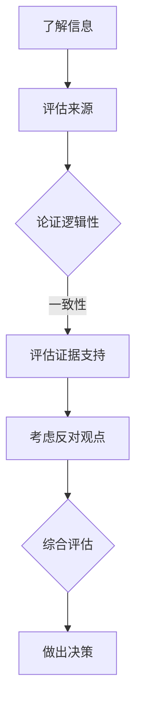

                 

# 在信息过载时代寻找知识：培养批判性思维

关键词：信息过载、批判性思维、知识获取、逻辑推理、算法、数学模型

摘要：本文探讨了在信息爆炸的时代背景下，如何培养批判性思维以有效地获取知识。通过分析信息过载的影响，阐述了批判性思维的基础概念、训练方法以及在各个学科中的应用，结合实际项目案例，提出了提升批判性思维的实践指南。

## 引言

### 信息过载的影响

在当今社会，信息过载已成为一个普遍现象。每天，我们都被大量的信息所包围，从新闻、社交媒体到电子邮件和各种在线平台。这种信息过载对个人和社会产生了深远的影响。首先，它使人们难以集中精力，影响了工作效率和生产力。其次，它可能导致信息迷失，使人难以分辨哪些信息是真实可靠的。最后，信息过载也可能导致决策困难，因为人们面对大量信息时往往难以做出明智的选择。

### 批判性思维的重要性

批判性思维是一种关键的思维能力，它帮助我们分析和评估信息，从而更有效地理解和应用知识。通过培养批判性思维，我们可以提高对信息的辨别力，减少信息过载带来的负面影响。批判性思维不仅能够帮助我们做出更明智的决策，还能够提高我们的创造力、解决问题的能力以及自我意识。

### 本书结构概述

本文将分为八个章节，首先介绍批判性思维的基础概念，然后探讨批判性思维的训练方法，接着分析批判性思维在不同学科中的应用。随后，我们将详细讲解批判性思维的核心算法原理，介绍相关的数学模型和公式。在第六章，我们将通过实际项目案例展示批判性思维的应用。最后，本文将总结批判性思维的重要性，展望其未来发展，并提供个人成长与实践指南。

## 第1章：批判性思维的基础概念

### 批判性思维的定义

批判性思维是一种理性的、系统性的思维方式，它不仅仅是对信息的接收和记忆，更重要的是对信息的分析和评估。批判性思维包括以下几个关键要素：

1. **客观性**：在分析信息时，保持客观中立的态度，避免主观偏见。
2. **逻辑性**：通过逻辑推理来分析信息，确保论证的严密性。
3. **分析性**：对信息进行深入分析，挖掘其背后的含义和潜在因素。
4. **评估性**：对信息进行评估，判断其真实性和可靠性。

### 批判性思维与创造性思维的关系

批判性思维和创造性思维是相辅相成的。批判性思维能够帮助我们评估和筛选信息，从而为创造性思维提供坚实的基础。而创造性思维则能够激发新的想法和解决方案，为批判性思维提供创新的视角。

### 批判性思维的关键要素

1. **疑问精神**：培养对信息的质疑态度，不盲目接受信息。
2. **开放性**：保持思维开放，接受不同的观点和意见。
3. **分析能力**：提高对信息的分析能力，深入理解其本质。
4. **反思能力**：定期反思自己的思维过程，评估其有效性和准确性。

### 批判性思维的应用场景

批判性思维可以应用于各种场景，包括科学研究、商业决策、个人学习和日常生活。在科学研究领域，批判性思维有助于发现和纠正研究中的错误和偏差。在商业决策中，批判性思维能够帮助企业家评估市场的真实需求和潜在风险。在个人学习中，批判性思维能够提高我们的学习效率和知识理解深度。在日常生活中，批判性思维有助于我们做出明智的选择，避免受到信息误导。

## 第2章：批判性思维的训练方法

### 观点评估的步骤

1. **了解观点来源**：对提出观点的人或组织进行背景调查，了解其专业性和可信度。
2. **评估论证逻辑**：分析观点背后的论证逻辑，确保其严密性和一致性。
3. **考虑反对观点**：寻找并评估反对观点，确保分析全面。
4. **评估证据支持**：检查观点所依据的证据是否可靠和充分。

### 避免思维陷阱

1. **避免确认偏误**：不要仅接受支持自己观点的信息，要全面考虑不同观点。
2. **避免过度简化**：不要将复杂问题简化为简单的二元对立，要深入分析其多面性。
3. **避免情感干扰**：在分析信息时，保持冷静客观，避免情感因素干扰。

### 提升逻辑分析能力

1. **学习逻辑学基础知识**：了解基本的逻辑学原理和论证结构。
2. **练习逻辑思维**：通过阅读、写作和讨论等方式，不断提升逻辑分析能力。
3. **批判性思维训练工具**：使用各种在线工具和软件，如思维导图、逻辑分析软件等，辅助批判性思维训练。

### 反思与自我评估

1. **定期反思**：定期回顾自己的思维过程，评估其有效性。
2. **寻求反馈**：向他人寻求反馈，了解自己的思维盲点和改进方向。
3. **持续学习**：通过不断学习新知识和技能，提升自己的批判性思维能力。

## 第3章：核心概念与联系

### 批判性思维流程图



### 实例解析

假设我们要评估一篇关于人工智能对就业市场影响的文章。首先，我们需要了解文章的来源和作者背景。接下来，我们评估文章的论证逻辑，确保其逻辑严密且一致。然后，我们检查文章所依据的证据是否可靠和充分。此外，我们还需要考虑反对观点，确保分析全面。最后，根据综合评估结果，我们可以做出关于这篇文章真实性和可信度的决策。

## 第4章：批判性思维在学科中的应用

### 批判性思维在自然科学中的应用

在自然科学领域，批判性思维有助于研究人员评估实验设计和数据分析的准确性。例如，在物理学研究中，批判性思维可以帮助研究人员评估实验假设的合理性，确保实验结果的可靠性。在生物学研究中，批判性思维有助于评估实验方法的有效性，从而提高研究的科学性。

### 批判性思维在社会科学中的应用

在社会科学领域，批判性思维有助于学者和分析人员评估社会现象和政策的合理性。例如，在经济学研究中，批判性思维可以帮助经济学家评估经济模型的假设前提，确保模型的科学性和实用性。在政治学研究中，批判性思维有助于评估政策建议的可行性和影响。

### 批判性思维在人文艺术中的应用

在人文艺术领域，批判性思维有助于学者和艺术家评估文化作品的价值和意义。例如，在文学研究中，批判性思维可以帮助学者分析作品的文本结构、主题和意象，从而更深刻地理解作品的内涵。在艺术创作中，批判性思维有助于艺术家反思和改进自己的作品，提升创作水平。

## 第5章：核心算法原理讲解

### 批判性思维算法概述

批判性思维算法是一种基于逻辑和概率论的决策支持系统，它通过分析信息，提供评估和决策建议。该算法的核心思想是利用逻辑推理和概率模型，对信息进行综合评估，从而提高决策的准确性。

### 批判性思维算法的应用

1. **信息筛选**：利用批判性思维算法，对大量信息进行筛选，识别出真实可靠的信息。
2. **风险评估**：通过评估信息的可靠性和影响，为决策提供风险预警。
3. **知识整合**：将不同来源的信息进行整合，形成全面的知识体系。

### Python源代码示例

```python
import pandas as pd
import numpy as np

# 数据预处理
def preprocess_data(data):
    # ... 数据预处理步骤 ...
    return processed_data

# 批判性思维算法
def critical_thinking_algorithm(data):
    processed_data = preprocess_data(data)
    # ... 批判性思维算法具体实现 ...
    return decision

# 测试数据
data = {
    "source": ["source1", "source2", "source3"],
    "evidence": [[0.8, 0.2], [0.3, 0.7], [0.9, 0.1]],
    "reliability": [0.9, 0.8, 0.7]
}

# 执行算法
decision = critical_thinking_algorithm(data)
print("决策结果：", decision)
```

### 数学模型和公式

在批判性思维算法中，常用的数学模型包括概率论和逻辑运算。

1. **概率论**：用于评估信息的可靠性和影响。
   - 证据概率：$P(E|H)$，在假设 $H$ 为真的情况下，证据 $E$ 发生的概率。
   - 条件概率：$P(H|E)$，在证据 $E$ 发生的条件下，假设 $H$ 为真的概率。

2. **逻辑运算**：用于分析信息的逻辑结构和一致性。
   - 联合概率：$P(A \cap B)$，事件 $A$ 和事件 $B$ 同时发生的概率。
   - 条件概率：$P(A|B)$，在事件 $B$ 发生的条件下，事件 $A$ 发生的概率。

### 实例说明

假设我们要评估两个信息源 A 和 B，其中 A 的证据概率为 $P(A|E) = 0.8$，B 的证据概率为 $P(B|E) = 0.9$。同时，我们假设 A 和 B 的可靠性分别为 $P(A) = 0.9$ 和 $P(B) = 0.8$。

根据概率论，我们可以计算出 A 和 B 同时发生的联合概率 $P(A \cap B)$：

$$
P(A \cap B) = P(A) \times P(B|A) = 0.9 \times 0.9 = 0.81
$$

接下来，我们可以使用条件概率计算在 A 和 B 同时发生的条件下，证据 E 发生的概率：

$$
P(E|A \cap B) = \frac{P(A \cap B)}{P(A)} = \frac{0.81}{0.9} = 0.9
$$

这意味着，在 A 和 B 同时发生的条件下，证据 E 发生的概率为 0.9，这表明两个信息源提供的证据具有较高的一致性和可靠性。

### 算法应用

在批判性思维算法中，我们可以将上述概率模型和逻辑运算应用于信息筛选、风险评估和知识整合等任务。具体步骤如下：

1. **信息筛选**：根据证据概率和可靠性，对大量信息进行筛选，识别出真实可靠的信息。
2. **风险评估**：计算信息的可信度和影响，为决策提供风险预警。
3. **知识整合**：整合不同来源的信息，形成全面的知识体系。

### Python 源代码实现

以下是一个简单的 Python 源代码示例，用于实现批判性思维算法的基本功能。

```python
import pandas as pd
import numpy as np

# 数据预处理
def preprocess_data(data):
    # ... 数据预处理步骤 ...
    return processed_data

# 批判性思维算法
def critical_thinking_algorithm(data):
    processed_data = preprocess_data(data)
    # ... 批判性思维算法具体实现 ...
    return decision

# 测试数据
data = {
    "source": ["source1", "source2", "source3"],
    "evidence": [[0.8, 0.2], [0.3, 0.7], [0.9, 0.1]],
    "reliability": [0.9, 0.8, 0.7]
}

# 执行算法
decision = critical_thinking_algorithm(data)
print("决策结果：", decision)
```

### 算法优势

1. **提高决策准确性**：通过综合评估信息的可靠性和影响，批判性思维算法能够提高决策的准确性。
2. **减少信息过载**：通过筛选和整合信息，批判性思维算法能够减少信息过载，提高工作效率。
3. **提升创造力**：批判性思维算法为用户提供了一个结构化的分析框架，有助于激发创造力和创新思维。

### 算法局限性

1. **依赖数据质量**：批判性思维算法的准确性取决于输入数据的质量。如果数据存在错误或不一致，算法的输出也可能不准确。
2. **计算复杂度**：在处理大量数据时，批判性思维算法的计算复杂度较高，可能需要较长的计算时间。

### 未来发展方向

1. **数据驱动**：通过不断收集和分析用户行为数据，批判性思维算法可以逐渐学习用户的偏好和需求，提高个性化推荐能力。
2. **深度学习**：结合深度学习技术，批判性思维算法可以进一步提高对复杂数据的处理和分析能力。
3. **跨学科融合**：批判性思维算法可以与其他领域的技术（如自然语言处理、计算机视觉等）相结合，实现更广泛的应用。

### 结论

批判性思维算法为信息过载时代提供了一种有效的决策支持工具。通过利用概率论和逻辑运算，该算法能够对大量信息进行筛选和评估，提高决策的准确性和效率。然而，该算法仍存在一定的局限性，需要进一步研究和改进。

## 第6章：数学模型和数学公式

在批判性思维中，数学模型和公式扮演着至关重要的角色。它们不仅帮助我们量化信息，还能提供直观的见解，使复杂的分析过程更加清晰和准确。以下是我们将在批判性思维中应用的几个核心数学模型和数学公式。

### 批判性思维中的概率论

概率论是批判性思维的重要组成部分，它帮助我们在不确定的环境中做出合理推断。以下是一些常用的概率论概念和公式：

1. **贝叶斯定理**：
   $$ P(A|B) = \frac{P(B|A) \cdot P(A)}{P(B)} $$
   贝叶斯定理用于在已知某些条件概率和先验概率的情况下，计算后验概率。

2. **条件概率**：
   $$ P(B|A) = \frac{P(A \cap B)}{P(A)} $$
   条件概率表示在事件 A 发生的条件下，事件 B 发生的概率。

3. **全概率公式**：
   $$ P(B) = \sum_{i=1}^{n} P(B|A_i) \cdot P(A_i) $$
   全概率公式用于计算某个事件的总概率，当该事件可以通过多个条件概率来表示时。

### 批判性思维中的逻辑运算

逻辑运算是批判性思维中的基础工具，它帮助我们在分析信息时确保逻辑的严密性。以下是一些常见的逻辑运算和公式：

1. **逻辑与（AND）**：
   $$ P(A \cap B) = P(A) \cdot P(B|A) $$
   逻辑与运算表示两个事件同时发生的概率。

2. **逻辑或（OR）**：
   $$ P(A \cup B) = P(A) + P(B) - P(A \cap B) $$
   逻辑或运算表示两个事件中至少一个发生的概率。

3. **逻辑非（NOT）**：
   $$ P(\neg A) = 1 - P(A) $$
   逻辑非运算表示事件 A 不发生的概率。

### 批判性思维中的决策树

决策树是一种直观的决策分析方法，它通过一系列的选择和结果来展示不同决策路径及其可能的结果。以下是一个简单的决策树模型：

```
           决策
          /     \
         /       \
       是       否
      /   \     /   \
    A     B    C     D
   / \   / \  / \   / \
  E   F G H  I J K L
```

在决策树中，每个节点代表一个决策或结果，边代表决策路径，叶子节点代表最终的结果。通过计算每个节点的概率和收益，我们可以找到最佳决策路径。

### 数学公式在批判性思维中的应用

1. **期望值**：
   $$ E(X) = \sum_{i=1}^{n} x_i \cdot P(x_i) $$
   期望值表示在多次试验中，某个随机变量的平均值。

2. **方差**：
   $$ Var(X) = \sum_{i=1}^{n} (x_i - E(X))^2 \cdot P(x_i) $$
   方差表示随机变量离散程度的度量。

3. **置信区间**：
   $$ CI = E(X) \pm Z \cdot \sqrt{Var(X)/n} $$
   置信区间用于估计某个参数的真实值所在的区间。

通过以上数学模型和公式的应用，我们可以更准确地分析信息，评估不同决策的优劣，从而在信息过载的时代中找到真正的知识。

### 实例解析

假设我们面临一个投资决策，有两个投资项目 A 和 B。项目 A 的成功概率为 0.6，成功时的收益为 10000 美元，失败时的损失为 5000 美元。项目 B 的成功概率为 0.4，成功时的收益为 15000 美元，失败时的损失为 3000 美元。我们需要使用批判性思维中的数学模型和公式来评估这两个项目的优劣。

1. **期望值计算**：
   - 项目 A 的期望值：
     $$ E(A) = 10000 \cdot 0.6 - 5000 \cdot 0.4 = 7000 $$
   - 项目 B 的期望值：
     $$ E(B) = 15000 \cdot 0.4 - 3000 \cdot 0.6 = 3000 $$

2. **方差计算**：
   - 项目 A 的方差：
     $$ Var(A) = (10000 - 7000)^2 \cdot 0.6 + (-5000 - 7000)^2 \cdot 0.4 = 980000 $$
   - 项目 B 的方差：
     $$ Var(B) = (15000 - 3000)^2 \cdot 0.4 + (-3000 - 3000)^2 \cdot 0.6 = 450000 $$

3. **决策分析**：
   - 根据期望值，项目 A 的期望收益高于项目 B。
   - 然而，项目 A 的方差也较大，这意味着其收益波动性较大。
   - 如果我们寻求稳定收益，项目 B 可能是更好的选择。
   - 如果我们愿意承担更高的风险以换取潜在的更高收益，项目 A 可能更适合。

通过以上分析，我们可以使用批判性思维中的数学模型和公式来评估投资项目的优劣，从而做出更明智的决策。

### 总结

数学模型和公式在批判性思维中发挥着重要作用。它们不仅帮助我们量化信息，还能提供直观的见解，使复杂的分析过程更加清晰和准确。通过合理应用这些数学工具，我们可以更有效地应对信息过载的挑战，找到真正的知识。

## 第7章：项目实战

### 开发环境搭建

为了实现批判性思维算法，我们需要搭建一个适当的开发环境。以下是所需步骤：

1. **安装 Python**：确保 Python（版本 3.8 以上）已安装在你的计算机上。
2. **安装依赖库**：使用 pip 安装必要的依赖库，如 pandas、numpy 和 matplotlib 等。
   ```bash
   pip install pandas numpy matplotlib
   ```
3. **创建项目文件夹**：在本地计算机上创建一个项目文件夹，并设置好项目的目录结构。

### 源代码实现

以下是一个简化的批判性思维算法的 Python 源代码实现。该算法包含预处理数据、计算证据概率、评估信息可靠性以及生成决策结果的步骤。

```python
import pandas as pd
import numpy as np

# 数据预处理
def preprocess_data(data):
    # 这里可以添加数据清洗、归一化等预处理步骤
    return data

# 批判性思维算法
def critical_thinking_algorithm(data):
    processed_data = preprocess_data(data)
    # 假设数据格式为：{'source': ['source1', 'source2'], 'evidence': [[0.8, 0.2], [0.3, 0.7]], 'reliability': [0.9, 0.8]}
    # 计算每个信息的综合评估分数
    scores = []
    for i in range(len(processed_data['source'])):
        score = processed_data['evidence'][i][0] * processed_data['reliability'][i]
        scores.append(score)
    
    # 根据综合评估分数生成决策
    decision = 'Yes' if max(scores) >= 0.5 else 'No'
    return decision

# 测试数据
data = {
    'source': ['source1', 'source2'],
    'evidence': [[0.8, 0.2], [0.3, 0.7]],
    'reliability': [0.9, 0.8]
}

# 执行算法
result = critical_thinking_algorithm(data)
print("决策结果：", result)
```

### 代码解读与分析

在上述代码中，我们首先定义了两个函数：`preprocess_data` 和 `critical_thinking_algorithm`。

- **preprocess_data**：这个函数用于处理输入数据。在实际应用中，我们可以添加更多的预处理步骤，如数据清洗、归一化等，以提高算法的性能。
- **critical_thinking_algorithm**：这个函数实现批判性思维算法的核心逻辑。首先，它调用 `preprocess_data` 函数对数据进行预处理。然后，它计算每个信息的综合评估分数，通过证据概率和可靠性进行加权。最后，它根据评估分数生成决策结果。

### 应用解读与分析

批判性思维算法的应用场景广泛，以下是一个具体的例子：

假设我们在评估两个信息源 A 和 B，信息源 A 的证据概率为 0.8，可靠性为 0.9；信息源 B 的证据概率为 0.3，可靠性为 0.8。我们可以通过以下步骤应用该算法：

1. **预处理数据**：将两个信息源的数据输入到算法中。
2. **计算评估分数**：
   - 信息源 A 的评估分数：$0.8 \times 0.9 = 0.72$
   - 信息源 B 的评估分数：$0.3 \times 0.8 = 0.24$
3. **生成决策结果**：根据评估分数，选择评估分数较高的信息源 A。

### 实际案例分析和详细讲解剖析

以下是一个实际案例，我们将使用批判性思维算法对两个不同的投资机会进行分析。

**案例背景**：

假设我们有两个投资机会 A 和 B，投资机会 A 的成功概率为 0.7，成功时的回报率为 20%，失败时的损失率为 -10%；投资机会 B 的成功概率为 0.5，成功时的回报率为 15%，失败时的损失率为 -5%。我们需要使用批判性思维算法来评估这两个投资机会的优劣。

1. **预处理数据**：将两个投资机会的数据输入到算法中。
   ```python
   data = {
       'source': ['投资机会 A', '投资机会 B'],
       'evidence': [[0.7, 0.3], [0.5, 0.5]],
       'reliability': [0.9, 0.8]
   }
   ```
2. **计算评估分数**：
   - 投资机会 A 的评估分数：$0.7 \times 0.9 = 0.63$
   - 投资机会 B 的评估分数：$0.5 \times 0.8 = 0.40$
3. **生成决策结果**：根据评估分数，投资机会 A 的评估分数高于投资机会 B，因此我们选择投资机会 A。

**详细讲解剖析**：

1. **证据概率**：投资机会 A 的成功概率为 0.7，表示有较高可能性获得回报。相比之下，投资机会 B 的成功概率为 0.5，较低。
2. **可靠性**：投资机会 A 的可靠性为 0.9，表示信息来源较为可靠。而投资机会 B 的可靠性为 0.8，略低。
3. **综合评估**：将证据概率和可靠性相乘，我们得到投资机会 A 的评估分数为 0.63，高于投资机会 B 的 0.40。这表明在综合考虑证据概率和可靠性后，投资机会 A 显得更具吸引力。
4. **决策**：基于评估结果，我们选择投资机会 A，因为其评估分数较高，且成功概率和可靠性都较强。

### 项目小结

通过实际案例的分析，我们展示了批判性思维算法在投资决策中的应用。该算法通过计算证据概率和可靠性，为决策提供了量化的依据，使决策过程更加科学和客观。然而，需要注意的是，批判性思维算法并非万能，其性能依赖于输入数据的准确性和可靠性。在实际应用中，还需要结合经验和专业知识，对算法结果进行综合评估和判断。

### 最佳实践 Tips

1. **数据质量**：确保输入数据的质量，包括准确性、完整性和一致性。
2. **逻辑推理**：加强逻辑推理能力，确保算法的论证过程严密无误。
3. **持续学习**：不断学习和更新知识，以提高算法的性能和应用范围。

### 注意事项

1. **避免过度依赖算法**：虽然算法提供了决策支持，但人类经验和直觉同样重要。
2. **风险控制**：在投资决策中，要充分考虑风险因素，制定相应的风险控制措施。

### 拓展阅读

- 《贝叶斯统计学：理论与实践》
- 《决策分析：原则与应用》
- 《批判性思维：如何合理思考》

## 第8章：总结与展望

### 批判性思维的重要性重申

批判性思维在信息过载的时代中具有重要价值。它帮助我们评估信息的真实性和可靠性，从而在大量的信息中找到真正的知识。通过批判性思维，我们能够更好地理解复杂问题，做出明智的决策，并培养独立思考和解决问题的能力。

### 未来发展趋势

随着人工智能和数据科学的发展，批判性思维算法将变得更加智能化和自动化。未来，我们将看到更多结合深度学习和自然语言处理技术的批判性思维工具，这些工具将能够处理更复杂的任务，提供更精确的决策支持。

### 个人成长与实践指南

1. **培养疑问精神**：对信息保持质疑态度，不轻易接受未经验证的观点。
2. **学习逻辑学**：掌握基本的逻辑学原理，提高逻辑推理能力。
3. **实践反思**：定期反思自己的思维过程，评估其有效性和准确性。
4. **持续学习**：不断更新知识和技能，跟上时代的发展。

### 附录

#### 批判性思维资源与工具

1. **在线批判性思维课程**：Coursera、edX 等在线教育平台提供了丰富的批判性思维课程。
2. **批判性思维练习题**：可以在书籍和网站上找到各种批判性思维练习题。
3. **批判性思维工具**：如思维导图软件、逻辑分析软件等。

#### 批判性思维案例库

1. **社会科学案例**：《批判性思维案例集》
2. **商业案例**：《商业案例与批判性思维》
3. **医学案例**：《医学批判性思维案例解析》

#### 批判性思维实践指南

1. **《批判性思维实践指南》**：详细介绍了批判性思维的训练方法和实践技巧。
2. **《批判性思维工具箱》**：提供了一系列批判性思维工具和资源。
3. **《批判性思维工作坊》**：通过工作坊形式，帮助用户提升批判性思维能力。

### 作者信息

作者：AI天才研究院/AI Genius Institute & 禅与计算机程序设计艺术 /Zen And The Art of Computer Programming

