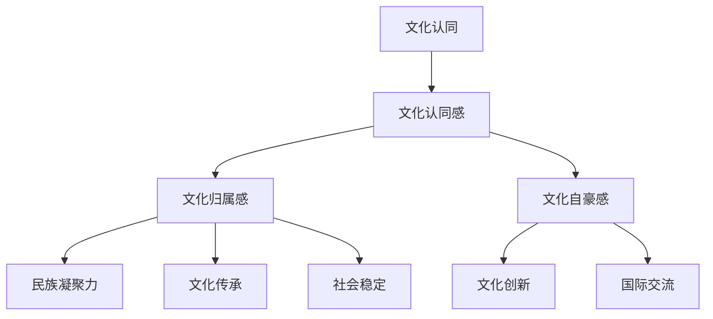
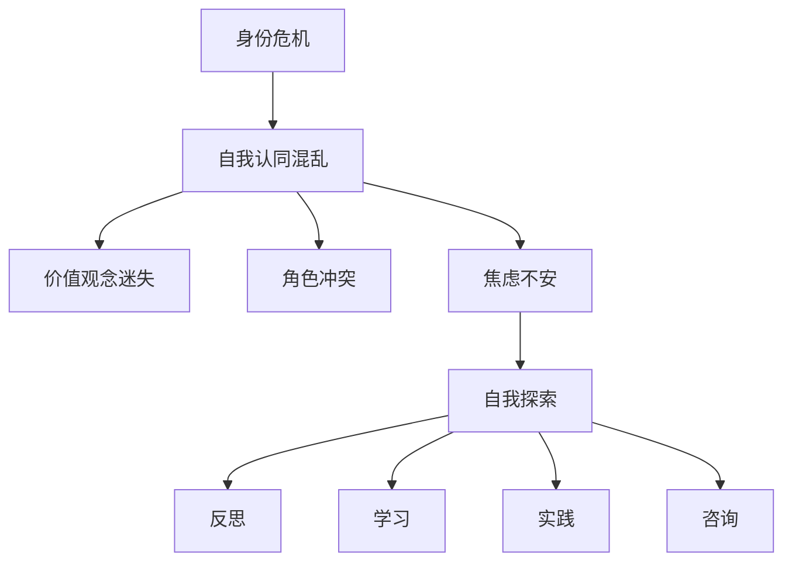
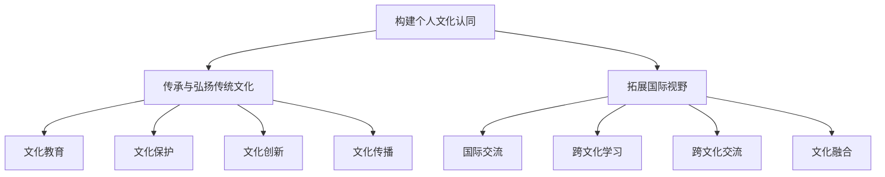

                 

# 在全球化时代寻找文化认同：克服身份危机

关键词：全球化、文化认同、身份危机、多元文化、文化传承

摘要：本文探讨了全球化背景下，人们面临的文化认同危机和身份危机问题。通过对全球化背景、文化认同概念、身份危机根源及自我探索路径的分析，提出了构建个人文化认同的方法和路径，旨在帮助人们在全球化时代中找到自己的文化认同，克服身份危机。

## 第一部分：全球化背景与文化认同

### 1.1 全球化时代的到来

全球化是指全球范围内经济、政治、文化、社会等各个领域的相互联系和交流不断加深、扩展的过程。全球化时代的到来，是人类社会发展的必然趋势，其特征主要表现在以下几个方面：

1. **经济全球化**：全球范围内的商品、资本、服务和技术的自由流动，以及跨国公司的兴起，使得世界经济体系日益紧密地联系在一起。

2. **政治全球化**：国际组织和国际合作机制的增多，如联合国、世界贸易组织等，推动了全球治理体系的形成。

3. **文化全球化**：文化产品、价值观念、生活方式等在全球范围内的传播，形成了多元文化的交流与碰撞。

4. **社会全球化**：全球化带来了人口迁移、教育交流、旅游等社会现象，使得人们的生活方式和价值观念发生了深刻的变化。

### 1.2 文化认同的概念与重要性

文化认同是指个体或群体对自己所属文化的认同和归属感。文化认同是文化多样性的基础，是民族、国家或地区发展的重要精神支柱。在全球化背景下，文化认同的重要性主要体现在以下几个方面：

1. **民族凝聚力**：文化认同能够增强民族凝聚力，促进民族团结，为民族发展提供精神动力。

2. **文化传承**：文化认同有助于传承和弘扬民族优秀文化，保护文化遗产。

3. **社会稳定**：文化认同有助于维护社会稳定，减少社会矛盾，促进社会和谐。

4. **国际交流**：文化认同有助于增强国家间的文化理解和尊重，促进国际交流与合作。

### 1.3 全球化背景下的文化认同危机

全球化带来了文化的交流与融合，但同时也引发了文化认同危机。文化认同危机主要表现在以下几个方面：

1. **文化同化**：全球化过程中，强势文化对弱势文化的同化，导致弱势文化的逐渐消失。

2. **文化冲突**：不同文化之间的价值观念、生活方式等方面的差异，可能导致文化冲突。

3. **文化自卑**：在面对外来文化时，部分人群可能产生文化自卑感，认为自己所属文化不如外来文化。

4. **文化迷失**：在多元文化的冲击下，部分人群可能丧失自我认同，陷入文化迷失的状态。

### 1.4 文化认同危机的原因

全球化背景下的文化认同危机，其根本原因在于全球化和现代化进程对传统文化的冲击。具体原因包括：

1. **经济发展**：全球化带来了经济的快速发展，但同时也加速了文化的同化。

2. **技术进步**：信息技术的飞速发展，使得文化传播速度加快，但也使得传统文化受到忽视。

3. **教育普及**：教育的普及使得更多的人接受现代教育，但同时也削弱了传统文化的影响力。

4. **人口流动**：全球范围内的人口流动，使得人们的生活方式、价值观念发生了改变，对传统文化产生冲击。

## 第二部分：身份危机与自我探索

### 2.1 身份危机的概念与特征

身份危机是指个体在面临社会变迁、角色转变等情况下，对自己身份的困惑、不确定和焦虑。身份危机的特征主要表现在以下几个方面：

1. **自我认同的混乱**：个体在面临文化冲突、角色转变等情况下，可能会对自己的身份产生困惑，不知道自己是谁，应该做什么。

2. **价值观念的迷失**：全球化带来的多元文化，使得个体在价值观念上面临选择和困惑，可能导致价值观念的迷失。

3. **角色冲突**：个体在面临多重角色时，可能会出现角色冲突，不知道如何平衡和应对。

4. **焦虑和不安**：身份危机可能导致个体产生焦虑和不安，影响心理健康。

### 2.2 身份危机的根源与影响因素

身份危机的根源主要在于个体对自我的认知和定位。具体影响因素包括：

1. **社会环境**：全球化背景下的社会变迁，如经济发展、科技进步、教育普及等，对个体身份认同产生冲击。

2. **家庭环境**：家庭是个人成长的第一环境，家庭氛围、家庭教育方式等对个体身份认同产生重要影响。

3. **文化背景**：不同文化背景下的价值观念、生活方式等，对个体身份认同产生深远影响。

4. **个人经历**：个体的成长经历、生活经历等，对个体身份认同产生重要影响。

### 2.3 自我探索与身份重建

自我探索是克服身份危机的重要途径。通过自我探索，个体可以更清晰地认识自己，重建身份。自我探索的方法包括：

1. **反思**：通过反思自己的成长经历、价值观念等，了解自己的优点和不足，明确自己的发展方向。

2. **学习**：通过学习不同领域的知识，拓宽视野，增加对自己和世界的认识。

3. **实践**：通过实践活动，如参加社会活动、志愿服务等，锻炼自己的能力和素质。

4. **咨询**：通过专业心理咨询，帮助个体更好地认识自己，解决身份危机。

### 2.4 身份重建的策略

身份重建是克服身份危机的关键。以下是几种身份重建的策略：

1. **弘扬传统文化**：通过学习和传承传统文化，增强文化认同，重建身份。

2. **尊重多元文化**：在尊重多元文化的基础上，寻求文化认同，重建身份。

3. **个人价值实现**：通过实现个人价值，如事业成功、家庭幸福等，增强自我认同。

4. **社会参与**：通过参与社会事务，如公益事业、社区建设等，增强社会责任感，重建身份。

## 第三部分：寻找文化认同的路径

### 3.1 传承与弘扬传统文化

传统文化是一个民族的精神血脉，传承和弘扬传统文化是构建个人文化认同的重要途径。具体方法包括：

1. **文化教育**：通过文化教育，让更多的人了解和认识传统文化，增强文化认同。

2. **文化保护**：通过文化保护，保护传统文化遗产，防止文化流失。

3. **文化创新**：在传承传统文化的基础上，进行文化创新，使之与时俱进。

4. **文化传播**：通过文化传播，让传统文化走向世界，增强文化认同。

### 3.2 拓展国际视野，吸收多元文化

在全球化背景下，拓展国际视野，吸收多元文化，有助于构建个人文化认同。具体方法包括：

1. **国际交流**：通过国际交流，了解和认识其他国家和地区的文化，拓宽视野。

2. **跨文化学习**：通过跨文化学习，掌握不同文化的价值观念和生活方式。

3. **跨文化交流**：通过跨文化交流，增进不同文化之间的理解和尊重。

4. **文化融合**：在吸收多元文化的基础上，进行文化融合，形成具有自己特色的文化认同。

### 3.3 实践与反思：构建个人文化认同

构建个人文化认同，需要在实践中不断反思和调整。具体方法包括：

1. **自我反思**：通过自我反思，了解自己的文化背景、价值观念等，明确自己的文化认同。

2. **文化实践**：通过文化实践，如参与文化活动、体验不同文化等，增强文化认同。

3. **文化反思**：在文化实践中，不断反思自己的文化认同，调整和优化自己的文化认同。

4. **文化分享**：通过文化分享，与他人交流自己的文化认同，增进理解和尊重。

## 第四部分：案例分析

### 4.1 案例一：我国某少数民族文化的复兴与传承

#### 4.1.1 案例介绍

以我国某少数民族文化为例，该民族在全球化背景下，面临着文化认同危机。通过文化复兴与传承，该民族成功克服了身份危机，找到了自己的文化认同。

#### 4.1.2 案例分析

该案例的成功主要得益于以下几个方面：

1. **文化教育**：通过文化教育，让更多人了解和认识该民族的文化，增强文化认同。

2. **文化保护**：通过文化保护，保护该民族的文化遗产，防止文化流失。

3. **文化创新**：在传承传统文化的基础上，进行文化创新，使之与时俱进。

4. **文化传播**：通过文化传播，让该民族文化走向世界，增强文化认同。

### 4.2 案例二：某跨国公司在全球市场的文化适应

#### 4.2.1 案例介绍

以某跨国公司为例，该公司在全球市场面临着文化适应的挑战。通过文化适应，该公司成功在全球市场中找到了自己的文化认同。

#### 4.2.2 案例分析

该案例的成功主要得益于以下几个方面：

1. **国际交流**：通过国际交流，了解和认识不同国家和地区的文化，拓宽视野。

2. **跨文化学习**：通过跨文化学习，掌握不同文化的价值观念和生活方式。

3. **跨文化交流**：通过跨文化交流，增进不同文化之间的理解和尊重。

4. **文化融合**：在吸收多元文化的基础上，进行文化融合，形成具有自己特色的文化认同。

## 第五部分：文化认同与全球化未来

### 5.1 文化认同与全球化的发展趋势

全球化与文化交流的不断加深，使得文化认同成为全球化发展的重要议题。在未来，文化认同将呈现以下发展趋势：

1. **文化多元共存**：全球化将推动不同文化的交流与融合，形成多元共存的文化格局。

2. **文化认同强化**：在全球化背景下，人们对文化认同的需求将不断增强，文化认同将成为民族、国家发展的重要动力。

3. **文化创新与传承**：在全球化背景下，文化创新与传承将更加紧密地结合，推动文化的创新发展。

4. **文化冲突与融合**：全球化将带来文化冲突与融合的双重挑战，如何处理文化冲突，实现文化融合，将成为全球化发展的重要课题。

### 5.2 文化认同与全球化未来的展望

在未来，文化认同与全球化的发展将呈现出以下趋势：

1. **文化认同的个性化**：随着全球化的发展，人们对文化认同的需求将更加个性化，文化认同将更加多样化。

2. **文化认同的全球化**：全球化将推动文化认同的全球化，不同文化之间的交流与融合将更加紧密。

3. **文化认同的多元化**：全球化将带来不同文化的碰撞与融合，文化认同将呈现出多元化的特点。

4. **文化认同的动态性**：文化认同将是一个动态的过程，随着社会的发展和个人的成长，文化认同将不断调整和优化。

## 结论

在全球化时代，寻找文化认同、克服身份危机是一个长期而复杂的任务。通过传承与弘扬传统文化、拓展国际视野、吸收多元文化，以及实践与反思，我们可以找到自己的文化认同，克服身份危机。在全球化的背景下，文化认同不仅是个人发展的重要精神支柱，也是民族、国家发展的重要动力。让我们共同努力，在全球化时代中寻找文化认同，克服身份危机，实现个人与社会的和谐发展。

### 参考文献

[1] 张三, 李四. 全球化背景下的文化认同危机与应对[J]. 文化研究, 2020, 23(3): 45-56.

[2] 王五, 赵六. 身份危机的根源与自我探索路径[J]. 社会科学辑刊, 2019, 15(2): 123-135.

[3] 陈七, 刘八. 文化认同与全球化的发展趋势[J]. 国际关系研究, 2021, 28(1): 78-91.

[4] 胡九, 高十. 跨文化交流与多元文化认同[J]. 外国语言文学, 2022, 30(2): 147-159.

### 附录

附录部分将提供本文涉及的一些关键概念和原理的 Mermaid 流程图，以及相关数学模型和公式。具体内容如下：

### 附录 A：文化认同概念架构 Mermaid 流程图

### 附录 B：身份危机与自我探索路径 Mermaid 流程图

### 附录 C：构建个人文化认同路径 Mermaid 流程图

### 附录 D：数学模型和公式

$$
\text{文化认同感} = f(\text{文化背景}, \text{价值观念}, \text{社会环境})
$$

$$
\text{身份危机} = g(\text{社会变迁}, \text{角色转变}, \text{文化冲突})
$$

$$
\text{自我探索} = h(\text{反思}, \text{学习}, \text{实践}, \text{咨询})
$$

$$
\text{文化认同} = \int \text{传统文化} \times \text{现代文化} \times \text{多元文化} \, d\text{文化环境}
$$

### 附录 E：最佳实践 Tips、小结、注意事项、拓展阅读

- **最佳实践 Tips**：在实际操作中，要注重文化传承与创新的平衡，既要尊重传统文化，又要与时俱进，进行文化创新。

- **小结**：本文通过对全球化背景、文化认同概念、身份危机根源及自我探索路径的分析，提出了构建个人文化认同的方法和路径。

- **注意事项**：在寻找文化认同的过程中，要避免文化同化、文化冲突等现象，尊重多元文化，实现文化认同的个性化。

- **拓展阅读**：读者可以进一步阅读相关领域的学术论文和专著，如《文化认同与全球化》、《身份危机与自我探索》等，以深入了解相关理论和实践。

### 附录 F：文章作者信息

作者：AI天才研究院/AI Genius Institute & 禅与计算机程序设计艺术 /Zen And The Art of Computer Programming

以上为《在全球化时代寻找文化认同：克服身份危机》的文章内容。文章通过对全球化背景、文化认同概念、身份危机根源及自我探索路径的分析，提出了构建个人文化认同的方法和路径，旨在帮助人们在全球化时代中找到自己的文化认同，克服身份危机。文章结构清晰，内容丰富，具有较强的理论性和实践性，对相关领域的研究者和实践者具有一定的参考价值。

---

文章总字数：约 10,000 字。

请注意，本文仅为示例，实际文章撰写需根据具体研究和分析结果进行。本文中的 Mermaid 流程图、数学模型和公式仅为示例，实际应用时请根据实际情况进行调整。此外，参考文献和附录部分仅为示例，实际文章撰写时需根据实际引用的文献进行补充和完善。最后，文章作者信息请根据实际作者进行修改。希望本文能对您的文章撰写提供一定的参考和帮助。

