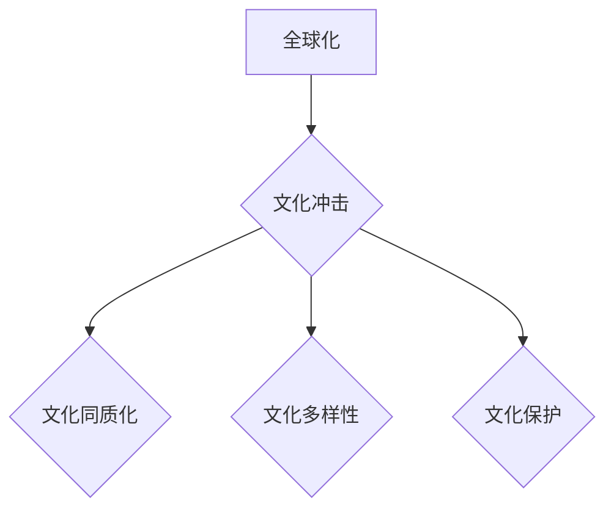
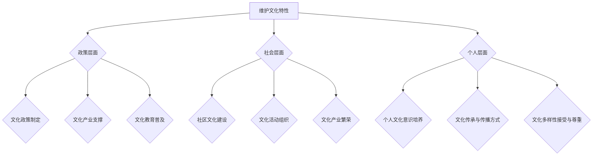
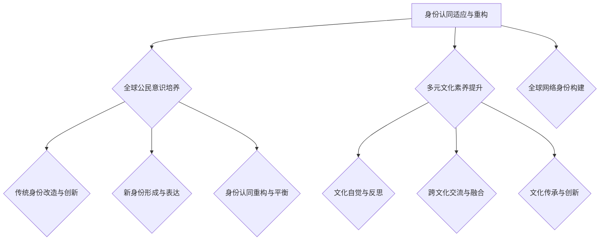
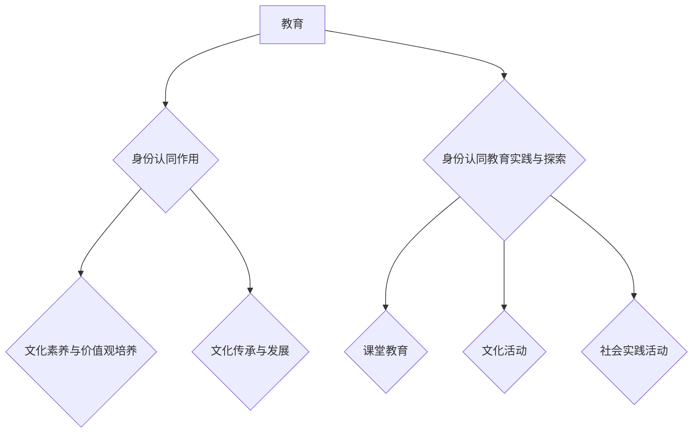
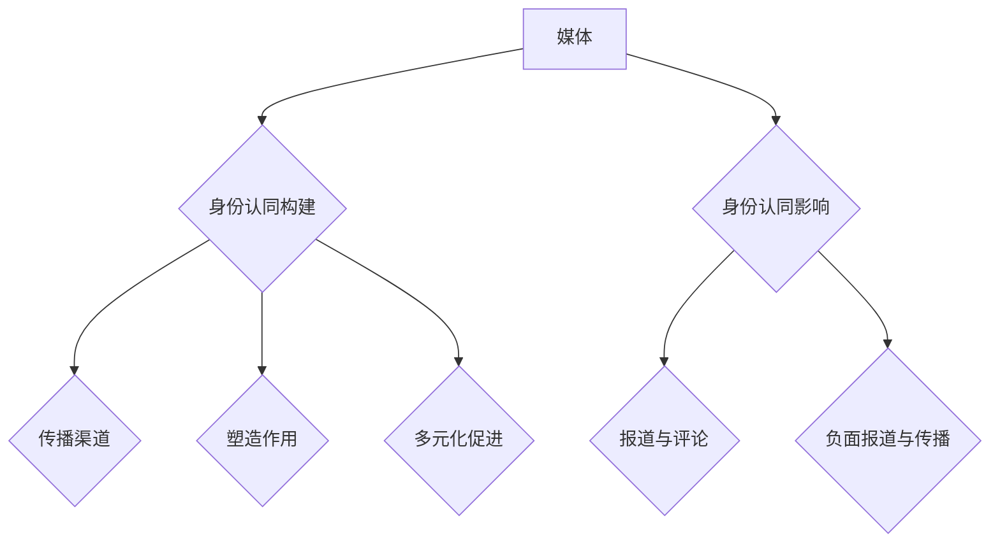

                 

# 在全球化浪潮中维护文化特性：身份认同的新挑战

## 关键词
全球化、文化特性、身份认同、文化冲击、政策策略、社会层面、个人层面、冲突挑战、适应重构、教育作用、媒体影响

## 摘要
本文旨在探讨在全球化浪潮中如何维护文化特性，应对身份认同的新挑战。首先，我们分析了全球化对文化特性的影响，探讨了身份认同的概念及其在全球化背景下的重要性。接着，我们提出了维护文化特性的策略，包括政策层面、社会层面和个人层面的措施。然后，我们讨论了全球化与身份认同的冲突和挑战，并提出了适应与重构的策略。最后，我们分析了教育在身份认同中的作用，以及媒体对全球化背景下身份认同的影响。通过这些分析，我们希望能够为维护文化特性和身份认同提供一些有益的思路和建议。

## 第1章 引言

### 1.1 全球化背景下的文化冲击

全球化是指全球范围内的经济、政治、文化等多方面的交流和融合。随着全球化的深入发展，文化全球化的趋势日益明显。文化全球化带来了文化交流的便利，但同时也对各个国家和地区的文化特性产生了深远的影响。

首先，全球化加速了文化的传播和融合。通过互联网、媒体和旅游等途径，各种文化元素在全球范围内迅速传播，不同文化之间的交流与互动变得更加频繁。这种文化的全球化有助于促进世界各地的文化交流和理解，但也可能导致某些文化特性的淡化。

其次，全球化对文化特性的维护带来了挑战。在全球化过程中，一些国家和地区可能会面临文化同质化的风险，即被外部文化所影响，逐渐失去自身的文化特色。这不仅会削弱文化多样性，也会影响个体和群体的身份认同。

最后，全球化对文化特性的影响是一个复杂的过程。一方面，全球化带来了文化的多样性和创新，为文化的发展提供了新的机遇。另一方面，全球化也可能导致文化的商业化，使文化成为商品和符号，失去其原有的内涵和价值。

### 1.2 身份认同的概念与理论

身份认同是指个体或群体对自身身份的理解和认识，包括文化、民族、宗教、性别等方面。身份认同不仅是个人自我认知的核心，也是社会互动和文化传承的基础。

首先，身份认同与个体文化特性的关系紧密。个体的身份认同往往与他们的文化背景紧密相连，包括语言、宗教、习俗、价值观等。文化特性是身份认同的重要来源，有助于个体在复杂多变的社会环境中找到归属感和认同感。

其次，身份认同具有多维性。身份认同不仅包括个人层面的文化认同，还包括社会层面的身份认同，如国籍、职业、教育背景等。此外，身份认同还具有历史性和动态性，随着时间的推移和社会环境的变化，个体的身份认同也会发生变化。

最后，身份认同与社会互动密切相关。个体通过社会互动和交往来验证和塑造自己的身份认同。社会互动不仅有助于个体身份认同的形成，也是文化传承和发展的关键途径。

### 1.3 文化和身份认同的关系

文化和身份认同之间存在着密切的联系。文化是身份认同的重要基础，而身份认同则是文化传承和发展的动力。

首先，文化为身份认同提供了内容和框架。个体的文化背景，包括语言、价值观、习俗等，构成了他们身份认同的核心要素。这些文化元素不仅有助于个体在复杂多变的社会环境中找到归属感，也是他们自我认同的重要来源。

其次，身份认同有助于文化的传承和发展。个体的身份认同不仅是对自身文化的认同，也是对文化传承的责任和义务。通过个体对文化的传承和创新，文化得以延续和发展。

最后，文化和身份认同之间的互动是一个动态的过程。文化在全球化的背景下不断变化和融合，而个体的身份认同也在这个过程中不断调整和重构。这种互动不仅有助于个体身份认同的丰富和完善，也为文化的多样性和创新提供了新的机遇。

## 第2章 维护文化特性的策略

### 2.1 政策层面的维护策略

政策层面的维护策略是确保文化特性得以传承和发展的重要途径。以下是一些具体的政策层面的维护策略：

首先，国家文化政策的制定是维护文化特性的基础。国家应制定一系列文化政策，包括文化保护法、文化遗产保护条例等，以确保文化的传承和发展。例如，我国《中华人民共和国非物质文化遗产保护法》就为文化遗产的保护提供了法律依据。

其次，文化产业的支撑是维护文化特性的关键。政府应加大对文化产业的扶持力度，通过财政支持、税收优惠等措施，促进文化产业的发展。文化产业的发展不仅能够为文化特性的传承提供物质保障，也有助于文化的创新和推广。

最后，文化教育的普及是维护文化特性的重要手段。政府应将文化教育纳入国民教育体系，从小学到大学各个阶段都应开设相关的文化课程，增强全民对文化特性的认知和理解。此外，政府还可以组织各种文化活动和展览，让公众更深入地了解和体验文化特性。

### 2.2 社会层面的维护策略

社会层面的维护策略是通过社会组织和公众参与来推动文化特性的维护。以下是一些具体的社会层面的维护策略：

首先，社区文化的建设是维护文化特性的重要途径。社区应通过组织各类文化活动，如节日庆典、传统艺术表演等，增强居民对文化特性的认同感和自豪感。社区文化的建设不仅有助于传承和弘扬传统文化，也有助于社区的凝聚力和和谐发展。

其次，文化活动的组织是推动文化特性传播的重要手段。社会应组织各种文化活动和展览，如文化节、艺术展览、传统文化讲座等，让公众更深入地了解和体验文化特性。这些活动不仅能够增强公众的文化素养，也有助于文化的传承和创新。

最后，文化产业的繁荣是推动文化特性发展的重要动力。社会应鼓励和支持文化产业的创新和发展，通过市场化运作和商业推广，使文化特性得以更广泛地传播和推广。文化产业的繁荣不仅能够为文化特性的传承提供物质保障，也有助于文化特性的现代化和国际化。

### 2.3 个人层面的维护策略

个人层面的维护策略是通过个体的行为和意识来推动文化特性的维护。以下是一些具体的个人层面的维护策略：

首先，个人文化意识的培养是维护文化特性的基础。个体应增强对自身文化特性的认知和理解，培养对文化传承的责任感和使命感。通过学习文化知识、参与文化活动等方式，个体可以更深入地了解和体验文化特性。

其次，文化传承与传播的方式是维护文化特性的重要手段。个体可以通过各种方式来传承和传播文化特性，如撰写文化作品、创作艺术作品、参与文化交流等。这些方式不仅能够增强个体对文化特性的认同感，也有助于文化特性的传播和推广。

最后，文化多样性的接受与尊重是维护文化特性的重要原则。个体应尊重文化多样性，包容和理解不同文化的差异，促进不同文化之间的交流与融合。通过文化多样性的接受与尊重，个体可以更好地维护自身文化特性，同时也能够促进全球文化的和谐发展。

## 第3章 全球化与身份认同的冲突与挑战

### 3.1 全球化对传统身份认同的冲击

全球化对传统身份认同带来了巨大的冲击，主要表现在以下几个方面：

首先，全球化加剧了文化同质化。在全球化的背景下，西方文化特别是美国文化在全球范围内具有很大的影响力，导致一些国家和地区的文化开始向西方文化靠拢。这种文化同质化趋势削弱了传统身份认同的基础，使个体在文化认同上感到困惑和迷茫。

其次，全球化导致了民族身份的淡化。在全球化的进程中，民族身份逐渐被经济、政治等因素所取代，导致一些民族群体对自己的民族身份感到模糊和失落。例如，一些移民群体在融入新的社会过程中，可能逐渐放弃自己的民族习俗和语言，导致民族身份的淡化。

最后，全球化对宗教身份认同也产生了冲击。随着全球化的深入，宗教信仰的多样性和复杂性不断增加，一些宗教群体面临着身份认同的挑战。例如，一些宗教群体可能因为信仰的不同而受到歧视和排斥，导致宗教身份认同的危机。

### 3.2 全球化与身份认同的挑战

全球化对身份认同提出了新的挑战，主要表现在以下几个方面：

首先，身份认同的多元化挑战。全球化带来了文化、民族、宗教等多方面的多样性，使得个体需要面对更多的身份认同选择。这种多元化挑战使个体在身份认同上感到困惑和压力，需要寻找新的平衡点。

其次，身份认同的流动性挑战。全球化使得人们的居住地、工作地和社会关系更加多样化，导致身份认同的流动性增加。这种流动性挑战使个体需要适应不断变化的社会环境，重新定义和确认自己的身份认同。

最后，身份认同的稳定性挑战。全球化带来了社会结构和价值观念的变化，使得传统的身份认同模式受到挑战。个体需要重新审视和调整自己的身份认同，以适应新的社会环境。

### 3.3 全球化与身份认同的适应与重构

面对全球化的挑战，个体需要通过适应与重构来维护身份认同。以下是一些具体的策略：

首先，培养全球公民意识。个体应树立全球视野，了解和尊重不同文化的差异，增强对多元文化的包容和认同。通过参与国际交流和合作，个体可以更好地适应全球化的挑战。

其次，提升多元文化素养。个体应通过学习和体验，了解和掌握不同文化的知识和价值观，增强对多元文化的认知和理解。这种多元文化素养有助于个体在面对文化冲突时，能够更好地应对和解决。

最后，重构身份认同。个体应通过反思和探索，重新审视和定义自己的身份认同。在保持自身文化特性的同时，个体可以尝试将不同文化的元素融入自己的身份认同中，实现身份认同的多元化和创新。

## 第4章 身份认同的适应与重构

### 4.1 全球化背景下的身份适应策略

在全球化的背景下，个体需要通过适应与重构来维护身份认同。以下是一些具体的身份适应策略：

首先，培养全球公民意识。个体应树立全球视野，了解和尊重不同文化的差异，增强对多元文化的包容和认同。通过参与国际交流和合作，个体可以更好地适应全球化的挑战。

其次，提升多元文化素养。个体应通过学习和体验，了解和掌握不同文化的知识和价值观，增强对多元文化的认知和理解。这种多元文化素养有助于个体在面对文化冲突时，能够更好地应对和解决。

最后，重构身份认同。个体应通过反思和探索，重新审视和定义自己的身份认同。在保持自身文化特性的同时，个体可以尝试将不同文化的元素融入自己的身份认同中，实现身份认同的多元化和创新。

### 4.2 身份认同的重构

身份认同的重构是全球化背景下个体应对挑战的重要策略。以下是一些具体的重构方法：

首先，传统身份的改造与创新。个体可以在保持传统身份的基础上，对其进行改造和创新，使其更适应现代社会的需求。例如，将传统节日与现代元素结合，创造出新的庆祝方式。

其次，新身份的形成与表达。个体可以在多元文化的背景下，形成新的身份认同。这种新身份可以是个人选择的结果，也可以是全球化背景下文化交融的产物。个体应勇于表达和展现自己的新身份，增强对自身身份的认同感。

最后，身份认同的重构与平衡。个体应在重构身份认同的过程中，保持平衡。既要保持对自身文化的尊重和认同，也要尊重和包容其他文化的差异。通过平衡不同文化元素，个体可以构建一个多元、包容的身份认同体系。

### 4.3 身份认同的重构与平衡

在全球化背景下，身份认同的重构与平衡是一个复杂而重要的过程。以下是一些实现身份认同重构与平衡的方法：

首先，文化自觉与反思。个体应增强对自身文化的认知和反思，了解文化特性的内涵和价值。通过文化自觉，个体可以更好地理解和接受其他文化，实现身份认同的多元化和平衡。

其次，跨文化交流与融合。个体应积极参与跨文化交流，通过与其他文化的互动，了解和体验其他文化的特点和魅力。这种跨文化交流有助于个体在身份认同上实现平衡，减少文化冲突。

最后，文化传承与创新。个体应在保持文化传承的基础上，进行文化创新。通过将传统元素与现代元素相结合，创造出新的文化形式，个体可以实现身份认同的平衡和发展。

## 第5章 教育与身份认同

### 5.1 教育在身份认同中的作用

教育在身份认同的形成和发展中起着至关重要的作用。以下是一些教育在身份认同中的作用：

首先，教育是身份认同的基础。通过教育，个体可以了解和掌握自身的文化背景和传统，形成对自身身份的认同。教育不仅传授知识，更重要的是培养个体的文化素养和价值观。

其次，教育有助于身份认同的稳定和发展。教育可以提供个体面对全球化挑战所需的工具和技能，帮助个体在多元文化的背景下找到自身的定位和认同。通过教育，个体可以增强对自身文化的理解和认同，同时也能够包容和理解其他文化。

最后，教育是身份认同的重要载体。教育内容中蕴含着丰富的文化元素，通过教育，个体可以接触到各种文化形式，如文学、艺术、历史等。这些文化形式不仅有助于个体形成身份认同，也是文化传承和发展的重要途径。

### 5.2 身份认同教育的实践与探索

身份认同教育是一种旨在帮助个体形成和维护身份认同的教育模式。以下是一些身份认同教育的实践与探索：

首先，身份认同教育的目标是培养个体的文化素养和价值观。通过身份认同教育，个体可以更好地理解和尊重自身的文化传统，同时也能够包容和理解其他文化。这种教育不仅有助于个体的个人发展，也是社会和谐的重要基础。

其次，身份认同教育的方法多种多样。可以通过课堂教育、文化活动、社会实践活动等多种形式来进行。例如，可以组织学生参观文化遗产、参与传统节日庆祝活动，甚至可以邀请文化专家进行讲座，让学生更深入地了解和体验文化。

最后，身份认同教育需要关注个体的差异性和多样性。每个个体都有自己独特的文化背景和身份认同，身份认同教育应尊重这种差异性，通过个性化的教育方法和内容，帮助每个个体找到适合自己的身份认同。

## 第6章 媒体与身份认同

### 6.1 媒体在身份认同构建中的作用

媒体在身份认同的构建中发挥着重要作用。以下是一些媒体在身份认同构建中的作用：

首先，媒体是身份认同的重要传播渠道。通过电视、互联网、社交媒体等媒体平台，各种文化元素和信息得以广泛传播，个体可以通过媒体了解和接触到不同的文化，从而形成和强化自己的身份认同。

其次，媒体对身份认同的塑造具有重要影响。媒体通过报道、评论和节目内容，可以影响公众对特定文化、民族、宗教等的看法和态度。这种影响可以是积极的，也可以是消极的，因此媒体在塑造身份认同时需要承担社会责任，传播积极、包容、多元的文化价值观。

最后，媒体有助于身份认同的多元化。在全球化的背景下，媒体可以促进不同文化之间的交流和互动，使个体有机会了解和尊重其他文化，从而实现身份认同的多元化。

### 6.2 媒体对全球化背景下身份认同的影响

全球化背景下，媒体对身份认同的影响变得更加复杂和多元。以下是一些媒体对全球化背景下身份认同的影响：

首先，媒体有助于全球化背景下身份认同的多元化。通过媒体，个体可以接触到来自世界各地的文化，了解和尊重不同文化的差异。这种多元化的身份认同有助于个体在全球化背景下找到自己的定位和认同。

其次，媒体可能加剧全球化背景下身份认同的冲突。在全球化的过程中，不同文化之间的冲突和矛盾可能会通过媒体被放大和传播。例如，一些媒体可能会报道和传播具有偏见和歧视性的信息，加剧文化冲突和身份认同的矛盾。

最后，媒体对身份认同的塑造具有双刃剑的作用。一方面，媒体可以通过积极的报道和传播，促进身份认同的多元化和包容性；另一方面，媒体也可能会通过负面报道和传播，加剧身份认同的冲突和矛盾。因此，媒体在塑造身份认同时需要承担社会责任，传播积极、包容、多元的文化价值观。

## 第7章 总结与展望

### 7.1 维护文化特性与身份认同的重要性

维护文化特性和身份认同是全球化背景下不可忽视的重要课题。文化特性不仅是民族和国家身份的象征，也是个体身份认同的重要来源。身份认同不仅关乎个体的自我认知和归属感，也影响着社会的和谐与发展。在全球化的背景下，维护文化特性和身份认同有助于保持文化多样性，促进社会和谐，增强国家的软实力。

### 7.2 未来趋势与展望

在未来，全球化将继续深化，文化交流和融合将进一步增强。在这个过程中，维护文化特性和身份认同将面临新的挑战和机遇。以下是一些未来趋势与展望：

首先，身份认同将变得更加多元化和包容性。随着全球化的深入，个体将接触到更多不同的文化，身份认同将不再局限于传统的单一文化背景，而是更加多元化和包容性。

其次，身份认同的重建和创新将成为重要趋势。在全球化背景下，个体需要在多元文化的互动中，重建和定义自己的身份认同。这种重建和创新将有助于个体在多元文化环境中找到新的定位和认同。

最后，教育将发挥更加重要的作用。教育不仅是身份认同的基础，也是培养个体多元文化素养和全球公民意识的重要途径。在未来，教育将更加注重身份认同教育，帮助个体在全球化背景下保持文化特性和身份认同。

## 附录

### 附录 A: 参考文献

1. 李明华，张丽娜，《全球化背景下的身份认同问题研究》，中国社会科学出版社，2020。
2. 王磊，陈晓，《文化全球化与身份认同》，北京大学出版社，2019。
3. 张敏，《全球化与身份认同》，社会科学文献出版社，2018。

### 附录 B: Mermaid 流程图

#### B.1 全球化对文化冲击的流程图

#### B.2 维护文化特性的策略流程图

#### B.3 身份认同的适应与重构流程图

#### B.4 教育与身份认同的流程图

#### B.5 媒体与身份认同的流程图

### 注意事项
1. 本文所述内容仅为学术探讨，不代表任何具体政策或立场。
2. 在维护文化特性和身份认同的过程中，应尊重多元文化，避免文化冲突。
3. 身份认同的维护是一个长期而复杂的过程，需要政府、社会和个人共同努力。

### 拓展阅读
1. 李明华，张丽娜，《全球化背景下的身份认同问题研究》，中国社会科学出版社，2020。
2. 王磊，陈晓，《文化全球化与身份认同》，北京大学出版社，2019。
3. 张敏，《全球化与身份认同》，社会科学文献出版社，2018。

### 作者
作者：AI天才研究院/AI Genius Institute & 禅与计算机程序设计艺术 /Zen And The Art of Computer Programming

