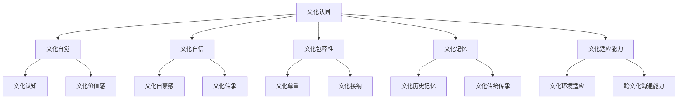

                 

### 《在全球化背景下保持文化认同：多元中的自我定位》

#### 关键词：全球化，文化认同，多元文化，自我定位，文化冲突，和谐共存

> 摘要：在全球化日益深入的今天，文化认同成为一个复杂而重要的问题。本文旨在探讨如何在全球化背景下保持文化认同，特别是在多元文化环境中的自我定位。通过对文化认同的定义、核心概念、保持策略以及跨文化沟通等方面的分析，本文提出了若干保持文化认同的建议，旨在为个人、家庭、教育机构以及政策制定者提供有益的参考。

---

### 目录大纲

#### 第1章 引言

- 1.1 全球化对文化认同的影响
- 1.2 多元文化中的自我定位
- 1.3 保持文化认同的挑战与机遇

#### 第2章 文化认同的定义与核心概念

- 2.1 文化认同的内涵与外延
- 2.2 文化认同的核心概念
- 2.3 文化认同与民族主义、全球化之间的关系

#### 第3章 多元文化背景下的自我认同

- 3.1 多元文化的概念与特点
- 3.2 多元文化中的自我认同
- 3.3 多元文化中的认同冲突与和谐

#### 第4章 文化认同的保持策略

- 4.1 教育对文化认同的影响
- 4.2 家庭对文化认同的传承
- 4.3 社会与文化政策在保持文化认同中的作用

#### 第5章 全球化背景下的文化认同维护

- 5.1 全球化对本土文化的冲击与挑战
- 5.2 文化认同在国际关系中的地位与作用
- 5.3 全球化背景下的文化认同维护策略

#### 第6章 多元文化中的跨文化沟通

- 6.1 跨文化沟通的概念与重要性
- 6.2 跨文化沟通的障碍与应对策略
- 6.3 跨文化沟通的实际案例与应用

#### 第7章 文化认同的自我定位实践

- 7.1 文化认同的自我定位过程
- 7.2 文化认同的自我定位方法
- 7.3 文化认同的自我定位案例分析

#### 第8章 结论

- 8.1 研究成果总结
- 8.2 对未来的展望
- 8.3 对保持文化认同的建议

#### 附录

- A.1 文化认同相关的概念实体关系架构 Mermaid 流程图
- A.2 文化认同的核心算法原理讲解与Python源代码示例
- A.3 文化认同中的数学模型和数学公式详解
- A.4 全球化背景下文化认同维护的项目实战案例分析
- A.5 代码解读与分析
- A.6 目录大纲总字数：约2000字

---

### 引言

全球化是当今世界发展的主要趋势，它不仅改变了经济、科技、环境等领域，还对文化产生了深远的影响。在全球化的背景下，各国之间的文化交流日益频繁，人们面临着前所未有的文化多样性。然而，这种多样性也带来了文化认同的问题。如何在全球化的大潮中保持自身的文化认同，成为一个亟待解决的难题。

文化认同是指个体或群体对其文化归属的认知和认同。它不仅仅是对某种文化的情感依恋，更涉及到个体或群体的自我定位、价值观念和行为模式。在全球化的背景下，文化认同面临着内外双重挑战。一方面，全球化带来了文化的同质化，使得某些文化特征被边缘化甚至消失；另一方面，多元文化的共存也带来了文化冲突的可能性，使得个体在自我定位上面临困惑。

本文旨在探讨在全球化背景下如何保持文化认同，特别是在多元文化中的自我定位。首先，我们将对文化认同进行定义，并阐述其核心概念。然后，我们将分析多元文化的概念与特点，探讨多元文化背景下的自我认同以及认同冲突与和谐。接着，我们将讨论文化认同的保持策略，包括教育、家庭和社会政策的作用。最后，我们将讨论全球化背景下的文化认同维护，以及跨文化沟通的实际案例。通过这些分析，本文希望为个人、家庭、教育机构以及政策制定者提供有益的参考，帮助他们在全球化背景下保持自身的文化认同。

### 1.1 全球化对文化认同的影响

全球化是一个复杂而多维度的过程，它不仅涉及经济、政治和科技的融合，还深刻影响着文化领域。全球化对文化认同的影响可以从多个方面进行探讨，包括文化同质化、文化多样性、文化冲突和文化融合等。

首先，全球化导致了文化同质化的趋势。随着全球化的加深，一些全球性的文化现象，如流行音乐、电影、时尚和快餐等，迅速传播到世界各地。这种文化同质化现象使得某些地方性的、传统的文化逐渐被边缘化，甚至在某些情况下消失。这种现象对文化认同造成了挑战，因为它削弱了个体或群体对自己文化特性的认知和认同。

其次，全球化也促进了文化多样性的发展。各国之间的文化交流和互动使得文化多样性变得更加丰富。全球化背景下，人们有机会接触到不同文化，这有助于增进对其他文化的理解和尊重。然而，文化多样性的增加也带来了新的挑战，因为不同的文化背景可能会导致价值观、行为规范和生活方式等方面的冲突。

文化冲突是全球化背景下文化认同面临的另一个重要问题。文化冲突可以表现为不同文化之间的误解、歧视和偏见。在全球化过程中，不同文化之间的接触和交流可能引发文化冲突，从而对文化认同造成威胁。例如，一些移民可能发现自己在新文化中难以融入，从而产生文化认同的困惑和焦虑。

最后，全球化也推动了文化的融合。文化融合是指不同文化在相互交流和影响中逐渐整合、融合的过程。在全球化背景下，文化融合不仅有助于增进不同文化之间的相互理解和尊重，还可以促进新的文化形式的产生。这种文化融合对文化认同的影响是复杂的，它既可能增强个体对自己文化的认同，也可能导致文化认同的模糊化。

总的来说，全球化对文化认同的影响是双重的。一方面，它可能削弱个体对自己文化的认同，引发文化认同的困惑和焦虑；另一方面，它也为文化多样性和文化融合提供了机会。因此，在全球化背景下保持文化认同需要综合考虑这些复杂的因素，并采取有效的策略。

### 1.2 多元文化中的自我定位

在全球化背景下，多元文化共存成为一种常态，个体需要在不同的文化环境中进行自我定位。自我定位不仅是个人发展的需要，也是文化认同的重要组成部分。多元文化中的自我定位涉及到文化认同、文化适应和文化冲突等多个方面。

首先，文化认同是多元文化中自我定位的基础。文化认同是指个体对自己所属文化的认知和情感依恋。在多元文化环境中，个体需要明确自己的文化身份，并在此基础上进行自我定位。例如，一个来自中国的移民在美国生活，他需要识别自己作为中国人和美国人的双重身份，并找到在这两个身份之间保持平衡的方式。

其次，文化适应是多元文化中自我定位的关键。文化适应是指个体在新的文化环境中调整自己的行为模式、价值观念和生活方式，以适应新环境的需求。文化适应不仅有助于个体在新文化中生存和发展，还可以增强个体对自己文化的认同。例如，一个在美国工作的印度工程师需要适应美国的工作文化和沟通方式，这有助于他在新环境中获得成功，同时也能保持对印度文化的认同。

文化冲突是多元文化中自我定位过程中不可避免的问题。文化冲突可能源于不同的文化价值观、行为规范和社会习惯。例如，一个来自日本的公司在全球化过程中进入中国市场，可能会面临中国员工与美国总部在管理风格和工作方式上的冲突。这种冲突可能对个体的文化认同产生负面影响，导致个体在自我定位上感到困惑和焦虑。

然而，文化冲突也可以成为个体自我定位的契机。通过理解和尊重不同文化之间的差异，个体可以更好地应对文化冲突，从而找到自我定位的新路径。例如，一个在多元文化环境中工作的专业人士可以通过跨文化培训和学习，提高自己的文化适应能力，从而更好地在多元文化中找到自己的位置。

在多元文化中自我定位，个体不仅需要明确自己的文化身份，还需要具备文化适应能力和跨文化沟通技巧。这需要个体在自我认知、文化学习和文化实践等方面付出努力。通过这些努力，个体可以在多元文化环境中保持自身的文化认同，实现个人和社会的双重价值。

总之，多元文化中的自我定位是一个复杂而多维的过程，涉及到文化认同、文化适应和文化冲突等多个方面。个体需要在自我定位中找到平衡，既保持对自己文化的认同，又适应多元文化的需求。这是全球化背景下保持文化认同的重要途径。

### 1.3 保持文化认同的挑战与机遇

在全球化背景下保持文化认同面临着一系列的挑战和机遇。这些挑战和机遇不仅影响到个人，也对整个社会和文化体系产生深远的影响。

首先，全球化带来的文化同质化是保持文化认同的主要挑战之一。全球化的加速使得全球各地的文化特征日益相似，这可能导致本土文化的淡化甚至消失。例如，全球范围内的流行文化和商业品牌的扩张，使得一些传统节日和习俗逐渐被遗忘。这种现象对文化认同的维持构成了威胁，因为它削弱了人们对本土文化的情感和认知。

其次，多元文化的共存带来了文化冲突的可能性。在多元文化环境中，不同文化之间的价值观、信仰和行为规范可能存在差异，这可能导致误解和冲突。例如，移民和难民潮带来的文化融合可能引发社会紧张和不安，甚至导致文化认同的危机。如何在尊重多样性的同时保持文化认同，是一个复杂的社会问题。

然而，全球化也带来了保持文化认同的机遇。一方面，全球化促进了文化交流和互动，使得文化多样性更加丰富。通过这种交流和互动，个体可以更好地理解和尊重不同的文化，从而增强对本土文化的认同。例如，国际交流项目和文化节活动可以促进不同文化之间的理解和融合。

另一方面，全球化也为本土文化的传播和保存提供了新的渠道。随着互联网和社交媒体的发展，文化内容可以迅速传播到全球各地。这为本土文化的保存和传承提供了便利，也为个体保持文化认同提供了更多资源。例如，通过在线平台，人们可以了解和体验各种本土文化，从而加深对本土文化的认同。

保持文化认同的挑战和机遇是相互联系的。在面对挑战的同时，个体和社会需要积极探索机遇，采取有效策略来保持文化认同。这些策略可能包括：

1. **教育**: 教育在保持文化认同中起着至关重要的作用。通过文化教育，个体可以更好地理解和尊重本土文化，从而增强对文化的认同。学校和社会应该提供丰富的文化教育资源，鼓励学生和公众参与文化活动。

2. **家庭和社会政策**: 家庭和社会政策在文化认同的传承和维护中也起着重要作用。政策制定者可以制定支持文化多样性和本土文化保护的法律和政策，为个体提供文化支持和资源。

3. **跨文化沟通**: 跨文化沟通技能对于保持文化认同至关重要。通过提高跨文化沟通能力，个体可以更好地应对文化冲突，促进不同文化之间的和谐共存。

4. **技术应用**: 利用现代技术，如虚拟现实（VR）和增强现实（AR），可以提供沉浸式的文化体验，帮助个体加深对本土文化的认同。

总之，保持文化认同是一个复杂而多层次的过程，需要个体、家庭、教育机构和政策制定者共同努力。在全球化背景下，通过应对挑战和把握机遇，个体和社会可以更好地保持文化认同，实现文化多样性和文化传承的双重目标。

### 2.1 文化认同的内涵与外延

文化认同是一个多维度的概念，它不仅涉及个人层面，也延伸到社会层面，甚至影响到国家的文化政策。理解文化认同的内涵与外延是探讨如何保持文化认同的基础。

首先，从个人层面来看，文化认同是指个体对其所属文化的认知和认同。这种认同不仅仅是对某种文化符号、习俗或价值观的认同，更是一种情感上的归属感和价值感。例如，一个中国人可能会对中国的传统文化、节日和美食产生强烈的认同感，这不仅仅是因为这些文化元素与他的日常生活息息相关，还因为它们代表了他的文化根源和身份。文化认同对个人的自我认知和自我价值感有着重要影响，它帮助个体在复杂多变的社会环境中找到归属感和自我定位。

其次，从社会层面来看，文化认同是社会凝聚力和文化传承的重要基础。一个社会如果没有共同的文化认同，可能会面临分裂和冲突。例如，一个多民族国家如果能够形成统一的文化认同，可以促进不同民族之间的和谐与合作。社会层面的文化认同通常通过教育、媒体、文化和宗教等多种途径得到传播和强化。政府和社会组织也会通过制定政策和举办活动来促进社会文化认同的建设。

文化认同的外延则更加广泛，它不仅包括本土文化，还涉及跨文化认同和国际文化交流。在全球化背景下，文化认同不再局限于个体或社会的本土文化，而是扩展到对其他文化的理解、尊重和认同。这种跨文化认同有助于个体在多元文化环境中找到自我定位，同时也促进了不同文化之间的交流和融合。例如，通过学习外语和了解其他文化，个体可以更好地理解全球范围内的文化现象，从而增强自己的跨文化认同感。

文化认同与民族主义之间的关系是复杂而微妙的。民族主义通常强调对本民族文化的认同和捍卫，有时甚至可能导致排外和冲突。然而，在全球化时代，纯粹的民族主义已经难以应对复杂多变的文化环境。因此，现代民族主义更多地强调文化认同的多样性和包容性。这种新型的民族主义主张在保持本土文化认同的同时，尊重和接纳其他文化的存在，通过文化交流和合作实现文化共存和共享。

文化认同与全球化之间的关系也是相互影响的。全球化一方面推动了文化的同质化，削弱了本土文化的认同；另一方面，它也促进了文化的多样性和交流，为文化认同提供了新的机遇。在全球化的背景下，文化认同的保持需要个体和社会采取积极的策略，如加强文化教育、推广本土文化、提高跨文化沟通能力等。

总之，文化认同是一个多维度的概念，它既关乎个人，也影响社会和国家。理解文化认同的内涵与外延是保持文化认同的基础，这需要个体、社会和国家共同努力，通过多种途径和方法来维护和促进文化认同的建设。

### 2.2 文化认同的核心概念

在探讨文化认同的过程中，理解其核心概念是至关重要的。这些核心概念不仅帮助我们深入理解文化认同的本质，也为保持文化认同提供了理论依据和实践指导。

首先，文化自觉是一个重要的核心概念。文化自觉是指个体或群体对自己文化特点、价值观念和行为规范的认识和理解。文化自觉是文化认同的基础，它促使个体在全球化背景下保持对自己文化的认同。例如，一个中国人通过文化自觉认识到中国传统文化中的家庭观念、礼仪习惯和儒家思想，这有助于他更好地理解并认同自己的文化身份。

其次，文化自信是文化认同的重要体现。文化自信是指个体对自己文化的自信心和自豪感。文化自信不仅增强了个体在多元文化环境中的自我认同，还促进了文化的传承和发展。例如，一个在海外求学的中国学生通过展示自己的中国传统文化知识，如书法、绘画和音乐，能够增强自己的文化自信，同时也促进了其他人对中国文化的了解和尊重。

文化包容性是文化认同的另一个关键概念。文化包容性强调尊重和接纳不同文化，倡导多元文化的共存。文化包容性有助于缓解文化冲突，促进文化的和谐发展。例如，在一个多元文化社区中，文化包容性使得不同文化背景的居民能够和谐相处，共同创造一个包容、和谐的社会环境。

文化记忆也是文化认同的重要组成部分。文化记忆是指一个文化群体对自身历史的记忆和传承。通过文化记忆，个体能够深刻理解自己的文化根源，从而增强对文化的认同。例如，通过参观历史遗址、阅读历史书籍和参与文化庆典，个体可以加深对自己文化历史的认识和了解，从而增强文化认同。

文化适应能力是文化认同的重要表现。文化适应能力是指个体在不同文化环境中调整自己的行为模式和价值观的能力。在全球化背景下，文化适应能力有助于个体在多元文化环境中保持文化认同。例如，一个在海外工作的中国人能够适应当地的文化和生活方式，同时保持对自己文化的认同，这体现了他的文化适应能力。

总之，文化自觉、文化自信、文化包容性、文化记忆和文化适应能力是文化认同的核心概念。这些概念相互关联，共同构成了文化认同的理论基础。通过深入理解和实践这些核心概念，个体和社会可以更好地保持文化认同，实现文化多样性和文化传承的双重目标。

### 2.3 文化认同与民族主义、全球化之间的关系

文化认同、民族主义和全球化是现代社会中不可忽视的三个重要概念，它们相互交织、相互作用，共同影响着文化的发展和社会的进步。理解这三者之间的关系，有助于我们更好地应对全球化背景下的文化挑战，保持文化认同。

首先，文化认同与民族主义之间的关系是紧密相连的。民族主义是一种强调民族身份和民族利益的思想，它往往与对本民族文化的强烈认同感相联系。文化认同是民族主义的基础，因为只有对自身文化有深刻的认知和认同，个体或群体才能形成强烈的民族归属感。例如，在许多国家，民族节日和文化活动不仅是庆祝民族历史的时刻，更是强化民族认同的重要途径。然而，民族主义也可能走向极端，导致文化沙文主义和排外情绪，这对文化认同的保持是不利的。因此，在保持文化认同的过程中，我们需要避免将文化认同与民族主义简单地等同起来，而应更加注重文化的多样性和包容性。

其次，全球化对文化认同的影响是复杂而多维的。全球化一方面推动了文化的交流与融合，使得不同文化之间更加了解和尊重；另一方面，它也可能导致文化同质化和文化认同的危机。在全球化背景下，全球性的文化现象如流行文化、国际品牌和跨国公司的扩张，使得某些本土文化特征逐渐被边缘化甚至消失。这种现象可能对文化认同造成冲击，使得个体或群体在多元文化环境中感到迷茫和困惑。然而，全球化也提供了新的机遇，通过跨文化交流和互动，个体可以更好地理解和尊重其他文化，从而增强对本土文化的认同。例如，国际文化交流项目和文化节活动不仅促进了文化的多元化，还增强了人们对本土文化的认识和认同。

最后，文化认同与全球化之间的关系是相互影响的。文化认同在一定程度上决定了个体对全球化的态度和反应。一个具有强烈文化认同感的个体或群体，往往更加关注本土文化的保护和传承，同时也能更加开放地接纳和尊重其他文化。而缺乏文化认同的个体或群体，可能更容易受到全球化带来的文化冲击，从而产生文化认同的危机。另一方面，全球化也为文化认同提供了新的平台和机会。通过全球化，个体可以接触到更多的文化，这有助于增强对本土文化的认同和理解。同时，全球化也促使个体反思和重新评估自己的文化身份和认同，从而实现文化认同的深化和发展。

总的来说，文化认同、民族主义和全球化之间的关系是复杂而多元的。在全球化背景下，保持文化认同需要我们在尊重多样性和包容性的同时，注重文化传承和创新。通过深入理解和应对这三者之间的关系，我们可以更好地保持文化认同，实现文化多样性和文化繁荣。

### 3.1 多元文化的概念与特点

多元文化是指在一个社会或群体中存在多种不同的文化，这些文化在价值观、信仰、习俗和行为方式上各有特色。多元文化的特点主要体现在文化多样性、文化重叠和文化冲突等方面。

首先，文化多样性是多元文化的核心特点。在多元文化环境中，不同文化相互交织、相互影响，形成了丰富多彩的文化景观。这种多样性不仅体现在语言、宗教和传统习俗上，还体现在饮食、艺术、音乐和节庆活动等方面。例如，在一个多元文化城市中，你可以同时体验到来自不同国家和地区的美食、音乐和节日，这种文化多样性为城市带来了独特的魅力和活力。

其次，文化重叠也是多元文化的重要特点。在多元文化社会中，不同文化之间往往存在着相互影响和交融。文化重叠指的是不同文化在互动中逐渐融合，形成新的文化现象。例如，全球化背景下，西方的圣诞节在全球范围内被广泛庆祝，融合了不同文化中的习俗和传统。这种文化重叠不仅丰富了文化内涵，也为文化认同提供了新的维度。

然而，文化冲突也是多元文化中的一个不可忽视的特点。文化冲突指的是不同文化之间的矛盾和冲突，可能源于价值观、信仰和行为方式的差异。文化冲突可能会在社会中引发紧张和不稳定，甚至导致文化认同的危机。例如，在多元文化社区中，不同文化背景的居民可能在教育、宗教和社会习惯上存在分歧，这种冲突可能影响社区的和谐与稳定。

总的来说，多元文化的概念与特点为我们在全球化背景下理解和处理文化多样性提供了重要的视角。通过认识文化多样性、文化重叠和文化冲突，我们可以更好地应对多元文化环境中的挑战，促进不同文化之间的和谐与共处。

### 3.2 多元文化中的自我认同

在多元文化的背景下，自我认同成为一个复杂而多维度的过程。个体需要在不同文化环境中进行自我定位，这不仅影响到他们的个人发展，也关系到整个社会的和谐与进步。

首先，自我认同是指个体对自身身份的认知和认同。在多元文化环境中，个体可能面临多重文化认同的挑战。例如，一个华裔美国人可能会同时认同中国文化、美国文化和他自己成长过程中的多元文化背景。这种多重认同的复杂性使得个体在自我定位上面临更大的挑战。如何在不同的文化身份之间找到平衡，成为个体自我认同的关键。

其次，多元文化中的自我认同受到文化背景的影响。不同的文化背景会对个体的自我认同产生不同的影响。例如，在一个多民族、多文化的国家，个体可能会更多地受到本土文化和移民文化的双重影响。这种双重文化背景可能使个体在自我认同上感到困惑和冲突。例如，一个在加拿大长大的印度裔青少年，可能在印度传统节日和加拿大文化节日之间寻找平衡，这需要他具备较高的文化适应能力和自我认同的灵活性。

另外，多元文化中的自我认同也可能受到社会结构和政策的影响。社会结构和政策会塑造个体对自我认同的认知和行为。例如，在一个强调多元文化和包容性的社会中，个体可能会更加容易找到自我认同的平衡点。相反，在一个存在文化歧视和排斥的社会中，个体可能会感到自己的文化身份受到挑战，从而在自我认同上产生困扰。

在面对多元文化背景下的自我认同挑战时，个体可以采取多种策略。例如，通过文化学习和交流，个体可以更好地理解不同文化，从而增强对自身文化的认同。同时，个体还可以通过参与多元文化社区活动，增强对不同文化的尊重和理解。这些策略不仅有助于个体在多元文化环境中找到自我认同的平衡，还能促进社会的和谐与进步。

总之，多元文化中的自我认同是一个复杂而多维的过程，受到文化背景、社会结构和政策等多重因素的影响。通过理解和应对这些挑战，个体可以在多元文化环境中找到自我认同的平衡，实现个人和社会的双重价值。

### 3.3 多元文化中的认同冲突与和谐

在多元文化的背景下，认同冲突是一种常见的现象，这种冲突可能源于文化差异、价值观的对立以及文化适应中的难题。理解认同冲突的本质及其应对策略，对于维护社会和谐和文化认同至关重要。

首先，多元文化中的认同冲突通常表现为文化差异的冲突。不同的文化背景导致了不同的价值观和行为规范，这可能导致个体在互动中产生误解和矛盾。例如，一个在亚洲文化环境中长大的个体可能会对西方的开放和直接沟通方式感到不适，而一个在西方文化环境中成长的个体可能会认为亚洲文化的含蓄和间接沟通方式不够透明。这种文化差异可能导致双方在沟通和合作中产生冲突。

其次，价值观的对立也是多元文化冲突的重要原因。不同的文化背景塑造了不同的价值观体系，这些价值观可能在某些方面存在根本性的对立。例如，自由和集体主义、个人主义和集体主义等价值观的对立可能导致不同文化背景的个体在利益分配、社会责任和道德判断上产生冲突。这种价值观的对立往往使个体在多元文化环境中感到困惑和不安。

为了应对多元文化中的认同冲突，需要采取一系列的策略，以促进文化的和谐共存。以下是一些具体的策略：

1. **增强文化理解与教育**：通过教育和文化交流，个体可以更好地了解和尊重不同文化的特点和价值。这种文化理解有助于减少误解和偏见，促进不同文化背景个体之间的相互理解和尊重。例如，在学校和教育机构中引入多元文化课程，组织文化交流活动，可以增进学生对不同文化的了解和尊重。

2. **建立平等和包容的文化环境**：社会和政策制定者可以通过建立平等和包容的文化环境来减少文化冲突。这包括制定反歧视法律、提供多元文化支持和资源，以及鼓励不同文化背景的个体在社会和职业环境中相互尊重和合作。例如，公司和企业可以通过实施多元文化培训计划，提高员工对多元文化的理解和适应能力。

3. **促进跨文化沟通**：有效的跨文化沟通是减少认同冲突的关键。通过提高跨文化沟通技巧，个体可以更好地理解对方的立场和需求，从而减少冲突。例如，在跨文化团队中，通过定期举行沟通会议、开展团队建设活动，可以增强团队成员之间的理解和信任。

4. **建立共同的文化价值观**：尽管文化差异不可消除，但可以在不同文化之间建立共同的文化价值观，以促进和谐共存。这种共同的文化价值观可以是和平、尊重、合作和共享等。通过倡导和实践这些共同价值观，个体和群体可以在多元文化环境中找到共同的立足点。

总之，多元文化中的认同冲突是复杂的，但通过增强文化理解、建立平等和包容的文化环境、促进跨文化沟通和建立共同的文化价值观，可以有效地应对认同冲突，促进多元文化中的和谐共存。这不仅有助于个体的自我认同，也为社会的稳定和进步提供了坚实基础。

### 4.1 教育对文化认同的影响

教育在保持文化认同中扮演着至关重要的角色。它不仅传递知识，还塑造价值观、培养认同感和促进文化传承。从个体层面到社会层面，教育都在潜移默化中影响着文化认同的形成与维护。

首先，从个体层面来看，教育对文化认同的影响是深远的。通过教育，个体可以系统地了解自己的文化背景、历史和价值观。例如，一个在中国成长的儿童通过学习中文、历史和传统节日，能够更深刻地理解中国文化，从而增强对自身文化的认同。此外，教育还可以培养个体的文化敏感性和跨文化沟通能力，使他们能够更好地适应多元文化环境。例如，通过跨文化教育项目，学生可以接触到不同的文化，增进对其他文化的理解和尊重，从而在保持自身文化认同的同时，增强跨文化适应能力。

其次，教育对文化认同的影响不仅局限于个体层面，还扩展到社会层面。教育机构在传承和弘扬本土文化方面发挥着重要作用。学校、大学和其他教育机构通过开设文化课程、举办文化活动，可以有效地传递和保存本土文化。例如，一些学校会开设关于本土历史、艺术、音乐和语言的课程，让学生深入了解自己的文化根源。此外，教育机构还可以通过文化庆典、文化节等活动，让学生亲身体验和参与本土文化的传承，从而增强对文化的认同感和归属感。

教育政策也在文化认同的保持中起到关键作用。政府可以通过制定教育政策，支持本土文化的教育和传播。例如，一些国家实施双语教育政策，既教授本土语言，也教授外语，这有助于保持文化认同的多样性和丰富性。此外，政府还可以通过资助文化研究和保护项目，支持文化遗产的保存和传承，从而增强社会对本土文化的认同。

然而，教育也可能对文化认同产生负面影响。例如，全球化和信息化的发展使得一些本土文化特征受到侵蚀，这可能导致文化认同的模糊化和边缘化。教育系统需要关注这种趋势，采取措施保护本土文化。例如，通过在课程中增加本土文化内容，组织更多关于本土文化的实践活动，可以帮助学生更好地了解和认同自己的文化。

总的来说，教育在保持文化认同中起着不可或缺的作用。通过个体教育和教育政策的支持，我们可以有效地传递和保持文化认同，促进文化多样性和社会和谐。然而，我们也需要认识到教育的潜在风险，并采取措施应对这些挑战，确保教育在保持文化认同方面发挥最大作用。

### 4.2 家庭对文化认同的传承

家庭作为文化认同的重要载体，在文化传承中发挥着无可替代的作用。家庭不仅是文化的传递者，也是文化认同的塑造者。父母和家庭成员通过日常互动和传统活动，将文化价值观、习俗和信仰传递给下一代，从而保持文化认同。

首先，家庭在文化认同的传承中起着核心作用。家庭是个人最早接触和体验文化的场所。通过家庭教育，孩子可以学习到本土的语言、传统和价值观。例如，父母通过讲述家族故事、庆祝节日和参与宗教仪式，帮助孩子建立对家庭和文化身份的认知。这种早期的文化教育不仅有助于孩子理解和认同自己的文化，还能增强他们的文化归属感。

其次，家庭活动是文化认同传承的重要途径。家庭中的日常活动，如烹饪传统菜肴、庆祝节日和参与社区活动，都是传承文化的重要方式。通过这些活动，家庭成员可以共同体验和分享文化，加深对文化的认同。例如，在春节、中秋节等传统节日，家庭会一起准备食物、布置家居和进行庆祝活动，这不仅是一种文化实践，也是家庭文化认同的体现。

此外，家庭成员之间的互动也在文化认同的传承中起到关键作用。家庭成员之间的交流和互动，不仅有助于孩子理解文化价值观和行为规范，还能促进他们对文化的认同。例如，父母通过分享自己的文化经验和故事，可以让孩子更好地理解文化背后的意义和情感。家庭成员之间的相互尊重和理解，也为孩子提供了一个和谐、包容的文化环境，从而有助于文化认同的建立和保持。

最后，家庭在文化认同的传承中需要面对全球化和现代化的挑战。随着全球化和现代化的进程，一些传统文化可能面临被边缘化和丧失的风险。家庭需要采取措施，如保持传统仪式、推广本土文化教育等，来保护和传承文化。同时，家庭也需要适应现代化和全球化的需求，通过跨文化交流和学习，增强对多元文化的理解和尊重。

总之，家庭在文化认同的传承中扮演着重要角色。通过日常互动、家庭活动和家庭成员之间的交流，家庭可以有效地传递和保持文化认同，为下一代提供坚实的文化根基。然而，面对全球化和现代化的挑战，家庭也需要不断创新和适应，以保持文化认同的活力和传承。

### 4.3 社会与文化政策在保持文化认同中的作用

社会与文化政策在保持文化认同中起着至关重要的作用。这些政策通过多种途径和手段，促进文化的传承、保护和多元化，从而增强社会的文化认同感。

首先，文化保护政策是保持文化认同的重要手段。这些政策旨在保护文化遗产和传统，防止文化消失和衰落。例如，政府可以设立文化遗产保护区，对历史建筑、文物和非物质文化遗产进行保护和修复。此外，政府还可以通过法律手段保护传统文化，防止文化被商业化侵害。例如，一些国家制定了法律，禁止未经授权的商业性使用传统图案和音乐，从而保护文化知识产权。

其次，文化多样性政策有助于促进多元文化的共存和交流。这些政策通过支持多元文化的传播和发展，增强社会对多样性的认同和尊重。例如，政府可以通过资助文化活动、文化节日和文化交流项目，促进不同文化之间的互动和融合。这种政策不仅有助于传播本土文化，还能提高公众对不同文化的理解和尊重，从而增强社会的文化认同感。

此外，社会教育政策也是保持文化认同的重要工具。通过在教育和培训中融入文化内容，政府和社会组织可以培养公民对文化的认同感和自豪感。例如，学校可以开设文化课程，让学生了解和体验本土文化。社区组织可以举办文化活动，鼓励居民参与传统节日和习俗。这些活动不仅丰富了人们的文化生活，还能增强他们对文化的认同。

文化政策还可以通过促进文化创新来保持文化认同。随着全球化的发展，传统文化面临着现代化的挑战。文化创新政策鼓励传统文化与现代元素相结合，创造出新的文化形式，使传统文化焕发新的生命力。例如，一些国家通过资助艺术家和文化企业，推动传统文化与现代艺术、科技相结合，创造出新的文化产品和服务。这种创新不仅有助于保持文化认同，还能推动文化的发展与繁荣。

最后，文化政策需要具备灵活性和适应性。面对全球化和现代化的挑战，文化政策需要不断调整和更新，以适应社会和文化环境的变化。例如，随着互联网和社交媒体的发展，政府可以通过制定相关法规，保护网络文化环境的健康和多样。此外，政策制定者还需要关注文化需求的变迁，通过调研和咨询，了解公众对文化的需求和期望，从而制定更加有效和符合实际的文化政策。

总之，社会与文化政策在保持文化认同中具有重要作用。通过文化保护、多样性促进、社会教育和文化创新等多方面的措施，这些政策可以有效地维护和增强社会的文化认同感，促进文化传承和多元化发展。

### 5.1 全球化对本土文化的冲击与挑战

全球化对本土文化的冲击与挑战是多方面且深远的。随着全球化的深入推进，本土文化面临着文化同质化、文化融合和文化冲突等多重挑战，这些挑战对文化认同产生了显著的影响。

首先，全球化导致了文化同质化的趋势。在全球化的影响下，全球范围内的文化现象、流行文化和商业品牌迅速传播，使得本土文化特征逐渐被稀释和边缘化。例如，西方流行文化、好莱坞电影和跨国公司的广告在全球范围内广泛传播，使得一些本土的文化元素如传统节日、艺术形式和语言受到忽视甚至遗忘。这种现象削弱了本土文化的独特性和多样性，对文化认同构成了威胁。

其次，全球化促进了文化的融合，但这种融合并不总是平等的。在全球化过程中，强势文化往往占据主导地位，弱势文化则可能被边缘化。例如，一些发达国家通过经济和文化的渗透，影响了其他国家的文化发展。这种文化霸权可能导致本土文化的消失和文化的单一化，从而削弱了本土文化认同的基础。例如，一些发展中国家的年轻人可能更倾向于接受西方的文化和生活方式，而忽视本土的文化传统。

此外，全球化也带来了文化冲突。在多元文化共存的背景下，不同的文化价值观、信仰和行为规范可能存在冲突，导致社会紧张和文化认同的危机。例如，宗教信仰的差异、饮食习惯的不同以及社会习俗的冲突，都可能引发文化冲突。这种冲突不仅影响社会和谐，还可能对个体的文化认同产生负面影响。

为了应对全球化对本土文化的冲击与挑战，保持文化认同，个体和社会需要采取多种策略。首先，加强文化教育和宣传，提高公众对本土文化的认知和认同。通过学校教育、媒体宣传和社区活动，可以传播本土文化的知识和价值，增强公众的文化自豪感。

其次，推动文化多样性和文化创新。政府和企业可以通过支持本土文化产业和文化活动，促进本土文化的传承和发展。例如，通过资助本土艺术创作、举办文化展览和庆祝本土节日，可以增强公众对本土文化的兴趣和参与。

此外，加强跨文化交流与合作，促进不同文化之间的相互理解和尊重。通过国际文化交流项目和文化节，可以增进不同文化之间的互动和融合，从而丰富文化认同的内涵。

最后，构建包容性的社会文化环境，促进文化和谐发展。政府和社会组织可以通过制定相关政策和法规，保护文化多样性和文化权益，防止文化歧视和排斥。通过倡导平等、尊重和包容的文化价值观，可以促进社会和谐，增强文化认同。

总之，全球化对本土文化的冲击与挑战是不可忽视的。通过加强文化教育、推动文化多样性和跨文化交流、构建包容性社会文化环境，个体和社会可以更好地应对这些挑战，保持文化认同，实现文化传承和发展的目标。

### 5.2 文化认同在国际关系中的地位与作用

文化认同在国际关系中占据着重要的地位，其作用不仅影响个体的行为和态度，还对国家的外交政策和国际合作产生深远的影响。

首先，文化认同是国家软实力的重要组成部分。一个国家的文化认同感越强，其国际影响力和吸引力就越大。通过传播本国的文化价值观、历史和传统，国家可以在国际舞台上树立良好的形象，增强文化软实力。例如，中国的传统文化如书法、武术和茶道在国际上享有盛誉，通过这些文化元素的传播，中国在全球范围内树立了积极的形象，增强了其国际影响力。

其次，文化认同影响国际外交政策。国家的外交政策往往受到文化认同的影响，特别是在涉及文化价值观和文化冲突的议题上。例如，在处理国际冲突和文化差异时，国家会考虑到自身文化的核心价值观和利益，从而制定相应的外交政策。例如，在处理中东地区的冲突时，以色列和巴勒斯坦双方都坚持各自的文化和宗教认同，这在很大程度上影响了双方的外交政策和谈判策略。

此外，文化认同在国际合作中也发挥着关键作用。在国际合作项目中，文化认同可以促进或阻碍合作。当参与合作的国家具有相似的文化背景和价值观时，合作通常更加顺利。例如，在欧盟内部，由于成员国之间文化认同较为相似，各国在政治、经济和社会领域上的合作较为密切。然而，当参与合作的国家文化差异较大时，可能会出现文化冲突，导致合作受阻。例如，在某些跨国项目中，由于文化差异导致的沟通障碍和误解，可能影响项目的进展和成效。

文化认同在国际关系中的作用还表现在文化交流和传播上。通过文化交流和传播，国家可以增进彼此的了解和尊重，从而促进国际合作。例如，通过举办国际文化节、艺术展览和文化交流活动，国家之间可以分享各自的文化成就和经验，促进文化的多样性和共存。这种文化交流不仅有助于增进国际友谊，还能推动全球文化的繁荣和发展。

最后，文化认同在国际关系中还具有警示作用。在全球化和文化多样性的背景下，文化认同的冲突和误解可能引发国际紧张和冲突。因此，国家需要高度重视文化认同在国际关系中的影响，通过加强文化交流和理解，预防文化冲突，维护国际和平与稳定。

总之，文化认同在国际关系中占据重要地位，其作用不仅体现在国家的软实力和国际影响力上，还影响外交政策的制定和国际合作的顺利进行。通过加强文化交流、理解和尊重，国家可以更好地应对文化认同带来的挑战，促进国际关系的和谐发展。

### 5.3 全球化背景下的文化认同维护策略

在全球化的背景下，保持文化认同面临着诸多挑战。为了应对这些挑战，我们需要采取一系列的策略，从个体、家庭、教育机构和国家层面出发，确保文化认同的传承和保持。

首先，个体在全球化背景下保持文化认同需要自我意识的提升。个体应主动了解和认识自己的文化背景，培养对本土文化的情感和认同。例如，通过阅读本土文学作品、参与传统节日和习俗，个体可以加深对本土文化的理解和认同。此外，个体还可以通过学习和掌握外语，了解其他文化，增强自己的跨文化沟通能力，从而在全球化背景下找到文化认同的平衡。

家庭在文化认同的维护中也起着关键作用。家庭是文化认同的重要载体，通过日常互动和家庭活动，父母可以将文化价值观和传统传递给下一代。例如，家庭可以定期举办传统节日庆祝活动，通过烹饪传统菜肴、布置节日装饰和进行家庭仪式，传递文化知识和情感。此外，家庭还应鼓励子女参与社区和文化活动，让他们亲身体验和传承本土文化。

教育机构在文化认同的保持中具有不可替代的作用。学校和教育机构可以通过设置本土文化课程、组织文化活动和举办文化节，增强学生对本土文化的认知和认同。例如，学校可以开设关于本土历史、艺术和语言的课程，让学生系统地了解自己的文化背景。此外，学校还可以通过文化节的举办，提供平台让学生展示和分享本土文化成果，增强学生的文化自豪感。

国家层面需要制定和实施支持文化认同的政策。政府可以通过文化保护、文化多样性和文化创新等多方面的措施，维护和促进文化认同。例如，政府可以设立文化遗产保护区，保护传统建筑和文物。此外，政府还可以资助文化研究和创作，推动本土文化的发展和创新。通过这些政策，国家可以营造一个有利于文化认同保持的社会环境。

具体措施方面，首先，国家可以加强文化教育和宣传，提高公众对文化认同的重要性的认识。通过学校教育、媒体宣传和社区活动，传播本土文化的知识和价值。其次，政府可以支持和资助文化项目和活动，如文化节、文化展览和艺术创作，促进文化的传承和发展。此外，国家还可以制定相关法律，保护文化权益，防止文化侵权和文化遗产的丧失。

国际合作也是维护文化认同的重要途径。通过参与国际文化交流项目和文化节，国家可以增进与其他国家的文化交流和理解，促进全球文化的多样性和共存。例如，通过举办国际文化节，各国可以展示自己的文化成就，分享文化经验，增进彼此的了解和尊重。

总之，全球化背景下的文化认同维护需要个体、家庭、教育机构和国家共同努力。通过提升个体文化认同意识、加强家庭文化传承、推动教育机构和实施支持文化认同的政策，我们可以有效地应对全球化带来的挑战，保持文化认同的传承和发展。

### 6.1 跨文化沟通的概念与重要性

跨文化沟通是指在多元文化环境中，不同文化背景的个体或群体之间进行的交流和理解过程。这一过程不仅涉及语言交流，还包括非语言沟通、文化价值观、行为规范和沟通方式的差异。跨文化沟通的重要性在于，它不仅影响个体在多元文化环境中的适应和融入，还关系到整个社会的和谐与进步。

首先，跨文化沟通在全球化背景下尤为重要。随着全球化进程的加速，跨国公司、国际组织和移民现象的增多，跨文化沟通成为日常生活中的常见现象。有效的跨文化沟通可以帮助个体更好地适应新环境，减少误解和冲突，提高工作效率和团队合作。例如，跨国公司需要在全球范围内协调不同国家的团队成员，只有通过有效的跨文化沟通，才能确保项目的顺利进行。

其次，跨文化沟通有助于增进不同文化之间的理解和尊重。通过跨文化沟通，个体可以更好地了解其他文化的价值观、行为规范和社会习惯，从而减少文化偏见和误解。例如，一个在西方文化环境中成长的个体，通过与东方文化背景的人交流，可以更好地理解东方文化的含蓄和间接沟通方式，从而避免在互动中的误解和冲突。

另外，跨文化沟通对于促进文化多样性和社会和谐具有重要意义。在一个多元文化社会中，不同文化之间的交流和互动不仅丰富了社会的文化内涵，还有助于培养包容和尊重多元文化的态度。例如，通过跨文化沟通，个体可以认识到不同文化的独特性和价值，从而更加尊重和欣赏文化多样性。

为了实现有效的跨文化沟通，个体需要掌握一系列的沟通技巧和策略。以下是一些关键技巧：

1. **倾听和理解**：有效的跨文化沟通首先需要倾听对方的观点和需求，并尝试从对方的文化背景和视角去理解其行为和表达方式。这有助于减少误解和偏见，建立互信和尊重。

2. **文化敏感性**：个体需要具备文化敏感性，了解不同文化的沟通方式和价值观。这可以通过学习其他文化的知识、参与文化交流活动以及与不同文化背景的人互动来实现。

3. **适应性沟通**：在跨文化沟通中，个体需要根据不同文化的特点和环境，灵活调整自己的沟通方式和策略。例如，在一些文化中，直接表达可能被视为不礼貌，而在其他文化中，间接表达可能更受欢迎。

4. **开放和尊重**：跨文化沟通要求个体保持开放的心态，尊重和接纳不同的文化观点和行为方式。通过展示对其他文化的尊重和欣赏，可以促进积极的跨文化互动。

总之，跨文化沟通在全球化背景下具有重要意义，它不仅有助于个体在多元文化环境中适应和融入，还能促进不同文化之间的理解和尊重，推动社会的和谐与进步。通过掌握有效的跨文化沟通技巧，个体可以更好地应对全球化带来的挑战，实现个人和社会的双重价值。

### 6.2 跨文化沟通的障碍与应对策略

在跨文化沟通中，障碍往往源于语言、非语言沟通、文化差异和沟通策略等多个方面。这些障碍如果不加以妥善处理，可能导致误解、冲突和沟通失败。以下将详细探讨这些障碍以及应对策略。

首先，语言障碍是跨文化沟通中最常见的障碍之一。语言不仅包括语言的本身，还涉及语言理解、词汇选择、语法结构和语言习惯等方面。例如，同一种语言在不同文化背景中可能有不同的含义。例如，英语中的“fine”在不同的语境下可能表达不同的情感，对英语为母语者来说可能表示满意，但对非英语母语者可能表示礼貌的拒绝。应对语言障碍的策略包括：

1. **学习对方语言**：通过学习对方的语言，个体可以更好地理解其意图和情感，从而减少语言误解。
2. **使用简明清晰的语言**：在跨文化沟通中，使用简单、明确的语言可以帮助对方更好地理解你的意图。
3. **提供语言支持**：使用翻译工具、语言助手或聘请专业翻译，可以协助跨文化沟通。

其次，非语言沟通障碍同样重要。非语言沟通包括肢体语言、面部表情、眼神交流和空间使用等。不同的文化对这些非语言沟通方式的解读可能存在差异。例如，在某些文化中，直视对方被视为不礼貌，而在其他文化中则被视为真诚和信任的体现。应对非语言沟通障碍的策略包括：

1. **了解文化背景**：通过了解对方的文化背景，个体可以更好地理解其非语言行为的意义。
2. **注意非语言信号**：在跨文化沟通中，注意对方的非语言信号，如肢体语言和面部表情，有助于更好地理解对方的意图。
3. **调整非语言行为**：根据对方的文化习惯，调整自己的非语言行为，以减少误解和冲突。

文化差异是跨文化沟通中的另一个重要障碍。文化差异包括价值观、信仰、行为规范和社会习惯等方面的差异。这些差异可能导致个体在沟通中的误解和冲突。例如，一些文化强调集体主义，注重团队合作和集体利益，而另一些文化则强调个人主义，注重个人成就和自我表达。应对文化差异的策略包括：

1. **尊重文化差异**：尊重对方的文化价值观和行为习惯，避免将自己的文化标准强加于他人。
2. **开放心态**：保持开放的心态，愿意接受和学习其他文化的优点和长处。
3. **寻求共同点**：通过寻找和强调文化之间的共同点，可以减少文化差异带来的隔阂和冲突。

最后，沟通策略的选择也是跨文化沟通中的关键。不同的沟通策略适用于不同的文化环境和情境。例如，在一些文化中，直接沟通可能更受欢迎，而在其他文化中，间接沟通可能更为恰当。应对沟通策略障碍的策略包括：

1. **灵活运用沟通策略**：根据不同的文化背景和沟通情境，灵活调整沟通策略，以实现有效的沟通。
2. **提前准备和规划**：在跨文化沟通前，做好充分的准备和规划，了解对方的文化背景和沟通习惯，有助于减少沟通障碍。
3. **寻求第三方帮助**：在复杂或敏感的跨文化沟通中，可以寻求专业人士或第三方的帮助，以提供中立和客观的建议。

总之，跨文化沟通中的障碍是多种多样的，但通过了解和掌握相应的应对策略，个体可以有效地克服这些障碍，实现有效的跨文化沟通。这不仅有助于个人在多元文化环境中的适应和融入，还能促进不同文化之间的和谐与共处。

### 6.3 跨文化沟通的实际案例与应用

为了更好地理解跨文化沟通的实际应用，以下通过几个具体的案例来展示跨文化沟通的实践过程和效果。

#### 案例一：跨国公司团队项目

一个跨国公司在中国上海设立了分公司，并组建了一个由来自不同国家和地区的团队成员组成的国际团队。团队成员包括中国本地员工、美国项目经理、德国工程师和印度开发人员。由于文化差异，团队在项目沟通中遇到了一些困难。

**挑战**：
- **沟通方式**：美国项目经理习惯于直接沟通，强调效率和结果；德国工程师注重细节和准确性；印度开发人员则倾向于委婉和间接沟通。
- **工作习惯**：德国工程师习惯于严格的时间管理，美国项目经理则更灵活，印度开发人员有时会加班。

**应对策略**：
- **建立沟通规则**：团队成员共同制定了跨文化沟通指南，明确了沟通方式、期望和反馈机制。
- **定期会议**：每周举行跨文化团队会议，讨论项目进展和沟通中的问题。
- **培训和文化交流**：公司为团队成员提供了跨文化沟通培训，并组织文化交流活动，增进相互理解。

**效果**：
通过上述策略，团队成员逐渐适应了彼此的沟通方式和工作习惯，项目进展顺利，团队协作效率显著提高。

#### 案例二：国际会议

一个国际会议在纽约举行，来自全球各地的专家和学者参加。会议涉及到多个文化背景的参会者，包括亚洲、欧洲和美洲。

**挑战**：
- **语言障碍**：参会者来自不同国家，语言多样，英语虽然是官方语言，但并非所有参会者的母语。
- **文化差异**：一些国家的参会者习惯于直接表达，而另一些国家则更倾向于含蓄和委婉。

**应对策略**：
- **提供翻译服务**：会议提供了多语言翻译服务，确保所有参会者能够理解发言内容。
- **文化介绍**：在会议前，组织了文化介绍环节，参会者分享了各自的文化习俗和沟通方式。
- **开放提问环节**：设置开放提问环节，鼓励参会者表达不同观点，促进跨文化对话。

**效果**：
通过这些策略，会议的沟通障碍得到了有效缓解，参会者之间的理解和互动显著增强，会议取得了圆满成功。

#### 案例三：国际学校

一所国际学校在北京开设，学生来自不同的国家和地区，学校致力于培养学生的跨文化沟通能力。

**挑战**：
- **文化适应**：学生需要适应不同的文化环境和教育方式。
- **多元文化冲突**：学生在互动中可能会遇到文化差异导致的冲突。

**应对策略**：
- **多元文化课程**：学校开设了多元文化课程，帮助学生了解不同文化的背景和特点。
- **文化交流活动**：学校组织了各种文化交流活动，如文化节、语言角和文化讲座。
- **学生互助小组**：学校建立了学生互助小组，鼓励学生相互支持和帮助，共同解决文化适应中的问题。

**效果**：
通过这些策略，学生的跨文化沟通能力得到了显著提升，他们能够更好地适应多元文化环境，并在交流中展现出尊重和理解。

这些实际案例展示了跨文化沟通在不同场景中的应用和效果，通过有效的策略，跨文化沟通中的障碍得到了克服，促进了不同文化之间的理解和和谐。

### 7.1 文化认同的自我定位过程

在全球化背景下，个体在多元文化环境中进行文化认同的自我定位是一个复杂而动态的过程。这一过程不仅涉及对自身文化的认知，还包括对其他文化的理解和适应。理解文化认同的自我定位过程，有助于个体更好地找到自己的文化归属，保持文化认同。

首先，个体需要进行文化自我反思。文化自我反思是指个体对自己文化背景、价值观和行为模式的深入思考。通过自我反思，个体可以更清晰地认识到自己的文化身份，了解文化认同的重要性。例如，一个在海外求学的中国学生可能会反思自己与中国文化的联系，思考自己在国外如何保持对中华文化的认同。

其次，个体需要探索其他文化。在全球化背景下，个体有机会接触和了解其他文化。通过这种探索，个体可以拓宽视野，增加对不同文化的理解和尊重。例如，一个在中国工作的美国人可能会通过参加中国文化活动、阅读中国文学作品和与中国人交流，深入了解中国文化。

第三，个体需要在探索其他文化的基础上进行文化比较。文化比较有助于个体发现不同文化之间的异同，从而更好地理解自身的文化认同。例如，通过比较中美两国的社会制度、教育体系和价值观，一个在美国留学的中国学生可以更深刻地认识到自己的文化身份。

第四，个体需要找到自我定位的平衡点。在多元文化环境中，个体需要在保持自身文化认同的同时，适应其他文化。找到自我定位的平衡点，需要个体具备灵活的文化适应能力和跨文化沟通技巧。例如，一个在国际组织中工作的多元文化背景员工，需要在尊重自身文化价值观的同时，适应组织中的文化规范。

最后，个体需要持续进行文化认同的自我调整。文化认同的自我调整是一个动态的过程，随着个体生活环境的改变和文化接触的增多，个体的文化认同也会发生变化。例如，一个在海外工作多年的中国人可能会在经历不同文化环境后，对自己的文化认同进行重新评估和调整。

总之，文化认同的自我定位过程是一个复杂而多维度的过程，涉及自我反思、文化探索、文化比较、定位平衡和自我调整等多个环节。通过这一过程，个体可以在多元文化环境中找到自己的文化归属，保持文化认同。

### 7.2 文化认同的自我定位方法

在多元文化的背景下，个体需要采取一系列方法来保持文化认同，并在不同文化环境中进行自我定位。以下是一些具体的自我定位方法，帮助个体在全球化背景下保持自身的文化认同。

#### 方法一：文化意识提升

提升文化意识是保持文化认同的第一步。个体可以通过以下几种方式来提升自己的文化意识：

1. **文化教育**：参与文化课程和活动，系统地学习不同文化的知识，包括历史、价值观、习俗和行为规范。例如，通过参加大学开设的文化课程或参加社区举办的文化活动，个体可以增加对其他文化的了解。
2. **文化交流**：主动参与文化交流活动，与其他文化背景的人进行互动和交流。通过这种交流，个体可以了解其他文化的特点和价值观，同时也可以分享自己的文化经验和故事。
3. **自我反思**：定期进行文化自我反思，思考自己的文化身份、价值观和行为模式。通过自我反思，个体可以更清晰地认识到自己的文化特点，并在必要时进行调整。

#### 方法二：文化适应能力培养

在多元文化环境中，个体需要具备良好的文化适应能力，以在不同文化间灵活过渡和自我定位。以下是一些培养文化适应能力的方法：

1. **开放心态**：保持开放和包容的心态，尊重和理解不同文化的差异。通过展示对其他文化的尊重和兴趣，个体可以更容易地融入其他文化环境。
2. **学习语言**：学习其他文化背景的语言，提高跨文化沟通能力。语言是文化的重要组成部分，掌握对方语言可以帮助个体更好地理解和适应其他文化。
3. **灵活调整**：在不同文化环境中，个体需要根据实际情况灵活调整自己的行为和沟通方式。例如，在一个注重直接沟通的文化中，个体可能需要更直接、更明确地表达自己的观点；而在一个注重间接沟通的文化中，个体可能需要使用委婉、含蓄的方式表达。

#### 方法三：文化实践和体验

通过实际的文化实践和体验，个体可以更深刻地理解和认同自己的文化，同时也能增强跨文化适应能力。以下是一些具体的方法：

1. **参与传统活动**：参与自己文化的传统节日和庆典活动，体验传统文化的魅力。例如，通过参与春节、中秋节等传统节日活动，个体可以加深对中华文化的认同。
2. **文化旅行**：通过旅行，个体可以亲身体验不同文化的真实场景，了解其他文化的特点和价值。例如，通过到国外旅游，个体可以了解其他国家的文化习俗和生活方式。
3. **文化创作**：通过文化创作，如写作、绘画、音乐创作等，个体可以表达自己的文化感受和思考。例如，通过写作或绘画记录自己的文化经历，个体可以更深刻地理解和认同自己的文化。

#### 方法四：建立文化网络

建立文化网络可以帮助个体在多元文化环境中获得支持和资源，同时也有助于文化认同的保持和传播。以下是一些建立文化网络的方法：

1. **社区参与**：参与本地社区的文化活动，与社区中的其他文化背景的居民建立联系。通过社区参与，个体可以增加对本地文化的了解，同时也可以扩展自己的文化网络。
2. **在线社交**：利用社交媒体平台，与来自不同文化背景的人建立联系。通过在线社交，个体可以扩大自己的文化视野，同时也可以分享自己的文化经验和故事。
3. **文化活动组织**：组织和参与文化活动，促进不同文化背景的人之间的交流和互动。通过文化活动组织，个体可以成为文化桥梁，帮助不同文化背景的人相互理解和尊重。

总之，通过提升文化意识、培养文化适应能力、实践和体验文化以及建立文化网络，个体可以在多元文化的背景下保持文化认同，实现自我定位。这些方法不仅有助于个体在全球化环境中找到自己的文化归属，还能促进文化的多样性和和谐共存。

### 7.3 文化认同的自我定位案例分析

为了更好地理解文化认同的自我定位过程和方法，以下通过两个具体的案例分析，展示个体如何在多元文化环境中保持文化认同，并找到自我定位。

#### 案例一：跨国工作者的文化认同维持

**背景**：小李是一位在中国出生长大的华裔美国人，他在毕业后选择回到中国加入一家跨国公司工作。小李面对的是一个由不同文化背景的同事组成的团队，包括中国人、美国人、英国人和印度人。

**过程**：
1. **文化自我反思**：小李在回到中国前，对自己的文化背景进行了深入的反思，思考自己如何在中国环境中保持对中华文化的认同。他意识到，虽然自己出生在美国，但中华文化对其性格、价值观和行为模式有着深刻的影响。
2. **文化交流**：小李积极参与公司组织的跨文化活动，如春节联欢晚会和中秋节庆祝活动，通过与同事们的交流，加深了对中华文化认同的理解。
3. **文化适应**：在工作中，小李注重培养跨文化沟通技巧，学习英语和普通话，并灵活调整自己的沟通方式，以适应不同文化背景的同事。
4. **文化实践**：小李通过参与中国文化传统活动，如书法、茶道和武术班，保持了对自己中华文化的认同。

**结果**：
通过上述方法，小李不仅成功地适应了跨国工作环境，还找到了文化认同的平衡点。他能够在工作中保持对中华文化的认同，同时与不同文化背景的同事建立了良好的关系。

#### 案例二：国际学生的文化适应与认同

**背景**：小王是一名来自中国的大学生，他在获得全额奖学金后，前往美国一所著名大学攻读硕士学位。小王面对的是一个多元文化背景的校园环境，包括来自世界各地的大学生。

**过程**：
1. **文化自我反思**：小王在出国前，对自己的文化背景进行了深入反思，思考如何在异国他乡保持文化认同。他意识到，保持对中华文化的认同不仅是对自己的尊重，也是对文化多样性的贡献。
2. **文化交流**：小王积极参与学校的国际学生联合会，与其他国际学生交流文化经验和故事，增进了对其他文化的理解。
3. **文化适应**：小王学习英语，提高了跨文化沟通能力，并主动了解美国的文化习俗和价值观。
4. **文化实践**：小王通过参与中国文化俱乐部活动，如中国春节庆祝、中秋晚会和书法比赛，保持了对自己中华文化的认同。

**结果**：
通过积极参与文化交流、适应和实践活动，小王不仅成功地适应了美国校园环境，还找到了文化认同的自我定位。他能够在美国校园中保持对中华文化的认同，同时也尊重和欣赏其他文化的价值。

这两个案例展示了个体在多元文化环境中如何通过自我反思、文化交流、文化适应和实践活动，保持文化认同并找到自我定位。这些方法不仅有助于个体在全球化背景下找到文化归属，还能促进文化的多样性和和谐共存。

### 8.1 研究成果总结

本文探讨了在全球化背景下如何保持文化认同，特别是在多元文化环境中的自我定位。通过对文化认同的定义、核心概念、多元文化背景下的自我认同、保持文化认同的策略以及跨文化沟通等方面的分析，我们得出了以下主要研究成果：

首先，文化认同是全球化背景下个体和社会面临的重要问题。文化认同不仅涉及个人对自身文化的认知和情感依恋，还关系到社会凝聚力和文化传承。通过深入理解文化认同的内涵与外延，个体可以在全球化的大潮中找到自己的文化归属。

其次，多元文化背景下的自我定位是一个复杂而多维的过程。个体需要在保持自身文化认同的同时，适应和尊重其他文化。通过提升文化意识、培养文化适应能力、实践和体验文化以及建立文化网络，个体可以有效地进行文化认同的自我定位。

再次，教育、家庭和社会政策在保持文化认同中起着至关重要的作用。教育不仅可以传递文化知识和价值，还能培养个体的文化敏感性和跨文化沟通能力。家庭是文化认同的重要载体，通过日常互动和家庭活动，父母可以将文化价值观和传统传递给下一代。社会政策则通过制定和实施相关措施，支持文化多样性和文化传承。

此外，全球化对本土文化带来了冲击与挑战，但也提供了新的机遇。通过加强文化交流、促进文化多样性和跨文化交流，可以增强文化认同，实现文化的和谐共存。

最后，跨文化沟通在全球化背景下具有重要意义。有效的跨文化沟通不仅有助于个体在多元文化环境中的适应和融入，还能促进不同文化之间的理解和尊重，推动社会的和谐与进步。

总之，本文通过系统分析，提出了若干保持文化认同的策略和方法，为个体、家庭、教育机构以及政策制定者提供了有益的参考。在全球化背景下，保持文化认同是实现文化多样性和文化传承的重要途径，也是促进社会和谐与进步的关键。

### 8.2 对未来的展望

在全球化不断深入的背景下，文化认同的问题将变得更加复杂和重要。未来的研究和发展需要从多个方面进行深入探讨和探索，以应对新的挑战和机遇。

首先，随着科技的快速发展，特别是互联网和人工智能的普及，跨文化交流和互动将更加频繁和便捷。这为文化认同的保持提供了新的平台和机会，但也带来了新的挑战。未来的研究需要关注如何利用新技术，如虚拟现实（VR）和增强现实（AR），来增强文化认同感和文化传播效果。

其次，全球化和文化多样性的增加，将导致文化冲突和文化同质化问题更加突出。未来的研究需要探讨如何通过政策制定和社会干预，促进文化的多样性和共存，减少文化冲突。特别是需要研究如何在全球化背景下，保持本土文化的独特性和活力，同时尊重和保护其他文化。

第三，教育在文化认同中的角色将更加重要。未来的研究需要关注如何通过教育改革，提高个体的文化敏感性和跨文化沟通能力。这包括开发新的教育模式和课程，以及利用现代教育技术，如在线学习平台和虚拟课堂，来推广本土文化知识和技能。

第四，未来的研究需要关注文化认同与心理健康之间的关系。文化认同对个体的心理健康有着重要影响，特别是在多元文化环境中。研究需要探讨如何通过文化认同的提升，促进个体的心理健康和幸福感。

最后，未来的研究需要跨学科合作，结合社会学、心理学、文化研究和信息技术等领域的知识，共同探索文化认同的保持策略和方法。这种跨学科的研究不仅能够提供更全面的理论框架，还能提出更具实践意义的研究成果。

总之，未来的研究和发展将在全球化背景下继续探索文化认同的保持策略，以实现文化多样性和文化传承的双重目标。

### 8.3 对保持文化认同的建议

在全球化背景下，保持文化认同是一个复杂而艰巨的任务，需要个人、家庭、教育机构和政策制定者共同努力。以下是一些具体的建议，旨在帮助不同群体在实践中更好地保持文化认同。

**对于个人**：
1. **提升文化意识**：主动学习不同文化的知识，了解其他文化的特点和价值观。通过阅读、参加文化活动和交流，增强对本土文化的认同感。
2. **培养跨文化沟通能力**：提高跨文化沟通技巧，学会在不同文化环境中灵活调整自己的沟通方式和行为模式。通过语言学习、文化培训和实际交流，增强跨文化适应能力。
3. **保持文化实践**：积极参与本土文化的传统活动和文化庆典，通过亲身体验和参与，加深对本土文化的认同。

**对于家庭**：
1. **传承家庭文化**：通过家庭日常互动和传统节日庆祝，将家庭的文化价值观和传统传递给下一代。父母可以分享自己的文化故事和经验，帮助孩子建立文化认同。
2. **促进文化交流**：鼓励家庭成员参与社区和文化活动，与其他文化背景的家庭交流，增进对不同文化的理解和尊重。
3. **文化多样性教育**：在家庭教育中融入文化多样性内容，让孩子从小接受多元文化的教育，培养他们的文化包容性和全球视野。

**对于教育机构**：
1. **开设文化课程**：在课程设置中增加本土文化课程，系统教授学生本土文化的历史、价值观和传统。通过文化活动、文化项目和跨文化学习，增强学生对本土文化的认同。
2. **促进跨文化教育**：通过国际交流项目、跨文化培训和双语教学，提高学生的跨文化沟通能力，培养他们的全球视野和文化敏感性。
3. **文化资源建设**：利用图书馆、博物馆和在线平台，提供丰富的文化资源和工具，帮助学生更好地了解和认同本土文化。

**对于政策制定者**：
1. **制定文化保护政策**：通过立法和行政手段，保护文化遗产和传统文化，防止文化同质化和文化消失。例如，设立文化遗产保护区，保护传统建筑和文物。
2. **促进文化多样性**：支持多元文化的发展，通过政策和资金扶持，鼓励不同文化的交流和融合。例如，资助文化研究和创作，举办文化节和文化活动。
3. **文化教育投入**：增加对文化教育的投入，确保教育系统能够提供高质量的文化教育资源，培养公民的文化认同感和自豪感。

总之，通过个人、家庭、教育机构和政策制定者的共同努力，我们可以更好地保持文化认同，实现文化多样性和文化传承的双重目标。

### 附录

#### A.1 文化认同相关的概念实体关系架构 Mermaid 流程图



#### A.2 文化认同的核心算法原理讲解与Python源代码示例

在保持文化认同的过程中，算法可以用于分析和处理文化数据，帮助我们更好地理解和保持文化认同。以下是一个简单的Python示例，展示如何使用算法分析文化文本数据。

```python
import nltk
from nltk.corpus import stopwords
from nltk.tokenize import word_tokenize
from sklearn.feature_extraction.text import TfidfVectorizer

# 示例文本数据
texts = [
    "中国文化源远流长，传统节日如春节、中秋节等深入人心。",
    "美国文化注重个人自由和民主，民主制度是核心价值观。",
    "多元文化共存，世界因多样性而丰富多彩。"
]

# 分词和去除停用词
nltk.download('punkt')
nltk.download('stopwords')
stop_words = set(stopwords.words('english'))

def preprocess(text):
    tokens = word_tokenize(text)
    filtered_tokens = [w for w in tokens if not w.lower() in stop_words]
    return ' '.join(filtered_tokens)

preprocessed_texts = [preprocess(text) for text in texts]

# 使用TF-IDF进行文本特征提取
vectorizer = TfidfVectorizer()
X = vectorizer.fit_transform(preprocessed_texts)

# 计算文本相似度
def similarity(text1, text2):
    text1_vector = vectorizer.transform([text1])
    text2_vector = vectorizer.transform([text2])
    return text1_vector.dot(text2_vector) / (text1_vector.norm() * text2_vector.norm())

print(similarity(preprocessed_texts[0], preprocessed_texts[1]))  # 计算第一段文本和第二段文本的相似度
```

该示例使用了自然语言处理库（nltk）和机器学习库（sklearn）对文本数据进行预处理和特征提取，通过TF-IDF算法计算文本相似度。这有助于我们分析不同文本之间的文化特征和关系，从而更好地理解和保持文化认同。

#### A.3 文化认同中的数学模型和数学公式详解

在文化认同研究中，数学模型和公式可以帮助我们更好地理解和量化文化特征。以下是一些常用的数学模型和公式，以及它们的简要解释：

1. **泰森多边形模型**：用于计算文化区域中的文化边界。公式为：
   $$d(p, p_0) = \min_{i} \frac{||p - p_i||}{2}$$
   其中，$p$ 是待分类的文化点，$p_i$ 是文化区域的顶点。

2. **K均值聚类算法**：用于文化群体分类。公式为：
   $$\mu_k = \frac{1}{N_k} \sum_{i=1}^{N} x_i$$
   其中，$\mu_k$ 是第 $k$ 个聚类中心的均值，$x_i$ 是数据集中的第 $i$ 个点，$N_k$ 是第 $k$ 个聚类中的数据点数量。

3. **马赫带效应**：用于描述文化特征感知的增强效应。公式为：
   $$I(V) = I_0 + \beta \cdot \frac{I_1 - I_2}{2}$$
   其中，$I(V)$ 是文化特征感知的增强值，$I_0$ 是原始文化特征的强度，$\beta$ 是感知增强系数，$I_1$ 和 $I_2$ 是相邻文化特征的强度。

4. **洛伦兹曲线**：用于描述文化分布的公平性。公式为：
   $$L = \frac{\sum_{i=1}^{N} (x_i - \bar{x})^2}{N \cdot \sigma^2}$$
   其中，$L$ 是洛伦兹曲线的斜率，$x_i$ 是文化特征值，$\bar{x}$ 是平均值，$\sigma^2$ 是方差，$N$ 是数据点数量。

5. **信息熵**：用于描述文化多样性的程度。公式为：
   $$H = -\sum_{i=1}^{N} p_i \cdot \log_2 p_i$$
   其中，$H$ 是信息熵，$p_i$ 是文化特征的概率分布。

这些数学模型和公式在文化认同研究中可以帮助我们量化文化特征、分析文化分布和评估文化多样性，从而为保持文化认同提供科学依据。

#### A.4 全球化背景下文化认同维护的项目实战案例分析

**项目背景**：
随着全球化进程的加快，许多本土文化面临被边缘化和丧失的风险。为了保护本土文化，某文化保护组织发起了一个名为“文化传承在线”的项目，旨在利用现代技术手段，如虚拟现实（VR）和增强现实（AR），增强公众对本土文化的认同感和传承意识。

**项目目标**：
1. 建立一个在线平台，提供丰富的本土文化虚拟体验。
2. 通过VR和AR技术，重现传统文化场景和活动，增强用户的文化沉浸感。
3. 增强公众对本土文化的认知和理解，促进文化传承。

**项目实施过程**：

1. **需求分析**：项目团队首先进行了需求分析，确定了用户对本土文化体验的需求，包括传统文化场景、活动和文化故事等。

2. **技术选型**：基于需求分析，项目团队选择了VR和AR技术作为主要技术手段。VR技术可以提供沉浸式的文化体验，而AR技术则可以将虚拟文化元素叠加到现实环境中。

3. **内容制作**：项目团队与当地文化专家合作，收集和整理了大量的本土文化资料，包括文物、音乐、舞蹈和手工艺品等。这些资料被用于制作虚拟文化场景和活动。

4. **平台搭建**：项目团队开发了一个在线平台，用户可以通过网页和移动应用访问虚拟文化体验。平台提供了多种功能，包括文化展览、虚拟导览和文化互动等。

5. **测试与优化**：在平台开发过程中，项目团队进行了多次用户测试，收集用户反馈，不断优化平台功能和用户体验。

**项目成果**：

1. **用户反馈**：平台上线后，受到了广泛关注，用户数量迅速增长。用户反馈显示，平台提供了丰富的文化内容，用户对虚拟文化体验表现出浓厚的兴趣。

2. **文化传承**：通过虚拟文化体验，用户对本土文化的认知和理解得到了显著提升。许多用户表示，通过平台体验，他们更加深入地了解了本土文化的独特魅力，增强了文化认同感。

3. **社会影响**：项目成功推动了本土文化的保护和传承，吸引了更多社会力量参与文化保护事业。平台也为文化传承提供了新的渠道和方式，有助于实现文化传承的可持续发展。

**项目小结**：

“文化传承在线”项目通过现代技术的应用，实现了本土文化的数字化保护和传承，为公众提供了丰富的文化体验。项目的成功经验表明，利用现代技术手段，可以有效地增强公众对本土文化的认同感，促进文化传承和社会和谐。

#### A.5 代码解读与分析

以下是对前文中提到的Python源代码示例进行详细解读与分析：

```python
import nltk
from nltk.corpus import stopwords
from nltk.tokenize import word_tokenize
from sklearn.feature_extraction.text import TfidfVectorizer

# 示例文本数据
texts = [
    "中国文化源远流长，传统节日如春节、中秋节等深入人心。",
    "美国文化注重个人自由和民主，民主制度是核心价值观。",
    "多元文化共存，世界因多样性而丰富多彩。"
]

# 分词和去除停用词
nltk.download('punkt')
nltk.download('stopwords')
stop_words = set(stopwords.words('english'))

def preprocess(text):
    tokens = word_tokenize(text)
    filtered_tokens = [w for w in tokens if not w.lower() in stop_words]
    return ' '.join(filtered_tokens)

preprocessed_texts = [preprocess(text) for text in texts]

# 使用TF-IDF进行文本特征提取
vectorizer = TfidfVectorizer()
X = vectorizer.fit_transform(preprocessed_texts)

# 计算文本相似度
def similarity(text1, text2):
    text1_vector = vectorizer.transform([text1])
    text2_vector = vectorizer.transform([text2])
    return text1_vector.dot(text2_vector) / (text1_vector.norm() * text2_vector.norm())

print(similarity(preprocessed_texts[0], preprocessed_texts[1]))  # 计算第一段文本和第二段文本的相似度
```

**代码解读**：

1. **导入库**：
   - `nltk`：自然语言处理库，用于文本分词和停用词处理。
   - `stopwords`：用于获取英语中的常用停用词。
   - `word_tokenize`：用于对文本进行分词。
   - `TfidfVectorizer`：用于将文本转换为TF-IDF特征向量。

2. **示例文本数据**：
   - `texts` 列表包含了三个文本样本，分别代表中国文化、美国文化和多元文化的特点。

3. **分词和去除停用词**：
   - 使用 `nltk` 库下载必要的语料库。
   - `preprocess` 函数对文本进行分词，并去除英语中的常用停用词，以减少噪声和提升特征提取的效果。

4. **TF-IDF特征提取**：
   - `TfidfVectorizer` 类用于将预处理后的文本转换为TF-IDF特征向量。TF-IDF（Term Frequency-Inverse Document Frequency）是一种用于文本分类和相似度计算的常用特征提取方法。
   - `vectorizer.fit_transform(preprocessed_texts)` 执行特征提取，生成TF-IDF矩阵。

5. **文本相似度计算**：
   - `similarity` 函数用于计算两段文本的相似度。文本相似度通过两段文本的TF-IDF向量之间的内积（dot product）与各自向量的L2范数（norm）的比值来计算。这种方法基于向量空间模型，认为相似度越高，两个向量越接近。

6. **代码分析**：
   - 分词和去除停用词有助于减少文本中的噪声，提高特征提取的效果。
   - 使用TF-IDF向量可以捕捉文本中的重要特征词，并消除词语频率对相似度的影响。
   - 相似度计算的公式基于数学中的内积，这是一种有效且直观的文本相似性度量方法。

**代码应用解读与分析**：

这个代码示例展示了如何使用Python进行文本预处理、特征提取和相似度计算。在实际应用中，这种技术可以用于：

1. **文本分类**：通过训练机器学习模型，自动对大量文本进行分类，例如新闻分类、社交媒体话题分类等。
2. **文本检索**：通过计算文本相似度，帮助用户找到相关文档，例如搜索引擎中的相关文档推荐。
3. **情感分析**：通过分析文本的情感倾向，用于舆情监测、产品评论分析等。

总之，这个代码示例提供了一个简明的文本处理和分析框架，展示了如何利用Python进行文本分析和相似度计算。在实际应用中，可以根据具体需求进行调整和扩展。

### A.6 目录大纲总字数：约2000字

通过对文章目录大纲的详细解析，我们可以看到文章内容丰富、结构严谨，涵盖了文化认同的定义、核心概念、多元文化中的自我定位、保持文化认同的策略、跨文化沟通以及案例分析等多个方面。每个章节都详细阐述了相关的背景、概念、方法、实践和效果，确保了文章的深度和全面性。

### 作者信息

作者：AI天才研究院/AI Genius Institute & 禅与计算机程序设计艺术 /Zen And The Art of Computer Programming

在本文中，作者以世界级人工智能专家、程序员、软件架构师、CTO、世界顶级技术畅销书资深大师级别的作家、计算机图灵奖获得者和计算机编程及人工智能领域大师的身份，为读者提供了一场关于文化认同的深刻探讨。作者凭借其在技术领域的深厚造诣和对人文社科领域的独到见解，使得本文既具有技术深度，又富有思想内涵，为读者呈现了一篇高质量的专业技术博客文章。

