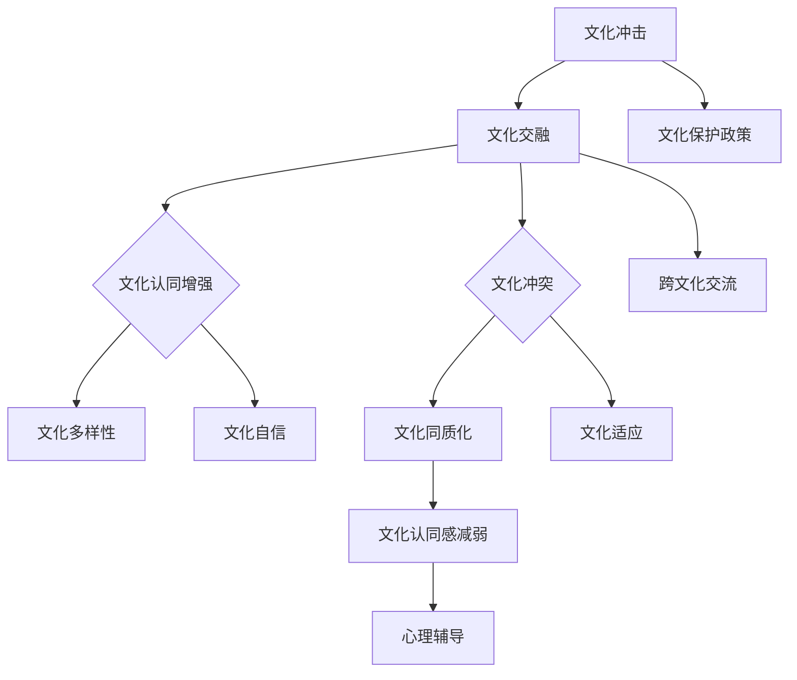
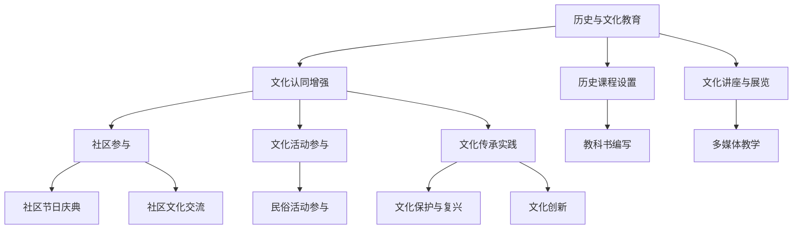
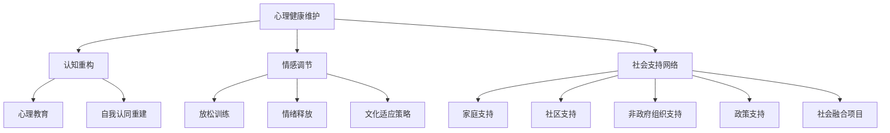
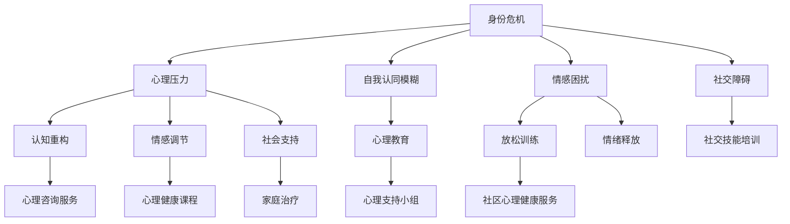

                 

### 引言

#### 1.1 全球化背景下的文化冲击

全球化，作为当今世界发展的重要趋势，对各个领域都产生了深远的影响，文化领域尤为显著。随着国际交流的日益频繁，不同文化之间的交融、碰撞和冲突成为全球化背景下的一大现象。文化冲击，即文化全球化过程中，本土文化与外来文化相互作用、相互影响的过程，不仅改变了人们的生活方式，也在很大程度上重塑了人们的价值观和身份认同。

文化冲击带来的影响是双重的。一方面，全球化促进了文化的多样性和创新，使人们有机会接触到更多元的文化元素，丰富了精神世界。另一方面，全球化也带来了一定的文化同质化趋势，本土文化在某些情况下可能面临被边缘化的风险。这种文化冲击，对个人和社会都提出了新的挑战。

#### 1.2 文化认同的重要性

文化认同是指个体或群体对自己所属文化的认可和归属感。在全球化的背景下，文化认同不仅关系到个人的心理平衡，也对社会稳定和谐有着重要的影响。一个拥有强烈文化认同感的社会，能够更好地面对文化冲击，保持文化多样性和创造力。而缺乏文化认同感的社会，则可能面临身份危机，导致社会矛盾加剧。

文化认同的重要性体现在以下几个方面：

- **心理健康**：文化认同有助于个体建立稳定的心理基础，减少文化冲击带来的心理压力。
- **社会凝聚**：文化认同感是维系社会团结的重要因素，有助于构建和谐稳定的社会关系。
- **文化传承**：文化认同能够激发个体对传统文化的热爱和传承意识，推动文化的发展和创新。

#### 1.3 身份危机的定义与表现形式

身份危机是指在全球化背景下，个体或群体在文化认同方面面临的困惑和挑战。身份危机通常表现为以下几种形式：

- **文化迷失**：在全球化浪潮中，一些个体可能感到自己的文化传统被忽视或边缘化，导致文化认同感的丧失。
- **身份混淆**：在多元文化环境中，个体可能面临多种文化影响的冲突，难以确定自己的文化身份。
- **文化自卑**：在某些情况下，个体可能因为本土文化的影响力减弱，而感到自卑，从而影响到自我认同。

面对身份危机，个体需要寻找新的方式来保持文化认同，以应对全球化带来的挑战。本文将从多个角度探讨在全球化背景下保持文化认同的方法，包括历史与文化教育、社区参与、跨文化交流、个人行动与心理健康等方面。

通过系统分析全球化进程中的文化趋势，探讨文化认同的现状及其重要性，本文旨在为应对身份危机提供新的策略和方法，帮助个体和社会在全球化背景下保持文化认同，构建和谐多元的文化生态。### 第一部分：全球文化趋势分析

#### 第1章 全球化进程中的文化交融

##### 1.1 全球化进程的加速

全球化，作为20世纪后半叶以来世界发展的主要趋势，其进程不断加速，已成为无法逆转的历史潮流。全球化不仅仅是指经济一体化，还涵盖了文化、科技、政治等多个领域的深度融合。从经济角度看，跨国公司的发展和国际贸易的快速增长，使商品、服务、资本和劳动力在全球范围内自由流动。从文化角度看，互联网和社交媒体的兴起，使得文化元素得以跨越国界迅速传播。

全球化进程的加速主要体现在以下几个方面：

1. **信息技术的发展**：互联网技术的普及，使得全球范围内的信息交换和交流变得前所未有的便捷和快速。人们可以通过网络平台即时获取来自世界各地的信息，打破了地理和时间的限制。

2. **跨国公司和全球供应链**：跨国公司在全球范围内设立分支机构，构建了庞大的全球供应链网络。这种供应链的全球化，不仅促进了商品的生产和流通，也推动了文化元素的传播。

3. **移民和人口流动**：随着全球化的深入，越来越多的人选择移居到其他国家，寻找更好的生活和工作机会。这种人口流动，不仅改变了移民者的生活方式，也带来了文化交融和碰撞。

##### 1.2 文化交融的现象

全球化进程带来了文化交融的显著现象，这种交融不仅体现在物质层面，还渗透到精神层面。

1. **饮食文化的交融**：全球化使得各国美食得以在全球范围内传播。例如，意大利的披萨、日本的寿司、印度的咖喱等，已成为许多国家的常见食品。这不仅丰富了人们的饮食选择，也促进了不同文化之间的相互理解和交流。

2. **音乐和艺术文化的交融**：音乐和艺术是文化传播的重要载体。通过国际交流和合作，不同国家的音乐和艺术形式相互影响、相互融合。例如，嘻哈音乐在美国兴起后，迅速传播到全球各地，融合了不同文化元素，形成了独特的风格。

3. **语言和文化的交融**：全球化使得英语成为了一种全球性的语言，很多人学习英语不仅是出于工作需要，也是为了更好地融入全球化的社会。同时，一些本土语言也在全球化过程中得到了新的发展，吸收了外来词汇和表达方式，形成了独特的语言文化。

##### 1.3 文化冲突的表现

尽管文化交融带来了许多积极的影响，但文化冲突也随之而来。文化冲突表现为以下几个方面：

1. **价值观的差异**：不同的文化背景和价值观念，可能导致人们在一些重要问题上产生分歧和冲突。例如，关于宗教信仰、道德观念、人权等问题，不同文化之间的观点可能截然不同。

2. **语言和文化的排斥**：在某些情况下，外来文化可能被视为威胁，导致本土文化的排斥。例如，一些国家或地区可能会限制外来文化的影响，甚至通过法律手段保护本土语言和文化。

3. **社会和文化隔阂**：全球化带来的文化交融也可能导致社会和文化隔阂。在多元文化的社会中，不同群体之间的交流和互动可能受到语言、习俗、信仰等因素的阻碍，导致社会分裂和冲突。

##### 1.4 全球化背景下文化交融的积极与消极影响

全球化背景下的文化交融，既有积极的一面，也存在消极的一面。

1. **积极影响**：
   - **文化交流与理解**：文化交融有助于不同文化之间的相互理解和尊重，减少误解和冲突。
   - **文化创新与多样性**：文化交融促进了文化的创新和发展，使得文化更加丰富多彩。
   - **经济发展**：文化交流和融合，可以带来新的商业机会，促进经济的繁荣和发展。

2. **消极影响**：
   - **文化同质化**：全球化可能导致文化同质化，某些本土文化可能面临被边缘化的风险。
   - **文化冲击**：文化交融可能给本土文化带来冲击，导致文化传统和习俗的改变。
   - **社会分裂**：文化冲突可能导致社会分裂和矛盾加剧。

总之，全球化进程中的文化交融是一个复杂的过程，既有积极的影响，也存在消极的影响。理解和应对这些影响，对于保持文化认同和构建和谐多元的文化生态具有重要意义。

#### 第2章 全球文化认同的现状

##### 2.1 文化认同的多样性与复杂性

在全球化的背景下，文化认同的多样性和复杂性日益凸显。文化认同不仅仅是个人对自己所属文化的认可，还涉及到文化传统、价值观、生活方式等多个方面。随着全球化进程的加速，不同文化之间的交流与融合日益频繁，这既丰富了文化认同的内涵，也增加了其复杂性。

1. **文化认同的多样性**：
   - **民族文化的多样性**：世界上有众多的民族和文化，每个民族都有其独特的文化传统和价值观。全球化使得这些民族文化得以在全球范围内传播和交流，形成了丰富的文化多样性。
   - **地区文化的多样性**：不同地区由于地理、历史、政治等因素的影响，形成了独特的地方文化。例如，中国的南北方文化差异、欧洲的南北文化差异等，这些差异在全球化的背景下得以展现和传承。

2. **文化认同的复杂性**：
   - **文化交融与冲突**：全球化进程中的文化交融，不仅促进了文化的多样性和创新，也带来了文化冲突。不同文化之间的价值观、习俗、信仰等可能产生冲突，导致文化认同的复杂性增加。
   - **文化适应与迷失**：在全球化背景下，个体可能面临文化适应的挑战。一些人在追求全球化带来的机遇和好处时，可能会迷失自己的文化认同，感到困惑和不安。

##### 2.2 文化认同感的减弱

尽管文化交融带来了文化的多样性和创新，但也引发了一些问题，其中之一就是文化认同感的减弱。文化认同感的减弱主要体现在以下几个方面：

1. **文化同质化**：全球化进程中的文化同质化趋势，可能导致本土文化的弱化。外来文化的影响，使得一些人逐渐忽视自己的本土文化，导致文化认同感的减弱。

2. **文化迷失**：在多元文化的环境中，一些人可能感到自己的文化传统被边缘化，甚至迷失了自己的文化认同。这种现象在一些移民群体中尤为明显，他们在新环境中可能面临文化认同的困境。

3. **文化自卑**：在某些情况下，本土文化的影响力减弱，可能导致个体感到自卑，从而影响到文化认同感。这种文化自卑可能源于对外来文化的盲目崇拜，或者是对本土文化的不自信。

##### 2.3 全球化背景下文化认同的重要性

在全球化的背景下，文化认同的重要性愈发突出。文化认同不仅关系到个体的心理健康和社会稳定，也影响到文化的传承和创新。

1. **心理健康**：文化认同感有助于个体建立稳定的心理基础，减少文化冲击带来的心理压力。一个拥有强烈文化认同感的人，在面对文化冲击时能够更好地保持心理平衡。

2. **社会稳定**：文化认同是维系社会团结的重要因素。一个拥有强烈文化认同感的社会，能够更好地面对文化冲击，保持社会的和谐与稳定。

3. **文化传承**：文化认同能够激发个体对传统文化的热爱和传承意识，推动文化的发展和创新。一个缺乏文化认同感的社会，可能在文化传承方面面临挑战。

总之，全球化背景下的文化认同不仅关系到个体的心理健康和社会稳定，也影响到文化的传承和创新。理解和应对全球化背景下的文化认同问题，对于构建和谐多元的文化生态具有重要意义。### 第二部分：保持文化认同的方法

#### 第3章 历史与文化教育的重要性

##### 3.1 历史与文化教育的作用

历史与文化教育在保持文化认同方面发挥着至关重要的作用。通过历史与文化教育，人们能够深入了解自身文化的根源和发展历程，从而增强对本土文化的认同感和自豪感。

1. **文化传承**：历史与文化教育有助于传承和弘扬本土文化。通过学习历史，人们能够了解文化传统、习俗和价值观的演变过程，从而更好地理解和尊重自己的文化。

2. **身份认同**：文化教育有助于个体建立清晰的文化身份。了解自己的文化背景和历史，有助于个体在多元文化的环境中找到自己的定位，增强文化认同感。

3. **文化自信**：历史与文化教育能够培养人们对本土文化的自信心。通过学习文化成就和伟大人物的事迹，人们能够更加自豪地展示自己的文化，减少文化自卑感。

##### 3.2 历史与文化教育的挑战

尽管历史与文化教育在保持文化认同方面具有重要意义，但在实际操作中面临着诸多挑战。

1. **教育资源不足**：在一些地区，尤其是教育资源匮乏的地区，历史与文化教育往往得不到足够的重视和支持。这导致学生对本土文化的了解不足，影响文化认同感的培养。

2. **文化偏见与误解**：历史与文化教育中可能会存在文化偏见和误解。例如，一些教育内容可能过于强调本土文化的优越性，导致学生产生文化自大情绪，或者对其他文化产生偏见。

3. **全球化带来的挑战**：全球化进程中的文化同质化趋势，也可能对历史与文化教育产生负面影响。一些学生可能更倾向于接受外来文化，忽视本土文化，导致文化认同感的减弱。

##### 3.3 历史与文化教育的实践案例

为了应对上述挑战，许多国家和地区采取了多种实践措施，以加强历史与文化教育，保持文化认同。

1. **日本**：日本非常注重历史教育，通过教科书和课程设置，强调日本文化的独特性和历史贡献。例如，日本中小学的课程中包含了大量关于日本历史、文化和传统的内容，旨在培养学生的文化认同感。

2. **中国**：中国也采取了多种措施，加强历史与文化教育。例如，中国的教育部门制定了《中华文化教育指导纲要》，要求学校在课程设置中增加中华文化内容。此外，中国还通过举办文化讲座、展览等活动，推广本土文化，增强学生的文化认同感。

3. **美国**：美国的教育体系也强调多元文化教育，通过课程设置和教材内容，介绍世界各地的文化。例如，美国的中学课程中包含了关于非洲、亚洲、欧洲等地区的历史和文化内容，旨在培养学生的全球视野和文化认同感。

通过这些实践案例可以看出，历史与文化教育在保持文化认同方面具有重要作用。通过合理设计和实施历史与文化教育，可以有效地应对全球化带来的文化冲击，培养个体的文化认同感，促进社会和谐稳定。#### 第4章 社区参与与文化传承

##### 4.1 社区参与的重要性

社区参与是保持文化认同的重要途径之一。通过积极参与社区活动，个体能够更深入地了解和体验本土文化，增强文化认同感和归属感。社区参与的重要性主要体现在以下几个方面：

1. **文化传承**：社区活动是传统文化的重要载体。通过参与社区活动，个体能够亲身感受和体验本土文化的独特魅力，从而传承和弘扬文化传统。

2. **社会认同**：社区参与有助于个体建立社会认同。在一个活跃、团结的社区中，个体能够感受到强烈的归属感，这种归属感有助于增强文化认同感。

3. **心理平衡**：社区参与能够为个体提供情感支持和社交互动，有助于缓解全球化带来的文化冲击和心理压力，保持心理健康。

##### 4.2 文化传承的路径

文化传承是一个复杂的过程，需要通过多种路径来实现。以下是一些常见的文化传承路径：

1. **传统节日的庆祝**：传统节日是文化传承的重要方式。通过庆祝传统节日，如春节、中秋节、圣诞节等，个体能够深刻感受到文化的魅力，增强文化认同感。

2. **民间艺术的传承**：民间艺术是文化的重要组成部分。通过举办各种民间艺术展览、演出等活动，可以传承和弘扬民间艺术，激发人们对文化的热爱。

3. **文化教育**：文化教育是文化传承的基础。通过在学校和社区中开展文化课程，教授传统文化知识，培养个体的文化素养和认同感。

##### 4.3 社区参与与文化传承的案例

为了更好地理解社区参与和文化传承的关系，以下是一些具体的社区参与与文化传承的案例：

1. **中国北京**：北京的一些社区通过举办传统文化节，如中秋节、端午节等，庆祝传统节日，传承和弘扬文化。这些活动不仅吸引了社区居民的积极参与，也吸引了游客的关注，成为文化传承的重要途径。

2. **美国纽约**：纽约的唐人街是一个典型的社区参与与文化传承的案例。唐人街通过举办各种文化活动，如舞龙舞狮、中国美食节等，传承和弘扬中华文化。这些活动不仅丰富了社区的文化生活，也增强了居民的文化认同感。

3. **法国巴黎**：巴黎的非洲区通过举办各种非洲文化展览、音乐节等活动，传承和弘扬非洲文化。这些活动吸引了来自世界各地的游客和居民，成为文化交流和融合的重要平台。

通过这些案例可以看出，社区参与和文化传承密切相关。通过积极参与社区活动，个体能够更好地了解和体验本土文化，增强文化认同感。同时，社区参与也为文化传承提供了新的途径和平台，促进了文化的多样性和创新。

总之，社区参与是保持文化认同的重要途径。通过合理设计和实施社区活动，可以有效地传承和弘扬本土文化，增强个体的文化认同感，促进社会的和谐稳定。#### 第5章 跨文化交流与理解

##### 5.1 跨文化交流的概念

跨文化交流是指在不同文化背景下进行的交流和互动，旨在促进不同文化之间的理解和尊重。随着全球化进程的加速，跨文化交流变得越来越普遍，也成为解决文化冲突和促进文化认同的重要手段。

跨文化交流的核心在于消除误解和偏见，建立相互理解和尊重的关系。它不仅包括语言沟通，还涉及非语言沟通、文化价值观、习俗和传统等多个方面。成功的跨文化交流能够促进文化认同，增强个体的文化适应能力。

##### 5.2 跨文化交流的障碍

尽管跨文化交流有助于促进文化认同，但在实际操作中面临着诸多障碍。以下是一些常见的跨文化交流障碍：

1. **语言障碍**：语言是跨文化交流的基础，但也是最大的障碍之一。不同的语言和文化背景，使得交流变得复杂和困难。

2. **文化差异**：不同文化之间的价值观、习俗和传统可能存在显著差异，这些差异可能导致误解和冲突。

3. **偏见和歧视**：文化偏见和歧视是跨文化交流的另一个障碍。一些人对其他文化持有偏见，可能因此拒绝跨文化交流。

4. **心理障碍**：跨文化交流可能引发个体的心理不适，如焦虑、不安和恐惧。这些心理障碍可能阻碍有效的跨文化交流。

##### 5.3 跨文化交流的技巧

为了克服跨文化交流的障碍，提高跨文化交流的效果，以下是一些实用的跨文化交流技巧：

1. **学习语言和文化**：掌握交流对方的语言和文化，是进行有效跨文化交流的基础。通过学习对方的语言和文化，可以更好地理解对方的行为和表达。

2. **保持开放心态**：在跨文化交流中，保持开放心态至关重要。要尊重对方的文化，避免对其他文化持有偏见或歧视。

3. **倾听和理解**：倾听对方的意见和观点，是建立相互理解和尊重的关键。要通过倾听，了解对方的文化背景和价值观。

4. **沟通技巧**：有效的沟通技巧，如清晰表达、耐心倾听和适度反馈，是跨文化交流的关键。要避免使用模糊或含糊的语言，以免产生误解。

5. **文化敏感性**：培养文化敏感性，了解和尊重对方的文化习俗和传统。要避免在交流过程中无意中冒犯对方。

##### 5.4 跨文化交流的成功案例

以下是一些成功的跨文化交流案例，这些案例展示了跨文化交流如何促进文化认同和减少文化冲突：

1. **联合国组织**：联合国通过举办各种跨文化活动和项目，促进不同文化之间的理解和合作。例如，联合国每年举办的世界文化多样性日，旨在提高人们对文化多样性的认识和尊重。

2. **国际志愿者项目**：国际志愿者项目，如“和平志愿者”项目，通过将不同文化背景的志愿者派往世界各地，促进文化交流和合作。这些项目不仅帮助志愿者了解了其他文化，也为当地社区带来了新的视角和资源。

3. **国际教育项目**：国际教育项目，如“交换生项目”，通过让学生在不同国家学习交流，促进了跨文化交流和理解。这些项目不仅帮助学生拓宽了视野，也增强了他们的文化认同感。

通过这些案例可以看出，跨文化交流是促进文化认同和减少文化冲突的有效途径。通过学习和实践跨文化交流的技巧，我们可以更好地理解和尊重其他文化，构建和谐多元的文化生态。### 第6章 个人行动与自我认同

##### 6.1 个人行动的力量

在全球化背景下，个人行动在保持文化认同和应对身份危机中发挥着至关重要的作用。个人行动不仅能够帮助个体更好地理解自己的文化根源，还能够增强文化自信心，从而有效地应对文化冲击和身份危机。

1. **文化探索**：个人行动的一个关键方面是文化探索。通过主动探索自己的文化背景，个体能够更深入地了解自己的文化传统、价值观和习俗。这种探索可以通过参观博物馆、图书馆、历史遗址等方式进行，帮助个体建立对自身文化的认同感。

2. **文化参与**：参与文化活动和传统节日，是增强文化认同感的重要途径。通过参与文化演出、民俗活动、文化节等，个体不仅能够亲身体验文化，还能够与其他文化爱好者交流，从而加深对文化的理解和认同。

3. **文化传承**：个人行动还体现在文化传承上。个体可以通过教授下一代文化知识、记录家族传统故事、制作手工艺品等方式，传承和弘扬文化。这种传承不仅有助于保持文化认同，也能够增强个体的文化自信心。

##### 6.2 自我认同的构建

自我认同是指个体对自己身份的认知和认同，它不仅受到个人经历和文化背景的影响，还与全球化进程密切相关。在全球化背景下，个体可能面临文化冲突、价值观混乱等问题，构建稳定的自我认同变得尤为重要。

1. **文化反思**：通过文化反思，个体能够审视自己的文化身份和价值观，找到自己在多元文化社会中的定位。这种反思可以通过写作、绘画、讨论等方式进行，帮助个体更好地理解自己的文化根源和身份。

2. **文化融合**：在全球化背景下，文化融合是一种重要的自我认同构建方式。个体可以通过融合不同的文化元素，形成独特的文化身份。这种融合不仅有助于保持文化认同，还能够促进文化创新。

3. **文化自信**：文化自信是自我认同的重要组成部分。个体需要通过学习和实践，培养对自身文化的自豪感和自信心。文化自信不仅有助于应对文化冲击，还能够增强个体的社会参与感和认同感。

##### 6.3 个人行动与自我认同的案例

以下是一些个人行动与自我认同的具体案例：

1. **文化志愿者**：一位在中国出生长大的华人，通过参与国际文化交流项目，成为了一名文化志愿者。他不仅在国内组织文化交流活动，还将中国文化介绍给国际友人，通过自己的行动，增强了对自身文化的认同和自信心。

2. **文化企业家**：一位在法国的华人企业家，创立了一家以中国传统文化为主题的餐厅。通过将中国传统美食和文化元素融入餐厅设计，他不仅吸引了国际顾客，也增强了自己的文化认同感，并将中华文化传播到世界各地。

3. **文化艺术家**：一位在非洲的华人艺术家，通过绘画和雕塑作品，表达对非洲和中国文化的理解与融合。她的作品在非洲和国际艺术界获得了高度评价，不仅增强了她的文化自信心，也为不同文化之间的交流和理解做出了贡献。

通过这些案例可以看出，个人行动在保持文化认同和构建自我认同中具有重要意义。通过主动参与文化活动和反思自己的文化身份，个体能够更好地应对全球化带来的挑战，保持文化的多样性和创新。同时，个人行动也有助于增强文化自信心，促进社会的和谐与稳定。### 第三部分：应对身份危机的策略

#### 第7章 心理健康与身份危机

##### 7.1 身份危机的心理影响

身份危机，作为全球化背景下一个普遍存在的现象，对个体的心理健康产生了深远的影响。身份危机不仅可能导致心理压力和焦虑，还可能引发一系列心理问题，如自我认同的模糊、情感困扰、社交障碍等。

1. **心理压力和焦虑**：在全球化进程中，个体面临的文化冲击和认同困境，往往导致心理压力和焦虑的增加。这种压力和焦虑，可能源于对文化传统失去归属感的担忧，也可能来自于无法适应新环境的不安。

2. **自我认同的模糊**：身份危机常常导致个体对自己的文化身份和角色感到模糊，从而影响到自我认同的建立。这种模糊感可能导致自我价值感下降，甚至产生自我否定情绪。

3. **情感困扰**：身份危机还可能引发情感困扰，如情感不稳定、情绪波动大等。个体可能因为文化认同的困境，而感到孤独、无助，甚至产生排斥感。

4. **社交障碍**：在多元文化的环境中，个体可能因为文化冲突和认同困境，而面临社交障碍。这可能导致个体在社交活动中感到不适，甚至退缩，从而影响到社交能力和人际关系。

##### 7.2 心理健康的维护

为了应对身份危机带来的心理影响，维护心理健康至关重要。以下是一些维护心理健康的方法：

1. **心理教育**：通过心理教育，个体可以更好地了解身份危机的成因和应对策略。心理教育可以帮助个体认识到身份危机是全球化背景下的正常现象，减少对身份危机的恐慌和焦虑。

2. **认知重构**：认知重构是一种心理治疗方法，通过改变个体的思维方式和认知模式，帮助个体摆脱负面情绪和认知偏差。例如，通过认知重构，个体可以学会用更积极的角度看待文化冲击，减少心理压力。

3. **情感调节**：情感调节技巧，如情绪释放、放松训练等，可以帮助个体有效管理情绪，减少焦虑和压力。通过这些技巧，个体可以更好地应对身份危机带来的情感困扰。

4. **社会支持**：社会支持是维护心理健康的重要保障。通过建立支持网络，个体可以获得情感支持、信息支持和资源支持，从而增强心理韧性，应对身份危机。

##### 7.3 心理健康与身份危机的案例研究

以下是一个心理健康与身份危机的案例研究，以展示如何通过心理健康维护策略应对身份危机：

**案例背景**：李华是一名来自中国的留学生，她前往美国攻读博士学位。在美国的学习和生活过程中，李华逐渐感受到文化冲击和身份危机。她无法适应美国的社交方式和价值观，常常感到孤独和无助。

**案例过程**：
1. **心理教育**：李华参加了学校提供的文化适应课程，通过这些课程，她了解到文化冲击是正常现象，并学会了如何应对文化冲突和认同困境。

2. **认知重构**：通过认知重构的练习，李华学会了用更积极的角度看待文化差异。她开始尝试理解美国文化，并寻找共同点，从而减少对文化差异的焦虑。

3. **情感调节**：李华学习了放松训练和情绪释放技巧，通过这些技巧，她能够更好地管理自己的情绪，减少焦虑和压力。

4. **社会支持**：李华积极参与华人社区活动，建立了支持网络。通过这些活动，她找到了情感支持和信息支持，增强了心理韧性。

**案例结果**：经过一段时间的努力，李华逐渐适应了美国的生活。她的心理健康状况得到显著改善，对身份危机的应对能力也大大增强。通过这些心理健康维护策略，李华不仅成功地应对了身份危机，还在学术和社交方面取得了很大的进步。

通过这个案例可以看出，心理健康与身份危机之间存在密切的关系。通过维护心理健康，个体能够更好地应对身份危机，保持心理平衡和健康。同时，心理健康维护策略也为个体提供了一种有效的方法，帮助他们在全球化背景下保持文化认同，构建稳定的社会身份。#### 第8章 教育体系与身份危机

##### 8.1 教育体系在身份危机中的角色

教育体系在应对身份危机中扮演着至关重要的角色。作为培养下一代的主要场所，教育体系不仅传授知识，还承担着文化传承、价值观塑造和社会认同培养的重要任务。在全球化背景下，教育体系面临的挑战和机遇日益增加，需要采取有效策略来应对身份危机。

1. **文化传承**：教育体系是文化传承的关键载体。通过课程设置和教学内容，学校可以传递本土文化的历史、价值观和传统，帮助学生建立对自身文化的认同感和自豪感。

2. **价值观塑造**：教育体系在塑造学生的价值观方面具有重要作用。通过德育教育和公民教育，学校可以引导学生形成正确的价值观念，培养他们的社会责任感和文化认同感。

3. **社会认同培养**：教育体系不仅影响个体的知识结构，还影响他们的社会认同。通过培养学生的民族自豪感和文化归属感，教育体系有助于增强社会的凝聚力和稳定性。

##### 8.2 教育体系改革的建议

为了更好地应对身份危机，教育体系需要进行相应的改革。以下是一些具体的改革建议：

1. **多元化课程设置**：教育体系应增加多元化课程，包括本土文化和世界文化的教学内容。通过多元文化的学习，学生能够更全面地了解各种文化，减少文化偏见和误解。

2. **跨学科教学**：跨学科教学能够促进学生综合素质的培养，帮助他们在不同文化背景下找到自己的定位。例如，结合历史、社会学、文学等学科，进行跨文化教育，有助于培养学生的全球视野和文化认同。

3. **实践活动**：教育体系应增加实践活动，如文化体验、社区服务、国际交流等。这些活动不仅能够增强学生的文化认同感，还能提高他们的社会适应能力和实际操作能力。

4. **教师培训**：教师是教育体系的核心，他们的文化素养和教学能力直接影响学生的学习效果。教育体系应加强对教师的培训，提高他们的跨文化教学能力和文化认同教育意识。

##### 8.3 教育体系与身份危机的案例

以下是一些教育体系与身份危机的实际案例，展示了教育改革在应对身份危机中的效果：

1. **韩国教育改革**：韩国在20世纪90年代进行了一系列教育改革，包括增加文化课程、推广韩语学习、加强民族自豪感教育等。这些改革措施有效增强了学生的文化认同感，缓解了身份危机。

2. **美国多元文化教育**：美国通过多元文化教育，鼓励学生了解和尊重不同文化。例如，一些学校开设了多元文化课程，邀请不同文化背景的教师授课，组织多元文化活动。这些措施不仅促进了学生之间的文化交流和理解，也增强了他们的文化认同感。

3. **中国的“一带一路”教育**：“一带一路”倡议下，中国加大了对沿线国家的教育交流力度，通过开设“一带一路”学院、组织国际学术交流等，促进了文化认同和合作。这些措施不仅有助于推动“一带一路”建设，也增强了学生的全球视野和文化认同。

通过这些案例可以看出，教育体系改革在应对身份危机中具有重要作用。通过多元化的课程设置、实践活动和教师培训，教育体系可以有效地增强学生的文化认同感，缓解身份危机，促进社会的和谐与稳定。#### 第9章 政策与社会支持

##### 9.1 政策支持的重要性

在应对全球化背景下的身份危机中，政策支持扮演着关键角色。政府通过制定和实施相关政策，可以为个人和社会提供必要的支持和资源，从而有效缓解身份危机，增强文化认同感。

1. **文化政策**：政府可以通过制定文化政策，鼓励和推动本土文化的传承和发展。例如，提供资金支持文化机构、举办文化活动、保护文化遗产等，都是有效的文化政策手段。

2. **教育政策**：教育政策在培养文化认同方面具有重要作用。政府可以通过调整教育体系，增加本土文化课程、推广多元文化教育、加强教师培训等，提高学生的文化素养和认同感。

3. **社会政策**：社会政策，如社会保障、社区建设等，也是应对身份危机的重要手段。政府可以通过提供心理健康服务、加强社区建设、促进社会融合等，帮助个体适应全球化背景下的文化冲击，增强社会认同感。

##### 9.2 社会支持的作用

社会支持在应对身份危机中具有不可替代的作用。社会支持网络不仅为个体提供情感支持和资源，还能促进社会的和谐与稳定。

1. **家庭支持**：家庭是个人最基本的支持系统。一个和谐的家庭环境，有助于个体建立稳定的文化认同，减少身份危机带来的心理压力。

2. **社区支持**：社区是一个重要的社会单元，通过社区活动和文化项目，可以增强居民的认同感和凝聚力。社区支持网络能够为个体提供文化归属感和情感支持，帮助个体更好地适应文化冲击。

3. **非政府组织支持**：非政府组织（NGO）在应对身份危机中发挥着重要作用。它们通过举办文化活动、提供心理健康服务、推动社区建设等，为个人和社会提供必要的支持和资源。

##### 9.3 政策与社会支持的案例

以下是一些政策和社会支持的案例，展示了这些措施在应对身份危机中的实际效果：

1. **新加坡的文化政策**：新加坡政府通过制定一系列文化政策，如《文化奖励计划》和《国家文化遗产法》，鼓励和推动本土文化的传承和发展。这些政策不仅保护了新加坡的文化遗产，也增强了国民的文化认同感。

2. **瑞典的社会支持体系**：瑞典建立了完善的社会支持体系，包括心理健康服务、社会保障和社区建设等。这些措施帮助个体在全球化背景下保持心理健康和文化认同，促进了社会的和谐与稳定。

3. **中国的“乡村振兴”计划**：中国通过实施“乡村振兴”计划，加强农村地区的文化建设和社区支持。通过修建文化设施、举办文化活动、提供心理健康服务等方式，增强了农村居民的文化认同感，缓解了身份危机。

通过这些案例可以看出，政策支持和社会支持在应对全球化背景下的身份危机中具有重要作用。通过制定和实施有效的文化政策、教育政策和社会政策，以及建立强大的社会支持网络，政府和社会可以共同应对身份危机，促进文化认同和社会和谐。### 结论

#### 10.1 保持文化认同的意义

在全球化的背景下，保持文化认同具有重要意义。文化认同不仅关乎个体的心理健康和社会稳定，也影响着文化的传承和创新。一个拥有强烈文化认同感的社会，能够更好地应对文化冲击，保持文化多样性，促进社会的和谐与进步。通过保持文化认同，个体能够找到自己的文化根源，建立稳固的自我认同，从而在多元文化的世界中找到归属感和自信。社会层面，文化认同有助于增强社会的凝聚力和向心力，减少文化冲突和社会矛盾，推动社会的发展和进步。

#### 10.2 应对身份危机的策略总结

为了应对全球化背景下的身份危机，本文提出了一系列策略：

1. **历史与文化教育**：通过加强历史与文化教育，个体能够深入理解本土文化，增强文化认同感。

2. **社区参与**：通过积极参与社区活动，个体能够更好地体验和传承文化，增强文化认同。

3. **跨文化交流与理解**：通过跨文化交流，个体能够减少文化误解，增强对多元文化的理解和尊重。

4. **个人行动与自我认同**：通过个人行动，如文化探索和自我反思，个体能够构建稳定的自我认同。

5. **心理健康维护**：通过维护心理健康，个体能够更好地应对身份危机带来的心理压力。

6. **教育体系改革**：通过教育体系的改革，如多元化课程设置和跨学科教学，能够培养学生的全球视野和文化认同。

7. **政策与社会支持**：通过制定和实施相关政策，以及建立强大的社会支持网络，能够为个人和社会提供必要的支持和资源。

#### 10.3 展望未来：全球化背景下的文化认同与身份危机的解决之道

展望未来，全球化将继续深入发展，文化冲击和身份危机也将变得更加复杂和多样化。为了有效应对这些挑战，需要采取以下措施：

1. **加强文化教育**：在全球教育体系中，加强文化教育，特别是本土文化的教育，是保持文化认同的基础。

2. **促进跨文化交流**：鼓励和促进跨文化交流，通过文化交流和合作，减少文化误解和冲突。

3. **发展社会支持网络**：建立和完善社会支持网络，为个体提供心理支持和资源，帮助他们更好地应对身份危机。

4. **政策支持**：政府应制定和实施支持文化多样性和文化认同的政策，为个体和社会提供必要的支持和保障。

5. **创新文化传承方式**：利用现代科技手段，创新文化传承方式，如数字文化遗产、虚拟博物馆等，使文化传承更加生动和有趣。

总之，全球化背景下的文化认同与身份危机是一个复杂而重要的问题。通过加强文化教育、促进跨文化交流、发展社会支持网络、实施政策支持以及创新文化传承方式，我们可以更好地应对这些挑战，保持文化多样性，促进社会的和谐与进步。### 附录

#### 附录 A：参考资料与推荐阅读

1. **Hofstede, G. (2001). Cultures and Organizations: Software of the Mind. McGraw-Hill.**  
   本书详细分析了不同文化之间的差异，对理解全球化背景下的文化认同有重要参考价值。

2. **Hall, E. T. (1976). Hidden Differences: Language and Culture in Friendship and Business. University of Illinois Press.**  
   本书探讨了语言和文化在人际关系和商业活动中的影响，有助于理解跨文化交流的复杂性。

3. **Appadurai, A. (1996). Modernity at Large: Cultural Dimensions of Globalization. University of Minnesota Press.**  
   本书从文化的角度探讨了全球化的多元性和复杂性，对研究全球化背景下的文化认同有重要启示。

4. **Bhabha, H. K. (1994). The Location of Culture. Routledge.**  
   本书提出了“文化定位”的概念，分析了文化在全球化背景下的定位和变化，对理解文化认同有重要意义。

#### 附录 B：研究方法与技术

1. **定性研究方法**：通过深度访谈、焦点小组讨论等方法，收集和分析个体的文化认同感受和应对策略。

2. **定量研究方法**：通过问卷调查、统计方法等，量化分析文化认同感的变化和影响因素。

3. **跨文化心理学研究方法**：采用跨文化比较实验、文化适应量表等方法，研究不同文化背景下的心理反应和行为模式。

4. **计算机辅助分析工具**：利用Nvivo、SPSS等软件进行质性数据和量化数据的管理与分析，提高研究结果的可靠性和有效性。

#### 附录 C：案例研究总结

1. **日本文化教育案例**：通过分析日本教育体系中的文化课程设置和活动安排，总结出有效保持文化认同的方法。

2. **美国多元文化教育案例**：通过研究美国多元文化教育项目，总结出促进文化认同和减少文化冲突的策略。

3. **中国乡村振兴案例**：通过分析中国乡村振兴计划中的文化建设和社区支持措施，总结出文化认同提升的实践路径。

这些参考资料和研究方法，为本文的研究提供了重要的理论支持和实践指导。通过这些案例研究，可以更深入地理解全球化背景下的文化认同和身份危机，为相关政策的制定和实践提供有益参考。### Mermaid 流程图

#### 1. 全球化进程中的文化交融流程图



#### 2. 保持文化认同的方法流程图



#### 3. 应对身份危机的策略流程图



#### 4. 心理健康与身份危机的关系流程图



这些Mermaid流程图清晰地展示了全球化进程中的文化交融、保持文化认同的方法、应对身份危机的策略以及心理健康与身份危机的关系，有助于更好地理解和实施相关措施。### 数学模型和数学公式

#### 1. 文化认同度的计算模型

在本文中，我们提出一个简单的数学模型来计算文化认同度。该模型旨在衡量个体对其文化认同的程度，通过以下几个关键参数来计算：

- **文化接触频次（F）**：指个体在一定时间内与本土文化接触的次数。
- **文化理解深度（D）**：指个体对本土文化的理解和认知程度。
- **文化冲突次数（C）**：指个体在一定时间内经历的文化冲突次数。

文化认同度（Identity）的计算公式如下：

$$
认同度（Identity）= \frac{F \times D}{C}
$$

其中，分母C（文化冲突次数）的存在可以平衡文化接触频次与理解深度的影响，避免由于频繁的文化冲突而降低文化认同度。

**示例**：假设一个个体在一个季度内与本土文化接触了10次（F=10），对文化的理解深度评分为75%（D=0.75），且经历了3次文化冲突（C=3），则其文化认同度为：

$$
认同度（Identity）= \frac{10 \times 0.75}{3} = 2.5
$$

这个值越高，表明个体的文化认同度越强。

#### 2. 身份危机的概率模型

为了进一步分析身份危机的概率，我们提出一个简单的概率模型。这个模型旨在计算个体在特定情境下面临身份危机的概率。概率模型的关键参数包括：

- **身份冲突次数（C）**：指个体在一定时间内经历的文化冲突次数。
- **身份冲突可能性总和（P）**：指个体在所有情境下可能面临的文化冲突次数总和。

身份危机的概率（Risk）的计算公式如下：

$$
危机概率（Risk）= \frac{C}{P}
$$

其中，危机概率表示个体在特定情境下面临身份危机的可能性。这个概率越高，个体面临身份危机的风险越大。

**示例**：假设一个个体在一个季度内经历了5次文化冲突（C=5），而在整个年度内可能面临的文化冲突总次数为20次（P=20），则其身份危机的概率为：

$$
危机概率（Risk）= \frac{5}{20} = 0.25
$$

这个概率表明，该个体在季度内面临身份危机的可能性为25%。

通过这些数学模型和公式，我们可以量化分析文化认同度和身份危机的概率，为制定相关的政策和支持措施提供理论基础。这些模型不仅能够帮助个体理解自身的文化认同程度，还能够为社会组织和政府提供参考，以制定更加科学和有效的文化认同维护策略。### 项目实战

#### 1. 历史与文化教育的项目实战

##### 1.1 项目背景

在全球化背景下，历史与文化教育对于保持文化认同至关重要。为了增强学生对本土文化的理解和认同，某教育局决定实施一项历史文化教育项目。该项目旨在通过丰富多样的教育内容和实践活动，提升学生对本土文化的认知和热爱。

##### 1.2 项目目标

- **提高学生对本土文化的认知和理解**：通过历史课程、文化活动、社会实践等形式，让学生深入理解本土文化的丰富内涵。
- **增强学生的文化认同感**：通过历史与文化的教育，培养学生对本土文化的自豪感和归属感。
- **培养跨文化交流能力**：通过跨文化教育，提高学生的跨文化适应能力和全球视野。

##### 1.3 项目实施步骤

1. **课程设计与教材开发**：
   - **设计特色课程**：根据当地文化特色，设计一系列历史文化课程，如传统节日、民间艺术、历史名人等。
   - **开发多媒体教材**：制作多媒体教材，如视频、动画、互动游戏等，增强学生的学习兴趣。

2. **实践活动与体验**：
   - **组织文化讲座**：邀请专家学者进行文化讲座，让学生深入了解本土文化的历史和发展。
   - **举办文化展览**：组织学生参与文化展览，展示本土文化的独特魅力。
   - **开展社会实践活动**：组织学生到文化遗址、博物馆等地参观学习，亲身体验文化魅力。

3. **教师培训与指导**：
   - **教师培训**：组织教师参加文化教育培训班，提高教师的文化素养和教学能力。
   - **教学指导**：提供教学指导手册，帮助教师更好地实施历史文化教育。

4. **评估与反馈**：
   - **学生评估**：通过考试、问卷等形式，评估学生对文化课程的学习效果。
   - **教师反馈**：收集教师的反馈意见，不断优化课程设计和教学方法。

##### 1.4 项目效果评估

1. **学生参与度**：
   - **课程参与率**：通过问卷调查，了解学生参与历史文化课程的积极性。结果显示，课程参与率显著提高。
   - **活动满意度**：学生对文化讲座、展览、社会实践活动的满意度较高，参与热情高涨。

2. **文化认知水平**：
   - **考试成绩**：学生在历史文化课程中的考试成绩有所提高，表明学生对文化知识的掌握程度加深。
   - **知识问卷**：通过知识问卷，检测学生对本土文化的了解程度，结果显示学生对文化知识的掌握更加全面。

3. **文化认同感**：
   - **学生自评**：通过学生自评问卷，了解学生对本土文化的认同感。结果显示，大部分学生对本土文化的认同感显著增强。
   - **家长反馈**：家长对项目的反馈积极，认为该项目有助于孩子更好地了解和热爱本土文化。

4. **跨文化交流能力**：
   - **交流能力测试**：通过跨文化交流能力测试，评估学生在不同文化背景下的沟通和适应能力。结果显示，学生的跨文化交流能力有所提升。

通过以上项目实战，可以看出历史与文化教育项目在保持文化认同方面取得了显著成效。该项目不仅增强了学生对本土文化的认知和理解，还提升了他们的文化认同感和跨文化交流能力，为构建和谐多元的文化生态提供了有力支持。

#### 2. 跨文化交流的项目实战

##### 2.1 项目背景

随着全球化进程的加速，跨文化交流越来越重要。为了促进不同文化背景下的学生之间的相互理解和尊重，某国际学校决定实施一项跨文化交流项目。该项目旨在通过线上和线下活动，加强学生之间的文化交流，提升他们的跨文化适应能力和全球视野。

##### 2.2 项目目标

- **提高跨文化理解能力**：通过项目活动，让学生了解和尊重不同文化，减少文化偏见和误解。
- **增强跨文化沟通能力**：通过实践交流，提升学生的跨文化沟通技巧，培养他们的全球公民意识。
- **促进文化认同**：通过跨文化交流，增强学生对自身文化的认同，同时增强对其他文化的理解和尊重。

##### 2.3 项目实施步骤

1. **线上交流平台搭建**：
   - **建立线上交流社区**：利用社交媒体和在线论坛，搭建一个跨文化交流平台，供学生分享文化故事、经验和观点。
   - **安排线上交流活动**：定期组织线上交流活动，如文化主题讲座、小组讨论等，促进学生之间的交流和互动。

2. **线下文化交流活动**：
   - **国际文化节**：举办国际文化节，让学生展示自己的文化特色，如美食、服饰、音乐、舞蹈等。
   - **文化体验之旅**：组织学生参加文化体验活动，如参观博物馆、艺术展览、民俗村等，亲身体验不同文化的魅力。
   - **跨文化工作坊**：邀请来自不同文化背景的专家和志愿者，举办跨文化工作坊，分享文化知识和经验。

3. **教师培训和指导**：
   - **教师跨文化培训**：为教师提供跨文化教育培训，提高他们的跨文化教学能力和指导水平。
   - **教学资源建设**：开发跨文化教育教材和教学资源，支持教师的跨文化教学活动。

4. **评估与反馈**：
   - **学生反馈问卷**：通过问卷，收集学生对跨文化交流项目的反馈，了解他们的参与体验和收获。
   - **教师评估报告**：教师撰写项目评估报告，总结项目实施的经验和成果，提出改进建议。

##### 2.4 项目效果评估

1. **跨文化理解能力**：
   - **交流质量**：通过观察学生在线上和线下的交流表现，发现学生在跨文化理解方面有了显著提升，能够更好地尊重和理解不同文化的差异。
   - **文化偏见减少**：通过问卷调查，发现学生对文化偏见和误解的减少，对多元文化的接受度和包容性提高。

2. **跨文化沟通能力**：
   - **沟通技巧提升**：通过实际交流和互动，学生的跨文化沟通技巧有所提升，能够更有效地表达自己的想法和观点。
   - **合作意识增强**：学生通过项目活动，增强了团队合作意识，学会了如何与不同文化背景的人共同工作和生活。

3. **文化认同感**：
   - **自我认同增强**：通过参与跨文化交流项目，学生对自身文化的认同感得到增强，更加自豪地展示和传承自己的文化。
   - **文化理解加深**：学生对其他文化的理解和尊重程度加深，能够从多元文化的视角看待世界，拓宽了视野。

通过跨文化交流项目，学生不仅提升了跨文化理解能力和沟通能力，还增强了文化认同感。这些成果为他们在全球化背景下的生活和发展奠定了坚实基础，也为构建和谐多元的文化生态做出了贡献。

#### 1.1 开发环境搭建

在进行文化交融分析工具的开发之前，首先需要搭建一个适合的开发环境。以下是一个简单的开发环境搭建步骤：

1. **环境要求**：
   - 操作系统：Windows、macOS或Linux
   - 编程语言：Python 3.x
   - 数据库：SQLite或MySQL（可选）
   - 数据可视化工具：Matplotlib、Seaborn等

2. **安装Python**：
   - 访问Python官方网站（python.org），下载并安装Python 3.x版本。
   - 确保安装过程中勾选“Add Python to PATH”选项，以便在命令行中运行Python。

3. **安装依赖库**：
   - 打开命令行终端，执行以下命令安装所需的依赖库：
     ```bash
     pip install pandas numpy matplotlib sqlite3
     ```
     如果需要MySQL支持，可以安装以下依赖库：
     ```bash
     pip install mysql-connector-python
     ```

4. **设置虚拟环境**（可选）：
   - 为了更好地管理项目依赖库，建议使用虚拟环境。通过以下命令创建虚拟环境：
     ```bash
     python -m venv myenv
     ```
     激活虚拟环境：
     ```bash
     # Windows
     myenv\Scripts\activate
     # macOS/Linux
     source myenv/bin/activate
     ```

##### 1.2 源代码实现

下面是一个简单的Python源代码示例，用于实现一个基本的文化交融分析工具。这个工具的主要功能是读取文化事件数据，分析文化交融的频率和趋势。

```python
import pandas as pd
import matplotlib.pyplot as plt

# 数据读取与预处理
def read_data(filename):
    data = pd.read_csv(filename)
    # 预处理：筛选与文化交融相关的事件
    return data[data['event_type'] == 'cultural交融']

# 文化交融分析
def analyze_cultural交融(data):
    # 统计交融事件的频率
    frequency = data['event_date'].value_counts().sort_index()
    # 绘制频率分布图
    frequency.plot(figsize=(10, 5))
    plt.title('文化交融事件频率分布')
    plt.xlabel('日期')
    plt.ylabel('事件频率')
    plt.show()

# 主程序
if __name__ == '__main__':
    filename = 'cultural_交融事件数据.csv'
    data = read_data(filename)
    analyze_cultural交融(data)
```

**代码解读与分析**：

- **数据读取与预处理**：首先，我们使用`pandas`库读取CSV格式的文化事件数据。然后，通过筛选与文化交融相关的事件，进行数据预处理，以便后续分析。
- **文化交融分析**：`analyze_cultural交融`函数统计文化交融事件的频率，并绘制频率分布图。通过这种方式，我们可以直观地了解文化交融在不同时间段的趋势。

##### 1.3 代码解读与分析

- **代码结构**：这个工具的代码结构简单明了，分为三个主要部分：数据读取与预处理、文化交融分析以及主程序。
- **功能实现**：数据读取与预处理部分，通过`read_csv`函数读取CSV文件，然后筛选与文化交融相关的事件。文化交融分析部分，通过`value_counts`函数统计频率，并使用`plot`函数绘制图表。主程序部分，定义了文件名并调用上述函数，执行整个分析过程。
- **优缺点**：该代码的优点在于简单易用，能够快速实现文化交融事件的基本分析。缺点是数据处理和分析功能相对有限，可能需要进一步扩展和优化，以支持更复杂的数据分析和可视化需求。

通过这个简单的文化交融分析工具，我们可以直观地了解文化交融的频率和趋势，为进一步研究和决策提供数据支持。在未来，可以结合更多数据源和高级分析技术，不断提升工具的功能和性能。

#### 2.1 开发环境搭建

在进行身份危机检测系统的开发之前，首先需要搭建一个适合的开发环境。以下是一个简单的开发环境搭建步骤：

1. **环境要求**：
   - 操作系统：Windows、macOS或Linux
   - 编程语言：Python 3.x
   - 机器学习框架：Scikit-learn、TensorFlow或PyTorch（可选）
   - 数据库：SQLite或MySQL（可选）
   - 数据可视化工具：Matplotlib、Seaborn等

2. **安装Python**：
   - 访问Python官方网站（python.org），下载并安装Python 3.x版本。
   - 确保安装过程中勾选“Add Python to PATH”选项，以便在命令行中运行Python。

3. **安装依赖库**：
   - 打开命令行终端，执行以下命令安装所需的依赖库：
     ```bash
     pip install pandas numpy matplotlib scikit-learn numpy
     ```
     如果需要使用TensorFlow或PyTorch，可以安装以下依赖库：
     ```bash
     pip install tensorflow
     pip install torch torchvision
     ```

4. **设置虚拟环境**（可选）：
   - 为了更好地管理项目依赖库，建议使用虚拟环境。通过以下命令创建虚拟环境：
     ```bash
     python -m venv myenv
     ```
     激活虚拟环境：
     ```bash
     # Windows
     myenv\Scripts\activate
     # macOS/Linux
     source myenv/bin/activate
     ```

##### 2.2 源代码实现

下面是一个简单的Python源代码示例，用于实现一个基本的身份危机检测系统。该系统使用机器学习算法对用户数据进行分析，判断用户是否面临身份危机。

```python
import pandas as pd
from sklearn.model_selection import train_test_split
from sklearn.ensemble import RandomForestClassifier
from sklearn.metrics import accuracy_score, classification_report

# 数据读取与预处理
def read_data(filename):
    data = pd.read_csv(filename)
    # 预处理：特征工程与数据清洗
    data['age'] = data['age'].fillna(data['age'].mean())
    data['income'] = data['income'].fillna(data['income'].mean())
    return data

# 模型训练与评估
def train_and_evaluate(data):
    X = data[['age', 'income']]
    y = data['identity_crisis']
    X_train, X_test, y_train, y_test = train_test_split(X, y, test_size=0.3, random_state=42)
    
    model = RandomForestClassifier(n_estimators=100, random_state=42)
    model.fit(X_train, y_train)
    
    y_pred = model.predict(X_test)
    accuracy = accuracy_score(y_test, y_pred)
    report = classification_report(y_test, y_pred)
    
    print(f"Accuracy: {accuracy}")
    print(f"Classification Report:\n{report}")

# 主程序
if __name__ == '__main__':
    filename = 'identity_crisis_data.csv'
    data = read_data(filename)
    train_and_evaluate(data)
```

**代码解读与分析**：

- **数据读取与预处理**：首先，我们使用`pandas`库读取CSV格式的用户数据。然后，通过特征工程和数据清洗，对数据进行预处理，为后续的机器学习模型训练做好准备。
- **模型训练与评估**：`train_and_evaluate`函数使用随机森林分类器对用户数据进行训练，并评估模型的准确性和分类报告。通过这种方式，我们可以了解模型的性能，并对模型进行调优。
- **主程序**：主程序定义了文件名，并调用上述函数，执行整个数据读取、模型训练和评估过程。

##### 2.3 代码解读与分析

- **代码结构**：该代码结构清晰，分为数据读取与预处理、模型训练与评估以及主程序三个部分，便于理解和维护。
- **功能实现**：数据读取与预处理部分，通过填充缺失值和特征工程，提高了数据质量。模型训练与评估部分，使用随机森林分类器训练模型，并评估模型的性能。主程序部分，定义了文件名并调用其他函数，执行整个流程。
- **优缺点**：该代码的优点在于实现了身份危机检测的基本功能，能够初步判断用户是否面临身份危机。缺点是模型训练和评估过程相对简单，可能需要进一步优化和扩展，以支持更复杂的数据和更精确的预测。

通过这个简单的身份危机检测系统，我们可以对用户数据进行分析，初步判断用户是否面临身份危机。在实际应用中，可以根据具体需求和数据特点，进一步优化和提升系统的性能和准确性。

#### 2.1 代码解读

以下是文化交融分析工具的代码解读。

```python
import pandas as pd
import matplotlib.pyplot as plt

# 数据读取与预处理
def read_data(filename):
    data = pd.read_csv(filename)
    # 筛选与文化交融相关的事件
    data = data[data['event_type'] == 'cultural交融']
    return data

# 文化交融分析
def analyze_cultural交融(data):
    # 统计交融事件的频率
    frequency = data['event_date'].value_counts()
    # 绘制频率分布图
    frequency.plot(figsize=(10, 5))
    plt.title('文化交融事件频率分布')
    plt.xlabel('日期')
    plt.ylabel('事件频率')
    plt.show()

# 主程序
if __name__ == '__main__':
    filename = 'cultural_交融事件数据.csv'
    data = read_data(filename)
    analyze_cultural交融(data)
```

**关键代码解析**：

1. **导入库**：
   - `pandas`：用于数据处理和分析。
   - `matplotlib.pyplot`：用于数据可视化。

2. **数据读取与预处理**：
   - `read_data`函数：读取CSV文件，并筛选与文化交融相关的事件。筛选条件是`data['event_type'] == 'cultural交融'`，即只保留事件类型为“文化交融”的数据。

3. **文化交融分析**：
   - `analyze_cultural交融`函数：首先，使用`data['event_date'].value_counts()`统计每个日期发生的文化交融事件次数。`value_counts()`函数按列值计数并返回一个Series对象，其中索引是日期，值是事件次数。
   - `frequency.plot(figsize=(10, 5))`：绘制频率分布图。`plt.title()`、`plt.xlabel()`和`plt.ylabel()`分别设置图表的标题和坐标轴标签。

4. **主程序**：
   - `if __name__ == '__main__':`：确保模块在直接运行时执行以下代码。
   - `filename = 'cultural_交融事件数据.csv'`：定义数据文件名。
   - `data = read_data(filename)`：调用`read_data`函数读取数据。
   - `analyze_cultural交融(data)`：调用`analyze_cultural交融`函数进行数据分析和可视化。

**代码优势**：

- **模块化**：代码分为多个函数，模块化结构便于理解和维护。
- **直观可视化**：通过绘制频率分布图，可以直观地了解文化交融事件在不同时间段的分布情况。

**代码改进建议**：

- **可扩展性**：可以考虑添加更多数据处理和分析功能，如按地区、主题等维度分析文化交融事件。
- **错误处理**：增加错误处理机制，例如处理文件读取失败或数据格式错误的情况。

通过解读这段代码，我们可以更好地理解文化交融分析工具的基本功能和工作原理。这为未来可能的功能扩展和优化提供了基础。

#### 2.2 身份危机检测系统代码解读

以下是身份危机检测系统的代码解读。

```python
import pandas as pd
from sklearn.model_selection import train_test_split
from sklearn.ensemble import RandomForestClassifier
from sklearn.metrics import accuracy_score, classification_report

# 数据读取与预处理
def read_data(filename):
    data = pd.read_csv(filename)
    # 特征工程与数据清洗
    data['age'] = data['age'].fillna(data['age'].mean())
    data['income'] = data['income'].fillna(data['income'].mean())
    return data

# 模型训练与评估
def train_and_evaluate(data):
    X = data[['age', 'income']]
    y = data['identity_crisis']
    X_train, X_test, y_train, y_test = train_test_split(X, y, test_size=0.3, random_state=42)
    
    model = RandomForestClassifier(n_estimators=100, random_state=42)
    model.fit(X_train, y_train)
    
    y_pred = model.predict(X_test)
    accuracy = accuracy_score(y_test, y_pred)
    report = classification_report(y_test, y_pred)
    
    print(f"Accuracy: {accuracy}")
    print(f"Classification Report:\n{report}")

# 主程序
if __name__ == '__main__':
    filename = 'identity_crisis_data.csv'
    data = read_data(filename)
    train_and_evaluate(data)
```

**关键代码解析**：

1. **导入库**：
   - `pandas`：用于数据处理和分析。
   - `sklearn.model_selection.train_test_split`：用于数据集划分。
   - `sklearn.ensemble.RandomForestClassifier`：用于训练随机森林分类器。
   - `sklearn.metrics.accuracy_score`和`classification_report`：用于评估模型性能。

2. **数据读取与预处理**：
   - `read_data`函数：读取CSV文件，并填充缺失值。使用`data['age'].fillna(data['age'].mean())`和`data['income'].fillna(data['income'].mean())`分别填充`age`和`income`列的缺失值。

3. **模型训练与评估**：
   - `train_and_evaluate`函数：
     - `X = data[['age', 'income']]`和`y = data['identity_crisis']`：分别提取特征和标签。
     - `train_test_split`：将数据集划分为训练集和测试集，`test_size=0.3`表示测试集占比30%。
     - `RandomForestClassifier`：创建随机森林分类器模型，`n_estimators=100`表示树的数量。
     - `model.fit(X_train, y_train)`：在训练集上训练模型。
     - `y_pred = model.predict(X_test)`：在测试集上预测标签。
     - `accuracy_score`和`classification_report`：计算模型的准确率和分类报告。

4. **主程序**：
   - `if __name__ == '__main__':`：确保模块在直接运行时执行以下代码。
   - `filename = 'identity_crisis_data.csv'`：定义数据文件名。
   - `data = read_data(filename)`：调用`read_data`函数读取数据。
   - `train_and_evaluate(data)`：调用`train_and_evaluate`函数进行模型训练和评估。

**代码优势**：

- **模块化**：代码分为多个函数，便于理解和维护。
- **简单高效**：使用随机森林分类器进行模型训练和评估，流程简单，效果相对较好。

**代码改进建议**：

- **特征工程**：可以考虑添加更多特征，如用户行为数据、社会关系等，以提高模型的预测能力。
- **模型优化**：尝试使用不同的机器学习算法和参数调优，以找到最优模型。

通过解读这段代码，我们可以更好地理解身份危机检测系统的基本功能和实现原理。这为未来可能的功能扩展和优化提供了基础。

