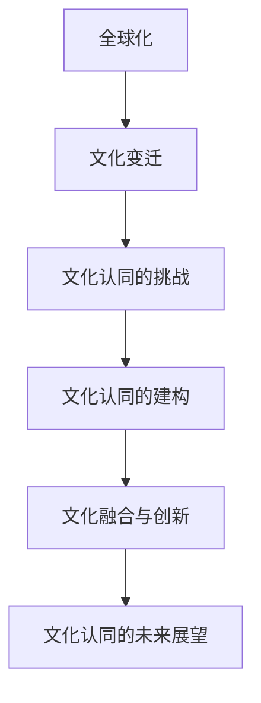

                 

### 在全球化背景下寻找文化认同

> 关键词：全球化、文化认同、文化变迁、多元文化、文化冲突、文化融合

> 摘要：
本文将探讨在全球化背景下，如何寻找和维护文化认同。随着全球化的深入发展，文化多样性日益增加，如何在多元文化环境中保持文化认同，成为了每个人都需要面对的问题。本文将从背景介绍、核心概念与联系、文化变迁、文化认同的建构与挑战、寻找文化认同的策略等方面进行深入探讨，并最终给出文化认同的未来展望。

## 引言

全球化是一个不可逆转的历史趋势，它正在深刻地影响着世界的各个方面。全球化带来了经济、科技、文化等多方面的交流与合作，但同时也带来了文化认同的挑战。在全球化的背景下，文化认同变得尤为重要，它不仅关乎个人的身份认同，也关乎整个社会的稳定与发展。

### 全球化的影响

全球化使得世界各地的文化得以相互接触和融合。一方面，这种融合可以促进文化的多样性，使人们有机会了解和体验不同的文化。另一方面，全球化也导致了文化冲突，不同文化之间的价值观和生活方式的碰撞，往往会导致文化认同的困惑和危机。

### 文化认同的挑战

在全球化的背景下，文化认同面临着一系列的挑战。首先是多元化带来的认同困境，如何在众多文化中找到自己的位置？其次是网络社会的文化认同，互联网的普及使得人们可以轻易地接触到全球各地的文化，但这也使得文化认同更加复杂。最后是民族主义与全球主义的张力，如何在坚持本土文化的同时，接纳和尊重其他文化？

## 核心概念与联系

### 文化的定义

文化是指一个社会或群体在长期发展过程中所形成的一套共同的价值观、信仰、习俗、艺术等。文化不仅是人类的本质特征，也是社会发展的基础。

### 全球化的定义

全球化是指世界各国在经济、政治、文化等方面相互联系和依赖的加深。全球化使得资源、信息、人员等可以更加自由地流动，促进了全球经济的快速发展。

### 文化认同的概念

文化认同是指个人或群体对自身文化的认同和归属感。文化认同不仅是个人身份的一部分，也是社会稳定的重要基础。

### Mermaid流程图：文化认同与全球化关系图解



## 全球化背景下的文化变迁

### 全球化对文化的影响

全球化对文化的影响是深远而广泛的。一方面，全球化促进了文化的传播和交流，使人们可以更加便捷地了解和体验不同的文化。另一方面，全球化也导致了文化的同质化，许多本土文化在全球化进程中逐渐消失。

### 全球化与本土文化的冲突

全球化与本土文化的冲突主要体现在价值观和生活方式的碰撞上。在全球化的背景下，人们面临着如何平衡本土文化和全球文化的挑战。

### 跨文化沟通的障碍

跨文化沟通的障碍主要来自于语言、文化习俗和价值观等方面的差异。有效的跨文化沟通需要双方都付出努力，克服这些障碍。

### 案例分析：全球化中的文化变迁实例

例如，麦当劳在全球范围内的普及，不仅带来了美食文化的传播，也引发了对本土快餐文化的冲击。这种现象在许多国家和地区都普遍存在，反映了全球化对文化的影响。

## 文化认同的建构

### 文化认同的重要性

文化认同不仅是个人身份认同的一部分，也是社会稳定的基础。一个社会如果缺乏文化认同，往往会导致社会分裂和动荡。

### 文化认同的建构过程

文化认同的建构是一个复杂的过程，它涉及到个人的成长环境、教育、社会交往等多个方面。在这个过程中，家庭、学校和社会都发挥着重要的作用。

### 文化认同的影响因素

文化认同的影响因素包括文化环境、社会环境和个人经历等。不同的人由于受到不同因素的影响，其文化认同也会有所不同。

### 伪代码：文化认同建构算法

```python
def culture_identificationconstruction(environment, education, experience):
    # 根据环境、教育和经历构建文化认同
    culture_identification = environment * education * experience
    return culture_identification
```

## 文化认同的挑战

### 多元化下的认同困境

多元化带来的挑战主要体现在如何在一个多元文化社会中找到自己的位置。这对于许多个人来说是一个巨大的挑战。

### 网络社会的文化认同

网络社会的快速发展使得文化认同变得更加复杂。在互联网上，人们可以轻易地接触到全球各地的文化，这既丰富了人们的文化体验，也增加了文化认同的难度。

### 民族主义与全球主义的张力

民族主义与全球主义之间的张力在全球化的背景下表现得尤为明显。如何在坚持本土文化的同时，接纳和尊重其他文化，是一个需要深入思考的问题。

### 案例分析：文化认同挑战的应对策略

例如，某些国家通过推广本土文化、加强文化交流等方式，来应对文化认同的挑战。这些策略在一定程度上取得了成功，但也存在一定的局限性。

## 寻找文化认同的策略

### 守护本土文化

守护本土文化是维护文化认同的重要策略之一。这需要我们加强对本土文化的保护和传承，使本土文化在全球化进程中得以延续。

### 开放包容的文化态度

开放包容的文化态度是全球化背景下寻找文化认同的关键。只有接纳和尊重其他文化，才能真正实现文化认同的多元化。

### 文化融合与创新

文化融合与创新是全球化背景下寻找文化认同的另一个重要策略。通过融合不同文化的优点，我们可以创造出新的文化形式，从而丰富自己的文化认同。

### 教育在文化认同建构中的作用

教育在文化认同建构中起着至关重要的作用。通过教育，我们可以帮助人们了解和尊重不同的文化，从而促进文化认同的多元化。

### 案例分析：文化认同成功案例

例如，某些国家和地区通过推广多元文化教育，成功实现了文化认同的多元化。这些成功案例为我们提供了宝贵的经验。

## 结论

在全球化背景下，寻找文化认同是一个复杂而重要的任务。只有通过守护本土文化、开放包容的文化态度、文化融合与创新以及教育在文化认同建构中的作用，我们才能在全球化的浪潮中找到自己的文化认同。

## 附录

### 文化认同研究的工具与方法

- 文献综述法：通过阅读和分析相关文献，了解文化认同的研究现状和发展趋势。
- 实证研究法：通过实地调查和数据分析，研究文化认同的实际状况和影响因素。

### 全球化与文化的相关数据与统计

- 全球化指数：衡量全球化程度的指标，包括经济、文化、政治等多个方面的数据。
- 文化多样性指数：衡量文化多样性的指标，反映不同文化在全球化进程中的地位和影响。

### 进一步阅读推荐

- [《全球化与文化认同》](链接)
- [《文化认同与全球化》](链接)
- [《文化认同：理论、实践与研究》](链接)

作者：AI天才研究院/AI Genius Institute & 禅与计算机程序设计艺术 /Zen And The Art of Computer Programming

本文通过对全球化背景下文化认同的深入探讨，旨在为读者提供关于文化认同的全面理解。在全球化的浪潮中，寻找和维护文化认同是一个长期而艰巨的任务，但也是一个值得追求的目标。希望本文能为您在这个领域的思考和实践提供一些启示。

