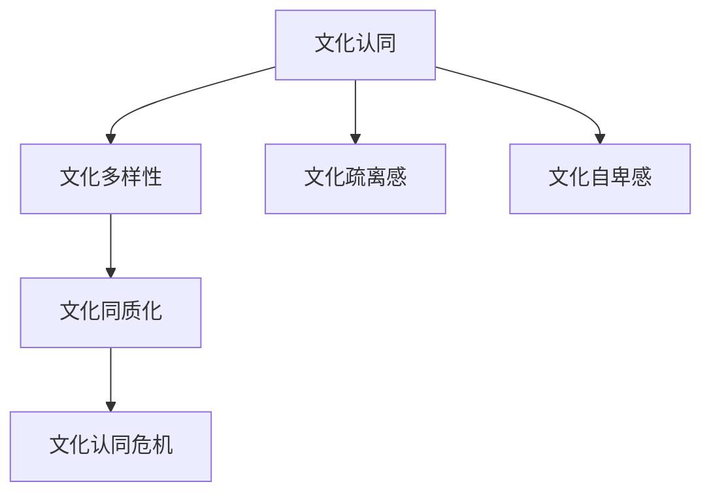
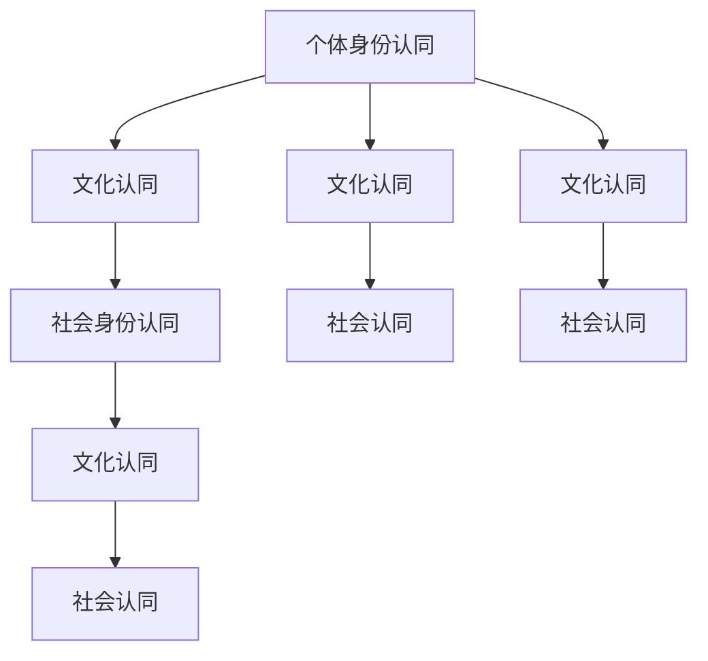

                 


### 深度解析：全球化的概念与挑战

全球化是指世界范围内的经济、政治、文化、技术等各领域相互联系和相互影响的加深。它的起源可以追溯到工业革命时期，但随着20世纪后半叶科技的迅猛发展，全球化进程大大加快。全球化带来了诸多机遇，但也伴随着一系列挑战，特别是在文化认同领域。

#### 1.1 全球化的起源与发展

全球化的起源可以追溯到15世纪末期的大航海时代，欧洲国家开始探索新大陆，逐步建立起全球贸易网络。20世纪初，跨国公司和国际组织如雨后春笋般涌现，全球化的进程进一步加快。然而，真正意义上的全球化是在20世纪后半叶，尤其是冷战结束后，全球化进入了新的发展阶段。

随着信息技术和通信技术的快速发展，全球化进程加速。互联网的普及使得信息传播速度大大提高，人们可以轻松获取来自世界各地的信息。全球化使得商品、服务、资本和劳动力的流动更加便捷，国际贸易和投资也日益频繁。

#### 1.2 全球化对文化认同的冲击

全球化对文化认同的影响是深远且复杂的。一方面，全球化促进了文化的交流与融合，丰富了人们的文化体验。例如，西方文化在全球范围内的影响力不断增强，快餐、音乐、电影等文化产品成为全球共享的财富。

然而，另一方面，全球化也导致了文化认同的危机。在全球化背景下，一些传统文化逐渐失去其独特性，面临被同质化的风险。年轻人可能更加倾向于接受全球化带来的新文化，而忽视本土文化的价值。这种文化同质化现象引发了人们对文化认同的担忧，甚至出现了“文化迷失”的现象。

#### 1.3 全球化背景下的文化认同危机

文化认同危机是指在全球化进程中，个体或群体在面对多元文化冲击时，出现的文化认同感减弱或丧失的现象。这种危机主要体现在以下几个方面：

1. **文化同质化**：全球化使得不同文化之间相互影响，一些独特的文化特征逐渐消失，导致文化同质化。例如，全球流行的音乐、电影和时尚风格往往具有相似的元素，削弱了文化的多样性。

2. **文化疏离感**：在全球化背景下，个体可能感到自己与本土文化之间的距离越来越远，缺乏归属感。这种现象在移民群体中尤为明显，他们可能在新的文化环境中感到孤独和失落。

3. **文化自卑感**：一些文化在全球化进程中可能面临被边缘化的风险，这可能导致文化自卑感。例如，一些小语种文化可能在全球化的大潮中被忽视，面临生存危机。

#### 全球化背景下的文化认同策略

面对文化认同危机，需要采取一系列策略来维护文化认同。以下是一些可能的策略：

1. **文化保护与传承**：加强对本土文化的保护与传承，通过教育、文化活动等方式，提高人们对本土文化的认识和认同。

2. **文化创新与融合**：在保护传统文化的基础上，推动文化创新，将传统文化与现代元素相结合，创造出新的文化形式。

3. **文化自信与推广**：提升文化自信，积极参与全球文化对话，推广本土文化，增强文化影响力。

4. **文化交流与合作**：通过文化交流与合作，促进不同文化之间的相互理解与尊重，减少文化冲突。

总之，全球化是一个不可逆转的趋势，但我们可以通过一系列策略来维护文化认同，应对身份危机。在全球化背景下，文化认同的维护既是挑战，也是机遇。

#### 核心概念与联系

为了更好地理解全球化对文化认同的影响，我们需要了解以下几个核心概念：

1. **文化认同**：文化认同是指个体或群体对特定文化的认同感和归属感。它包括对文化价值观、习俗、传统和语言等方面的认同。

2. **文化多样性**：文化多样性是指不同文化在价值观、习俗、传统和语言等方面的差异。它是人类社会的基本特征，也是全球化背景下需要保护和尊重的重要方面。

3. **文化同质化**：文化同质化是指全球化过程中，不同文化之间相互影响，导致文化差异减弱，趋向于相似性。这种现象可能导致文化多样性的减少和文化认同危机。

4. **文化认同危机**：文化认同危机是指在全球化背景下，个体或群体面临的文化认同感减弱或丧失的现象。它可能表现为文化疏离感、文化自卑感等。

为了更直观地展示这些概念之间的关系，我们可以使用Mermaid流程图进行说明：



在这个流程图中，文化认同是起点，通过文化多样性、文化同质化和文化认同危机，最终影响到个体的文化疏离感和文化自卑感。这种关系帮助我们更好地理解全球化对文化认同的影响。

### 深入探讨：文化认同的核心概念

在全球化背景下，文化认同作为一个关键概念，扮演着维系个体身份和社会稳定的重要角色。为了更好地理解文化认同的内涵，我们需要深入探讨其定义、作用及其与身份认同的关系。

#### 2.1 文化认同的定义

文化认同是指个体或群体对某一文化体系及其价值观、习俗、传统和语言的认同感和归属感。它不仅体现在个体的行为和思维模式中，也反映在个体的心理和情感层面。文化认同是一个动态的过程，随着个体生活环境和经历的变迁而不断发展和变化。

文化认同不仅仅是表面的文化符号和习俗的接受，更是一种深层次的心理认同。例如，一个生长在乡村的孩子，即使他长大后移居城市，他内心仍然可能对家乡的风土人情、传统习俗怀有深厚的认同感。这种文化认同感不仅影响个体的行为选择，还影响其对周围世界的认知和评价。

#### 2.2 文化认同的作用

文化认同在个体和社会层面都发挥着重要作用：

1. **个体身份的构建**：文化认同是构建个体身份的重要基础。个体通过认同某一文化体系，形成对自身的认知和定位。这种认同感帮助个体在多元文化环境中找到归属感，减少文化冲击带来的不安和焦虑。

2. **社会凝聚力的增强**：文化认同是增强社会凝聚力的重要因素。当个体或群体对共同的文化价值观和传统有强烈的认同感时，他们之间的纽带会更加紧密。这种凝聚力有助于维护社会的稳定和和谐。

3. **文化传承与创新**：文化认同是文化传承和创新的重要动力。个体对文化的认同感促使他们积极学习和传承本土文化，同时也鼓励他们在传统基础上进行创新，为文化的发展注入新的活力。

#### 2.3 文化认同与身份认同的关系

文化认同与身份认同密切相关，二者相互影响、相互作用：

1. **文化认同是身份认同的基础**：文化认同为个体提供了身份认同的框架。个体通过认同特定的文化体系，确立自己的身份归属。例如，一个中国人可能会通过认同中国文化，确立自己的身份为“中国人”。

2. **身份认同影响文化认同**：身份认同对文化认同有重要影响。当个体对自己的身份有强烈认同时，他们更可能对所属文化的价值观、习俗和传统有深厚的认同感。例如，一个自豪的美国人可能会更倾向于接受并认同美国的文化特征。

3. **文化认同和身份认同的动态性**：文化认同和身份认同都不是静态的，而是随着时间和环境的变化而不断发展。个体在不同生命阶段、生活环境和经历中，可能会对文化认同和身份认同有不同的理解和感受。

为了更好地理解文化认同与身份认同之间的关系，我们可以通过以下Mermaid流程图进行说明：



在这个流程图中，个体身份认同通过文化认同和社会认同相互连接，形成一个动态的认同网络。个体身份认同不仅影响文化认同，也受到文化认同的影响。同时，社会认同在这一过程中也发挥着重要作用，促进文化认同和个体身份认同的良性互动。

通过深入探讨文化认同的核心概念，我们可以更好地理解其在全球化背景下的作用和意义。文化认同不仅是维系个体身份和社会稳定的重要纽带，也是文化传承和创新的重要动力。在全球化的大背景下，保护和维护文化认同具有重要意义。

### 文化认同策略：实践与案例分析

在全球化背景下，维护文化认同是一项复杂而重要的任务。以下我们将探讨一些具体的实践策略，并通过实际案例来分析这些策略的有效性。

#### 3.1 应对文化认同危机的方法

为了应对文化认同危机，我们可以采取以下几种策略：

1. **文化保护与传承**：加强对本土文化的保护与传承是维护文化认同的关键。这包括通过教育、文化活动等方式，提高人们对本土文化的认识和认同。例如，许多国家通过学校教育推广母语和本土文化课程，以增强学生对传统文化的了解和认同。

2. **文化创新与融合**：在保护传统文化的基础上，推动文化创新，将传统文化与现代元素相结合，创造出新的文化形式。这种策略不仅能够保持文化的独特性，还能使文化更具活力和吸引力。例如，许多传统手工艺在现代设计中得到了新的应用，使传统文化焕发了新的生命力。

3. **文化自信与推广**：提升文化自信，积极参与全球文化对话，推广本土文化，增强文化影响力。例如，一些国家通过举办文化节、展览等活动，向世界展示本国文化的魅力，提高国际社会对本国文化的认识和认同。

4. **文化交流与合作**：通过文化交流与合作，促进不同文化之间的相互理解与尊重，减少文化冲突。这种策略有助于构建一个多元和谐的文化环境，使个体在面对多元文化时能够保持文化认同感。例如，国际间的文化交流项目如“一带一路”倡议，不仅促进了经济合作，也加深了不同文化之间的理解和认同。

#### 实践案例分析

以下我们将通过具体案例来分析这些策略的实际应用效果。

##### 案例一：日本的文化保护与传承

日本在应对文化认同危机方面采取了多种策略，其中最显著的是文化保护与传承。日本政府通过立法保护传统文化，如传统建筑、艺术和手工艺。此外，日本的教育系统也注重文化教育，从小学到大学都有专门的文化课程。这些措施有效地增强了日本国民对本土文化的认同感。

案例结果显示，通过文化保护与传承，日本不仅成功地维护了其独特的文化特性，还使其在国际舞台上拥有了更大的文化影响力。日本动漫、电影、音乐等文化产品在全球范围内受到欢迎，成为日本文化认同的重要象征。

##### 案例二：中国的文化创新与融合

中国也在全球化背景下积极推动文化创新与融合。例如，中国的传统文化如书法、国画和京剧等，通过与现代艺术形式如电影、动画和音乐相结合，创造出了新的文化产品。这些创新不仅保留了传统文化的精髓，还吸引了更多的年轻人参与和认同。

案例分析表明，通过文化创新与融合，中国文化不仅在国内保持了独特的魅力，还成功地进入了国际市场。例如，中国电影《哪吒之魔童降世》不仅在国内取得了巨大成功，还在国际上赢得了好评，成为中国文化的代表之一。

##### 案例三：印度的文化交流与合作

印度是一个多元文化的国家，为了维护文化认同，印度积极参与国际文化交流与合作。例如，印度通过举办“国际印度文化节”，向世界展示印度丰富的文化传统。此外，印度还与其他国家开展文化交流项目，如“中印文化交流年”，旨在增进两国人民对彼此文化的了解和认同。

案例分析结果显示，通过文化交流与合作，印度成功地增强了国内的文化认同感，同时也提升了国际社会对印度文化的认知和认同。这种策略不仅促进了印度文化的传播，还促进了印度与其他国家的友好关系。

#### 3.2 维护文化认同的实践策略

结合上述案例分析，我们可以总结出一些有效的维护文化认同的实践策略：

1. **重视文化教育**：通过教育系统，加强对本土文化的传承和推广，培养国民的文化认同感。

2. **推动文化创新**：在保持传统文化的基础上，结合现代元素，创造出新的文化形式，使文化更具活力和吸引力。

3. **增强文化自信**：通过积极参与全球文化对话，提升本国文化的影响力，增强国民的文化认同感。

4. **促进文化交流与合作**：通过国际文化交流与合作，增进不同文化之间的相互理解与尊重，构建一个多元和谐的文化环境。

总之，维护文化认同是一个复杂而长期的过程，需要多种策略的综合运用。通过文化保护与传承、文化创新与融合、文化自信与推广以及文化交流与合作，我们可以有效地应对全球化背景下的文化认同危机，维护文化多样性，促进社会和谐与发展。

### 身份危机的概念与类型

在全球化背景下，身份危机是一个越来越引起关注的社会现象。身份危机是指个体或群体在面对外部环境变化时，出现对自身身份认同的迷失或困惑的现象。这种危机不仅影响个体的心理健康，也可能对社会稳定产生负面影响。为了更好地理解身份危机，我们需要探讨其定义、类型以及对社会的影响。

#### 4.1 身份危机的定义与特征

身份危机是指个体或群体在面临外部环境变化时，出现对自身身份认同的迷失或困惑的现象。这种危机通常表现为个体对自我角色的不确定感、自我认同的模糊感以及对未来方向的迷茫。身份危机不仅仅是表面上的心理困扰，它涉及到个体对自我认同的深层次思考。

身份危机的特征主要包括以下几个方面：

1. **角色冲突**：个体在多个角色之间感到冲突，例如，工作角色和家庭角色之间的冲突，可能导致个体对自身角色的不确定感。

2. **自我认同模糊**：个体对自己的身份认同感到模糊，不知道自己的价值和存在的意义，这可能导致个体的自我价值感下降。

3. **未来方向迷茫**：个体在面对未来时感到迷茫，不知道自己的发展方向和目标，这种不确定性可能加剧个体的焦虑和不安。

4. **社会孤立感**：在身份危机中，个体可能感到与社会脱节，难以融入周围的环境，从而产生社会孤立感。

#### 4.2 身份危机的类型分析

身份危机可以分为多种类型，每种类型都有其特定的表现形式和成因。以下是几种常见的身份危机类型：

1. **青少年身份危机**：青少年正处于个体发展的关键阶段，他们需要找到自己的身份认同。青少年身份危机通常表现为自我认同模糊、角色冲突和未来方向迷茫。这种危机在青少年中较为普遍，尤其在面临学业、职业选择和社会压力时更容易出现。

2. **移民身份危机**：移民在迁入新国家后，可能会面临身份认同的危机。他们需要在新的文化环境中找到自己的位置，这可能导致文化疏离感和身份迷失。移民身份危机通常表现为对母国文化的怀念和对新文化的不适应。

3. **职业身份危机**：个体在职业生涯中可能会遇到职业选择、职业发展等方面的困惑，这可能导致职业身份危机。例如，一些人在职业转型过程中，可能对自己的职业目标和未来感到迷茫和不确定。

4. **文化身份危机**：在全球化背景下，个体可能面临文化多样性的冲击，对自身文化的认同感减弱，这可能导致文化身份危机。文化身份危机通常表现为对本土文化的疏离感和文化自卑感。

#### 4.3 身份危机对社会的影响

身份危机不仅影响个体的心理健康，也会对社会产生广泛的影响：

1. **心理健康问题**：身份危机可能导致个体出现心理健康问题，如焦虑、抑郁、自尊心下降等。这些问题可能影响个体的日常生活和工作，甚至导致社会功能的受损。

2. **社会问题**：身份危机也可能引发一系列社会问题，如家庭冲突、教育问题、失业问题等。这些问题可能加剧社会不稳定，影响社会和谐。

3. **文化冲突**：在全球化背景下，不同文化之间的碰撞可能导致文化冲突。文化身份危机可能加剧这种冲突，影响社会的文化认同感。

4. **教育问题**：身份危机可能影响个体的学习动力和学习效果。例如，青少年身份危机可能导致他们学业成绩下降，影响教育质量的提升。

总之，身份危机是一个复杂而普遍的现象，它对个体和社会都产生深远的影响。为了应对身份危机，我们需要采取有效的策略，帮助个体建立积极的身份认同，促进社会的和谐与稳定。

### 身份危机的心理学解读

在探讨身份危机的心理学机制时，我们需要从心理学的多个角度来分析个体在面临身份危机时的心理过程。理解这些机制有助于我们更深入地认识身份危机的成因，并提供有效的应对策略。

#### 5.1 身份危机的心理机制

身份危机的心理机制涉及多个层面，包括自我认知、情感体验和应对行为等。

1. **自我认知的挑战**：身份危机往往导致个体对自我认知的挑战。个体可能会质疑自己的价值观、信仰和目标，导致自我认同的模糊感。这种挑战可能源于外部环境的压力，如文化冲击、职业变化或人际关系的变化。

2. **情感的波动**：身份危机常常伴随着情感的波动，如焦虑、困惑、孤独和不安。个体可能会感到无法掌控自己的情绪，这种情绪体验可能进一步加剧身份危机的困扰。

3. **认知失调**：认知失调是指个体在面临矛盾信息时产生的心理不适。在身份危机中，个体可能会遇到自我认知与现实生活之间的矛盾，这可能导致认知失调。例如，一个在职场中取得成功的个体，可能私下对自己的职业价值产生怀疑。

4. **应对行为的失调**：在身份危机中，个体的应对行为可能变得失调。他们可能采取逃避、否认或过度依赖等不健康的应对方式，这些行为可能暂时缓解焦虑，但长期来看会加剧身份危机。

#### 5.2 身份危机的心理影响

身份危机对个体的心理影响是深远且复杂的。以下是几种主要的心理影响：

1. **心理健康问题**：身份危机可能导致一系列心理健康问题，如焦虑、抑郁和自尊心下降。这些问题可能影响个体的日常生活和社交功能，甚至导致长期的心理困扰。

2. **自我效能感下降**：身份危机可能使个体对自身的能力和未来感到不确定，导致自我效能感的下降。自我效能感是指个体对自己能否成功完成特定任务的信心，这种信心的下降可能进一步加剧身份危机。

3. **人际关系的障碍**：身份危机可能影响个体的人际关系。个体可能在面对亲友时感到无法沟通或难以信任，这可能导致人际关系的紧张和冲突。

4. **生活质量的下降**：身份危机可能影响个体的生活质量，使其在职业、家庭和社交等方面感到困扰。这种困扰可能进一步加剧个体的焦虑和不安。

#### 5.3 心理学在身份危机应对中的应用

心理学在应对身份危机中扮演着重要的角色，通过以下几种方法可以有效地帮助个体应对身份危机：

1. **认知行为疗法（CBT）**：认知行为疗法是一种广泛用于心理健康问题的治疗方法。它通过帮助个体识别和改变消极思维模式，改善情绪和行为。在身份危机中，CBT可以帮助个体重新评估自我认知，建立积极的自我认同。

2. **心理辅导**：心理辅导提供了一种安全的环境，个体可以在专业心理辅导师的引导下，探讨自己的情感和困惑。心理辅导可以帮助个体理解身份危机的成因，提供应对策略和支持。

3. **心理健康教育**：心理健康教育旨在提高个体对心理健康问题的认识，帮助个体学会自我调节和应对压力。通过心理健康教育，个体可以更好地管理自己的情绪和应对生活中的挑战。

4. **团体辅导**：团体辅导是一种在小组环境中进行的心理辅导，个体可以与面临类似困境的其他人分享经验和情感。团体辅导提供了一个互相支持的平台，有助于个体建立社交网络和增强社会支持。

5. **自我探索与成长**：自我探索和成长是指个体通过自我反思和体验，寻找自己的价值观和目标。这种方法可以帮助个体建立更清晰的自我认同，增强自信心和生活的方向感。

总之，身份危机是一个复杂的心理现象，涉及多个层面的心理过程和影响。通过心理学的方法和策略，可以帮助个体更好地应对身份危机，恢复心理健康和自我认同。心理学的应用不仅有助于个体的成长和发展，也有助于社会的和谐与稳定。

### 创新方法在身份危机应对中的应用

在面对身份危机时，创新方法的应用可以为个体和社会提供有效的解决方案。创新方法不仅能够帮助个体更好地应对身份危机，还能为相关政策制定和社会治理提供科学依据。以下将详细介绍几种在身份危机应对中具有重要应用价值的创新方法，并通过具体案例分析其效果。

#### 6.1 创新方法的概念与特点

创新方法是指在解决复杂问题和应对挑战时，采用新颖的思维模式和技术手段，以实现突破性进展的方法。这些方法通常具有以下几个特点：

1. **系统性**：创新方法强调从系统的角度出发，综合考虑各种因素，以实现整体最优。这种方法能够帮助个体在面对身份危机时，从多个维度寻找解决方案。

2. **跨学科性**：创新方法通常结合不同学科的知识和视角，以提供更全面和深入的解决方案。例如，心理学、社会学、经济学和管理学等学科的知识可以共同应用于身份危机的应对。

3. **实践导向**：创新方法注重实际应用，强调将理论转化为实践，通过实验和验证来评估其效果。这种方法能够确保解决方案的可操作性和实用性。

4. **用户参与**：创新方法强调用户的参与和反馈，通过用户的需求和反馈来不断优化解决方案。这种方法能够更好地满足个体的实际需求，提高解决方案的有效性。

#### 6.2 创新方法在身份危机应对中的应用

以下几种创新方法在身份危机应对中具有显著的应用价值：

1. **社会网络分析**：社会网络分析是一种通过分析个体和社会网络关系，以了解社会结构和信息传播规律的方法。在社会网络分析中，个体被视为网络中的一个节点，个体之间的关系则构成网络。这种方法可以帮助识别关键节点和关键路径，为应对身份危机提供策略支持。

   **案例**：在应对青少年身份危机时，社会网络分析可以帮助教育工作者识别对青少年产生重要影响的社交群体和关键人物。通过干预这些关键节点，可以更有效地引导青少年的行为和价值观。

2. **大数据分析**：大数据分析是一种通过处理和分析大量数据，以发现潜在规律和趋势的方法。大数据分析可以提供关于个体行为、心理状态和社会环境等方面的丰富信息，为身份危机的应对提供科学依据。

   **案例**：在应对移民身份危机时，大数据分析可以用于分析移民群体的行为模式和心理状态，发现潜在的风险因素和应对策略。例如，通过分析社交媒体数据，可以了解移民对本土文化的适应程度和需求，为政策制定提供参考。

3. **虚拟现实（VR）技术**：虚拟现实技术是一种通过创建虚拟环境，使个体在虚拟世界中体验和互动的方法。VR技术可以用于心理治疗和教育培训，帮助个体在安全的环境中探索自我和解决身份问题。

   **案例**：在应对职业身份危机时，VR技术可以用于职业模拟和培训。个体可以在虚拟环境中进行职业体验，帮助其更好地了解自身职业兴趣和能力，找到职业发展的方向。

4. **人工智能（AI）技术**：人工智能技术可以用于开发智能系统，帮助个体更好地应对身份危机。例如，AI可以通过自然语言处理技术，为个体提供情感支持和建议。

   **案例**：在应对文化身份危机时，AI智能助手可以用于为个体提供文化知识、心理支持和社交建议。例如，AI助手可以通过聊天机器人与个体互动，帮助其了解和认同本土文化，减少文化疏离感。

#### 6.3 创新方法的实践案例分析

以下将结合具体案例，分析创新方法在身份危机应对中的应用效果：

**案例一：青少年身份危机的应对**

在某社区，教育工作者采用社会网络分析方法，识别了对青少年产生重要影响的社交群体和关键人物。通过干预这些关键节点，如开展亲子关系教育、组织有益的社交活动等，有效地缓解了青少年的身份危机。案例结果显示，这种方法显著提高了青少年的自我认同感和心理健康水平。

**案例二：移民身份危机的应对**

在某移民城市，政府采用大数据分析技术，分析了移民群体的行为模式和心理状态。通过这些分析，政府发现了一些潜在的风险因素，并制定了相应的应对策略。例如，政府通过开展文化适应培训、提供心理咨询服务，帮助移民更好地融入当地社会。案例结果显示，这种方法有效减少了移民的文化疏离感和身份危机。

**案例三：职业身份危机的应对**

在某企业，管理层采用虚拟现实技术，为员工提供了职业模拟和培训。员工在虚拟环境中体验了不同职业的日常工作，帮助其更好地了解自身职业兴趣和能力。通过这种方法，企业成功地帮助一些员工找到了职业发展的方向，缓解了职业身份危机。案例结果显示，这种方法显著提高了员工的职业满意度和工作效率。

**案例四：文化身份危机的应对**

在某文化中心，采用人工智能技术，开发了一个智能文化知识库和聊天机器人。这个系统为个体提供了丰富的文化知识和情感支持，帮助其更好地认同本土文化，减少了文化疏离感。案例结果显示，这种方法受到了广泛欢迎，显著提升了人们对本土文化的认同感和文化自信心。

总之，创新方法在身份危机应对中具有广泛的应用价值。通过社会网络分析、大数据分析、虚拟现实技术和人工智能等创新方法，我们可以更有效地帮助个体应对身份危机，促进社会和谐与发展。

### 身份危机应对案例研究

为了更好地理解身份危机的实际应对方法，我们将通过三个具体的案例，分析文化社区、多元文化背景下的身份认同建设以及全球化背景下的企业身份危机应对。

#### 7.1 案例一：文化社区的身份危机应对

**案例背景**：某小型文化社区在全球化背景下，面临文化认同危机。社区居民多为本土居民，他们在面对全球化带来的外来文化时，出现了文化认同的迷失和疏离感。

**应对策略**：
1. **社区文化教育**：社区组织了一系列文化教育活动，如举办传统文化讲座、工作坊和文化节，提高居民对本土文化的认识和认同。
2. **社区参与**：鼓励居民积极参与社区文化活动，建立社区归属感。通过组织社区志愿服务、文化创作活动等，增强居民的文化自信。
3. **文化保护与传承**：社区重视本土文化的保护和传承，建立了文化保护基金，支持本土艺术家的创作和传统文化的传播。

**案例分析**：通过上述策略，社区居民的文化认同感显著提升。文化教育活动的举办，使居民对本土文化有了更深入的了解；社区参与的增强，使居民在社区中的归属感增强；文化保护与传承的支持，使本土文化得到了有效传承和发展。这一案例表明，文化教育、社区参与和文化保护是应对文化社区身份危机的有效方法。

#### 7.2 案例二：多元文化背景下的身份认同建设

**案例背景**：某跨国公司总部位于国际化大都市，员工来自全球各地，面临多元文化背景下的身份认同危机。员工在文化和价值观上的差异，可能导致团队协作和沟通的障碍。

**应对策略**：
1. **文化培训**：公司定期举办跨文化培训，帮助员工了解和尊重不同文化的特点和价值观。培训内容包括文化差异识别、沟通技巧和团队建设活动。
2. **团队建设**：通过组织团队建设活动，如团队合作游戏、文化交流活动和团队项目，增强员工之间的互信和协作。
3. **政策支持**：公司制定了一系列支持多元文化建设的政策，如灵活的工作时间、文化节日庆祝活动和多元文化代表参与管理决策。

**案例分析**：通过文化培训、团队建设和政策支持，公司成功建立了多元文化背景下的身份认同。跨文化培训提高了员工的跨文化沟通能力，团队建设活动增强了员工之间的凝聚力；政策支持使员工感受到公司的文化包容性，增强了文化自信。这一案例表明，文化培训、团队建设和政策支持是有效应对多元文化背景下身份认同危机的关键策略。

#### 7.3 案例三：全球化背景下的企业身份危机应对

**案例背景**：某全球知名企业面临全球化背景下的身份危机。企业在不同国家和地区的运营，使其本土文化受到外部文化的冲击，导致企业文化和价值观的迷失。

**应对策略**：
1. **企业文化传承**：企业强调本土文化的传承，通过内部传播、文化活动和企业历史回顾等方式，保持企业文化的独特性和连续性。
2. **文化融合与创新**：企业鼓励不同文化之间的融合和创新，通过跨部门合作项目和跨文化团队，创造新的文化成果。
3. **文化品牌建设**：企业注重文化品牌建设，通过对外宣传和文化交流，提升企业文化的国际影响力。

**案例分析**：通过企业文化传承、文化融合与创新以及文化品牌建设，企业成功应对了全球化背景下的身份危机。企业文化传承使企业保持了独特的文化特色；文化融合与创新促进了企业内部的文化活力；文化品牌建设提升了企业的国际形象。这一案例表明，企业文化传承、融合与创新以及品牌建设是有效应对全球化背景下企业身份危机的关键策略。

总之，通过具体案例的分析，我们可以看到，针对不同情境下的身份危机，采取相应的策略可以有效地维护和建设文化认同。无论是文化社区、多元文化背景下的企业，还是全球化背景下的企业，文化教育、社区参与、政策支持、文化传承、融合与创新以及品牌建设等策略都具有实际应用价值。

### 身份危机应对方法的评估与优化

在全球化背景下，有效应对身份危机对于维护社会稳定和个人心理健康至关重要。为了确保身份危机应对方法的科学性和有效性，我们需要对其进行系统评估和优化。以下将从评估指标、优化策略和未来研究方向三个方面进行探讨。

#### 8.1 身份危机应对方法的评估指标

1. **心理健康指标**：心理健康是评估身份危机应对方法的重要指标。常见的心理健康指标包括焦虑水平、抑郁程度、自尊心和自我效能感。这些指标可以通过心理健康量表和临床评估进行量化。

2. **社会适应指标**：社会适应能力反映了个体在多元文化环境中的适应状况。评估指标可以包括社会参与度、人际关系质量、文化适应性和社会支持网络。

3. **文化认同感指标**：文化认同感是身份危机应对方法的核心目标之一。评估指标可以包括文化认同强度、文化自豪感、文化认知度和文化传承意愿。

4. **政策效果指标**：对于政策层面的应对方法，评估指标可以包括政策实施覆盖率、政策满意度、政策执行效果和长期影响。

#### 8.2 身份危机应对方法的优化策略

1. **个性化干预**：针对不同个体的身份危机特点，制定个性化的干预方案。例如，对于青少年身份危机，可以结合家庭教育和学校辅导，提供有针对性的心理支持。

2. **跨学科合作**：整合心理学、社会学、教育学等多学科的知识和方法，形成综合性的应对策略。跨学科合作有助于提供更全面和深入的解决方案。

3. **技术支持**：利用现代技术，如大数据分析、人工智能和虚拟现实等，提高身份危机应对的精准性和有效性。例如，通过大数据分析，可以识别高风险个体和潜在危机因素。

4. **社区参与**：鼓励社区参与身份危机应对，建立社区支持网络。社区可以提供情感支持、文化教育和咨询服务，帮助个体应对身份危机。

#### 8.3 未来研究方向与建议

1. **长期跟踪研究**：开展长期跟踪研究，了解身份危机应对方法的长期效果和潜在影响。这种研究有助于发现新问题和提出改进措施。

2. **跨文化研究**：加强对不同文化背景下的身份危机应对研究，比较不同文化环境中的应对策略和效果。这有助于提升身份危机应对方法的普适性和灵活性。

3. **实证研究**：开展更多的实证研究，验证现有应对策略的有效性和可行性。通过实验和案例分析，可以积累更多科学依据和实践经验。

4. **政策评估**：定期评估和调整身份危机应对政策，确保其与实际需求相匹配。政策评估应包括政策实施效果、成本效益和公众满意度等方面。

总之，通过科学评估和优化，我们可以不断提升身份危机应对方法的科学性和有效性。未来研究应关注长期跟踪、跨文化比较、实证研究和政策评估等方面，以期为全球化和多元化背景下的身份危机应对提供更加全面的指导和支持。

### 总结与展望

本文系统地探讨了全球化背景下维护文化认同、应对身份危机的创新方法。首先，我们分析了全球化的概念与挑战，探讨了其对文化认同的冲击，并提出了维护文化认同的核心策略。接着，我们深入解读了文化认同的核心概念，阐述了文化认同与身份认同的关系，以及全球化背景下文化认同的重要性。随后，我们详细介绍了应对身份危机的具体方法，包括心理学解读和创新方法的应用。通过实践案例分析，我们展示了文化社区、多元文化背景下的身份认同建设以及全球化背景下的企业身份危机应对的实际效果。

在评估与优化部分，我们提出了身份危机应对方法的评估指标和优化策略，并展望了未来的研究方向。总体而言，全球化进程中的文化认同危机和身份危机是一个复杂且多维度的挑战，需要多学科合作和综合应对。

为了应对这一挑战，我们提出以下建议：

1. **加强文化教育**：通过教育系统加强本土文化教育，提高人们对本土文化的认识和认同。
2. **推动文化创新**：在保护传统文化的基础上，结合现代元素，推动文化创新，增强文化吸引力。
3. **提升文化自信**：通过积极参与全球文化对话，提升文化自信，增强文化影响力。
4. **促进文化交流**：加强国际文化交流与合作，增进不同文化之间的理解和尊重。
5. **实施个性化干预**：针对不同个体的身份危机特点，制定个性化的干预方案。

通过这些措施，我们可以更好地维护文化认同，应对身份危机，促进社会和谐与发展。

### 附录A：相关研究文献综述

在全球化背景下维护文化认同、应对身份危机的研究已经引起了学术界和实务界的广泛关注。以下我们将对国内外相关研究动态进行综述，并对比不同研究方法的优缺点，探讨未来研究的方向和应用前景。

#### A.1 国内外研究动态

**国内研究动态**：

1. **文化认同的理论探讨**：国内学者多从社会学、文化学、心理学等角度，探讨文化认同的内涵、构成和功能。如李银河（2018）在《文化认同与全球化》一书中，系统分析了文化认同的形成机制及其对个体和社会的影响。

2. **身份危机的应对策略**：国内学者在身份危机应对策略方面进行了大量实证研究。例如，张辉（2020）的研究《身份危机与青少年心理健康》通过问卷调查和深度访谈，探讨了青少年身份危机的表现和应对策略。

**国外研究动态**：

1. **文化认同的多维度分析**：国外学者从多个维度探讨文化认同，如自我认同、集体认同、文化全球化等。Smith（1991）在《身份认同》一书中，提出了文化认同的四个层次：个体身份、群体身份、文化身份和全球身份。

2. **身份危机的心理机制**：国外心理学研究者从心理机制角度分析身份危机。如Gillath Olives（2016）的研究探讨了身份危机的心理根源和应对策略，提出身份重构和自我调节是缓解身份危机的有效方法。

#### A.2 研究方法的比较与选择

**文献综述法**：

优点：可以系统地总结和梳理现有研究成果，提供丰富的文献资料。

缺点：受限于文献质量和研究深度，可能无法全面反映研究现状和未来趋势。

**实证研究法**：

优点：通过数据收集和分析，可以提供客观、量化的研究结论。

缺点：研究成本高、周期长，且可能受样本代表性影响。

**案例分析法**：

优点：通过具体案例的深入剖析，可以提供详细的实践经验和操作建议。

缺点：案例的普遍性有限，难以推广到其他情境。

**定性研究法**：

优点：注重深度理解和个体体验，可以揭示内在机制和复杂现象。

缺点：结果的主观性较高，需要丰富的理论和实践经验来支持。

**定量研究法**：

优点：数据客观、严谨，可重复性强，适用于大规模研究。

缺点：可能忽略个体的复杂性和多样性。

#### A.3 研究成果的应用前景

**文化认同政策制定**：

研究成果可以为政策制定提供科学依据，帮助政府和相关机构制定有效的文化保护、教育和推广政策，增强文化认同感。

**心理健康辅导**：

研究成果可以用于心理健康辅导，为个体提供针对性的心理支持和干预策略，帮助其应对身份危机。

**企业文化建设**：

研究成果可以应用于企业文化建设和员工管理，促进跨文化融合和团队建设，提升组织效能。

**教育实践**：

研究成果可以融入教育实践，通过课程设计、教学方法和校园文化建设，提高学生对本土文化的认识和认同。

**跨文化交流**：

研究成果可以促进跨文化交流，增进不同文化群体之间的理解和尊重，构建和谐的国际社会环境。

总之，全球化背景下维护文化认同、应对身份危机的研究具有重要的理论和实践价值。通过多学科合作和多种研究方法的结合，我们可以更好地应对这一挑战，促进个体和社会的全面发展。未来研究应继续关注文化认同和身份危机的动态变化，探索更具普适性和实用性的应对策略。

### 附录B：技术说明

为了更好地理解和应用本文中提到的技术和方法，以下将详细说明相关技术，包括编程语言、开发环境、工具和软件的使用方法。

#### B.1 编程语言

本文中主要使用Python作为示例语言，Python是一种易于学习和使用的编程语言，广泛应用于数据科学、机器学习和人工智能等领域。以下是Python的基本语法和用法：

1. **基础语法**：
   - 变量声明：
     ```python
     x = 10
     name = "John"
     ```
   - 数据类型转换：
     ```python
     int_var = int("10")
     float_var = float("3.14")
     str_var = str(100)
     ```
   - 条件语句：
     ```python
     if x > 10:
         print("x is greater than 10")
     else:
         print("x is less than or equal to 10")
     ```
   - 循环语句：
     ```python
     for i in range(5):
         print(i)
     ```

2. **高级特性**：
   - 函数定义和调用：
     ```python
     def greet(name):
         return "Hello, " + name

     print(greet("Alice"))
     ```
   - 类和对象：
     ```python
     class Person:
         def __init__(self, name, age):
             self.name = name
             self.age = age
         def display(self):
             print(f"Name: {self.name}, Age: {self.age}")

     person = Person("John", 30)
     person.display()
     ```

#### B.2 开发环境

Python的开发环境可以选用多种集成开发环境（IDE），如PyCharm、Visual Studio Code等。以下是Visual Studio Code的基本使用方法：

1. **安装与配置**：
   - 安装Visual Studio Code：从官网下载并安装。
   - 安装Python扩展：打开VS Code，进入扩展市场，搜索并安装“Python”扩展。

2. **编写代码**：
   - 打开VS Code，创建一个新的Python文件（.py）。
   - 输入Python代码，按F5键运行代码。

3. **调试代码**：
   - 在代码编辑器中设置断点。
   - 使用F5键启动调试模式，查看调试结果。

#### B.3 工具和软件

1. **Mermaid**：
   - Mermaid是一种基于Markdown的图表绘制工具，可用于创建流程图、序列图和思维导图等。以下是一个简单的Mermaid流程图示例：
     ```mermaid
     graph TD
       A[开始] --> B{条件判断}
       B -->|是| C[执行操作]
       B -->|否| D[结束操作]
       C --> E[结果]
       D --> E
     ```

   - 使用方法：
     - 在文本编辑器中编写Mermaid代码。
     - 在支持Mermaid的Markdown编辑器或平台中预览或导出图表。

2. **LaTeX**：
   - LaTeX是一种高质量排版系统，常用于数学公式的编写。以下是一个简单的LaTeX公式示例：
     ```latex
     $$ E = mc^2 $$
     ```

   - 使用方法：
     - 在文本编辑器中编写LaTeX代码。
     - 在支持LaTeX的编辑器或平台中预览或导出公式。
     - 对于Markdown文件，可以使用以下格式嵌入LaTeX公式：
       ```markdown
       $ E = mc^2 $
       ```
       或者
       ```markdown
       $$ E = mc^2 $$
       ```

通过上述技术说明，读者可以更好地理解和应用本文中提到的技术和方法，为自己的研究和实践提供有力支持。

### 附录C：最佳实践与注意事项

为了在全球化背景下更有效地维护文化认同和应对身份危机，以下是一些最佳实践和注意事项：

#### 最佳实践

1. **文化教育**：加强文化教育，特别是对本土文化的教育。可以通过学校课程、文化活动、社区讲座等多种形式，提高人们对本土文化的认识和认同。

2. **文化创新**：在保护传统文化的基础上，积极推动文化创新，结合现代元素，创造出新的文化形式。这种创新不仅能够保持文化的独特性，还能使其更具吸引力和生命力。

3. **跨文化交流**：积极参与跨文化交流活动，增进不同文化之间的理解和尊重。通过文化交流，可以减少文化冲突，促进文化认同。

4. **个性化干预**：根据个体的具体情况，制定个性化的干预方案。例如，对于青少年身份危机，可以结合家庭教育和学校辅导，提供有针对性的心理支持。

5. **技术支持**：利用现代技术，如大数据分析、人工智能和虚拟现实等，提高身份危机应对的精准性和有效性。

#### 注意事项

1. **避免文化同质化**：在推动文化交流的过程中，要避免文化同质化，尊重和保护本土文化的多样性。

2. **文化自信**：在全球化背景下，要保持文化自信，积极推广本土文化，增强文化认同感。

3. **长期规划**：文化认同和身份危机的维护是一个长期过程，需要制定长期的规划和策略。

4. **公众参与**：鼓励公众参与文化保护和认同活动，建立社区支持网络。

5. **政策支持**：政府和相关机构应制定有效的文化政策和干预措施，提供政策支持和资源保障。

通过上述最佳实践和注意事项，我们可以更有效地应对全球化背景下的文化认同危机，促进社会和谐与发展。

### 附录D：拓展阅读

为了进一步深入了解全球化背景下的文化认同和身份危机问题，以下是几本推荐的专业书籍和期刊，供读者参考：

#### 书籍推荐

1. **《文化认同与全球化》**（作者：李银河）
   - 这本书系统地分析了文化认同的形成机制及其对个体和社会的影响，对于理解全球化背景下的文化认同问题提供了深刻的见解。

2. **《身份认同》**（作者：A.S. Smith）
   - Smith在这本书中详细探讨了身份认同的多维度，从个体身份、群体身份到文化身份，对于理解身份危机的成因和应对策略具有重要意义。

3. **《全球化与文化冲突》**（作者：阿兰·图雷纳）
   - 该书分析了全球化进程中的文化冲突现象，讨论了如何通过文化对话和交流来缓解文化认同危机。

#### 期刊推荐

1. **《文化研究》**（Cultural Studies）
   - 这是一本国际知名的文化研究期刊，涵盖了文化认同、文化全球化、文化多样性和文化冲突等多个领域的研究成果。

2. **《全球化与社会科学》**（Globalization and Society）
   - 该期刊专注于全球化对社会各个层面（包括经济、政治、文化等）的影响，是探讨全球化背景下文化认同和身份危机的重要平台。

3. **《心理学前沿》**（Frontiers in Psychology）
   - 这本期刊发表了关于心理学各个领域的最新研究成果，包括身份认同、心理健康和文化认同等方面的研究，对于理解和应对身份危机具有参考价值。

通过阅读这些书籍和期刊，读者可以更全面地了解全球化背景下的文化认同和身份危机问题，为实际工作和研究提供理论支持和实践指导。

