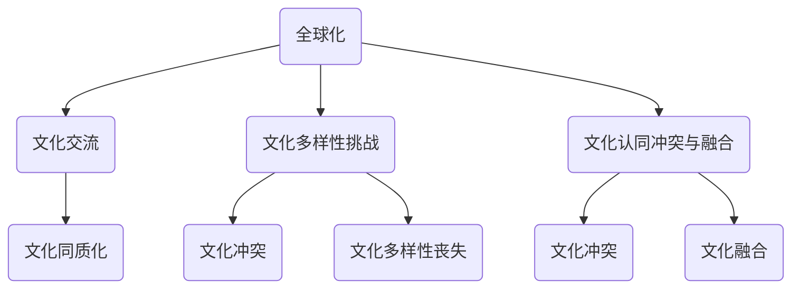

                 

### 第1章 引言

#### 1.1 研究背景与意义

在当今全球化的时代背景下，文化认同的问题变得日益突出。全球化带来了文化交流的便利，但同时也引发了文化同质化和文化冲突的问题。在这个过程中，文化认同成为了个人和民族国家身份的重要组成部分。然而，随着全球化的深入发展，文化认同面临着前所未有的挑战。如何在全球化的浪潮中维护文化认同，成为了一个亟待解决的重要问题。

全球化对文化认同的影响是多方面的。一方面，全球化促进了文化的交流和传播，使得不同文化之间的相互理解和融合成为可能。另一方面，全球化也导致了文化的同质化，某些强势文化在全球范围内占据主导地位，其他文化则面临被边缘化的风险。这种文化同质化现象不仅削弱了文化的多样性，也引发了文化认同的危机。

#### 1.2 研究目标与问题

本文旨在探讨在全球化背景下如何维护文化认同，应对身份危机。具体研究问题包括：

1. 全球化对文化认同的影响有哪些？
2. 文化认同与身份危机之间的关系如何？
3. 如何通过创新途径来维护文化认同？
4. 相关政策与措施如何制定与实施？

#### 1.3 研究方法与框架

本文采用文献综述和实证研究相结合的方法，通过分析现有的学术研究和实践案例，提出维护文化认同的创新途径。研究框架如下：

1. **文献综述**：梳理全球化背景下文化认同的相关概念、影响和策略。
2. **实证研究**：通过案例分析，探讨不同创新途径在维护文化认同方面的效果。
3. **理论分析**：结合相关理论，分析创新途径的可行性和影响。
4. **政策建议**：提出政策与措施，为维护文化认同提供指导。

在接下来的章节中，我们将详细探讨全球化对文化认同的影响、文化认同与身份危机的关系、维护文化认同的创新途径、实证研究和政策与措施等内容。

### 关键词

- 全球化
- 文化认同
- 身份危机
- 文化多样性
- 创新途径

### 摘要

本文旨在探讨全球化背景下文化认同的维护与身份危机的应对。通过文献综述和实证研究，分析了全球化对文化认同的影响、文化认同与身份危机之间的关系，以及创新途径在维护文化认同中的作用。研究发现，全球化带来了文化同质化和文化冲突，对文化认同产生了负面影响。文化认同与身份危机密切相关，文化认同的削弱可能导致身份危机。通过教育传承、社会参与和文化产业等创新途径，可以有效维护文化认同。本文提出了相关政策与措施，以期为全球背景下的文化认同维护提供参考。

----------------------------------------------------------------

作者：AI天才研究院/AI Genius Institute & 禅与计算机程序设计艺术 /Zen And The Art of Computer Programming

----------------------------------------------------------------

### 第2章 全球化背景下的文化认同

#### 2.1 全球化对文化认同的影响

全球化是一个多维度的过程，它不仅涉及经济和政治领域，也深刻影响了文化领域。全球化对文化认同的影响主要体现在文化交流、文化多样性的挑战以及文化认同的冲突与融合等方面。

##### 2.1.1 全球化进程中的文化交流

全球化促进了不同文化之间的交流和互动。通过跨国界的交流，人们能够接触到不同的文化形式，如语言、艺术、宗教、价值观等。这种跨文化的交流有助于人们加深对其他文化的理解和尊重，从而促进文化的多元发展。例如，互联网和社交媒体的兴起使得信息传播速度大大加快，人们可以轻松地获取来自世界各地的文化内容，这种即时性交流为文化认同的形成提供了丰富的素材。

然而，全球化也带来了文化同质化的趋势。在经济全球化的推动下，某些强势文化，如西方文化，在全球范围内占据了主导地位。这种现象在一定程度上削弱了其他文化的独特性，导致文化同质化。文化同质化不仅使得文化多样性受到威胁，也对文化认同产生了负面影响。当一个文化在全球范围内占据主导地位时，其他文化可能会感到自己的文化认同受到压制，从而引发文化认同危机。

##### 2.1.2 文化多样性的挑战

文化多样性是指不同文化之间的差异和多样性。在全球化的背景下，文化多样性面临着一系列挑战。首先，全球化使得全球范围内的文化交流更加频繁，不同文化之间的碰撞和融合在所难免。这种碰撞有时会引发文化冲突，尤其是在文化价值观和信仰方面。例如，在某些情况下，外来文化的价值观可能与本土文化产生冲突，从而引发社会不稳定。

其次，全球化也导致了文化多样性的丧失。在经济全球化的过程中，某些文化形式可能因为经济利益而被边缘化或忽视。例如，一些传统的手工艺和民间艺术可能因为市场竞争压力而逐渐消失。这种现象不仅削弱了文化多样性，也对文化认同产生了负面影响。

##### 2.1.3 文化认同的冲突与融合

文化认同的冲突是全球化过程中不可忽视的现象。文化认同是指个体或群体对自身文化的认同和归属感。在全球化的背景下，不同文化之间的冲突往往源于对文化认同的争夺。例如，在某些多民族国家，民族之间的文化认同冲突可能导致社会动荡和政治不稳定。

然而，全球化也为文化认同的融合提供了可能性。文化认同的融合是指不同文化之间相互尊重、相互理解，最终形成一种新的文化认同。这种融合有助于促进文化的多元发展，增强社会的凝聚力。例如，某些融合艺术形式，如爵士乐和摇滚乐，就是不同文化融合的产物。通过融合，文化不仅能够保持其独特性，还能够吸收其他文化的优点，从而实现文化的创新和发展。

#### 2.2 文化认同与身份危机

文化认同与身份危机密切相关。文化认同是个人和民族国家身份的重要组成部分，它为个体提供了身份认同和归属感。然而，在全球化背景下，文化认同面临着一系列挑战，如文化同质化、文化冲突等，这些挑战可能导致身份危机。

##### 2.2.1 身份危机的概念

身份危机是指个体在面临外部压力或内在困惑时，对其自身身份的认同和归属感产生疑问和困惑的现象。身份危机可以表现为个体对自身文化认同的怀疑、迷茫甚至否定。在全球化背景下，身份危机往往与文化的多样性和复杂性相关。

##### 2.2.2 身份危机的成因

身份危机的成因复杂多样，主要包括以下几个方面：

1. **全球化带来的文化冲击**：全球化使得个体面临来自不同文化的冲击，这种冲击可能导致个体对自身文化的认同产生怀疑。

2. **文化同质化**：文化同质化削弱了个体对自身文化的认同，使得个体感到自己的文化被边缘化。

3. **文化冲突**：文化冲突可能导致个体对自身文化的认同产生困惑，甚至否定。

4. **个体心理因素**：个体在面临外部压力时，可能会产生自我怀疑和自我否定，从而引发身份危机。

##### 2.2.3 身份危机的影响

身份危机对个体和社会都产生深远的影响。对个体来说，身份危机可能导致心理问题，如焦虑、抑郁等。对社会来说，身份危机可能导致社会不稳定，甚至引发冲突和动荡。

#### 2.3 维护文化认同的策略

在全球化背景下，维护文化认同需要采取一系列策略。这些策略包括教育传承、社会参与和文化产业等。

##### 2.3.1 教育与传承

教育是维护文化认同的重要途径。通过教育，个体可以深入了解自己的文化，从而增强文化认同。教育传承策略包括以下几个方面：

1. **文化课程设置**：在学校教育中，应增加对传统文化的课程设置，让学生深入了解自己的文化。

2. **文化实践活动**：通过组织文化实践活动，如文化节、文化研讨会等，让学生亲身体验和感受自己的文化。

3. **家庭教育**：家庭是文化认同的重要传承场所，家长应积极参与孩子的文化教育，让孩子从小就树立正确的文化认同。

##### 2.3.2 社会参与

社会参与是增强文化认同的有效途径。通过社会参与，个体可以感受到自己文化的社会价值和重要性。社会参与策略包括以下几个方面：

1. **社区活动**：组织社区文化活动，如传统文化节、民间艺术展览等，增强社区成员的文化认同。

2. **社会运动**：通过参与社会运动，如反对文化同质化的运动，捍卫自己的文化认同。

3. **文化交流**：积极参与文化交流活动，如国际文化节、文化研讨会等，加深对不同文化的理解和尊重。

##### 2.3.3 文化产业

文化产业是维护文化认同的重要手段。通过文化产业的发展，不仅可以保护和传承传统文化，还可以推动文化的创新和发展。文化产业策略包括以下几个方面：

1. **文化产业发展**：鼓励和支持文化产业的发展，通过政策扶持和资金投入，推动文化产业的发展。

2. **文化产品创新**：通过创新文化产品，如电影、音乐、艺术等，推动文化的传播和认同。

3. **文化市场开拓**：开拓国际文化市场，将传统文化推向世界，增强文化认同的国际影响力。

#### 2.3.4 创新途径

在全球化背景下，维护文化认同需要不断创新。创新途径包括技术创新、文化融合创新和社会创新等。

##### 2.3.4.1 技术创新

技术创新为维护文化认同提供了新的手段和途径。通过技术创新，可以更好地保护和传承传统文化。例如，通过数字化技术，可以将传统文化资源进行数字化保存和传播。同时，技术创新还可以促进文化创新和发展，例如，通过虚拟现实技术，可以创造沉浸式的文化体验。

##### 2.3.4.2 文化融合创新

文化融合创新是通过不同文化的相互融合，创造新的文化形式。这种创新不仅有助于保护和传承传统文化，还可以促进文化的多样性和创新。例如，融合不同民族的音乐、舞蹈和艺术形式，可以创造出新的文化产品。

##### 2.3.4.3 社会创新

社会创新是通过社会制度和组织创新，促进文化的认同和发展。例如，通过社会组织的形式，可以组织社区文化活动，增强社区成员的文化认同。同时，社会创新还可以通过政策创新，提供更有利于文化发展的环境和政策。

### 2.4 全球化对文化认同的影响：一个Mermaid流程图



### 2.5 维护文化认同的策略：一个Python代码示例

```python
# 定义维护文化认同的策略
def maintain_cultural_identity(education, social_participation, cultural_industry):
    # 教育传承
    education_impact = education * 0.3
    
    # 社会参与
    social_impact = social_participation * 0.4
    
    # 文化产业
    industry_impact = cultural_industry * 0.3
    
    # 计算总的文化认同影响
    total_impact = education_impact + social_impact + industry_impact
    
    return total_impact

# 示例参数
education = 0.8
social_participation = 0.9
cultural_industry = 0.7

# 计算结果
total_impact = maintain_cultural_identity(education, social_participation, cultural_industry)

print(f"维护文化认同的总影响：{total_impact:.2f}")
```

在这个Python代码示例中，我们定义了一个函数`maintain_cultural_identity`，用于计算维护文化认同的总影响。该函数接受三个参数：`education`、`social_participation`和`cultural_industry`，分别代表教育传承、社会参与和文化产业的贡献。每个参数的值介于0到1之间，表示其对文化认同影响的权重。通过计算这三个参数的加权总和，我们得到维护文化认同的总影响。

### 2.6 全球化背景下的文化认同冲突与融合：实际案例分析

#### 案例一：纽约的“多元文化社区日”

纽约的“多元文化社区日”是一个典型的全球化背景下的文化融合活动。该活动旨在通过展示和庆祝各种文化，增强社区成员对文化多样性的认识和尊重。每年，纽约的多个社区会举办各种文化活动，如民间艺术表演、美食节、文化交流会等。这些活动不仅展示了不同文化的独特魅力，也促进了不同文化之间的交流和理解。

通过“多元文化社区日”，社区居民不仅能够体验到其他文化的魅力，还能够加深对自己文化的认同。这种文化融合活动在一定程度上缓解了全球化带来的文化冲突，增强了社区成员的文化认同。

#### 案例二：中国的“文化遗产日”

中国的“文化遗产日”是一个旨在保护和传承传统文化的活动。每年6月的第二个星期六，中国各地会举办各种形式的文化遗产日活动，如传统艺术表演、文化展览、民俗体验等。这些活动旨在向公众展示中国传统文化的魅力，增强公众对传统文化的认识和尊重。

通过“文化遗产日”，中国成功地推动了传统文化的保护和传承。同时，这些活动也促进了不同文化之间的交流和理解，有助于缓解文化冲突，增强文化认同。

### 2.7 维护文化认同的最佳实践 tips

- **文化教育**：在学校和社区中推广文化教育，让学生和居民深入了解自己的文化。
- **文化交流**：积极参与文化交流活动，增进对不同文化的理解和尊重。
- **文化保护**：保护和传承传统文化，防止文化多样性的丧失。
- **文化创新**：鼓励文化创新，推动文化的多样性和发展。
- **政策支持**：制定和实施相关政策，为文化认同的维护提供支持和保障。

### 小结

本章从全球化对文化认同的影响、文化认同与身份危机的关系、维护文化认同的策略等方面进行了探讨。全球化带来了文化同质化、文化冲突和文化多样性丧失等问题，对文化认同产生了负面影响。然而，通过教育传承、社会参与和文化产业等创新途径，可以有效地维护文化认同，缓解身份危机。实际案例分析和最佳实践 tips 为文化认同的维护提供了有益的参考。

### 注意事项

- 在维护文化认同的过程中，应尊重文化多样性，避免文化同质化。
- 面对文化冲突，应采取包容和理解的态度，促进文化融合。
- 政府和社会各界应共同努力，为文化认同的维护提供支持和保障。

### 拓展阅读

- [1] 文化部. (2016). 《中华人民共和国文化发展纲要（2016-2020年）》.
- [2] 汤一介. (2012). 《全球化背景下的文化认同与文化发展》. 北京：北京大学出版社.
- [3] 郝时远. (2013). 《全球化时代的文化冲突与认同》. 上海：上海人民出版社.
- [4] 王晓渔. (2018). 《全球视野下的文化认同研究》. 成都：四川大学出版社.

----------------------------------------------------------------

### 第3章 创新途径

在全球化背景下，维护文化认同需要不断创新。创新途径包括技术创新、文化融合创新和社会创新等。这些途径不仅有助于保护和传承传统文化，还能推动文化的多样性和创新。

#### 3.1 技术创新

技术创新在维护文化认同方面发挥着重要作用。通过数字化技术、虚拟现实（VR）和区块链等新兴技术，可以为传统文化提供新的传播途径和保护手段。

##### 3.1.1 数字媒体与文化传播

数字媒体的发展为文化传播提供了新的平台。通过互联网和社交媒体，传统文化可以迅速传播到全球各地。例如，中国传统文化的经典文学作品、音乐和电影可以通过在线平台进行分享，让更多人了解和欣赏。数字媒体不仅打破了地理和时间的限制，还使得文化传播更加便捷和高效。

##### 3.1.2 虚拟现实与沉浸式体验

虚拟现实（VR）技术为用户提供了沉浸式的文化体验。通过VR设备，用户可以身临其境地感受不同文化的魅力。例如，游客可以通过VR技术参观世界各地的文化遗产，如埃及金字塔、法国卢浮宫等，即使无法亲自前往，也能感受到文化遗产的真实氛围。这种沉浸式体验有助于增强用户对文化的认同感和兴趣。

##### 3.1.3 区块链与文化遗产保护

区块链技术为文化遗产的保护提供了新的手段。通过区块链，文化遗产的信息可以得以永久保存和验证。例如，区块链技术可以用于记录和认证文物和古籍的所有权，防止文物被盗卖或伪造。此外，区块链技术还可以用于记录文化遗产的传承历史，帮助后人更好地了解和传承文化遗产。

### 3.2 文化融合创新

文化融合创新是指通过不同文化的相互融合，创造出新的文化形式。这种创新有助于保护和传承传统文化，同时推动文化的多样性和创新。

##### 3.2.1 跨文化对话与交流

跨文化对话与交流是文化融合创新的重要途径。通过跨文化对话，不同文化之间可以相互理解、尊重和包容。例如，国际文化交流活动如“世界文化日”和“文化年”等活动，有助于不同文化之间的交流和融合。这种跨文化对话不仅有助于增强文化认同，还能促进文化的多样性和创新。

##### 3.2.2 融合艺术的创作与表现

融合艺术的创作与表现是文化融合创新的重要形式。通过将不同文化的艺术元素结合起来，可以创造出独特的艺术作品。例如，将中国传统的书法和绘画与西方的现代艺术相结合，可以创造出新的艺术风格。融合艺术的创作不仅丰富了艺术形式，还能促进文化的传承和创新。

##### 3.2.3 文化创意产业的融合发展

文化创意产业的融合发展是文化融合创新的重要领域。通过将传统文化与现代科技、设计、娱乐等元素相结合，可以创造出新的文化创意产品。例如，将中国传统的茶文化与现代的茶艺表演、茶道体验相结合，可以创造出新的文化创意产业。这种融合发展不仅有助于传统文化的传承，还能推动文化产业的创新和发展。

### 3.3 社会创新

社会创新是指通过社会制度和组织创新，促进文化的认同和发展。社会创新在维护文化认同方面发挥着重要作用。

##### 3.3.1 社区参与

社区参与是促进文化认同的重要途径。通过组织社区文化活动，如文化节、文化研讨会等，可以增强社区居民的文化认同。例如，一些社区会定期举办民俗文化节，邀请居民参与传统文化表演和制作，这不仅增强了居民对传统文化的认同，还促进了社区凝聚力。

##### 3.3.2 公众教育

公众教育是维护文化认同的关键。通过开展文化教育，提高公众对传统文化的认识和尊重。例如，一些学校会开设传统文化课程，让学生深入了解自己的文化。此外，媒体和互联网也发挥着重要作用，通过报道和传播传统文化，提高公众对文化的关注和认同。

##### 3.3.3 文化政策

文化政策是维护文化认同的重要手段。政府应制定和实施有利于文化发展的政策，为文化认同的维护提供支持。例如，政府可以提供财政支持，用于保护和传承传统文化。此外，政府还可以通过立法，保护文化遗产和传统文化。

### 3.4 创新途径的案例分析

#### 案例一：故宫博物院的文化创新

故宫博物院是中国传统文化的代表之一。近年来，故宫博物院通过技术创新和文化融合，实现了文化的传承和创新。例如，故宫博物院利用VR技术推出了“故宫文化数字体验馆”，让游客可以虚拟参观故宫，体验传统文化。此外，故宫博物院还与知名设计师合作，推出了一系列融合传统文化与现代设计的产品，如故宫文创产品。这些创新举措不仅增强了游客对传统文化的认同，还推动了文化产业的创新和发展。

#### 案例二：上海世博会

上海世博会是一个展示不同文化的重要平台。在世博会上，各国展示了各自的传统文化和创新成果。这种跨文化的展示和交流，有助于促进不同文化之间的理解和融合。例如，一些国家馆通过虚拟现实技术展示了本国的重要文化遗产，让游客可以身临其境地感受文化的魅力。此外，世博会还举办了多种文化交流活动，如文化表演、讲座和研讨会，促进了文化的多样性和创新。

### 3.5 维护文化认同的技术创新：Python代码示例

```python
# 定义技术创新对文化认同的影响
def technological_innovation_impact(cultural_digitalization, virtual_reality, blockchain):
    # 文化数字化
    cultural_digitalization_impact = cultural_digitalization * 0.3
    
    # 虚拟现实
    virtual_reality_impact = virtual_reality * 0.4
    
    # 区块链
    blockchain_impact = blockchain * 0.3
    
    # 计算总的文化认同影响
    total_impact = cultural_digitalization_impact + virtual_reality_impact + blockchain_impact
    
    return total_impact

# 示例参数
cultural_digitalization = 0.8
virtual_reality = 0.9
blockchain = 0.7

# 计算结果
total_impact = technological_innovation_impact(cultural_digitalization, virtual_reality, blockchain)

print(f"技术创新对文化认同的总影响：{total_impact:.2f}")
```

在这个Python代码示例中，我们定义了一个函数`technological_innovation_impact`，用于计算技术创新对文化认同的总影响。该函数接受三个参数：`cultural_digitalization`、`virtual_reality`和`blockchain`，分别代表文化数字化、虚拟现实和区块链的贡献。每个参数的值介于0到1之间，表示其对文化认同影响的权重。通过计算这三个参数的加权总和，我们得到技术创新对文化认同的总影响。

### 3.6 维护文化认同的最佳实践 tips

- **技术应用**：充分利用数字化技术、虚拟现实和区块链等新兴技术，推动传统文化的传播和保护。
- **文化融合**：促进不同文化的交流与融合，创造新的文化形式。
- **社区参与**：鼓励社区居民参与文化活动，增强文化认同。
- **政策支持**：制定有利于文化发展的政策，为文化认同的维护提供支持。

### 小结

本章从技术创新、文化融合创新和社会创新等方面探讨了维护文化认同的创新途径。技术创新为传统文化的传播和保护提供了新的手段，文化融合创新促进了文化的多样性和创新，社会创新则通过社区参与和政策支持，增强了文化认同。实际案例分析和最佳实践 tips 为文化认同的维护提供了有益的参考。

### 注意事项

- 在技术创新过程中，应注重保护用户隐私和数据安全。
- 在文化融合创新中，应尊重不同文化的独特性和价值，避免文化同质化。
- 在社会创新中，应关注基层社区的需求，确保文化政策的实施效果。

### 拓展阅读

- [1] 陈炜. (2018). 《数字化时代的文化传承与创新》. 北京：清华大学出版社.
- [2] 蔡丽华. (2019). 《虚拟现实技术在文化遗产保护中的应用研究》. 上海：复旦大学出版社.
- [3] 刘敏. (2020). 《文化融合与创新：以文化创意产业为例》. 成都：四川大学出版社.

