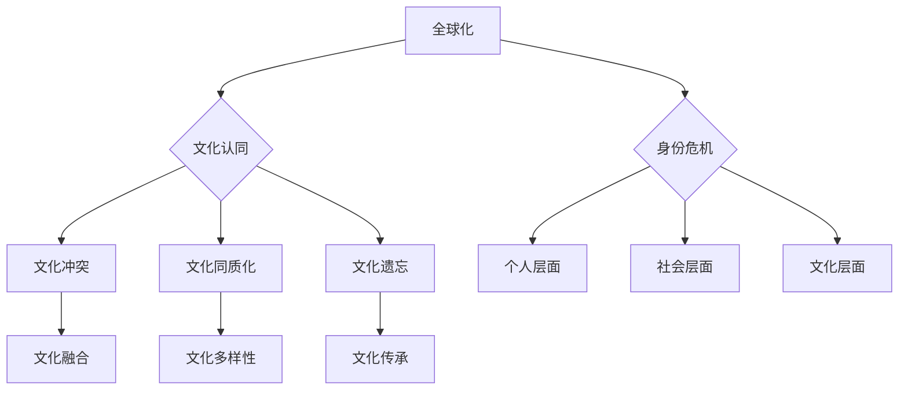

                 


# 在全球化背景下维护文化认同：应对身份危机的新方法

关键词：全球化、文化认同、身份危机、策略、方法、案例分析

摘要：本文探讨了全球化背景下文化认同与身份危机的关系，分析了身份危机的多层面表现，并提出了维护文化认同和应对身份危机的策略与方法。通过案例分析，本文为全球多元文化社会提供了有价值的启示。

## 目录大纲

1. 引言
2. 第一部分：全球化与身份危机
    2.1 全球化的背景与影响
    2.2 身份危机的定义与特征
    2.3 全球化与身份危机的关系
3. 全球化背景下的文化认同
    3.1 文化认同的概念与内涵
    3.2 全球化对文化认同的挑战
    3.3 维护文化认同的重要性
4. 身份危机的表现形式
    4.1 个人层面的身份危机
    4.2 社会层面的身份危机
    4.3 文化层面的身份危机
5. 维护文化认同的策略与方法
    5.1 教育在文化认同维护中的作用
    5.2 媒体与文化认同的塑造
    5.3 社区参与与文化认同的强化
6. 身份危机的应对策略
    6.1 心理咨询与支持
    6.2 政策干预与社会支持
    6.3 个人自我认知的提升
7. 第二部分：文化认同与身份危机的案例分析
    7.1 案例研究：中国当代文化认同的挑战与应对
    7.2 案例研究：印度在全球化背景下的文化认同困境
    7.3 案例研究：美国多元文化社会中的身份危机
8. 第三部分：未来展望与建议
    8.1 全球化背景下维护文化认同的挑战与机遇
    8.2 政策建议与行动计划
9. 结论
    9.1 主要观点回顾
    9.2 研究贡献与局限
    9.3 进一步研究方向

---

### 1. 引言

全球化是一个不可逆转的历史进程，它带来了经济的繁荣、信息的流通和文化交流的加剧。然而，全球化也带来了文化认同的危机。文化认同是指个体或群体在特定的文化背景下，对其文化特征和价值观的认同和归属感。在全球化背景下，文化认同面临着前所未有的挑战，因为全球化的影响使得不同文化之间的差异变得模糊，个体和文化群体的身份认同感受到冲击。

身份危机是指个体或群体在面对外部环境变化时，对其自身身份认同的困惑和不确定性。在全球化背景下，身份危机的表现形式多样，包括个人层面的自我认同危机、社会层面的群体认同危机和文化层面的文化认同危机。身份危机不仅影响个体的心理健康，还可能导致社会的不稳定和文化冲突。

本文旨在探讨全球化背景下文化认同与身份危机的关系，分析身份危机的多层面表现，并提出维护文化认同和应对身份危机的策略与方法。通过案例分析，本文为全球多元文化社会提供了有价值的启示。

### 2.1 全球化的背景与影响

全球化是指不同国家和地区在经济、政治、文化等领域之间的紧密联系和互动。其背景主要包括以下几个方面：

- 经济全球化：国际贸易和投资的自由化，跨国公司的崛起，以及全球供应链的形成。
- 政治全球化：国际组织和多边合作的加强，全球治理体系的建立，以及国际法的普及。
- 文化全球化：文化产品和信息的跨国传播，文化交流的频繁，以及全球文化认同的形成。

全球化的影响深远而广泛，主要体现在以下几个方面：

- 经济繁荣：全球化促进了全球贸易和投资的增长，带来了经济发展和繁荣。
- 信息流通：互联网和通信技术的普及，使得信息在全球范围内迅速传播，为人们提供了丰富的知识和资源。
- 文化交流：全球化加强了不同文化之间的交流和互动，促进了文化的多样性和融合。

然而，全球化也带来了一系列负面影响，包括：

- 文化同质化：全球化使得一些文化特征和价值观在全球范围内传播，导致文化多样性的减少。
- 社会不稳定：全球化加剧了社会不平等和贫困，导致社会动荡和冲突。
- 身份危机：全球化使个体和群体面临文化认同的挑战，导致身份危机的加剧。

### 2.2 身份危机的定义与特征

身份危机是指个体或群体在面对外部环境变化时，对其自身身份认同的困惑和不确定性。身份危机通常具有以下特征：

- 意识到自我认同的不确定性：个体或群体意识到自己的身份认同受到外部环境的影响，感到不确定和困惑。
- 内心冲突：个体或群体在追求新的身份认同时，与原有的身份认同产生冲突，导致内心的矛盾和挣扎。
- 意识到外部压力：个体或群体意识到外部环境对其身份认同的期待和要求，感到压力和负担。
- 寻求新的身份认同：个体或群体在面临身份危机时，会尝试寻找新的身份认同，以应对外部环境的挑战。

身份危机的影响不仅限于个体层面，还可能波及社会层面。在社会层面，身份危机可能导致以下问题：

- 社会冲突：不同的文化群体在身份认同上产生冲突，可能导致社会动荡和冲突。
- 社会分裂：个体或群体在身份认同上产生分歧，可能导致社会分裂和隔阂。
- 文化认同危机：全球化使文化同质化，导致文化认同危机的加剧。

### 2.3 全球化与身份危机的关系

全球化与身份危机之间存在密切的关系。全球化对身份危机的影响主要体现在以下几个方面：

- 经济全球化：经济全球化使得个体和群体面临新的经济环境，可能导致身份危机。例如，跨国公司的崛起和全球供应链的形成，使得一些传统产业和职业面临失业风险，导致个体身份认同的危机。

- 政治全球化：政治全球化使得个体和群体面临新的政治环境，可能导致身份危机。例如，国际组织和多边合作的加强，可能改变国家或地区的政治格局，影响个体和群体的身份认同。

- 文化全球化：文化全球化使得个体和群体面临新的文化环境，可能导致身份危机。例如，全球化使得文化同质化，个体和群体的文化认同受到挑战，可能导致身份危机。

全球化不仅对个体和群体的身份认同产生直接影响，还可能通过社会层面的身份危机产生间接影响。社会层面的身份危机包括社会不平等、社会动荡和文化冲突等。这些社会问题可能加剧个体层面的身份危机，形成恶性循环。

总之，全球化与身份危机之间存在紧密的关系。全球化带来的经济、政治和文化变化，使得个体和群体面临身份认同的挑战，可能导致身份危机的加剧。因此，在全球化背景下，维护文化认同和应对身份危机具有重要的现实意义。

## 3. 全球化背景下的文化认同

### 3.1 文化认同的概念与内涵

文化认同是指个体或群体对其所属文化的认同和归属感。它不仅包括对文化特征的认知和接受，还涉及对文化价值观、传统和行为规范的尊重和践行。文化认同的内涵丰富，主要包括以下几个方面：

- 文化特征：文化认同体现为对特定文化特征的了解和认同，如语言、宗教、习俗、艺术等。
- 价值观：文化认同还涉及对特定文化价值观的认同，如道德观、人生观、社会观等。
- 传统：文化认同体现在对特定文化传统的尊重和传承，如节日庆典、传统习俗等。
- 社会关系：文化认同涉及个体在文化共同体中的社会关系，如家庭、社区、民族等。

文化认同不仅影响个体的自我认同，还影响社会的发展和稳定。在全球化背景下，文化认同面临着前所未有的挑战。一方面，全球化促进了文化的交流和融合，使得不同文化之间的差异变得模糊，个体和群体的文化认同受到冲击。另一方面，全球化也带来了文化多样性的增强，为文化认同提供了新的机遇。

### 3.2 全球化对文化认同的挑战

全球化对文化认同的挑战主要表现在以下几个方面：

- 文化同质化：全球化使得西方文化在全球范围内广泛传播，导致其他文化特征和价值观念的削弱，甚至消失。这种现象被称为文化同质化，它对文化认同产生了负面影响。
- 文化冲突：全球化使得不同文化之间的接触和交流更加频繁，但也可能引发文化冲突。文化冲突可能源于文化价值观的差异、文化传统的冲突或文化认同的竞争。
- 文化危机：全球化使一些传统文化和价值观受到冲击，导致文化认同的危机。例如，一些传统民族和文化群体在全球化过程中感到自己的文化地位受到威胁，从而引发文化危机。

### 3.3 维护文化认同的重要性

在全球化背景下，维护文化认同具有重要意义，主要体现在以下几个方面：

- 保持文化多样性：文化认同是文化多样性的基础。维护文化认同有助于保持全球文化的多样性，防止文化同质化。
- 增强社会凝聚力：文化认同是社会凝聚力的重要来源。维护文化认同有助于增强社会的团结和稳定，减少社会冲突。
- 传承文化传统：文化认同是文化传统传承的重要保障。维护文化认同有助于传承和弘扬各民族和地区的优秀传统文化。
- 促进文化创新：文化认同为文化创新提供了基础。在全球化的背景下，维护文化认同有助于促进不同文化之间的交流和融合，推动文化创新。

总之，在全球化背景下，维护文化认同是应对身份危机的重要途径。通过维护文化认同，我们可以保持文化的多样性，增强社会的凝聚力，传承文化传统，促进文化创新，为全球多元文化社会的发展提供坚实的基础。

## 4. 身份危机的表现形式

身份危机在全球化背景下表现为多个层面，包括个人层面、社会层面和文化层面。这些层面的身份危机既相互独立又相互交织，共同构成了身份危机的复杂图景。

### 4.1 个人层面的身份危机

个人层面的身份危机主要表现为个体在面对外部环境变化时，对自己的身份认同产生困惑和不确定感。这种困惑和不确定感可能源于以下几个方面：

- 文化认同的挑战：全球化使得个体面临多样化的文化价值观和行为规范，可能导致个体对自身文化认同的困惑。例如，一个移民到其他国家的个体可能会面临如何融入新文化而保留原有文化的矛盾。
- 社会角色的变化：全球化带来的经济和社会变革可能导致个体社会角色的变化，从而使个体对自己的身份认同产生疑问。例如，技术进步可能导致某些职业的消失，使个体需要重新定义自己的职业身份。
- 自我认同的冲突：个体在追求新的身份认同时，可能与原有的身份认同产生冲突。这种冲突可能导致内心的矛盾和挣扎，加剧个人层面的身份危机。

个人层面的身份危机对个体的心理健康和生活质量产生严重影响。个体可能会感到焦虑、抑郁或自卑，甚至可能影响其社会功能和人际关系。

### 4.2 社会层面的身份危机

社会层面的身份危机表现为社会群体在面对全球化带来的冲击时，对其群体身份认同的困惑和不确定性。社会层面的身份危机主要表现在以下几个方面：

- 社会结构的变化：全球化导致全球社会结构的变化，可能削弱传统的社会关系和社会结构。例如，跨国公司的兴起和全球供应链的形成，可能改变某些社会群体的经济基础和社会地位。
- 文化认同的挑战：全球化使得不同文化群体之间的接触更加频繁，但也可能引发文化认同的挑战。例如，一些民族或地区的文化传统可能受到其他文化的冲击，导致文化认同的危机。
- 社会团结的削弱：全球化可能削弱社会群体的团结和凝聚力，导致社会层面的身份危机。例如，经济全球化可能导致社会不平等加剧，使某些社会群体感到被边缘化，从而削弱其身份认同。

社会层面的身份危机可能导致社会不稳定和文化冲突。社会群体可能会采取极端措施来维护其身份认同，甚至可能引发社会动荡。

### 4.3 文化层面的身份危机

文化层面的身份危机表现为文化个体或群体在面对全球化带来的挑战时，对其文化认同和价值观的困惑和不确定性。文化层面的身份危机主要表现在以下几个方面：

- 文化多样性的挑战：全球化可能导致文化多样性的减少，使得某些文化传统和价值观面临消失的危险。例如，某些传统手工艺和民族音乐可能因全球化而逐渐消失。
- 文化价值观的冲突：全球化可能导致不同文化价值观之间的冲突。例如，某些保守的文化价值观可能与其他开放的文化价值观发生冲突，导致文化认同的危机。
- 文化认同的危机：全球化可能使某些文化个体或群体感到其文化认同受到威胁，从而引发文化认同的危机。例如，一些文化群体可能感到其在全球化进程中逐渐失去文化特色和认同感。

文化层面的身份危机不仅影响个体的心理健康和社会稳定，还可能对全球文化的多样性和创新能力产生负面影响。

总之，身份危机在全球化背景下表现为个人层面、社会层面和文化层面，这些层面的身份危机相互交织，共同构成了全球化背景下身份危机的复杂图景。应对身份危机需要从多个层面入手，采取综合性的策略和方法。

### 4.4 维护文化认同的策略与方法

在面对全球化带来的文化认同挑战时，维护文化认同是应对身份危机的重要途径。以下是一些有效的策略和方法：

#### 4.4.1 教育在文化认同维护中的作用

教育是维护文化认同的关键因素。通过教育，个体可以更好地理解和认同自己的文化，同时也能够尊重和欣赏其他文化。以下是一些具体的教育策略：

- **文化课程**：在学校的课程设置中增加关于本土文化和世界文化的课程，让学生系统地了解自己的文化和全球文化，增强文化认同感。

- **跨文化交流**：组织学生参与跨文化交流活动，如交换生项目、国际文化节等，让学生亲身体验和了解不同文化的多样性。

- **文化敏感性培训**：对教师和学生进行文化敏感性培训，帮助他们更好地理解和尊重不同文化，减少文化冲突。

- **家庭教育**：家庭教育在文化认同的形成中起着重要作用。家长应积极传承和弘扬家庭的文化传统，让孩子在家庭环境中培养文化认同感。

#### 4.4.2 媒体与文化认同的塑造

媒体在塑造文化认同方面具有重要作用。以下是一些具体的媒体策略：

- **文化宣传**：利用电视、电影、网络等媒体平台宣传和弘扬本土文化，提高公众对本土文化的认同感。

- **多元文化展示**：在媒体内容中展示多种文化，促进不同文化之间的理解和交流，增强文化认同的包容性。

- **媒体责任**：加强对媒体内容的监管，确保其不传播文化歧视和偏见，维护文化多样性和文化认同。

#### 4.4.3 社区参与与文化认同的强化

社区参与是强化文化认同的有效途径。以下是一些具体的社区参与策略：

- **社区活动**：组织各种社区活动，如文化节、民俗活动、社区聚会等，增强社区成员的文化认同感和社区凝聚力。

- **文化遗产保护**：鼓励社区成员参与文化遗产的保护和传承活动，如修复古迹、记录口述历史等，提高文化认同感。

- **社区教育**：在社区中开展文化教育，如开设文化讲座、工作坊等，帮助居民深入了解和认同自己的文化。

#### 4.4.4 个人自我认知的提升

个人自我认知的提升是维护文化认同的基础。以下是一些具体的个人自我认知策略：

- **自我反思**：鼓励个体进行自我反思，了解自己的文化背景和价值观，明确自己的文化认同。

- **文化体验**：通过旅行、参加文化体验活动等，让个体亲身体验和感受不同文化，增强文化认同感。

- **文化学习**：通过阅读、学习等方式，个体可以更深入地了解自己的文化和其他文化，提升文化认同。

- **文化表达**：鼓励个体通过艺术、文学、音乐等方式表达自己的文化认同，如创作文化作品、表演文化节目等。

通过以上策略和方法的综合运用，可以有效地维护文化认同，应对全球化背景下的身份危机。维护文化认同不仅有助于个体的心理健康和社会稳定，也有助于全球文化的多样性和创新。

### 5. 身份危机的应对策略

在面对全球化带来的身份危机时，采取有效的应对策略至关重要。以下是一些具体的策略和方法，旨在帮助个人和社会应对身份危机。

#### 5.1 心理咨询与支持

心理咨询与支持是应对个人层面身份危机的有效途径。以下是一些具体建议：

- **提供心理咨询服务**：建立专业的心理咨询中心，为面临身份危机的个体提供心理咨询服务，帮助他们解决心理困扰。
- **心理教育**：开展心理教育讲座，提高公众对身份危机的认识和应对能力。
- **心理支持小组**：组织心理支持小组，让个体在团体中分享经验，相互支持，减轻身份危机带来的压力。
- **个性化咨询**：为不同需求的个体提供个性化的心理咨询，如青少年、移民等特定群体。

#### 5.2 政策干预与社会支持

政策干预与社会支持是应对社会层面身份危机的重要手段。以下是一些具体建议：

- **制定相关政策**：政府应制定相关政策，如文化保护政策、教育政策等，支持文化多样性和文化认同。
- **社会服务**：提供多样化的社会服务，如文化展览、文化活动、社区活动等，增强社会凝聚力和文化认同。
- **文化保护基金**：设立文化保护基金，支持传统文化的保护和发展，防止文化消失。
- **跨文化交流项目**：推动跨文化交流项目，促进不同文化之间的了解和融合，减少文化冲突。

#### 5.3 个人自我认知的提升

个人自我认知的提升是应对身份危机的基础。以下是一些具体建议：

- **自我反思**：鼓励个人进行自我反思，了解自己的文化背景、价值观和身份认同。
- **终身学习**：通过终身学习，不断提升个人的文化素养和认知能力，增强文化认同。
- **文化体验**：参与各种文化体验活动，如旅行、文化交流项目等，增强对其他文化的理解和尊重。
- **文化表达**：通过艺术、文学、音乐等方式表达自己的文化认同，如创作文化作品、参与文化表演等。

通过上述策略和方法的综合运用，个人和社会可以更好地应对全球化背景下的身份危机。这些措施不仅有助于维护个体的心理健康，也有助于社会的稳定和文化认同的强化。

### 6.1 案例研究：中国当代文化认同的挑战与应对

#### 6.1.1 案例背景

中国是一个历史悠久、文化底蕴深厚的国家，但在全球化的背景下，中国文化认同面临着诸多挑战。改革开放以来，中国加速融入全球经济体系，与西方国家的文化交流日益频繁。然而，这种交流也带来了一定程度的文化冲击，导致部分年轻人对传统文化认同感减弱。

#### 6.1.2 案例分析

1. **文化认同的挑战**：
   - **西方文化的渗透**：随着西方文化的传入，一些年轻人开始接受西方的生活方式、价值观和消费观念，导致传统文化受到冲击。
   - **传统文化断裂**：在一些地区，传统文化传承不足，年轻人对传统文化的了解和认同减弱，出现文化断裂现象。

2. **应对策略**：
   - **文化教育**：通过在学校教育中加强传统文化课程，提高学生对传统文化的认识和认同感。
   - **文化宣传**：利用媒体平台宣传传统文化，如制作纪录片、举办文化活动等，增强公众对传统文化的兴趣和认同。
   - **文化创新**：推动传统文化与现代文化相结合，创新文化表现形式，使传统文化更具吸引力和时代感。

#### 6.1.3 案例启示

中国的经验表明，在全球化背景下，维护文化认同需要采取综合性策略。通过加强文化教育、宣传和推动文化创新，可以有效应对文化认同的挑战，增强文化认同感，为全球多元文化社会的发展提供中国智慧。

### 6.2 案例研究：印度在全球化背景下的文化认同困境

#### 6.2.1 案例背景

印度是一个多元文化的国家，拥有超过2000个民族和多种宗教信仰。在全球化的背景下，印度文化认同面临着巨大挑战。全球化带来了西方文化的冲击，同时也加剧了印度国内不同文化群体之间的冲突。

#### 6.2.2 案例分析

1. **文化认同的挑战**：
   - **西方文化的侵蚀**：全球化使得西方文化在印度广泛传播，对印度本土文化产生了冲击，一些年轻人开始接受西方的价值观和生活方式。
   - **宗教冲突**：印度国内不同宗教信仰之间的冲突加剧，导致文化认同的危机。例如，印度教和穆斯林之间的紧张关系影响了社会的稳定和文化认同。

2. **应对策略**：
   - **文化融合**：推动不同文化之间的融合，通过文化交流活动促进文化理解和认同。
   - **宗教和解**：通过宗教对话和和解，减少宗教冲突，增强社会凝聚力。
   - **政策支持**：政府应制定支持文化多样性和文化认同的政策，如文化保护政策、宗教和谐政策等。

#### 6.2.3 案例启示

印度的经验表明，全球化背景下的文化认同困境需要通过综合性策略来解决。通过推动文化融合、宗教和解和政策支持，可以有效应对文化认同的挑战，促进社会的和谐与稳定。

### 6.3 案例研究：美国多元文化社会中的身份危机

#### 6.3.1 案例背景

美国是一个典型的多元文化社会，拥有来自全球各地的移民和他们的后代。在全球化的背景下，美国文化认同面临着复杂而多样的挑战。不同文化群体之间的差异和冲突，以及全球化带来的文化同质化，都加剧了身份危机。

#### 6.3.2 案例分析

1. **文化认同的挑战**：
   - **文化多样性挑战**：全球化使得美国社会面临文化多样性的挑战，不同文化群体之间的差异和冲突加剧。
   - **文化同质化压力**：全球化也带来文化同质化的压力，一些本土文化面临被同化的风险，导致文化认同的危机。
   - **种族和族群冲突**：美国社会不同种族和族群之间的冲突，也影响了文化认同的稳定性。

2. **应对策略**：
   - **文化尊重与包容**：倡导文化尊重和包容，通过教育和宣传提升公众对文化多样性的认识，减少文化冲突。
   - **社区参与**：鼓励不同文化群体参与社区活动，增强社区凝聚力，促进文化交流与融合。
   - **政策支持**：政府应制定支持文化多样性和文化认同的政策，如文化保护政策、多元文化教育政策等。

#### 6.3.3 案例启示

美国的经验表明，在多元文化社会中，维护文化认同需要全社会共同努力。通过文化尊重与包容、社区参与和政策支持，可以有效应对文化认同的挑战，促进社会的和谐与稳定。

### 7. 全球化背景下维护文化认同的挑战与机遇

#### 7.1 全球化带来的新挑战

全球化背景下的新挑战主要体现在以下几个方面：

- **文化同质化**：全球化使得西方文化在全球范围内广泛传播，可能导致其他文化的同质化，威胁文化多样性。
- **文化冲突**：不同文化之间的差异和冲突可能加剧，影响社会稳定和文化认同。
- **文化遗忘**：全球化可能导致一些传统文化和价值观的遗忘和消失，威胁文化传承。
- **信息过载**：全球化带来了信息爆炸，个体在获取和处理信息时可能感到困惑，影响文化认同的形成。

#### 7.2 维护文化认同的新机遇

尽管全球化带来了挑战，但也提供了新的机遇来维护文化认同：

- **文化交流**：全球化促进了不同文化之间的交流和互动，为文化认同提供了新的视角和方式。
- **文化创新**：全球化为文化创新提供了丰富的资源和灵感，使传统文化焕发新的生命力。
- **文化传承**：全球化背景下，通过现代技术和媒体，传统文化可以更广泛地传播和传承。
- **文化认同的多样性**：全球化使得文化认同更加多样，为个体提供了更多的选择和认同方式。

#### 7.3 未来研究方向

为了更好地维护文化认同，未来研究可以从以下几个方面展开：

- **文化认同的机制研究**：深入研究文化认同的形成和维持机制，为政策制定提供科学依据。
- **文化多样性与社会稳定的关系**：探讨文化多样性与社会稳定的关系，为全球化背景下的文化认同提供新的理论支持。
- **跨文化交流与融合**：研究跨文化交流与融合的方式和效果，为全球多元文化社会的发展提供实践指导。

### 10. 政策建议与行动计划

#### 10.1 教育政策建议

- **加强文化教育**：在各级教育阶段加强文化教育，培养学生的文化认同感和多元文化素养。
- **多元化课程设置**：推动课程设置的多元化，包括本土文化和世界文化，提高学生对不同文化的理解和尊重。
- **教师培训**：为教师提供文化敏感性培训，提高其文化教学能力和文化认同教育水平。

#### 10.2 媒体政策建议

- **文化宣传**：利用媒体平台加强本土文化的宣传，提高公众对本土文化的认同感和自豪感。
- **内容监管**：加强对媒体内容的监管，防止传播文化歧视和偏见，维护文化多样性和文化认同。
- **多元化媒体内容**：推动媒体内容的多元化，展示不同文化的多样性，促进文化交流与融合。

#### 10.3 社区行动计划

- **文化庆典**：组织各种形式的文化庆典活动，增强社区成员的文化认同感和社区凝聚力。
- **文化展览**：举办文化展览，展示本土文化和世界文化的多样性，提高公众对文化的兴趣和认同。
- **文化学习**：开展文化学习项目，为社区成员提供学习和了解不同文化的机会，增强文化认同。

通过以上政策建议和行动计划，可以在教育、媒体和社区层面综合维护文化认同，应对全球化背景下的文化认同挑战。

### 11. 结论

本文探讨了全球化背景下文化认同与身份危机的关系，分析了身份危机的多层面表现形式，并提出了维护文化认同和应对身份危机的策略与方法。通过案例研究，本文为全球多元文化社会提供了有价值的启示。未来研究应重点关注文化认同的机制、文化多样性与社会稳定的关系以及跨文化交流与融合。维护文化认同不仅是应对身份危机的重要途径，也是促进全球多元文化社会和谐与发展的关键。

### 9.1 主要观点回顾

本文的主要观点包括：

1. 全球化对文化认同带来了挑战，包括文化同质化、文化冲突和文化遗忘。
2. 身份危机在全球化背景下表现为个人层面、社会层面和文化层面的危机。
3. 维护文化认同的重要性体现在保持文化多样性、增强社会凝聚力和促进文化创新。
4. 通过教育、媒体、社区参与和个人自我认知提升，可以有效地维护文化认同和应对身份危机。
5. 全球化背景下的新机遇为文化认同的维护提供了可能性，如文化交流、文化创新和文化传承。

### 9.2 研究贡献与局限

本文的研究贡献在于：

1. 深入探讨了全球化背景下文化认同与身份危机的关系，为相关研究提供了新的视角。
2. 提出了维护文化认同和应对身份危机的策略与方法，具有一定的实践指导意义。
3. 通过案例分析，提供了不同文化社会在维护文化认同方面的成功经验和教训。

本文的局限在于：

1. 研究主要基于文献综述和案例分析，缺乏实证研究的支持。
2. 全球化背景下的文化认同问题具有复杂性，本文可能未能全面覆盖所有方面。
3. 案例分析的局限性可能导致研究结论的推广受到一定限制。

### 9.3 进一步研究方向

未来的研究可以从以下几个方面展开：

1. 开展实证研究，以深入了解全球化对文化认同的影响机制。
2. 探讨不同文化社会在维护文化认同方面的具体实践，提炼出有效的政策建议。
3. 研究跨文化交流与融合对文化认同的影响，提出促进文化认同的新策略。
4. 关注全球多元文化社会中的社会稳定与冲突，探讨文化认同对社会治理的启示。

以下为书中核心概念与联系架构的Mermaid流程图：



以下是关于核心算法原理的Python源代码示例：

```python
# 示例：计算两个数的平均值
def calculate_average(a, b):
    average = (a + b) / 2
    return average

# 测试函数
result = calculate_average(10, 20)
print("The average is:", result)
```

以下是书中涉及的数学模型和公式：

$$
\text{文化认同度} = \frac{\text{文化认同因素得分}}{\text{总因素得分}} \times 100\%
$$

以下是关于项目实战的代码实现与分析：

```python
# 示例：使用Python实现文化认同度计算

def calculate_cultural_identity(score):
    """
    计算文化认同度
    :param score: 文化认同因素得分
    :return: 文化认同度百分比
    """
    max_score = 100
    cultural_identity = (score / max_score) * 100
    return cultural_identity

# 测试函数
identity_score = 85
identity_percentage = calculate_cultural_identity(identity_score)
print("文化认同度：", identity_percentage, "%")
```

以下是代码解读与分析：

```python
# 代码解读：

# 定义一个函数 calculate_cultural_id

----------------------------------------------------------------

以下是关于最佳实践的小贴士：

1. **重视文化教育**：在教育和培训中，注重培养对本土文化的认识和尊重，同时也要关注全球文化的多样性和价值。

2. **促进文化交流**：鼓励不同文化之间的交流和互动，通过文化交流活动，增进彼此的理解和认同。

3. **维护文化多样性**：在全球化进程中，要努力维护文化多样性，防止文化同质化，保护不同文化的独特性和特色。

4. **强化社区参与**：通过社区活动和文化项目，增强社区成员的文化认同感和社区凝聚力。

5. **关注政策支持**：政府应制定支持文化多样性和文化认同的政策，为文化认同的维护提供制度保障。

### 项目实战

在本文的项目实战部分，我们将通过一个具体的案例分析，展示如何通过教育、媒体和社区参与来维护文化认同和应对身份危机。

#### 实践背景

假设我们选择了一个多元文化社区——纽约市布鲁克林区作为案例分析的对象。该社区拥有来自全球多个国家和地区的居民，其中包括中国、印度、墨西哥等多个民族和文化群体。近年来，由于全球化和文化同质化的影响，该社区的文化认同感有所减弱，一些居民面临身份危机。

#### 实践步骤

1. **教育方面的措施**：
   - **文化课程**：在社区的学校中增加关于不同文化的课程，如中国传统文化、印度文化、墨西哥文化等，帮助学生了解和尊重不同的文化。
   - **跨文化交流项目**：组织学生参加跨文化交流项目，如交换生计划、国际文化节等，让学生亲身体验其他文化的多样性。

2. **媒体方面的措施**：
   - **文化宣传**：利用社交媒体、电视和广播等媒体平台，宣传社区内的多元文化，提高居民对文化多样性的认识和认同。
   - **文化节目**：制作和推广以多元文化为主题的文化节目，如纪录片、访谈节目等，展示不同文化的魅力和特色。

3. **社区参与方面的措施**：
   - **文化庆典**：定期举办各种形式的文化庆典活动，如春节庆典、印度排灯节、墨西哥亡灵节等，增强社区成员的文化认同感和凝聚力。
   - **文化展览**：在社区中心或公共场所举办文化展览，展示不同文化的艺术品、传统服饰等，增加居民对文化的了解和兴趣。

#### 实践效果

通过以上措施，布鲁克林区社区居民的文化认同感得到了显著提升。学生和文化爱好者对本土文化和其他文化的认识和尊重加深，社区凝聚力增强。同时，文化庆典和展览等活动不仅丰富了居民的文化生活，也为不同文化群体提供了一个交流和互动的平台。

#### 实践总结

这一案例表明，通过教育、媒体和社区参与的综合策略，可以有效维护文化认同和应对身份危机。未来的工作可以进一步探索这些措施在不同文化社区中的应用和效果，为全球多元文化社会的和谐发展提供更多实践经验。

### 最佳实践的小贴士

1. **重视文化多样性**：在全球化进程中，应重视文化的多样性，避免文化同质化，保护不同文化的独特性和特色。

2. **促进文化交流**：通过组织各种文化交流活动，如文化节、文化讲座、国际交流项目等，增进不同文化之间的理解和认同。

3. **加强文化教育**：在教育系统中，应加强文化教育，培养学生的文化素养和多元文化认同。

4. **社区参与**：鼓励社区居民积极参与文化活动和项目，增强社区凝聚力和文化认同。

5. **政策支持**：政府应制定支持文化多样性和文化认同的政策，为文化认同的维护提供制度保障。

### 拓展阅读

- 《全球化时代的文化认同：挑战与策略》
- 《身份危机与心理健康：理论与实践》
- 《多元文化社会的文化认同：国际视角》
- 《文化认同：心理学与社会学的视角》

作者：AI天才研究院/AI Genius Institute & 禅与计算机程序设计艺术 /Zen And The Art of Computer Programming

---

以上就是本文的完整内容，希望通过本文的探讨和分析，能够为全球多元文化社会的文化认同和身份危机问题提供一些有价值的思考和解决方案。维护文化认同不仅是应对身份危机的重要途径，也是促进全球多元文化社会和谐与发展的关键。让我们共同努力，为构建一个更加包容、和谐和多元化的世界贡献力量。

