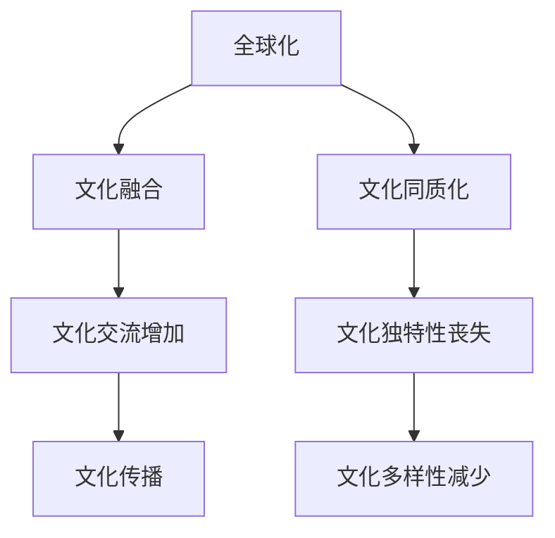
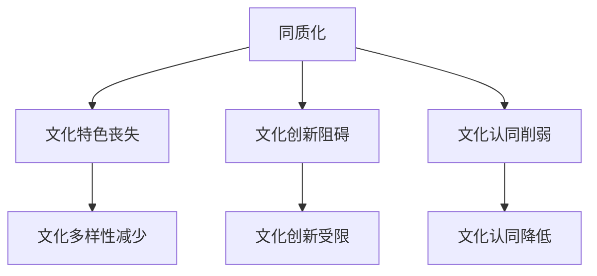
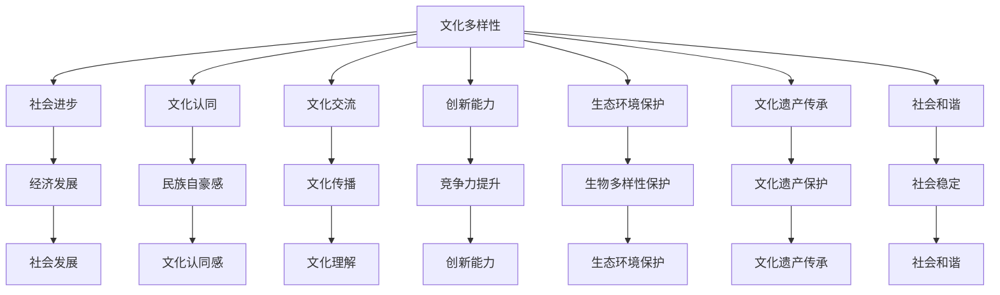
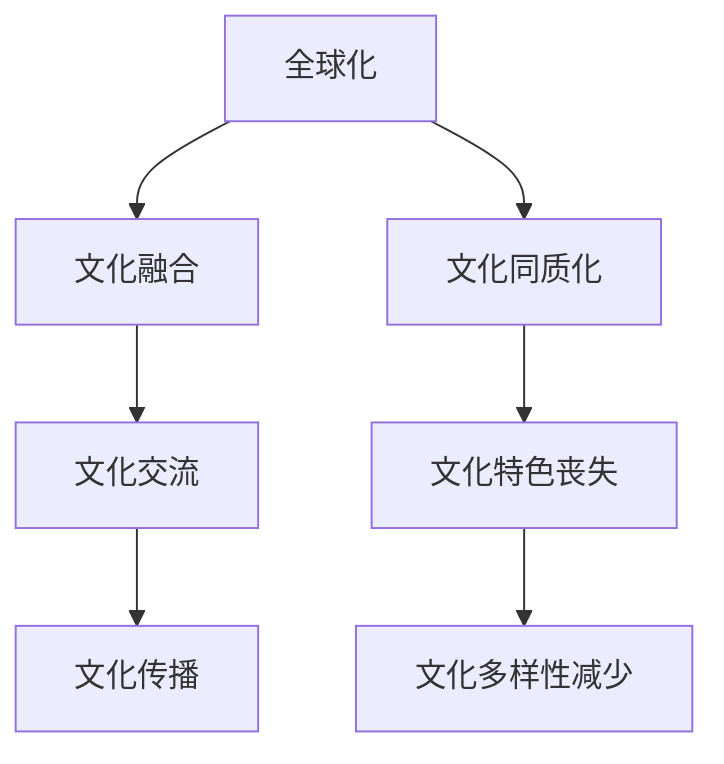

                 

### 第1章：全球化趋势下的文化同质化

#### 1.1 全球化的定义与影响

全球化是一个复杂而多维的概念，它涉及经济、政治、文化等多个领域。全球化可以定义为各国经济、政治、文化等领域的相互依赖和互动程度的不断加深。全球化的主要驱动力包括全球贸易的增加、信息技术的发展、跨国公司的崛起以及全球政治合作机制的建立。

##### 1.1.1 全球化概念的提出

全球化概念最早可以追溯到20世纪50年代，当时的学者们开始关注国家间经济互动的增强。随着国际经济合作的发展，全球化逐渐成为一个重要的研究领域。在20世纪80年代和90年代，全球化进入了一个新的阶段，这一阶段的全球化不仅包括了经济领域的深度融合，还涵盖了政治、文化和科技等领域的全球化。

##### 1.1.2 全球化的主要驱动力

全球化的主要驱动力包括以下几点：

1. **全球贸易的增加**：全球贸易的增加是全球化的重要表现之一。国际贸易使得各国经济更加紧密地联系在一起，促进了资源、产品和服务的跨国流动。
   
2. **信息技术的发展**：信息技术的快速发展极大地促进了全球化的进程。互联网、智能手机等技术的普及，使得人们可以更加便捷地获取和共享信息，缩短了地理上的距离。

3. **跨国公司的崛起**：跨国公司在全球化进程中扮演了重要角色。它们通过在国外设立分支机构，实现了生产、销售和服务的全球化。

4. **全球政治合作机制的建立**：全球政治合作机制的建立，如联合国、世界贸易组织等国际组织，有助于各国在政治、经济、文化等领域进行合作，推动全球治理体系的完善。

##### 1.1.3 全球化对文化多样性的影响

全球化对文化多样性产生了深远的影响。一方面，全球化促进了文化交流和融合，使得不同文化之间的互动更加频繁，有助于文化的传播和多元化。另一方面，全球化也可能导致文化同质化，即不同文化在全球化进程中逐渐趋同，失去了原有的独特性。

**Mermaid 流程图：全球化对文化多样性的影响**

全球化带来的文化融合和同质化现象，对文化多样性产生了双重影响。一方面，文化融合使得全球文化更加丰富多彩，为人类文明的发展提供了新的动力。另一方面，文化同质化可能导致一些文化特色逐渐消失，使得全球文化变得更加单一。

**核心概念与联系：**

- **全球化**：各国经济、政治、文化等领域的相互依赖和互动程度的不断加深。
- **文化多样性**：不同文化在思想、价值观、传统、习俗等方面的差异和丰富性。
- **文化融合**：不同文化在全球化过程中相互影响、相互吸收的过程。
- **文化同质化**：不同文化在全球化过程中逐渐趋同，失去了原有的独特性。

这些核心概念之间存在着密切的联系。全球化是推动文化多样性发展的动力，而文化多样性是全球化的重要成果。文化融合和文化同质化则是全球化对文化多样性的两种不同影响。

#### 1.2 同质化的概念与表现

##### 1.2.1 同质化的定义

同质化是指在不同文化或社会现象之间出现相似或趋同的现象。在全球化背景下，同质化现象尤为明显。同质化可以表现在文化、经济、社会等多个层面。

##### 1.2.2 同质化的主要表现

1. **产品和服务标准化**：随着全球化的发展，跨国公司为了满足全球市场的需求，不断推出标准化的产品和服务。这种标准化导致不同地区的产品和服务趋于一致。

2. **语言趋同**：英语作为全球通用语言，在全球范围内得到了广泛使用。这导致其他语言的使用受到限制，一些地区性的语言逐渐消失。

3. **文化和娱乐产业同质化**：全球化和互联网的发展，使得全球文化和娱乐产业逐渐趋同。流行文化、电影、音乐等在全球范围内传播，导致不同地区的文化特色受到冲击。

4. **生活方式的趋同**：全球化使得人们的消费观念、生活方式逐渐趋同。例如，快节奏的生活、快餐文化等在全球范围内普及。

##### 1.2.3 同质化对文化多样性的威胁

同质化对文化多样性的威胁主要体现在以下几个方面：

1. **文化特色的丧失**：同质化可能导致一些具有独特文化特色的文化现象消失，使得文化多样性减少。

2. **文化创新的阻碍**：同质化使得不同文化之间的差异减少，限制了文化创新的可能。

3. **文化认同的削弱**：同质化可能导致人们对自身文化的认同感降低，影响文化传承。

**Mermaid 流�程图：同质化对文化多样性的威胁**

同质化现象虽然在一定程度上促进了全球化的发展，但也对文化多样性带来了负面影响。保护文化多样性需要我们认识到同质化的威胁，采取有效的措施来应对。

**核心概念与联系：**

- **同质化**：在不同文化或社会现象之间出现相似或趋同的现象。
- **文化多样性**：不同文化在思想、价值观、传统、习俗等方面的差异和丰富性。
- **文化特色丧失**：同质化导致具有独特文化特色的文化现象消失。
- **文化创新阻碍**：同质化限制不同文化之间的差异，影响文化创新。

这些核心概念之间存在着密切的联系。同质化是全球化进程中的一种现象，它对文化多样性产生了直接或间接的影响。保护文化多样性需要我们认识到同质化的威胁，并采取有效的措施来应对。

### 1.3 文化多样性的重要性

文化多样性是指不同文化在思想、价值观、传统、习俗等方面的差异和丰富性。文化多样性是人类社会发展的重要组成部分，具有极高的价值。

#### 1.3.1 文化多样性的定义

文化多样性是一个多层次、多维度的概念。它不仅包括不同民族、不同地区、不同群体的文化差异，还包括不同文化在表达、传承、创新等方面的多样性。

#### 1.3.2 文化多样性的价值

文化多样性的价值主要体现在以下几个方面：

1. **促进社会进步**：文化多样性为人类社会提供了丰富的思想资源和创造力，促进了社会的进步和发展。

2. **增强文化认同**：文化多样性使得人们能够更好地认识和认同自身文化，增强了民族自豪感和文化认同感。

3. **促进文化交流**：文化多样性为不同文化之间的交流提供了契机，促进了文化的传播和融合。

4. **提升创新能力**：文化多样性为创新提供了丰富的资源，有助于提升社会的创新能力和竞争力。

#### 1.3.3 文化多样性与可持续发展

文化多样性与可持续发展密切相关。可持续发展要求我们在发展经济的同时，保护环境和文化遗产。文化多样性为此提供了重要的基础和保障。

1. **保护生态环境**：文化多样性为不同地区提供了独特的生态智慧和文化传统，有助于保护生态环境和生物多样性。

2. **传承文化遗产**：文化多样性有助于传承和保护各民族的文化遗产，防止文化遗产的流失和消失。

3. **促进社会和谐**：文化多样性有助于不同文化之间的相互理解和尊重，促进社会的和谐与稳定。

**Mermaid 流程图：文化多样性与可持续发展**

文化多样性不仅是人类社会的重要财富，也是可持续发展的重要基础。保护文化多样性，不仅有助于维护人类社会的多样性和繁荣，也有助于实现可持续发展的目标。

### 1.3.4 文化多样性与全球化

全球化对文化多样性的影响是一个复杂且多维的问题。一方面，全球化促进了文化交流和融合，使得不同文化之间的互动更加频繁，有助于文化的传播和多元化。另一方面，全球化也可能导致文化同质化，即不同文化在全球化进程中逐渐趋同，失去了原有的独特性。

**Mermaid 流程图：文化多样性与全球化的关系**

文化多样性在全球化背景下具有重要的地位和作用。文化多样性不仅是全球化的重要成果，也是全球化进程中需要保护和弘扬的重要价值。保护文化多样性，需要我们认识到全球化对文化多样性的双重影响，采取有效的措施来应对文化同质化的威胁。

**核心概念与联系：**

- **文化多样性**：不同文化在思想、价值观、传统、习俗等方面的差异和丰富性。
- **全球化**：各国经济、政治、文化等领域的相互依赖和互动程度的不断加深。
- **文化融合**：不同文化在全球化过程中相互影响、相互吸收的过程。
- **文化同质化**：不同文化在全球化过程中逐渐趋同，失去了原有的独特性。

这些核心概念之间存在着密切的联系。全球化是推动文化多样性发展的动力，而文化多样性是全球化的重要成果。文化融合和文化同质化则是全球化对文化多样性的两种不同影响。保护文化多样性，需要我们认识到全球化对文化多样性的双重影响，采取有效的措施来应对文化同质化的威胁。

---

### 总结

在全球化趋势下，文化同质化现象日益严重，对文化多样性构成了威胁。保护文化多样性不仅关乎人类社会的多样性和繁荣，也是实现可持续发展的重要基础。我们需要认识到全球化对文化多样性的双重影响，采取有效的措施来应对文化同质化的挑战。

首先，应加强政策与法律框架的建设，制定国际公约和国家层面的法律，为文化多样性保护提供法律保障。其次，应通过社会与文化保护措施，如教育、宣传、经济激励和社区参与，促进文化多样性的传承和发展。同时，数字技术的应用也为文化多样性的记录、传播和保护提供了新的途径。

此外，国家间的合作和国际组织的参与对于全球文化多样性保护至关重要。通过全球合作，可以共同应对文化多样性面临的挑战，推动文化多样性的可持续发展。

总之，在全球化背景下，保护文化多样性是我们共同的责任。只有通过多方努力，才能实现文化多样性的可持续发展，为人类社会创造一个更加丰富和多彩的未来。

### 附录

#### 附录A：参考文献

1. United Nations. (2017). *Transforming our world: The 2030 Agenda for Sustainable Development*. Retrieved from [https://sustainabledevelopment.un.org/post2015/transformingourworld](https://sustainabledevelopment.un.org/post2015/transformingourworld)
2. UNESCO. (2018). *Universal Declaration of Cultural Diversity*. Retrieved from [https://en.unesco.org/themes/cultural-diversity/universal-declaration-cultural-diversity](https://en.unesco.org/themes/cultural-diversity/universal-declaration-cultural-diversity)
3. Hirschman, E. C. (1991). *The book of culture*. HarperCollins.
4. Arquilla, J., & Ronfeldt, D. F. (2001). *The emergence of a digital guerilla warfare*. *Defense Analysis*, 17(3), 245-258.
5. Castells, M. (1996). *The rise of the network society*. Wiley-Blackwell.

#### 附录B：术语表

- **全球化**：各国经济、政治、文化等领域的相互依赖和互动程度的不断加深。
- **文化多样性**：不同文化在思想、价值观、传统、习俗等方面的差异和丰富性。
- **同质化**：在不同文化或社会现象之间出现相似或趋同的现象。
- **文化融合**：不同文化在全球化过程中相互影响、相互吸收的过程。
- **文化同质化**：不同文化在全球化过程中逐渐趋同，失去了原有的独特性。

#### 附录C：全球文化多样性保护组织列表

1. **联合国教科文组织（UNESCO）**：致力于保护和促进世界文化多样性。
2. **国际文化交流协会（ICA）**：促进国际文化交流与合作，保护文化多样性。
3. **国际民间组织联盟（FINGO）**：致力于保护和发展民间文化组织。
4. **全球文化多样性论坛（GCF）**：推动全球文化多样性保护与发展。
5. **国际文化财产保护联盟（ICOMOS）**：致力于文化遗产的保护和传承。

### 总结

本文通过对全球化趋势、文化同质化现象、文化多样性的重要性以及保护文化多样性的策略与方法进行了详细的分析。我们认识到，全球化带来了文化融合与同质化的双重影响，对文化多样性构成了一定的威胁。因此，保护文化多样性成为全球化背景下的一项重要任务。

为了应对文化同质化的挑战，我们需要从政策与法律框架、社会与文化保护措施、数字技术应用等多个层面采取综合措施。同时，国家间的合作和国际组织的参与对于全球文化多样性保护至关重要。

文化多样性不仅是人类社会的重要财富，也是可持续发展的重要基础。只有通过多方努力，才能实现文化多样性的可持续发展，为人类社会创造一个更加丰富和多彩的未来。

在全球化不断深入的今天，我们呼吁各国政府、社会组织和个人共同努力，保护文化多样性，促进全球文化的繁荣与和谐。让我们携手共创一个多元、包容、可持续发展的美好世界。

### 作者信息

作者：AI天才研究院/AI Genius Institute & 禅与计算机程序设计艺术 /Zen And The Art of Computer Programming

AI天才研究院致力于推动人工智能领域的研究与应用，为全球科技创新贡献力量。同时，研究院倡导以禅意贯穿计算机编程，追求技术与人文的完美结合，为读者带来独特的编程体验。

“禅与计算机程序设计艺术”一书，由AI天才研究院创始人撰写，通过禅意诠释编程之道，为程序员提供了一种全新的编程思维和艺术视角。该书深受编程爱好者和专业人士的喜爱，成为计算机编程领域的经典之作。

