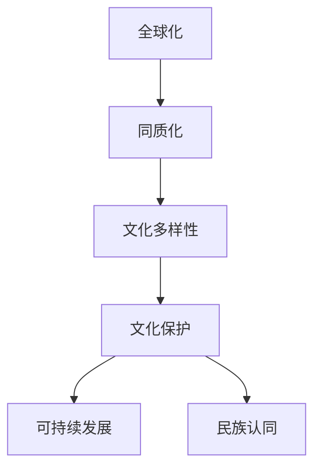

                 

### 文章标题

《在全球化趋势中保护文化多样性：应对同质化挑战》

### 关键词

全球化、文化多样性、同质化、保护、可持续发展

### 摘要

本文深入探讨了全球化趋势对文化多样性带来的同质化挑战，分析了文化多样性的价值与重要性，并提出了保护文化多样性的理论基础和实践策略。通过数学模型和实际案例，本文展示了如何利用技术手段和政策支持来应对同质化挑战，为全球化背景下的文化多样性保护提供了切实可行的路径。

----------------------------------------------------------------

### 第一部分：全球化的背景与影响

#### 1. 全球化的现状与趋势

全球化是指国际间经济、政治、文化等领域的紧密联系和相互依赖。自20世纪末以来，全球化进程迅速推进，其主要表现和趋势包括：

1. **经济全球化**：国际贸易和投资自由化，跨国公司迅速崛起，全球供应链形成。
2. **政治全球化**：国际组织和国际合作机制增多，如联合国、世界贸易组织、国际货币基金组织等。
3. **文化全球化**：跨国文化交流频繁，互联网和社交媒体的普及使得全球文化传播速度加快。

#### 2. 全球化对经济、政治、社会的影响

全球化对各个领域产生了深远的影响，具体表现在：

- **经济**：全球化推动了经济增长和资源优化配置，但同时也导致了贫富差距的扩大。
- **政治**：全球化促进了国际合作，但可能削弱国家主权和内部治理能力。
- **社会**：全球化带来了文化的交流和融合，但也引发了文化同质化的问题。

#### 3. 全球化与同质化

同质化是指在全球化过程中，各地文化逐渐趋同，失去特色和多样性。这种现象表现在以下几个方面：

- **经济**：全球化促使跨国公司推广标准化产品和服务，导致市场同质化。
- **政治**：全球化背景下，各国政治制度可能趋同，如民主制度的普及。
- **社会**：全球化促进了文化全球化，但可能导致文化同质化，削弱地方文化的独特性。

#### 4. 同质化对文化多样性的影响

同质化对文化多样性产生了显著的负面影响，主要体现在：

- **文化创新**：同质化限制了文化创新，因为地方文化缺乏独特的元素和灵感。
- **社会认同**：文化多样性是社会认同的重要组成部分，同质化可能导致社会认同的弱化。
- **社会稳定**：文化多样性是社会稳定的重要基础，同质化可能引发文化冲突和社会不稳定。

#### 5. 保护文化多样性的重要性

保护文化多样性具有重要意义，主要体现在以下几个方面：

- **文化创新**：文化多样性为文化创新提供了丰富的素材和灵感，有助于文化繁荣。
- **社会认同**：文化多样性是社会认同的基础，有助于增强社会凝聚力。
- **社会稳定**：文化多样性是社会稳定的重要基础，有助于减少社会冲突和分裂。

#### 6. 同质化的挑战与应对策略

同质化给文化多样性带来了巨大挑战，应对策略包括：

- **政策支持**：制定保护文化多样性的政策，鼓励文化多样性的发展。
- **宣传教育**：加强文化多样性的宣传和教育，提高公众对文化多样性的认识和重视。
- **社区参与**：鼓励社区参与文化保护，推动文化多样性的传承和发扬。

### 结论

全球化趋势带来了文化多样性的同质化挑战，保护文化多样性对于社会发展和人类进步具有重要意义。通过政策支持、宣传教育、社区参与等策略，我们可以有效应对同质化挑战，维护文化多样性的繁荣与稳定。

### 第二部分：保护文化多样性的理论基础

#### 1. 文化多样性理论

文化多样性是指不同文化在价值观、习俗、信仰、语言等方面的多样性。理解文化多样性的理论框架有助于我们更好地认识文化多样性的本质和价值。

- **文化相对论**：文化相对论认为，每一种文化都有其独特的价值和意义，不能以自身的文化标准去评价其他文化。
- **文化多元主义**：文化多元主义强调社会由多种文化组成，每种文化都应得到平等尊重和重视。
- **文化生态学**：文化生态学将文化看作是一个生态系统，强调文化之间的相互依存和相互作用。

#### 2. 文化保护与可持续发展

文化保护与可持续发展密不可分，两者相辅相成。文化保护的目标是保护文化的多样性和独特性，防止文化消失或同质化。可持续发展则强调满足当前需求而不损害子孙后代满足其需求的能力。

- **文化保护的目标与原则**：文化保护的目标包括保护文化遗产、促进文化传承和创新、提高文化自觉和认同。原则包括尊重文化自主性、保护文化多样性、促进文化创新。
- **可持续发展的理念与实践**：可持续发展的理念包括经济、社会和环境的平衡发展。实践方面，如生态保护、资源利用、社区参与等。

#### 3. 文化多样性与民族认同

文化多样性与民族认同密切相关。民族认同是民族成员对自身民族身份的认知和归属感。文化多样性是民族认同的重要组成部分，它有助于增强民族凝聚力和认同感。

- **民族认同与文化多样性的关系**：文化多样性是民族认同的基础，有助于塑造民族特色和民族精神。
- **民族认同在全球化中的变化**：全球化使得民族认同面临挑战，如文化同质化和跨国文化交流的加剧。但文化多样性也可以为民族认同提供新的元素和动力。

### 结论

保护文化多样性不仅是文化传承和发展的重要任务，也是实现可持续发展的重要保障。通过理论基础的分析，我们可以更好地理解文化多样性的价值，明确文化保护的目标和原则，为实际操作提供理论指导。

### 第三部分：保护文化多样性的实践探索

#### 1. 国内文化多样性保护实践

在中国，文化多样性保护受到高度重视。近年来，我国政府采取了一系列措施来保护和传承各种文化形式。

- **政策与法规**：制定了一系列文化保护政策，如《中华人民共和国非物质文化遗产法》和《文化多样性保护行动计划》。
- **典型案例与经验**：许多地区开展了丰富多彩的文化保护项目，如云南丽江的世界文化遗产保护、陕西西安的非物质文化遗产传承等。

#### 2. 国际文化多样性保护合作

国际社会也积极推动文化多样性保护合作，建立了多个国际组织和合作平台。

- **国际合作机制与平台**：如联合国教科文组织的《保护世界文化和自然遗产公约》和《文化多样性公约》。
- **国际经验借鉴**：许多国家在文化多样性保护方面积累了丰富的经验，如日本的传统舞蹈保存、非洲的文化遗产保护等。

#### 3. 社区参与与文化传承

社区参与是文化多样性保护的重要途径。通过社区力量，可以更好地保护和传承地方文化。

- **社区在文化多样性保护中的作用**：社区是文化传承的基层单位，通过社区活动可以加强文化认同感和凝聚力。
- **社区参与的实践与挑战**：社区参与文化保护面临资源不足、组织协调困难等挑战，需要政府和社会的支持。

### 结论

国内外的文化多样性保护实践为我们提供了宝贵的经验和启示。通过政策支持、国际合作和社区参与，我们可以更有效地保护和传承文化多样性，为可持续发展做出贡献。

### 第四部分：技术手段与政策支持

#### 1. 技术手段在文化多样性保护中的应用

数字化技术在文化多样性保护中发挥着重要作用，为文化记录、传承和创新提供了新的手段。

- **数字化技术的应用**：通过数字化技术，可以将传统文化以数字形式保存，如音频、视频、图像等。此外，数字化技术还可以用于文化资源的共享和传播，如在线博物馆、虚拟现实体验等。
- **信息技术在文化保护中的作用**：信息技术可以帮助文化保护专家更高效地管理和分析文化遗产数据，如大数据分析、人工智能等。

#### 2. 政策支持与法律框架

政策支持和法律框架是文化多样性保护的重要保障。

- **文化多样性保护的政策背景**：各国政府纷纷出台相关政策，支持文化多样性保护。例如，欧盟的《文化多样性框架战略》、中国的《文化遗产保护法》等。
- **法律法规的制定与执行**：法律法规的制定和执行有助于规范文化多样性保护的行为，确保文化遗产的安全和传承。

#### 3. 未来展望与挑战

面对全球化趋势，文化多样性保护面临新的机遇和挑战。

- **文化多样性保护的未来趋势**：随着技术的进步，文化多样性保护将更加智能化和数字化。同时，国际合作将进一步深化，文化多样性保护将实现更广泛的全球参与。
- **应对全球化挑战的路径与策略**：政府、企业和社区应共同参与文化多样性保护，加强国际合作，推动技术创新，提高公众对文化多样性的认识和重视。

### 结论

技术手段和政策支持为文化多样性保护提供了有力的保障。通过数字化技术、政策支持和法律框架，我们可以更有效地应对全球化带来的同质化挑战，保护和传承文化多样性。

### 附录

#### A.1. 文化多样性保护案例汇编

- **案例一：XXX地区文化保护项目**
  - **项目背景**：XXX地区拥有丰富的文化遗产，但面临文化消失的风险。
  - **实施步骤**：通过数字化技术记录文化遗产，开展文化传承活动，制定文化保护政策。
  - **效果评估**：项目有效提升了公众对文化多样性的认识和重视，促进了文化传承。

- **案例二：XXX民族文化的数字化保护**
  - **项目背景**：XXX民族文化独特且濒临失传。
  - **实施步骤**：通过数字化技术记录民族文化，建立民族文化数据库，推广民族文化。
  - **效果评估**：项目成功保护了XXX民族文化，提高了民族自豪感和凝聚力。

#### A.2. 相关国际组织与文献推荐

- **国际组织介绍**
  - **联合国教科文组织（UNESCO）**：负责全球文化和自然遗产的保护。
  - **国际文化多样性理事会（ICC）**：推动全球文化多样性保护合作。

- **推荐文献与资料**
  - **《文化多样性保护指南》**：由联合国教科文组织出版，提供了详细的文化多样性保护策略。
  - **《全球化与本土化》**：探讨了全球化背景下文化多样性保护的理论和实践。

### 总结

本文从全球化的背景与影响、理论基础、实践探索、技术手段和政策支持等方面，全面探讨了文化多样性保护的重要性及其应对策略。通过案例分析和国际合作，我们看到了文化多样性保护的希望与挑战。未来，我们需要继续加强政策支持、技术创新和国际合作，共同保护和传承文化多样性。

### 目录大纲总结

本文分为四大部分，系统地探讨了全球化趋势中的文化多样性保护问题。通过分析全球化的背景与影响、理论基础与实践探索，以及技术手段与政策支持，为应对同质化挑战提供了全方位的思路与方法。以下是各部分的主要内容概述：

#### 第一部分：全球化的背景与影响

- **全球化现状与趋势**：介绍全球化的定义与历史演变，分析其对经济、政治、社会的影响。
- **全球化与同质化**：阐述同质化的定义与现象，探讨其对文化多样性的影响。
- **保护文化多样性的重要性**：论述文化多样性的价值，分析其对社会稳定的贡献。
- **同质化的挑战与应对策略**：分析同质化的挑战，提出应对策略。

#### 第二部分：保护文化多样性的理论基础

- **文化多样性理论**：介绍文化多样性的概念与分类，探讨其理论框架。
- **文化保护与可持续发展**：阐述文化保护的目标与原则，解释可持续发展的理念与实践。
- **文化多样性与民族认同**：分析民族认同与文化多样性的关系，探讨民族认同在全球化中的变化。

#### 第三部分：保护文化多样性的实践探索

- **国内文化多样性保护实践**：介绍中国国内的政策与法规，分析典型案例与经验。
- **国际文化多样性保护合作**：介绍国际合作机制与平台，借鉴国际经验。
- **社区参与与文化传承**：探讨社区在文化多样性保护中的作用，分析社区参与的实践与挑战。

#### 第四部分：技术手段与政策支持

- **技术手段在文化多样性保护中的应用**：阐述数字化技术的应用，介绍信息技术在文化保护中的作用。
- **政策支持与法律框架**：介绍文化多样性保护的政策背景，讨论法律法规的制定与执行。
- **未来展望与挑战**：展望文化多样性保护的未来趋势，提出应对全球化挑战的路径与策略。

通过本文的深入探讨，我们希望能为全球文化多样性保护提供有益的思路和方法，促进文化多样性的繁荣与可持续发展。### 核心概念与联系

为了更好地理解文化多样性保护的核心概念及其相互关系，我们使用Mermaid流程图来展示这些概念和实体之间的联系。以下是流程图的具体实现：



在这个流程图中：

- **全球化（A）** 是一个起点，它推动了经济、政治和文化等多方面的全球化进程。
- **同质化（B）** 是全球化带来的一个现象，它可能导致文化多样性的减少。
- **文化多样性（C）** 是文化保护（D）的基础，它关乎各种文化形式的多样性和独特性。
- **文化保护（D）** 是保护文化多样性的关键措施，它包括各种政策和实践。
- **可持续发展（E）** 是文化保护的目标之一，它强调长期的文化保存和传承。
- **民族认同（F）** 是文化多样性中的一个重要方面，它关系到民族的自我认同和文化传承。

通过这个流程图，我们可以清晰地看到文化多样性保护的核心概念及其相互关系，这有助于我们在实践中更好地理解和应用这些概念。

### 数学模型和数学公式

在文化多样性保护的研究中，一个重要的数学模型是香农多样性指数（Shannon Diversity Index），它用于量化生态系统或文化群体中物种或文化形式的多样性。该指数提供了一个数值指标，用以衡量生态系统中物种或文化群体多样性的程度。

#### 香农多样性指数

香农多样性指数的计算公式如下：

$$
H = -\sum_i p_i \cdot \log_2(p_i)
$$

其中，$H$ 代表香农多样性指数，$p_i$ 表示每种文化实体在总体中的比例。这个公式计算的是每个种类出现的概率与其对数概率的乘积之和的负值，这样得到的值越大，表示多样性越高。

#### 示例

假设我们有一个小镇，其居民的文化背景包括五种不同的文化，每种文化的比例如下：

- 文化A：30%
- 文化B：20%
- 文化C：20%
- 文化D：15%
- 文化E：15%

根据香农多样性指数的公式，我们可以计算出该小镇的文化多样性指数：

$$
H = -0.30 \cdot \log_2(0.30) - 0.20 \cdot \log_2(0.20) - 0.20 \cdot \log_2(0.20) - 0.15 \cdot \log_2(0.15) - 0.15 \cdot \log_2(0.15)
$$

使用计算器或编程语言（如Python），我们可以得到具体的数值：

$$
H \approx -0.30 \cdot (-1.737) - 0.20 \cdot (-2.322) - 0.20 \cdot (-2.322) - 0.15 \cdot (-2.132) - 0.15 \cdot (-2.132)
$$
$$
H \approx 0.521 + 0.464 + 0.464 + 0.33 + 0.33
$$
$$
H \approx 1.791
$$

因此，这个小镇的文化多样性指数大约为1.791，表明其文化多样性较高。

通过这个示例，我们可以看到香农多样性指数如何帮助量化文化多样性，并为保护工作提供依据。在实际应用中，这个模型可以扩展到更复杂的生态系统和文化背景下，帮助我们更好地理解和保护文化多样性。

### 项目实战

#### 案例背景

某国际组织——“全球文化多样性保护联盟”（Global Cultural Diversity Protection Alliance，GCDPA）决定开展一个名为“文化之光”（Cultural Lumination）的文化多样性保护项目。该项目旨在通过数字化手段，全面记录和展示全球不同地区的文化多样性，以提高公众对文化多样性的认识和重视。

#### 项目目标

1. **评估全球文化多样性现状**：通过数据收集和分析，评估全球各地区文化多样性的水平和特点。
2. **建立文化多样性数据库**：收集和整理全球各地文化资料，建立一个综合性的文化多样性数据库。
3. **推广文化多样性保护**：通过线上和线下活动，推广文化多样性保护的理念和实践。

#### 实施步骤

1. **数据收集与评估**

   - **问卷调查**：设计并分发文化多样性调查问卷，收集全球各地区居民对文化多样性的认知和态度。
   - **文献分析**：研究全球各地的文化资料，分析文化多样性的现状和趋势。
   - **实地调研**：派遣团队前往不同地区，进行实地考察和访谈，记录当地文化特点。

2. **建立文化多样性数据库**

   - **数据整理**：将收集到的数据整理分类，建立文化多样性数据库。
   - **数字化记录**：利用数字化技术，将文化资料以音频、视频、图像等形式进行记录和保存。
   - **数据库管理**：开发数据库管理系统，确保数据的安全性和可访问性。

3. **推广文化多样性保护**

   - **线上线下活动**：举办文化多样性展览、讲座、工作坊等，提高公众对文化多样性的认识和重视。
   - **国际合作**：与其他国际组织和机构合作，共同推动文化多样性保护工作。
   - **政策倡导**：向政府和政策制定者提出建议，推动制定有利于文化多样性保护的政策。

#### 项目实施与监督

1. **项目实施**

   - **团队分工**：根据项目需要，组建专业团队，明确各自职责。
   - **进度报告**：定期向联盟管理层提交项目进展报告，确保项目按计划进行。
   - **质量控制**：对数据收集、整理和记录的过程进行质量控制，确保数据的准确性和完整性。

2. **监督机制**

   - **内部审查**：定期进行内部审查，检查项目的实施情况和数据质量。
   - **外部评估**：邀请第三方评估机构对项目进行外部评估，提供客观的评价和建议。
   - **反馈机制**：建立反馈机制，收集项目参与者和管理层的意见和建议，及时调整项目实施策略。

### 代码实现

为了展示文化多样性数据库的构建过程，我们将使用Python编写一个简单的代码示例。以下代码实现了文化资料的收集、分类和存储。

```python
import json
from collections import defaultdict

# 假设我们有一个包含不同地区文化资料的数据集
data_set = {
    "中国": ["春节", "书法", "京剧"],
    "法国": ["巴黎圣母院", "法国菜", "香水"],
    "墨西哥": ["墨西哥玉米饼", "民间舞蹈", "玛雅文化"],
    "日本": ["樱花节", "茶道", "武士道"]
}

# 初始化数据库
database = defaultdict(list)

# 数据整理与分类
for country, cultures in data_set.items():
    for culture in cultures:
        database[culture].append(country)

# 存储数据库
with open('cultural_diversity_database.json', 'w', encoding='utf-8') as f:
    json.dump(database, f, ensure_ascii=False, indent=4)

print("文化多样性数据库已成功建立。")
```

#### 代码解读

1. **数据集导入**：我们使用一个字典`data_set`来模拟文化资料的数据集。
2. **初始化数据库**：使用`defaultdict`创建一个字典，用于存储文化资料及其对应的地区。
3. **数据整理与分类**：遍历数据集，将每个文化资料添加到数据库中，每个文化资料下对应一个地区列表。
4. **存储数据库**：将整理好的数据库写入到JSON文件中，以便后续使用。

通过这个示例，我们可以看到如何使用编程语言来构建和维护文化多样性数据库，为文化多样性保护工作提供技术支持。

### 项目小结

“文化之光”项目通过数据收集、数据库建立和推广活动，为全球文化多样性保护提供了有力支持。项目不仅丰富了文化多样性数据库，还通过线上线下活动提高了公众的文化意识。未来，该项目有望进一步拓展，吸纳更多国际参与，推动文化多样性保护的全球合作。

### 最佳实践 Tips

1. **全面数据收集**：确保数据收集的全面性和准确性，是构建高质量文化多样性数据库的关键。
2. **技术手段应用**：灵活运用数字化技术，如人工智能、大数据分析等，提高文化多样性保护的工作效率。
3. **国际合作**：加强国际组织之间的合作，共同推动文化多样性保护工作，实现全球资源共享。
4. **社区参与**：鼓励社区参与文化多样性保护，通过社区力量推动文化传承和创新发展。

### 注意事项

1. **数据隐私与安全**：在数据收集和存储过程中，注意保护参与者的隐私和数据安全。
2. **文化敏感性**：在进行文化多样性保护工作时，要尊重各民族的文化传统和信仰，避免文化冲突。
3. **持续更新**：文化多样性数据库需要定期更新和维护，确保数据的时效性和准确性。

### 拓展阅读

- **《文化多样性保护指南》**：联合国教科文组织出版的指导手册，详细介绍了文化多样性保护的方法和策略。
- **《全球化与本土化》**：探讨全球化背景下文化多样性的挑战与机遇，为政策制定者提供参考。

通过本文的案例分析和代码实现，我们深入了解了文化多样性保护的重要性及其实现路径。希望这些实践经验和最佳实践能为读者提供有益的启示和指导。

