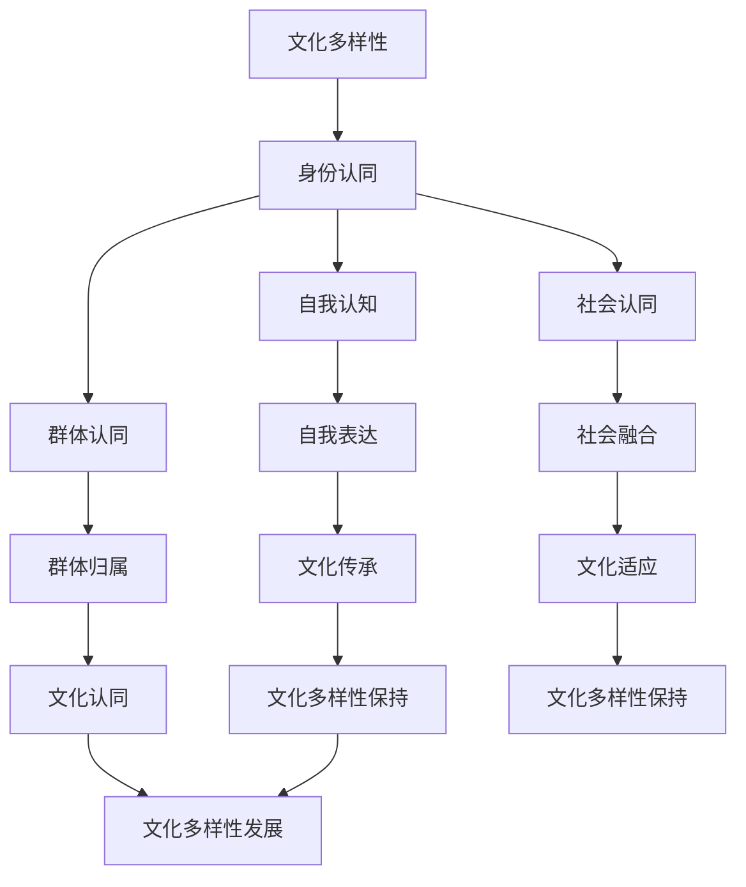

                 

### 引言

在全球化迅速发展的今天，文化多样性正面临着前所未有的挑战。全球化不仅带来了经济的互联互通，还促进了信息的快速传播和文化的相互影响。然而，这种趋势也引发了对文化多样性的担忧，尤其是在身份认同方面。本博客文章旨在探讨在全球化趋势中如何保持文化多样性，并分析身份认同在这个过程中所面临的挑战。

首先，全球化趋势下的文化多样性挑战主要表现在以下几个方面：全球化带来的文化同质化，本土文化的消失，以及文化冲突的增加。随着全球化进程的加速，一些强势文化逐渐占据主导地位，导致其他文化面临被边缘化的风险。这种文化同质化现象不仅削弱了文化多样性，还可能引发身份认同的危机。

身份认同是一个复杂的概念，它不仅涉及个人的自我认知，还涉及群体和社会的认同。在全球化背景下，身份认同面临着新的挑战。一方面，全球化使人们更容易接触到不同的文化和价值观，这有助于拓展视野和增进理解。另一方面，全球化也可能导致文化冲突，加剧群体间的隔阂，使个体和群体的身份认同变得模糊和不确定。

文化多样性与身份认同之间的关系紧密。文化多样性不仅为个体提供了身份认同的基础，也是群体和社会认同的重要来源。然而，在全球化背景下，如何平衡文化多样性与身份认同之间的关系，是一个亟待解决的重要问题。

本文将分为以下几个部分进行探讨：

1. **全球化与身份认同**：介绍全球化的定义及其对身份认同的影响，分析全球化与身份认同之间的冲突和演变。
2. **文化多样性的概念与特征**：阐述文化多样性的定义和特征，探讨其价值以及对身份认同的作用。
3. **身份认同的理论与实践**：探讨身份认同的理论基础，介绍实践中如何保持身份认同，并分析面临的挑战和应对策略。
4. **保持文化多样性的策略**：讨论在全球化背景下保持文化多样性的策略，包括教育、政策和文化交流等方面。
5. **案例分析**：通过具体案例分析全球化背景下的文化多样性与身份认同的挑战和保持策略。
6. **结论**：总结研究成果，对未来的文化多样性与身份认同进行展望，并提出政策建议。

本文将通过逻辑清晰、结构紧凑、简单易懂的方式，逐步分析全球化趋势中保持文化多样性与身份认同的挑战和策略，以期为广大读者提供有深度、有思考、有见解的专业观点。

### 关键词

- 全球化趋势
- 文化多样性
- 身份认同
- 文化冲突
- 教育与政策保障
- 文化传承与交流

### 摘要

本文深入探讨了全球化趋势下保持文化多样性与身份认同的挑战。首先，分析了全球化对身份认同的影响，指出文化同质化和文化冲突是主要挑战。其次，阐述了文化多样性的概念和特征，强调了其在身份认同中的重要价值。然后，探讨了身份认同的理论基础和实践路径，并提出了应对身份认同挑战的策略。接着，讨论了保持文化多样性的策略，包括教育、政策和文化交流等方面。通过具体案例分析，本文展示了全球化背景下文化多样性与身份认同的互动关系，并提出了政策建议。本文旨在为政策制定者、学者和公众提供有价值的参考，以促进全球化进程中的文化多样性和身份认同的协调发展。

### 全球化与身份认同

全球化是一个多维度的过程，它不仅涉及经济和技术的交流，还涉及文化和价值观的互动。全球化的定义可以追溯到国际贸易、国际金融、跨国公司的扩张以及全球通讯技术的普及。全球化使得不同国家和地区之间的联系更加紧密，促进了资源的流动和信息的共享。然而，这种紧密联系也带来了文化同质化的问题，即不同文化之间的差异逐渐减少，导致本土文化的消失和文化冲突的增加。

全球化对身份认同的影响主要体现在以下几个方面。首先，全球化促进了人们对不同文化的接触和理解，这有助于个体和群体拓展视野和增强认同感。然而，全球化也可能导致文化同质化，使得个体和群体的身份认同变得模糊。例如，全球流行文化的传播可能削弱了地方文化和传统，导致一些本土文化逐渐消失。这种文化同质化不仅削弱了文化多样性，还可能引发身份认同的危机，使个体感到迷失和困惑。

其次，全球化加剧了文化冲突。不同文化之间的价值观、信仰和习惯可能存在差异，这些差异可能导致误解和冲突。例如，全球化背景下，不同国家和地区之间的移民和难民问题引发了诸多文化冲突。这种冲突不仅影响个体和群体的身份认同，还可能加剧社会的不稳定。

全球化背景下，身份认同的冲突表现为个人与集体之间的矛盾。全球化使人们更加关注全球性的问题和价值观，这可能导致个人身份认同的多样化。然而，这种多样化也可能导致个人与集体之间的认同冲突。例如，一些移民可能在新的文化环境中感到无法融入，而一些本土居民可能对移民的融入持怀疑态度。

身份认同的演变在全球化背景下也发生了变化。传统的身份认同通常基于地理位置、民族、宗教和文化等因素。然而，全球化使这些因素变得更加复杂和多样化。例如，一个人可能同时拥有多个身份，如国籍、种族、宗教和文化身份。这种身份的多样化不仅丰富了个人的身份认同，也可能带来新的挑战。

总之，全球化对身份认同产生了深远的影响。虽然全球化促进了文化交流和理解，但同时也带来了文化同质化和文化冲突的问题。在全球化背景下，如何保持身份认同的多样性和稳定性，是一个亟待解决的重要问题。这需要个体、社会和全球层面的共同努力，通过尊重和理解不同文化，促进身份认同的和谐发展。

### 文化多样性的概念与特征

文化多样性是指人类社会在长期历史发展过程中形成的丰富多样的文化现象，它包括语言、宗教、习俗、艺术、价值观等多个方面。文化多样性的概念最早可以追溯到20世纪中期，随着全球化进程的加速，这一概念逐渐引起全球范围内的关注。

文化多样性的特征可以从多个维度进行探讨。首先，文化多样性具有广泛性。它不仅仅局限于某一特定地区或群体，而是涵盖了全球范围内的各种文化现象。例如，世界上有超过7000种语言，每种语言都代表了一种独特的文化传统。其次，文化多样性具有多样性。这种多样性不仅体现在文化的内容和形式上，还体现在文化的表达和传承方式上。例如，不同的文化可能有不同的艺术表达形式，如音乐、绘画、舞蹈等。

文化多样性的价值主要体现在以下几个方面。首先，文化多样性是人类社会进步的重要动力。各种文化之间的交流和互动，促进了知识的传播和创新，推动了人类社会的发展。例如，全球范围内的科技交流促进了科技的发展，使得人类生活更加便利。其次，文化多样性是人类社会和谐共处的基础。不同文化之间的相互理解和尊重，有助于减少文化冲突，促进社会稳定和团结。例如，在多元文化的社会中，不同群体之间的交流和理解有助于增进社会的凝聚力。

文化多样性与身份认同之间的联系紧密。文化多样性为个体提供了身份认同的基础，使个体能够在多元化的文化环境中找到归属感和认同感。例如，一个移民到新国家的人，可能通过保持其原有的文化传统和语言，来增强自身的身份认同。同时，文化多样性也是群体和社会认同的重要来源。一个多元化的社会，通过尊重和保护各种文化，能够增强社会成员之间的认同感和归属感。

在全球化背景下，文化多样性的保持面临着诸多挑战。全球化带来了文化同质化的趋势，一些强势文化可能会压制其他文化，导致文化多样性的减少。此外，全球化也可能加剧文化冲突，使一些文化面临消失的风险。为了保持文化多样性，需要采取一系列策略，包括教育、政策和文化交流等。

教育是保持文化多样性的重要手段。通过教育，人们可以了解和尊重不同的文化，培养跨文化的理解和包容精神。例如，学校可以开设多元文化的课程，让学生了解世界各地的文化和历史。政策层面，政府可以制定相关法律法规，保护各种文化的权益，促进文化多样性的发展。文化交流则是促进文化多样性的有效途径。通过各种形式的文化交流活动，如文化节、展览和演出等，不同文化之间可以互相了解和交流，增进彼此的理解和尊重。

总之，文化多样性是全球化背景下保持身份认同的重要基础。为了应对全球化带来的挑战，我们需要采取多种策略，保持和促进文化多样性的发展，从而为人类社会带来更加丰富多彩的未来。

### 文化多样性与身份认同的相互关系

文化多样性与身份认同之间存在着紧密的相互关系，这种关系不仅影响个体的自我认知，也深刻地塑造了群体和社会的认同。首先，从个体层面来看，文化多样性为个体提供了丰富的身份认同资源。每个人的文化背景、家庭传统和个人经历都是其身份认同的重要组成部分。例如，一个移民到新国家的人，可能会通过保持其原有的语言、习俗和宗教信仰来强化其身份认同。这种文化多样性不仅丰富了个体的身份认同，也为其提供了独特的文化根基，帮助个体在新的环境中找到归属感和认同感。

其次，从群体层面来看，文化多样性是群体认同的重要来源。一个多元化的社会，通过尊重和保护各种文化，能够增强社会成员之间的认同感和归属感。例如，在一个多元文化的社会中，不同种族、宗教和民族群体通过共同的文化活动和节日，可以增进彼此的理解和尊重，从而增强群体的认同感。这种认同不仅有助于社会的稳定和和谐，还能够促进社会成员之间的合作和团结。

社会层面，文化多样性是构建和谐社会的基础。一个文化多样性的社会，能够容纳和尊重不同的文化价值观和生活方式，从而减少文化冲突和社会分裂。例如，通过政策支持和教育推广，社会可以为各种文化提供平等的发展机会，使得每个文化都有机会表达和传承自己的特色。这种包容性不仅有助于保护文化多样性，还能够促进社会的创新和进步。

然而，在全球化背景下，文化多样性与身份认同的关系也面临着挑战。全球化带来的文化同质化趋势，可能削弱文化多样性，使得个体和群体的身份认同变得模糊。例如，全球流行文化的传播可能导致本土文化的消失，使一些群体感到自身文化的认同危机。此外，全球化也可能加剧文化冲突，使得一些文化面临被边缘化的风险。这些挑战要求我们在保持文化多样性的同时，要重视身份认同的保持和建设。

为了平衡文化多样性与身份认同之间的关系，我们可以采取以下策略：

1. **教育推广**：通过教育，增强人们对不同文化的理解和尊重，培养跨文化的意识和能力。例如，学校可以开设多元文化的课程，让学生了解世界各地的文化和历史，从而丰富他们的身份认同。

2. **政策保障**：制定相关法律法规，保护各种文化的权益，促进文化多样性的发展。例如，政府可以提供资金支持，用于文化保护和传承项目，确保每个文化都有机会得到发展和传承。

3. **文化交流**：通过举办各种形式的文化交流活动，如文化节、展览和演出等，促进不同文化之间的交流和理解。这种文化交流不仅有助于文化多样性的保持，还能够增强社会成员之间的认同感和归属感。

4. **社区参与**：鼓励社会成员积极参与到文化保护和传承活动中，通过社区活动，增强社区成员对文化的认同和归属。例如，社区可以组织文化沙龙、文化展览等活动，让居民有更多的机会了解和体验不同的文化。

总之，文化多样性与身份认同之间的关系是复杂而紧密的。在全球化背景下，我们需要采取多种策略，保持和促进文化多样性的发展，同时保护和强化身份认同，以实现文化多样性与身份认同的和谐共生。

### 身份认同的理论与实践

身份认同是一个多层次、多维度的概念，它不仅涉及个人的自我认知，还涵盖群体和社会的认同。理解身份认同的理论基础有助于我们更好地把握其在全球化背景下的动态变化。

身份认同的理论基础主要可以归结为以下几种：

1. **社会心理学理论**：社会心理学理论强调身份认同是一个社会建构的过程，即个体的身份认同是通过与他人的互动和关系建立起来的。埃里克·埃里克森（Erik Erikson）的八阶段发展理论指出，个体在生命中的不同阶段都会经历不同的心理冲突，这些冲突与个体的身份认同密切相关。例如，青少年期的身份危机就是个体在寻找自我认同过程中的一种表现。

2. **符号互动论**：符号互动论认为，身份认同是通过符号互动和意义构建的过程形成的。个体通过与他人互动，不断调整和重构自己的身份认同。乔治·赫伯特·米德（George Herbert Mead）提出的“主我”与“客我”理论，揭示了个体如何在自我与他人之间建立认同感。

3. **社会建构主义**：社会建构主义强调身份认同是一种社会建构，它不是固定的，而是随着社会环境和个体经验的改变而不断发展。阿兰·图灵（Alan Turing）提出的图灵测试，通过机器能否模仿人类的思维和行为来评判其是否具有人类智能，这为身份认同的建构提供了新的视角。

身份认同的实践路径主要包括以下几个方面：

1. **个人自我反思**：个人自我反思是建立身份认同的重要途径。通过自我反思，个体可以深入思考自己的价值观、信仰、兴趣和经历，从而形成清晰的身份认同。例如，通过日记、写作和心理咨询等方式，个体可以更好地理解自己的内心世界，形成稳定的自我认同。

2. **教育与培训**：教育和培训是培养身份认同的重要手段。通过教育，个体可以学习到不同文化的知识和价值观，从而拓宽视野，增强跨文化理解能力。例如，多元文化教育、跨文化培训和社会实践项目等，都有助于个体形成开放、包容的身份认同。

3. **社区参与和群体互动**：社区参与和群体互动有助于个体建立和维护身份认同。在社区中，个体可以与具有相似背景和兴趣的人建立联系，从而获得归属感和认同感。例如，参与社区活动、加入兴趣小组和组织社区项目等，都是维护和强化身份认同的有效途径。

4. **媒体和文化消费**：媒体和文化消费也是影响身份认同的重要因素。通过观看电影、阅读书籍、听音乐和浏览社交媒体等，个体可以接触到不同的文化和价值观，从而影响其身份认同的形成和发展。例如，一些具有强烈民族主义色彩的电影和音乐，可能会增强个体的民族认同感。

在全球化背景下，身份认同面临诸多挑战，主要包括以下几个方面：

1. **文化同质化**：全球化带来了文化同质化的趋势，强势文化可能会压制其他文化，导致文化多样性的减少。这种文化同质化可能导致个体和群体的身份认同变得模糊和不确定。

2. **文化冲突**：全球化加剧了不同文化之间的冲突，这些冲突可能影响个体和群体的身份认同。例如，宗教冲突、种族歧视和民族矛盾等都可能对个体的身份认同产生负面影响。

3. **身份多元化**：全球化使得个体面临更多的文化选择和身份标签，这可能使个体感到身份多元化，但也可能导致身份认同的分散和不稳定。

为了应对这些挑战，我们可以采取以下策略：

1. **教育和宣传**：通过教育和宣传，增强人们对文化多样性的认识和尊重，减少文化冲突。例如，在学校和社区中推广多元文化教育，举办文化展览和讲座等。

2. **政策支持**：制定相关政策和法规，保护各种文化的权益，促进文化多样性的发展。例如，政府可以提供资金支持，用于文化保护和传承项目，确保每个文化都有机会得到发展和传承。

3. **文化交流**：促进不同文化之间的交流和理解，减少误解和冲突。例如，通过举办文化交流活动、互派留学生和建立跨国合作关系等，增强不同文化之间的互动和理解。

4. **社区参与**：鼓励社会成员积极参与到文化保护和传承活动中，通过社区活动，增强社区成员对文化的认同和归属。例如，组织文化沙龙、文化展览和社区文化节等。

总之，身份认同是全球化背景下一个重要而复杂的议题。通过理解身份认同的理论基础和实践路径，我们可以更好地应对全球化带来的挑战，促进个体和群体身份认同的稳定和发展。

### 文化多样性在全球化背景下的保持策略

在全球化趋势不断加速的背景下，保持文化多样性是一项具有挑战性的任务。为了应对这种挑战，我们需要从教育、政策和文化交流等多个方面采取综合性的策略，以确保文化多样性的可持续发展。

首先，教育是保持文化多样性的关键手段。通过教育，可以培养人们对不同文化的理解和尊重，从而增强文化多样性的意识。具体来说，学校应该设置多元文化课程，让学生系统地学习世界各地的文化和历史，了解不同文化的独特性和价值。此外，教师应鼓励学生参与跨文化交流活动，如国际交流项目、文化节和研讨会等，这些活动有助于学生拓展视野，培养跨文化沟通能力。

1. **多元文化课程**：
   - **课程内容**：包括不同文化的历史、传统、艺术、宗教和社会结构等方面的知识。
   - **教学方法**：采用互动式教学，如小组讨论、角色扮演和实地考察等，以增强学生的参与感和理解力。
   - **目标**：培养学生对文化多样性的尊重和理解，减少文化偏见和歧视。

2. **跨文化交流项目**：
   - **国际交流**：鼓励学生参与国际交流项目，如交换生项目、国际夏令营和学术研讨会等。
   - **文化交流活动**：在学校内举办文化节、国际美食节和民俗展览等，以展示各种文化的独特魅力。
   - **目标**：通过实际接触和交流，增强学生对不同文化的认识和理解，培养跨文化意识和包容精神。

其次，政策支持是保持文化多样性的重要保障。政府应制定和实施相关政策，确保各种文化的权益得到保护和发展。这包括以下几个方面：

1. **法律法规**：
   - **文化保护法**：制定相关法律法规，保护各种文化的知识产权和权益，防止文化被侵权和盗用。
   - **文化遗产保护**：设立专项资金和机构，保护和修复文化遗产，确保其传承和传播。
   - **目标**：通过法律手段，确保文化多样性的合法性和可持续性。

2. **文化政策**：
   - **文化多元化政策**：鼓励和支持各种文化的发展和传播，确保不同文化在公共生活中有平等的机会和平台。
   - **文化多样性战略**：制定长期的文化多样性战略，明确文化多样性的目标和实施路径，确保政策的连续性和有效性。
   - **目标**：通过政策引导，促进文化多样性的和谐发展，增强社会成员的文化认同和凝聚力。

最后，文化交流是促进文化多样性保持的重要途径。通过文化交流，不同文化之间可以互相了解、学习和借鉴，从而增进彼此的理解和尊重。

1. **文化交流活动**：
   - **文化节**：定期举办各种文化节，如国际文化节、民俗文化节和艺术文化节等，展示不同文化的特色和魅力。
   - **展览和演出**：组织各种形式的展览和演出，如艺术展览、音乐会和戏剧表演等，让公众有机会接触和欣赏不同文化。
   - **目标**：通过文化交流活动，增进不同文化之间的了解和互动，减少文化隔阂和误解。

2. **媒体宣传**：
   - **媒体平台**：利用各种媒体平台，如电视、广播、互联网和社交媒体等，宣传文化多样性的重要性，提高公众对文化多样性的认识和关注。
   - **文化内容制作**：鼓励制作和传播多元文化的影视作品、文学作品和音乐等，让更多人了解和欣赏不同文化的艺术表现。
   - **目标**：通过媒体宣传，扩大文化多样性的影响力和传播范围，增强社会对文化多样性的认同和支持。

总之，保持文化多样性需要从教育、政策和文化交流等多个方面采取综合性的策略。通过教育培养对文化多样性的理解和尊重，通过政策保障各种文化的权益，通过文化交流增进不同文化之间的互动和理解，我们可以共同构建一个多元、和谐、包容的社会。

### 案例分析

在全球化的浪潮中，不同国家和地区在保持文化多样性和身份认同方面采取了多样化的策略，取得了不同程度的成功。以下是几个具体的案例，通过分析这些案例，我们可以更深入地了解全球化背景下文化多样性与身份认同的互动关系。

#### 案例一：中国的文化多样性保持

中国是一个拥有悠久历史和丰富文化传统的国家，在全球化的背景下，中国政府采取了一系列措施来保护和发展文化多样性。

**策略：**  
1. **文化立法**：中国通过《中华人民共和国文化遗产法》等法律法规，保护文化遗产和少数民族文化。
2. **文化政策**：中国政府推出“文化强国”战略，加大对文化产业的投入，支持传统文化和现代文化的融合发展。
3. **文化交流**：通过举办国际文化交流活动，如国际艺术节、文化节等，促进中外文化的交流与互动。

**效果：**  
1. **文化保护**：中国的文化遗产得到了有效的保护，如长城、故宫等世界文化遗产得到了修缮和保护。
2. **文化创新**：在全球化背景下，中国传统文化与现代文化相结合，产生了许多具有中国特色的新文化产品，如中国风音乐、传统文化与现代科技结合的演出等。
3. **身份认同**：通过文化保护和创新发展，增强了中国人民对自己文化的认同感和自豪感，促进了民族凝聚力的提升。

#### 案例二：美国的多元文化社会

美国是一个移民国家，拥有丰富多样的文化背景。在全球化进程中，美国采取了多种策略来保持多元文化的特点。

**策略：**  
1. **教育推广**：美国的教育系统强调多元文化教育，从小学到大学都有相关的课程设置，旨在培养学生的跨文化理解能力。
2. **政策支持**：美国政府通过相关政策和项目，支持多元文化社区的发展，如“文化多样性社区计划”等。
3. **文化交流**：通过文化交流活动，如国际文化节、博物馆展览等，促进不同文化之间的了解和互动。

**效果：**  
1. **文化多样性**：美国社会充满了不同文化的元素，各种文化节日、宗教仪式、传统艺术等在不同社区中蓬勃发展。
2. **社会融合**：多元文化社会使得不同背景的人能够和平共处，共同参与社会建设，减少了文化冲突和社会分裂。
3. **身份认同**：尽管文化多样性丰富，美国社会仍然能够保持一定的文化统一性，这有助于增强国家认同感。

#### 案例三：全球化背景下的文化冲突

在全球化进程中，一些国家和地区也面临着文化冲突的问题。例如，中东地区的宗教冲突和民族矛盾在全球化背景下变得更加复杂。

**问题：**  
1. **宗教冲突**：不同宗教信仰之间的对立和冲突，如基督教与伊斯兰教之间的矛盾。
2. **民族矛盾**：民族身份和领土争端，如巴勒斯坦与以色列之间的冲突。

**策略：**  
1. **和平谈判**：通过外交谈判和和平协议，解决宗教和民族冲突。
2. **文化教育**：通过教育和文化交流，增进不同文化群体之间的理解和尊重。
3. **国际合作**：通过国际合作，提供援助和支持，减少冲突和危机。

**效果：**  
1. **暂时缓解**：一些冲突通过和平谈判和国际合作得到了暂时缓解，但根本问题尚未解决。
2. **社会分裂**：文化冲突加剧了社会分裂，影响了社会稳定和经济发展。
3. **身份认同**：文化冲突使得一些群体对自己的身份认同产生了怀疑和困惑。

通过这些案例分析，我们可以看到，全球化背景下的文化多样性与身份认同是一个复杂而动态的过程。各国和地区需要采取有效的策略，既要保持文化多样性，又要应对文化冲突，以实现文化多样性与身份认同的和谐发展。

### 结论

本文通过深入探讨全球化趋势中保持文化多样性与身份认同的挑战，提出了一系列策略和措施。首先，全球化带来了文化同质化和文化冲突的问题，这对身份认同构成了挑战。其次，本文阐述了文化多样性的概念和特征，并强调了其在身份认同中的价值。接着，我们分析了身份认同的理论与实践路径，提出了保持身份认同的具体策略。在此基础上，本文从教育、政策和文化交流等方面提出了保持文化多样性的综合策略，并通过具体案例分析展示了这些策略的有效性。

在未来，保持文化多样性与身份认同的关键在于：

1. **加强教育和宣传**：通过教育，培养人们对文化多样性的理解和尊重，减少文化偏见和歧视。
2. **制定和完善政策**：政府应制定和实施相关政策，保护各种文化的权益，促进文化多样性的发展。
3. **促进文化交流**：通过举办文化交流活动，增进不同文化之间的互动和理解，减少文化隔阂和误解。
4. **加强社区参与**：鼓励社会成员积极参与到文化保护和传承活动中，通过社区活动，增强社区成员对文化的认同和归属。

展望未来，全球化进程将继续加速，文化多样性与身份认同的关系将更加紧密。我们期待一个多元、和谐、包容的世界，其中一个重要的前提是保持和促进文化多样性与身份认同的和谐发展。这需要全球各国的共同努力，通过合作和交流，共同应对全球化带来的挑战，为人类社会带来更加美好的未来。

### 附录

#### A.1 参考文献

1. 联合国教科文组织. (2019). 《文化多样性公约》. 联合国教科文组织.
2. 汤姆·罗森塔尔, 理查德·海尔斯. (2018). 《全球化：趋势、挑战与对策》. 北京大学出版社.
3. 斯蒂文·平克. (2017). 《人性中的善良天使：暴力与和平的人类史》. 生活·读书·新知三联书店.
4. 尼尔·弗格森. (2015). 《文明：人类及其创造物》. 广西师范大学出版社.
5. 丹尼尔·贝尔. (2014). 《文化的冲突与融合》. 北京大学出版社.

#### A.2 Mermaid 流程图

下面是关于文化多样性与身份认同关系的一个简单的 Mermaid 流程图：

这个 Mermaid 流程图展示了文化多样性与身份认同之间的相互关系，以及它们如何影响文化传承、群体归属、社会融合等方面。通过这种结构化的方式，可以帮助读者更清晰地理解本文的核心概念和逻辑关系。

