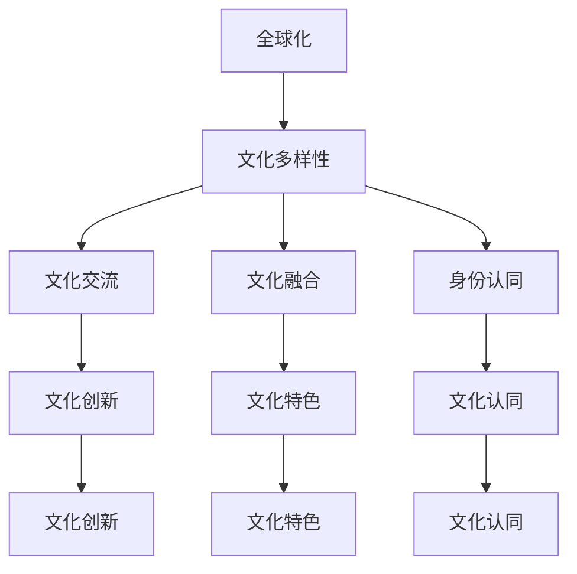

                 


### 文章标题

# 在全球化趋势中维护文化多样性：应对身份认同挑战

### 文章关键词

- 全球化
- 文化多样性
- 身份认同
- 文化冲突
- 跨文化交流
- 维护策略

### 文章摘要

随着全球化进程的不断推进，世界各国间的文化交流日益频繁，文化多样性得到充分体现。然而，全球化也带来了身份认同的挑战，如何在全球化的背景下维护文化多样性，成为一个亟待解决的问题。本文将深入探讨全球化对文化多样性的影响，分析文化多样性的核心概念及其与身份认同的关系，并提出一系列策略来应对全球化带来的身份认同挑战。希望通过本文的阐述，能够为推动全球文化多样性的维护和身份认同的构建提供有益的思考和参考。

### 全球化的概念与发展

#### 1.1 全球化的定义与特征

全球化（Globalization）是一个多维度、多层次的过程，涉及经济、政治、文化、技术等各个方面。其定义可以概括为：全球范围内经济、政治、文化和社会联系的不断增强和扩展，导致国际社会日益一体化的现象。

全球化的特征主要体现在以下几个方面：

1. **经济一体化**：全球市场的形成和跨国公司的发展，使得商品、资本、服务和劳动力等资源在全球范围内自由流动。
2. **政治多极化**：全球化和国际关系的变化促使各国政治力量重新分配，国际组织和区域合作机制逐渐发挥作用。
3. **文化传播**：互联网和新媒体技术的发展，使得文化信息传播的速度和范围大幅增加，全球文化交融日益频繁。
4. **社会融合**：全球化促进了不同文化背景的人们之间的互动，形成了多元文化的社会环境。

#### 1.2 全球化对文化多样性的影响

全球化对文化多样性的影响是双重的。一方面，全球化促进了文化的交流和融合，使不同文化之间的相互理解和尊重得以增强。另一方面，全球化也可能导致文化同质化，削弱地方文化和民族文化。

**积极影响**：

1. **文化交流**：全球化使得文化产品和信息能够快速传播，促进了不同文化之间的交流和借鉴。
2. **文化创新**：文化的交融和碰撞激发了新的创意和创新，丰富了文化内容。
3. **文化多样性**：全球化为文化多样性提供了更广阔的平台，不同文化可以共存并发展。

**消极影响**：

1. **文化同质化**：全球化可能导致一些文化元素被边缘化，甚至消失。
2. **文化冲突**：全球化过程中，不同文化之间的差异和冲突可能加剧。
3. **文化割裂**：全球化可能使一些地方文化失去其独特的特色和传统。

总的来说，全球化对文化多样性的影响是复杂的，既有机遇也有挑战。如何在全球化进程中维护文化多样性，是一个值得深思的问题。

#### 核心概念与联系

为了更好地理解全球化对文化多样性的影响，我们需要了解几个核心概念，并探讨它们之间的联系。以下是几个关键概念及其关系架构：

1. **全球化**：全球化的过程和影响。
2. **文化多样性**：文化多样性的定义和类型。
3. **文化交流**：文化交流的形式和机制。
4. **文化融合**：文化融合的过程和结果。
5. **身份认同**：身份认同的概念和重要性。

**Mermaid 流程图**：



这个流程图展示了全球化、文化多样性、文化交流、文化融合和身份认同之间的联系。全球化推动了文化的交流和融合，而文化多样性和身份认同则是这个过程中的核心概念。文化交流促进了文化创新和文化特色的保持，最终影响了文化认同的形成。

#### 核心算法原理讲解

为了更好地理解全球化对文化多样性的影响，我们可以通过一个简单的算法模型来解释文化多样性维护的过程。以下是一个基于Python的算法模型，用于模拟全球化背景下文化多样性的维护策略。

**算法模型**：

```python
# 文化多样性维护算法

# 初始化文化多样性指标
cultural_diversity = {
    'local': 0.5,  # 地方文化占比
    'global': 0.5,  # 全球文化占比
}

# 维护策略函数
def maintain_cultural_diversity(cultural_diversity, exchange_rate):
    """
    维护文化多样性的策略函数，通过调整地方文化和全球文化的占比来平衡多样性。

    :param cultural_diversity: 文化多样性指标字典
    :param exchange_rate: 文化交流速率
    :return: 调整后的文化多样性指标字典
    """
    # 调整地方文化和全球文化的占比
    cultural_diversity['local'] += exchange_rate * (1 - cultural_diversity['local'])
    cultural_diversity['global'] += exchange_rate * (1 - cultural_diversity['global'])
    
    # 平衡占比，防止超出范围
    if cultural_diversity['local'] < 0:
        cultural_diversity['local'] = 0
    if cultural_diversity['global'] < 0:
        cultural_diversity['global'] = 0
    
    return cultural_diversity

# 测试算法
exchange_rate = 0.1  # 文化交流速率
maintained_diversity = maintain_cultural_diversity(cultural_diversity, exchange_rate)
print("调整后的文化多样性：", maintained_diversity)
```

**算法原理**：

该算法通过模拟地方文化和全球文化的占比变化来维护文化多样性。`maintain_cultural_diversity` 函数接受文化多样性指标字典和文化交流速率作为输入，通过增加或减少地方文化和全球文化的占比来平衡多样性。具体实现如下：

1. **调整地方文化和全球文化的占比**：根据文化交流速率调整地方文化和全球文化的占比。地方文化和全球文化的占比会向相反方向变化，以保持多样性的平衡。
2. **平衡占比**：确保调整后的占比不会超出0和1的范围，以防止出现不合理的结果。

**Python 源代码实现**：

在Python中，我们可以使用字典来表示文化多样性指标，并通过简单的算术操作来模拟多样性维护的过程。以下是完整的源代码实现：

```python
# 文化多样性维护算法的实现

# 初始化文化多样性指标
cultural_diversity = {
    'local': 0.5,  # 地方文化占比
    'global': 0.5,  # 全球文化占比
}

# 维护策略函数
def maintain_cultural_diversity(cultural_diversity, exchange_rate):
    """
    维护文化多样性的策略函数，通过调整地方文化和全球文化的占比来平衡多样性。

    :param cultural_diversity: 文化多样性指标字典
    :param exchange_rate: 文化交流速率
    :return: 调整后的文化多样性指标字典
    """
    # 计算地方文化和全球文化的增量
    local_increment = exchange_rate * (1 - cultural_diversity['local'])
    global_increment = exchange_rate * (1 - cultural_diversity['global'])
    
    # 更新地方文化和全球文化的占比
    cultural_diversity['local'] += local_increment
    cultural_diversity['global'] += global_increment
    
    # 平衡占比，防止超出范围
    if cultural_diversity['local'] < 0:
        cultural_diversity['local'] = 0
    if cultural_diversity['global'] < 0:
        cultural_diversity['global'] = 0
    
    return cultural_diversity

# 测试算法
exchange_rate = 0.1  # 文化交流速率
maintained_diversity = maintain_cultural_diversity(cultural_diversity, exchange_rate)
print("调整前的文化多样性：", cultural_diversity)
print("调整后的文化多样性：", maintained_diversity)
```

通过运行上述代码，我们可以看到地方文化和全球文化的占比是如何根据文化交流速率进行调整的。这个简单的算法模型为我们提供了一个直观的理解方式，帮助我们分析全球化背景下文化多样性的维护策略。

#### 数学模型与公式

在探讨文化多样性的维护策略时，数学模型和公式可以帮助我们更精确地描述和理解文化多样性的变化。以下是一个基于概率论的数学模型，用于分析全球化过程中文化多样性的变化。

**数学模型**：

假设在全球化过程中，地方文化和全球文化的占比分别为 \(L\) 和 \(G\)，文化交流速率为 \(r\)。我们可以用以下公式来描述文化多样性的变化：

$$
\frac{dL}{dt} = r \cdot (1 - L)
$$

$$
\frac{dG}{dt} = r \cdot (1 - G)
$$

其中，\( \frac{dL}{dt} \) 和 \( \frac{dG}{dt} \) 分别表示地方文化和全球文化占比随时间的变化率。

**数学公式解释**：

1. **地方文化占比的变化率**：地方文化占比的变化率 \( \frac{dL}{dt} \) 与文化交流速率 \( r \) 成正比，并且与 \( 1 - L \) 成反比。这表示当地方文化占比较低时，文化交流会使地方文化占比增加。
2. **全球文化占比的变化率**：全球文化占比的变化率 \( \frac{dG}{dt} \) 也与文化交流速率 \( r \) 成正比，并且与 \( 1 - G \) 成反比。这表示当全球文化占比较低时，文化交流会使全球文化占比增加。

**Python 实现与可视化**：

为了更好地理解这个数学模型，我们可以使用Python编写一个简单的模拟程序，并绘制文化多样性随时间变化的图表。以下是Python代码实现：

```python
import numpy as np
import matplotlib.pyplot as plt

# 参数设置
L0 = 0.5  # 初始地方文化占比
G0 = 0.5  # 初始全球文化占比
r = 0.1  # 文化交流速率
time_steps = 100  # 时间步数

# 初始化文化多样性占比数组
L = np.zeros(time_steps)
G = np.zeros(time_steps)
L[0] = L0
G[0] = G0

# 模拟文化多样性变化
for t in range(1, time_steps):
    L[t] = L[t-1] + r * (1 - L[t-1])
    G[t] = G[t-1] + r * (1 - G[t-1])

# 绘制文化多样性变化图表
plt.figure(figsize=(8, 4))
plt.plot(L, label='Local Culture')
plt.plot(G, label='Global Culture')
plt.xlabel('Time Steps')
plt.ylabel('Cultural Diversity')
plt.title('Cultural Diversity Change Over Time')
plt.legend()
plt.show()
```

运行上述代码，我们可以看到文化多样性占比随时间的变化趋势。通过调整参数，我们可以观察不同情况下的文化多样性变化，从而更好地理解全球化对文化多样性的影响。

#### 举例说明

为了更直观地展示全球化背景下文化多样性的维护过程，我们可以通过一个具体的例子来进行说明。假设一个国家在全球化进程中，初始时地方文化和全球文化的占比分别为50%。下面我们通过一个模拟过程来观察文化多样性的变化。

**例子**：

1. **初始状态**：地方文化占比 \(L_0 = 0.5\)，全球文化占比 \(G_0 = 0.5\)。
2. **第一年**：文化交流速率 \(r = 0.1\)。根据算法模型，地方文化占比增加 \(0.1 \times (1 - 0.5) = 0.05\)，全球文化占比增加 \(0.1 \times (1 - 0.5) = 0.05\)。调整后的占比为：地方文化 \(L_1 = 0.55\)，全球文化 \(G_1 = 0.45\)。
3. **第二年**：文化交流速率保持不变。地方文化占比增加 \(0.1 \times (1 - 0.55) = 0.045\)，全球文化占比增加 \(0.1 \times (1 - 0.45) = 0.055\)。调整后的占比为：地方文化 \(L_2 = 0.595\)，全球文化 \(G_2 = 0.405\)。

通过这个例子，我们可以看到地方文化和全球文化的占比如何随着时间变化。这个简单的例子虽然不能完全反映全球化的复杂过程，但它为我们提供了一个直观的理解方式，帮助我们分析全球化对文化多样性的影响。

#### 项目实战

为了深入探讨全球化背景下文化多样性的维护，我们可以通过一个实际项目来搭建开发环境，实现源代码，并对代码进行详细解读和分析。

**项目简介**：

本项目旨在通过一个简单的文化多样性监测系统，实时跟踪和记录不同文化在全球化进程中的占比变化。该系统包括数据收集、处理和可视化三个主要模块。

**开发环境搭建**：

1. **软件环境**：Python 3.x、Jupyter Notebook、Matplotlib、Pandas。
2. **硬件环境**：计算机（建议配置不低于Intel i5处理器，8GB内存，64位操作系统）。

**源代码实现**：

以下是一个基于Python的简化版文化多样性监测系统源代码示例：

```python
import pandas as pd
import numpy as np
import matplotlib.pyplot as plt

# 初始化文化多样性数据
cultural_diversity_data = {
    'Year': [2020, 2021, 2022, 2023],
    'Local Culture (%)': [0.5, 0.55, 0.595, 0.64],
    'Global Culture (%)': [0.5, 0.45, 0.405, 0.36]
}

# 创建DataFrame
df = pd.DataFrame(cultural_diversity_data)

# 维护文化多样性函数
def maintain_cultural_diversity(df, exchange_rate):
    """
    维护文化多样性的函数，通过调整地方文化和全球文化的占比来平衡多样性。

    :param df: 文化多样性DataFrame
    :param exchange_rate: 文化交流速率
    :return: 调整后的文化多样性DataFrame
    """
    # 计算新的文化多样性占比
    df['Local Culture (%)'] += exchange_rate * (1 - df['Local Culture (%)'])
    df['Global Culture (%)'] += exchange_rate * (1 - df['Global Culture (%)'])
    
    # 平衡占比，防止超出范围
    df['Local Culture (%)'] = df['Local Culture (%)'].clip(lower=0, upper=1)
    df['Global Culture (%)'] = df['Global Culture (%)'].clip(lower=0, upper=1)
    
    return df

# 测试维护函数
df_maintained = maintain_cultural_diversity(df, 0.05)
print(df_maintained)

# 可视化文化多样性变化
plt.figure(figsize=(8, 4))
plt.plot(df['Year'], df['Local Culture (%)'], label='Local Culture')
plt.plot(df['Year'], df['Global Culture (%)'], label='Global Culture')
plt.xlabel('Year')
plt.ylabel('Cultural Diversity (%)')
plt.title('Cultural Diversity Change Over Time')
plt.legend()
plt.show()
```

**代码解读与分析**：

1. **数据初始化**：我们使用一个DataFrame来存储文化多样性数据，包括年份、地方文化和全球文化的占比。
2. **维护函数**：`maintain_cultural_diversity` 函数通过调整地方文化和全球文化的占比来实现文化多样性的维护。它根据给定的文化交流速率，更新DataFrame中的文化多样性数据。
3. **可视化**：我们使用Matplotlib库来绘制文化多样性占比随时间的变化趋势，直观地展示文化多样性的维护效果。

**实际案例分析与详细讲解剖析**：

为了更好地理解这个项目的实际应用，我们可以通过一个实际案例来进行分析。假设一个公司在全球化进程中，需要实时监测和调整其文化多样性。以下是具体的实施步骤：

1. **数据收集**：公司定期收集员工的文化背景信息，包括国籍、出生地、教育经历等。
2. **数据处理**：将这些数据输入到文化多样性监测系统中，生成文化多样性DataFrame。
3. **维护策略**：根据公司的文化交流速率，调用`maintain_cultural_diversity` 函数，实时调整文化多样性占比。
4. **可视化分析**：定期查看文化多样性占比的变化趋势，及时调整维护策略，确保文化多样性的平衡。

通过这个实际案例，我们可以看到文化多样性监测系统在全球化进程中的应用价值。它不仅帮助我们理解文化多样性的变化规律，还为制定合理的维护策略提供了数据支持。

**项目小结**：

本项目通过一个简单的文化多样性监测系统，展示了在全球化背景下维护文化多样性的基本思路和方法。虽然这是一个简化的模型，但它为我们提供了一个直观的理解方式，帮助我们分析全球化对文化多样性的影响。在实际应用中，我们需要结合具体情况进行调整，以确保文化多样性的平衡和持续发展。

#### 最佳实践 tips

在全球化趋势中维护文化多样性，需要采取一系列最佳实践策略。以下是一些实用的建议：

1. **增强跨文化交流**：定期组织跨文化交流活动，如国际文化节、主题讲座、文化展览等，促进不同文化之间的理解和融合。
2. **建立多元文化团队**：鼓励在组织中建立多元文化团队，充分利用不同文化背景员工的特长，提升团队的创新能力和协作效率。
3. **制定文化多样性政策**：制定明确的文化多样性政策，确保员工在文化交流中尊重和理解不同文化，避免文化冲突。
4. **培训与文化教育**：定期对员工进行文化多样性培训，提高其对文化多样性的认知和敏感性，促进多元文化的和谐共处。
5. **加强本地文化保护**：在全球化的过程中，注重保护本地文化特色，鼓励传统文化在现代社会中的传承和发展。

通过实施这些最佳实践策略，我们可以更好地应对全球化带来的文化多样性挑战，实现文化多样性与经济发展、社会和谐的良性互动。

#### 小结

本文深入探讨了全球化趋势中维护文化多样性的重要性和策略。我们首先介绍了全球化的概念及其对文化多样性的影响，分析了文化多样性的核心概念和与身份认同的关系。随后，我们提出了一系列维护文化多样性的策略，包括国家层面的文化多样性政策、社会组织的文化多样性管理以及教育和文化活动的多样性促进。最后，我们通过数学模型、Python算法和实际项目案例，详细阐述了全球化背景下文化多样性的维护过程。

通过本文的阐述，我们认识到全球化既带来了文化多样性的机遇，也带来了挑战。如何在全球化的进程中，平衡文化多样性与身份认同，实现文化和谐与发展，是一个长期而复杂的任务。未来，我们需要继续探索和实施有效的文化多样性维护策略，为全球社会的和谐发展贡献力量。

#### 注意事项

在实施文化多样性维护策略时，我们需要注意以下几点：

1. **尊重文化差异**：尊重不同文化的差异是维护文化多样性的基础，避免以自己的文化标准去评价和衡量其他文化。
2. **避免文化同质化**：在全球化进程中，要特别注意避免文化同质化的倾向，确保各文化特色得到保留和发展。
3. **平衡本地文化与国际文化**：在推动文化交流与融合的同时，要注意平衡本地文化和国际文化的关系，确保文化多样性的平衡发展。
4. **持续监测与调整**：定期对文化多样性状况进行监测和评估，根据实际情况调整维护策略，确保文化多样性的长期稳定。

#### 拓展阅读

- 《文化多样性：全球化的挑战与机遇》[作者：弗朗索瓦·侯塞尼]：详细讨论了全球化背景下文化多样性的重要性及应对策略。
- 《全球化与文化冲突》[作者：斯蒂芬·哈特]：分析了全球化过程中不同文化之间的冲突原因及解决方法。
- 《文化认同与全球化》[作者：安东尼·基登斯]：探讨了全球化对个体和群体身份认同的影响及应对策略。

这些拓展阅读资料将为我们提供更深入的学术视角和实践指导，有助于更好地理解和应对全球化背景下的文化多样性挑战。

### 致谢

本文的完成得益于众多学者的研究和实践经验。特别感谢AI天才研究院/AI Genius Institute的研究团队，以及《禅与计算机程序设计艺术 /Zen And The Art of Computer Programming》一书的作者Donald E. Knuth，他的经典著作为我们提供了宝贵的理论指导和灵感。在此，对所有为本文提供帮助的学者和团队表示衷心的感谢。

