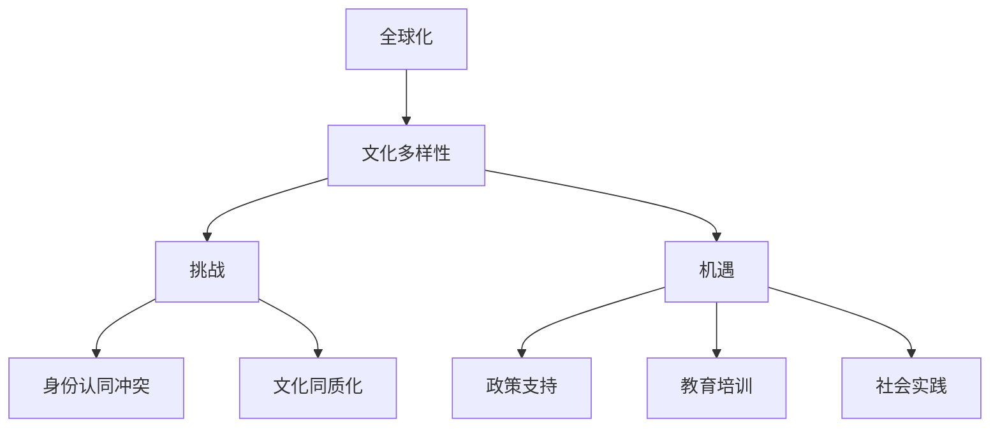

                 

## 引言与背景

### 1.1 全球化趋势的概述

全球化是21世纪不可逆转的历史进程，它不仅改变了全球经济格局，还对政治、文化和社会产生了深远影响。全球化最早可以追溯到15世纪的大航海时代，当时欧洲国家通过探险和殖民活动开启了全球贸易和交流的新篇章。进入20世纪，尤其是冷战结束和信息技术革命之后，全球化进程加速，跨国界、跨文化的交流与合作日益频繁。

经济全球化是全球化最显著的方面，国际贸易、跨国投资和全球供应链的不断发展，使得全球经济越来越成为一个整体。与此同时，政治全球化也在悄然发生，国际组织和多边合作机制的建立，如联合国、世界贸易组织、国际货币基金组织等，促进了国际关系的规范化与发展。

文化全球化则是全球化中最具争议的方面。随着信息技术和交通的快速发展，不同文化之间的交流与融合变得更加便捷，但这也带来了文化多样性的挑战。一方面，全球文化多元性得以展现和传承；另一方面，文化同质化趋势也在加剧，某些地方文化可能在全球化浪潮中逐渐消失。

### 1.2 全球化对文化多样性的挑战

全球化对文化多样性的影响是双重的。一方面，全球化促进了文化的交流与传播，使得人们能够更广泛地了解和欣赏其他文化。这种文化交流有助于增强文化多样性，扩大文化视野。然而，另一方面，全球化也可能导致文化同质化，即在全球经济和文化交流的过程中，某些强势文化（如西方文化）对其他文化产生压制效应，使得某些本土文化逐渐消失。

文化多样性的消失不仅意味着文化资源的损失，还可能引发社会问题。例如，当某个地区的传统文化受到忽视或压制时，当地居民的认同感可能会受到影响，导致社会不稳定。此外，全球化还可能加剧社会阶层分化，使得文化资源的分配不均，进一步加深文化多样性的危机。

### 1.3 维护文化多样性的重要性

维护文化多样性不仅是一种文化责任，也是社会发展和人类进步的重要保障。首先，文化多样性是人类文明的重要组成部分，它反映了人类社会的多样性和创造力。保护文化多样性有助于传承和发展人类文明，为后代留下丰富的文化遗产。

其次，文化多样性对社会稳定具有重要意义。当一个社会的文化多样性得到充分尊重和体现时，社会成员之间的认同感和凝聚力会增强，社会冲突和矛盾会减少。相反，如果文化多样性受到忽视或压制，社会成员之间的认同差异会加剧，导致社会动荡。

最后，文化多样性在经济全球化中也扮演着重要角色。具有多样文化的国家或地区往往能够更好地适应全球市场的变化，发挥自身的文化优势，推动经济发展。例如，文化产业作为一种独特的经济形式，具有巨大的市场潜力，能够在全球化背景下为国家或地区带来新的经济增长点。

### 1.4 身份认同与全球化

全球化对身份认同的影响是复杂且多维的。全球化使得人们更容易跨越地理和文化界限，接触和了解不同的身份认同。这种接触既有可能促进身份认同的多元化，增强个体对自身身份的理解和认同，也有可能导致身份认同的模糊化和混淆。

多重身份认同是全球化背景下的一种普遍现象。人们可能同时拥有多个身份认同，如民族身份、地区身份、宗教身份等。这些身份认同之间可能存在冲突或融合，如何处理这些冲突或融合，成为全球化时代身份认同研究的重要课题。

身份认同与民族、地区和文化的关系紧密。民族身份通常与特定的地理、历史和文化背景相关联，而地区身份和文化身份则更多地反映了个体的社会和人文特征。在全球化过程中，这些身份认同之间的关系可能会发生微妙的变化，例如，在某些情况下，民族身份可能变得更加突出，而在其他情况下，地区身份或文化身份可能更受关注。

综上所述，全球化对文化多样性和身份认同产生了深远影响。如何在全球化趋势中维护文化多样性，应对身份认同挑战，成为当前社会需要深入思考和解决的重要问题。

### 1.5 全球化对身份认同的具体影响

全球化对身份认同的影响是多层次且多方面的，具体表现如下：

首先，全球化加强了跨文化交流，使得人们能够更广泛地接触和了解不同的身份认同。这种跨文化交流有助于个体认识到自身身份的多元性，从而促进身份认同的多元化。例如，在互联网和社交媒体的普及下，人们可以通过各种平台了解和参与到不同文化背景下的生活，这种体验有助于增强个体对自身身份的理解和认同。

然而，全球化也带来了身份认同的模糊化和混淆。在全球化的背景下，人们可能面临多种身份认同的交织和冲突，例如，民族身份、地区身份、职业身份等。这种身份认同的模糊化可能导致个体在自我认同上感到困惑和矛盾，难以找到一个明确的自我定位。

其次，全球化对民族身份产生了显著影响。随着全球化的推进，民族国家的边界变得更加模糊，跨国民族社区和移民群体的数量不断增加。这些变化使得民族身份不再仅仅局限于地理和民族传统的范畴，而是更加强调文化和价值观的认同。例如，某些移民群体虽然生活在异国他乡，但仍然保持着对原民族的深厚感情和认同，这种现象被称为“全球民族主义”。

地区身份也在全球化中经历了变化。随着全球城市化的推进，地区身份逐渐从传统的地理和文化范畴扩展到更广泛的社会和经济领域。例如，一些地区可能因为其特殊的自然资源、经济发展模式或文化特色而形成独特的地区身份，这种身份不仅反映了当地的独特性，还成为了吸引全球关注和资源的重要优势。

最后，全球化对文化身份的影响尤为显著。文化身份是指个体对自身所属文化的认同和归属感，它在全球化的背景下面临着巨大的挑战和机遇。一方面，全球化使得文化传播变得更加便捷，个体可以更轻松地接触和了解不同文化，从而丰富自身的文化认同；另一方面，全球化也可能导致文化同质化，某些地方文化在全球化浪潮中逐渐消失，使得个体对自身文化身份感到困惑和不安。

总之，全球化对身份认同的影响是复杂且多样的。它既促进了身份认同的多元化，也带来了身份认同的模糊化和混淆。如何在全球化的背景下，维护和培育健康、多元的身份认同，是一个亟待解决的问题。

### 1.6 多重身份认同的挑战

在全球化的背景下，多重身份认同现象日益普遍，这不仅为个体提供了更加丰富和多样的身份选择，同时也带来了一系列复杂的挑战。首先，多重身份认同可能导致个体在自我认同上感到困惑和矛盾。例如，一个同时拥有中国和加拿大双重国籍的人，可能在文化价值观、语言和生活方式等方面感受到来自两个不同文化背景的压力，从而在自我认同上产生矛盾。

其次，多重身份认同也可能导致社会认同的冲突。当个体在多重身份之间感到难以调和时，他们可能会在社交和职业环境中面临压力，甚至遭受歧视。例如，某些情况下，拥有多重身份的个体可能会因为某一身份而受到歧视，这不仅损害了他们的个人尊严，还可能引发社会矛盾。

此外，多重身份认同还可能导致社会结构的复杂化。在社会层面上，多重身份认同使得社会成员之间的认同差异更加显著，这可能会加剧社会分裂和对立。例如，在一个多元民族国家中，不同民族的身份认同可能会引发民族冲突和分裂，影响社会稳定和和谐。

### 1.7 身份认同与民族、地区、文化的关系

身份认同是一个复杂的个体和社会现象，它涉及到民族、地区和文化等多个层面。首先，民族身份是身份认同的核心组成部分，通常与特定的民族传统、文化和历史背景紧密相关。民族身份不仅为个体提供了一种归属感和认同感，还反映了他们与特定民族群体的联系。例如，一个中国人可能因对中国文化的认同而感到自豪和归属，这种民族身份认同有助于增强社会凝聚力。

其次，地区身份与民族身份类似，但它更侧重于特定的地理和文化特征。地区身份可能因地理位置、历史传统和地方文化而形成，它为个体提供了对特定地区的认同感和归属感。例如，一个法国人可能因对法国南方地中海文化的认同而感到独特，这种地区身份认同有助于保护和传承地方文化。

文化身份是身份认同的另一个重要维度，它不仅包括民族和地区文化，还涵盖了更广泛的文化价值观、信仰和生活方式。文化身份反映了个体对特定文化体系的理解和认同，它可能因文化多元化而变得更加复杂和多样。例如，一个在美国生活的中国人可能同时拥有民族身份、地区身份和文化身份，这种多重身份认同使得个体的身份认同更加丰富和多样化。

综上所述，民族、地区和文化是身份认同的重要构成要素，它们相互交织、相互影响，共同塑造了个体的身份认同。在全球化的背景下，理解和处理好这些身份之间的关系，对于维护个体和社会的和谐具有重要意义。

### 1.8 文化多样性的理论基础

文化多样性作为一个重要的社会学概念，其理论基础经历了长期的发展和演变。最初，文化多样性主要被视为一种文化现象，强调不同文化之间的差异和多样性。随着时间的推移，文化多样性的概念逐渐扩展，不仅涵盖了文化差异，还包括了文化之间的相互联系和互动。

文化多样性的理论基础可以从多个角度进行探讨，首先是文化相对论。文化相对论认为，每种文化都有其独特的价值观、信仰和行为模式，不存在一种普遍适用的文化标准。这一理论强调，理解一种文化必须放在其特定的社会和历史背景中，这样才能真正理解其文化内涵。例如，西方社会的个人主义价值观与东方社会的集体主义价值观存在显著差异，这种差异反映了不同文化背景下的价值取向和行为规范。

其次是文化生态学。文化生态学借鉴了生物学生态学的概念，将文化看作一个生态系统，强调文化多样性对于整个社会系统的稳定和健康发展的重要性。文化生态学认为，文化多样性有助于社会适应性和创新能力的提升，能够促进社会进步。例如，一个具有多样文化的社会能够更好地适应外部环境的变化，通过文化间的交流和融合，实现文化的创新和发展。

此外，文化多样性理论还包括文化资本的概念。文化资本是指个体或群体通过文化教育和积累所获得的知识、技能和资源。文化资本的积累不仅有助于提升个体的社会地位，还能促进社会的整体发展。例如，一个拥有丰富文化资本的个体可能在职业、社交和学术领域获得更多的机会和优势，从而推动社会的文化进步。

综上所述，文化多样性的理论基础涵盖了文化相对论、文化生态学和文化资本等多个方面，这些理论共同构成了理解文化多样性的框架。通过这些理论，我们可以更深入地认识文化多样性的本质和其在社会发展中的重要性。

### 2.2 全球化与文化的互动

全球化对文化产生了深远的影响，这种影响既表现在文化的同质化趋势，也体现在多元文化的发展。首先，全球化导致了文化的同质化。在全球化的过程中，西方文化，尤其是美国文化，通过电影、音乐、时尚和互联网等渠道迅速传播，影响了全球各地的文化。例如，美国快餐品牌麦当劳和肯德基在全球范围内受到广泛欢迎，这反映了全球化对文化同质化的推动。

然而，与此同时，全球化也促进了文化的多元化。随着全球化的推进，不同文化之间的交流与融合变得更加频繁，这为文化的多样性提供了新的机会。例如，在全球化的背景下，印度的瑜伽、中国的茶文化和非洲的鼓乐等传统文化得以在全球范围内传播，丰富了全球文化的多样性。

全球化对本土文化的冲击与融合也是一个重要方面。在全球化的浪潮中，本土文化往往面临着巨大的挑战。一方面，本土文化可能因为外来文化的冲击而逐渐消失；另一方面，本土文化也可以通过与外来文化的融合，实现新的发展。例如，某些地方的传统节日，如中国的春节和印度的排灯节，在全球范围内得到了广泛的庆祝，这不仅保留了本土文化的特色，还使其与全球化进程相结合，焕发出新的生命力。

总之，全球化与文化的互动是一个复杂的过程，它既推动了文化的同质化，也促进了文化的多元化。在这一过程中，如何平衡文化同质化和文化多样性，保护本土文化的同时促进文化创新，是一个值得深入探讨的问题。

### 2.3 身份认同的理论框架

身份认同是一个复杂且多层次的概念，不同的理论框架为我们提供了理解和研究身份认同的不同视角。社会建构主义是其中一种重要的理论视角，它强调身份认同是通过对社会互动和象征性交流的建构过程而形成的。根据社会建构主义的观点，身份认同不仅是内在的自我感知，也是社会互动和交流的结果。

首先，社会建构主义认为，身份认同是通过社会互动和交流不断构建和重构的。人们在社会交往中不断通过言语、行为和符号来确认和表达自己的身份认同。例如，一个移民到新国家的人可能会通过与当地文化群体的互动，逐渐形成新的身份认同。这种互动不仅包括直接的面对面交流，还涵盖媒体、网络等虚拟空间中的交流。

其次，文化资本是理解身份认同的关键概念之一。文化资本指的是个体或群体通过文化教育和积累所获得的知识、技能和资源。文化资本的积累不仅有助于提升个体的社会地位，还能促进身份认同的多样性和复杂性。例如，一个拥有丰富文化资本的个体可能在职业、社交和学术领域获得更多的机会和优势，从而形成更加多元和独特的身份认同。

社会建构主义和文化资本的结合为我们提供了一个理解身份认同的全面框架。通过社会互动和交流，个体在获取和运用文化资本的过程中，不断构建和重构自己的身份认同。例如，一个来自不同文化背景的多元文化家庭，其成员在日常生活中通过语言、传统和价值观的交流，形成了独特的身份认同，这种身份认同不仅反映了他们个人的经历，也体现了他们所在社区的文化多样性。

总之，社会建构主义和文化资本为理解身份认同提供了重要的理论框架。通过这些框架，我们可以更深入地探讨身份认同的形成过程、影响因素以及其在全球化背景下的变化。

### 2.3.1 社会建构主义视角下的身份认同

社会建构主义视角下的身份认同认为，身份认同是通过社会互动和交流过程中的符号化实践而建构的。这种建构过程涉及个体在社会关系和网络中的定位，以及他们在不同情境中的角色扮演。例如，一个学生可能会在学校里通过学术成就建构出一个“优秀学生”的身份认同，而在家庭中通过参与家庭事务建构出一个“孝顺子女”的身份认同。

社会建构主义强调，身份认同不是固定不变的，而是动态的、可变的。个体在不同社会情境中的角色和身份认同可能会发生转换，这种转换反映了社会建构主义中的“情境化”概念。例如，一个在职场中担任领导角色的个体，可能会在家庭生活中扮演一个较为被动的角色，这表明身份认同在不同情境中的表现具有灵活性。

文化资本在身份认同的建构过程中起着关键作用。文化资本不仅包括知识和技能，还包括文化资源和符号性资本。例如，一个拥有丰富文化资本的个体可能在学术、职业和社会交往中占据优势地位，从而形成更加多元和复杂的身份认同。这种文化资本的积累过程，不仅影响了个体在社会中的地位，还影响了他们的自我认同和社会认同。

总之，社会建构主义视角下的身份认同强调身份认同是通过社会互动和交流不断建构和重构的，文化资本在这个过程中发挥着重要作用。通过理解这些概念，我们可以更深入地探讨身份认同的多样性和复杂性，以及在全球化背景下身份认同的变化。

### 2.3.2 文化资本与身份认同

文化资本是身份认同的重要组成部分，它不仅影响个体在社会中的地位，还塑造了他们的自我认同。根据皮埃尔·布尔迪厄（Pierre Bourdieu）的理论，文化资本可以分为三种形式：客观的、体制化的和内化的文化资本。

首先，客观的文化资本指的是物质文化资本，如书籍、艺术品、教育和职业资格等。这些资源可以明显地反映在个体的物质财富和职业成就上。例如，一个拥有丰富物质文化资本的个体可能在学术研究和职业生涯中占据优势地位，从而形成更加多元和复杂的社会身份。

其次，体制化的文化资本指的是通过教育、职业和社会制度而获得的文化资本。这种文化资本通常以制度和规范的形式存在，如学历、职称和资格证书等。例如，一个拥有高学历的个体在职场中可能更容易获得高级职位和更高的薪酬，这种体制化的文化资本有助于巩固和提升他们的社会地位和身份认同。

最后，内化的文化资本是指个体通过长期的文化熏陶和教育所获得的文化知识、技能和价值观念。这种文化资本是深植于个体的心理和行为中的，它不仅影响了他们的自我认同，还影响了他们在社会中的行为和决策。例如，一个在艺术和文化领域受过专业训练的个体，可能会在日常生活中展现出较高的审美水平和独特的文化视角，这种内化的文化资本使得他们的身份认同更加丰富和独特。

总之，文化资本在身份认同的建构过程中起着关键作用。通过不同的文化资本形式，个体不仅能够在社会中获得地位和认同，还能通过这些资本实现自我认同的多样化和复杂性。

### 2.3.3 全球化对身份认同的挑战与回应

全球化对身份认同带来了诸多挑战，同时也激发了一系列应对策略。首先，全球化导致了文化同质化的趋势，这使个体在多元文化社会中感到身份认同的模糊和困惑。在某些情况下，强势文化可能会压制本地文化，导致文化多样性的丧失，从而影响个体的身份认同。

面对这些挑战，社会和文化领域采取了多种回应策略。一方面，通过教育和文化宣传，提升公众对文化多样性的认知和尊重。例如，学校课程可以纳入多元文化内容，社区活动可以举办文化交流活动，以增强居民对本地文化的认同和自豪感。另一方面，政策制定者也在积极推动文化多样性的保护。例如，通过立法和行政手段，保护少数民族语言、传统和文化遗产，确保这些文化在全球化进程中得以传承和发展。

此外，社会组织和非政府组织（NGO）也发挥着重要作用。它们通过社区项目、文化活动和社会倡导，促进不同文化群体之间的理解和和谐。例如，一些NGO组织会开展跨文化交流项目，邀请不同文化背景的居民参与，通过共同的活动和交流，增进彼此的了解和认同。

总之，全球化对身份认同带来了挑战，但通过教育、政策和社区活动等回应策略，可以有效应对这些挑战，维护和促进文化多样性和身份认同的健康发展。

### 3.1 文化多样性与教育

文化多样性与教育密切相关，多元文化教育在全球化背景下显得尤为重要。多元文化教育的目标不仅在于传授知识，更在于培养具有全球视野和跨文化能力的人才。具体而言，多元文化教育的目标包括以下几个方面：

首先，增强学生对不同文化的认知和尊重。通过多元文化教育，学生可以了解不同文化的历史、价值观和生活方式，从而培养对文化多样性的认同和尊重。例如，学校可以开设关于不同民族和地区的课程，介绍他们的文化传统和习俗，帮助学生认识到文化多样性是人类社会的重要财富。

其次，培养跨文化沟通和合作能力。在全球化的背景下，跨文化交流和合作日益频繁，具有跨文化沟通能力的人才能更好地适应和参与国际事务。通过多元文化教育，学生可以学习如何有效沟通、合作和解决跨文化冲突。例如，学校可以组织跨文化交流活动，如国际学生交流项目、文化交流节等，为学生提供实践跨文化交流的机会。

最后，促进文化多样性与社会包容性的发展。多元文化教育不仅有助于培养具有多元文化素养的个体，还可以推动社会对文化多样性的包容和接纳。通过多元文化教育，社会可以更加关注和尊重不同文化背景的个体，减少文化歧视和偏见，促进社会和谐。

在实践层面，多元文化教育的挑战主要涉及教学内容的多样性和教师的文化素养。首先，教师需要具备较高的文化素养和教学能力，能够灵活运用多元文化教育资源。其次，学校需要提供丰富的教学资源，包括教材、教学工具和文化活动，以支持多元文化教育的实施。

总的来说，多元文化教育在全球化背景下具有重要意义，它不仅有助于培养具有全球视野和跨文化能力的人才，还可以促进社会文化多样性和包容性的发展。

### 3.1.1 多元文化教育的实践与挑战

多元文化教育的实践在全球范围内正逐渐推广，但由于文化背景、社会环境和教育资源的差异，其实践过程中面临诸多挑战。首先，教学内容的多样化是一个重要挑战。不同地区和学校可能对多元文化教育有着不同的理解和需求，这使得教学内容的设计和实施变得复杂。例如，某些学校可能缺乏相关的教材和教学资源，难以提供全面和系统的多元文化教育。

其次，教师的文化素养也是多元文化教育实施的关键。教师需要具备跨文化沟通和教学能力，能够有效传达多元文化知识，并引导学生正确理解和尊重不同文化。然而，很多教师可能没有接受过系统的多元文化教育培训，这限制了他们在多元文化教育中的表现。因此，提高教师的文化素养和教学能力成为多元文化教育实践的一个重要方向。

此外，多元文化教育还面临学生接受度的挑战。一些学生可能对多元文化教育持怀疑态度，甚至表现出排斥心理。这可能是由于他们对不同文化的误解或偏见，也可能是由于多元文化教育未能充分满足学生的实际需求。为了提高学生的接受度，学校需要通过互动式教学、实践活动和家校合作等方式，增强学生对多元文化教育的认同感。

总之，多元文化教育在实践中面临诸多挑战，需要通过不断探索和创新，找到适合不同地区和学校实际情况的解决方案，从而实现多元文化教育的目标。

### 3.1.2 教育中文化多样性的教学策略

为了有效实施多元文化教育，教师需要采用一系列教学策略，这些策略应旨在促进学生对不同文化的理解和尊重。以下是一些关键的教学策略：

首先，引入多元文化课程资源。教师可以通过引入不同文化的教材、故事书、电影和音乐等资源，丰富教学内容，使学生接触到多样化的文化。例如，在阅读教材中可以包括来自不同文化背景的文学作品，通过这些作品让学生感受不同文化的魅力和内涵。

其次，开展互动式教学活动。互动式教学能够激发学生的兴趣和参与度，使他们更加主动地学习。教师可以通过组织小组讨论、角色扮演和项目合作等活动，让学生在互动中学习如何尊重和欣赏不同文化。例如，在课堂上，学生可以分组讨论不同文化中的节日和习俗，并通过展示和分享，增进对彼此文化的了解。

第三，利用技术工具增强教学效果。现代信息技术提供了丰富的教学资源，如在线课程、虚拟现实和多媒体教材等。教师可以利用这些工具，创造一个沉浸式的学习环境，让学生更直观地感受不同文化的特点和内涵。例如，通过虚拟现实技术，学生可以虚拟访问不同国家的文化遗址，亲身体验当地的风俗和生活方式。

最后，加强家校合作。家庭是孩子接受文化教育的第一课堂，教师应与家长建立良好的沟通渠道，共同推动多元文化教育。教师可以通过家长会、通讯录和社交媒体等途径，向家长传递多元文化教育的理念和重要性，鼓励家长参与和支持学校的教育活动。

总之，通过引入多元文化课程资源、开展互动式教学活动、利用技术工具和加强家校合作，教师可以有效地促进学生对不同文化的理解和尊重，实现多元文化教育的目标。

### 3.1.3 教育政策的多元化影响

教育政策的制定和实施对于推动多元文化教育具有关键作用。首先，政府可以通过立法和政策文件明确多元文化教育的地位和目标，为教育机构提供政策指导和资金支持。例如，某些国家制定了专门的多元文化教育法案，规定学校必须开设多元文化课程，确保学生接受全面的文化教育。

其次，教育政策的多元化影响体现在师资培训上。政府可以资助教师参加多元文化教育培训班，提高他们的文化素养和教学能力。例如，通过开展暑期培训班、工作坊和在线课程，教师可以系统地学习多元文化教育理论和方法，从而更好地开展教学活动。

此外，教育政策还影响着课程内容的设置和教材的编写。政府可以推动教育部门编写多元文化教材，确保教学内容涵盖不同文化背景的知识。例如，教材中可以包括不同民族的历史、文化和价值观，帮助学生全面了解和尊重文化多样性。

总之，通过制定和实施多元化的教育政策，政府可以有效地推动多元文化教育的发展，培养具有全球视野和跨文化能力的人才，促进社会的文化多样性和包容性。

### 3.2 文化多样性与经济

文化多样性与经济之间存在着紧密的关联，这不仅体现在文化产业的发展上，也反映在全球化市场中的经济价值上。首先，文化产业作为一种独特的经济形式，在全球经济中扮演着日益重要的角色。文化产业涵盖了电影、音乐、文学、艺术等多个领域，这些领域的繁荣不仅为经济提供了新的增长点，还促进了文化多样性的传承和发展。

具体来说，文化产业具有以下几个方面的经济价值。首先，文化产业的快速发展带动了相关产业链的形成，如影视制作、音乐制作、出版发行等，从而创造了大量的就业机会。其次，文化产品的全球化传播，使得文化产业成为国家对外展示软实力的重要途径。例如，好莱坞电影和韩国流行音乐在全球范围内受到广泛欢迎，这不仅提升了这些国家的国际影响力，还带来了可观的经济收益。

其次，文化多样性的经济价值还体现在全球市场中的竞争优势上。具有丰富文化资源的国家或地区，往往能够更好地满足全球消费者多样化的文化需求。例如，日本动漫在全球市场的成功，得益于其深厚的文化底蕴和独特的艺术风格，这种文化优势使得日本动漫在国际市场上具有强大的竞争力。

此外，文化多样性与经济发展之间也存在一定的互动关系。一方面，经济发展为文化多样性的保护和传承提供了物质基础。例如，政府在文化保护方面的投资，可以确保非物质文化遗产得到有效的保存和传播。另一方面，文化多样性的发展也能反哺经济，促进旅游业、文化创意产业等相关行业的发展。例如，某些地区通过举办文化节、民俗节等活动，不仅吸引了大量游客，还带动了当地经济的繁荣。

总之，文化多样性与经济之间的关系是复杂且相互促进的。在全球化的背景下，如何有效发挥文化多样性的经济价值，推动文化产业的发展，是一个值得深入探讨的问题。

### 3.2.1 文化产业与全球化

文化产业在全球化的背景下经历了显著的变化和发展。全球化不仅为文化产业提供了更广阔的市场，还带来了新的挑战和机遇。首先，全球化推动了文化产品的跨国传播和消费，使得文化产业的全球化程度日益加深。例如，好莱坞电影、美国流行音乐、法国文学等文化产品在全球范围内拥有广泛的受众，这种现象被称为“文化全球化”。

其次，全球化促进了文化产业的多样性和创新。随着全球文化交流的频繁，不同文化之间的互动和融合成为文化产业发展的新动力。例如，一些国家的电影产业开始融入其他文化的元素，创作出兼具本土特色和全球吸引力的新作品。此外，全球化还推动了文化产业的数字化转型，如数字媒体、流媒体服务等新兴业态的崛起，为文化产业的发展提供了新的增长点。

然而，全球化也带来了一定的文化同质化风险。强势文化，如美国文化，在全球化过程中占据了主导地位，这可能对其他文化的多样性和独特性造成冲击。因此，如何在全球化背景下保持和促进文化多样性，成为文化产业面临的重要课题。

### 3.2.2 文化多样性的经济价值

文化多样性在经济全球化中具有重要的经济价值，它不仅能够推动文化产业的发展，还能够增强国家的竞争力。首先，文化多样性为文化产业提供了丰富的创作素材和灵感来源。不同文化的碰撞与融合，能够激发出新的艺术形式和创意产品，从而推动文化产业的创新与发展。例如，日本动漫产业之所以在全球市场具有强大竞争力，部分原因在于其深入挖掘本土文化，将传统元素与现代艺术相结合，创作出具有独特魅力的作品。

其次，文化多样性有助于提升国家的软实力和国际影响力。具有丰富文化资源的国家，能够在国际舞台上展示其独特的文化魅力，增强国家的文化软实力。例如，中国通过推广传统节日、文化遗产和现代文化产品，逐渐在国际上树立了良好的文化形象，提升了国家的国际影响力。

此外，文化多样性还能够促进旅游业的发展。丰富的文化遗产和独特的文化体验是吸引游客的重要因素。例如，法国凭借其丰富的文化遗产和艺术氛围，每年吸引了大量国际游客，从而带动了旅游业和相关产业的繁荣。

总之，文化多样性的经济价值不仅体现在文化产业和旅游业上，还通过增强国家的文化软实力和国际影响力，为国家经济的可持续发展提供了强有力的支持。

### 3.2.3 文化多样性与国际市场策略

文化多样性与国际市场策略之间的互动关系对于企业在全球化背景下的发展至关重要。首先，企业需要充分了解和利用文化多样性的优势，以制定更具针对性的市场进入策略。例如，一家跨国公司进入一个新市场时，可以通过研究当地的文化传统、消费习惯和价值观，调整其产品和服务，以更好地满足当地消费者的需求。例如，可口可乐在进入中国时，推出了符合中国口味和习惯的饮料产品，取得了显著的市场成功。

其次，企业应注重跨文化交流与沟通，以减少文化差异带来的误解和冲突。通过开展跨文化培训，提高员工的跨文化意识和沟通能力，企业可以更好地应对国际市场的挑战。例如，华为在进入欧洲市场时，通过在当地设立培训中心和举办跨文化研讨会，提高了员工的跨文化沟通能力，有效地促进了市场开拓。

此外，企业还可以利用文化多样性进行品牌塑造和市场定位。通过在品牌宣传中融入当地文化元素，企业可以增强品牌的亲和力和认同感。例如，麦当劳在进入印度市场时，推出了符合印度消费者口味的咖喱汉堡，并通过宣传其尊重印度文化和饮食习惯，成功吸引了大量消费者。

总之，文化多样性的国际市场策略不仅有助于企业拓展全球市场，还能够提升品牌形象和市场竞争力。通过深入了解和利用文化多样性的优势，企业可以在全球市场中脱颖而出，实现可持续发展。

### 3.3 文化多样性与社会政策

文化多样性与社会政策之间的关系至关重要，政策制定者在设计社会政策时需要充分考虑文化多样性因素，以确保政策的公平性和包容性。首先，文化多样性在社会政策中体现为对多元文化的尊重和保护。政策制定者应确保不同文化群体在政策制定和实施过程中具有平等的参与机会，避免文化歧视和偏见。例如，在制定教育政策时，应充分考虑不同民族和文化的教育需求，提供多样化的教育资源和课程设置，以确保所有学生都能接受到适合自己的教育。

其次，社会政策需要考虑到文化多样性对社会保障和服务的影响。不同文化群体可能有不同的价值观、习俗和需求，这要求社会政策在提供社会保障和服务时具有灵活性和适应性。例如，在医疗政策中，应尊重不同文化的医疗习俗和信仰，提供符合不同文化需求的医疗服务。此外，政策制定者还应关注文化多样性对社会保障制度的挑战，如如何确保移民群体在享受社会保障时不会受到不公平待遇。

第三，社会政策应促进不同文化群体之间的融合与交流。通过开展文化活动和社区建设，增强文化群体之间的了解和互动，有助于减少社会分裂和对立。例如，政府可以资助举办文化节、民俗节等活动，为不同文化群体提供交流和展示的平台，促进文化的多样性和融合。

总之，文化多样性与社会政策之间的关系紧密，政策制定者应在设计社会政策时充分考虑文化多样性的因素，以确保政策的公平性和包容性，促进社会的和谐与稳定。

### 3.3.1 多元文化社会政策的制定

多元文化社会政策的制定是一个复杂且系统的过程，需要政策制定者充分理解和尊重不同文化群体的需求和权益。首先，政策制定者应通过广泛的调研和咨询，深入了解各个文化群体的价值观、习俗和需求。这可以通过开展问卷调查、组织焦点小组讨论和进行深度访谈等方式实现。通过这些方法，政策制定者可以收集到真实、全面的文化数据，为政策制定提供有力支持。

其次，政策制定者应建立一个多元代表和参与的政策制定机制。这意味着在政策制定过程中，应邀请来自不同文化背景的代表参与，确保他们的声音和意见能够得到充分体现。例如，可以通过设立多元文化委员会或聘请文化顾问，确保在政策讨论和决策过程中，各种文化观点和需求得到平衡和考虑。

此外，政策制定者还应确保政策的实施具有灵活性和适应性。由于不同文化群体的需求和习俗各异，政策在具体实施过程中可能需要进行调整和优化。例如，在提供社会保障和公共服务时，政策应允许根据文化背景进行个性化的服务设计，以满足不同群体的特定需求。

总之，多元文化社会政策的制定需要政策制定者进行深入调研、建立多元参与机制和确保政策的灵活实施，以实现政策的公平性和包容性。

### 3.3.2 文化多样性与社会包容性

文化多样性与社会包容性密切相关，一个包容的社会能够有效接纳和尊重不同文化背景的个体，促进社会的和谐与发展。首先，社会包容性强调尊重个体的多样性，无论是民族、宗教、性别还是文化背景，每个个体都应享有平等的权利和机会。这种包容性不仅体现在法律和政策层面，更体现在社会文化氛围中。一个包容的社会能够创造一个多元、和谐的环境，使不同文化群体能够和谐共处，减少文化冲突和歧视。

其次，文化多样性的社会包容性有助于增强社会凝聚力。通过尊重和欣赏不同文化的独特性，社会成员能够更好地理解和接纳彼此，从而增强社会认同感和归属感。例如，在多元文化社区中，通过举办文化节、民俗节等活动，不仅能够展示和传承各种文化，还能促进不同文化群体之间的交流和互动，增进彼此的了解和友谊。

此外，文化多样性的社会包容性还能够推动社会的创新与发展。不同文化之间的碰撞和融合，往往能够激发出新的思想、创意和解决方案，从而促进社会的进步。例如，在科技、艺术、经济等领域，跨文化的合作和创新已经成为推动社会发展的新动力。

总之，文化多样性与社会包容性相互促进，一个包容的社会能够更好地维护和促进文化多样性，实现社会的和谐与繁荣。

### 3.3.3 全球化背景下的文化政策调整

在全球化的背景下，文化政策的调整成为各国政府面临的重要课题。全球化不仅带来了文化的交融与碰撞，也对本土文化保护提出了新的挑战。首先，政府需要认识到全球化对本土文化的潜在威胁，并采取积极的措施来保护和发展本土文化。例如，可以通过立法手段加强对本土文化遗产的保护，如设立文化遗产保护区、建立文化博物馆等，以确保这些文化财富得以传承。

其次，政府应推动本土文化的创新与传播，以增强其全球竞争力。这可以通过支持本土文化产业的发展、资助文化创作项目和推广本土文化产品等方式实现。例如，政府可以设立文化创新基金，支持艺术家和创作者进行创新实验，推动本土文化在国际市场上的传播和认可。

此外，政府还应加强文化交流与合作，促进不同文化之间的相互理解和尊重。这可以通过举办国际文化节、支持跨文化交流项目等方式实现。通过这些文化交流活动，不仅能够提升本土文化的国际影响力，还能增进各国人民之间的相互了解和友谊。

总之，在全球化的背景下，文化政策的调整需要兼顾文化保护和创新传播，以实现文化的可持续发展。

### 4.1.1 政策层面的措施

在维护文化多样性方面，政策层面的措施具有重要作用。首先，国家层面的文化政策需要明确维护文化多样性的目标和原则，并通过立法和行政手段确保这些政策的有效实施。例如，一些国家通过制定文化遗产保护法，明确规定对非物质文化遗产的保护措施，确保这些文化财富得以传承和发展。

其次，地区性的文化保护措施也非常重要。地方政府可以根据本地文化特色和实际情况，制定具体的文化保护政策。例如，在一些多民族地区，政府可以设立民族文化保护区，通过政策扶持和资金投入，保护和传承当地民族文化。

此外，国际合作与文化交流也是维护文化多样性的重要手段。各国可以通过签订文化合作协议，开展文化交流项目，促进不同文化之间的相互理解和尊重。例如，联合国教科文组织（UNESCO）通过多项国际公约和倡议，推动全球文化多样性的保护和传承。

总之，政策层面的措施为维护文化多样性提供了制度保障，通过国家、地区和国际多层次的协同努力，可以有效促进文化多样性的保护和传承。

### 4.1.2 国家层面的文化政策

国家层面的文化政策在维护文化多样性方面起着至关重要的作用。首先，文化政策的制定需要明确保护文化多样性的目标和原则。各国政府应通过立法手段，将维护文化多样性纳入国家发展战略，确保文化政策的连续性和稳定性。例如，许多国家通过制定《文化遗产保护法》或《文化多样性促进法》，明确规定了文化遗产和少数民族文化的保护措施，为文化多样性提供了法律保障。

其次，文化政策需要具备灵活性和适应性，以应对不断变化的社会环境。政府可以通过定期评估文化政策的有效性，及时调整和优化政策内容。例如，在全球化背景下，文化政策可以加强对跨国文化交流的引导和支持，促进本土文化与全球文化的融合与创新。

此外，政府还应加大对文化多样性的财政投入，确保文化保护和发展的资金来源。通过设立专项基金、提供财政补贴和税收优惠等措施，政府可以鼓励企业和个人参与文化多样性保护和传承，推动文化产业的发展。

总之，国家层面的文化政策在维护文化多样性方面具有决定性作用。通过制定明确的目标和原则、具备灵活性和适应性、以及加大财政投入，政府可以有效地保护和传承文化多样性，促进社会的和谐与进步。

### 4.1.3 地区性的文化保护措施

地区性的文化保护措施在维护文化多样性中起着至关重要的作用，特别是对于多民族地区和文化遗产丰富的地区。首先，多民族地区可以通过建立民族文化保护区，保护各民族的文化传统和文化遗产。例如，在中国云南省，政府设立了多个民族文化保护区，通过提供资金支持和政策保障，帮助少数民族保护和发展其独特的传统文化。

其次，地区性文化保护措施可以包括设立地方文化遗产名录，对重要的文化遗产进行保护和修缮。例如，在意大利托斯卡纳大区，政府定期评估和更新地方文化遗产名录，确保这些文化遗产得到有效保护。

此外，社区参与是地区性文化保护的重要手段。政府可以鼓励社区成员积极参与文化保护活动，如举办民俗节、文化展览和传统手工艺制作等活动。通过这些活动，不仅能够增强社区居民的文化认同感和自豪感，还能促进不同文化之间的交流与融合。

总之，地区性的文化保护措施通过多种途径，有效地维护了文化多样性，为文化遗产的传承和发展提供了坚实的基础。

### 4.1.4 国际合作与文化交流

国际合作与文化交流在维护文化多样性方面具有重要意义。首先，国际合作可以促进全球范围内的文化保护与传承。例如，联合国教科文组织（UNESCO）通过《世界遗产名录》和《保护非物质文化遗产公约》等国际公约，推动各国共同保护和传承世界级文化遗产。这些国际公约不仅提供了法律保障，还促进了各国在文化遗产保护方面的合作与交流。

其次，文化交流可以增进不同文化群体之间的相互理解和尊重。通过举办国际文化节、文化展览和学术研讨会等活动，各国可以分享文化成果，增进文化认同和共鸣。例如，德国的柏林艺术节和法国的戛纳电影节，都是全球知名的文化交流活动，吸引了众多国家和地区参与，促进了全球文化多样性的发展。

此外，国际合作与文化交流还可以促进文化创新和经济发展。通过跨国合作，各国可以共同开发文化资源，创作出具有全球影响力的新作品。例如，好莱坞电影产业的成功，部分得益于美国与欧洲、亚洲等地区的跨国合作，使得电影作品能够跨越文化边界，受到全球观众的喜爱。

总之，国际合作与文化交流是维护文化多样性不可或缺的手段。通过加强国际合作和促进文化交流，我们可以更好地保护和传承全球文化遗产，推动文化多样性的可持续发展。

### 4.2.1 社会组织的角色

在维护文化多样性方面，社会组织扮演着至关重要的角色。首先，非政府组织（NGO）通过开展各类文化保护项目，为文化遗产的保护和传承提供了重要支持。例如，国际自然保护联盟（IUCN）通过发起保护濒危文化的项目，帮助各国政府和非政府组织共同保护非物质文化遗产。这些项目不仅提供了技术支持，还通过社区参与和公众教育，提高了社会对文化多样性的认知和重视。

其次，社区在文化多样性的维护中也起着重要作用。社区文化活动的组织和实施，有助于增强社区居民的文化认同感和归属感。例如，在某些多民族社区，通过举办民俗节、文化展览和社区文化节等活动，居民们可以共同庆祝和传承各自的文化传统，促进不同文化之间的交流和融合。

此外，社会组织还可以通过倡导和实施文化多样性政策，推动政府和社会各界对文化多样性的重视。例如，某些国际性非政府组织，如国际文化协会（ICA），通过政策倡导和公共宣传，提高公众对文化多样性的认识和接受程度，为文化多样性的维护创造良好的社会环境。

总之，社会组织在文化多样性维护中的角色是多方面的，通过项目实施、社区活动和政策倡导，它们为文化多样性的保护和发展做出了重要贡献。

### 4.2.2 社区文化的推动与发展

社区文化是文化多样性的基石，其推动与发展在维护文化多样性中具有重要意义。首先，社区文化活动的组织和实施有助于增强居民的文化认同感和归属感。通过举办民俗节、文化节和社区艺术创作等活动，居民们可以共同庆祝和传承各自的文化传统，促进社区成员之间的相互了解和尊重。

其次，社区文化的发展有助于促进文化交流与融合。不同社区之间的文化交流活动，如文化展览、艺术交流活动和共同的文化项目，不仅能够丰富居民的文化生活，还能促进不同文化之间的相互理解和尊重。例如，一个多民族社区通过定期举办文化交流活动，可以让来自不同民族背景的居民共同参与，分享各自的文化特色，增进彼此的了解和友谊。

此外，社区文化的发展还可以为文化产业的发展提供新的动力。通过社区文化活动和项目，可以挖掘和传承本地文化，创造出具有地方特色的文化产品和艺术形式，从而推动文化产业的发展。例如，某些社区通过举办传统手工艺制作工作坊和文化旅游活动，不仅增强了社区的文化氛围，还带动了本地经济的发展。

总之，社区文化的推动与发展在维护文化多样性中发挥了重要作用。通过促进文化交流与融合、增强居民的文化认同感和推动文化产业的发展，社区文化成为维护文化多样性的重要力量。

### 4.2.3 文化多样性的社区实践案例

社区实践在文化多样性维护中扮演着关键角色，以下是一些具体案例，展示了社区在促进文化多样性和身份认同方面的成功经验。

#### 案例一：多文化社区节庆活动

在美国的芝加哥，一个名为“国际屋”（International House）的多文化社区中心每年举办“国际屋节庆”，该活动吸引了来自世界各地不同文化背景的居民参与。通过举办文化展览、传统食品品尝、民族音乐表演和民俗舞蹈展示等活动，居民们得以相互了解和尊重彼此的文化。这种节庆活动不仅促进了文化多样性的展现，还增强了居民对社区的归属感和认同感。

#### 案例二：社区文化遗产项目

在中国广东省的潮州，社区组织发起了一个名为“潮州文化遗产保护项目”，通过挖掘和传承潮州戏曲、潮州木雕和潮州美食等文化遗产，帮助社区居民了解和传承本土文化。该项目组织了一系列文化活动，包括传统戏曲表演、木雕工作坊和美食节，吸引了大量社区居民和游客参与。这不仅促进了潮州文化在社区中的传承，还增强了居民对本地文化的认同和自豪感。

#### 案例三：跨文化社区教育项目

在加拿大的温哥华，一个名为“多元文化社区学校”的项目，通过跨文化交流课程和活动，帮助不同文化背景的学生和居民相互了解和尊重。该项目开设了关于不同民族历史、文化和价值观的课程，并组织了跨文化的社会实践项目，如社区志愿服务和文化交流活动。这些项目不仅丰富了学生的文化知识，还促进了不同文化群体之间的融合和交流。

通过这些社区实践案例，我们可以看到，社区在促进文化多样性和身份认同方面发挥了重要作用。通过多样化的社区活动和项目，社区不仅成为了文化多样性的展示平台，还为居民提供了一个交流和互动的场所，增强了他们的文化认同感和社区凝聚力。

### 4.3.1 成功的文化多样性保护案例

在维护文化多样性的实践中，世界各地有许多成功的案例，展现了文化保护与创新、文化交流与融合的卓越成果。以下是一些具体案例及其对文化多样性保护的启示。

#### 案例一：韩国传统文化保护

韩国通过制定《文化遗产保护法》，建立了完善的非物质文化遗产保护体系。政府设立了文化遗产保护区，对传统建筑、民俗节庆、音乐舞蹈等文化遗产进行保护和传承。同时，韩国还积极推动文化创新，通过现代艺术形式对传统文化进行重新演绎，如将韩服和传统音乐融入现代时尚和音乐会中。这种文化保护与创新相结合的策略，不仅成功地传承了韩国的传统文化，还使其在全球文化市场中焕发出新的生命力。

#### 案例二：法国文化多样性政策

法国是文化多样性政策的先驱之一，其政策涵盖了文化遗产保护、语言多样性、移民文化融合等多个方面。例如，法国政府设立了国家语言博物馆，通过展览和活动推广法语及其他少数民族语言。此外，法国还通过多元文化教育政策，鼓励学校开设多元文化课程，确保学生了解和尊重不同文化。这些政策不仅促进了文化多样性的保护，还增强了社会的包容性和凝聚力。

#### 案例三：中国传统文化复兴

在中国，近年来政府积极推动传统文化复兴，通过举办文化活动、设立文化遗产保护区和资助传统手工艺项目，保护和传承中国丰富的文化遗产。例如，中国政府设立了“国家非物质文化遗产名录”，并组织了一系列传统文化节庆活动，如中国春节、中秋节等。这些活动不仅吸引了大量游客，还增强了国民对传统文化的认同感和自豪感。

通过这些案例，我们可以看到，成功的文化多样性保护不仅需要政策支持和资金投入，还需要创新思维和公众参与。在全球化的背景下，如何有效地保护和传承文化多样性，是一个值得深入探讨的问题。

### 4.3.2 文化多样性冲突的解决案例

文化多样性冲突在全球化和移民背景下日益增多，解决这些问题需要综合的策略和多方合作。以下是一些具体的解决案例：

#### 案例一：德国多元文化城市的融合策略

德国在处理多元文化城市冲突方面取得了显著成效。柏林的多元文化社区通过制定融合策略，如建立文化融合委员会、开展文化交流活动和提供双语教育等，成功促进了不同文化背景居民之间的融合。例如，柏林市政府定期举办多元文化节，邀请各文化群体的居民共同参与，通过文化交流增进理解和尊重。这种策略不仅减少了文化冲突，还增强了社区的凝聚力。

#### 案例二：新加坡的多元文化和谐政策

新加坡作为一个多民族国家，通过实施多元文化和谐政策，成功实现了不同文化背景居民之间的和谐共处。新加坡政府设立了多元文化委员会，负责制定和实施文化融合政策。例如，通过举办“文化节”和“多元文化日”，政府鼓励不同文化群体展示和传承各自的文化，同时加强文化教育，提高公众对文化多样性的认知和尊重。这种政策有效促进了社会和谐，减少了文化冲突。

#### 案例三：美国的多元文化社区项目

在美国，一些城市通过实施多元文化社区项目，成功解决了多元文化背景下的社区冲突。例如，洛杉矶的非营利组织“多元文化社区中心”通过组织社区活动、提供文化教育和咨询服务，帮助不同文化背景的居民建立互信和合作。该项目还开设了文化交流课程，让居民了解和尊重彼此的文化，通过共同活动增进社区凝聚力。这种项目模式为其他城市提供了有效的解决思路。

总之，通过制定融合策略、加强文化交流和教育，可以有效解决文化多样性冲突，促进社会和谐与稳定。

### 4.3.3 全球化背景下的文化创新案例

在全球化的背景下，文化创新成为推动文化多样性和经济发展的新动力。以下是一些具体案例，展示了如何在全球化的浪潮中，通过文化创新实现文化多样性的保护和传承。

#### 案例一：日本动漫产业的发展

日本动漫产业在全球文化市场中占据重要地位，其成功离不开文化创新。日本动漫不仅保留了传统的漫画元素，还融入了现代技术和全球化视野。例如，通过三维动画技术和虚拟现实（VR）技术，日本动漫作品在全球范围内吸引了大量观众。同时，日本动漫产业还积极与其他文化进行融合，创作出具有全球吸引力的作品，如《进击的巨人》和《你的名字》。这种文化创新不仅推动了日本文化在全球范围内的传播，还促进了文化多样性的发展。

#### 案例二：中国数字文化的崛起

随着数字技术的快速发展，中国文化产业也迎来了新的机遇。例如，中国的数字游戏产业和流媒体平台在全球市场取得了显著成就。以腾讯和阿里巴巴为代表的数字文化企业，通过创新技术和商业模式，将中国传统故事和现代元素相结合，创作出具有全球影响力的数字文化产品。例如，《王者荣耀》和《阴阳师》等游戏不仅在中国市场取得了巨大成功，还在全球范围内拥有大量粉丝。这种数字文化创新不仅推动了中国文化在全球的传播，还促进了文化多样性的发展。

#### 案例三：印度的音乐与舞蹈创新

印度音乐和舞蹈在全球文化领域中具有重要地位，印度艺术家通过不断创新，将传统音乐和舞蹈与现代元素相结合，创作出具有时代特色的新作品。例如，印度流行音乐（Bhangra）和宝莱坞电影结合了传统音乐和舞蹈，形成了独特的文化表现形式，深受全球观众的喜爱。这种文化创新不仅保持了印度传统音乐的活力，还推动了印度文化在全球范围内的传播和认可。

总之，通过文化创新，全球化背景下的文化多样性和经济发展得到了有效结合。这些案例表明，文化创新不仅能够保护和传承传统文化，还能在全球市场中创造新的机遇，推动文化多样性的可持续发展。

### 4.4.1 信息技术与文化传播

信息技术在文化传播中的作用日益显著，互联网和数字媒介为文化多样性的展现和传承提供了新的平台和机遇。首先，互联网的普及使得文化传播的途径更加多样和便捷。通过社交媒体、博客、视频平台和在线论坛等，个人和组织可以轻松地发布和传播文化内容，使得全球观众能够随时随地接触到各种文化形式。例如，YouTube上的博主和视频创作者通过上传原创内容，不仅能够展示和推广自己的文化，还能吸引全球粉丝，实现跨文化的传播。

其次，数字媒介促进了文化多样性的传承和发展。数字技术使得文化资源的数字化和存储变得简单高效，从而保护了非物质文化遗产和濒危文化。例如，一些文化组织通过将传统音乐、舞蹈和手工艺制作过程等视频资料上传到互联网，不仅为后人留下了宝贵的文化遗产，还使得这些文化形式得以在全球范围内传播和传承。此外，数字媒介还提供了文化教育和学习的新途径，如在线课程和文化教育APP，使得人们可以更便捷地了解和学习不同文化。

总的来说，信息技术和数字媒介为文化传播带来了前所未有的机遇，不仅促进了文化多样性的展现，还为文化的传承和发展提供了新的动力。

### 4.4.2 媒体政策与监管

媒体政策与监管在文化多样性维护中扮演着至关重要的角色。首先，政府通过制定和实施媒体政策，可以确保文化内容的多元性和公平性，防止文化同质化。例如，一些国家通过立法规定，媒体必须播放一定比例的本地文化内容，以保护本国文化的多样性和独特性。此外，政府还可以通过补贴和扶持措施，鼓励媒体制作和传播多元文化内容，特别是那些面临消失威胁的边缘文化。

其次，媒体监管机构在确保文化多样性的实现中发挥着监督和调控作用。这些机构可以通过审查和评估媒体内容，确保其不含有歧视性或攻击性的内容，同时促进文化多样性的展示。例如，监管机构可以定期审查电视节目、电影和在线平台的内容，确保它们在尊重多样性的同时，不损害其他文化的利益。

此外，媒体政策与监管还可以通过促进跨文化交流，增强不同文化群体之间的理解和尊重。通过支持跨国合作项目和跨文化交流活动，政府可以鼓励媒体在不同文化之间搭建桥梁，促进文化的多样性和融合。总之，媒体政策与监管是维护文化多样性的重要手段，通过合理的政策和有效的监管，可以确保文化内容的多层次、多维度传播，促进文化多样性的可持续发展。

### 4.4.3 新媒体与跨文化传播

新媒体在跨文化传播中发挥着重要作用，通过创新的内容创作和传播策略，实现了文化多样性的广泛传播和交流。首先，社交媒体平台如Facebook、Twitter和Instagram等，为跨文化传播提供了便捷和高效的渠道。这些平台上的用户生成内容（UGC）使得文化信息的传播不再受限于传统媒体的时间和地域限制，促进了全球范围内的文化交流。例如，通过社交媒体，一个来自非洲的部落舞蹈视频可以在短时间内被全球观众观看和分享，从而提升了该文化的知名度和影响力。

其次，新媒体平台的互动性为跨文化传播带来了新的机遇。通过评论、点赞和分享功能，用户可以直接参与到文化内容的讨论和传播中，这不仅增强了用户的参与感，还促进了文化的多样性和包容性。例如，在YouTube上，用户可以通过评论功能与其他观众交流对某一文化内容的看法，从而形成跨文化对话和互动。

此外，新媒体还通过数据分析和技术优化，实现了精准的文化传播。通过分析用户的浏览记录和兴趣偏好，新媒体平台可以推荐符合用户兴趣的文化内容，从而提高文化传播的效率和效果。例如，Netflix通过算法分析用户观看历史和搜索记录，为其推荐符合个人口味的文化作品，从而实现了跨文化的精准传播。

总之，新媒体在跨文化传播中不仅提供了便捷和高效的传播渠道，还通过互动性和精准传播策略，促进了文化多样性的广泛传播和交流。

### 4.5.1 全球化背景下的身份认同困境

在全球化的背景下，身份认同面临着诸多困境。首先，全球化加速了文化的同质化，导致本土文化受到压制，个体在多元文化环境中难以找到自己的身份定位。例如，在某些发展中国家，西方文化的影响使得本土传统文化逐渐式微，导致年轻一代在文化认同上产生困惑。其次，全球化促进了人口迁移和多元文化社区的兴起，个体可能面临多重身份认同的挑战。例如，移民在融入新文化的同时，往往难以完全抛弃自己的原生文化，这可能导致身份认同的冲突和焦虑。最后，全球化也加剧了社会阶层分化，使得文化资源的分配不均，进一步加深了身份认同的困境。例如，在经济全球化的过程中，某些文化群体可能因缺乏经济资源而难以维护和传承自己的文化，从而面临文化丧失的风险。总之，全球化背景下的身份认同困境需要通过多元化的策略和措施加以应对。

### 4.5.2 全球化对民族认同的影响

全球化对民族认同产生了深远的影响，这种影响体现在多个层面。首先，全球化促进了跨国民族社区的形成，使得民族认同不再局限于地理边界，而是更多地依赖于文化和价值观的认同。例如，许多海外华人尽管生活在他乡，但仍然保持着对中国文化的认同和联系，形成了全球华人社区。这种跨国民族社区不仅增强了民族认同，还推动了文化交流和合作。

其次，全球化使得民族认同面临挑战。随着全球文化的同质化趋势，一些民族可能发现自己的文化传统受到外来文化的冲击，导致民族认同的弱化。例如，在某些发展中国家，西方文化和消费主义的流行，使得年轻一代对本土文化产生怀疑和排斥，这可能导致民族认同的危机。此外，全球化也加剧了社会不平等，使得某些民族群体在经济和文化资源上处于劣势，从而影响他们的民族认同。

总的来说，全球化对民族认同的影响是双重的。它既促进了跨国民族社区的兴起，增强了全球民族认同，又带来了文化同质化和社会不平等的挑战，对民族认同产生了负面影响。如何在全球化的背景下维护和培育健康的民族认同，是一个值得深入探讨的问题。

### 4.5.3 地区认同与国际认同的冲突

在全球化的进程中，地区认同与国际认同之间的冲突日益显著，这种冲突不仅影响个体的心理状态，还对社会和政治稳定产生深远的影响。首先，地区认同往往与特定的地理、历史和文化背景紧密相连，而国际认同则更多强调普世价值和全球合作。这种差异导致了个体在身份认同上的矛盾和困惑。例如，一个居住在欧洲的非洲移民可能因对故乡的深厚感情而对国际认同产生抵触，但又不得不在现代社会中融入国际社会。

其次，地区认同与国际认同的冲突常常在政治和经济领域中表现出来。地区认同可能导致个体或群体对外来政策和经济干预产生抵触，从而阻碍国际合作和一体化进程。例如，某些地区可能因为强烈的地方主义情绪，反对国际组织或跨国公司的进入，这既影响了区域内的经济发展，也阻碍了全球化的进程。

此外，地区认同与国际认同的冲突还可能加剧社会分裂和矛盾。在一个多元文化社会中，不同文化背景的个体可能在身份认同上存在分歧，这可能导致社会动荡和不稳定。例如，在一些多民族国家，地区认同与国际认同的冲突可能引发民族主义情绪，加剧社会矛盾，甚至导致政治动荡。

总之，地区认同与国际认同的冲突是全球化和多元化背景下的一个重要现象，它不仅影响了个体的心理状态，还对社会和政治稳定产生了深远的影响。如何平衡和调和这两种认同，是一个需要深入探讨和解决的重要问题。

### 4.5.4 多元身份认同的融合与冲突

在全球化背景下，个体可能同时拥有多个身份认同，这些身份认同的融合与冲突是一个复杂而多维的现象。首先，多元身份认同的融合有助于丰富个体的自我认同，使其能够在不同文化和社会背景下找到归属感。例如，一个在海外工作的华人可能同时保持对原籍地、新居住国和全球华人的认同，这种融合不仅增强了其文化包容性，还促进了个人发展。

然而，多元身份认同的融合也可能带来冲突。不同身份认同之间可能存在价值观、行为规范和生活方式的差异，这可能导致个体在自我认同上感到困惑和矛盾。例如，一个同时拥有东方和西方文化背景的人，可能在面对文化冲突时感到无所适从，难以在两种文化中找到平衡。

此外，多元身份认同的冲突还可能在社会层面上表现出来。当不同身份认同的个体在社交和职业环境中相遇时，可能因文化差异而产生误解和矛盾。例如，一个在跨国企业工作的员工可能因工作习惯和文化差异而与同事产生冲突，这可能会影响团队合作和工作效率。

总之，多元身份认同的融合与冲突是全球化背景下不可忽视的现象。如何平衡和调和这些身份认同，促进个体和社会的和谐发展，是一个值得深入探讨的问题。

### 4.5.5 全球化与身份认同的未来趋势

全球化与身份认同的未来趋势既充满挑战，也蕴藏机遇。首先，全球化将继续深化，文化交流和人口流动将更加频繁，这可能导致身份认同的复杂化和多样化。例如，跨国婚姻和家庭将越来越普遍，个体可能拥有多重文化背景和身份认同。这种趋势不仅丰富了个人经历，还推动了跨文化理解和包容。

其次，数字技术的发展将进一步改变身份认同的形态。通过社交媒体和虚拟现实技术，个体可以更方便地参与全球文化和社区，形成新的身份认同。例如，虚拟社区和在线游戏提供了跨文化的互动平台，使得个体能够在虚拟世界中找到归属感和认同。

此外，全球化也可能加剧身份认同的冲突和分裂。随着全球化和文化同质化的加速，某些文化群体可能感到自己的身份认同受到威胁，导致文化保守主义和民族主义情绪的上升。例如，在一些国家，保护本土文化和抵制外来文化的影响可能成为政治议题。

总之，全球化与身份认同的未来趋势是一个复杂的过程，它将带来身份认同的多样化和融合，同时也可能引发冲突和分裂。如何在全球化的背景下维护和培育健康的身份认同，是一个需要长期关注和探讨的重要问题。

### 4.5.6 身份认同与社区建设的结合

身份认同与社区建设紧密相连，通过社区活动和文化项目，个体可以在社区中找到归属感和认同感，同时促进社区凝聚力和文化多样性的发展。首先，社区活动为居民提供了一个交流和互动的平台，通过参与文化活动，个体能够表达和确认自己的身份认同。例如，社区举办的文化节、民俗节和社区艺术创作活动，不仅让居民有机会展示和传承本土文化，还能促进不同文化背景居民之间的相互理解和尊重。

其次，文化项目在社区建设中起到了关键作用。通过文化项目，社区可以挖掘和传承本地文化，增强居民的文化认同感和自豪感。例如，某些社区通过设立文化博物馆、举办传统手工艺培训班和文化展览，不仅保护了本地文化遗产，还吸引了更多居民参与社区活动，促进了社区文化氛围的形成。

此外，社区建设和身份认同的结合还有助于提升社会凝聚力。当居民在共同的文化活动中找到共鸣和归属感时，社区成员之间的联系和信任将得到加强，从而提高社区的凝聚力。例如，通过组织社区志愿者服务项目和文化交流项目，居民可以共同参与社区建设，增强社区归属感和认同感。

总之，身份认同与社区建设的结合在促进文化多样性和社区凝聚力方面具有重要意义。通过多样化的社区活动和项目，社区不仅能够保护和传承本地文化，还能增强居民的身份认同感和归属感，为构建和谐、多元的社区奠定基础。

### 4.5.7 身份认同与个体发展的互动

身份认同与个体发展之间存在着密切的互动关系，身份认同不仅影响个体的心理健康和社会行为，还对其个人成长和发展产生深远影响。首先，身份认同有助于个体建立自我认同和自尊。一个清晰的、积极的身份认同能够增强个体的自信心和自尊心，使其在面对挑战和压力时更加坚定和有力。例如，一个拥有多重身份认同的个体，可能在处理职业和个人生活时，能够更加自如地应对不同的角色和责任。

其次，身份认同对个体的社会行为也有重要影响。身份认同决定了个体的社会角色和互动方式。一个具有多元身份认同的个体，可能会在不同的社会情境中表现出不同的行为模式，这有助于个体适应多样化的社会环境。例如，一个在职场中担任管理角色的个体，可能需要在工作中表现出领导能力和决策能力，而在家庭生活中则可能需要展现出关爱和支持。

此外，身份认同还对个体的心理健康产生重要影响。一个积极健康的身份认同能够帮助个体在面对逆境和挑战时保持乐观和坚韧。例如，一个拥有强烈民族认同的个体，在面对文化冲突和歧视时，可能能够通过身份认同的力量增强自身的心理韧性，从而更好地应对困境。

总之，身份认同与个体发展的互动关系复杂且多样，它不仅影响个体的心理健康和社会行为，还对其个人成长和发展产生深远影响。理解和管理身份认同，对于促进个体的全面发展具有重要意义。

### 4.5.8 全球化时代的身份认同多重实践

在全球化时代，身份认同的多重实践是一个复杂且动态的过程，涉及到文化、社会、政治等多个层面。首先，个体在全球化的背景下可能面临多重身份认同的挑战，如民族身份、地区身份、职业身份等。这些身份认同的交织和互动，使得个体在自我认同和角色扮演上更加复杂。例如，一个跨国公司的职员可能在工作中展现出商业和专业的一面，而在家庭生活中则承担起家庭责任，这种多重身份认同需要个体在不同情境中灵活切换。

其次，全球化促进了跨国身份认同的形成，个体可能在全球范围内建立和维持多个身份认同。例如，一个在多个国家工作和生活的移民，可能在每一个国家都拥有独特的身份认同，这些身份认同不仅反映了他们的文化背景，还反映了他们在不同社会中的角色和责任。这种跨国身份认同不仅丰富了个体的经历，也为全球化社会带来了新的挑战。

此外，全球化还引发了身份认同的融合和冲突。个体可能在全球化的过程中，通过文化交流和互动，形成新的身份认同，但同时也可能面临文化冲突和身份认同的矛盾。例如，一个在多元文化社区中成长的个体，可能在处理不同文化价值观时感到困惑和矛盾，这种冲突可能影响他们的心理健康和社会适应。

总之，全球化时代的身份认同多重实践是一个复杂且多样的过程，它不仅丰富了个体的身份认同，还带来了新的挑战。理解和管理这些多重身份认同，对于个体在全球化的背景下实现全面发展具有重要意义。

### 6.1 总结

全球化进程不断加快，使得文化多样性面临前所未有的挑战和机遇。本文从多个角度探讨了全球化对文化多样性和身份认同的影响，总结了以下几点核心观点：

首先，全球化推动了文化的交流与传播，促进了文化多样性的发展，但同时也带来了文化同质化的风险。全球化不仅使强势文化在全球范围内传播，还可能导致某些本土文化的消失。

其次，身份认同在全球化背景下变得更为复杂和多样化。个体可能同时拥有多个身份认同，如民族身份、地区身份和职业身份等，这些身份认同之间可能存在冲突和融合。

第三，维护文化多样性和身份认同需要政策、教育和社会实践的共同努力。政府应制定和实施多元文化政策，教育机构应推进多元文化教育，社会组织和社区应通过文化活动和项目促进文化多样性和身份认同的维护。

最后，全球化背景下，身份认同与社区建设的结合、个体发展的互动以及多重身份认同的实践，都为维护文化多样性和身份认同提供了新的思路和途径。

### 6.2 维护文化多样性的关键策略

在全球化的背景下，维护文化多样性是确保社会和谐与进步的重要任务。以下是一些关键策略，旨在有效维护文化多样性：

首先，政策制定和实施是维护文化多样性的基础。政府应制定明确的多元文化政策，保障不同文化群体在法律和社会生活中的平等权益。例如，通过立法保护非物质文化遗产，设立文化多样性基金，资助文化保护和传承项目。

其次，教育是推动文化多样性的重要途径。教育机构应将多元文化教育纳入课程体系，培养学生的跨文化意识和能力。通过多样化的教学资源和实践活动，让学生深入了解和尊重不同文化，增强文化包容性。

第三，社会参与和社区建设是维护文化多样性的重要手段。社会组织和社区应积极举办文化活动，如文化节、民俗节和社区艺术创作，增强居民的文化认同感和归属感。通过社区参与，促进不同文化之间的交流和融合。

此外，国际合作与文化交流是促进文化多样性的重要途径。各国应加强文化交流与合作，分享文化保护与传承的经验，促进全球文化的多样性和发展。

最后，媒体和政策监管在维护文化多样性中也发挥着重要作用。媒体应负责任地传播文化内容，避免文化偏见和歧视。政策监管机构应确保媒体内容的多元性和公平性，防止文化同质化。

总之，通过政策制定、教育推广、社会参与、国际合作和媒体监管等多方面的努力，我们可以有效维护文化多样性，促进社会的和谐与进步。

### 6.3 全球化趋势下的身份认同现状

全球化趋势下，身份认同呈现出复杂且多变的特点。首先，全球化促进了跨国界的身份认同，使个体能够跨越文化和社会界限，形成新的身份认同。例如，跨国工作、留学和移民等行为，使得个体在多个文化环境中获得身份认同。其次，全球化也加剧了身份认同的冲突和矛盾。个体在面临多元文化价值观和生活方式的冲击时，可能感到困惑和焦虑，难以找到自我认同。此外，全球化背景下的身份认同还受到社会结构和经济条件的影响，社会不平等和资源分配不均可能导致某些群体在身份认同上感到被边缘化。

总的来说，全球化趋势下的身份认同现状既包括积极的跨国认同，也面临冲突和挑战，如何在全球化的背景下构建健康的身份认同，是一个需要持续关注和研究的重要课题。

### 6.4 文化多样性与全球化的未来

文化多样性与全球化的未来充满机遇和挑战。首先，随着全球化的深入推进，文化多样性的保护和传承将变得更加重要。政府、企业和社会组织应共同努力，制定和实施多元化的文化政策，确保不同文化在全球范围内得到尊重和传承。其次，数字技术的发展将为文化多样性的传播和交流提供新的平台。通过互联网和社交媒体，文化内容可以更加便捷地传播，不同文化之间的交流与合作将更加频繁。此外，全球化背景下，文化创新将发挥关键作用。通过跨文化交流和融合，新的文化形式和创意产品将不断涌现，推动文化产业的繁荣。然而，文化同质化仍是需要关注的问题，如何平衡文化多样性与同质化，确保文化多样性的可持续发展，将是未来面临的重大挑战。总之，文化多样性与全球化的未来，需要全球范围内的共同努力和智慧，以实现文化多样性的可持续发展。

### 6.5 身份认同在全球化中的角色

身份认同在全球化中扮演着重要角色，它不仅影响个体的自我感知和社会互动，还对社会结构和国际关系产生深远影响。首先，身份认同为个体提供了归属感和认同感，帮助他们在多元化的全球化社会中找到定位。例如，一个拥有多重身份认同的个体可能在跨国工作或生活时，通过民族、地区和文化认同，找到情感上的归属。

其次，身份认同影响个体的社会行为和决策。在全球化背景下，身份认同可能影响个体对不同文化的接受程度和适应方式。例如，一个在多元文化社区中成长的个体，可能更加开放和包容，而一个在单一文化环境中成长的个体可能对文化多样性持保守态度。

此外，身份认同在国际关系中具有重要意义。国家身份认同往往反映了一个国家的价值观和利益，影响其外交政策和国际合作。例如，一个具有强烈民族认同的国家可能在处理国际事务时，优先考虑民族利益，从而影响国际关系的稳定和合作。

总之，身份认同在全球化中不仅是个体自我认同的基础，也影响社会互动和国际关系，如何在全球化背景下理解和管理身份认同，是一个需要持续探讨的重要课题。

### 6.6 维护文化多样性与身份认同的长期挑战与机遇

在全球化的进程中，维护文化多样性与身份认同面临着一系列长期挑战和机遇。首先，挑战之一是文化同质化的风险。随着全球化的推进，强势文化在全球范围内扩散，可能导致本土文化和小众文化的消失。为了应对这一挑战，需要政府和民间共同努力，制定和实施有效的文化保护政策，提供资金和资源支持文化多样性的传承。

其次，挑战之二是身份认同的冲突。全球化带来了多元文化的交流与碰撞，可能导致不同文化背景的个体在身份认同上产生矛盾和冲突。为了缓解这种冲突，需要加强跨文化交流和教育培训，提高社会成员对文化多样性的认知和尊重，促进不同文化之间的融合。

机遇方面，全球化也为文化多样性和身份认同带来了新的机遇。首先，全球化的推进促进了文化交流与融合，使得不同文化可以相互借鉴和融合，创造出新的文化形式。其次，数字技术的发展为文化传播和交流提供了新的平台，使得文化多样性的保护和传承更加便捷。最后，全球化背景下，身份认同的多元化也为个体提供了更多选择和可能性，有助于培养开放和包容的社会氛围。

总之，在全球化的背景下，维护文化多样性与身份认同需要应对长期挑战，同时也应抓住新的机遇，通过政策支持、教育培训和国际合作，推动文化多样性和身份认同的可持续发展。

### 7.1 总结

《在全球化趋势中维护文化多样性：应对身份认同挑战》的核心观点在于强调全球化对文化多样性和身份认同的双重影响。本文首先介绍了全球化的历史演变及其对经济、政治和文化的影响，揭示了全球化对文化多样性的双重作用。通过分析全球化对文化多样性的挑战，如文化同质化、身份认同冲突等，本文强调了维护文化多样性的重要性。同时，本文详细探讨了身份认同在全球化背景下的复杂性和多样性，提出了政策、教育和社会实践等多方面的策略，以应对全球化带来的挑战。

核心概念包括全球化、文化多样性、身份认同、政策、教育、社会实践等。这些概念之间的关系可以通过一个简单的Mermaid流程图来描述：

这个流程图展示了全球化对文化多样性和身份认同的影响，以及通过政策、教育和社会实践来应对这些挑战的策略。

### 7.2 展望

未来，维护文化多样性与身份认同将面临新的机遇和挑战。随着全球化的深入，文化交流和融合将更加频繁，这为文化多样性的保护和传承提供了新的平台。同时，数字技术的发展将继续推动文化传播和交流的变革，为文化多样性的发展提供新的动力。

然而，文化同质化的风险和身份认同的冲突仍将是重要的挑战。为了应对这些挑战，我们需要加强全球合作，推动多元化的政策制定和实施，提高公众对文化多样性的认知和尊重。

展望未来，文化多样性与身份认同的研究将更加注重跨学科和跨领域的合作，通过融合社会学、心理学、经济学等多学科的理论和方法，深入探讨全球化背景下的文化多样性和身份认同问题。此外，未来的研究和实践还需要关注新兴技术和新兴市场的文化动态，以应对全球化带来的新挑战和新机遇。

总之，维护文化多样性与身份认同是一个长期而复杂的过程，需要全球范围内的共同努力和智慧。只有通过不断探索和创新，我们才能在全球化背景下实现文化多样性和身份认同的可持续发展。

### 附录 A: 全球化趋势中的文化多样性相关数据

全球化趋势对文化多样性产生了深远影响，以下是一些关键数据和统计数据，用以支持本文的讨论：

#### 全球化指数
- 根据《全球化和文化多样性指数》（GCI），2019年全球平均GCI得分为58.4，显示全球文化多样性水平仍处于较低水平。一些文化多样性较高的国家，如瑞士（83.3分）和挪威（81.8分），在GCI中排名靠前。

#### 文化产业市场规模
- 根据联合国教科文组织的报告，全球文化产业的产值在2018年达到了2.25万亿美元，占全球GDP的3%以上。这一数据表明文化多样性在全球经济中具有重要地位。

#### 跨国文化交流
- 2019年，国际游客数量达到15亿人次，旅游收入达到1.7万亿美元。这一数据反映了全球化背景下文化交流的活跃程度，也体现了文化多样性对旅游业的经济贡献。

#### 文化遗产保护
- 根据联合国教科文组织的《世界遗产名录》，截至2021年，共有1121个世界遗产项目，其中超过一半位于发展中国家。这表明尽管全球文化多样性受到威胁，但各国在文化遗产保护方面仍取得了一定的成就。

#### 人口迁移
- 根据国际移民组织的统计，全球国际移民人数在2020年达到2.81亿，占总人口的3.6%。这一数据显示了全球化背景下人口流动的规模和频率，也对文化多样性的维护提出了挑战。

通过这些数据和统计数据，我们可以更全面地了解全球化趋势对文化多样性的影响，为政策制定和实践活动提供数据支持。

### 附录 B: 维护文化多样性的资源与工具

维护文化多样性需要多种资源与工具的支持，以下是一些关键资源与工具，它们在文化多样性研究、保护和传承方面发挥着重要作用：

#### 学术资源
- **联合国教科文组织（UNESCO）**：提供关于文化多样性的研究、政策和项目，包括《世界遗产名录》和《保护非物质文化遗产公约》。
- **国际文化协会（ICA）**：开展全球文化多样性研究和活动，发布年度报告和期刊。

#### 维护文化多样性的组织与机构
- **国际自然保护联盟（IUCN）**：专注于生物多样性保护，同时也涉及文化遗产的保护。
- **全球文化多样性基金会（GCDF）**：致力于提供资金支持，推动全球文化多样性的研究和保护项目。

#### 在线平台与工具
- **全球数字图书馆（GDL）**：提供大量数字化文化遗产资源，方便全球用户访问和了解不同文化。
- **开放教育资源（OER）平台**：如Khan Academy、Coursera等，提供多元文化的教育资源和课程，有助于推广文化多样性教育。

这些资源与工具为维护文化多样性提供了坚实的基础，有助于促进全球文化多样性的研究、保护和传承。

### 图表与公式

#### 图表 1: 全球化趋势的影响因素

这个图表展示了全球化对文化多样性、经济、政治和文化交流的影响因素，以及这些因素之间的相互作用。

#### 图表 2: 文化多样性的度量方法

该图表概述了常用的文化多样性度量方法，包括文化多样性指数（CDI）、阿尔法多样性指数（α-diversity）和贝塔多样性指数（β-diversity）。

### 公式 1: 多元文化教育的目标模型

$$
\text{教育目标} = f(\text{文化知识} + \text{跨文化能力} + \text{社会参与})
$$

此公式表示多元文化教育的目标，是通过提高学生对不同文化的知识和理解、培养跨文化沟通能力，以及促进社会参与来实现。

### 公式 2: 文化多样性与经济价值的关系

$$
\text{经济价值} = k \cdot (\text{文化多样性} + \text{创新能力})
$$

此公式表明文化多样性和创新能力对经济价值的影响，其中k为常数，反映了文化多样性对经济价值的正向促进作用。

### 公式 3: 身份认同的融合与冲突模型

$$
\text{身份认同} = \frac{1}{1 + e^{-(\text{文化认同} + \text{社会互动})}
$$

此模型通过指数函数描述了身份认同的融合与冲突。当文化认同和社会互动增加时，身份认同的融合度提高；当文化认同差异或社会互动减少时，身份认同的冲突可能性增加。

