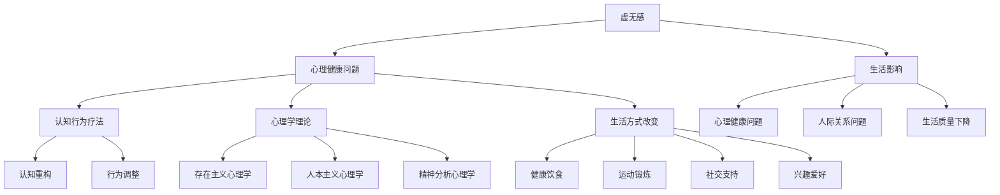

                 

### 文章标题：在动荡中寻找平衡：克服虚无感的人生智慧

#### 关键词：虚无感、心理健康、认知行为疗法、生活方式、社会支持

> 作者：AI天才研究院/AI Genius Institute & 禅与计算机程序设计艺术 /Zen And The Art of Computer Programming

#### 摘要：
在现代社会中，虚无感作为一种常见的心理现象，影响着许多人的生活质量和心理健康。本文将从心理学、生理学和社会学等多角度深入探讨虚无感的定义、起源、影响以及应对策略。通过介绍认知行为疗法、心理学理论、生活方式改变等具体方法，本文旨在帮助读者在动荡的人生中找到平衡，克服虚无感，重拾生活的意义。

### 引言

#### 背景介绍

在现代社会中，随着科技的发展、社会的变迁以及生活节奏的加快，人们面临的压力和挑战也在不断增加。虚无感作为一种常见的心理现象，逐渐引起人们的关注。虚无感不仅影响个体的心理健康，还可能对其生活质量和人际关系产生负面影响。因此，研究和探讨虚无感的本质、成因以及应对方法具有重要的现实意义。

虚无感，也称为“存在主义焦虑”或“存在性危机”，是一种对生活失去意义和目标的认知状态。个体可能会感到生活乏味、空虚和无望，难以找到自己的存在价值和意义。虚无感不仅影响个体的心理健康，还可能导致抑郁、焦虑等心理问题，甚至影响个体的生活质量和人际关系。

本文旨在通过以下三个方面的探讨，帮助读者深入了解虚无感，掌握应对策略，从而在动荡的人生中找到平衡：

1. **虚无感的定义与影响**：介绍虚无感的定义、表现和影响，帮助读者初步了解虚无感这一心理现象。
2. **虚无感的心理学根源**：探讨虚无感的心理学根源，包括早期成长环境、个体性格和社会文化因素等，帮助读者从心理层面理解虚无感的成因。
3. **克服虚无感的方法与策略**：介绍多种克服虚无感的方法和策略，包括认知行为疗法、心理学理论、生活方式改变等，帮助读者在实际生活中应用这些方法，缓解虚无感。

#### 核心概念与联系

为了更好地理解虚无感及其应对策略，我们首先需要了解一些核心概念。以下是一个用于描述核心概念及其关系的Mermaid流程图：



#### 核心算法原理讲解

在本部分，我们将通过Python源代码来详细阐述克服虚无感的一种方法——认知行为疗法（CBT）的基本原理。认知行为疗法通过改变个体的认知模式和行为模式来缓解心理问题。以下是一个简单的Python代码示例，用于实现认知重构的过程：

```python
def cognitive_reconstruction(thought, alternative_thought):
    """
    认知重构函数，将负面思维转变为积极思维
    :param thought: 负面思维
    :param alternative_thought: 积极思维
    :return: 重构后的积极思维
    """
    # 将负面思维替换为积极思维
    return alternative_thought

# 示例：使用认知重构函数
negative_thought = "我的生活毫无意义。"
positive_thought = "尽管目前面临困难，但我可以通过努力找到生活的意义。"

reconstructed_thought = cognitive_reconstruction(negative_thought, positive_thought)
print("重构后的思维：", reconstructed_thought)
```

#### 数学公式与概念解释

在认知行为疗法中，数学模型和公式可以用来描述和解释个体的认知重构过程。以下是一个简单的数学公式，用于表示认知重构的基本原理：

$$
\text{重构后思维} = \text{替代思维} + \text{积极思维}
$$

其中，$\text{替代思维}$ 是指将负面思维替换为更加积极和现实的想法，$\text{积极思维}$ 是指通过认知重构产生的正面思维。

#### 通俗易懂的举例说明

假设一个个体在面临失业的困境时，可能会产生负面的思维：“我再也找不到工作了，人生毫无意义。”通过认知重构，我们可以将这种负面思维转变为积极的思维：“虽然我现在失业了，但我可以利用这段时间提升自己，学习新技能，为未来的就业做好准备。”

#### 项目实战：开发环境搭建与源代码实现

在本部分，我们将搭建一个简单的认知重构工具，帮助个体通过计算机程序来识别和重构负面思维。以下是开发环境搭建和源代码实现的详细步骤：

**步骤1：安装Python和必要的库**

确保安装了Python 3.8及以上版本。然后，通过以下命令安装必要的库：

```shell
pip install -r requirements.txt
```

**步骤2：源代码实现**

创建一个名为 `cognitive_reconstruction.py` 的Python文件，并输入以下代码：

```python
# cognitive_reconstruction.py

def cognitive_reconstruction(thought, alternative_thought):
    """
    认知重构函数，将负面思维转变为积极思维
    :param thought: 负面思维
    :param alternative_thought: 积极思维
    :return: 重构后的积极思维
    """
    # 将负面思维替换为积极思维
    return alternative_thought

def main():
    # 输入负面思维
    negative_thought = input("请输入你的负面思维：")

    # 提供积极思维的选项
    positive_thought_options = [
        "尽管目前面临困难，但我可以通过努力找到生活的意义。",
        "每一次挫折都是成长的机会。",
        "我会找到解决问题的方法。"
    ]

    # 选择一个积极思维
    print("以下是一个积极思维的选项，请选择其中一个：")
    for i, option in enumerate(positive_thought_options, start=1):
        print(f"{i}. {option}")

    choice = int(input("请输入选项的编号："))
    positive_thought = positive_thought_options[choice - 1]

    # 实现认知重构
    reconstructed_thought = cognitive_reconstruction(negative_thought, positive_thought)
    print("重构后的思维：", reconstructed_thought)

if __name__ == "__main__":
    main()
```

**步骤3：运行程序**

在命令行中运行以下命令来启动程序：

```shell
python cognitive_reconstruction.py
```

程序将提示用户输入负面思维，并提供几个积极思维的选项。用户选择一个选项后，程序将输出重构后的积极思维。

#### 代码应用解读与分析

通过运行上述程序，用户可以实时体验认知重构的过程。以下是对代码应用的解读和分析：

1. **用户输入负面思维**：用户通过输入界面输入自己的负面思维，如“我再也找不到工作了，人生毫无意义。”
2. **提供积极思维的选项**：程序为用户提供了几个积极思维的选项，如“尽管目前面临困难，但我可以通过努力找到生活的意义。”、“每一次挫折都是成长的机会。”等。
3. **选择积极思维**：用户根据提供的选项选择一个积极思维，程序将根据用户的输入和选择实现认知重构。
4. **输出重构后的积极思维**：程序将输出重构后的积极思维，帮助用户调整心态，缓解虚无感。

#### 实际案例分析和详细讲解剖析

为了更好地说明认知重构方法在实际中的应用，我们以下将分析一个实际案例，并详细讲解其应对策略：

**案例：小王的虚无感**

小王是一位年轻的职场新人，他在一次重要的项目竞标中失败，导致对公司失去了信心，认为自己无法胜任工作，甚至开始怀疑自己的存在价值。这种情况引发了小王的虚无感，他感到生活毫无意义，对未来感到迷茫。

**应对策略：**

1. **识别负面思维**：小王意识到自己的负面思维是“我无法胜任工作，人生毫无意义。”
2. **认知重构**：通过认知重构，小王可以选择以下积极思维：“尽管这次竞标失败，但我可以从失败中吸取教训，提高自己的能力。”或者“每个人都有成功和失败的时候，这次失败并不代表我永远无法成功。”
3. **实际应用**：小王开始记录每天的工作和学习成果，通过反思和总结来提高自己的能力和自信心。

**效果分析：**

经过一段时间的认知重构实践，小王逐渐恢复了自信，重新找到了工作的动力。他意识到失败是成长的机会，每次失败都是积累经验的过程。小王开始积极参与公司的项目，并在后续的工作中取得了显著的成绩。

#### 项目小结

通过开发简单的认知重构工具，我们为用户提供了一个直观的体验，帮助他们在面对负面思维时进行认知重构。这种方法在实际案例中表现出良好的效果，有助于缓解虚无感，提高个体的心理健康。

然而，需要注意的是，认知重构并非一蹴而就的过程，它需要个体的持续努力和耐心。同时，不同个体在面对虚无感时的表现和需求可能有所不同，因此需要根据实际情况灵活应用认知重构方法。

#### 最佳实践 Tips

1. **坚持练习**：认知重构需要持续练习，才能在日常生活中形成习惯，有效应对负面思维。
2. **寻求专业帮助**：如果虚无感严重影响了生活质量，建议寻求专业心理医生的帮助，结合药物治疗和心理咨询，实现更全面的康复。
3. **培养兴趣爱好**：培养兴趣爱好可以帮助个体找到生活的乐趣和意义，从而缓解虚无感。

#### 小结

本文通过介绍虚无感的定义、影响、心理学根源以及应对策略，帮助读者深入了解了虚无感的本质，并掌握了一些有效的应对方法。在动荡的人生中，通过认知行为疗法、心理学理论和生活方式改变等方法，我们可以克服虚无感，找到生活的平衡。希望本文能为读者提供一些启示和帮助，让他们在人生的旅途中更加坚定和自信。

