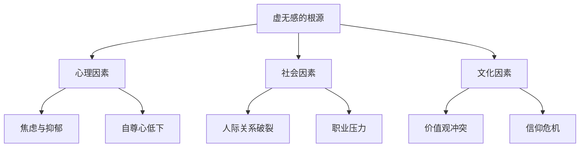

                 

### 在动荡中寻找稳定：克服虚无感的人生智慧

#### 关键词
- 虚无感
- 心理健康
- 人际关系
- 社会支持
- 生活平衡

#### 摘要
在现代社会中，虚无感逐渐成为困扰许多人的心理健康问题。本文旨在深入探讨虚无感的定义、根源及其对个人生活和心理健康的影响，并提出一系列有效的策略和方法，帮助读者在动荡中找到稳定，克服虚无感，实现心灵的宁静与满足。

### 引言

在信息爆炸、科技迅猛发展的时代，人们的生活节奏加快，压力与日俱增。虚无感，作为一种复杂的心理体验，常常在忙碌和压力中悄然滋生。这种感觉让人感到生命的空洞和失去意义，严重影响个人的心理健康和幸福感。本文将从多个角度出发，详细分析虚无感的根源和影响，并提供实用的策略和方法，帮助读者找到内心的稳定。

### 第一部分：虚无感的根源与影响

#### 第1章：虚无感的定义与来源

##### 1.1 虚无感的定义与特征

虚无感是一种深刻的心理体验，通常表现为对生活失去兴趣、感到迷茫和无意义。这种感觉可能导致情绪低落、焦虑、自尊心低下，甚至出现抑郁症状。

##### 1.2 虚无感的来源与影响因素

虚无感的来源复杂多样，主要包括：

- **心理因素**：如童年经历、自尊心低下、焦虑与抑郁等。
- **社会因素**：如人际关系破裂、职业压力、社会地位的不稳定等。
- **文化因素**：如价值观冲突、信仰危机、对未来的不确定性等。

### 第2章：虚无感对人生的影响

##### 2.1 职场中的虚无感

职场中的虚无感可能导致工作效率低下、缺乏成就感，甚至影响职业生涯的发展。

##### 2.2 人际关系中的虚无感

在人际关系中，虚无感可能导致信任缺失、孤独感加重，影响个人的社交质量和心理健康。

##### 2.3 心理健康与虚无感

长期的虚无感可能对心理健康产生严重影响，导致情绪障碍、焦虑、抑郁等心理问题。

### 第3章：现代社会中的虚无感现象

##### 3.1 虚无感在社会层面的表现

在现代社会，虚无感现象日益普遍，成为影响社会稳定和个人幸福的重要因素。

##### 3.2 虚无感与心理健康问题

虚无感与心理健康问题密切相关，互为因果，加剧了社会和心理问题的复杂性。

### 第二部分：寻找稳定的策略与方法

#### 第4章：心理层面的调整与应对

##### 4.1 心理调适技巧

通过认知行为疗法、正念冥想等心理调适技巧，帮助缓解虚无感。

##### 4.2 增强自我认同

通过自我探索、自我接纳，建立积极的自我认同，提高自尊心和自我价值感。

##### 4.3 建立目标与规划

设定明确的生活和工作目标，制定切实可行的计划，增强对生活的掌控感。

#### 第5章：社会支持与人际关系建设

##### 5.1 建立健康的人际关系

通过建立和维护良好的人际关系，提高社会支持，缓解虚无感。

##### 5.2 寻求专业心理咨询

在面对严重的虚无感时，寻求专业心理咨询，获得专业支持和指导。

##### 5.3 社区参与与社会支持

积极参与社区活动，建立社会支持网络，提高社会参与度和归属感。

#### 第6章：物质生活与精神世界的平衡

##### 6.1 财务管理

通过合理的财务管理，确保物质生活的稳定和安全感。

##### 6.2 充实精神生活

通过阅读、艺术、旅行等方式，丰富精神生活，提高生活品质。

##### 6.3 生活习惯与健康

通过健康的生活习惯，保持身心健康，增强对生活的满意度。

### 第三部分：实践与成长

#### 第7章：克服虚无感的案例研究

##### 7.1 案例一：重新定义生活的意义

通过重新定义生活的意义，找到内心的方向和动力。

##### 7.2 案例二：通过志愿服务找回自我

通过志愿服务，获得成就感和自我价值的提升。

##### 7.3 案例三：艺术疗法与心理重建

通过艺术疗法，缓解心理压力，重建心理健康。

#### 第8章：个人成长与人生目标

##### 8.1 重新审视自我

通过反思和自我审视，找到内心的需求和目标。

##### 8.2 制定个人成长计划

制定个人成长计划，逐步实现人生目标。

##### 8.3 实现人生目标的策略

通过策略和行动，实现个人成长和人生目标。

#### 第9章：在动荡中持续成长

##### 9.1 应对变化与不确定性

通过适应能力和灵活性，应对变化和不确定性。

##### 9.2 培养适应能力

通过不断学习和实践，培养适应能力。

##### 9.3 持续学习与自我提升

通过持续学习和自我提升，保持内心的稳定和成长。

### 附录

#### 附录A：相关资源与推荐阅读

##### A.1 心理自助资源

- 《正念：一个心灵练习指南》
- 《认知行为疗法：基本原理与技巧》

##### A.2 心理健康机构与热线

- 国家心理健康热线：12320
- 国际心理咨询协会：icad.psych.org

##### A.3 相关书籍推荐

- 《意义的追寻》
- 《人生的智慧》

### 结语

在动荡中寻找稳定，克服虚无感，是一个持续的过程。通过本文的探讨，希望读者能够认识到虚无感的危害，学会有效的应对策略，实现心灵的平静与满足。让我们在人生的旅途中，不断成长，找到属于自己的稳定和意义。

### 作者信息

- 作者：AI天才研究院/AI Genius Institute & 禅与计算机程序设计艺术 /Zen And The Art of Computer Programming

### 目录大纲

#### 第一部分：虚无感的根源与影响

##### 第1章：虚无感的定义与来源
- **1.1 虚无感的定义与特征**
- **1.2 虚无感的来源与影响因素**

##### 第2章：虚无感对人生的影响
- **2.1 职场中的虚无感**
- **2.2 人际关系中的虚无感**
- **2.3 心理健康与虚无感**

##### 第3章：现代社会中的虚无感现象
- **3.1 虚无感在社会层面的表现**
- **3.2 虚无感与心理健康问题**

#### 第二部分：寻找稳定的策略与方法

##### 第4章：心理层面的调整与应对
- **4.1 心理调适技巧**
- **4.2 增强自我认同**
- **4.3 建立目标与规划**

##### 第5章：社会支持与人际关系建设
- **5.1 建立健康的人际关系**
- **5.2 寻求专业心理咨询**
- **5.3 社区参与与社会支持**

##### 第6章：物质生活与精神世界的平衡
- **6.1 财务管理**
- **6.2 充实精神生活**
- **6.3 生活习惯与健康**

#### 第三部分：实践与成长

##### 第7章：克服虚无感的案例研究
- **7.1 案例一：重新定义生活的意义**
- **7.2 案例二：通过志愿服务找回自我**
- **7.3 案例三：艺术疗法与心理重建**

##### 第8章：个人成长与人生目标
- **8.1 重新审视自我**
- **8.2 制定个人成长计划**
- **8.3 实现人生目标的策略**

##### 第9章：在动荡中持续成长
- **9.1 应对变化与不确定性**
- **9.2 培养适应能力**
- **9.3 持续学习与自我提升**

#### 附录

##### 附录A：相关资源与推荐阅读
- **A.1 心理自助资源**
- **A.2 心理健康机构与热线**
- **A.3 相关书籍推荐**

### Mermaid 流程图



### Python 源代码示例

```python
# 计算并打印平方值
def square(x):
    result = x * x
    print(f"The square of {x} is {result}")

# 调用函数
square(5)
```

### 数学模型与公式

```latex
$$
\text{心理幸福感} = f(\text{生活满意度}, \text{社会支持度}, \text{自我效能感})
$$
```

### 实际案例与代码解读

#### 案例一：通过志愿服务找回自我

```python
# 示例：志愿服务参与者信息记录
volunteers = [
    {'name': 'Alice', 'hours': 20, 'benefits': ['social connection', 'personal growth']},
    {'name': 'Bob', 'hours': 15, 'benefits': ['sense of purpose', 'stress relief']},
    {'name': 'Charlie', 'hours': 10, 'benefits': ['learning new skills', 'community involvement']}
]

# 打印志愿者信息
for volunteer in volunteers:
    print(f"Name: {volunteer['name']}, Hours: {volunteer['hours']}, Benefits: {', '.join(volunteer['benefits'])}")
```

#### 代码解读

1. 定义一个名为 `volunteers` 的列表，每个元素是一个字典，包含志愿者的姓名、服务小时数以及获得的收益。
2. 使用 `for` 循环遍历 `volunteers` 列表，并打印每个志愿者的姓名、服务小时数和收益。

### 结论

通过上述目录大纲，本文旨在为读者提供一套系统的策略和方法，帮助他们在动荡中找到稳定，克服虚无感，实现心灵的宁静与满足。希望这个目录大纲能够为《在动荡中寻找稳定：克服虚无感的人生智慧》这本书提供一个清晰的框架，引导读者走向更美好的未来。|>

