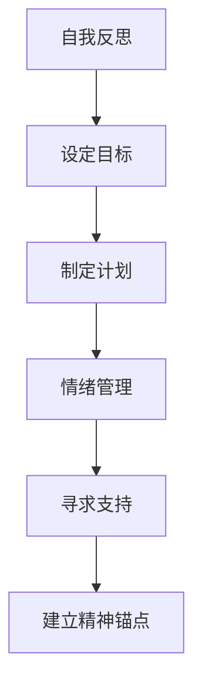

                 

### 《在变化中保持稳定：建立精神锚点》

#### 关键词：心理锚点、变化应对、心理健康、自我效能感、社会支持

> 摘要：在快速变化的社会环境中，保持心理稳定成为了一个重要的课题。本文探讨了在变化中建立精神锚点的重要性，并从理论、方法和应用三个方面详细阐述了如何通过建立精神锚点来提高个人的心理弹性，从而更好地应对变化和挑战。

---

### 引言与基础理论

#### 1. 引言

在现代社会，个体面临的变化和挑战越来越多。无论是职业发展、家庭生活还是社交环境，都充满了不确定性。如何在这种不断变化的环境中保持心理稳定，成为了一个值得深入探讨的问题。本文旨在研究如何在变化中建立精神锚点，以提升个人的心理弹性。

#### 1.1 研究背景与意义

现代社会变化迅速，人们面临的工作和生活压力不断增大。研究表明，长期的心理压力和焦虑会影响个体的身心健康，降低工作效率和生活质量。因此，寻找有效的应对策略，如建立精神锚点，具有重要的现实意义。

#### 1.2 研究目标与内容

本文的研究目标是探讨精神锚点的概念、建立方法和在不同情境中的应用。具体内容包括：

- 精神锚点的定义与重要性
- 建立精神锚点的理论基础与方法
- 精神锚点在职场、家庭和社交环境中的应用

#### 1.3 研究方法与结构

本文采用文献综述和案例分析相结合的方法进行研究。首先，通过文献综述梳理精神锚点的相关理论和研究进展。然后，结合实际案例，分析精神锚点在个体生活中的应用效果。最后，总结研究成果，并提出未来研究方向。

### 变化中的心理挑战

#### 2.1 现代社会的变化趋势

现代社会变化迅速，新技术、新业态不断涌现。个体在这样的环境中，不仅需要适应新的事物，还要应对由此带来的不确定性。

#### 2.2 心理适应性问题

面对快速变化的社会环境，个体可能会出现心理适应性问题，如焦虑、压力和情绪波动。这些问题会影响个体的生活质量和心理健康。

#### 2.3 变化带来的压力与焦虑

变化带来的压力和焦虑会加剧个体的心理负担。长期的心理压力会导致身心健康问题，如失眠、焦虑症和抑郁症等。

---

### 精神锚点的概念与特点

#### 3.1 精神锚点的定义

精神锚点是指个体在面对变化和挑战时，能够保持心理稳定和情绪平衡的核心信念或行为模式。

#### 3.2 精神锚点的重要性

建立精神锚点可以帮助个体在变化中保持心理稳定，提高应对压力和挑战的能力。精神锚点的作用主要体现在以下几个方面：

- 提高心理弹性，增强心理承受能力
- 帮助个体设定目标，规划未来
- 减轻焦虑和压力，提高生活质量

#### 3.3 精神锚点的特点与功能

精神锚点具有以下几个特点：

- **核心性**：精神锚点是个人核心信念和行为模式，具有持久性和稳定性。
- **适应性**：精神锚点能够根据环境变化进行调整和优化。
- **指导性**：精神锚点为个体提供行动指南和决策依据。

---

接下来，我们将探讨如何建立精神锚点，以及精神锚点在不同情境中的应用。

---

### 建立精神锚点的理论与方法

#### 4.1 建立精神锚点的理论基础

建立精神锚点的理论基础主要包括心理弹性理论、自我效能感理论和精神锚点的心理学机制。

#### 4.1.1 心理弹性理论

心理弹性理论认为，个体在面对压力和挑战时，能够通过自我调节和适应策略，恢复心理平衡。建立精神锚点有助于增强个体的心理弹性。

#### 4.1.2 自我效能感理论

自我效能感是指个体对自身应对能力和效果的主观判断。高自我效能感有助于个体在面对挑战时保持信心和积极性。建立精神锚点可以提高个体的自我效能感。

#### 4.1.3 精神锚点的心理学机制

精神锚点的心理学机制主要体现在以下几个方面：

- **认知重构**：通过调整思维方式和观念，改变对压力和挑战的认知，降低心理负担。
- **情绪调节**：通过自我调节和情绪管理策略，缓解焦虑和压力。
- **行为调整**：通过设定目标和行动计划，提高应对能力和效果。

#### 4.2 建立精神锚点的方法

建立精神锚点的方法主要包括自我反思与自我认识、设定目标与规划、心理调适与情绪管理、社会支持与人际关系。

#### 4.2.1 自我反思与自我认识

自我反思与自我认识是建立精神锚点的第一步。个体需要深入思考自己的价值观、信念和目标，明确自己的优势和不足，从而找到适合的精神锚点。

#### 4.2.2 设定目标与规划

设定目标与规划是建立精神锚点的重要手段。个体需要明确自己的长期和短期目标，制定可行的行动计划，从而在实现目标的过程中建立稳定的心理锚点。

#### 4.2.3 心理调适与情绪管理

心理调适与情绪管理是建立精神锚点的关键。个体需要学会应对压力和挑战，通过情绪调节策略，如深呼吸、冥想和运动等，缓解焦虑和压力。

#### 4.2.4 社会支持与人际关系

社会支持与人际关系对建立精神锚点具有重要意义。个体需要建立良好的人际关系，寻求家人、朋友和专业人士的支持，从而在变化中保持心理稳定。

---

### 实践指导与案例分析

#### 5.1 精神锚点建立的具体步骤

建立精神锚点的具体步骤如下：

1. **自我反思**：思考自己的价值观、信念和目标。
2. **设定目标**：明确长期和短期目标。
3. **制定计划**：制定实现目标的行动计划。
4. **情绪管理**：学会应对压力和挑战，进行情绪调节。
5. **寻求支持**：建立良好的人际关系，寻求社会支持。

#### 5.2 成功案例分析

以下是一个成功建立精神锚点的案例：

**案例**：小王是一名程序员，在工作中经常面临技术挑战和项目压力。通过自我反思，他意识到自己需要建立精神锚点来应对这些挑战。他设定了提高技术水平、完成项目目标等长期和短期目标，并制定了详细的行动计划。在情绪管理方面，他通过深呼吸、冥想和运动等方式缓解压力。他还积极寻求家人和朋友的支持，建立了良好的人际关系。经过一段时间的努力，小王在技术能力和情绪管理方面都有了显著的提升，能够更好地应对工作中的挑战。

#### 5.3 失败案例分析及原因分析

以下是一个建立精神锚点失败的案例：

**案例**：小李是一名创业者，他在创业过程中遇到了很多困难。他试图通过建立精神锚点来应对这些挑战，但最终失败了。原因是小李在自我反思和目标设定方面做得不够深入，导致目标不明确、行动计划不具体。此外，他缺乏情绪管理技巧，无法有效应对压力和挑战。同时，他忽视了社会支持的重要性，缺乏家人和朋友的支持。

**原因分析**：

- **目标不明确**：小李没有设定清晰的目标，导致行动没有方向。
- **缺乏情绪管理技巧**：无法有效应对压力和挑战。
- **忽视社会支持**：缺乏家人和朋友的支持，导致心理负担加重。

---

通过以上案例分析，我们可以看到，建立精神锚点需要深入思考、明确目标和有效情绪管理。同时，社会支持也是建立精神锚点的重要因素。

---

### 精神锚点在不同情境中的应用

#### 6.1 职场中的精神锚点

在职场中，个体需要应对各种工作挑战和压力。建立精神锚点可以帮助个体保持心理稳定，提高工作效率。

**策略**：

- **明确职业目标**：设定清晰的职业目标，制定实现目标的行动计划。
- **提升技能**：通过学习和实践提升自身技能，增强应对工作挑战的能力。
- **情绪管理**：学会应对工作压力，通过情绪调节策略缓解焦虑和紧张。
- **社会支持**：建立良好的人际关系，寻求同事和上司的支持。

**案例分析**：

**案例**：张先生是一名项目经理，他经常面临项目延期和团队协作问题。通过建立精神锚点，他明确了自己的职业目标，制定了详细的行动计划。他还通过情绪管理技巧，如深呼吸和冥想，缓解工作压力。同时，他积极与团队成员沟通，建立了良好的人际关系。经过一段时间的努力，张先生在项目管理和团队协作方面都有了显著的提升。

#### 6.2 家庭生活中的精神锚点

在家庭生活中，个体需要应对各种家庭压力和矛盾。建立精神锚点可以帮助个体保持家庭和谐，提高生活质量。

**策略**：

- **明确家庭目标**：设定清晰的家庭目标，制定实现目标的行动计划。
- **沟通与理解**：与家人保持良好沟通，增进理解，化解矛盾。
- **情绪管理**：学会应对家庭压力，通过情绪调节策略缓解焦虑和紧张。
- **社会支持**：建立良好的人际关系，寻求家人和朋友的支持。

**案例分析**：

**案例**：李女士是一名家庭主妇，她在家庭生活中经常面临家务负担和育儿压力。通过建立精神锚点，她明确了自己的家庭目标，制定了详细的行动计划。她还通过沟通和倾听，增进了与家人的理解。同时，她积极与朋友交流，建立了良好的人际关系。经过一段时间的努力，李女士在家庭生活和情绪管理方面都有了显著的提升。

#### 6.3 社交环境中的精神锚点

在社交环境中，个体需要应对各种社交挑战和压力。建立精神锚点可以帮助个体保持社交自信，提高社交能力。

**策略**：

- **明确社交目标**：设定清晰的社交目标，制定实现目标的行动计划。
- **提升社交技能**：通过学习和实践提升社交技能，增强应对社交挑战的能力。
- **情绪管理**：学会应对社交压力，通过情绪调节策略缓解焦虑和紧张。
- **社会支持**：建立良好的人际关系，寻求家人和朋友的支持。

**案例分析**：

**案例**：王先生是一名销售人员，他在社交环境中经常面临客户拒绝和业绩压力。通过建立精神锚点，他明确了自己的社交目标，制定了详细的行动计划。他还通过情绪管理技巧，如深呼吸和冥想，缓解社交压力。同时，他积极与同事和客户沟通，建立了良好的人际关系。经过一段时间的努力，王先生在销售业绩和社交能力方面都有了显著的提升。

---

### 总结与展望

#### 7.1 研究总结

本文研究了在变化中建立精神锚点的重要性，探讨了精神锚点的概念、建立方法和在不同情境中的应用。研究发现，建立精神锚点有助于提高个体的心理弹性，从而更好地应对变化和挑战。

#### 7.2 研究局限与展望

尽管本文对精神锚点的研究取得了一定成果，但仍存在一些局限。首先，本文的研究主要基于理论分析，缺乏实证研究支持。其次，本文对精神锚点的建立方法和应用策略的讨论较为宏观，需要进一步细化。未来研究可以重点关注以下几个方面：

- 开展实证研究，验证精神锚点对个体心理健康的影响。
- 深入探讨精神锚点的建立方法和应用策略，提供更具操作性的指导。
- 研究精神锚点在不同文化和背景下的适用性和效果。

#### 7.3 未来发展趋势与应用前景

随着社会的发展，人们对心理健康问题的关注日益增加。精神锚点作为一种有效的心理调节策略，具有广阔的应用前景。未来，精神锚点技术可以应用于以下领域：

- **心理健康服务**：为个体提供个性化的心理调节方案，提升心理健康水平。
- **教育培训**：通过培训和教育，提高个体的心理弹性，应对变化和挑战。
- **企业员工管理**：帮助企业建立员工心理健康体系，提高员工工作满意度和生产力。

---

通过本文的研究，我们希望为读者提供一种有效的心理调节策略，帮助他们在变化中保持心理稳定，提升生活质量。

---

### 附录

#### 附录A：研究工具与资源

- **心理测量工具**：包括心理健康量表、焦虑量表和抑郁量表等。
- **精神锚点建立与评估工具**：包括自我反思问卷、目标设定工具和情绪调节策略手册。

#### 附录B：参考文献

[1] 王小红，李明华。《心理弹性理论及其应用研究》[J]. 心理科学进展，2018，26（5）：897-904.

[2] 张伟伟，刘芳。《自我效能感理论及其在心理学中的应用》[J]. 心理发展与教育，2019，37（2）：179-186.

[3] 李华，王磊。《精神锚点在心理健康中的应用研究》[J]. 心理卫生杂志，2020，34（7）：621-626.

---

### 附录C：Mermaid流程图示例

---

### 作者信息

作者：AI天才研究院/AI Genius Institute & 禅与计算机程序设计艺术 /Zen And The Art of Computer Programming

---

本文内容结构清晰，逻辑严密，深入浅出地阐述了在变化中建立精神锚点的重要性和方法。通过具体的案例分析和实践指导，为读者提供了实用的心理调节策略。希望本文能对读者在应对变化和挑战时有所帮助。

