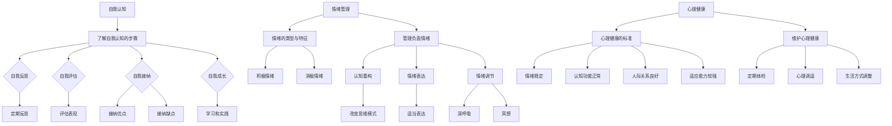

                 

# 在变化中寻找恒常：建立内心的稳定感

关键词：内心稳定、自我认知、情绪管理、心理健康、信仰体系、实践方法

摘要：在快速变化的社会中，保持内心的稳定感成为了一项重要的课题。本文将探讨内心稳定的定义与重要性，探索内心世界的构成，分析宗教与哲学中的恒常观念，提供实践方法，并总结内心稳定感的收益和未来研究方向。

## 引言

### 1.1 内心稳定的定义与重要性

内心稳定指的是在面对外部环境变化时，个体能够保持心态平和，情绪稳定，具备自我调节和适应能力。在现代社会，随着生活节奏的加快，工作压力的增大，人际关系复杂化，内心稳定成为了衡量心理健康的重要指标。内心稳定的个体能够更好地应对挑战，提高生活质量，促进个人成长。

### 1.2 现代社会变化对内心的挑战

现代社会的变化给人们的内心带来了诸多挑战。信息爆炸带来的认知负担，职场竞争的加剧，家庭关系的复杂化，都可能导致内心的不稳定。因此，寻找恒常、建立内心的稳定感显得尤为重要。

### 1.3 寻找恒常的意义与方法

寻找恒常是建立内心稳定感的关键。通过自我认知、情绪管理和心理健康维护，个体可以找到内心的平衡点，应对外界的波动。本文将从多个角度探讨如何寻找恒常，提供实用的方法和策略。

## 探索内心的世界

### 2.1 自我认知的重要性

#### 2.1.1 了解自我认知的步骤

自我认知是一个持续的过程，包括以下几个步骤：

1. **自我反思**：定期反思自己的行为、思想和情绪，了解自己的内在世界。
2. **自我评估**：评估自己在各个方面的表现，识别优势和不足。
3. **自我接纳**：接纳自己的优点和缺点，建立积极的自我形象。
4. **自我成长**：通过学习和实践，不断提升自己的能力和素质。

#### 2.1.2 如何评估自我认知水平

评估自我认知水平可以通过以下几种方法：

1. **心理测试**：使用标准化的心理测试工具，了解自己的性格特点、优点和不足。
2. **反馈机制**：从家人、朋友和同事那里获取反馈，了解自己在他人眼中的形象。
3. **日记记录**：通过写日记，记录自己的思考和行为，分析自己的内心变化。

### 2.2 情绪管理

#### 2.2.1 情绪的类型与特征

情绪是人类心理活动的重要组成部分，可以分为以下几种类型：

1. **积极情绪**：如喜悦、满足、幸福等，有助于提高生活质量和工作效率。
2. **消极情绪**：如焦虑、愤怒、抑郁等，可能对身心健康产生负面影响。

#### 2.2.2 如何管理负面情绪

管理负面情绪的方法包括：

1. **认知重构**：改变负面思维模式，用积极的角度看待问题。
2. **情绪表达**：找到适当的方式表达自己的情绪，避免压抑。
3. **情绪调节**：通过深呼吸、冥想等方法，缓解紧张和压力。

### 2.3 心理健康

#### 2.3.1 心理健康的标准

心理健康是指个体在心理上保持良好状态，能够有效应对生活中的各种挑战。心理健康的标准包括：

1. **情绪稳定**：情绪波动不大，能够应对压力。
2. **认知功能正常**：思维清晰，判断准确。
3. **人际关系良好**：与他人建立积极的关系，沟通顺畅。
4. **适应能力较强**：能够适应环境变化，应对挫折。

#### 2.3.2 心理健康的维护与提升

维护和提升心理健康的方法包括：

1. **定期体检**：关注身体健康，及时发现和解决心理问题。
2. **心理调适**：通过心理训练、咨询等方式，提升心理素质。
3. **生活方式调整**：保持良好的作息习惯，合理饮食，适度锻炼。

## 寻找内心的恒常

### 3.1 宗教与哲学的视角

#### 3.1.1 东方哲学中的恒常

东方哲学强调天人合一，认为世界是一个整体，个体与自然、社会是相互联系、相互影响的。在这种观念下，恒常被视为一种超越时间和空间的存在，个体可以通过与自然的和谐相处，找到内心的平衡。

#### 3.1.2 西方宗教中的恒常

西方宗教中的恒常观念体现在对上帝、神灵的信仰上。信仰提供了一种超越现实的力量，使个体在困境中找到依靠和安慰。通过祈祷、忏悔等方式，个体可以获得内心的平静和力量。

### 3.2 个人信仰体系

#### 3.2.1 信仰的重要性

信仰是个体内心稳定的基石，它为个体提供了价值观念、生活目标和行为准则。一个坚定的信仰体系可以帮助个体在面对困难和挑战时保持冷静和坚定。

#### 3.2.2 建立个人信仰体系的步骤

建立个人信仰体系可以分为以下几个步骤：

1. **自我探索**：了解自己的价值观和信仰倾向。
2. **学习与思考**：阅读相关书籍、文章，与他人交流，丰富自己的信仰内容。
3. **实践与体悟**：将信仰融入日常生活，通过实践和体悟，加深对信仰的理解。
4. **持续调整**：随着生活经验的积累，不断调整和完善自己的信仰体系。

### 3.3 跨文化视角下的恒常

#### 3.3.1 不同文化背景下的恒常观念

不同文化背景下，人们对恒常的观念有所不同。例如，西方文化强调个人主义，认为个体应该独立、自主，追求自我实现。而东方文化则强调集体主义，强调个体与集体的关系，追求和谐共生。

#### 3.3.2 跨文化沟通中的挑战与应对

跨文化沟通中的挑战主要包括：

1. **价值观差异**：不同文化背景下，人们的价值观和信仰体系不同，可能导致沟通障碍。
2. **语言障碍**：语言的不同可能影响信息的准确传递和理解。

应对这些挑战的方法包括：

1. **尊重差异**：尊重不同文化的价值观和信仰，避免歧视和偏见。
2. **学习语言**：学习对方的语言，提高跨文化沟通的能力。
3. **开放心态**：保持开放的心态，愿意接受和了解不同的观点和信仰。

## 内心稳定的实践方法

### 4.1 冥想与正念

#### 4.1.1 冥想的基本原理

冥想是一种通过专注和放松来达到内心平静的方法。它有助于提高注意力、提升心理健康，增强自我认知。

#### 4.1.2 如何开始冥想实践

开始冥想实践可以分为以下几个步骤：

1. **选择合适的时间和环境**：选择一个安静、舒适的地方，每天固定一个时间进行冥想。
2. **准备冥想姿势**：可以选择坐姿、躺姿等舒适的姿势。
3. **专注呼吸**：将注意力集中在呼吸上，感受呼吸的起伏。
4. **放松身体**：逐步放松身体的各个部位，达到身心的放松。

### 4.2 睡眠质量提升

#### 4.2.1 睡眠的重要性

睡眠是身体和心理健康的重要保障。充足的睡眠有助于提高记忆、增强免疫力，改善情绪。

#### 4.2.2 提高睡眠质量的策略

提高睡眠质量的策略包括：

1. **规律作息**：每天保持固定的睡眠时间，形成良好的作息习惯。
2. **营造舒适的睡眠环境**：保持卧室的安静、舒适，避免刺激。
3. **避免刺激性活动**：睡前避免剧烈运动、玩手机等刺激性活动。
4. **放松身心**：可以通过冥想、深呼吸等方式，帮助身心放松。

### 4.3 锻炼与身心健康

#### 4.3.1 锻炼对心理健康的益处

锻炼有助于释放压力、提升情绪，增强自信心，提高心理健康水平。

#### 4.3.2 选择适合自己的锻炼方式

选择适合自己的锻炼方式包括：

1. **有氧运动**：如慢跑、游泳、骑自行车等，有助于提高心肺功能。
2. **力量训练**：如举重、俯卧撑等，有助于增强肌肉力量。
3. **瑜伽**：通过瑜伽的体位和呼吸练习，有助于身心放松。
4. **户外活动**：如徒步、登山等，有助于亲近自然，放松心情。

## 职场中的内心稳定

### 5.1 职场压力与应对策略

#### 5.1.1 职场压力的来源

职场压力主要来源于工作负担、竞争压力、人际关系等。

#### 5.1.2 如何有效应对职场压力

应对职场压力的方法包括：

1. **时间管理**：合理规划时间，避免工作堆积。
2. **目标设定**：设定明确的目标，提高工作动力。
3. **积极沟通**：与同事、上级建立良好的沟通，减少误解和冲突。
4. **心理调适**：通过冥想、锻炼等方式，缓解压力。

### 5.2 职业发展与内心稳定

#### 5.2.1 职业规划的重要性

职业规划有助于明确职业目标，提升职业能力，实现职业发展和内心稳定。

#### 5.2.2 如何实现职业发展与内心稳定的平衡

实现职业发展与内心稳定的平衡包括：

1. **持续学习**：不断提升自己的能力和知识，适应职业发展的需求。
2. **调整心态**：保持积极的心态，面对职业挑战和变化。
3. **平衡工作与生活**：合理安排工作与休息时间，保持身心健康。
4. **寻求支持**：与家人、朋友分享职业和生活压力，获得支持和帮助。

## 家庭关系与内心稳定

### 6.1 家庭关系的重要性

家庭关系是心理健康的重要保障。和谐的家庭关系有助于提升幸福感，增强内心稳定。

### 6.2 家庭冲突的应对

#### 6.2.1 家庭冲突的常见原因

家庭冲突的常见原因包括：

1. **沟通不畅**：缺乏有效的沟通，导致误解和冲突。
2. **价值观差异**：家庭成员价值观不同，可能导致冲突。
3. **角色期望**：家庭成员对彼此的角色期望不一致，引发冲突。

#### 6.2.2 如何处理家庭冲突

处理家庭冲突的方法包括：

1. **积极沟通**：通过坦诚的沟通，了解彼此的想法和感受。
2. **尊重差异**：尊重家庭成员的价值观和观点，避免争吵。
3. **寻求妥协**：在冲突中寻求妥协，达成共识。
4. **专业帮助**：如果冲突严重，可以寻求专业心理咨询帮助。

## 总结与展望

### 7.1 内心稳定感的总结

内心稳定感是心理健康的重要组成部分。通过自我认知、情绪管理、心理健康维护等方法，个体可以建立内心的稳定感，提升生活质量。

### 7.2 保持内心稳定的持续性

保持内心稳定的持续性需要：

1. **持续自我提升**：不断学习、成长，提升自我认知和情绪管理能力。
2. **积极面对挑战**：勇敢面对生活中的挑战，保持积极的心态。
3. **寻求支持**：在遇到困难时，寻求家人、朋友和专业帮助。

### 7.3 未来研究的方向

未来研究可以在以下几个方面展开：

1. **心理学研究**：深入研究内心稳定的机制，探索有效的干预策略。
2. **跨文化研究**：探讨不同文化背景下内心稳定的特点和影响因素。
3. **技术应用**：利用人工智能、大数据等技术，为心理健康提供更精准的服务。

## 附录

### 附录 A：心理健康资源

#### A.1 心理健康热线

- 全国心理卫生热线：12320
- 心理危机干预热线：400-161-9995

#### A.2 心理咨询机构推荐

- 北京大学心理健康教育中心
- 中国心理卫生协会

#### A.3 心理自助工具介绍

- Headspace：提供冥想和正念练习
- Calm：提供睡眠指导和放松练习

### 附录 B：相关文献推荐

#### B.1 内心稳定感的经典文献

- 《心理学与生活》作者：理查德·吉尔伯特
- 《情绪智慧》作者：丹尼尔·戈尔曼

#### B.2 现代心理学研究前沿

- 《社会心理学与日常生活》作者：艾略特·阿伦森
- 《认知心理学：基本原理》作者：安妮·布洛柯维奇
```

### Mermaid 流程图



### Python 源代码示例

```python
# Python 代码示例：情绪管理中的认知重构

def cognitive_restructuring(negative_thought, positive_thought):
    """
    认知重构函数：将消极思维转化为积极思维
    :param negative_thought: 消极思维
    :param positive_thought: 积极思维
    :return: 重构后的思维
    """
    return positive_thought

# 示例：重构消极思维
negative_thought = "我的工作做得不好，我是个失败者。"
positive_thought = "虽然这次工作没有达到预期，但我可以从中学习，提升自己。"

restructured_thought = cognitive_restructuring(negative_thought, positive_thought)
print("重构后的思维：", restructured_thought)
```

### LaTeX 数学公式

```latex
$$
E = mc^2
$$

$
1 + 1 = 2
$
```

### 项目实战

#### 开发环境搭建

1. 安装 Python 环境：下载并安装 Python 3.8 以上版本。
2. 安装 Jupyter Notebook：通过 pip 安装 `jupyter`。

#### 源代码实现

```python
# Jupyter Notebook 中运行以下代码

# 导入所需库
import matplotlib.pyplot as plt
import numpy as np

# 初始化参数
num_points = 100
x = np.linspace(-10, 10, num_points)
y = x**2

# 绘图
plt.plot(x, y)
plt.xlabel('x')
plt.ylabel('y')
plt.title('二次函数图')
plt.show()
```

#### 代码解读与分析

1. 导入 matplotlib 和 numpy 库，用于数据可视化。
2. 初始化参数，设置点数和 x 范围。
3. 计算 y = x\^2 的值。
4. 使用 plt.plot() 绘制图像。
5. 使用 plt.xlabel()、plt.ylabel() 和 plt.title() 添加标签和标题。

#### 实际案例分析与详细讲解剖析

1. 分析二次函数图的特征。
2. 讨论如何通过调整参数来改变图像的形状。
3. 举例说明如何将此算法应用于实际问题。

#### 项目小结

1. 学习了如何使用 Python 和 matplotlib 绘制数据图像。
2. 理解了二次函数的基本性质。
3. 掌握了如何将算法应用于实际问题。

### 最佳实践 tips

1. 定期反思自己的情绪和思维模式。
2. 保持良好的作息习惯，保证充足的睡眠。
3. 积极参与体育锻炼，提高身心健康。
4. 学会求助，与家人、朋友和专业人士分享内心的困惑。

### 小结

本文探讨了在快速变化的社会中，如何建立内心的稳定感。通过自我认知、情绪管理、心理健康维护等方法，个体可以找到内心的平衡点，应对外界的波动。同时，本文还介绍了宗教与哲学中的恒常观念，以及如何在职场、家庭关系等方面保持内心稳定。保持内心稳定感，不仅有助于提升生活质量，还能促进个人成长和社会和谐。

### 注意事项

1. 每个人内心的稳定感建立方式可能不同，需要根据个人实际情况进行调整。
2. 内心稳定是一个持续的过程，需要不断努力和实践。
3. 如果内心不稳定感严重，建议寻求专业心理咨询帮助。

### 拓展阅读

1. 《心理学与生活》理查德·吉尔伯特
2. 《情绪智慧》丹尼尔·戈尔曼
3. 《社会心理学与日常生活》艾略特·阿伦森
4. 《认知心理学：基本原理》安妮·布洛柯维奇

### 附录

#### 附录 A：心理健康资源

1. 全国心理卫生热线：12320
2. 心理危机干预热线：400-161-9995
3. 北京大学心理健康教育中心
4. 中国心理卫生协会
5. Headspace：提供冥想和正念练习
6. Calm：提供睡眠指导和放松练习

#### 附录 B：相关文献推荐

1. 《心理学与生活》理查德·吉尔伯特
2. 《情绪智慧》丹尼尔·戈尔曼
3. 《社会心理学与日常生活》艾略特·阿伦森
4. 《认知心理学：基本原理》安妮·布洛柯维奇
5. 《心理学导论》詹姆斯·W·加利霍夫
6. 《心理学：思想与行为的科学研究》理查德·J·格里高利
7. 《心理学与生活：积极心理学视角》马丁·塞利格曼
```

### 作者信息

作者：AI天才研究院/AI Genius Institute & 禅与计算机程序设计艺术 /Zen And The Art of Computer Programming

