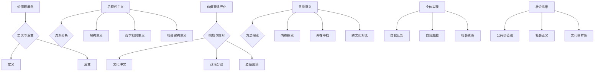

                 

## 引言

### 1.1 书籍的目的与结构

在后现代社会中，价值观的多元化引发了诸多社会挑战。本篇文章旨在探讨如何在后现代社会中寻找意义，应对价值观多元化的挑战。通过逻辑清晰、结构紧凑的论述，我们希望能够为读者提供一套应对多元化价值观的有效策略。

文章结构如下：

1. **引言**：介绍书籍的目的与结构。
2. **价值观的概念与演变**：探讨价值观的定义、起源与发展。
3. **后现代主义的主要流派**：分析解构主义、哲学相对主义和社会建构主义。
4. **价值观多元化的挑战**：讨论文化冲突、政治分歧和道德困境。
5. **寻找意义的方法**：介绍内在探索、外在寻找和跨文化对话。
6. **个体的自我实现**：探讨自我认知、自我超越和社会责任。
7. **社会的和谐发展**：讨论公共价值观的构建、社会正义的实现和文化多样性的尊重。
8. **结论**：回顾与总结，展望未来，并给出对读者的建议。

### 1.2 后现代社会的特点

后现代社会是一个充满复杂性和不确定性的社会。与传统的现代社会相比，后现代社会具有以下特点：

1. **信息爆炸**：互联网的普及使得信息传播速度加快，人们面临的信息量远超以往。
2. **全球化**：全球化使得不同文化之间的交流变得更加频繁，价值观的碰撞与融合成为一个不可避免的现象。
3. **去中心化**：传统的中心化权力结构逐渐瓦解，个体获得了更多的自由和权利。
4. **多元文化**：后现代社会是一个多元文化并存的社会，不同文化之间的差异日益显著。
5. **不确定性**：面对复杂多变的社会环境，人们对于未来的预期变得更加不确定。

这些特点使得后现代社会充满了挑战，尤其是在价值观层面。如何在这一背景下寻找意义，成为一个亟待解决的问题。

### 1.3 价值观多元化的影响

价值观多元化对社会和个人都产生了深远的影响。

#### 对社会的影响：

1. **文化冲突**：不同文化之间的价值观差异可能导致文化冲突，影响社会的稳定。
2. **政治分歧**：政治价值观的差异可能引发政治分歧，影响政策的制定与执行。
3. **道德困境**：多元价值观使得道德标准变得模糊，人们在面对道德困境时可能感到无所适从。

#### 对个人的影响：

1. **身份认同**：多元价值观使得个体在寻找身份认同时面临更多选择，但也可能感到困惑。
2. **价值观矛盾**：个体可能同时持有多种价值观，导致内心的矛盾和冲突。
3. **自我实现**：在多元价值观的背景下，个体需要更加努力地寻找自我实现的道路。

总的来说，价值观多元化既是机遇，也是挑战。如何应对这一挑战，找到在多元价值观中的意义，是本文的核心议题。

## 价值观的概念与演变

### 2.1 价值观的定义

价值观（Value）是指个体或社会对于什么是好的、什么是有意义的、什么是正确的所持有的信念和标准。它们是人们行为决策的指导原则，反映了个体和社会对于道德、伦理、美学等方面的基本认知。

从广义上讲，价值观不仅包括道德和伦理准则，还涵盖了社会规范、文化习俗和个人偏好。在个体的层面上，价值观通常通过道德判断、情感反应和行为倾向来体现；在社会层面上，价值观则通过法律、政策和社会习俗来体现。

### 2.2 价值观的起源与发展

价值观的起源可以追溯到人类的早期社会。在原始社会，价值观主要是基于生存本能和集体利益。随着社会的发展，价值观逐渐演变，反映了人类对于美好生活的追求和社会秩序的维护。

在古代社会，价值观主要受到宗教、神话和传统的影响。例如，在古希腊，美德（如勇敢、智慧、正义）是人们追求的价值观。在中世纪的欧洲，宗教价值观占据主导地位，强调信仰和禁欲。

进入现代社会，特别是工业革命以来，价值观发生了显著变化。随着科学技术的进步和人类对自我认知的加深，理性、自由和平等成为现代社会的重要价值观。例如，在法国大革命中，自由、平等、博爱成为革命的口号，影响深远。

### 2.3 后现代主义与价值观

后现代主义（Postmodernism）是20世纪中后期兴起的一种文化思潮，它对现代社会的价值观进行了深刻的反思和批判。后现代主义认为，现代社会的价值观是基于理性、客观性和普遍性，但实际上却充满矛盾和局限。

后现代主义的主要观点包括：

1. **相对主义**：后现代主义认为，真理是相对的，不存在绝对的真理。不同的文化、历史和语境下，对同一个问题可能会有不同的理解和解释。
2. **多元性**：后现代主义强调多元文化的共存，认为不同的文化和价值观都应该得到尊重和包容。
3. **去中心化**：后现代主义质疑现代社会的中心化和权威性，主张个体的自由和创造力。

后现代主义对价值观的影响主要体现在以下几个方面：

1. **挑战传统价值观**：后现代主义质疑传统的道德、伦理和宗教价值观，认为这些价值观是建立在错误的假设和偏见上的。
2. **强调多样性**：后现代主义鼓励人们从多个角度看待问题，尊重不同的文化和价值观。
3. **强调个体性**：后现代主义强调个体的独特性和自由，鼓励人们追求自我实现。

总的来说，后现代主义为价值观的多元化提供了理论基础，同时也为价值观的重建提供了新的思路。

## 后现代主义的主要流派

### 3.1 解构主义

解构主义（Deconstructionism）是后现代主义的重要流派之一，起源于20世纪60年代的法国。其代表人物是雅克·德里达（Jacques Derrida）。解构主义的核心观点是，通过批判和分解传统观念的结构和逻辑，揭示其内在的矛盾和局限。

#### 核心概念

1. **文本的多元性**：解构主义认为，文本并不是固定不变的，而是具有多重解释的可能性。每个文本都有其潜在的意义，但这些意义并不是一成不变的，而是随着时间和语境的变化而演变。
2. **差异原则**：解构主义强调差异的重要性。认为所有事物都处于差异之中，没有绝对的对立或统一。差异是理解文本和现实的关键。
3. **去中心化**：解构主义质疑传统观念的中心性，认为没有一个固定的中心或权威可以决定真理和意义。

#### 应用领域

解构主义在文学、哲学、艺术等领域都有广泛的应用。在文学批评中，解构主义通过分析文本的内在矛盾和多重意义，揭示文本的复杂性和多元性。在哲学中，解构主义批判了理性主义和客观主义的观点，提出了对语言和符号的深刻反思。

### 3.2 哲学相对主义

哲学相对主义（Philosophical Relativism）是后现代主义中的另一个重要流派。其核心观点是，真理是相对的，不存在绝对的真理。不同的文化、历史和语境下，对同一个问题可能会有不同的理解和解释。

#### 核心概念

1. **文化相对主义**：哲学相对主义认为，每个文化都有其独特的价值观和认知方式，没有一种文化可以声称拥有绝对的真理。文化相对主义强调尊重不同文化的多样性。
2. **语境相对主义**：哲学相对主义认为，真理和意义是依赖于具体语境的。在不同的语境下，对同一个问题的理解和解释可能会有所不同。

#### 应用领域

哲学相对主义在文化研究、国际关系和社会学等领域都有广泛的应用。在文化研究中，哲学相对主义强调不同文化之间的对话和交流，反对文化霸权。在国际关系中，哲学相对主义主张和平共处和多边主义，反对强权政治。

### 3.3 社会建构主义

社会建构主义（Social Constructivism）是后现代主义中的又一重要流派。其核心观点是，知识和现实都是社会建构的结果，而不是客观存在的实体。

#### 核心概念

1. **社会建构**：社会建构主义认为，知识和现实是通过社会互动和符号系统构建的。人们的认知和行为受到社会文化背景的影响。
2. **符号互动**：社会建构主义强调符号互动的重要性。认为人们通过符号互动来构建对世界的理解，这些符号互动包括语言、图像、文字等。
3. **情境意识**：社会建构主义认为，知识和现实是情境化的。在不同的情境下，人们对同一问题的理解和解释可能会有所不同。

#### 应用领域

社会建构主义在教育、心理学、社会学等领域都有广泛的应用。在教育中，社会建构主义强调学习是一个社会互动的过程，教师的角色是促进学生的思考和探索。在心理学中，社会建构主义关注个体如何通过社会互动来构建自我认知。在社会学中，社会建构主义通过分析社会互动和符号系统，揭示了社会现实的多重维度。

总的来说，后现代主义的主要流派从不同角度对现代社会的价值观进行了批判和反思，为价值观的多元化提供了理论基础。这些流派的应用领域广泛，对于理解和应对后现代社会的挑战具有重要意义。

### 4.1 文化冲突

文化冲突（Cultural Conflict）是指在多元文化背景下，由于文化差异引发的矛盾和对抗。文化冲突的表现形式多样，既可以是显性的，也可以是隐性的。文化冲突的原因主要包括以下几个方面：

#### 原因

1. **价值观差异**：不同文化对于道德、伦理和审美等方面有不同的理解和标准，这种差异可能导致价值观的冲突。
2. **信仰差异**：不同宗教和信仰体系之间可能存在根本性的分歧，例如对神的信仰、对生活的态度等。
3. **习俗差异**：不同文化有各自的习俗和传统，这些习俗和传统在不同文化之间可能存在冲突，例如饮食、服装和节日等。
4. **语言差异**：语言是文化的载体，不同语言之间的差异可能导致沟通障碍和误解，从而引发文化冲突。

#### 表现

1. **社会摩擦**：文化冲突可能表现为社会摩擦，例如不同文化背景的人在社会交往中产生的误解和矛盾。
2. **政治动荡**：在某些情况下，文化冲突可能升级为政治动荡，例如民族主义情绪的激化可能导致种族冲突和政治动乱。
3. **经济竞争**：文化冲突还可能表现在经济领域，例如跨国公司的经营策略和文化输出可能引发本土文化的抵触。

#### 影响与应对策略

文化冲突对社会和个人都会产生深远的影响。

#### 对社会的影响：

1. **社会稳定性**：文化冲突可能破坏社会的稳定性，导致社会动荡和不和谐。
2. **政策制定**：文化冲突可能影响政策的制定和执行，使得政策难以兼顾不同文化的需求。
3. **国际合作**：文化冲突可能影响国际关系的和谐，妨碍国际合作和交流。

#### 对个人的影响：

1. **身份认同**：文化冲突可能使个体在身份认同上感到困惑和矛盾，影响个人的心理健康。
2. **生活质量**：文化冲突可能降低人们的生活质量，导致心理压力和社交困难。

为了应对文化冲突，可以采取以下策略：

1. **文化教育**：通过教育和宣传，增进对不同文化的了解和尊重，减少误解和偏见。
2. **文化交流**：鼓励不同文化之间的交流和互动，促进文化融合和共存。
3. **法律和政策**：制定和执行相关政策，保障不同文化的权益，避免文化歧视和排斥。

总的来说，文化冲突是后现代社会中不可避免的现象，但通过有效的应对策略，可以减少其负面影响，促进社会的和谐发展。

### 4.2 政治分歧

政治分歧（Political Division）是指在多元价值观背景下，由于政治理念和制度差异所引发的矛盾和对立。政治分歧的表现形式多样，既可以是显性的，也可以是隐性的。政治分歧的原因主要包括以下几个方面：

#### 原因

1. **民主制度**：在民主制度下，不同政党或利益集团可能持有不同的政治理念和主张，这种差异可能导致政治分歧。
2. **经济体制**：不同经济体制，如资本主义、社会主义和混合经济，可能引发政治分歧。例如，资本主义强调市场自由和私有财产，而社会主义则强调公有制和社会公平。
3. **民族和宗教**：民族和宗教差异可能引发政治分歧。例如，某些地区可能存在民族分离主义或宗教极端主义。
4. **国际关系**：国际关系中的冲突和竞争也可能导致国内的政治分歧。例如，国家间的贸易争端、地缘政治矛盾等可能影响国内政治稳定。

#### 表现

1. **选举争议**：政治分歧可能表现为选举争议，如投票作弊、选举结果争议等。
2. **政治暴力**：在某些情况下，政治分歧可能升级为政治暴力，如抗议、示威、冲突等。
3. **政策争议**：政治分歧可能导致政策制定和执行中的争议，例如税收政策、社会福利政策等。

#### 影响与应对策略

政治分歧对社会和个人都会产生深远的影响。

#### 对社会的影响：

1. **政治稳定性**：政治分歧可能破坏社会的政治稳定性，导致社会动荡和不和谐。
2. **政策执行**：政治分歧可能影响政策的制定和执行，使得政策难以得到有效执行。
3. **社会信任**：政治分歧可能降低社会的信任水平，影响社会合作和团结。

#### 对个人的影响：

1. **身份认同**：政治分歧可能使个体在身份认同上感到困惑和矛盾，影响个人的心理健康。
2. **生活质量**：政治分歧可能降低人们的生活质量，导致心理压力和社交困难。

为了应对政治分歧，可以采取以下策略：

1. **政治教育**：通过教育和宣传，增进对不同政治理念和制度的了解和尊重，减少误解和偏见。
2. **对话与协商**：鼓励不同政治力量之间的对话和协商，寻求共识和解决方案。
3. **法律和政策**：制定和执行相关政策，保障不同政治群体的权益，避免政治歧视和排斥。

总的来说，政治分歧是后现代社会中不可避免的现象，但通过有效的应对策略，可以减少其负面影响，促进社会的和谐发展。

### 4.3 道德困境

道德困境（Moral Dilemma）是指在面对两种或多种道德选择时，个体或群体感到困惑和难以取舍的情况。道德困境常常出现在个体必须做出决策，而这些决策涉及不同的道德原则和价值观时。以下是道德困境的几个常见例子：

#### 例子

1. **电车难题**：一辆失控的电车正在驶向五个无法逃脱的工人，你站在一个开关旁边，可以选择是否将电车转到另一条轨道。如果不采取行动，五个工人将死亡；如果你拉动开关，电车将转到另一条轨道，但可能会有一个工人死亡。在这种情况下，个体必须决定是牺牲一个人的生命来救五个人，还是保持现状。

2. **医生与病人**：一个医生发现一个病人需要紧急器官移植才能存活，但器官捐献者在另一间病房中处于不可逆的脑死亡状态。医生可以选择不通知病人家属以获取器官，或者遵守伦理规范通知家属。

3. **商业伦理**：一个企业家在面临是否向竞争对手泄露商业机密以获得竞争优势的决策时，可能会感到道德困境。

#### 形成原因

道德困境的形成原因复杂，通常涉及以下几个方面：

1. **价值观冲突**：个体可能持有不同的价值观，这些价值观在某些情境下可能发生冲突。例如，一个人可能同时认为诚实和善意非常重要，但在特定情境下，这两种价值观可能会产生冲突。

2. **道德原则的模糊性**：某些道德原则在特定情境下可能具有模糊性，难以明确界定。例如，牺牲少数人的利益以救助多数人的原则在不同情境下可能具有不同的解释。

3. **情感和理性冲突**：个体的情感和理性思维可能产生冲突。例如，一个医生可能在理性上知道应该遵守医疗伦理规范，但在情感上感到难以接受牺牲另一个人的生命。

#### 影响与应对策略

道德困境对个体和社会都有深远的影响。

#### 对个体的影响：

1. **心理压力**：道德困境可能导致个体感到内疚、焦虑和困惑，影响心理健康。

2. **决策困难**：道德困境可能使个体在做出决策时感到犹豫不决，难以做出选择。

#### 对社会的影响：

1. **社会分裂**：道德困境可能导致不同群体在道德问题上产生分歧，影响社会和谐。

2. **信任危机**：道德困境可能导致人们对道德标准和规范的信任度降低，影响社会秩序。

为了应对道德困境，可以采取以下策略：

1. **道德教育**：通过道德教育，提高个体的道德判断能力和道德敏感性，帮助个体在面对道德困境时做出更合理的决策。

2. **道德咨询**：提供专业的道德咨询，帮助个体在面对道德困境时寻求解决方案。

3. **伦理审查**：建立伦理审查机制，确保在特定情境下决策的透明度和合理性。

总的来说，道德困境是后现代社会中普遍存在的现象，通过有效的应对策略，可以减少其负面影响，促进社会的道德进步和个体心理健康。

### 5.1 内在探索

内在探索（Inner Exploration）是寻找意义的重要方法之一，它涉及个体对自己内心世界的深入挖掘和反思。通过内在探索，个体可以更好地理解自己的价值观、信仰和人生目标，从而在面对多元化价值观的挑战时找到自己的定位。

#### 方法

1. **自我反思**：自我反思是内在探索的基础，它要求个体定期花时间思考自己的行为、情感和想法。通过反思，个体可以识别出自己内心的矛盾和冲突，并寻求解决之道。

2. **冥想和静心**：冥想和静心是帮助个体深入内心的重要工具。通过冥想，个体可以放慢思维的速度，减少杂念，从而更好地倾听内心的声音。静心则有助于个体放松身心，减轻压力，增强内心的平静和清晰。

3. **日记和写作**：通过写日记和写作，个体可以记录自己的感受和思考，从而更深入地理解自己。日记和写作也可以作为反思和自我探索的辅助工具，帮助个体整理思绪，明确自己的价值观和目标。

4. **内省和自我分析**：内省和自我分析是深入探索自我的重要方法。通过分析自己的行为和情感，个体可以识别出自己内心的驱动因素，从而更好地理解自己的行为模式。

#### 成果

通过内在探索，个体可以获得以下成果：

1. **自我认知**：通过深入探索内心世界，个体可以更好地了解自己，包括自己的优点、缺点、价值观和信仰。

2. **自我接纳**：内在探索有助于个体接纳自己的不完美，认识到每个人都是独一无二的，都有自己的价值和意义。

3. **自我实现**：通过了解自己的内心世界，个体可以更加明确自己的人生目标和追求，从而实现自我价值。

总之，内在探索是一种有效的方法，可以帮助个体在面对多元化价值观的挑战时找到自己的定位，实现内心的和谐与自我实现。

### 5.2 外在寻找

外在寻找（Outer Search）是寻找意义的另一种重要方法，它涉及个体通过外部世界来探索和理解生命的意义。通过外在寻找，个体可以获取新的视角和体验，从而扩展自己的认知和情感世界。

#### 方法

1. **学习与知识获取**：通过学习新的知识和技能，个体可以扩展自己的认知领域，提高自我理解能力。学习可以包括正规教育、自学和终身学习，通过不断学习，个体可以不断更新自己的知识和观念。

2. **旅行与体验**：旅行是外在寻找的重要方式之一。通过旅行，个体可以体验不同的文化和生活方式，拓宽自己的视野。旅行不仅可以帮助个体了解不同的社会和环境，还可以激发个体的创造力和想象力。

3. **社交与互动**：与他人进行深入的社交和互动可以帮助个体从他人的经验中学习和成长。通过与他人分享和交流，个体可以理解不同的观点和价值观，从而更好地理解自己和他人。

4. **志愿服务与公益活动**：参与志愿服务和公益活动可以帮助个体从服务他人的过程中获得成就感和满足感，从而找到生命的意义。通过帮助他人，个体可以认识到自己的价值和能力，从而增强自我价值感。

#### 成果

通过外在寻找，个体可以获得以下成果：

1. **知识扩展**：通过学习新的知识和技能，个体可以不断扩展自己的认知领域，提高自我理解能力。

2. **经验丰富**：通过旅行和社交，个体可以积累丰富的经验，从而更好地理解自己和他人。

3. **情感满足**：通过志愿服务和公益活动，个体可以获得内心的满足感和成就感，从而找到生命的意义。

总之，外在寻找是一种有效的方法，可以帮助个体在面对多元化价值观的挑战时获取新的视角和体验，从而实现自我成长和意义探索。

### 5.3 跨文化对话

跨文化对话（Intercultural Dialogue）是寻找意义的重要途径之一，它涉及不同文化背景的个体或群体之间的交流与沟通。通过跨文化对话，个体和群体可以更好地理解彼此的价值观、信仰和生活方式，从而促进文化的包容和融合。

#### 方法

1. **开放心态**：进行跨文化对话首先需要保持开放心态，尊重和理解不同文化的差异。个体应该避免对其他文化持有偏见和刻板印象，而是以平等和尊重的态度去接触和了解其他文化。

2. **积极倾听**：在跨文化对话中，积极倾听是关键。通过倾听他人的观点和经历，个体可以更好地理解对方的立场和情感。倾听不仅有助于建立信任和理解，还可以促进有效的沟通。

3. **共同话题**：寻找共同话题是跨文化对话的重要策略。通过讨论共同的兴趣、爱好和价值观，个体和群体可以找到共鸣点，从而建立更深入的联系。

4. **文化交流活动**：参与各种形式的文化交流活动，如文化交流会、文化节、国际会议等，可以帮助个体和群体更直观地体验其他文化，从而增进理解和尊重。

#### 成果

通过跨文化对话，个体和群体可以获得以下成果：

1. **文化理解**：通过跨文化对话，个体可以更好地理解不同文化的价值观和生活方式，从而减少误解和冲突。

2. **文化包容**：跨文化对话有助于促进文化的包容和融合，使个体和群体能够在一个多元文化的社会中和谐共处。

3. **个人成长**：参与跨文化对话可以丰富个体的生活经验，提高其文化敏感性和全球视野，从而促进个人成长和发展。

总之，跨文化对话是一种有效的方法，可以帮助个体在面对多元化价值观的挑战时找到共同点和理解，从而实现文化的包容与和谐。

### 6.1 自我认知

自我认知（Self-awareness）是指个体对自己内在和外在的认知过程，包括情感、思想、行为和价值观等方面。自我认知对于个体的成长和自我实现至关重要，它帮助个体更好地理解自己，识别自己的需求和动机，从而做出更加明智的决策。

#### 成果

通过自我认知，个体可以获得以下成果：

1. **自我理解**：自我认知有助于个体深入理解自己的情感、思想和行为，从而识别出内在的矛盾和冲突，促进自我成长。

2. **情绪管理**：通过自我认知，个体可以更好地管理自己的情绪，避免情绪的过度反应和负面情绪的积累。

3. **目标设定**：自我认知有助于个体明确自己的价值观和目标，从而更有针对性地设定和追求个人目标。

4. **决策能力**：自我认知增强了个体的自我理解，使其在面临决策时能够更加冷静和理性地分析各种因素，做出更加明智的决策。

#### 提升自我认知的方法

1. **自我反思**：定期进行自我反思，回顾自己的行为和情感，识别内在的动机和需求。

2. **记录日记**：通过写日记记录自己的思考和感受，有助于个体更好地理解和分析自己的行为模式。

3. **心理咨询**：通过心理咨询，个体可以获得专业人士的指导，帮助其深入探索自己的内心世界。

4. **阅读和学习**：阅读相关书籍和参加培训课程，有助于个体了解心理学和自我认知的知识，从而提升自我认知能力。

总之，自我认知是寻找意义的重要一步，通过提升自我认知，个体可以更好地理解自己，实现自我成长和自我实现。

### 6.2 自我超越

自我超越（Self-transcendence）是指个体在自我认知的基础上，通过扩展自己的视野和体验，超越自我限制，实现更深层次的自我成长和自我实现。自我超越不仅关注个体的内在成长，还强调个体与社会和世界的联系。

#### 成果

通过自我超越，个体可以获得以下成果：

1. **更高的自我认知**：自我超越帮助个体超越自我限制，更深入地理解自己的潜力和局限性，从而实现更高的自我认知。

2. **情感成熟**：自我超越促使个体在面对挑战和困难时，能够更加成熟和冷静地处理情感，增强情感稳定性。

3. **心理韧性**：通过自我超越，个体能够培养出更强的心理韧性，面对逆境和挫折时能够更加坚韧不拔。

4. **社会贡献**：自我超越使个体能够更好地认识到自己在社会中的作用和责任，从而更加积极地参与社会服务和公益活动。

#### 实现自我超越的方法

1. **挑战自我**：通过设定挑战性的目标和任务，个体可以在实践中不断超越自我，提升自己的能力和素质。

2. **跨文化体验**：通过参与跨文化学习和交流，个体可以扩展自己的视野，了解不同的文化和生活方式，从而实现自我超越。

3. **心理成长**：通过心理咨询和自我探索，个体可以识别和解决内心的冲突和障碍，实现更深层次的自我成长。

4. **志愿服务**：参与志愿服务和公益活动，个体可以在帮助他人的过程中找到自我价值，实现自我超越。

总之，自我超越是寻找意义的重要组成部分，通过自我超越，个体可以实现更高层次的自我认知和自我实现，为社会做出更大的贡献。

### 6.3 社会责任

社会责任（Social Responsibility）是指个体和企业为了社会公共利益而承担的义务和责任。在现代社会，随着个体和社会对环境保护、社会公正和可持续发展的关注日益增加，社会责任成为衡量企业和社会行为的重要标准。

#### 概念

社会责任涉及多个方面，包括环境保护、员工权益、社区发展和伦理行为等。企业社会责任（CSR）是指企业在其运营过程中，为了实现社会公共利益而采取的各种行动和措施。社会责任不仅是对企业盈利能力的追求，更是对社会可持续发展的贡献。

#### 重要性

1. **社会和谐**：承担社会责任有助于建立社会和谐，减少社会冲突和不平等，促进社会稳定。
2. **企业声誉**：积极履行社会责任可以提升企业的社会形象和声誉，增强公众对企业的信任和认可。
3. **员工满意度和忠诚度**：企业履行社会责任可以提升员工的工作满意度和忠诚度，减少员工流失率。
4. **市场竞争**：在现代社会，社会责任已成为企业竞争的重要方面。积极履行社会责任的企业在市场上更具竞争力。

#### 实践

1. **环境保护**：企业可以通过减少废物排放、节约能源和资源、推广绿色生产等方式，积极履行环境保护责任。
2. **员工权益**：企业应保障员工的合法权益，包括提供合理的薪酬、良好的工作环境和职业发展机会。
3. **社区发展**：企业可以通过参与社区建设、捐助慈善事业、支持教育项目等方式，积极回馈社区。
4. **伦理行为**：企业应遵守伦理规范，确保其产品和服务的安全性和质量，避免欺诈和误导消费者。

总之，社会责任是现代社会的重要议题，通过积极履行社会责任，企业不仅可以提升其社会形象和声誉，还可以为社会的可持续发展做出贡献。

### 7.1 公共价值观的构建

公共价值观的构建（Building Public Values）是后现代社会中实现社会和谐与稳定的关键。公共价值观是指被广泛认可和接受的价值观，它反映了社会成员的共同利益和目标，是维系社会团结和发展的基础。

#### 概念

公共价值观是一种普遍认同的社会准则和行为规范，它涵盖了道德、伦理、社会正义、公平、诚信等多个方面。公共价值观的构建需要在社会成员之间达成共识，并通过教育、法律、媒体等途径进行推广和传播。

#### 重要性

1. **社会和谐**：公共价值观的构建有助于减少社会矛盾和冲突，促进社会成员之间的相互理解和尊重，实现社会和谐。
2. **政策制定**：公共价值观为政策制定提供了理论基础，使得政策能够更好地反映社会成员的共同利益和期望。
3. **文化传承**：公共价值观的构建有助于传承和弘扬优秀传统文化，增强社会成员的文化认同感和自豪感。
4. **公民参与**：公共价值观的构建可以激发社会成员的参与热情，提高公民的社会责任感和参与度。

#### 方法

1. **教育宣传**：通过学校教育、公共媒体等渠道，宣传和弘扬公共价值观，提高社会成员的认同感和践行意识。
2. **法律保障**：制定相关法律和政策，保障公共价值观的实施和执行，确保社会成员在日常生活中能够遵循公共价值观。
3. **社区建设**：通过社区活动、志愿者服务等方式，加强社区成员之间的联系和互动，培养共同的公共价值观。
4. **公众讨论**：鼓励公众积极参与公共价值观的讨论和建设，通过民主协商和对话，达成社会共识。

总之，公共价值观的构建是后现代社会中实现社会和谐与稳定的重要途径，通过教育、法律、社区建设等多种方法，可以有效地推动公共价值观的传播和实践。

### 7.2 社会正义的实现

社会正义（Social Justice）是指在社会中公平地分配资源和机会，确保每个人都能获得基本的权利和尊严。实现社会正义是后现代社会的重要目标，它不仅关乎个人的幸福，也关系到社会的稳定和发展。

#### 概念

社会正义包括多个方面，如经济正义、政治正义、法律正义和社会福利正义。经济正义关注收入分配的公平性，政治正义关注权力的合理分配，法律正义关注法律的公正执行，社会福利正义关注社会救助和社会保障。

#### 重要性

1. **公平性**：实现社会正义可以减少社会不平等，确保每个人都能享有平等的机会和权利，从而促进社会的公平和和谐。
2. **稳定性**：社会正义的实现有助于减少社会矛盾和冲突，增强社会的稳定性和凝聚力。
3. **发展性**：社会正义的实现为社会的持续发展提供了坚实的基础，有助于激发社会成员的创造力和积极性。
4. **人道性**：社会正义强调对弱势群体的保护和关怀，体现了人道主义精神，有助于提高社会的道德水平。

#### 实现途径

1. **法律制度**：建立和完善法律制度，确保法律面前人人平等，打击犯罪和腐败，保障公民的基本权利和自由。
2. **经济改革**：通过经济改革，调整收入分配机制，减少贫富差距，实现社会资源的公平分配。
3. **教育机会**：提供平等的教育机会，确保每个孩子都能接受良好的教育，从而提高整个社会的素质和竞争力。
4. **社会福利**：建立完善的社会福利制度，为弱势群体提供基本生活保障，减少社会不公。

总之，社会正义的实现是后现代社会中的一项重要任务，通过法律制度、经济改革、教育机会和社会福利等多种途径，可以逐步实现社会正义，促进社会的和谐与进步。

### 7.3 文化多样性的尊重

文化多样性（Cultural Diversity）是指不同文化之间在价值观、习俗、艺术和生活方式等方面的差异。在全球化背景下，文化多样性的重要性日益凸显，尊重文化多样性成为社会和谐与进步的基石。

#### 概念

文化多样性不仅包括不同民族和地区的文化差异，还涉及个人之间的文化差异。它强调每个文化都有其独特的价值和贡献，应当得到尊重和包容。文化多样性包括语言、宗教、艺术、习俗、传统和生活方式等方面。

#### 重要性

1. **社会和谐**：尊重文化多样性有助于减少文化冲突，促进不同文化之间的相互理解和包容，增强社会的和谐与稳定。
2. **创新与进步**：文化多样性为社会的创新和进步提供了丰富的资源和灵感，不同的文化可以相互借鉴和融合，推动社会的发展。
3. **个人发展**：尊重文化多样性有助于个人的成长和发展，通过接触和了解不同的文化，个人可以拓展视野，丰富自己的经验和知识。
4. **全球合作**：在全球化的今天，尊重文化多样性是促进国际交流和合作的重要基础，有助于构建一个更加和谐和繁荣的地球村。

#### 尊重文化多样性的方法

1. **文化交流**：通过举办文化交流活动，如文化节、艺术展览和学术研讨会，促进不同文化之间的交流与互动。
2. **教育普及**：在学校和社区开展文化教育，提高公众对文化多样性的认识和尊重。
3. **政策支持**：制定相关政策，保障不同文化的权益，避免文化歧视和排斥。
4. **包容性法律**：建立包容性的法律制度，保护少数群体的文化权益，确保文化多样性的合法性和合理性。

总之，尊重文化多样性是构建和谐社会的关键，通过文化交流、教育普及、政策支持和包容性法律等多种方法，可以促进文化多样性的尊重和发展。

## 结论

在后现代社会中，价值观的多元化带来了诸多挑战，但也为个体和社会提供了新的机遇。通过自我认知、自我超越和跨文化对话，个体可以找到自己的定位，实现自我实现。同时，通过构建公共价值观、实现社会正义和尊重文化多样性，社会可以促进和谐与进步。

### 展望未来

未来，随着科技的不断进步和社会的不断发展，价值观的多元化将变得更加显著。我们需要更加深入地理解多元价值观，探索如何在多元价值观中找到共同点，实现社会的和谐与进步。

### 对读者的建议

1. **自我反思**：定期进行自我反思，深入理解自己的价值观和信仰，找到自己的定位。
2. **学习与交流**：积极参与学习和交流，扩展自己的视野，了解不同的文化和价值观。
3. **实践社会责任**：积极参与志愿服务和公益活动，为社会贡献自己的力量。
4. **尊重文化多样性**：尊重和理解不同的文化，促进文化交流与融合。

通过以上建议，我们可以更好地应对后现代社会中的多元化价值观挑战，实现个人的成长和社会的进步。

## 附录

### 参考文献

1. Appiah, K. A. (2006). The Ethics of Identity. Harvard University Press.
2. Bauman, Z. (2000). Liquid Modernity. Polity Press.
3. Derrida, J. (1976). Of Grammatology. John Hopkins University Press.
4. Foucault, M. (1980). The History of Sexuality, Vol. 1. Pantheon Books.
5. Habermas, J. (1992). The Structural Transformation of the Public Sphere. MIT Press.
6. Nussbaum, M. C. (1997). Cultivating Humanity: A Classical Defense of Reform in Liberal Education. Harvard University Press.

### 进一步阅读建议

1. Appiah, K. A. (2010). The Cosmopolitanism Reader. Routledge.
2. Said, E. W. (1978). Orientalism. Pantheon Books.
3. Sen, A. (1999). Development as Freedom. Alfred A. Knopf.
4. Taylor, C. (1994). Sources of the Self: The Making of the Modern Identity. Harvard University Press.
5. Wink, W. (1992). Engaging the Powers: Discernment and Resistance in a World of Domination. Orbis Books.

## Mermaid 流程图

这个流程图展示了文章的核心概念和它们之间的关系，帮助读者更好地理解和吸收文章的内容。通过这种方式，读者可以更清晰地看到从价值观的探讨到应对多元化价值观的挑战，再到个体实现和社会和谐的路径。这不仅有助于深化对文章主题的理解，也为读者提供了一个系统性思考的框架。

