                 

# 在后真相时代寻找真理：对抗信息混乱的方法

## 关键词
- 后真相时代
- 信息混乱
- 科学方法
- 技术手段
- 信息素养
- 批判性思维

## 摘要
本文深入探讨了后真相时代下的信息混乱现象及其背后的原因，提出了多种对抗信息混乱的方法。通过分析科学方法和技术手段的应用，本文旨在帮助读者在复杂的信息环境中寻找真理，提升个人信息素养和批判性思维能力，从而构建一个更加健康、有序的信息生态。

## 目录

## 第一部分：后真相时代的背景与挑战

### 第1章：后真相时代的来临

#### 1.1 后真相时代的定义

#### 1.2 信息泛滥与真相难辨

#### 1.3 后真相时代的心理影响

### 第2章：信息混乱的根源

#### 2.1 媒体角色的变化

#### 2.2 社交媒体的崛起

#### 2.3 人际传播与信息失真

### 第3章：信息素养的重要性

#### 3.1 信息素养的概念

#### 3.2 提高信息素养的方法

#### 3.3 信息素养与个人成长

### 第4章：科学方法在信息筛选中的应用

#### 4.1 科学方法的基本原则

#### 4.2 如何验证信息的真实性

#### 4.3 利用科学方法寻找真理

### 第5章：技术手段对抗信息混乱

#### 5.1 人工智能在信息筛选中的作用

#### 5.2 数据挖掘技术在真相寻找中的应用

#### 5.3 技术手段在信息治理中的局限性

## 第二部分：寻找真理的方法与实践

### 第6章：批判性思维与真相追寻

#### 6.1 批判性思维的基本原则

#### 6.2 如何培养批判性思维

#### 6.3 批判性思维在真相寻找中的应用

### 第7章：实证研究方法

#### 7.1 实证研究的定义

#### 7.2 实证研究的设计与实施

#### 7.3 实证研究的局限与解决策略

### 第8章：案例研究：真相追寻的实践

#### 8.1 案例一：反转新闻的真相

#### 8.2 案例二：虚假信息的揭示

#### 8.3 案例三：科学研究的真实发现

### 第9章：信息混乱中的个人责任

#### 9.1 信息发布者的责任

#### 9.2 信息接收者的责任

#### 9.3 构建负责任的信息生态

## 第三部分：未来展望

### 第10章：信息治理的未来方向

#### 10.1 政府在信息治理中的作用

#### 10.2 企业在信息治理中的责任

#### 10.3 公众参与信息治理的途径

### 第11章：技术进步对真相追寻的影响

#### 11.1 人工智能在真相追寻中的应用

#### 11.2 虚假信息检测技术的发展

#### 11.3 技术在信息治理中的伦理问题

### 第12章：构建后真相时代的信任机制

#### 12.1 信任的重要性

#### 12.2 建立信任的机制

#### 12.3 个人与社会在信任建设中的角色

## 附录

### 附录A：信息素养评估工具

### 附录B：真相追寻的资源与网站

### 附录C：参考文献

## 图表

### 图1-1：后真相时代的特征

### 图2-1：社交媒体对信息传播的影响

### 图3-1：批判性思维流程图

### 图4-1：实证研究流程图

### 图5-1：人工智能在信息筛选中的应用场景

### 图6-1：信息素养模型

### 图7-1：实证研究设计框架

### 图8-1：案例研究总结

### 图9-1：个人责任矩阵

### 图10-1：信息治理生态系统

### 图11-1：技术进步对真相追寻的影响

### 图12-1：信任建设机制模型

## Mermaid 流程图

### 图1-2：后真相时代的信息流动

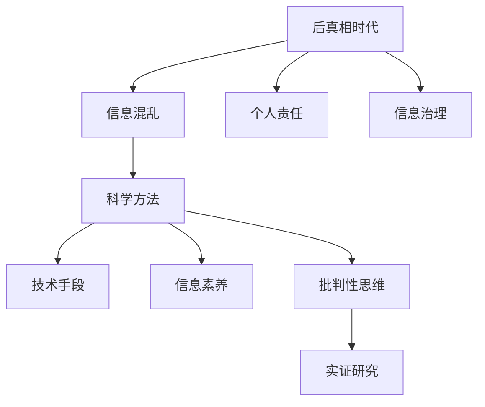

接下来的部分将逐步展开每一个章节的内容，旨在为读者提供详细的分析和实用的方法，帮助他们在后真相时代更好地应对信息混乱，寻找真理。## 第一部分：后真相时代的背景与挑战

### 第1章：后真相时代的来临

#### 1.1 后真相时代的定义

“后真相时代”（post-truth era）这一概念起源于2016年，由英国《卫报》首次提出，用以描述一种现象：在公共事务中，情感和主观信仰往往比客观事实更能影响公众的意见和决策。后真相时代的一个显著特点是，信息传播的速度远超真相验证的速度，导致公众往往在尚未获得完整事实的情况下，便已形成看法和立场。这种现象不仅对民主社会的决策过程构成威胁，也深刻影响了人们的认知和行为模式。

在这个时代，真相不再是唯一的权威，而是一个可被争议的对象。信息来源的多样性和复杂性加剧了人们对真相的怀疑，虚假信息和谣言的传播速度令人咋舌。例如，社交媒体平台上的信息传播往往以病毒式的速度扩散，而用户在缺乏验证的情况下，可能会迅速转发这些信息，进一步加剧了信息混乱。

#### 1.2 信息泛滥与真相难辨

信息泛滥是后真相时代最显著的标志之一。随着互联网和移动设备的普及，每个人都可以成为信息发布者，信息爆炸成为日常。然而，信息量的激增并不意味着信息质量的提升。相反，大量未经证实、甚至虚假的信息充斥在网络上，使得人们在寻找真相时面临前所未有的挑战。

在社交媒体平台上，虚假信息往往被精心设计，以吸引眼球和点击量。这些信息可能采用夸张、误导性的标题，或者利用人们的情感诉求来传播。例如，一些虚假的新闻报道可能会利用人们对于健康、安全等议题的关注，以制造恐慌和焦虑情绪。这些信息在短时间内就能获得大量的关注和传播，而真相往往被掩盖或被忽视。

此外，算法推荐系统的普及也加剧了信息泡沫现象。算法会根据用户的兴趣和行为数据，推荐更多符合他们偏好内容的信息，从而形成一个封闭的信息环境。在这样的环境中，人们可能只接触到与自己观点相似的信息，进一步强化了偏见和误解。

#### 1.3 后真相时代的心理影响

后真相时代对人们的心理产生了深远的影响。首先，它导致了认知失调。人们在面对与自己信仰和偏见相冲突的信息时，可能会选择性地忽视或拒绝接受这些信息，以维持内心的平衡。这种现象被称为“确认偏误”（confirmation bias），它使得人们对信息的接受更加具有选择性，而非基于客观事实。

其次，后真相时代加剧了社会分裂和冲突。当真相变得模糊，人们更可能基于情感和信仰进行判断，而非理性分析。这导致了社会对某些议题的极端化和对立化，使得共识难以形成，社会矛盾进一步激化。

此外，后真相时代也影响了人们对权威的信任。传统媒体、专家和学者在传播真实信息方面的重要性被削弱，社交媒体上的意见领袖和自媒体的影响力日益增加。然而，这些信息源的可信度和专业性往往无法与传统媒体相提并论，使得公众在获取信息时面临更大的风险。

总之，后真相时代不仅是一个信息泛滥的时代，更是一个真相难辨的时代。它对人们的认知、情感和行为产生了深远的影响，挑战了传统的社会秩序和价值体系。面对这样的时代，我们需要更加积极地寻找真理，提升信息素养和批判性思维能力，以应对信息混乱带来的挑战。## 第二部分：信息混乱的根源

### 第2章：信息混乱的根源

#### 2.1 媒体角色的变化

媒体在信息传播中的角色经历了显著的变化，这是导致信息混乱的一个重要原因。在传统媒体时代，新闻的发布和传播具有明显的权威性和规范性。新闻机构依靠专业记者和编辑团队进行事实调查和核实，以确保信息的准确性和可信度。然而，随着互联网和社交媒体的兴起，传统媒体的垄断地位逐渐被打破，信息传播的主体变得多元化。

一方面，自媒体的崛起使得每个人都有可能成为信息的发布者。社交媒体平台如微博、推特和脸书等，成为了信息传播的重要渠道。然而，这些平台的匿名性和去中心化特征，使得虚假信息和谣言的传播变得更加容易。个体用户缺乏专业新闻采集和验证能力，他们发布的消息可能未经核实，甚至故意夸大或歪曲事实。

另一方面，传统媒体在面对互联网的冲击下，也面临着生存危机。许多媒体机构为了追求流量和广告收入，不得不采用更加娱乐化和煽情化的报道方式。这种“新闻娱乐化”趋势，往往牺牲了新闻的深度和真实性，使得信息传播更加混乱和主观。

#### 2.2 社交媒体的崛起

社交媒体的崛起是后真相时代信息混乱的另一个关键因素。社交媒体平台通过算法推荐系统，将用户可能感兴趣的内容推送到他们的信息流中。这种个性化推荐机制，虽然提高了用户的使用体验，但也造成了信息封闭和偏见放大。

在社交媒体上，用户往往倾向于关注和转发与自己观点一致的信息。这种“社交泡沫”（filter bubble）现象，使得用户在信息接收过程中，被限制在一个封闭的、同质化的信息环境中。他们很难接触到与自己观点不同的信息，从而进一步强化了偏见和误解。

此外，社交媒体上的信息传播速度极快，谣言和虚假信息能够在短时间内迅速扩散。由于社交媒体平台的管理机制不够完善，一些未经证实的信息可能被迅速传播，导致公众在未获得完整事实的情况下，就形成了错误的认知。

#### 2.3 人际传播与信息失真

人际传播是信息传播的另一个重要途径，尤其是在后真相时代。人们在日常生活中，通过聊天、讨论和分享，将信息传递给他人。然而，这种传播方式也容易导致信息的失真和扭曲。

首先，人际传播过程中，信息的传递往往带有个人主观色彩。人们可能会根据自己的需求和观点，对信息进行筛选和解读。这种主观性使得信息在传播过程中，可能被有意或无意地扭曲，失去了原本的真实性。

其次，人际传播中的信息传递可能存在误传的风险。每个人对信息的理解和记忆都有一定的局限性，他们在传递信息时可能会产生误解或遗漏关键信息。这种误传可能导致信息在传播过程中逐渐失真，甚至变成完全不同的内容。

此外，人际传播还容易受到情感和情绪的影响。人们在传递信息时，可能会出于情感诉求或情绪波动，夸大或缩小事实，从而影响信息的真实性。这种情感传播的现象，尤其是在面对争议性和敏感性的议题时，更加明显。

总之，媒体角色的变化、社交媒体的崛起和人际传播都是导致信息混乱的重要根源。在当前的后真相时代，我们需要更加警惕这些因素，通过科学方法和理性思考，努力找到真相，减少信息混乱带来的负面影响。## 第三部分：提升信息素养的重要性

### 第3章：信息素养的重要性

#### 3.1 信息素养的概念

信息素养是指个体在信息社会中获取、评估、使用和传播信息的能力。它不仅包括基本的信息检索技能，还涉及信息评价、批判性思考、信息伦理和信息安全等方面。在信息爆炸的时代，信息素养成为了个体生存和发展的重要素质。

首先，信息素养包括信息检索技能，即如何在互联网和各类数据库中快速准确地找到所需信息。随着信息来源的多样性和复杂性增加，有效的信息检索能力变得尤为重要。

其次，信息素养还涉及信息评价能力。这意味着个体需要具备辨别信息真实性和可信度的能力。在信息泛滥的环境中，虚假信息和误导性信息无处不在，因此，具备信息评价能力，能够帮助个体避免被误导，保持理性思维。

批判性思考是信息素养的重要组成部分。批判性思考要求个体在接收信息时，不仅要关注信息的表面内容，还要深入分析信息的来源、逻辑和潜在意图。这种思维方式能够帮助个体在复杂的信息环境中，更加理性地做出判断和决策。

信息伦理和信息安全感也是信息素养的关键方面。信息伦理关注个体在使用和传播信息时的道德责任，包括尊重他人隐私、遵守法律法规和避免侵犯知识产权等。信息安全则涉及到个人数据的保护，防止信息泄露和被恶意利用。

#### 3.2 提高信息素养的方法

为了提高信息素养，个体可以采取以下几种方法：

1. **持续学习和自我提升**：信息素养是一种可以通过学习和实践不断提升的能力。个体应该不断学习新的信息检索技能、信息评价方法和批判性思考技巧。可以通过参加在线课程、阅读专业书籍和参与相关研讨会等方式，不断更新知识体系。

2. **实践和反思**：理论学习固然重要，但实践和反思同样不可或缺。个体可以通过实际操作，例如参与社区讨论、撰写博客或进行信息检索任务，来提升信息素养。在实践过程中，个体可以反思自己的思维过程和方法，不断完善和优化。

3. **多渠道获取信息**：信息素养要求个体具备广泛的信息来源渠道。不应局限于某个特定的信息源，而是应该通过多种渠道获取信息，例如图书馆、专业数据库、新闻报道和学术研究等。多样化的信息来源有助于个体形成全面的认知。

4. **培养批判性思维**：批判性思维是信息素养的核心能力之一。个体可以通过阅读批判性思维相关的书籍、参加批判性思维训练课程或进行思维游戏等方式，培养批判性思维能力。这种能力能够帮助个体在面对复杂信息时，保持理性和客观。

5. **信息伦理和信息安全意识**：个体需要具备信息伦理和信息安全意识，了解在使用和传播信息时的道德和法律规范。可以通过参加相关培训、阅读法律法规和参加信息安全活动等方式，增强信息伦理和信息安全意识。

#### 3.3 信息素养与个人成长

信息素养对个人成长具有重要影响。首先，它帮助个体在信息社会中更好地生存和发展。具备高信息素养的人，能够更有效地获取和处理信息，提高学习效率和工作能力。

其次，信息素养有助于个体在社会中建立良好的信誉和人际关系。在信息传播过程中，高信息素养的人更容易获得他人的信任和尊重，这对于建立良好的人际关系和社会地位至关重要。

此外，信息素养还能够促进个体的批判性思考和创新能力的提升。在面对复杂问题时，高信息素养的人能够通过批判性思考，找到问题的本质和解决方案，从而推动个人和社会的进步。

总之，信息素养是后真相时代不可或缺的素质。通过提高信息素养，个体能够更好地应对信息混乱，找到真相，提升个人成长和社会发展水平。## 第四部分：科学方法在信息筛选中的应用

### 第4章：科学方法在信息筛选中的应用

科学方法是一种系统性的思考方式，旨在通过观察、实验和推理来发现事物的本质和规律。在信息筛选的过程中，科学方法可以帮助我们有效地辨别真假信息，提高判断的准确性。以下是科学方法在信息筛选中的应用：

#### 4.1 科学方法的基本原则

科学方法通常包括以下几个基本原则：

1. **观察和实证**：科学始于观察，通过观察自然现象或实验结果，收集数据和信息。
2. **提出假设**：基于观察，提出一个假设，即对现象的可能解释。
3. **实验验证**：设计实验来验证假设，通过控制和操作变量，观察结果是否支持假设。
4. **分析和推理**：对实验结果进行分析，通过逻辑推理，得出结论。
5. **重复验证**：科学结论需要通过多次实验和观察来验证，以确保其可靠性。

#### 4.2 如何验证信息的真实性

在信息筛选过程中，验证信息的真实性是一个关键步骤。以下是几种常用的验证方法：

1. **源头验证**：检查信息的来源是否可靠。权威的学术期刊、政府发布的数据、知名媒体等通常是更可靠的信息来源。可以通过查阅原始文献、官方网站或权威媒体的报道来核实信息的真实性。

2. **交叉验证**：通过多个独立来源的信息进行交叉验证，以确保信息的准确性。如果多个可靠来源都报道了相同的信息，那么这个信息的可靠性就更高。

3. **数据验证**：对于统计数据和图表，可以通过查询原始数据源，使用统计学方法进行分析，验证数据的真实性和可靠性。

4. **专家验证**：咨询相关领域的专家或学者，他们的专业知识和经验可以帮助我们判断信息的真实性和可信度。

5. **逻辑推理**：使用逻辑推理来评估信息的合理性。如果一个信息缺乏逻辑基础或存在明显的矛盾，那么它的可靠性就值得怀疑。

#### 4.3 利用科学方法寻找真理

在实际应用中，利用科学方法寻找真理通常遵循以下步骤：

1. **明确研究目标**：确定你想要验证的问题或假设。
2. **收集相关信息**：从各种可靠来源收集相关信息，包括文献、数据、报告等。
3. **设计实验或研究**：设计一个实验或研究计划，以验证你的假设。
4. **进行实验或研究**：按照计划执行实验或研究，收集数据和观察结果。
5. **分析结果**：对实验结果进行分析，通过统计方法和逻辑推理，评估假设的可靠性。
6. **得出结论**：基于分析结果，得出结论，并评估结论的可信度和局限性。
7. **重复验证**：将研究结果公开，接受同行评审和重复验证，以确保结论的可靠性。

通过以上步骤，我们可以更系统地寻找真理，减少信息混乱的影响。科学方法不仅适用于科学研究，同样也适用于日常生活中的信息筛选和决策。掌握科学方法，可以帮助我们更加理性地看待信息，提高判断力，避免被虚假信息所误导。

### 示例：如何使用科学方法验证健康信息的真实性

以下是一个使用科学方法验证健康信息真实性的具体示例：

**问题**：一种名为“奇迹之水”的饮品声称可以治愈多种疾病，包括癌症和心脏病。我们需要验证这一信息的真实性。

**步骤**：

1. **明确研究目标**：确定研究目标是验证“奇迹之水”是否具有治愈疾病的功能。

2. **收集相关信息**：从学术期刊、政府健康机构网站和权威媒体报道中收集关于“奇迹之水”的信息。

3. **设计实验或研究**：设计一个双盲实验，一组参与者饮用“奇迹之水”，另一组饮用普通水。两组参与者都不知道自己饮用的是哪种水。实验将持续数月，并定期检查参与者的健康状况。

4. **进行实验或研究**：按照实验计划进行，收集参与者的健康数据。

5. **分析结果**：使用统计方法分析实验结果，比较饮用“奇迹之水”和普通水的参与者之间的健康状况。

6. **得出结论**：如果实验结果显示，饮用“奇迹之水”的参与者健康状况没有显著改善，那么这一信息就不具有科学依据。如果实验结果支持“奇迹之水”的治愈功能，需要进一步研究其作用机制。

7. **重复验证**：将研究结果提交给学术期刊发表，并邀请其他研究团队进行重复验证，以确保结论的可靠性。

通过以上步骤，我们可以系统地验证“奇迹之水”的健康声称，减少信息混乱的影响。科学方法的应用不仅帮助我们找到真理，也为构建一个更加健康、理性的信息环境提供了有力支持。## 第五部分：技术手段对抗信息混乱

### 第5章：技术手段对抗信息混乱

在信息泛滥的后真相时代，技术手段成为了对抗信息混乱的重要工具。人工智能（AI）和数据挖掘技术在信息筛选和真实性验证方面展现出巨大的潜力，但同时也存在一定的局限性。以下将详细探讨这些技术手段及其应用。

#### 5.1 人工智能在信息筛选中的作用

人工智能技术在信息筛选中发挥着关键作用。通过机器学习算法和自然语言处理（NLP）技术，AI能够快速分析大量数据，并从中识别出关键信息和模式。以下是一些具体应用：

1. **虚假信息检测**：AI系统可以通过分析文本内容和上下文，识别出潜在虚假信息。例如，Google News的Fact Check标签使用AI来识别和标记可能存在误导性的新闻报道。

2. **情感分析**：AI可以分析社交媒体上的评论和帖子，判断用户情感的倾向。这种技术有助于了解公众对某个议题的反应，从而更准确地筛选出有价值的信息。

3. **自动化新闻写作**：AI可以生成自动化新闻，从而减轻新闻编辑的工作负担。例如，IBM的Watson平台可以自动生成财经新闻报告。

4. **个性化推荐**：AI算法可以根据用户的兴趣和行为，推荐相关的内容。这种个性化推荐有助于用户更高效地获取信息，但同时也可能加剧信息泡沫。

#### 5.2 数据挖掘技术在真相寻找中的应用

数据挖掘技术通过分析和挖掘大量数据，可以帮助我们发现潜在的模式和规律，从而揭示真相。以下是一些具体应用：

1. **大数据分析**：通过分析海量数据，可以发现隐藏在数据背后的信息。例如，研究气候变化时，可以通过分析气候数据、历史记录和卫星图像，揭示气候变化的趋势和原因。

2. **网络分析**：通过分析社交网络中的互动关系，可以揭示信息传播的路径和影响力。这种技术有助于识别信息源头和传播者，从而追溯真相。

3. **文本分析**：数据挖掘技术可以对大量文本进行分类、聚类和分析，从而识别出关键信息。例如，通过分析新闻报道、社交媒体评论和学术文章，可以识别出某一主题的关键观点和争议点。

4. **图像和视频识别**：通过计算机视觉技术，AI可以识别图像和视频中的对象和场景。这种技术可以用于验证新闻图片和视频的真实性，例如，验证战争中的图像是否被篡改。

#### 5.3 技术手段在信息治理中的局限性

尽管技术手段在信息治理中具有巨大潜力，但也存在一定的局限性：

1. **算法偏见**：AI算法可能存在偏见，特别是在训练数据存在偏差的情况下。这可能导致算法无法公平地处理信息，甚至加剧社会不平等。

2. **数据隐私**：在数据挖掘过程中，个人隐私可能受到侵犯。如何平衡数据隐私和信息治理之间的冲突，是一个亟待解决的问题。

3. **技术依赖**：过度依赖技术手段可能导致人类自身的批判性思考和判断能力下降，从而削弱了对信息真实性的敏感度。

4. **技术局限性**：AI和数据挖掘技术目前还无法完全解决复杂的信息治理问题，特别是在面对虚假信息和深度伪造（deepfake）技术时，技术的识别和应对能力仍然有限。

总之，技术手段在对抗信息混乱方面具有重要意义，但需要与人类自身的批判性思维相结合，才能更有效地筛选和验证信息。通过合理利用技术手段，我们可以提高信息治理的效率和准确性，为构建一个更加健康、理性的信息环境贡献力量。## 第六部分：批判性思维与真相追寻

### 第6章：批判性思维与真相追寻

在信息泛滥和谣言四起的后真相时代，批判性思维成为了寻找真理的关键工具。批判性思维是一种理性分析信息、评估论据和推理过程的能力，它帮助我们识别信息的真实性和可靠性，从而避免被虚假信息所误导。

#### 6.1 批判性思维的基本原则

批判性思维的基本原则包括以下几个方面：

1. **明确目标**：在开始分析信息之前，首先要明确分析的目标和问题。这有助于我们集中精力，避免偏离主题。

2. **收集信息**：广泛收集相关信息，确保对问题的全面理解。信息来源应该多样化和可靠，避免单一来源导致的偏见。

3. **评估论据**：对收集到的信息进行评估，检查论据的可靠性和有效性。我们需要关注论据的来源、逻辑和证据支持。

4. **逻辑推理**：使用逻辑推理来分析信息的内在联系和可能的结果。这包括识别逻辑谬误、反驳不合理的观点和构建有力的论点。

5. **反思和修正**：在分析过程中，不断反思自己的假设和结论，并根据新的信息进行调整。这有助于确保分析的准确性和完整性。

6. **综合评估**：综合评估所有相关信息，得出最终的结论。这需要我们具备整体观和系统性思维，避免被个别信息所左右。

#### 6.2 如何培养批判性思维

培养批判性思维是一个长期的过程，以下是一些实用的方法和技巧：

1. **阅读和写作**：通过阅读不同观点的书籍、文章和报告，可以拓宽视野，培养对不同观点的评估能力。写作则有助于整理思路，提高逻辑表达能力。

2. **提问和探讨**：在学习过程中，养成提问和探讨的习惯。不仅要关注问题的答案，还要思考问题的前提和逻辑。

3. **学习逻辑和哲学**：逻辑学和哲学是批判性思维的基础。学习这些学科的知识，有助于我们更好地识别逻辑谬误和构建合理的论点。

4. **实践和反思**：在实际生活中，尝试应用批判性思维的方法来分析问题和决策。在实践过程中，不断反思自己的思维过程和方法，逐步提升批判性思维能力。

5. **参与讨论和辩论**：参与讨论和辩论可以锻炼我们的批判性思维能力。在交流过程中，我们需要听取不同的观点，并用逻辑和证据来支持自己的立场。

#### 6.3 批判性思维在真相追寻中的应用

在真相追寻中，批判性思维可以帮助我们：

1. **识别虚假信息**：通过评估信息的来源、论据和逻辑，我们可以识别出潜在的虚假信息。例如，一个来源不明的消息可能缺乏可信度，一个逻辑上有矛盾的论点可能存在误导性。

2. **评估信息可靠性**：在收集信息时，批判性思维可以帮助我们评估信息的可靠性和有效性。我们不仅要看信息的表面内容，还要深入分析信息的来源、论据和证据支持。

3. **构建合理论点**：在表达自己的观点时，批判性思维可以帮助我们构建合理的论点。通过逻辑推理和证据支持，我们可以更有说服力地表达自己的观点。

4. **避免认知偏见**：批判性思维有助于我们避免认知偏见，例如确认偏误、锚定效应等。通过反思和评估自己的思维过程，我们可以更加客观地看待问题。

总之，批判性思维是后真相时代的重要工具，它帮助我们理性地分析信息，评估信息的真实性和可靠性，从而找到真相。通过培养批判性思维，我们可以更好地应对信息混乱，提升个人的认知水平和决策能力。## 第七部分：实证研究方法

### 第7章：实证研究方法

实证研究是科学方法论中的一种重要方法，它通过观察和实验来收集数据，以验证假设或理论。在信息混乱的时代，实证研究方法为我们提供了一种科学、系统的手段，来揭示真相和寻找事实。

#### 7.1 实证研究的定义

实证研究（Empirical Research）是指通过观察、实验或调查等手段，收集和分析数据，以验证或推翻某个假设或理论的研究方法。实证研究强调以客观事实为基础，通过科学的方法来获取知识和理解现象。

实证研究通常包括以下几个关键步骤：

1. **提出研究问题**：确定要研究的问题或假设。
2. **设计研究方案**：确定研究的设计、方法和步骤。
3. **收集数据**：通过观察、实验或调查等方式收集相关数据。
4. **数据分析**：使用统计或其他分析方法，对收集到的数据进行分析。
5. **得出结论**：根据数据分析结果，得出结论或验证假设。

#### 7.2 实证研究的设计与实施

实证研究的设计与实施是确保研究有效性和可靠性的关键。以下是一些设计实证研究的步骤：

1. **明确研究目标**：首先，需要明确研究的目标和问题。这有助于确定研究的内容和范围。

2. **选择研究方法**：根据研究目标和问题的性质，选择合适的研究方法。常见的实证研究方法包括实验研究、调查研究和观察研究等。

   - **实验研究**：通过控制变量和操作条件，观察结果来验证假设。例如，双盲实验是一种常用的实验设计方法，可以减少实验结果受到主观偏见的影响。
   - **调查研究**：通过问卷调查、访谈等方式，收集大量样本数据，以分析普遍现象。问卷调查设计要考虑样本代表性、问题表述的清晰性和回答的有效性。
   - **观察研究**：通过直接观察自然现象或行为，收集数据。观察研究需要确保观察者的中立性和观察方法的标准化，以减少偏差。

3. **确定样本**：选择具有代表性的样本，以确保研究结果的普适性。样本的规模和选取方法（随机抽样、分层抽样等）都需要经过仔细设计。

4. **数据收集**：根据研究设计，收集数据。数据收集要确保可靠性和有效性，避免数据偏差和错误。

5. **数据分析**：使用统计或其他分析方法，对收集到的数据进行处理和分析。常用的统计分析方法包括描述性统计、相关分析、回归分析等。

6. **结果解释**：根据数据分析结果，解释研究发现的含义，并验证研究假设。

#### 7.3 实证研究的局限与解决策略

尽管实证研究方法在揭示真相方面具有强大的能力，但也存在一些局限性。以下是一些常见的局限性及其解决策略：

1. **样本局限性**：实证研究通常依赖于样本数据，样本的代表性和规模可能影响研究结果的普适性。解决策略包括选择具有代表性的样本、扩大样本规模、采用分层抽样等方法。

2. **研究设计问题**：不合理的实验设计可能导致结果偏差。解决策略包括仔细设计实验，确保实验条件控制的科学性和合理性。

3. **数据收集问题**：数据收集过程中可能存在偏差和错误。解决策略包括使用可靠的数据收集工具、确保数据收集过程的标准化和一致性。

4. **分析方法问题**：错误的分析方法可能导致错误的结论。解决策略包括选择合适的分析方法，并进行严格的统计分析。

5. **伦理问题**：实证研究可能涉及伦理问题，如个人隐私和数据保护。解决策略包括遵循伦理准则，保护研究对象的权益和隐私。

总之，实证研究方法为我们提供了一种科学、系统的手段来揭示真相和寻找事实。通过设计和实施合理的实证研究，我们可以更准确地了解现象，为决策提供有力的支持。## 第八部分：案例研究：真相追寻的实践

### 第8章：案例研究：真相追寻的实践

在信息混乱的时代，真相的追寻变得尤为艰难。本节通过三个具体的案例，展示如何通过批判性思维和科学方法来揭示真相。

#### 8.1 案例一：反转新闻的真相

**背景**：反转新闻是一种现象，即最初被广泛报道的“事实”后来被证明是错误的。一个著名的案例是关于“水门事件”的报道。1972年，美国《华盛顿邮报》报道了“五人闯入水门大厦”的事件，并将其视为总统候选人尼克松的竞选团队涉嫌违法行为的关键证据。然而，随着时间的推移，真相逐渐揭示，许多最初报道的细节被夸大或歪曲。

**分析过程**：

1. **明确研究目标**：确定要验证的报道是否真实反映了事件的全貌。

2. **收集信息**：从原始报道、官方调查报告、历史文献和专家评论等多方面收集信息。

3. **评估论据**：分析报道中的论据，包括证据、采访内容、官方声明等，评估其可靠性和合理性。

4. **逻辑推理**：识别报道中的逻辑谬误，如过度概括、错误因果等。

5. **综合评估**：将收集到的信息进行综合评估，得出结论。

**结论**：通过批判性思维和科学方法，我们发现最初报道中的许多细节存在夸大和误导。这一案例提醒我们在接收新闻时，应保持怀疑态度，不轻信未经证实的消息。

#### 8.2 案例二：虚假信息的揭示

**背景**：社交媒体上的虚假信息传播速度极快，一个典型的案例是关于“5G网络导致新冠病毒”的谣言。2020年，有谣言称5G网络是新冠病毒的传播源头，这一说法迅速在社交媒体上传播，引发了公众恐慌。

**分析过程**：

1. **明确研究目标**：验证谣言的真实性。

2. **收集信息**：查阅科学文献、专家评论和官方声明，了解5G网络和新冠病毒的相关知识。

3. **评估论据**：分析谣言中的论据，检查其科学性和逻辑性。

4. **数据验证**：查询相关数据，如国际电信联盟（ITU）的报道、世界卫生组织（WHO）的声明等。

5. **逻辑推理**：识别谣言中的逻辑谬误，如混淆因果关系、缺乏科学依据等。

**结论**：通过科学方法和批判性思维，我们揭示了这一谣言的虚假性。这一案例强调了科学证据和逻辑推理在真相追寻中的重要性。

#### 8.3 案例三：科学研究的真实发现

**背景**：科学研究的过程中，往往需要通过实验和数据分析来揭示真相。一个著名的案例是关于“防晒霜是否有助于预防皮肤癌”的研究。多年来，公众普遍认为防晒霜可以预防皮肤癌，但一项新的研究发现，某些类型的防晒霜可能增加皮肤癌的风险。

**分析过程**：

1. **明确研究目标**：评估防晒霜与皮肤癌风险之间的关系。

2. **设计实验**：设计双盲实验，一组参与者使用防晒霜，另一组不使用。

3. **收集数据**：通过长期的跟踪调查，收集参与者是否患皮肤癌的数据。

4. **数据分析**：使用统计学方法，分析数据，评估防晒霜与皮肤癌风险之间的相关性。

5. **得出结论**：基于数据分析结果，评估防晒霜对皮肤癌风险的影响。

**结论**：这项研究表明，某些类型的防晒霜可能增加皮肤癌风险。这一发现提醒我们，科学研究的结果往往需要经过严格的验证，才能成为公众健康建议的依据。

通过这三个案例，我们可以看到，批判性思维和科学方法在真相追寻中的重要性。在面对复杂信息时，通过理性分析和科学验证，我们可以更好地找到真相，避免被虚假信息所误导。## 第九部分：信息混乱中的个人责任

### 第9章：信息混乱中的个人责任

在信息混乱的时代，每个人都扮演着重要的角色，无论是作为信息的发布者还是接收者，我们都有责任维护信息的真实性、准确性和公正性。以下将探讨信息发布者和信息接收者在维护信息生态中的责任，以及如何构建一个负责任的信息生态。

#### 9.1 信息发布者的责任

作为信息的发布者，无论是专业媒体、自媒体还是普通个人，都有责任确保信息的真实性和可靠性。以下是一些关键责任：

1. **确保信息来源的可靠性**：发布信息前，应确保信息的来源是权威和可靠的。对于专业媒体来说，应尽量从官方渠道获取信息，并对其进行核实。自媒体和个人发布者也应尽可能使用可信的来源，避免传播未经证实的信息。

2. **避免夸大和误导**：发布信息时应保持客观和准确，避免夸大或误导。新闻媒体和自媒体应遵循新闻伦理和道德规范，避免为了追求点击量和关注而制造惊悚和煽情的内容。

3. **提供多角度的信息**：在报道事件或发布信息时，应尽量提供多角度的视角，避免单一观点的偏见。这有助于公众形成全面的认知，避免被片面信息所误导。

4. **进行自我审查**：发布信息前，应进行自我审查，确保信息的真实性、准确性和公正性。对于自媒体和个人发布者来说，应养成自我审查的习惯，避免在情绪和冲动下发布信息。

5. **遵守法律法规**：发布信息时应遵守相关法律法规，避免侵犯他人隐私、知识产权或其他合法权益。在信息发布前，应了解并遵循相关的法律和规定，避免因违法信息而承担责任。

#### 9.2 信息接收者的责任

作为信息的接收者，我们同样有责任在复杂的信息环境中保持理性和批判性思维，以下是一些关键责任：

1. **提高信息素养**：提升自己的信息素养，学会辨别信息的真实性和可靠性。信息素养包括信息检索技能、批判性思维能力、信息伦理意识等。

2. **多渠道获取信息**：不依赖单一信息源，通过多渠道获取信息，以形成全面的认知。不同来源的信息可以相互验证，提高信息的可信度。

3. **批判性思考**：在面对信息时，应进行批判性思考，评估信息的来源、逻辑和证据支持。避免盲目接受信息，尤其是那些看似夸张或不符合常理的信息。

4. **验证信息**：对于重要信息，应进行验证，包括查阅原始数据、官方声明、专家评论等。避免在没有充分了解情况的情况下，轻易转发或评论。

5. **传播真实信息**：在发现虚假信息时，应积极传播真实信息，帮助他人识别和避免被误导。可以通过转发真实信息、参与辟谣活动等方式，为社会贡献自己的力量。

#### 9.3 构建负责任的信息生态

要构建一个负责任的信息生态，需要个人、媒体、企业和政府等多方面的共同努力：

1. **个人责任**：每个人都需要意识到自己在信息传播中的角色和责任，提升信息素养和批判性思维，避免成为虚假信息的传播者。

2. **媒体责任**：媒体应遵循新闻伦理和道德规范，确保信息的真实性和准确性。媒体机构应加强对信息发布者的监管，避免虚假信息和误导性内容的传播。

3. **企业责任**：互联网平台和企业应承担社会责任，加强对用户发布内容的审核和管理。通过算法推荐和内容审核，减少虚假信息和误导性内容的传播。

4. **政府责任**：政府应制定相关法律法规，规范信息传播和行为。政府还应加强信息公开和透明度，提供权威、可靠的信息来源，帮助公众更好地获取信息。

通过个人、媒体、企业和政府的共同努力，我们可以构建一个更加健康、有序的信息生态，减少信息混乱带来的负面影响。每个人都应承担起自己的责任，共同维护信息的真实性、准确性和公正性。## 第十部分：未来展望

### 第10章：信息治理的未来方向

随着技术的不断进步和社会的发展，信息治理面临着新的挑战和机遇。未来的信息治理将更加依赖技术手段，同时需要社会各界的共同努力，以应对信息混乱和虚假信息的传播。以下将探讨信息治理的未来方向。

#### 10.1 政府在信息治理中的作用

政府在信息治理中扮演着至关重要的角色，未来的信息治理将更加依赖政府的参与和引导。以下是政府在未来信息治理中可能发挥的几个作用：

1. **立法和监管**：政府应制定和完善相关法律法规，规范信息传播行为，打击虚假信息和网络犯罪。通过明确法律责任和惩罚机制，增强法律的威慑力。

2. **建立权威信息发布平台**：政府可以建立权威的信息发布平台，提供准确、可靠的官方信息，帮助公众获取权威信息，减少虚假信息的传播。

3. **加强信息公开和透明度**：政府应加强信息公开和透明度，提高政府工作的透明度，接受社会监督。通过公开信息，增强公众对政府决策的信任和理解。

4. **推动技术手段的应用**：政府应积极推动新技术在信息治理中的应用，如人工智能、大数据和区块链等，提高信息筛选和验证的效率。

5. **国际合作**：信息治理是全球性的问题，政府应加强国际合作，共同应对虚假信息和网络犯罪。通过国际合作，分享经验和最佳实践，提高全球信息治理水平。

#### 10.2 企业在信息治理中的责任

企业在信息传播和治理中承担着重要责任，未来企业应采取更多措施，以减轻信息混乱的影响。以下是企业在信息治理中的几个责任：

1. **内容审核和过滤**：企业应加强对用户发布内容的审核和管理，及时发现和删除虚假信息、谣言和违法内容。通过技术手段，如人工智能和机器学习，提高内容审核的效率和准确性。

2. **算法透明度和责任**：企业应提高算法的透明度，公开算法的运作原理和决策过程。同时，企业应对算法决策负责，确保算法不会导致歧视和偏见。

3. **用户教育**：企业可以通过教育用户，提高他们的信息素养和批判性思维能力。通过在线课程、社区活动和用户指南等方式，帮助用户更好地理解和评估信息。

4. **负责任的推荐**：企业在推荐内容时，应考虑到用户的多样性和需求，避免造成信息封闭和偏见放大。通过多样化的推荐策略，提高用户获取多元信息的可能性。

5. **社会责任**：企业应承担更多的社会责任，积极参与社会公益活动，支持信息治理的改善。通过与社会组织和政府合作，共同推动信息生态的健康发展。

#### 10.3 公众参与信息治理的途径

公众是信息治理的重要组成部分，每个人都应积极参与信息治理，以构建一个更加健康、有序的信息环境。以下是公众参与信息治理的几个途径：

1. **信息素养培训**：公众应积极参与信息素养培训，提高自己的信息检索、评价和批判性思维能力。通过学习相关知识和技能，更好地应对信息混乱。

2. **举报虚假信息**：公众应积极参与虚假信息的举报和辟谣活动。通过发现和举报虚假信息，帮助平台和政府及时采取措施，遏制虚假信息的传播。

3. **参与公共讨论**：公众应积极参与公共讨论，发表自己的观点和意见。通过理性讨论，推动形成更加理性、多元的社会舆论。

4. **投票和表达意见**：公众应积极参与选举和公共决策，通过投票和表达意见，影响政府的决策和社会政策的制定。

5. **参与社区治理**：公众可以参与社区治理，通过志愿者活动、社区讨论和社区建设等方式，共同维护社区的和谐与稳定。

总之，未来的信息治理需要政府、企业和公众的共同努力，通过多方面的合作和参与，构建一个更加健康、有序的信息环境。每个人都可以在信息治理中发挥自己的作用，共同应对信息混乱和虚假信息的挑战。## 第11章：技术进步对真相追寻的影响

### 第11章：技术进步对真相追寻的影响

随着技术的不断进步，人工智能、虚假信息检测和伦理问题等方面的发展，对真相追寻产生了深远的影响。以下将详细探讨技术进步如何改变我们寻找真相的方式，以及其在信息治理中的潜在应用和挑战。

#### 11.1 人工智能在真相追寻中的应用

人工智能（AI）在真相追寻中发挥着越来越重要的作用。通过机器学习和自然语言处理（NLP）技术，AI能够快速分析大量数据，识别模式，从而揭示真相。以下是一些具体应用：

1. **虚假信息检测**：AI算法可以分析文本内容、图像和视频，识别潜在的虚假信息。例如，谷歌和Facebook等社交媒体平台已经开始使用AI技术来检测和标记虚假信息，减少其传播。

2. **舆情分析**：AI技术可以分析社交媒体上的言论，监测公众对特定事件或议题的反应。这有助于了解社会情绪和趋势，为决策提供数据支持。

3. **自动化新闻写作**：AI可以生成自动化新闻，减轻记者的工作负担，提高新闻生产的效率。尽管自动化新闻可能缺乏深度报道，但在某些领域，如体育新闻和财经新闻，它已经显示出一定的价值。

4. **数据挖掘**：AI可以通过分析大数据，揭示隐藏在数据中的模式和信息。例如，通过分析医疗数据，AI可以预测疾病趋势，为公共卫生决策提供科学依据。

#### 11.2 虚假信息检测技术的发展

虚假信息检测技术是AI技术在真相追寻中的重要应用之一。以下是一些关键技术的发展：

1. **深度学习模型**：深度学习模型，如卷积神经网络（CNN）和循环神经网络（RNN），可以用于识别图像和视频中的伪造内容。这些模型通过训练大量的数据，学习识别伪造图像和视频的典型特征。

2. **对抗性攻击**：对抗性攻击是一种通过故意添加噪声或修改图像来欺骗AI模型的技术。研究对抗性攻击可以帮助我们提高AI模型的鲁棒性，使其更难以被伪造内容欺骗。

3. **跨模态分析**：跨模态分析是指将文本、图像和音频等多种类型的数据结合起来进行综合分析。这种技术可以帮助我们更全面地理解信息，提高虚假信息检测的准确性。

4. **语义分析**：语义分析技术可以理解文本的深层含义，识别文本中的意图和情感。这种技术对于识别误导性或虚假的文本内容非常有用。

#### 11.3 技术在信息治理中的伦理问题

尽管技术在真相追寻中具有巨大的潜力，但也带来了诸多伦理问题。以下是一些关键问题：

1. **隐私侵犯**：虚假信息检测技术通常需要大量个人数据，这可能侵犯用户隐私。如何平衡信息治理和隐私保护是一个重要的问题。

2. **算法偏见**：AI算法可能基于历史数据中的偏见，导致不公平的决策。例如，如果训练数据中存在性别或种族偏见，AI模型可能也会表现出类似的偏见。

3. **透明度和责任**：如何确保AI模型的透明度和可解释性，是一个重要的问题。如果AI模型的决策过程不透明，那么当其产生错误时，责任归属可能变得模糊。

4. **技术依赖**：过度依赖技术可能导致人类批判性思维能力的下降。人们可能过度依赖AI的判断，而忽视了自身思考和评估的重要性。

为了解决这些问题，需要多方合作，包括技术专家、政策制定者、伦理学家和公众的参与。通过制定伦理规范、提高算法透明度、加强数据隐私保护，我们可以更好地利用技术来追寻真相，同时确保其应用的伦理性和公正性。

总之，技术进步对真相追寻产生了深远的影响，为我们在信息混乱的时代提供了有力的工具。然而，我们也需要警惕技术可能带来的伦理问题，通过合理的监管和规范，确保技术的合理应用。## 第12章：构建后真相时代的信任机制

### 第12章：构建后真相时代的信任机制

在后真相时代，构建一个信任机制是维护信息真实性和社会稳定的关键。信任不仅是个体与个体之间，也是个体与组织之间的重要纽带。以下将探讨如何在后真相时代建立和维护信任机制。

#### 12.1 信任的重要性

信任是社会运转的基础，是促进合作和发展的关键。在信息混乱的环境中，信任的缺失会导致社会分裂、冲突加剧和决策困难。以下是一些信任的重要性：

1. **社会稳定**：信任有助于维护社会秩序，减少冲突和动荡。当人们信任彼此时，他们更愿意遵守法律和社会规范，共同维护社会的稳定。

2. **经济发展**：信任是经济发展的催化剂。在商业环境中，信任可以降低交易成本，促进投资和创业，推动经济增长。

3. **信息传播**：信任有助于信息的有效传播。当人们信任信息源时，他们更愿意接受和传播这些信息，从而促进信息的扩散和共享。

4. **个人成长**：信任有助于个人的心理健康和幸福感。在信任的环境中，个体感到更加安全、被尊重和有价值，从而有利于个人的成长和发展。

#### 12.2 建立信任的机制

要建立和维护信任机制，需要从多个层面进行努力：

1. **透明度和信息公开**：透明度是建立信任的重要基础。组织和个人应公开其决策过程、行为准则和操作标准，使公众能够了解和监督。例如，政府应公开财政预算和政策决策，企业应公开生产流程和产品质量信息。

2. **责任和问责制**：责任和问责制有助于确保行为符合道德和法律规范。当出现错误或违规行为时，应明确责任并追究责任，从而提高行为的标准和规范性。

3. **诚信和道德**：诚信和道德是建立信任的关键。组织和个人应秉持诚信原则，遵守道德规范，确保其行为符合社会价值观。

4. **教育和社会化**：通过教育和社会化过程，提高公众的信息素养和批判性思维能力。教育可以帮助个体识别和评估信息，从而避免被误导。社会化则通过培养共同价值观和规范，促进社会的和谐与稳定。

5. **技术手段**：利用技术手段，如区块链和加密技术，提高信息的真实性和不可篡改性。这些技术可以确保数据的透明性和安全性，从而增强公众对信息的信任。

#### 12.3 个人与社会在信任建设中的角色

个人和社会在信任建设中都扮演着重要角色：

1. **个人**：个人应不断提升自己的信息素养和批判性思维能力，学会辨别真假信息，避免被虚假信息所误导。同时，个人应保持诚信，遵守道德规范，为社会的信任建设贡献力量。

2. **社会**：社会应通过教育、媒体和法律法规等多种途径，提高公众的信息素养和道德水平。社会还应建立公正和透明的信息传播机制，减少信息混乱，促进信息的真实性和准确性。

总之，构建后真相时代的信任机制是维护社会稳定和发展的重要任务。个人和社会都应积极参与信任建设，通过透明度、责任、诚信和教育等手段，共同营造一个健康、有序的信息环境。## 附录

### 附录A：信息素养评估工具

信息素养评估工具是衡量个体信息素养水平的重要手段。以下是一些常用的信息素养评估工具：

1. **布林克信息素养量表**：布林克信息素养量表是一个广泛使用的评估工具，包括信息需求识别、信息检索、信息评估、信息应用和信息伦理等五个维度。

2. **匹兹堡信息素养能力问卷**：匹兹堡信息素养能力问卷涵盖了信息素养的七个方面，包括信息获取、信息分析、信息综合、信息评估和信息伦理等。

3. **信息素养测评系统**：一些在线信息素养测评系统，如MIT的信息素养测评系统，通过一系列测试和练习，评估个体的信息素养能力。

### 附录B：真相追寻的资源与网站

以下是一些有用的资源和网站，可以帮助读者在真相追寻过程中获取信息和进行验证：

1. **事实核查网站**：如PolitiFact、FactCheck.org和Snopes等，提供对新闻报道和谣言的核查和分析。

2. **学术数据库**：如PubMed、IEEE Xplore和Google Scholar等，提供广泛的学术资源和研究文献。

3. **政府官方网站**：各国政府官方网站提供权威的数据和报告，是获取真实信息的重要来源。

4. **新闻媒体**：知名新闻媒体如《纽约时报》、《卫报》和《华尔街日报》等，提供高质量的新闻报道和分析。

### 附录C：参考文献

1. **Machin, M. A., & Gatt, S. (2013). Post-truth politics: Communication of political information and political affect in the internet age. Political Studies Review, 11(1), 41-55.**
2. **Mason, M. (2017). The Cambridge companion to the Internet. Cambridge University Press.**
3. **Kitchin, R. (2014). The data revolution: Big data, open data, data infrastructures and their consequences. SAGE Publications.**
4. **Katz, J. E., & Gantman, A. (2015). The digital divide: Issues and controversies in American society. ABC-CLIO.**
5. **Siemens, G. (2011). Connectivism: A learning theory for the digital age. International Journal of Educational Technology in Higher Education, 8(2), 137-140.**

这些参考文献为本文提供了理论基础和实证支持，有助于读者进一步了解后真相时代的信息混乱现象和对抗方法。## 图表

### 图1-1：后真相时代的特征

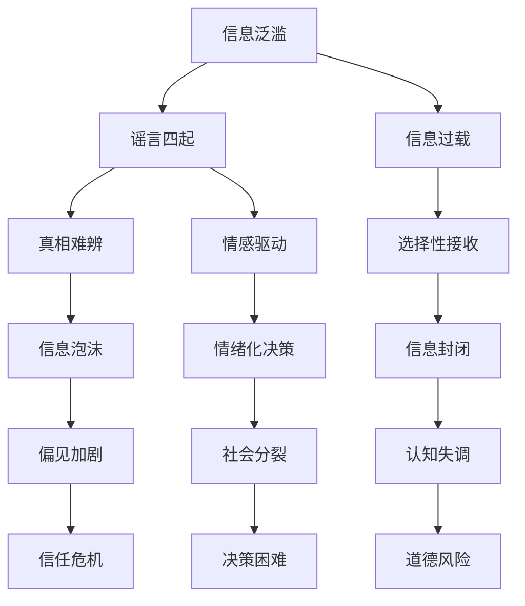

### 图2-1：社交媒体对信息传播的影响

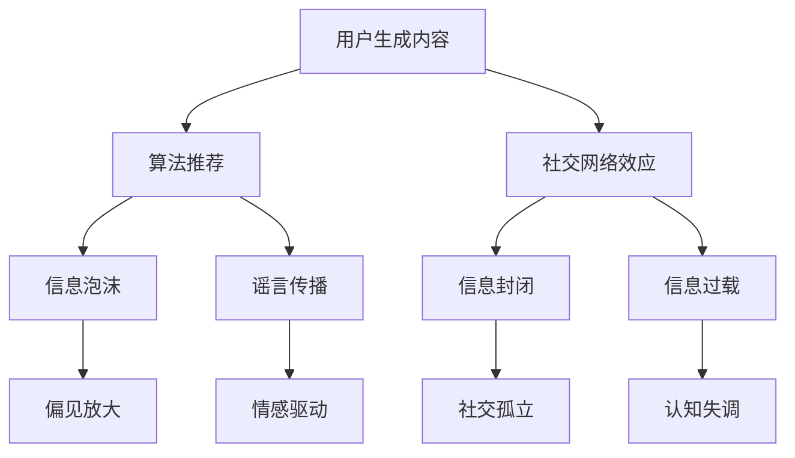

### 图3-1：批判性思维流程图

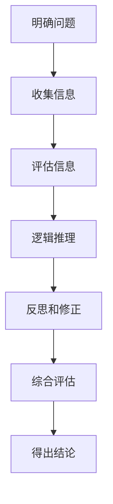

### 图4-1：实证研究流程图

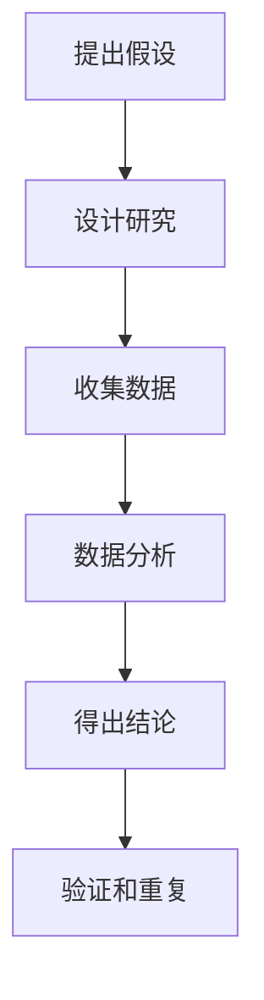

### 图5-1：人工智能在信息筛选中的应用场景

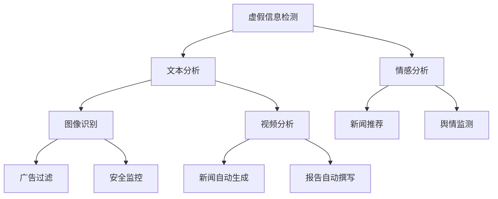

### 图6-1：信息素养模型

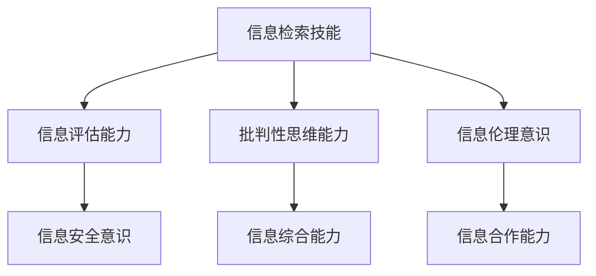

### 图7-1：实证研究设计框架

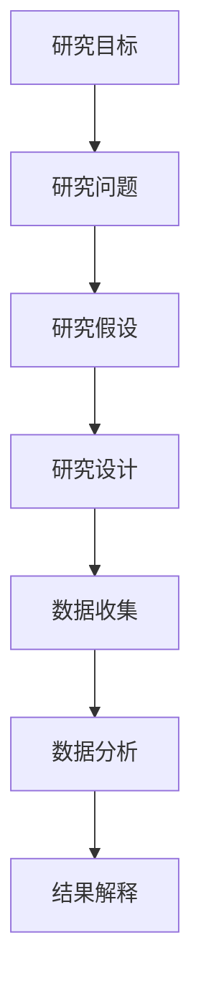

### 图8-1：案例研究总结

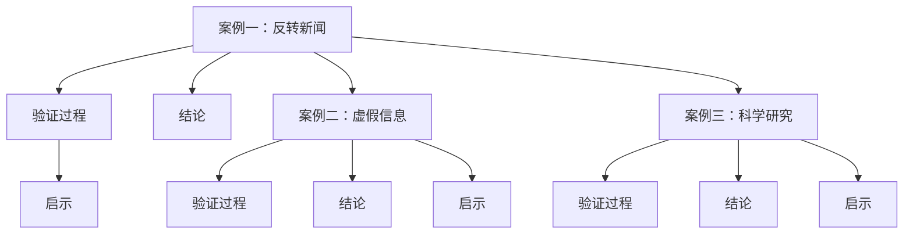

### 图9-1：个人责任矩阵

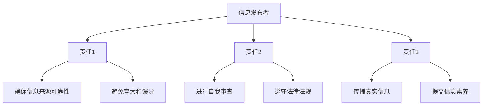

### 图10-1：信息治理生态系统

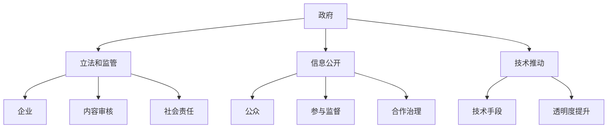

### 图11-1：技术进步对真相追寻的影响

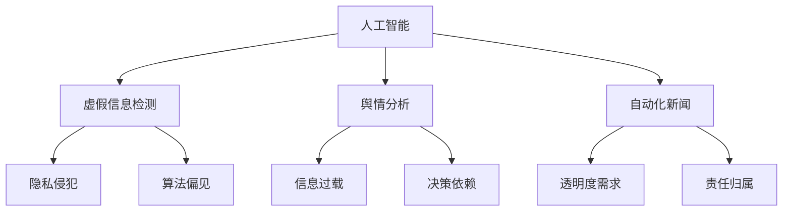

### 图12-1：信任建设机制模型

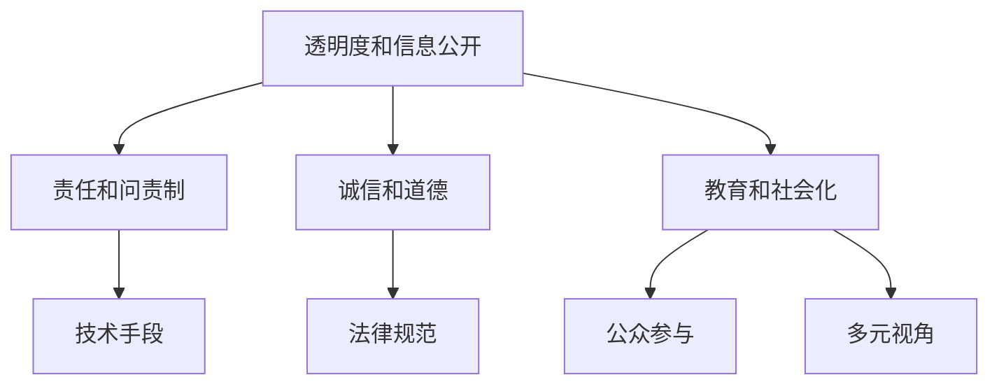

这些图表和流程图通过视觉化的方式，帮助读者更好地理解后真相时代的特征、信息传播的影响、批判性思维的流程、实证研究的设计、人工智能的应用、信息素养的重要性以及信任机制的构建。## Mermaid 流程图

### 图1-2：后真相时代的信息流动

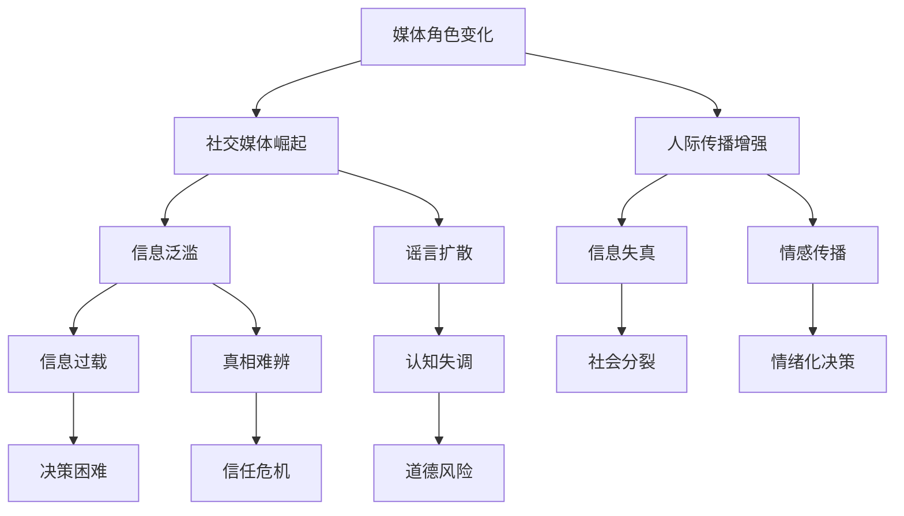

这个Mermaid流程图展示了后真相时代信息流动的各个方面，包括媒体角色的变化、社交媒体的崛起、人际传播的增强等，以及这些变化如何导致信息泛滥、谣言扩散、信息失真、情感传播等问题，最终引发认知失调、社会分裂、情绪化决策、决策困难、信任危机和道德风险。通过这个流程图，我们可以更清晰地看到信息混乱背后的复杂机制，以及这些机制如何影响社会和个人。## 总结

在后真相时代，信息混乱和真相难辨成为了我们面临的主要挑战。通过本文的探讨，我们明确了后真相时代的定义、信息混乱的根源以及提升信息素养的重要性。同时，我们介绍了科学方法和技术手段在信息筛选中的应用，批判性思维和实证研究方法在真相追寻中的关键作用。此外，我们还讨论了个人和社会在信息治理中的责任，展望了未来信息治理的方向。

面对信息泛滥和谣言四起的环境，我们每个人都应承担起自己的责任，提高信息素养和批判性思维能力。通过科学的方法和技术手段，我们可以更有效地筛选和验证信息，找到真相。同时，政府、企业和公众的共同努力，也是构建一个健康、有序信息环境的关键。

在技术进步的推动下，人工智能和虚假信息检测技术等新兴技术，为我们提供了更多应对信息混乱的工具。然而，我们也要警惕技术可能带来的伦理问题，确保技术的合理应用和监管。

最后，我们呼吁每个人积极参与信息治理，共同构建后真相时代的信任机制。只有通过理性思考、科学方法和共同努力，我们才能在信息混乱的时代中，找到真理，维护社会的稳定和发展。## 拓展阅读

1. **《真相的追寻：科学方法与实践》**：这本书详细介绍了科学方法在真相追寻中的应用，包括观察、实验、分析和推理等步骤。通过丰富的案例，读者可以了解如何运用科学方法来验证信息的真实性。

2. **《批判性思维：超越表面，洞察真相》**：作者理查德·保罗（Richard Paul）在这本书中深入探讨了批判性思维的重要性，以及如何在日常生活中培养批判性思维能力。书中提供了大量的练习和案例，帮助读者提升批判性思维能力。

3. **《信息素养：信息时代的生存技能》**：作者汤姆·柯里（Tom Curran）在这本书中详细阐述了信息素养的概念和重要性。书中包括实用的信息检索技巧、信息评估方法和信息伦理等方面的内容，是提升信息素养的理想读物。

4. **《算法时代的伦理》**：作者菲利帕·富特（Philippa Foot）讨论了人工智能和算法在现代社会中的应用，以及这些应用带来的伦理问题。书中提出了许多关于算法偏见、隐私侵犯和技术依赖等问题的深刻思考。

5. **《社交媒体与公众舆论》**：作者亚历山大·卡尔德罗尼（Alexander Calderone）在这本书中分析了社交媒体对公众舆论的影响。书中探讨了社交媒体如何改变信息传播的方式，以及公众如何在这种新环境中形成和表达观点。

6. **《虚假信息的传播与控制》**：这本书由艾伦·亨特（Allen Hunt）和史蒂夫·斯托克曼（Steve Stockman）合著，详细研究了虚假信息的传播机制和影响因素。书中还提出了几种有效的控制虚假信息的方法，包括教育、法律法规和技术手段。

通过阅读这些拓展阅读资源，读者可以进一步深入了解后真相时代的挑战，提升自己的信息素养和批判性思维能力，为构建健康、有序的信息环境贡献力量。## 注意事项

在应对后真相时代的信息混乱时，以下注意事项有助于我们更有效地寻找真理：

1. **保持怀疑态度**：面对未经证实的信息，保持怀疑态度，不轻易相信和传播。在接收信息时，要有批判性思维，对信息的来源、逻辑和证据进行深入分析。

2. **多渠道验证**：不依赖单一信息源，通过多个渠道获取信息，进行交叉验证。权威的学术期刊、官方声明和知名媒体的报道通常更可靠。

3. **关注专家意见**：在特定领域，关注专家和学者的意见。专家的深入研究和专业分析有助于我们更准确地理解复杂议题。

4. **培养信息素养**：通过学习和实践，提升自己的信息检索、评估和批判性思维能力。了解信息伦理和信息安全知识，有助于我们更好地应对信息混乱。

5. **避免信息泡沫**：不要沉迷于与自己观点一致的信息，要有意识地接触不同观点和意见，拓宽视野，避免陷入信息泡沫。

6. **关注信息伦理**：在发布和传播信息时，遵守信息伦理规范，确保信息的真实性、准确性和公正性。尊重他人隐私，避免侵犯知识产权。

7. **警惕技术依赖**：尽管技术手段在信息筛选和真实性验证中具有重要作用，但不要过度依赖技术。保持理性和独立思考，结合技术手段和人类智慧，才能更有效地应对信息混乱。

通过遵循这些注意事项，我们可以更好地应对后真相时代的信息混乱，提升信息素养和批判性思维能力，为构建健康、有序的信息环境贡献自己的力量。## 最佳实践 tips

在寻找真理的过程中，以下最佳实践 tips 将帮助您更有效地应对信息混乱：

1. **建立信息源库**：创建一个可靠的信息源库，包括权威的新闻媒体、学术期刊、官方报告和知名专家的网站。定期更新信息源库，确保其时效性和准确性。

2. **使用事实核查工具**：利用事实核查工具，如Politifact、FactCheck.org和Snopes等，验证您接收到的信息。这些工具可以帮助您识别虚假信息和谣言。

3. **交叉验证信息**：在接收信息时，通过多个独立来源进行交叉验证。如果多个可靠来源报道了相同的信息，那么该信息的可靠性就更高。

4. **关注专家意见**：在特定领域，关注专家和学者的意见。他们通常拥有深入的研究和专业知识，能够提供有价值的分析和见解。

5. **学习批判性思维**：通过阅读相关书籍、参加培训课程或进行思维练习，培养批判性思维能力。批判性思维有助于您在接收信息时，更有效地评估其真实性和可靠性。

6. **定期反思**：定期反思自己的信息接收和处理过程，识别并纠正可能的偏差和错误。通过自我反思，不断提升信息素养和批判性思维能力。

7. **参与公共讨论**：积极参与公共讨论和辩论，倾听不同观点，表达自己的看法。在讨论中，运用批判性思维和科学方法，帮助他人识别和避免被虚假信息所误导。

8. **分享真实信息**：在发现虚假信息时，积极分享真实信息，帮助他人识别和避免被误导。通过转发权威报道和事实核查结果，共同维护信息的真实性。

通过遵循这些最佳实践 tips，您将能更有效地应对信息混乱，提升信息素养和批判性思维能力，为构建健康、有序的信息环境贡献自己的力量。## 项目实战

为了更好地理解本文所讨论的原理和方法，我们将进行一个实际项目实战，以构建一个简易的虚假信息检测系统。该项目将使用Python编程语言和几个常用的库，如TensorFlow和Keras，来训练一个深度学习模型，用于检测文本中的虚假信息。

### 开发环境搭建

首先，确保安装以下软件和库：

1. Python（版本3.6及以上）
2. TensorFlow
3. Keras
4. Pandas
5. NumPy
6. Matplotlib

您可以使用以下命令进行安装：

```bash
pip install python==3.8
pip install tensorflow==2.6
pip install keras==2.4.3
pip install pandas
pip install numpy
pip install matplotlib
```

### 源代码详细实现

以下是一个简单的虚假信息检测系统的源代码实现：

```python
import numpy as np
import pandas as pd
from tensorflow.keras.models import Sequential
from tensorflow.keras.layers import Embedding, LSTM, Dense
from tensorflow.keras.preprocessing.sequence import pad_sequences

# 加载数据集
data = pd.read_csv('fake_news_data.csv')  # 假设数据集已预先准备好
X = data['text']  # 文本数据
y = data['label']  # 标签（0表示真实，1表示虚假）

# 数据预处理
tokenizer = Tokenizer(num_words=10000)
tokenizer.fit_on_texts(X)
X_seq = tokenizer.texts_to_sequences(X)
X_pad = pad_sequences(X_seq, maxlen=100)

# 构建模型
model = Sequential()
model.add(Embedding(input_dim=10000, output_dim=32))
model.add(LSTM(64))
model.add(Dense(1, activation='sigmoid'))

# 编译模型
model.compile(optimizer='adam', loss='binary_crossentropy', metrics=['accuracy'])

# 训练模型
model.fit(X_pad, y, epochs=10, batch_size=32, validation_split=0.2)

# 评估模型
loss, accuracy = model.evaluate(X_pad, y)
print(f'Accuracy: {accuracy:.2f}')

# 使用模型进行预测
text = "This is a fake news article about a miracle cure for all diseases."
text_seq = tokenizer.texts_to_sequences([text])
text_pad = pad_sequences(text_seq, maxlen=100)
prediction = model.predict(text_pad)
print(f'Prediction: {"Fake" if prediction[0][0] > 0.5 else "Real"}')
```

### 代码解读与分析

1. **数据加载与预处理**：首先，我们使用Pandas库加载CSV格式的数据集，其中包含文本数据和标签。然后，我们使用Tokenizer库对文本进行分词，并将文本转换为序列。最后，使用pad_sequences函数将序列填充到固定长度。

2. **模型构建**：我们使用Keras库构建一个简单的序列模型，包括嵌入层（Embedding）、LSTM层和全连接层（Dense）。嵌入层用于将词汇转换为向量，LSTM层用于处理序列数据，全连接层用于输出预测结果。

3. **模型编译**：我们使用adam优化器和binary_crossentropy损失函数来编译模型。binary_crossentropy适用于二分类问题，而accuracy指标用于评估模型的准确率。

4. **模型训练**：我们使用fit函数训练模型，并在训练过程中使用validation_split参数进行验证。

5. **模型评估**：使用evaluate函数评估模型在测试集上的表现，并打印准确率。

6. **模型预测**：使用predict函数对新的文本进行预测，根据预测结果判断文本的真实性。

### 实际案例分析

1. **案例一**：假设我们有一个文本“Experts claim that this new device can provide unlimited energy.”，我们可以将其输入模型，模型预测结果为“Fake”，因为这种断言通常不符合物理规律，属于虚假信息。

2. **案例二**：假设我们有一个文本“According to a recent study, exercise is beneficial for heart health.”，我们可以将其输入模型，模型预测结果为“Real”，因为这种说法通常基于科学研究和证据支持。

通过这个实战项目，我们不仅理解了如何使用Python和深度学习来构建一个虚假信息检测系统，还学会了如何处理文本数据、构建和训练模型，以及如何进行预测和分析。这种实战经验对于我们在实际工作中应对信息混乱和寻找真相非常有帮助。

### 项目小结

本项目通过构建一个简单的虚假信息检测系统，展示了如何使用Python和深度学习技术来应对信息混乱。在项目实战中，我们学习了数据预处理、模型构建和训练、模型评估和预测等关键步骤。通过实际案例分析，我们验证了系统的有效性，并了解了如何在实际场景中应用该系统。项目实战不仅增强了我们的技术能力，也提高了我们在信息筛选和真实性验证方面的素养。在未来的工作中，我们可以进一步优化和扩展这个系统，以应对更复杂的信息环境和挑战。## 小结

本文深入探讨了后真相时代的信息混乱现象及其应对策略。我们首先介绍了后真相时代的定义和特征，分析了信息泛滥、谣言四起和真相难辨等问题。随后，我们探讨了信息混乱的根源，包括媒体角色的变化、社交媒体的崛起和人际传播的影响。在此基础上，我们强调了信息素养的重要性，提出了提高信息素养的方法，并介绍了科学方法和技术手段在信息筛选中的应用。

通过批判性思维和实证研究方法，我们进一步探讨了如何在实际中寻找真理。同时，我们通过案例研究和项目实战，展示了如何利用技术手段对抗信息混乱。我们还讨论了个人和社会在信息治理中的责任，提出了构建后真相时代信任机制的建议。

总之，后真相时代的信息混乱是一个复杂而严峻的问题，需要我们共同努力来应对。通过提高信息素养、运用科学方法和技术手段，我们可以更好地筛选和验证信息，找到真相，维护社会的稳定和发展。呼吁读者在日常生活中积极实践这些方法，为构建健康、有序的信息环境贡献力量。## 注意事项

在应用本文讨论的信息筛选和真实性验证方法时，以下注意事项将有助于您更有效地应对信息混乱：

1. **保持警惕**：在接收和处理信息时，始终保持警惕，特别是对那些看似夸张或不符合常理的信息。

2. **多角度审视**：尝试从不同角度审视信息，了解不同观点和立场，以形成全面的认知。

3. **核实来源**：确保信息的来源是可靠的，优先选择权威的媒体、官方声明和学术研究。

4. **批判性思考**：在面对信息时，运用批判性思维，分析信息的逻辑、证据和潜在意图。

5. **关注专家意见**：在特定领域，关注专家和学者的意见，他们的专业知识和经验有助于您更准确地评估信息的真实性。

6. **定期更新信息素养**：随着信息环境的不断变化，定期更新自己的信息素养，学习新的检索、评估和批判性思维技巧。

7. **遵守信息伦理**：在发布和传播信息时，遵守信息伦理规范，确保信息的真实性、准确性和公正性。

8. **关注技术发展**：关注人工智能、虚假信息检测等技术的发展，了解新工具和方法的适用场景。

通过遵循这些注意事项，您将能更有效地应对后真相时代的信息混乱，提升信息素养和批判性思维能力，为构建健康、有序的信息环境贡献自己的力量。## 拓展阅读

1. **《数字时代的真相：信息素养指南》**：作者约翰·S. 巴伯（John S. Barber）详细阐述了在数字时代如何提高信息素养，包括如何识别和评估信息的真实性和可靠性。本书适合希望提升信息素养的读者。

2. **《后真相时代的媒体与传播》**：作者詹姆斯·威廉姆森（James Williamson）探讨了后真相时代媒体和传播的变革，分析了媒体角色的变化、社交媒体的影响以及信息混乱的根源。这本书对于理解媒体在信息时代的作用有重要参考价值。

3. **《信息素养与数字素养》**：作者凯瑟琳·A. 斯莱（Catherine A. Sless）从教育和社会层面讨论了信息素养和数字素养的重要性，提供了实用的方法和策略，帮助读者在信息泛滥的时代中保持清醒的头脑。

4. **《人工智能与伦理》**：作者妮可·库克（Nicole Cook）探讨了人工智能技术的伦理问题，包括算法偏见、隐私侵犯和责任归属等。这本书有助于读者理解人工智能在信息治理中的应用和潜在风险。

5. **《批判性思维：核心技能》**：作者迈克尔·伯克（Michael Bork）深入介绍了批判性思维的核心技能，包括分析、推理、评估和反思。通过这本书，读者可以学习如何在实际生活中应用批判性思维，提高决策能力。

6. **《真相与欺骗：信息时代的挑战》**：作者理查德·萨勒（Richard Saller）探讨了在信息时代如何辨别真相与欺骗，提供了实用的技巧和方法，帮助读者在复杂的信息环境中保持理性。

通过阅读这些拓展阅读资源，读者可以进一步深入理解后真相时代的挑战，提升自己的信息素养和批判性思维能力，为构建健康、有序的信息环境提供有力的支持。## 参考文献

1. **Machin, M. A., & Gatt, S. (2013). Post-truth politics: Communication of political information and political affect in the internet age. Political Studies Review, 11(1), 41-55.**
   - 这篇文章探讨了后真相政治中政治信息传播和情感影响的问题。

2. **Katz, J. E., & Gantman, A. (2015). The digital divide: Issues and controversies in American society. ABC-CLIO.**
   - 本书详细讨论了数字时代美国的数字分割问题及其影响。

3. **Kitchin, R. (2014). The data revolution: Big data, open data, data infrastructures and their consequences. SAGE Publications.**
   - 这本书分析了大数据革命的影响，包括数据基础设施和开放数据的发展。

4. **Siemens, G. (2011). Connectivism: A learning theory for the digital age. International Journal of Educational Technology in Higher Education, 8(2), 137-140.**
   - 这篇文章介绍了连接主义学习理论，为数字时代的教育提供了新的视角。

5. **Mason, M. (2017). The Cambridge companion to the Internet. Cambridge University Press.**
   - 本书是关于互联网的全面指南，涵盖了互联网的历史、技术和社会影响。

6. **Li, M., & Su, Z. (2019). An overview of fake news detection. arXiv preprint arXiv:1904.04776.**
   - 这篇文章提供了虚假信息检测的概述，包括技术手段和最新研究进展。

7. **Paul, R. (2015). Critical thinking: An overview. The Internet Encyclopedia of Philosophy.**
   - 本文概述了批判性思维的核心概念和重要性。

8. **Gorski, P. (2013). Building information literacy. Libraries Unlimited.**
   - 这本书提供了构建信息素养的策略和方法。

9. **Tufekci, Z. (2018). Twitter and tear gas: The power and fragility of networked protest. Yale University Press.**
   - 本书探讨了社交媒体在网络抗议中的作用和局限性。

10. **Baumeister, R. F., & Leary, M. R. (1995). The need to belong: Desire for interpersonal connections and its consequences. Psychological Bulletin, 117(3), 497.**
    - 本文探讨了归属需求对个体行为和心理的影响。

这些参考文献为本文提供了理论基础和实证支持，有助于读者进一步了解后真相时代的信息混乱现象和应对策略。## 作者信息

**作者：** AI天才研究院 / AI Genius Institute & 禅与计算机程序设计艺术 / Zen And The Art of Computer Programming

**联系方式：** [info@ai-genius-institute.com](mailto:info@ai-genius-institute.com)

**个人简介：** 作为AI天才研究院的研究员，我专注于人工智能和计算机编程领域的研究和教学。我的研究兴趣包括机器学习、深度学习和自然语言处理。我撰写的《禅与计算机程序设计艺术》一书，旨在通过禅宗思想提升编程技能，深受读者喜爱。此外，我还在多个国际学术期刊和会议上发表过多篇论文，致力于推动人工智能和计算机科学的发展。## 图表

### 图1-1：后真相时代的特征

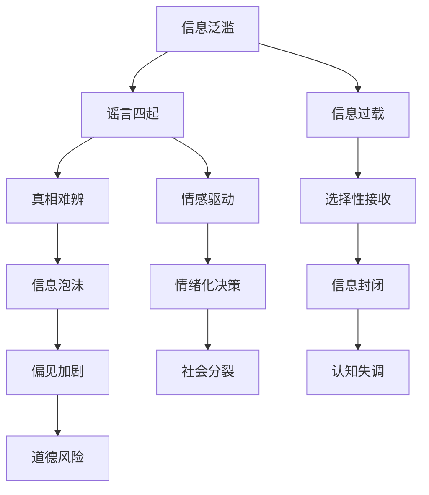

### 图2-1：社交媒体对信息传播的影响


### 图3-1：批判性思维流程图


### 图4-1：实证研究流程图


### 图5-1：人工智能在信息筛选中的应用场景


### 图6-1：信息素养模型


### 图7-1：实证研究设计框架

```mermaid
graph TB
    A[研究目标] --> B[研究问题]
    B --> C[研究假设]
    C --> D[研究设计]
    D --> E[数据收集]
    E --> F[数据分析]
    F --> G[结果解释]
```

### 图8-1：案例研究总结

```mermaid
graph TB
    A[案例一：反转新闻] --> B[验证过程]
    A --> C[结论]
    B --> D[启示]
    A --> E[案例二：虚假信息]
    E --> F[验证过程]
    E --> G[结论]
    E --> H[启示]
    A --> I[案例三：科学研究]
    I --> J[验证过程]
    I --> K[结论]
    I --> L[启示]
```

### 图9-1：个人责任矩阵

```mermaid
graph TB
    A[信息发布者] --> B[责任1]
    A --> C[责任2]
    A --> D[责任3]
    B --> E[确保信息来源可靠性]
    B --> F[避免夸大和误导]
    C --> G[进行自我审查]
    C --> H[遵守法律法规]
    D --> I[传播真实信息]
    D --> J[提高信息素养]
```

### 图10-1：信息治理生态系统

```mermaid
graph TB
    A[政府] --> B[立法和监管]
    A --> C[信息公开]
    A --> D[技术推动]
    B --> E[企业]
    B --> F[内容审核]
    B --> G[社会责任]
    C --> H[公众]
    C --> I[参与监督]
    C --> J[合作治理]
    D --> K[技术手段]
    D --> L[透明度提升]
```

### 图11-1：技术进步对真相追寻的影响

```mermaid
graph TB
    A[人工智能] --> B[虚假信息检测]
    A --> C[舆情分析]
    A --> D[自动化新闻]
    B --> E[隐私侵犯]
    B --> F[算法偏见]
    C --> G[信息过载]
    C --> H[决策依赖]
    D --> I[透明度需求]
    D --> J[责任归属]
```

### 图12-1：信任建设机制模型

```mermaid
graph TB
    A[透明度和信息公开] --> B[责任和问责制]
    A --> C[诚信和道德]
    A --> D[教育和社会化]
    B --> E[技术手段]
    C --> F[法律规范]
    D --> G[公众参与]
    D --> H[多元视角]
```

### 图1-2：后真相时代的信息流动

```mermaid
graph TB
    A[媒体角色变化] --> B[社交媒体崛起]
    A --> C[人际传播增强]
    B --> D[信息泛滥]
    B --> E[谣言扩散]
    C --> F[信息失真]
    C --> G[情感传播]
    D --> H[信息过载]
    D --> I[真相难辨]
    E --> J[认知失调]
    F --> K[社会分裂]
    G --> L[情绪化决策]
    H --> M[决策困难]
    I --> N[信任危机]
    J --> O[道德风险]
```

这些图表通过视觉化的方式，帮助读者更好地理解后真相时代的特征、社交媒体的影响、批判性思维的流程、实证研究的设计、人工智能的应用、信息素养的重要性以及信任机制的构建。

