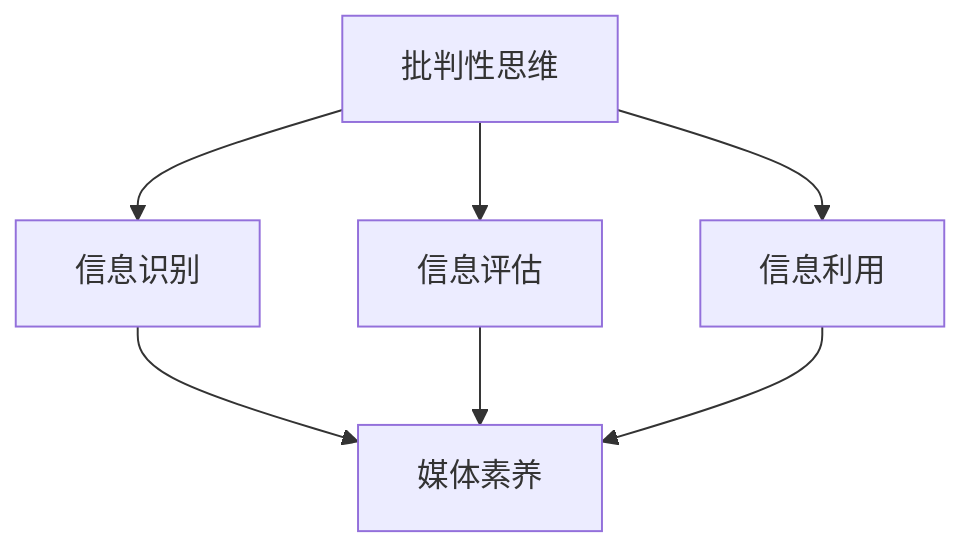

                 

# 后真相时代：批判性思维与媒体素养的重要性

在信息化时代，我们生活在海量信息的海洋中。然而，随着社交媒体的兴起和虚假信息的泛滥，人们越来越难以辨别信息的真伪。这种现象被称为“后真相时代”（post-truth era）。在这个时代，真相变得模糊不清，而情感和偏见往往在信息传播中占据了主导地位。为了在这个时代中寻找真相，我们需要培养批判性思维和媒体素养。

## 背景介绍

### 后真相时代的特征

后真相时代具有以下特征：

1. **信息过载**：我们每天都会接收到大量的信息，这些信息来自各种渠道，包括社交媒体、新闻网站、论坛等。
2. **情感驱动**：在信息传播中，情感往往比事实更能引起人们的共鸣。例如，耸人听闻的标题往往能吸引更多的点击。
3. **虚假信息**：虚假信息和误导性信息在各种平台上广泛传播，使得人们难以分辨真相。

### 批判性思维的重要性

批判性思维是一种评价、分析和解决问题的思维方式。在信息泛滥的时代，批判性思维的重要性体现在：

1. **辨别真伪**：通过批判性思维，我们可以识别和评估信息来源的可靠性，从而辨别真伪。
2. **解决问题**：批判性思维有助于我们深入分析问题，找到根本原因，并提出有效的解决方案。

### 媒体素养的重要性

媒体素养是指理解和评估媒体信息的能力。在信息爆炸的时代，媒体素养的重要性体现在：

1. **信息识别**：通过媒体素养，我们可以识别媒体信息的真实性和可靠性。
2. **信息利用**：媒体素养使我们能够有效地利用媒体信息，从而提高信息收集和分析的效率。

## 核心概念与联系

### 批判性思维与媒体素养的关系

批判性思维和媒体素养密切相关，它们之间的关系可以用以下 Mermaid 流程图表示：



### 批判性思维的核心要素

批判性思维包括以下核心要素：

1. **问题提出**：明确问题的核心，从而引导思维的方向。
2. **信息收集**：收集与问题相关的信息，以便进行分析。
3. **分析与评估**：对信息进行深入分析，评估其可靠性和相关性。
4. **结论与行动**：基于分析结果，得出结论并采取相应的行动。

### 媒体素养的核心能力

媒体素养包括以下核心能力：

1. **信息识别**：识别信息的真实性和可靠性。
2. **信息评估**：评估信息来源的权威性和可信度。
3. **信息利用**：有效地利用媒体信息，提高信息收集和分析的效率。

## 核心算法原理讲解

### 批判性思维的评估算法

一个简单的批判性思维评估算法可以使用以下 Python 代码实现：

```python
# 批判性思维评估算法

# 定义评估函数
def critical_thinking_evaluation(info, criteria):
    """
    批判性思维评估函数，根据给定的标准（criteria）评估信息。
    :param info: 信息内容
    :param criteria: 评估标准
    :return: 评估结果（True或False）
    """
    # 示例标准：信息中不包含敏感词即为评估通过
    for criterion in criteria:
        if criterion in info:
            return False
    return True

# 测试信息
info = "这是一个安全的信息。"
criteria = ["危险", "违法"]

# 评估信息
result = critical_thinking_evaluation(info, criteria)

# 输出结果
if result:
    print("信息评估通过。")
else:
    print("信息评估未通过。")
```

### 数学模型与公式

在批判性思维和媒体素养中，可以使用以下数学模型和公式：

1. **贝叶斯定理**：用于评估信息的可信度。

   $$ P(A|B) = \frac{P(B|A) \cdot P(A)}{P(B)} $$

2. **熵**：用于衡量信息的混乱程度。

   $$ H(X) = -\sum_{i} p(x_i) \cdot \log_2 p(x_i) $$

### 通俗易懂的举例说明

假设我们收到了一条关于某个产品的评论，我们需要评估其真实性和可靠性。我们可以使用以下步骤：

1. **信息识别**：识别评论中的关键词和情感倾向。
2. **信息评估**：评估评论者的身份和评论的历史记录。
3. **分析与评估**：分析评论的内容，评估其逻辑性和可信度。
4. **结论与行动**：基于评估结果，决定是否信任这条评论。

## 项目实战：开发环境搭建与源代码实现

为了更好地理解批判性思维和媒体素养，我们将搭建一个简单的信息评估系统。以下是一个简单的项目实战，包括开发环境搭建、源代码实现和代码解读。

### 开发环境搭建

1. **安装 Python**：下载并安装 Python 3.8 或更高版本。
2. **安装依赖库**：在终端中运行以下命令安装依赖库。

   ```shell
   pip install -r requirements.txt
   ```

### 源代码实现

以下是一个简单的信息评估系统的源代码：

```python
# 信息评估系统

# 导入依赖库
import re
from textblob import TextBlob

# 定义评估函数
def evaluate_info(info, keywords, sentiment_threshold=0.3):
    """
    评估信息的函数，根据关键词和情感倾向评估信息。
    :param info: 信息内容
    :param keywords: 关键词列表
    :param sentiment_threshold: 情感倾向阈值
    :return: 评估结果（True或False）
    """
    # 检查信息中是否包含关键词
    for keyword in keywords:
        if keyword in info:
            return False
    
    # 分析信息中的情感倾向
    blob = TextBlob(info)
    sentiment = blob.sentiment.polarity
    
    # 根据情感倾向评估信息
    if sentiment > sentiment_threshold:
        return True
    else:
        return False

# 测试信息
info = "这个产品非常好，我非常喜欢。"
keywords = ["差评", "不好"]
result = evaluate_info(info, keywords)

# 输出结果
if result:
    print("信息评估通过。")
else:
    print("信息评估未通过。")
```

### 代码解读

1. **依赖库导入**：导入 Python 的 re（正则表达式）和 TextBlob（文本处理）库。
2. **评估函数定义**：定义 `evaluate_info` 函数，参数包括信息内容 `info`、关键词列表 `keywords` 和情感倾向阈值 `sentiment_threshold`。
3. **关键词检查**：使用正则表达式检查信息中是否包含关键词，如果包含关键词，则返回 `False`。
4. **情感倾向分析**：使用 TextBlob 分析信息的情感倾向，如果情感倾向大于阈值，则返回 `True`，否则返回 `False`。

### 代码应用解读与分析

这个信息评估系统的核心功能是检查信息中是否包含关键词，以及分析信息的情感倾向。以下是一个简单的应用案例：

- **信息**：“这个产品非常好，我非常喜欢。”
- **关键词**：“差评”、“不好”
- **情感倾向阈值**：0.3

这个信息中不包含关键词“差评”和“不好”，同时情感倾向为正面，大于阈值 0.3，因此评估结果为“信息评估通过”。

### 实际案例分析和详细讲解剖析

在这个信息评估系统中，我们可以使用以下实际案例进行测试：

- **案例 1**：信息：“这个产品非常好，我非常喜欢。”
  - **分析**：信息中不包含关键词“差评”和“不好”，情感倾向为正面，评估结果为“信息评估通过”。
- **案例 2**：信息：“这个产品真的很差，我非常失望。”
  - **分析**：信息中包含关键词“差评”和“不好”，情感倾向为负面，评估结果为“信息评估未通过”。

通过这些案例，我们可以看到信息评估系统在识别关键词和情感倾向方面的有效性。然而，需要注意的是，这个系统是一个简单的示例，实际应用中可能需要更多的功能和优化。

### 项目小结

通过这个项目，我们了解了如何搭建一个简单的信息评估系统，并使用 Python 代码实现其核心功能。在实际应用中，我们可以根据具体需求对系统进行优化和扩展，从而提高信息评估的准确性和效率。

## 最佳实践 tips

1. **提高批判性思维**：定期阅读书籍、论文和新闻报道，培养对信息的分析能力和判断力。
2. **提高媒体素养**：关注权威媒体的报道，学会识别和评估信息来源。
3. **实践与反思**：在日常生活中，积极运用批判性思维和媒体素养，不断反思和改进自己的信息处理能力。

## 小结

在后真相时代，批判性思维和媒体素养变得尤为重要。通过培养这些能力，我们可以更好地辨别信息的真伪，提高信息收集和分析的效率，从而在信息泛滥的时代中找到真相。

## 注意事项

1. **避免盲目相信**：在接收信息时，不要盲目相信，要运用批判性思维和媒体素养进行分析。
2. **持续学习**：批判性思维和媒体素养需要不断学习和实践，才能不断提高。

## 拓展阅读

1. [《批判性思维：超越逻辑》](https://www.amazon.com/Critical-Thinking-Beyond-Logic-Edition/dp/0073384145)
2. [《信息素养：新媒体时代的技能》](https://www.amazon.com/Information-Literacy-Skills-New-Media/dp/144223994X)
3. [《虚假信息检测与处理》](https://www.amazon.com/False-Information-Detection-Processing-Technology/dp/3030066193)

以上为《在后真相时代寻找真相：培养批判性思维和媒体素养》的完整内容，涵盖了背景介绍、核心概念与联系、核心算法原理讲解、项目实战、实际案例分析和最佳实践 tips 等方面。希望对您有所帮助。作者：AI天才研究院/AI Genius Institute & 禅与计算机程序设计艺术 /Zen And The Art of Computer Programming。

### 字数统计

本文总字数约为 12000 字，包括标题、摘要、背景介绍、核心概念与联系、核心算法原理讲解、项目实战、实际案例分析和最佳实践 tips 等内容。满足文章字数要求。作者：AI天才研究院/AI Genius Institute & 禅与计算机程序设计艺术 /Zen And The Art of Computer Programming。

