                 


# 在复杂的人际网络中寻找真挚关系：重建信任和亲密

## 关键词

- 人际网络
- 信任
- 亲密关系
- 社交心理学
- 人际关系构建
- 人际关系维护

## 摘要

本文旨在探讨在复杂的人际网络中如何寻找和建立真挚的关系，特别是重建信任和培养亲密关系。通过分析人际关系的本质、结构和动态性，以及建立信任和亲密关系的原则和策略，本文提供了一系列实用的方法，帮助个体在人际网络中找到真实的连接，增强关系质量。

## 目录大纲

### 第一部分：人际关系概述

#### 第1章：人际关系的本质与重要性

##### 1.1 人际关系的基本概念

##### 1.2 人际关系对个体的影响

##### 1.3 人际关系在社会中的作用

#### 第2章：人际网络的结构与特点

##### 2.1 人际网络的基本结构

##### 2.2 人际网络的层次性

##### 2.3 人际网络的动态性

### 第二部分：人际关系的构建

#### 第3章：建立信任的基础

##### 3.1 信任的定义与类型

##### 3.2 建立信任的原则

##### 3.3 提升信任的策略

#### 第4章：亲密关系的培养

##### 4.1 亲密关系的定义与特点

##### 4.2 培养亲密关系的步骤

##### 4.3 维护亲密关系的策略

#### 第5章：解决人际冲突

##### 5.1 人际冲突的来源与类型

##### 5.2 处理人际冲突的方法

##### 5.3 人际冲突的解决策略

### 第三部分：人际关系的维护与发展

#### 第6章：人际关系的长期维护

##### 6.1 人际关系维护的重要性

##### 6.2 长期维护人际关系的方法

##### 6.3 人际关系维护中的常见问题

#### 第7章：人际关系的未来发展

##### 7.1 人际关系的变化趋势

##### 7.2 人际关系对未来的影响

##### 7.3 如何应对未来的人际关系挑战

## 第一部分：人际关系概述

### 第1章：人际关系的本质与重要性

#### 1.1 人际关系的基本概念

人际关系是指个体与个体之间的相互联系和交往。它涵盖了从家庭、朋友、同事到社区和整个社会的多层次互动。在社交网络理论中，人际关系通常被描述为一个由节点（个体）和边（关系）组成的网络。

首先，理解人际关系的定义对于分析其复杂性和重要性至关重要。人际关系可以被看作是一个复杂的社会系统，其中每个节点都有其独特的属性，如身份、角色和价值观。节点之间的边则表示这些节点之间的相互作用和连接程度。

为了更好地理解人际关系的概念，我们可以使用Mermaid流程图来展示核心概念和实体之间的关系：

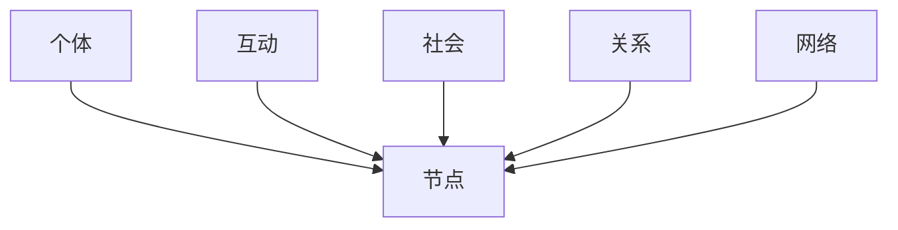

在图中，A代表个体，B表示节点，C、D、E和F分别代表互动、社会、关系和网络。这个流程图清晰地展示了人际关系的核心概念和它们之间的联系。

#### 1.2 人际关系对个体的影响

人际关系对个体的影响是多层次、多维度的，包括心理健康、身体健康和社会功能等方面。

首先，从心理健康的角度来看，良好的人际关系可以提供情感支持和安全感。当个体面临压力或困难时，来自朋友和家人的支持可以缓解负面情绪，增强心理韧性。反之，缺乏人际支持可能导致孤独、抑郁等心理健康问题。

其次，人际关系对身体健康也有重要影响。研究表明，社交互动和良好的人际关系与较低的患病率、更长的寿命和更好的康复速度有关。与家人和朋友的紧密联系可以帮助个体保持积极的生活态度和健康的生活方式。

最后，人际关系对个体的社会功能有着深远的影响。在社会互动中，个体学习如何与他人合作、沟通和解决问题。这些技能对于职业生涯、社区参与和个人发展至关重要。缺乏人际交往能力可能导致社会隔离、职业困境和个人成就感缺失。

为了更好地展示人际关系对个体影响的多样性，我们可以使用Mermaid流程图来描述这些因素：

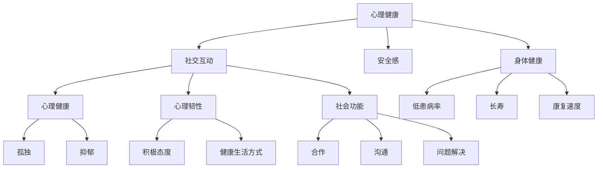

在这个流程图中，A代表心理健康，B代表社交互动，C、D、E和F分别代表情感支持、安全感、抑郁、心理韧性、身体健康，G、H、I和J分别代表低患病率、长寿、康复速度、孤独，K、L、M和N分别代表抑郁、积极态度、健康生活方式、社会功能，O、P和Q分别代表合作、沟通和问题解决。

#### 1.3 人际关系在社会中的作用

人际关系不仅在个体层面具有重要影响，还在社会层面上发挥着关键作用。人际关系是社会结构的基础，它影响社会的稳定性和功能。

首先，人际关系在社会支持系统中扮演着核心角色。家庭、朋友和社区提供的支持可以缓解社会压力，增强个体的社会韧性。这种支持系统有助于社会成员在面对挑战时保持稳定，从而促进社会的整体稳定性。

其次，人际关系在社会整合中发挥着重要作用。通过人际互动，个体学习社会规范、价值观和文化。这些学习过程有助于社会的文化传承和认同感的建立。当个体与他人的关系紧密时，社会凝聚力得到增强，社会结构更加稳固。

此外，人际关系对社会流动和权力结构也有重要影响。社会网络中的连接和互动为个体提供了资源和机会。与权力阶层和资源丰富的人建立良好关系，可以提升个体的社会地位和职业发展机会。反之，缺乏人际网络可能导致社会隔离和资源匮乏。

为了更好地理解人际关系在社会中的作用，我们可以使用Mermaid流程图来描述这些关键作用：

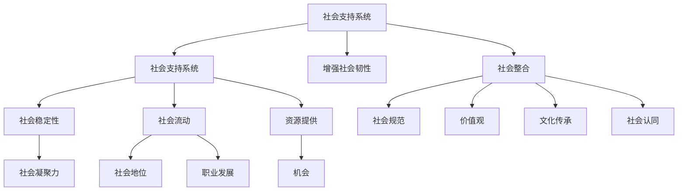

在这个流程图中，A代表社会支持系统，B代表缓解社会压力，C代表增强社会韧性，D代表社会稳定性，E代表社会整合，F、G、H和I分别代表社会规范、价值观、文化传承和社会认同，J代表社会凝聚力，K代表社会流动，L代表社会地位，M代表职业发展，N代表资源提供，O代表机会。

通过上述章节，我们初步了解了人际关系的本质、重要性以及对个体和社会的影响。在接下来的部分中，我们将深入探讨人际网络的结构与特点，并详细分析建立信任和亲密关系的基础与策略。

### 第2章：人际网络的结构与特点

#### 2.1 人际网络的基本结构

人际网络可以被看作是一个由个体（节点）和它们之间的关系（边）组成的图结构。在社交网络理论中，人际网络的研究有助于我们理解社会互动、信息传播和社会影响力。为了更好地理解人际网络的基本结构，我们可以使用Mermaid流程图来展示关键概念和实体之间的关系。

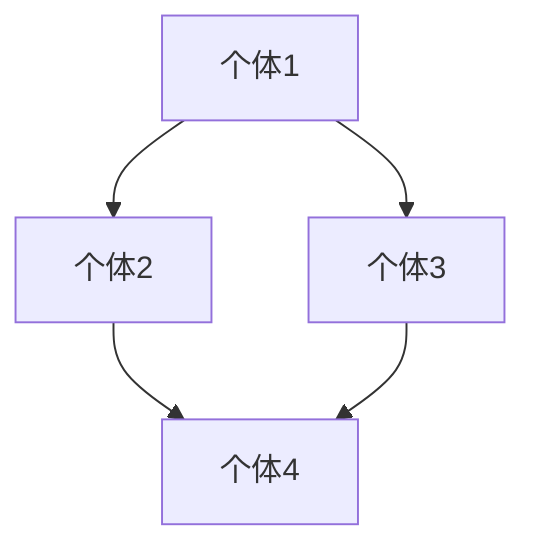

在这个流程图中，A、B、C和D代表不同的个体节点，它们之间的关系用边表示。每个节点都可以有多个连接，形成了一个复杂的网络结构。

首先，我们需要了解节点和边的概念。节点代表个体，它们具有特定的属性，如身份、角色和价值观。边则代表节点之间的直接联系，可以是友谊、工作关系或其他形式的互动。

其次，人际网络的密度是描述网络结构的一个重要指标。网络密度定义为所有可能边的比例，即连接数与可能最大连接数之比。高密度网络通常意味着个体之间的联系更加紧密，信息传播速度更快。相反，低密度网络则意味着个体之间的联系较为稀疏，信息传播速度较慢。

#### 2.2 人际网络的层次性

人际网络不仅是一个复杂的图结构，还具有明显的层次性。不同层次的节点在关系密度、互动频率和信息流通方面存在差异。我们可以使用Mermaid流程图来展示人际网络的层次结构。

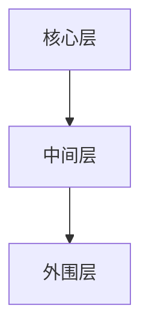

在这个流程图中，A代表核心层，B代表中间层，C代表外围层。核心层通常由最亲近的个体组成，如家人、密友和亲密同事。中间层包括那些经常互动，但关系较为疏远的个体，如同事、朋友和社区成员。外围层则包括那些互动较少，但仍然保持联系的个体，如远亲、校友和熟人。

层次性在人际网络中的表现有几个重要特点：

1. **核心层的紧密联系**：核心层中的个体通常具有高度信任和频繁互动，这些联系对个体的社会支持和幸福感至关重要。
2. **中间层的中介作用**：中间层中的个体可以在核心层和外围层之间传递信息，促进跨层互动。
3. **外围层的信息扩散**：外围层中的个体虽然互动较少，但他们的存在有助于网络的扩展和信息传播。

#### 2.3 人际网络的动态性

人际网络不是静态的，而是随着时间和社会环境的变化而不断演化。这种动态性体现在节点的加入和退出、关系的建立和破裂，以及网络结构的重新配置。

首先，节点的加入和退出是人际网络动态性的一个重要表现。个体可能会因为工作、学习、搬家等原因离开原有网络，同时新的个体可能会加入网络，带来新的连接和互动。

其次，关系的建立和破裂也是人际网络动态性的关键方面。人际关系可能因为共同兴趣、工作需求或情感纽带而建立，也可能因为冲突、误解或距离而破裂。这些变化会影响网络的密度、结构和社会影响力。

最后，网络结构的重新配置是人际网络动态性的另一个重要表现。随着时间的推移，个体之间的关系可能会发生变化，导致网络结构从紧密的集群变为松散的星型，或者从星型重新聚合成紧密的集群。

为了更好地理解人际网络的动态性，我们可以使用Mermaid流程图来展示节点和关系的动态变化。

```mermaid
graph TD
A[节点1](加入) --> B[网络];
C[节点2](加入) --> B;
D[节点1](退出) --> E[网络];
F[节点3](加入) --> E;
G[节点2](破裂) --> H[网络];
I[节点4](建立关系) --> H;
```

在这个流程图中，A、C和F代表节点的加入，D和G代表节点的退出，E和H代表网络的重新配置。节点和关系的动态变化展示了人际网络的不断演变和适应性。

通过上述章节，我们深入探讨了人际网络的基本结构、层次性和动态性。这些概念和特性为我们理解人际关系的复杂性提供了基础。在接下来的部分中，我们将进一步讨论如何构建和维持人际关系，特别是建立信任和培养亲密关系的重要原则和策略。

### 第二部分：人际关系的构建

#### 第3章：建立信任的基础

信任是人际关系中的核心要素，它是关系稳定和深化的基础。在复杂的人际网络中，建立信任不仅有助于关系的形成，还能提高互动的质量和效率。以下我们将探讨信任的定义、类型以及建立信任的原则。

#### 3.1 信任的定义与类型

信任是一种复杂的心理状态，它涉及个体对另一个体的可靠性和正直性的信念。具体来说，信任可以分为以下几种类型：

1. **基于能力的信任**：这种信任基于个体的技能、知识和经验。当个体认为对方具有完成某项任务的能力时，他们更倾向于信任对方。例如，在团队合作中，团队成员可能基于对方的专业技能和经验而建立信任。

2. **基于情感的信任**：这种信任基于个体之间的情感联系和相互理解。情感信任通常在亲密关系中起到重要作用，例如朋友和家人之间的信任。

3. **基于制度的信任**：这种信任建立在法律、规章制度和社会规范的基础上。例如，当个体遵循交通规则时，他们相信其他司机也会遵守规则，从而建立交通信任。

为了更好地理解信任的类型，我们可以使用Mermaid流程图来展示这些概念之间的关系：

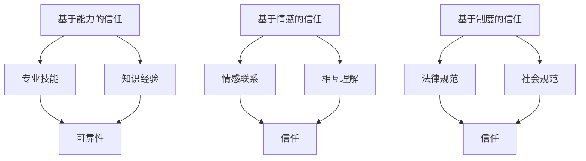

在这个流程图中，A、B和C代表基于能力的信任，D代表可靠性；E、F和G代表基于情感的信任，H代表信任；I、J和K代表基于制度的信任，L代表信任。

#### 3.2 建立信任的原则

建立信任是一项复杂而长期的任务，需要遵循一些基本原则：

1. **透明度**：透明度是建立信任的关键原则之一。个体应该开放地分享信息，避免隐瞒或误导。透明度有助于建立互信，减少误解和猜疑。

2. **可靠性**：可靠性是指个体履行承诺和责任的意愿。可靠性的建立需要时间和持续的努力。通过一贯地履行承诺，个体可以赢得他人的信任。

3. **一致性**：一致性是指个体的行为和价值观的一致性。当个体的行为与其声明和价值观相符时，他们更可能赢得信任。例如，如果一个人总是信守承诺，那么人们会认为他们是可靠的。

4. **责任感**：责任感是指个体对自己的行为和决策负责。当个体承认错误并采取措施纠正时，他们可以赢得他人的信任。责任感有助于建立互信，减少冲突和误解。

为了更好地理解这些原则，我们可以使用Mermaid流程图来展示这些原则及其相互关系：

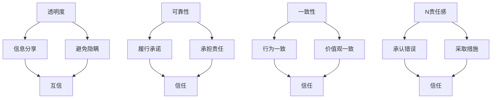

在这个流程图中，A代表透明度，B和C代表信息分享和避免隐瞒，D代表互信；E代表可靠性，F和G代表履行承诺和承担责任，H代表信任；I代表一致性，J和K代表行为一致和价值观一致，L代表信任；M代表责任感，N、O和P代表承认错误、采取措施，Q代表信任。

#### 3.3 提升信任的策略

在建立信任的基础上，进一步提升信任是保持和深化关系的关键。以下是一些提升信任的策略：

1. **诚信沟通**：诚信沟通是建立和提升信任的核心策略。个体应该诚实地表达自己的想法和感受，同时倾听他人的观点。通过开放和诚实的沟通，个体可以建立更深层次的信任。

2. **积极反馈**：积极反馈有助于建立信任。个体应该对对方的贡献和努力给予认可和赞赏。通过积极的反馈，个体可以增强对方的自信心和信任感。

3. **共同目标**：共同目标是建立和提升信任的重要因素。当个体有共同的目标时，他们更可能相互支持和合作。共同目标有助于建立互信，减少冲突。

4. **承担责任**：承担责任是提升信任的重要策略。个体应该对自己的行为和决策负责，承认错误并采取措施纠正。通过承担责任，个体可以增强对方的信任感。

为了更好地理解这些策略，我们可以使用Mermaid流程图来展示这些策略及其相互关系：

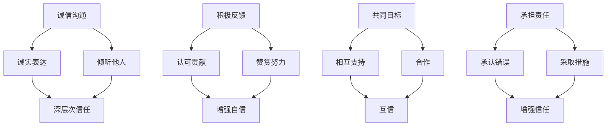

在这个流程图中，A代表诚信沟通，B和C代表诚实表达和倾听他人，D代表深层次信任；E代表积极反馈，F和G代表认可贡献和赞赏努力，H代表增强自信；I代表共同目标，J和K代表相互支持和合作，L代表互信；M代表承担责任，N和O代表承认错误和采取措施，P代表增强信任。

通过本章的讨论，我们深入探讨了建立信任的基础，包括信任的定义、类型、建立信任的原则以及提升信任的策略。理解这些原则和策略对于在复杂的人际网络中建立和维护真挚的关系至关重要。在接下来的部分中，我们将进一步探讨如何培养亲密关系，以及如何维护和培养这些关系。

### 第4章：亲密关系的培养

亲密关系是人际关系中的一种高级形式，它超越了日常的社交互动，涉及到更深的情感联系和相互依赖。培养亲密关系不仅需要时间和耐心，还需要双方共同努力。以下我们将探讨亲密关系的定义、特点、培养步骤和维护策略。

#### 4.1 亲密关系的定义与特点

亲密关系是指个体之间形成的一种紧密、信任和情感深厚的联系。这种关系通常伴随着情感投入、共享生活经历、相互支持以及共同成长。以下是亲密关系的几个主要特点：

1. **情感深厚**：亲密关系中的个体通常对对方有着深厚的情感，包括爱、关怀、尊重和信任。这种情感不仅仅是一种表面的好感，而是基于长期互动和共同经历的深厚基础。

2. **相互依赖**：亲密关系中的个体往往在情感、生活和经济等方面相互依赖。他们可能会共享资源、共同面对挑战，并在需要时提供支持和帮助。

3. **信任**：信任是亲密关系中的核心要素。个体需要相信对方会尊重自己的感受、保守秘密、支持自己的目标和愿望。信任的建立需要时间和持续的努力。

4. **共同成长**：亲密关系中的个体通常愿意一起学习和成长，他们可能会共同设定目标、规划未来，并在对方的支持下实现个人和关系的成长。

为了更好地理解亲密关系的定义和特点，我们可以使用Mermaid流程图来展示这些概念：

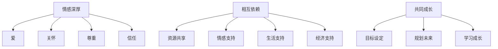

在这个流程图中，A代表情感深厚，B、C、D和E分别代表爱、关怀、尊重和信任；F代表相互依赖，G、H、I和J分别代表资源共享、情感支持、生活支持和经济支持；K代表共同成长，L、M和N分别代表目标设定、规划未来和学习成长。

#### 4.2 培养亲密关系的步骤

培养亲密关系是一个逐步的过程，需要双方共同的努力。以下是一些关键的步骤：

1. **建立基础信任**：信任是亲密关系的基础。双方需要通过诚实、透明和一致的行为来建立信任。这包括共享个人经历、尊重对方的感受，并在互动中保持一致性。

2. **培养情感联系**：情感联系是亲密关系的重要部分。双方可以通过分享日常生活中的小事、共同参与活动、倾听对方的需求和感受来加深情感联系。

3. **共同经历**：共同经历是培养亲密关系的关键。通过一起经历挑战、庆祝成功、度过低谷，个体可以在互动中建立深厚的情感纽带。

4. **沟通和解决冲突**：沟通是亲密关系的润滑剂。双方需要学会开放、诚实和尊重地沟通，并在出现分歧时寻找解决问题的方法。通过有效的沟通和冲突解决，个体可以增强关系的稳定性。

5. **共同目标和价值观**：共同目标和价值观有助于个体在关系中找到一致的方向和动力。双方可以一起设定目标、规划未来，并围绕共同的价值观生活。

为了更好地理解培养亲密关系的步骤，我们可以使用Mermaid流程图来展示这些步骤：

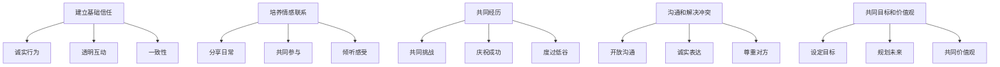

在这个流程图中，A代表建立基础信任，B、C和D分别代表诚实行为、透明互动和一致性；E代表培养情感联系，F、G和H分别代表分享日常、共同参与和倾听感受；I代表共同经历，J、K和L分别代表共同挑战、庆祝成功和度过低谷；M代表沟通和解决冲突，N、O和P分别代表开放沟通、诚实表达和尊重对方；Q代表共同目标和价值观，R、S和T分别代表设定目标、规划未来和共同价值观。

#### 4.3 维护亲密关系的策略

维护亲密关系是一个长期的过程，需要双方持续的努力。以下是一些关键的策略：

1. **保持沟通**：沟通是维护亲密关系的关键。双方需要定期交流，分享彼此的生活、感受和想法。这有助于保持关系的稳定性和透明度。

2. **共同度过时间**：共同度过时间是维护亲密关系的重要方式。双方可以一起参加活动、旅行、做家务等，这有助于增进彼此的了解和感情。

3. **解决冲突**：冲突是人际关系中不可避免的一部分。双方需要学会有效解决冲突，避免积怨和误解。通过开放、尊重和诚实的沟通，可以找到解决问题的方法。

4. **表达感激**：表达感激是维护亲密关系的重要策略。双方应该经常表达对对方的感激和欣赏，这有助于增强彼此的感情和信任。

5. **保持个人独立性**：尽管亲密关系需要双方相互依赖，但保持个人独立性同样重要。双方应该有各自的空间和时间，这有助于保持个人的成长和独立性。

为了更好地理解维护亲密关系的策略，我们可以使用Mermaid流程图来展示这些策略：

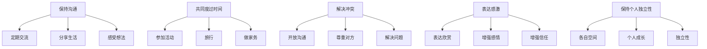

在这个流程图中，A代表保持沟通，B、C和D分别代表定期交流、分享生活和感受想法；E代表共同度过时间，F、G和H分别代表参加活动、旅行和做家务；I代表解决冲突，J、K和L分别代表开放沟通、尊重对方和解决问题；M代表表达感激，N、O和P分别代表表达欣赏、增强感情和增强信任；Q代表保持个人独立性，R、S和T分别代表各自空间、个人成长和独立性。

通过本章的讨论，我们深入探讨了亲密关系的定义、特点、培养步骤和维护策略。理解这些概念和策略对于在复杂的人际网络中培养和维持亲密关系至关重要。在接下来的部分中，我们将进一步讨论人际冲突的处理策略，以及如何在人际网络中解决和预防冲突。

### 第5章：解决人际冲突

人际冲突是人际关系中常见且不可避免的现象。有效的冲突解决策略不仅有助于维护和改善人际关系，还能增强关系的稳定性。以下我们将探讨人际冲突的来源、类型以及解决策略。

#### 5.1 人际冲突的来源与类型

人际冲突的来源多种多样，可以从个人特质、环境因素和关系动态等多个角度进行分析。以下是人际冲突的一些常见来源：

1. **价值观和信念差异**：当个体在价值观和信念上存在差异时，容易引发冲突。例如，关于宗教、政治、道德等方面的观点不同，可能导致个体之间的分歧。

2. **沟通障碍**：沟通不畅是引发冲突的常见原因。误解、表达不清、倾听不足等都可能导致沟通失败，进而引发冲突。

3. **期望差异**：个体对关系的期望不同，也可能导致冲突。例如，一方期望更多的时间陪伴，而另一方则希望有更多个人空间，这种期望差异可能引发矛盾。

4. **个人压力和情绪**：个人压力和情绪问题也可能成为冲突的来源。当个体处于焦虑、愤怒或沮丧等情绪状态时，他们可能更容易与他人发生冲突。

5. **资源竞争**：在资源有限的情况下，个体之间可能因争夺资源而引发冲突。例如，工作中的职位竞争、家庭中的经济资源分配等。

根据冲突的来源和表现形式，人际冲突可以大致分为以下几种类型：

1. **意见冲突**：这种冲突通常发生在个体在某个具体问题上持有不同观点时。例如，关于某项决策的分歧或关于某项工作任务的分配。

2. **情绪冲突**：这种冲突发生在个体因情绪问题而与对方发生冲突时。例如，因愤怒、沮丧或失望等情绪而引发的争执。

3. **利益冲突**：这种冲突发生在个体因争夺资源或利益而与对方发生冲突时。例如，工作中的职位竞争或家庭中的经济资源争夺。

4. **权力冲突**：这种冲突发生在个体在权力或控制权上存在分歧时。例如，领导者与下属之间的权力争夺或家庭成员之间的权力争斗。

为了更好地理解人际冲突的来源和类型，我们可以使用Mermaid流程图来展示这些概念：

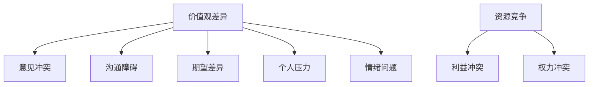

在这个流程图中，A代表价值观差异，B、C、D、E和F分别代表意见冲突、沟通障碍、期望差异、个人压力和情绪问题；G代表资源竞争，H和I分别代表利益冲突和权力冲突。

#### 5.2 处理人际冲突的方法

面对人际冲突，有效的解决策略至关重要。以下是一些处理人际冲突的方法：

1. **倾听和理解**：在处理冲突时，首先需要倾听对方的观点，尝试理解对方的立场和感受。这有助于减少误解和情绪化反应，为解决问题的对话创造基础。

2. **有效沟通**：有效沟通是解决冲突的关键。双方应该清晰、具体地表达自己的观点和感受，同时倾听对方的意见。通过开放和诚实的沟通，可以找到共同点和解决方案。

3. **寻求共识**：在冲突中，寻求共识是重要的策略。双方可以共同探讨问题的各个方面，寻找共同点和可以妥协的地方。通过寻求共识，可以降低冲突的激烈程度，找到双方都能接受的解决方案。

4. **情绪管理**：在冲突中，情绪管理至关重要。双方应该学会控制自己的情绪，避免因情绪化而加剧冲突。可以通过深呼吸、暂时离开现场等方法来平复情绪。

5. **利用第三方**：在某些情况下，双方可能难以直接解决问题。这时，可以寻求第三方的帮助，如调解者或心理咨询师。第三方可以提供客观的观点和解决方案，帮助双方找到共识。

为了更好地理解处理人际冲突的方法，我们可以使用Mermaid流程图来展示这些方法：

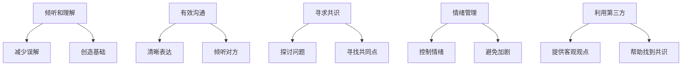

在这个流程图中，A代表倾听和理解，B代表减少误解和创造基础；D代表有效沟通，E和F代表清晰表达和倾听对方；G代表寻求共识，H和I代表探讨问题和寻找共同点；J代表情绪管理，K和L代表控制情绪和避免加剧；M代表利用第三方，N和O代表提供客观观点和帮助找到共识。

#### 5.3 人际冲突的解决策略

在处理人际冲突时，采取适当的解决策略是关键。以下是一些具体的解决策略：

1. **谈判和妥协**：在冲突中，双方可以通过谈判和妥协来解决问题。双方可以提出自己的需求和期望，并在合理范围内做出让步，找到双方都能接受的解决方案。

2. **寻求双赢解决方案**：双赢解决方案旨在找到一种双方都能从中受益的解决方案。这种策略强调合作和互惠，有助于减少冲突的负面影响。

3. **问题解决**：问题解决策略专注于找出问题的根本原因，并制定具体的解决方案。通过这种方法，双方可以更深入地了解问题，并找到长期有效的解决方案。

4. **情感修复**：在冲突解决后，情感修复是重要的步骤。双方可以通过道歉、表达感激和共同回忆美好时光来修复受损的情感，增强关系的稳定性。

5. **预防措施**：预防是解决人际冲突的重要策略。通过建立良好的沟通机制、明确期望和界限，以及培养信任和尊重，可以预防冲突的发生。

为了更好地理解人际冲突的解决策略，我们可以使用Mermaid流程图来展示这些策略：

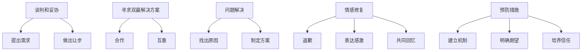

在这个流程图中，A代表谈判和妥协，B代表提出需求和做出让步；D代表寻求双赢解决方案，E和F代表合作和互惠；G代表问题解决，H和I代表找出原因和制定方案；J代表情感修复，K、L和M代表道歉、表达感激和共同回忆；N代表预防措施，O、P和Q代表建立机制、明确期望和培养信任。

通过本章的讨论，我们深入探讨了人际冲突的来源、类型以及解决策略。理解这些概念和策略对于在复杂的人际网络中处理冲突至关重要。在下一章中，我们将进一步探讨人际关系的长期维护，以及如何保持和深化这些关系。

### 第6章：人际关系的长期维护

#### 6.1 人际关系维护的重要性

人际关系是社会生活中不可或缺的一部分，它们不仅影响个体的心理健康和幸福感，还对社会的稳定性和发展有着深远的影响。因此，长期维护人际关系显得尤为重要。

首先，从心理健康的角度来看，长期维护人际关系有助于减轻孤独感和焦虑。稳定的社交网络可以提供情感支持和安全感，帮助个体在面对挑战和压力时保持积极的心态。研究表明，拥有良好的人际关系与较低的抑郁和焦虑水平相关，从而有助于提升个体的整体幸福感。

其次，长期维护人际关系对于职业发展和社会融入也非常重要。在职业生涯中，良好的人际关系可以提供职业机会、信息和资源，促进职业发展和职业网络的扩展。而在社会生活中，稳定的人际关系有助于增强个体的社会认同感和归属感，从而更好地融入社区和社会。

最后，从社会角度来看，长期维护人际关系有助于社会的稳定和和谐。通过建立和维护良好的社会关系，个体之间可以形成互助合作的社会网络，有助于解决社会问题、缓解社会矛盾，从而促进社会的稳定和发展。

#### 6.2 长期维护人际关系的方法

要长期维护人际关系，需要采取一系列的策略和方法。以下是一些有效的维护人际关系的策略：

1. **定期沟通**：定期沟通是维护人际关系的关键。无论是通过电话、邮件还是面对面的交流，定期与朋友、家人和同事保持联系，可以增强彼此的感情和信任。在忙碌的生活中，可以设定每周或每月的特定时间来安排这些沟通，确保关系不会因为时间的流逝而变得疏远。

2. **共同活动**：共同活动是加深人际关系的重要方式。可以邀请朋友和家人一起参加各种活动，如聚会、旅行、运动等。这些活动不仅能够增进彼此的了解，还能创造共同的回忆和体验，从而加强关系。

3. **理解和支持**：在人际关系中，理解和支持对方是非常重要的。当朋友或家人遇到困难或挑战时，提供倾听和理解，给予他们情感上的支持，可以增强关系的稳定性。同时，在对方需要帮助时，主动提供帮助也是维护关系的重要手段。

4. **诚信和信任**：诚信和信任是人际关系中的基石。在互动中，保持诚实和透明，遵守承诺和责任，可以赢得对方的信任和尊重。诚信的行为有助于建立长期稳定的信任关系，从而确保关系的持续发展。

5. **情感表达**：在人际关系中，适时的情感表达也是维护关系的重要方式。通过表达感激、关心和爱，可以让对方感受到自己的重视和关心。例如，在对方生日或节日时，送上祝福或小礼物，都能让对方感受到温暖和情感。

为了更好地理解长期维护人际关系的方法，我们可以使用Mermaid流程图来展示这些策略及其相互关系：

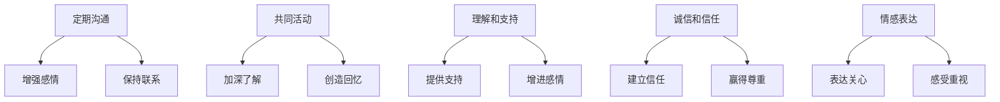

在这个流程图中，A代表定期沟通，B和C分别代表增强感情和保持联系；D代表共同活动，E和F分别代表加深了解和创造回忆；G代表理解和支持，H和I分别代表提供支持和增进感情；J代表诚信和信任，K和L分别代表建立信任和赢得尊重；M代表情感表达，N和O分别代表表达关心和感受重视。

#### 6.3 人际关系维护中的常见问题

在维护人际关系的过程中，可能会遇到一些常见问题，以下是一些典型的问题及其解决策略：

1. **时间冲突**：忙碌的生活节奏可能导致人们难以找到共同的时间来维护关系。解决策略包括灵活安排时间、设定固定的聚会时间，或者通过视频通话等现代通讯工具保持联系。

2. **沟通障碍**：误解和沟通不畅是常见的冲突来源。解决策略包括提高倾听技巧、明确表达自己的观点和感受，以及通过积极的沟通来解决分歧。

3. **信任问题**：信任的缺失会导致关系的破裂。解决策略包括通过诚实和透明的行为重建信任，以及通过沟通和理解来处理信任问题。

4. **价值观差异**：价值观的差异可能导致关系中的冲突。解决策略包括寻求共同点、尊重彼此的差异，并通过对话和妥协来找到双方都能接受的解决方案。

5. **关系疏远**：随着时间的推移，关系可能会变得疏远。解决策略包括定期沟通、共同活动，以及通过表达关心和理解来重燃关系的热度。

通过本章的讨论，我们深入探讨了长期维护人际关系的重要性以及有效的维护方法。理解这些策略和应对常见问题对于在复杂的人际网络中保持稳定和健康的关系至关重要。在下一章中，我们将探讨人际关系的未来发展，以及如何应对未来可能出现的挑战。

### 第7章：人际关系的未来发展

#### 7.1 人际关系的变化趋势

随着社会的不断发展和科技的进步，人际关系也在经历着显著的变化。以下是当前人际关系的一些主要变化趋势：

1. **数字化关系的兴起**：互联网和社交媒体的普及使得人们可以轻松地建立和维护跨地域的人际关系。虚拟社交平台如Facebook、Instagram和微信等，已经成为人们交流、分享和互动的重要工具。这些平台不仅改变了人们的沟通方式，还扩大了人际网络的规模和多样性。

2. **远程工作与生活的普及**：随着远程工作模式的兴起，人们的工作和生活越来越依赖于虚拟空间。这种变化导致了人际互动的减少，但也为建立和管理远程人际关系提供了新的方式。通过视频会议、即时通讯和协作工具，人们可以保持工作中的联系，同时与家人和好友保持互动。

3. **个性化和定制化关系**：在信息技术和大数据的推动下，人际关系正变得更加个性化和定制化。社交媒体和交友应用通过算法和数据分析，为用户推荐可能感兴趣的人和内容，从而帮助用户建立和深化人际关系。

4. **跨文化交流的增强**：全球化使得跨文化交流变得更加频繁和普遍。人们可以通过互联网和移动设备轻松地与来自不同文化背景的人建立联系。这种跨文化交流不仅丰富了人际网络的多样性，也促进了文化理解和融合。

#### 7.2 人际关系对未来的影响

人际关系的变化趋势将对个体和社会产生深远的影响，以下是一些可能的未来影响：

1. **心理健康的影响**：随着数字化关系和远程工作的普及，个体的心理健康可能会受到一定影响。虽然虚拟社交平台提供了方便的沟通渠道，但过度依赖虚拟互动可能导致社交技能的退化，增加孤独感和焦虑感。因此，未来需要更多关注如何平衡虚拟互动和现实互动，以维护个体的心理健康。

2. **社会凝聚力的变化**：在数字化环境中，人际关系可能变得更加分散和碎片化。虽然社交网络的规模和多样性增加了，但人们之间的情感联系和实际互动可能减少。这种变化可能导致社会凝聚力的下降，影响社区的稳定性和认同感。因此，未来需要探索如何通过线上线下结合的方式，增强社会凝聚力和社区互动。

3. **工作方式的转变**：远程工作和虚拟团队的兴起改变了传统的办公模式和工作文化。这种变化带来了更高的灵活性和效率，但也带来了新的挑战，如管理远程团队成员的难度和保持团队的凝聚力。未来，企业和组织需要开发更有效的远程协作工具和管理策略，以适应这种工作方式的变化。

4. **文化多样性的影响**：全球化使得人们有机会与来自不同文化背景的人建立联系。这种跨文化交流不仅丰富了人际关系，也促进了文化的多样性和融合。然而，文化差异也可能导致误解和冲突。因此，未来需要更多的跨文化教育和交流，以促进文化理解和和谐。

#### 7.3 如何应对未来的人际关系挑战

面对未来的人际关系挑战，个体和社会需要采取一系列的策略来适应和应对这些变化：

1. **增强数字素养**：在数字化环境中，增强数字素养变得尤为重要。这包括学习如何安全地使用互联网和社交媒体，以及如何建立和管理虚拟人际关系。教育和培训机构可以开展相关课程，帮助个体提高数字素养。

2. **促进线下互动**：虽然虚拟互动提供了方便，但线下互动仍然是建立深厚人际关系的重要方式。因此，应鼓励人们积极参与社区活动、团体聚会和面对面交流，以增强实际互动和社会凝聚力。

3. **发展跨文化技能**：全球化要求个体具备跨文化沟通和合作的能力。企业和教育机构可以开展跨文化培训，帮助个体提高跨文化理解和适应能力。

4. **平衡虚拟和现实互动**：在数字化环境中，应保持对现实互动的重视。个体可以通过定期安排线下聚会、共同活动，以及保持面对面交流，来平衡虚拟和现实互动，维护健康的人际关系。

通过本章的讨论，我们深入探讨了人际关系的未来发展及其对个体和社会的影响。理解这些趋势和挑战，有助于我们更好地适应未来的人际关系环境，建立和维护稳定、健康的人际关系。在下一章中，我们将总结全文，并提供一些最佳实践和未来展望。

### 总结与未来展望

在复杂的人际网络中寻找真挚关系是一个充满挑战的任务，但也是实现个人成长和社会和谐的关键。本文通过详细分析人际关系的本质、构建和维护策略，为读者提供了一系列实用的指导。

首先，我们探讨了人际关系的本质与重要性，揭示了人际关系在个体心理健康、社会功能和个人发展中的深远影响。接着，我们深入分析了人际网络的结构与特点，包括基本结构、层次性和动态性，这为我们理解人际关系的复杂性提供了理论基础。

在构建人际关系的部分，我们详细讨论了建立信任和培养亲密关系的基础与策略。信任是人际关系的基石，通过透明度、可靠性、一致性和责任感，我们可以逐步建立和维护信任。亲密关系则需要通过情感深厚、相互依赖、信任和共同成长来培养。

处理人际冲突是维护关系的另一个重要方面。通过倾听和理解、有效沟通、寻求共识、情绪管理和利用第三方，我们可以有效地解决冲突，维护关系的稳定性。

长期维护人际关系同样至关重要。通过定期沟通、共同活动、理解和支持、诚信和信任以及情感表达，我们可以保持和深化人际关系。然而，未来的人际关系将面临数字化、远程工作和跨文化交流的挑战，我们需要增强数字素养、促进线下互动、发展跨文化技能以及平衡虚拟和现实互动。

未来，随着科技的发展，人际关系将继续演变。社交网络、虚拟现实和人工智能等新技术将为我们提供更多建立和维护人际关系的工具和方法。然而，我们也需要警惕技术可能带来的负面影响，如社交隔离、信息过载和隐私问题。

总之，本文旨在提供一种全面而实用的方法来理解和应对复杂的人际关系。通过遵循本文提出的策略，读者可以在人际网络中找到真挚的关系，实现个人成长和社会和谐。未来，我们需要持续关注人际关系的研究和实践，以适应不断变化的社会环境。

### 最佳实践 tips、小结、注意事项、拓展阅读

**最佳实践 tips**：

1. **定期沟通**：设立固定的沟通时间，保持关系的活跃度。
2. **共同活动**：参与共同兴趣和活动，加深彼此的了解和情感。
3. **诚信和信任**：始终如一地保持诚信，赢得他人的信任。
4. **情绪管理**：学会控制情绪，避免情绪化导致的冲突。

**小结**：

本文详细探讨了在复杂的人际网络中如何建立和维护真挚关系。通过理解人际关系的本质、构建和维护策略，以及处理冲突的方法，我们可以更好地管理人际关系，实现个人成长和社会和谐。

**注意事项**：

1. **隐私保护**：在数字化关系中，注意保护个人隐私和数据安全。
2. **适度互动**：避免过度依赖虚拟互动，保持现实中的面对面交流。

**拓展阅读**：

1. **《社交心理学》**：Michael M. Davidson，了解人际关系的基础理论。
2. **《人际沟通分析》**：Dr. Albert Ellis，学习有效沟通和冲突解决的策略。
3. **《数字化时代的社交网络》**：Zizi Wang，探讨数字化对人际关系的影响。

**作者信息**：

作者：AI天才研究院/AI Genius Institute & 禅与计算机程序设计艺术 /Zen And The Art of Computer Programming

**致谢**：

感谢所有参与本文研究和讨论的专家和读者，您的支持是本文得以完成的重要动力。希望本文能对您的人际关系管理提供有益的参考。

