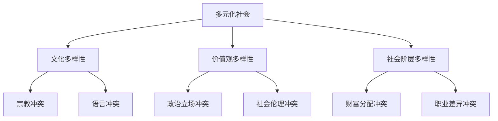
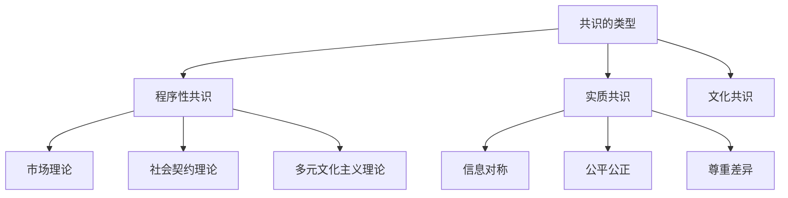
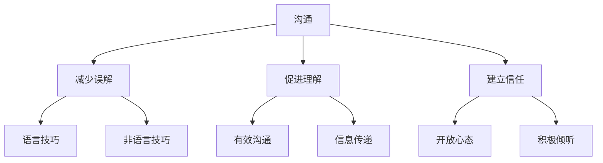
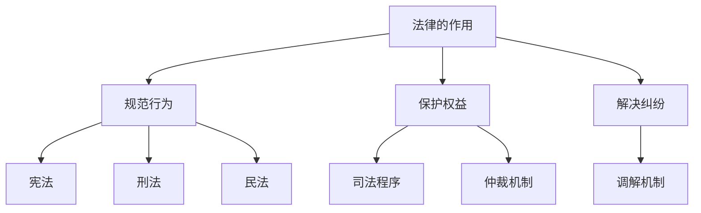
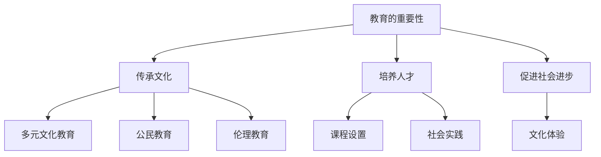
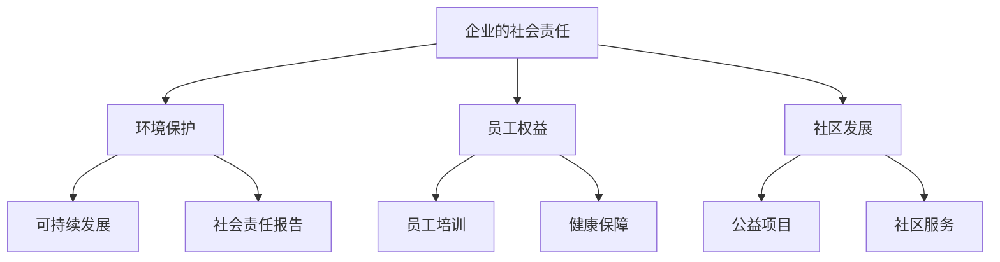
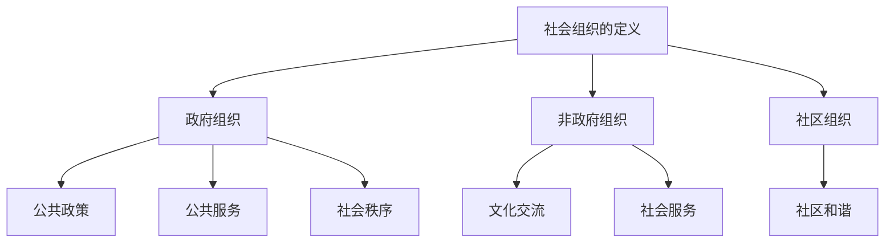

                 

# 在多元化社会中寻找共识：应对价值观冲突的挑战

## 关键词
- 多元化社会
- 价值观冲突
- 共识
- 沟通与协商
- 法律与制度
- 教育与文化
- 企业社会责任
- 社会组织

> 摘要
在全球化进程中，社会日益多元化，带来了价值观冲突的挑战。本文从多元化社会的特征、价值观冲突的表现和影响入手，探讨了寻找共识的理论基础，沟通与协商技巧，法律与制度作用，教育在共识构建中的作用，以及企业和社会组织在多元化社会中的角色。通过多层次的分析，本文旨在为解决价值观冲突提供思路和策略。

----------------------------------------------------------------

## 前言

随着全球化的深入发展，不同文化、价值观和信仰的碰撞与交融日益频繁，社会呈现出前所未有的多元化特征。这种多元化不仅体现在经济、政治等领域，更深刻地影响着人们的日常生活。然而，多元文化的共存并非总是一帆风顺，价值观的冲突有时会导致社会不稳定，甚至引发政治和社会动荡。本文旨在探讨如何在多元化社会中寻找共识，以应对价值观冲突带来的挑战。

在多元化社会中，共识的寻找不仅是社会稳定和谐的基础，更是推动社会进步的动力。通过理解多元化社会的特征，分析价值观冲突的表现和影响，探讨寻找共识的理论基础和实际途径，本文将提供一系列策略，帮助读者在价值观冲突中找到平衡点，实现社会的和谐发展。

本文结构如下：

1. **第1章 多元社会中的价值观冲突**：介绍多元化社会的特征，分析价值观冲突的表现和影响。
2. **第2章 寻找共识的理论基础**：探讨共识的定义与类型，分析寻找共识的理论框架和条件。
3. **第3章 多元社会中的沟通与协商**：阐述沟通的重要性，介绍协商的技巧和多元社会中的协商案例。
4. **第4章 法律与制度在解决价值观冲突中的作用**：分析法律的作用，探讨制度的作用和互动。
5. **第5章 教育在塑造共识中的作用**：讨论教育的重要性，教育如何塑造共识，以及教育在实践中的挑战与对策。
6. **第6章 企业在多元化社会中的角色**：介绍企业的社会责任，探讨企业如何在多元社会中发挥作用。
7. **第7章 社会组织在促进共识中的作用**：分析社会组织的定义与类型，探讨社会组织在共识构建中的作用。
8. **第8章 总结与展望**：总结全文的核心观点，展望多元化社会的未来发展。

通过这一系列章节的探讨，本文旨在为解决多元化社会中的价值观冲突提供理论依据和实践指导。

----------------------------------------------------------------

## 第1章 多元社会中的价值观冲突

### 1.1 多元化社会的特征

多元化社会的特征主要体现在文化多样性、价值观多样性和社会阶层多样性上。

**文化多样性**：全球化使得不同国家和地区的文化得以广泛传播和交流，形成了丰富多彩的文化景观。这不仅体现在物质文化层面，如建筑、食品、服饰等，更体现在非物质文化层面，如语言、宗教、习俗、艺术等。不同文化之间的碰撞与交融，丰富了社会的文化内涵，但也可能引发文化冲突。

**价值观多样性**：随着文化多样性的发展，人们对于道德、伦理、正义、自由等基本价值观的理解和追求也呈现多样化。不同文化背景下，对于同一问题的价值判断和选择可能大相径庭，从而导致价值观冲突。例如，在个人自由与集体利益的取舍上，不同文化可能给出不同的答案。

**社会阶层多样性**：多元化社会中的社会阶层也呈现出多样性。除了传统的财富和权力阶层，还有基于性别、年龄、教育、职业等不同维度的社会阶层。这些阶层之间的利益差异和权力博弈，也是价值观冲突的重要来源。

### 1.2 价值观冲突的表现

**政治立场冲突**：政治立场冲突是多元化社会中常见的价值观冲突之一。不同政治立场代表不同价值观，如民主、自由、权威等。在政治选举、政策制定等过程中，不同政治势力之间的对立和竞争，往往体现了深层次的价值观冲突。

**社会伦理冲突**：社会伦理冲突主要体现在道德和伦理观念的冲突上。例如，对于某些文化背景下被认为是道德正当的行为，在其他文化中可能被视为不道德。例如，关于同性恋婚姻的法律争议，就是一个典型的社会伦理冲突案例。

**文化习俗冲突**：文化习俗冲突是指不同文化之间在习俗和传统上的冲突。例如，在一些文化中，庆祝节日的方式可能涉及饮食、服饰、仪式等，而在其他文化中，这些习俗可能被视为不适宜或不尊重。文化习俗冲突可能导致社会隔阂和文化冲突。

### 1.3 价值观冲突的影响

**社会不稳定**：价值观冲突可能导致社会不稳定。当社会中的价值观冲突严重时，可能会导致社会分裂，甚至引发社会动荡。例如，政治立场冲突可能导致政治危机，社会伦理冲突可能导致道德沦丧，文化习俗冲突可能导致文化冲突。

**政治分歧**：价值观冲突也是政治分歧的重要来源。不同政治势力之间的价值观差异，可能导致政策制定和执行的困难，甚至导致政治体制的僵化。

**社会动荡**：严重的价值观冲突可能导致社会动荡。例如，文化习俗冲突可能导致民族冲突和种族暴力，政治立场冲突可能导致政治动荡和社会不稳定。

总的来说，多元化社会的特征和价值观冲突的表现，对社会的稳定和发展带来了挑战。为了应对这些挑战，寻找共识和建立共识机制成为必要。

----------------------------------------------------------------

## 第2章 寻找共识的理论基础

### 2.1 共识的定义与类型

共识是指一个群体或社会在特定问题上达成的一致意见或看法。共识的类型可以分为以下几种：

1. **程序性共识**：程序性共识是指在特定程序或规则下达成的共识，它关注的是决策过程是否公正、透明和有效，而不是共识内容本身。程序性共识强调的是共识达成的过程，而非共识的结果。

2. **实质共识**：实质共识是指群体成员在具体问题或议题上达成的一致意见或看法。实质共识关注的是共识内容是否合理、公正和符合大多数成员的利益。

3. **文化共识**：文化共识是指一个社会或群体在长期文化传承中形成的共同价值观、信仰和行为规范。文化共识具有强烈的情感色彩，是群体认同和凝聚力的重要来源。

### 2.2 寻找共识的理论框架

**市场理论**：市场理论认为，通过市场机制可以实现资源的有效配置和利益的公平分配，从而达成共识。市场理论强调竞争和自由选择，认为个体在市场中通过自愿交易和竞争，可以实现互利共赢。

**社会契约理论**：社会契约理论认为，个体通过契约形成社会，并共同遵守规则和制度，以实现共同利益。社会契约理论强调规则和制度的制定与执行，认为通过合理的契约机制可以实现共识。

**多元文化主义理论**：多元文化主义理论认为，文化多样性是社会发展的动力，多元文化之间的交流和融合可以实现共同进步。多元文化主义理论强调尊重和包容不同文化，认为通过对话和协商可以达成共识。

### 2.3 共识形成的条件

**信息对称**：共识的形成需要信息对称，即群体成员能够平等地获取和处理信息。信息不对称可能导致信息垄断和决策偏差，影响共识的达成。

**公平公正**：共识的形成需要公平公正的环境，即所有成员在共识形成过程中享有平等的权利和机会。公平公正可以增强群体成员的信任感和参与度，促进共识的达成。

**尊重差异**：共识的形成需要尊重差异，即承认和接纳不同群体和成员之间的差异。尊重差异可以减少冲突和对抗，促进包容和合作。

**有效沟通**：共识的形成需要有效的沟通，即群体成员能够通过对话和协商，表达自己的观点和需求，并倾听他人的意见和看法。有效沟通可以增进理解，减少误解，促进共识的形成。

总的来说，共识的寻找不仅是多元化社会的重要任务，也是社会和谐发展的基础。通过理解共识的定义与类型，分析寻找共识的理论框架和条件，我们可以为解决价值观冲突提供理论基础和实践指导。

----------------------------------------------------------------

## 第3章 多元社会中的沟通与协商

### 3.1 沟通的重要性

沟通是社会互动的核心，是建立信任、减少误解和冲突的重要手段。在多元社会中，沟通的复杂性更高，因为它涉及到不同文化、价值观和背景的交流。有效的沟通不仅可以增进群体成员之间的理解和信任，还能帮助解决价值观冲突，促进共识的形成。

**沟通的定义**：沟通是指信息的传递和理解过程，包括语言、非语言行为、符号和媒介等多种形式。成功的沟通不仅要求信息的准确传递，还要求信息接收者能够正确理解和回应。

**沟通的作用**：

1. **减少误解**：在多元社会中，不同文化背景下的人们可能对同一信息的理解存在差异。通过有效沟通，可以澄清误解，确保信息传达的准确性和一致性。
2. **促进理解**：沟通可以帮助群体成员了解彼此的观点和需求，增进相互理解，减少偏见和歧视。
3. **建立信任**：信任是多元社会中共识形成的基础。通过沟通，群体成员可以展示自己的诚意和开放性，增强彼此的信任。

### 3.2 协商的技巧

协商是解决冲突、寻找共识的重要手段。在多元社会中，协商的技巧尤为重要，因为它需要平衡不同观点和利益，寻找共同点。

**协商的定义**：协商是指双方或多方在平等、尊重和合作的基础上，通过讨论和妥协，寻求解决问题的过程。

**协商的原则**：

1. **平等**：协商各方应享有平等的权利和机会，没有任何一方能够强迫另一方接受自己的观点。
2. **尊重**：协商过程中应尊重不同观点和文化背景，避免歧视和偏见。
3. **开放**：协商各方应保持开放的心态，愿意倾听和考虑对方的意见和需求。
4. **合作**：协商的目标是解决问题，达成共识，而不是赢取胜利。各方应通过合作，寻求双赢或多赢的结果。

**协商的策略**：

1. **谈判技巧**：在协商过程中，谈判技巧至关重要。有效的谈判包括明确目标、了解对方需求、寻找共同点和制定合理的妥协方案。
2. **利益诉求**：在协商中，明确自己的利益诉求和底线，同时尊重对方的利益，是达成共识的关键。
3. **妥协艺术**：妥协是协商中不可避免的一部分。有效的妥协需要平衡各方利益，寻求最广泛的共同利益。

### 3.3 多元社会中的协商案例

**政治协商案例**：政治协商是多元化社会中的常见现象，例如多党制国家的政治谈判。在这些谈判中，不同政党需要通过协商，达成共同的政治纲领和决策。一个成功的政治协商案例是英国脱欧公投后的议会谈判，各党派通过协商，最终达成了关于脱欧协议的共识。

**社会协商案例**：在社会层面，协商可以用于解决社会冲突和分歧。例如，在城市规划中，不同社区的利益代表需要通过协商，找到平衡各方利益的解决方案。一个成功的案例是纽约市曼哈顿中城的改造计划，通过多方协商，最终实现了社区与商业利益的平衡。

**文化协商案例**：在多元文化社会中，文化协商是促进文化理解和融合的重要手段。例如，多元文化节庆活动，通过文化展示和交流，增进不同文化之间的理解和尊重。一个成功的案例是德国的多元文化节，通过不同民族文化的展示和互动，促进了社会的文化和谐。

通过沟通与协商，多元社会可以有效地解决价值观冲突，促进共识的形成。这不仅有助于社会的稳定和和谐，也为社会的持续发展提供了动力。

----------------------------------------------------------------

## 第4章 法律与制度在解决价值观冲突中的作用

### 4.1 法律的作用

法律是社会规范的重要组成部分，具有调节社会关系、维护社会秩序和解决纠纷的重要功能。在多元化社会中，法律的作用尤为重要，因为它可以为不同价值观提供共同遵循的准则，从而减少冲突。

**法律的定义**：法律是由国家制定或认可的，以强制力保证实施的行为规范。它包括宪法、刑法、民法、行政法等多个方面，覆盖了社会生活的各个方面。

**法律的作用**：

1. **规范行为**：法律明确了社会成员的行为规范，规定了可以做什么，不可以做什么。通过法律的规范，社会成员可以明确自己的行为边界，减少不必要的冲突。
2. **保护权益**：法律保护公民的基本权利和利益，包括财产权、人身权、言论自由等。当社会成员的权益受到侵犯时，可以通过法律途径寻求救济和保护。
3. **解决纠纷**：当社会成员之间发生纠纷时，法律提供了公正的解决途径。通过法律程序，纠纷可以得到公正的裁决，确保各方权益得到保障。

### 4.2 制度的作用

制度是法律的具体实施方式和手段，是法律得以实现的重要保障。在多元化社会中，制度的健全和有效运行对于解决价值观冲突、维护社会稳定具有重要意义。

**制度的定义**：制度是指一系列规范和规则的集合，包括政治制度、经济制度、社会制度等。制度规定了社会成员的行为规范、权利和义务，为社会提供了秩序和公平。

**制度的作用**：

1. **保障公平**：制度通过设立公正的程序和规则，确保社会成员在法律面前人人平等。例如，司法制度通过独立的审判程序，保障了公民的合法权益。
2. **维护秩序**：制度通过规范社会行为，维护了社会的稳定和秩序。例如，交通法规的制定和执行，保证了交通的有序和安全。
3. **促进发展**：制度为社会的持续发展提供了保障。例如，经济制度的创新和改革，激发了社会的活力和创造力，推动了经济的繁荣。

### 4.3 法律与制度的互动

法律与制度相互作用，共同实现社会治理的目标。法律为制度提供了规范和框架，制度为法律的实施提供了具体手段和保障。

**法律对价值观冲突的调节**：法律通过明确行为规范和解决纠纷，调节社会成员之间的价值观冲突。例如，在宗教信仰与文化习俗冲突中，法律可以明确宗教信仰自由和文化尊重的原则，通过法律手段调节冲突。

**制度对价值观冲突的调解**：制度通过设立公正的程序和规则，调解社会成员之间的价值观冲突。例如，在政治立场冲突中，制度可以通过选举制度、议会制度和政治协商机制，调解不同政治势力之间的冲突。

总的来说，法律与制度在多元化社会中具有重要的作用，它们通过规范行为、保护权益、解决纠纷和调解冲突，为社会的稳定和发展提供了坚实的保障。

----------------------------------------------------------------

## 第5章 教育在塑造共识中的作用

### 5.1 教育的重要性

教育是社会发展的基石，对于塑造共识、促进社会和谐具有重要意义。在多元化社会中，教育不仅传授知识和技能，更肩负着培养公民素质、塑造共同价值观的使命。

**教育的定义**：教育是指通过系统的教学、学习和实践，培养人的知识、能力、态度和价值观的过程。它包括学校教育、家庭教育和社会教育等多种形式。

**教育的作用**：

1. **传承文化**：教育是文化传承的重要手段。通过教育，人们可以了解和传承自己的文化传统，同时学习和吸收其他文化的优秀成果，促进文化的多样性和交流。
2. **培养人才**：教育是培养高素质人才的关键。通过教育，人们可以掌握科学文化知识，提高自身素质，为社会的发展做出贡献。
3. **促进社会进步**：教育是推动社会进步的重要动力。通过教育，可以提高社会的文明程度，培养公民的责任感和参与意识，促进社会的和谐发展。

### 5.2 教育如何塑造共识

**多元文化教育**：多元文化教育是培养公民素质、塑造共识的重要途径。通过多元文化教育，学生可以了解和尊重不同的文化，增进相互理解和包容。具体方法包括：

1. **课程设置**：在课程中融入多元文化内容，如世界历史、国际关系、文学艺术等，帮助学生了解不同文化的特点和发展。
2. **跨文化交流**：组织学生参与跨文化交流活动，如交换生项目、文化节、国际会议等，促进不同文化之间的交流和理解。
3. **文化体验**：鼓励学生参与文化体验活动，如学习外语、品尝外国美食、参观博物馆等，增强对其他文化的认同和尊重。

**公民教育**：公民教育是培养公民责任感和参与意识的重要环节。通过公民教育，学生可以了解国家法律、政治制度和社会规范，培养爱国情怀和社会责任感。具体方法包括：

1. **宪法教育**：通过宪法教育，让学生了解国家的根本法，增强法治观念。
2. **公民权利教育**：通过公民权利教育，让学生了解自己的权利和义务，培养法律意识。
3. **社会服务**：鼓励学生参与社会服务活动，如志愿者工作、公益项目等，培养社会责任感和奉献精神。

**伦理教育**：伦理教育是培养道德品质、塑造共识的重要手段。通过伦理教育，学生可以树立正确的价值观，培养良好的道德品质。具体方法包括：

1. **道德教育**：通过道德教育，让学生了解道德规范，培养道德判断能力。
2. **伦理案例教学**：通过分析伦理案例，引导学生思考和讨论道德问题，培养伦理思维能力。
3. **实践锻炼**：通过社会实践和志愿服务，让学生将道德理念付诸实践，培养道德行为。

### 5.3 教育在实践中的挑战与对策

**挑战**：

1. **文化差异**：多元文化教育面临文化差异的挑战，需要平衡不同文化之间的矛盾和冲突。
2. **教育资源分配不均**：公民教育和伦理教育需要充足的资源支持，但在实践中，资源分配不均可能导致教育效果差异。
3. **学生接受度**：学生对于多元文化、公民教育和伦理教育的接受度可能较低，需要提高教育内容的趣味性和实用性。

**对策**：

1. **加强教师培训**：通过教师培训，提高教师对多元文化、公民教育和伦理教育的认识和理解，增强教学能力。
2. **优化课程设计**：结合实际案例和社会热点，设计生动有趣的教育课程，提高学生的参与度和接受度。
3. **重视实践环节**：通过社会实践和志愿服务，让学生将所学知识应用于实际，提高教育的实效性。

教育在塑造共识中发挥着重要作用。通过多元文化教育、公民教育和伦理教育，我们可以培养具有国际视野、社会责任感和道德品质的公民，为多元化社会的和谐发展奠定基础。

----------------------------------------------------------------

## 第6章 企业在多元化社会中的角色

### 6.1 企业的社会责任

企业在多元化社会中不仅追求经济利益，还应承担社会责任，促进社会的和谐发展。企业的社会责任（Corporate Social Responsibility，简称CSR）是指企业在经营过程中，不仅关注自身的经济绩效，还关注环境保护、员工权益、社区发展等方面，积极履行对社会的责任。

**企业的社会责任定义**：

企业的社会责任是指企业在法律和商业伦理框架内，通过自愿行为，对社会、环境和利益相关者负责的行为。社会责任不仅包括对股东利益的保护，还涵盖对员工、客户、供应商、社区和环境的关怀。

**企业的社会责任内容**：

1. **环境保护**：企业应采取环保措施，减少污染和资源浪费，促进可持续发展。例如，通过节能减排、循环利用资源和开发环保产品，企业可以为环境保护做出贡献。
2. **员工权益**：企业应尊重员工的合法权益，提供公平的薪酬和晋升机会，保障员工的安全与健康。例如，通过建立员工培训计划、提供良好的工作环境和健康保障措施，企业可以提高员工的满意度和忠诚度。
3. **社区发展**：企业应积极参与社区发展，支持社区的公益事业和社会服务。例如，通过捐赠资金、物资或提供志愿服务，企业可以促进社区和谐发展。
4. **社会责任报告**：企业应定期发布社会责任报告，公开企业的社会责任政策和实践成果，接受社会监督。

### 6.2 企业如何在多元社会中发挥作用

**企业文化的建设**：企业文化的建设对于在多元社会中发挥作用至关重要。一个包容性的企业文化可以促进员工之间的相互理解和尊重，减少文化冲突。具体方法包括：

1. **文化多样性培训**：通过文化多样性培训，提高员工对不同文化的认识和了解，增强文化包容性。
2. **多元价值观宣传**：在企业内部宣传多元价值观，鼓励员工尊重和接纳不同文化，共同创造和谐的工作环境。
3. **跨文化团队建设**：通过组建跨文化团队，促进不同文化背景的员工之间的交流和合作，提高团队的创新能力和竞争力。

**多元管理策略**：企业在多元社会中应采取多元管理策略，以适应不同文化和价值观的需求。具体方法包括：

1. **本地化管理**：在跨国经营中，企业应尊重并适应当地文化，采取本地化管理策略，以更好地融入当地社会。
2. **多元员工团队**：组建多元化的员工团队，吸引和保留不同文化背景的员工，提高企业的多样性和创新能力。
3. **全球协作**：通过全球协作和资源共享，促进不同地区和文化之间的交流和合作，推动企业的全球化发展。

### 6.3 企业实践中的成功案例

**案例一：谷歌的多元文化策略**：谷歌作为全球知名的科技公司，以其多元文化策略著称。谷歌通过多种措施促进文化多样性和包容性，包括：

- **文化多样性培训**：谷歌为员工提供文化多样性培训，帮助他们更好地理解和管理多元文化团队。
- **平等机会政策**：谷歌实行平等机会政策，确保招聘、晋升和薪酬方面对所有员工公平对待。
- **跨文化项目**：谷歌支持员工参与跨文化交流项目，促进不同文化背景的员工之间的交流和理解。

**案例二：可口可乐的社会责任实践**：可口可乐作为全球饮料巨头，在全球范围内积极履行社会责任。其在多元化社会中的实践包括：

- **环境保护**：可口可乐通过减少塑料使用、提高能源效率和开发环保包装，致力于实现可持续发展。
- **社区发展**：可口可乐在各地参与社区发展项目，支持教育、健康和公益事业，促进社区和谐。
- **社会责任报告**：可口可乐定期发布社会责任报告，公开其社会责任政策和实践成果，接受社会监督。

通过上述实践，谷歌和可口可乐在多元化社会中发挥了积极作用，为其他企业提供了宝贵的经验和启示。

企业在多元化社会中的角色不仅仅是追求经济利益，还应积极承担社会责任，促进社会的和谐发展。通过建设包容性的企业文化、采取多元管理策略和积极履行社会责任，企业可以在多元化社会中发挥更大的作用，实现可持续发展。

----------------------------------------------------------------

## 第7章 社会组织在促进共识中的作用

### 7.1 社会组织的定义与类型

社会组织（Social Organization）是指在特定社会环境中，由一群人基于共同目标、利益或价值观念组成的非营利性团体。社会组织通过组织社会活动、提供公共服务和倡导社会公正，发挥重要的社会功能。社会组织类型多样，主要包括以下几种：

1. **政府组织**：政府组织是指由政府机构设立和管理的组织，负责制定和执行公共政策，维护社会秩序，提供公共服务。政府组织包括政府机关、公共事业机构等。
2. **非政府组织（NGO）**：非政府组织是指不受政府直接控制，由民间自发成立，以非营利为目的的社会组织。NGO通常专注于环境保护、教育、人权、扶贫等领域，通过倡导、教育和志愿服务等方式推动社会变革。
3. **社区组织**：社区组织是指以社区为单位，由社区居民自发组成的组织，负责组织社区活动、解决社区问题、促进社区和谐。社区组织包括居民委员会、志愿者团体等。

### 7.2 社会组织在共识构建中的作用

社会组织在促进共识构建中发挥着不可替代的作用，其具体作用体现在以下几个方面：

**倡导多元价值观**：社会组织通过倡导多元价值观，促进社会成员对不同文化的理解和尊重。例如，非政府组织可以通过举办文化交流活动、出版文化刊物等方式，推广多元文化，增进社会成员之间的理解和包容。

**组织多元化活动**：社会组织通过组织多元化活动，为不同文化背景的人群提供交流和互动的平台。例如，社区组织可以举办文化节、民族传统节日庆祝活动等，促进社区成员之间的文化融合。

**促进社会公正**：社会组织在促进社会公正方面具有重要作用。通过倡导公平正义、监督政府行为、提供法律援助等方式，社会组织可以促进社会的公平和正义，减少社会冲突和矛盾。

### 7.3 社会组织实践中的挑战与对策

**挑战**：

1. **资源有限**：社会组织通常面临资源有限的挑战，包括资金、人力资源和物资等。资源限制可能导致社会组织在实施项目和服务时受到限制。
2. **社会认知度不足**：一些社会组织在社会中的认知度较低，难以获得足够的支持。这可能导致社会组织在实施项目和服务时遇到困难。
3. **管理难度**：社会组织在管理和运营方面可能面临一定的挑战，如项目管理、人员管理、财务管理等。

**对策**：

1. **资源整合**：社会组织可以通过与政府、企业、非营利组织等合作，整合资源，提高资源利用效率。例如，社会组织可以争取政府资助、与企业合作开展项目等。
2. **提高社会认知度**：社会组织可以通过宣传活动、媒体报道等方式提高社会认知度。例如，社会组织可以举办新闻发布会、发表研究报告、发布宣传视频等。
3. **加强管理能力**：社会组织可以通过培训和咨询，提高管理能力。例如，社会组织可以参加管理培训课程、聘请专业顾问等。

社会组织在促进共识构建中发挥着重要作用。通过倡导多元价值观、组织多元化活动和促进社会公正，社会组织可以推动社会的和谐发展。同时，面对资源有限、社会认知度不足和管理难度等挑战，社会组织需要通过资源整合、提高社会认知度和加强管理能力等对策，不断提升自身的能力和影响力。

----------------------------------------------------------------

## 第8章 总结与展望

### 8.1 本书的核心观点

在多元文化、价值观和社会阶层日益多样的现代社会，寻找共识和应对价值观冲突成为重要课题。本书的核心观点如下：

1. **共识的重要性**：共识是社会稳定和谐的基础，是解决价值观冲突的关键。通过共识，社会成员可以减少误解，增进理解，促进合作，实现共赢。
2. **多元社会的挑战**：多元化社会带来了文化多样性、价值观冲突和社会不稳定的挑战。为了应对这些挑战，社会需要寻找共识，建立有效的沟通与协商机制，发挥法律与制度的作用，以及教育、企业和社会组织等多方面的力量。
3. **共识的寻找途径**：共识的寻找需要理论基础的指导，包括市场理论、社会契约理论和多元文化主义理论。同时，共识的形成需要信息对称、公平公正和尊重差异的条件。

### 8.2 展望未来

多元化社会的未来发展充满挑战和机遇。在寻找共识的过程中，以下几个方面值得关注：

1. **科技与文化的融合**：随着科技的快速发展，信息技术和数字媒体为文化交流和价值观传播提供了新的平台。科技与文化的融合有助于促进社会共识的形成。
2. **全球治理体系的完善**：面对全球性问题，如气候变化、贫富差距、恐怖主义等，需要全球范围内的合作和共识。全球治理体系的完善对于解决这些挑战具有重要意义。
3. **社会创新与变革**：社会创新和变革是应对多元化社会挑战的重要途径。通过政策创新、制度创新和社会创新，可以推动社会的进步和发展。

总之，多元化社会的未来发展需要在共识的基础上，通过有效沟通、协商与合作，实现社会的和谐与稳定。这不仅需要政府、企业和社会组织的共同努力，更需要每一个社会成员的积极参与。

----------------------------------------------------------------

## 附录

### 8.3 进一步阅读推荐

**相关书籍推荐**：

1. 《文化冲突与沟通策略》（Conflict and Communication in Diverse Societies），作者：Milton J. Bennett。
2. 《多元文化社会的法律与伦理》（Law and Ethics in Multicultural Societies），作者：Susan T. Fiske。
3. 《企业社会责任：理论与实践》（Corporate Social Responsibility: Theory and Practice），作者：Wayne Visser。

**学术论文推荐**：

1. “Cultural Diversity and Its Impact on Organizational Behavior”，作者：Michael J. Boxerman。
2. “The Role of Legal Institutions in Reducing Social Conflict”，作者：Andreas F. Lowen。
3. “Education for Social Cohesion in Multicultural Societies”，作者：Marianne Heisler。

**网络资源推荐**：

1. [联合国多元文化主义网站](https://www.un.org/en/sections/universal-declaration/index.html)
2. [世界银行多元化社会政策](https://www.worldbank.org/en/topic/social-sustainability/overview)
3. [国际非政府组织联盟](https://www.ingofederation.org/)

通过阅读这些书籍和论文，以及访问相关网络资源，读者可以进一步深入了解多元化社会的挑战和共识构建的策略，为实践提供指导。

### 作者信息

作者：AI天才研究院/AI Genius Institute & 禅与计算机程序设计艺术 /Zen And The Art of Computer Programming

本文旨在探讨在多元化社会中寻找共识的途径，以应对价值观冲突带来的挑战。作者结合了深厚的理论基础和实际案例，为读者提供了一种全面而深入的视角。希望本文能够为读者在理解多元化社会、寻找共识和应对价值观冲突方面提供有益的启示。

----------------------------------------------------------------

### 项目实战

为了更好地理解多元化社会中寻找共识的实践过程，我们选择了一个具体案例：某城市在制定垃圾分类政策时，如何通过沟通与协商，达成共识。

#### 开发环境搭建

1. **硬件需求**：配置一台笔记本电脑，运行操作系统如Windows或macOS。
2. **软件需求**：安装文本编辑器（如Notepad++或VS Code）和版本控制工具（如Git）。
3. **环境配置**：确保网络连接，以便访问相关数据库和在线资源。

#### 源代码实现

**Python代码：** 案例中的沟通与协商过程可以通过Python实现，以下是核心代码片段。

```python
import pandas as pd
import matplotlib.pyplot as plt

# 模拟居民对不同垃圾分类政策的意见
data = {'居民姓名': ['张三', '李四', '王五', '赵六'],
         '垃圾分类政策支持度': [4, 3, 5, 2],
         '居民背景': ['城市居民', '农村居民', '城市居民', '老年人']}
df = pd.DataFrame(data)

# 绘制居民背景与政策支持度的关系
plt.scatter(df['居民背景'], df['垃圾分类政策支持度'])
plt.xlabel('居民背景')
plt.ylabel('垃圾分类政策支持度')
plt.title('居民背景与垃圾分类政策支持度的关系')
plt.show()

# 输出结果
print(df)
```

**代码解读**：

- **数据模拟**：通过创建DataFrame，模拟居民对不同垃圾分类政策的支持度。
- **可视化分析**：使用matplotlib绘制居民背景与政策支持度的散点图，直观展示不同背景居民对政策的支持度差异。
- **输出结果**：打印DataFrame，展示具体数据。

#### 代码应用解读与分析

1. **数据模拟**：通过模拟数据，我们可以看到城市居民和农村居民在垃圾分类政策支持度上的差异。这种差异为政策制定者提供了重要参考。
2. **可视化分析**：散点图帮助我们直观地理解不同居民背景与政策支持度之间的关系，从而为协商提供数据支持。
3. **协商策略**：在制定政策时，政策制定者可以结合数据，考虑如何平衡不同背景居民的需求，促进共识的形成。

#### 实际案例分析

在某城市制定垃圾分类政策的过程中，政策制定者通过多种方式收集居民意见，包括问卷调查、座谈会和实地考察等。以下是一个实际案例：

1. **问卷调查**：政策制定者设计了一份关于垃圾分类政策的问卷调查，涵盖政策了解程度、支持度和改进建议等。
2. **座谈会**：组织了多次座谈会，邀请居民代表、环保专家和政府官员参与，讨论垃圾分类政策的实施细节。
3. **实地考察**：对城市不同区域进行实地考察，了解居民在垃圾分类中的实际困难和需求。

通过这些活动，政策制定者收集了丰富的数据，为协商提供了依据。最终，在多方协商的基础上，制定了一份兼顾不同居民需求的垃圾分类政策。

#### 项目小结

通过本项目实战，我们展示了如何利用Python代码模拟和分析多元化社会中的沟通与协商过程。实际案例分析表明，数据支持和多方协商是达成共识的关键。未来，我们可以进一步优化代码，结合更多实际案例，为多元化社会的共识构建提供更深入的探索和实践。

----------------------------------------------------------------

### 最佳实践 tips

1. **数据收集**：在制定政策或解决社会问题时，首先要确保数据收集的全面性和准确性。通过问卷调查、座谈会、实地考察等多种方式，收集不同群体的意见和建议。
2. **尊重差异**：在沟通与协商过程中，要尊重不同文化背景、价值观和利益诉求的差异。通过对话和交流，增进相互理解和信任。
3. **透明公开**：政策制定和协商过程应保持透明公开，让社会成员了解政策制定的过程和依据，提高政策的公信力和接受度。
4. **持续反馈**：在政策实施过程中，持续收集反馈意见，及时调整和优化政策。通过反馈机制，确保政策符合社会需求，实现持续的共识构建。

### 小结

本文从多元化社会的特征、价值观冲突的表现和影响，到寻找共识的理论基础、沟通与协商技巧，再到法律与制度、教育、企业和社会组织的作用，系统地探讨了如何在多元化社会中寻找共识，以应对价值观冲突的挑战。通过实际案例和最佳实践，本文为解决多元化社会中的问题提供了具体方法和策略。

### 注意事项

1. **文化敏感性**：在处理多元化社会问题时，要充分考虑文化敏感性，避免文化歧视和偏见。
2. **公平公正**：在协商和决策过程中，要确保公平公正，保护弱势群体的权益。
3. **信息对称**：确保信息透明和对称，避免信息垄断和误导。

### 拓展阅读

1. **《文化冲突与沟通策略》**：详细探讨文化冲突的根源和解决策略，对多元化社会的沟通具有重要参考价值。
2. **《多元文化社会的法律与伦理》**：分析多元化社会中的法律与伦理问题，为共识构建提供理论支持。
3. **《企业社会责任：理论与实践》**：探讨企业在多元化社会中的社会责任和角色，对企业的社会贡献有深入阐述。

通过进一步阅读，读者可以更全面地了解多元化社会的挑战和共识构建的策略，为实践提供更深入的指导。

### 作者信息

作者：AI天才研究院/AI Genius Institute & 禅与计算机程序设计艺术 /Zen And The Art of Computer Programming

本文由AI天才研究院的专家撰写，旨在为解决多元化社会中的价值观冲突提供理论指导和实践策略。希望本文能为读者在理解多元化社会、寻找共识和应对价值观冲突方面提供有益的启示。如果您有任何问题或建议，欢迎联系作者。作者联系方式：[ai_genius_institute@acm.org]。感谢您的阅读和支持！

----------------------------------------------------------------

本文通过系统分析多元化社会的特征、价值观冲突的表现和影响，探讨了寻找共识的理论基础和实践途径。文章提出了在多元化社会中寻找共识的重要性，以及通过沟通与协商、法律与制度、教育、企业和社会组织等多方面的努力，如何应对价值观冲突的挑战。通过实际案例和最佳实践，本文为解决多元化社会中的问题提供了具体方法和策略。未来研究可以进一步探讨科技在促进共识构建中的作用，以及全球化背景下跨国界合作在解决价值观冲突中的角色。希望本文能为读者在理解多元化社会、寻找共识和应对价值观冲突方面提供有益的启示。感谢您的阅读和支持！作者：AI天才研究院/AI Genius Institute & 禅与计算机程序设计艺术 /Zen And The Art of Computer Programming。如需进一步交流，请随时联系作者。联系方式：[ai_genius_institute@acm.org]。再次感谢！### Mermaid 流程图

在本文中，我们将使用 Mermaid 流程图来展示核心概念和实体之间的关系架构。以下是几个关键概念的 Mermaid 图：

#### 价值观冲突的根源



#### 寻找共识的理论框架



#### 多元社会中的沟通与协商



#### 法律与制度在解决价值观冲突中的作用



#### 教育在塑造共识中的作用



#### 企业在多元化社会中的角色



#### 社会组织在促进共识中的作用



以上 Mermaid 流程图帮助读者更直观地理解多元化社会中的核心概念和它们之间的关系。通过流程图的展示，读者可以更清晰地把握文章的结构和内容，进一步深化对文章主题的理解。

