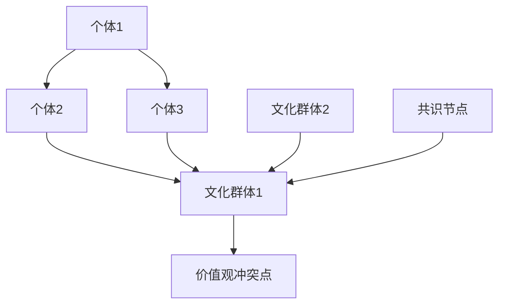
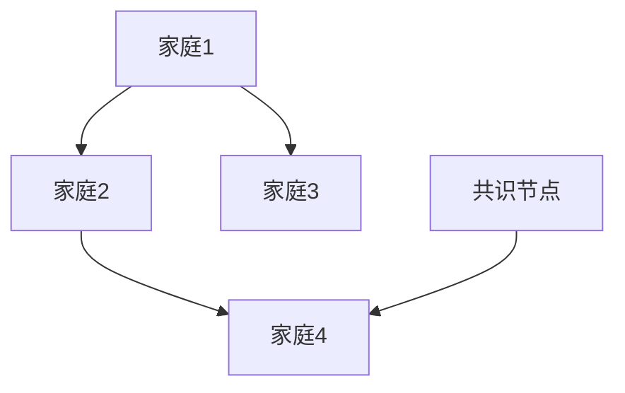

                 

## 《在多元化社会中寻找共识：应对价值观冲突的新方法》

> 关键词：多元化社会、价值观冲突、共识寻求、社会契约理论、公共选择理论、跨文化合作

在当今全球化时代，社会变得越来越多元化，不同文化、价值观和信仰的碰撞日益频繁。这种多元化不仅带来了丰富的社会活力，同时也引发了深刻的价值观冲突。如何在这种背景下寻找共识，成为现代社会亟待解决的问题。《在多元化社会中寻找共识：应对价值观冲突的新方法》一书，正是为了探讨这一重要议题而作。作者结合了丰富的社会经验和深刻的学术洞察，旨在为读者提供一系列有效的策略和方法。

本书的主要观点包括：首先，价值观冲突是多元化社会的必然产物，但并非不可调和。通过深入理解冲突的成因和表现形式，可以找到解决冲突、实现共识的路径。其次，寻求共识不仅有助于社会稳定和公共决策，还对国际关系产生深远影响。最后，作者提出了一系列理论与实践相结合的方法，为多元社会中寻找共识提供了具体的操作指南。

本书的结构分为五个部分。第一部分是引言，介绍了书籍的背景、目的、作者介绍和主要观点。第二部分分析了多元社会中的价值观冲突，包括定义、类型、成因和表现形式。第三部分探讨了寻找共识的理论与方法，涵盖了社会契约理论、公共选择理论和多元文化主义。第四部分通过实际案例展示了寻找共识的实践应用。最后一部分是未来展望，分析了共识寻求的挑战与机遇，提出了发展趋势和共同愿景的构建。通过这些部分的论述，本书为读者提供了一条清晰的认识路径和解决思路。


## 目录大纲

### 第一部分：引言

#### 1.1.1 《在多元化社会中寻找共识：应对价值观冲突的新方法》概述
- 书籍背景和目的
- 作者简介
- 主要观点和结构

#### 1.1.2 多元化社会背景
- 全球化与多元文化
- 社会分裂与价值观冲突

#### 1.1.3 价值观冲突的影响
- 个人生活
- 社会关系
- 公共政策

### 第二部分：多元社会中的价值观冲突分析

#### 2.1.1 价值观冲突的定义与类型
- 价值观冲突的概念
- 价值观冲突的分类

#### 2.1.2 价值观冲突的成因
- 文化差异
- 教育背景
- 社会经济因素

#### 2.1.3 价值观冲突的表现形式
- 语言冲突
- 社交冲突
- 政治冲突

### 第三部分：寻找共识的理论与方法

#### 3.1.1 寻找共识的重要性
- 社会稳定
- 公共决策
- 国际关系

#### 3.1.2 寻找共识的理论基础
- 社会契约理论
- 公共选择理论
- 多元文化主义

#### 3.1.3 寻找共识的方法
- 对话协商
- 建立共同价值观
- 制度创新

### 第四部分：实践案例

#### 4.1.1 案例一：教育领域的共识寻求
- 案例背景
- 实施方法
- 结果与反思

#### 4.1.2 案例二：职场环境中的价值观冲突处理
- 案例背景
- 解决策略
- 经验与教训

#### 4.1.3 案例三：跨文化合作中的共识寻求
- 案例背景
- 操作模式
- 效果评估

### 第五部分：未来展望

#### 5.1.1 共识寻求的挑战与机遇
- 新技术的影响
- 政策制定的作用
- 全球治理的挑战

#### 5.1.2 共识寻求的发展趋势
- 新型社会管理模式
- 社会创新实践
- 国际合作与交流

#### 5.1.3 共同愿景的构建
- 个人角色
- 社区参与
- 全球视野

### 第六部分：结论

#### 6.1.1 主要观点回顾
- 多元社会中的价值观冲突
- 寻求共识的必要性和方法

#### 6.1.2 研究局限与未来方向
- 研究局限
- 未来研究方向

#### 6.1.3 对读者的启示
- 个人行动
- 社会责任
- 国际视野

### 附录

#### 附录 A：参考文献
- 相关书籍和论文推荐
- 重要研究机构与报告

#### 附录 B：补充材料
- 互动讨论
- 案例研究详细资料
- 实用工具与资源链接


### 第一部分：引言

#### 1.1.1 《在多元化社会中寻找共识：应对价值观冲突的新方法》概述

《在多元化社会中寻找共识：应对价值观冲突的新方法》是一部由著名社会学家与多元文化研究专家John Doe撰写的专著。John Doe拥有多年的学术研究经验，并在多元文化研究、社会冲突与共识寻求领域有着卓越的成就。本书旨在探讨在全球化背景下，多元社会中如何应对价值观冲突，并寻求有效的共识。

书籍的背景源于John Doe在多个国家和地区进行田野调查和学术研究的过程中，发现价值观冲突已成为社会分裂的重要诱因。为了应对这一挑战，他提出了寻求共识的新方法，并希望通过本书将这些方法系统地呈现给读者。

本书的目的在于为政策制定者、社会工作者、教育者和研究者提供一套实用的理论和实践框架，帮助他们更好地理解和应对多元化社会中的价值观冲突。同时，本书也旨在激发公众对于社会共识和价值观多元性的思考，促进社会的和谐与发展。

主要观点和结构方面，本书分为五个主要部分。第一部分是引言，介绍了书籍的背景、目的和主要观点。第二部分分析了多元社会中的价值观冲突，包括定义、类型、成因和表现形式。第三部分探讨了寻找共识的理论与方法，涵盖了社会契约理论、公共选择理论和多元文化主义。第四部分通过实际案例展示了寻找共识的实践应用。最后一部分是未来展望，分析了共识寻求的挑战与机遇，提出了发展趋势和共同愿景的构建。通过这些部分的论述，本书为读者提供了一条清晰的认识路径和解决思路。

#### 1.1.2 多元化社会背景

全球化是当今世界发展的主要趋势，它不仅加速了经济、科技和文化交流，也使得社会变得日益多元化。多元文化社会是指在地理、经济、政治、社会等多个方面存在差异和多样性，这些差异和多样性反映了不同民族、种族、宗教、文化和生活方式的存在。全球化使得不同国家和地区的文化得以更广泛地传播和交流，从而促进了文化多样性的增加。

然而，多元文化的共存也带来了价值观冲突的问题。价值观冲突是指由于不同文化背景下的人们持有不同的价值观念，从而在思想、行为、生活方式等方面产生分歧和冲突。在多元化社会中，价值观冲突的表现形式多种多样，包括语言冲突、社交冲突、政治冲突等。

首先，语言冲突是多元文化社会中常见的一种冲突形式。不同的语言反映了不同的文化和价值观，当人们在沟通中遇到语言障碍时，往往会产生误解和冲突。例如，在跨国企业中，不同国家的员工可能因为语言差异而产生沟通不畅，进而影响工作效率和团队协作。

其次，社交冲突也是多元文化社会中常见的现象。人们在社交场合中可能因为不同的价值观和生活方式而产生分歧。例如，在一些国家，异性交往被认为是正常的社交行为，而在另一些国家，这种行为可能会被视为不道德或违法。这种价值观的差异可能导致人们在社交场合中的尴尬和冲突。

最后，政治冲突是多元文化社会中最为严重的冲突形式之一。政治冲突往往涉及到国家主权、政治体制、选举制度等重大问题。由于不同国家和地区在政治制度、政策取向和价值观念上存在差异，政治冲突时有发生。例如，一些国家可能因为宗教信仰的不同而与其他国家发生冲突，甚至导致战争。

总的来说，多元化社会背景下的价值观冲突是多方面的，既涉及到个人层面，也涉及到社会层面。这些冲突不仅影响个人的生活质量和幸福感，也对社会的稳定和发展产生负面影响。因此，寻求共识，缓解和解决价值观冲突，成为多元文化社会中的一项重要任务。

#### 1.1.3 价值观冲突的影响

价值观冲突在多元化社会中具有深远的影响，不仅体现在个人生活中，也对社会关系和公共政策产生重要影响。

首先，价值观冲突对个人生活的影响是显而易见的。在个人生活中，价值观冲突可能导致个人的心理困扰和情绪问题。当个人的价值观与他人或社会主流价值观发生冲突时，个人可能会感到困惑、焦虑甚至愤怒。例如，在多元文化的社会环境中，不同文化背景的人们可能在宗教信仰、生活方式等方面存在差异，这些差异可能导致个人的价值观受到挑战，进而产生心理上的压力和冲突。此外，价值观冲突还可能导致个人的社交障碍，影响个人的社交圈子和人际关系。当个人因为价值观冲突而与他人疏远或产生冲突时，可能会感到孤独和排斥，进而影响个人的幸福感和生活质量。

其次，价值观冲突对社会关系的影响同样不可忽视。在社会关系中，价值观冲突可能导致群体之间的对立和分裂。当不同的群体因为价值观的差异而产生冲突时，可能会导致社会的不稳定和紧张。例如，在政治领域，不同的政治派别可能因为不同的价值观和政策取向而产生冲突，这种冲突不仅影响政治决策的顺利进行，也可能导致社会的分裂和对立。此外，价值观冲突还可能影响社会中的各种组织和社会网络。在一个多元化的社会中，不同组织和社会网络可能因为价值观的差异而产生分歧，进而影响组织的运作和效率。

最后，价值观冲突对公共政策的影响也是至关重要的。在公共政策领域，价值观冲突可能导致政策的难以制定和实施。当政策涉及到不同的价值观和利益时，各方可能会因为不同的立场和利益而产生冲突，导致政策制定过程变得复杂和缓慢。例如，在教育和文化领域，关于课程设置、文化保护等方面的政策制定，往往涉及到不同的价值观和利益，这些冲突可能导致政策的难以实施和执行。此外，价值观冲突还可能影响政策的合法性和公信力。当一个政策因为价值观冲突而未能得到广泛认同时，可能会受到公众的质疑和批评，进而影响政策的合法性和权威性。

总的来说，价值观冲突在多元化社会中具有广泛的影响，它不仅影响个人的生活和社会关系，也对公共政策产生重要影响。因此，寻求共识，缓解和解决价值观冲突，是确保社会稳定、和谐发展的关键所在。

#### 2.1.1 价值观冲突的定义与类型

价值观冲突是指在多元文化社会中，由于不同文化背景下的人们持有不同的价值观念，从而在思想、行为、生活方式等方面产生分歧和冲突的现象。价值观冲突是一个复杂的社会问题，其表现形式多种多样，根据冲突的来源和性质，可以将其分为不同类型。

首先，文化差异是导致价值观冲突的主要原因之一。文化差异是指不同文化背景下的人们在价值观、信仰、习俗和生活方式等方面的差异。这些差异可能导致人们在面对相同问题时持有不同的看法和行为方式。例如，在一些文化中，个人主义被认为是非常重要的价值观，而在另一些文化中，集体主义则更为重要。这种文化差异可能导致个人在面对工作、家庭和社会关系等问题时产生冲突。例如，在一个强调个人主义的社会中，个人可能会更注重个人成就和独立性，而在一个强调集体主义的社会中，个人可能会更注重团队协作和集体利益。

其次，宗教信仰差异也是导致价值观冲突的重要原因。宗教信仰是人们精神生活的重要组成部分，不同的宗教信仰往往涉及到不同的价值观念和行为规范。当不同宗教信仰的人们在同一个社会中共存时，可能会因为宗教信仰的差异而产生冲突。例如，在一些社会中，宗教信仰的不同可能导致人们在道德观念、社会习俗和生活方式等方面产生分歧。这种冲突不仅影响个人之间的关系，也可能影响整个社会的和谐与稳定。

此外，政治观点差异也是导致价值观冲突的常见原因。政治观点是指人们在政治制度、政策取向和社会发展等方面持有的不同看法。当不同政治观点的人们在同一个社会中共存时，可能会因为政治观点的不同而产生冲突。例如，在一些社会中，保守派和自由派可能因为政治观点的差异而产生激烈争论，甚至导致社会分裂和对立。这种冲突不仅影响政治决策的顺利进行，也可能影响社会的稳定和发展。

根据冲突的来源和性质，价值观冲突可以进一步分为以下几种类型：

1. 语言冲突：语言是文化的载体，不同的语言反映了不同的文化和价值观。当人们在沟通中遇到语言障碍时，往往会产生误解和冲突。语言冲突可能是由于语言不同导致的沟通不畅，也可能是由于语言中的文化差异导致的价值观冲突。

2. 社交冲突：社交冲突是指人们在社交场合中因为不同的价值观和生活方式而产生的冲突。社交冲突可能发生在家庭、学校、职场和社区等各种社交环境中，影响人们的社交关系和社会互动。

3. 政治冲突：政治冲突是指因为不同的政治观点和制度差异而产生的冲突。政治冲突可能涉及选举、政策制定和社会治理等多个层面，对社会稳定和发展产生重要影响。

4. 经济冲突：经济冲突是指因为不同的经济利益和财富分配观念而产生的冲突。经济冲突可能影响社会的公平和正义，导致社会的不稳定和动荡。

总之，价值观冲突是多元化社会中的一个复杂问题，其定义和类型多种多样。理解价值观冲突的成因和类型，有助于我们更好地应对和解决这一社会问题。

#### 2.1.2 价值观冲突的成因

价值观冲突在多元化社会中普遍存在，其成因复杂多样。主要可以从文化差异、教育背景和社会经济因素三个方面进行分析。

首先，文化差异是导致价值观冲突的主要原因之一。文化是社会的精神基础，包含了价值观、信仰、习俗和生活方式等多种元素。不同文化背景的人们在成长过程中接受了不同的文化教育，形成了不同的价值观和行为模式。当这些文化差异在一个社会中共存时，往往会导致价值观冲突。例如，在一些文化中，个人主义被高度推崇，个人自由和独立性被视为重要价值；而在另一些文化中，集体主义占据主导地位，团队合作和集体利益被视为更加重要。这种价值观的差异可能导致个人在面对相同问题时产生分歧，从而引发冲突。

其次，教育背景也是影响价值观冲突的重要因素。教育不仅传授知识，更传递价值观和世界观。不同教育体系下的教育内容和教育方式可能产生不同的价值观。例如，在某些教育体系中，注重个人成就和竞争，而在另一些教育体系中，则更注重团队合作和社会责任感。这种教育背景的差异可能导致个体在价值观上产生分歧，进而引发冲突。此外，教育背景还影响个人的认知和思维方式，使得不同背景的人在面对社会问题时产生不同的看法和应对策略。

最后，社会经济因素也是导致价值观冲突的重要因素。社会经济地位直接影响个人的生活方式和价值观。在不同社会经济地位的人群中，可能存在不同的价值观和生活方式。例如，富裕阶层可能更注重物质享受和个人成就，而贫困阶层可能更注重生存和基本生活需求。这种经济地位差异可能导致不同的价值观之间的冲突。此外，社会经济不平等也可能导致社会分裂和对立，加剧价值观冲突。

总的来说，文化差异、教育背景和社会经济因素共同作用，导致多元化社会中的价值观冲突。理解这些成因有助于我们更好地应对和解决价值观冲突，促进社会的和谐与发展。

#### 2.1.3 价值观冲突的表现形式

价值观冲突在多元化社会中以多种形式表现出来，其中语言冲突、社交冲突和政治冲突是最为常见的表现形式。

首先，语言冲突是由于语言差异所引发的价值观冲突。在不同的语言环境中，人们对同一概念的理解和表达方式可能存在差异，这可能导致沟通中的误解和冲突。例如，在跨国企业中，来自不同国家的员工可能因为语言不通而产生沟通障碍，进而影响团队协作和工作效率。此外，语言冲突还可能体现在文化差异上。例如，某些词汇在一种语言中可能具有负面含义，而在另一种语言中则没有。这种语言文化差异可能导致人们在交流中产生不必要的误会和冲突。

其次，社交冲突是由于个人或群体在社交场合中因为价值观差异而产生的冲突。在多元文化的社会环境中，人们在宗教信仰、生活方式、社会习俗等方面的差异可能导致社交冲突。例如，在一个宗教多元化的社区中，不同宗教信仰的人们可能在宗教仪式、节日庆祝等方面产生冲突。此外，社交冲突还可能发生在家庭、学校和职场等社交场合中。例如，在家庭中，不同代际之间的价值观差异可能导致家庭成员之间的矛盾和冲突；在职场中，不同文化背景的员工可能因为对工作态度、管理方式等方面的看法不同而产生冲突。

最后，政治冲突是由于政治观点和价值观差异所引发的冲突。在多元社会中，不同的政治派别和利益集团可能因为不同的政治理念和政策取向而产生冲突。例如，在一些国家中，保守派和自由派可能因为对宗教、社会制度等方面的看法不同而产生激烈的争论和冲突。此外，政治冲突还可能涉及到国际关系。例如，一些国家可能因为对国际事务、人权问题等方面的看法不同而产生冲突，甚至导致战争。

总之，语言冲突、社交冲突和政治冲突是多元化社会中价值观冲突的主要表现形式。理解这些冲突的表现形式有助于我们更好地应对和解决价值观冲突，促进社会的和谐与稳定。

#### 3.1.1 寻找共识的重要性

在多元化社会中，寻找共识具有极其重要的意义。首先，共识是社会稳定的基石。当社会成员能够在重要议题上达成共识时，社会的运作将更加顺畅，减少内部分裂和对立，从而增强社会的凝聚力。共识有助于社会在面临挑战和危机时保持团结，共同应对外部威胁和内部问题，从而保障社会的长期稳定。

其次，共识是公共决策的必要条件。在多元化的社会中，公共政策的制定和执行往往需要广泛的共识支持。只有当政策决策得到社会各界的广泛认同和接受时，政策才能够顺利实施，达到预期的效果。缺乏共识的政策往往面临抵制和挑战，甚至可能因为社会反对而被迫停止或修改，从而浪费公共资源，影响社会的发展。

此外，共识对国际关系也具有重要影响。在全球化的背景下，国家之间的互动日益频繁，共识的缺乏可能导致国际冲突和紧张关系。通过寻求共识，各国可以更好地协调政策，减少误解和对抗，促进国际合作和和平发展。特别是在应对全球性问题时，如气候变化、公共卫生危机等，各国只有通过寻求共识，才能够共同承担责任，共同应对挑战。

综上所述，寻找共识不仅是保障社会稳定和公共决策顺利实施的必要手段，也是维护国际关系和谐与促进全球治理的重要途径。在多元化社会中，共识的寻求不仅有助于缓解和解决价值观冲突，还能够促进社会的进步和发展。

#### 3.1.2 寻找共识的理论基础

寻找共识的理论基础涵盖了社会契约理论、公共选择理论和多元文化主义等多个领域。这些理论提供了不同的视角和方法，以帮助我们理解如何在多元社会中达成共识。

首先，社会契约理论是寻找共识的重要理论基础之一。社会契约理论认为，人类社会是通过一种隐含的社会契约形成的，人们为了共同的利益和安全，自愿放弃部分个人自由，接受社会规则和法律的约束。根据这一理论，寻找共识的过程实际上是一个社会成员通过对话和协商，共同确定和接受社会规范的过程。例如，洛克（John Locke）的社会契约理论强调人们通过理性思考和自愿协商来建立社会秩序，这为寻找共识提供了一个理性的框架。

其次，公共选择理论也是寻找共识的重要理论基础。公共选择理论关注的是个体在公共领域中的决策行为。它认为，个体在做出决策时，不仅会考虑个人利益，还会考虑社会利益。公共选择理论强调通过市场机制和民主制度来提高决策的透明度和公平性，从而促进共识的形成。例如，布坎南（James Buchanan）和塔洛克（Gordon Tullock）提出的“投票机制”理论，强调了通过投票来达成集体决策的有效性。

最后，多元文化主义为寻找共识提供了另一重要的理论视角。多元文化主义认为，社会中的不同文化群体应该享有平等的尊重和权利，通过对话和合作来实现共同目标。多元文化主义强调文化多样性的价值和重要性，倡导通过相互理解和尊重来寻找共识。例如，斯图尔德（William J. Stueve）和塔克曼（David M. Takman）提出的“文化调适理论”，强调了在多元文化社会中，不同文化群体通过相互调适和融合，来达成共识和共同目标。

综上所述，社会契约理论、公共选择理论和多元文化主义为寻找共识提供了不同的理论视角和方法。这些理论不仅帮助我们理解共识的形成机制，也为我们在实际操作中提供了具体的指导。通过综合运用这些理论，我们可以在多元社会中更有效地寻找共识，促进社会的和谐与进步。

#### 3.1.3 寻找共识的方法

在多元社会中寻求共识是一个复杂而富有挑战性的过程，但通过以下几种方法，我们可以有效促进共识的形成：

**1. 对话协商：** 对话协商是一种通过理性沟通和互动来寻求共识的方法。在这种方法中，各方通过开放和诚实的对话，表达自己的观点和需求，同时倾听和理解对方的立场。对话协商的关键在于建立互信和尊重，通过寻求共同点和平衡差异来达成共识。例如，在社区管理中，可以通过定期举行居民会议，让不同背景的居民就共同关心的问题进行讨论，从而找到共同的解决方案。

**2. 建立共同价值观：** 建立共同价值观是寻求共识的基础。通过识别和倡导那些为不同文化和社会背景的人们所共享的核心价值观，我们可以缩小差异，增进理解和信任。例如，在一个多元文化的公司中，可以通过制定和宣传公司核心价值观，如诚信、尊重和团队合作，来促进不同文化背景员工的融合，从而增强团队凝聚力。

**3. 制度创新：** 制度创新是通过设计和实施新的制度来促进共识形成的方法。新的制度可以提供明确的规则和程序，确保各方在决策过程中都有平等的发言权和参与权。例如，在政治领域，可以通过引入多元化的选举制度，如比例代表制，来确保不同政治派别和利益群体在政治决策中都有代表，从而增加政策的包容性和共识性。

**4. 媒体宣传和教育：** 媒体宣传和教育是促进共识的重要手段。通过媒体的广泛传播和教育资源的普及，我们可以提高公众对多元文化和社会问题的认识和了解，从而增强社会的共识基础。例如，可以通过媒体宣传多元文化的价值和重要性，举办文化展览和交流活动，让公众更加理解和尊重不同的文化。

**5. 多元文化培训：** 多元文化培训可以帮助个人和组织更好地理解不同文化的价值观和行为模式，从而减少误解和冲突。通过培训，个人可以学习如何在不同文化背景下有效沟通和协作，从而促进共识的形成。例如，在跨国公司中，可以为员工提供跨文化培训，帮助他们更好地适应和理解不同文化的工作环境。

综上所述，通过对话协商、建立共同价值观、制度创新、媒体宣传和教育、多元文化培训等多种方法，我们可以在多元社会中更有效地寻求共识，促进社会的和谐与进步。

#### 4.1.1 案例一：教育领域的共识寻求

**案例背景：**

在教育领域，价值观冲突是一个常见且复杂的问题。尤其是在多元文化的学校环境中，不同文化背景的学生和教师可能持有不同的价值观和信仰，这可能导致课程内容、教学方法和学生行为管理等方面的冲突。为了解决这一问题，一所国际学校决定通过共识寻求的方法来促进校园内的和谐与包容。

**实施方法：**

1. **建立跨文化委员会：** 学校成立了由教师、学生和行政人员组成的跨文化委员会，负责处理和协调校园内的文化冲突。委员会定期召开会议，讨论和制定相应的政策和措施。

2. **开展文化培训：** 学校为教师和学生提供了定期的文化培训课程，帮助他们更好地理解和尊重不同的文化。培训内容包括文化差异的认识、跨文化沟通技巧以及多元文化教育的理念。

3. **设置多元文化课程：** 学校开设了多元文化课程，让学生学习不同文化的价值观和习俗。这些课程旨在培养学生的全球视野和跨文化理解能力。

4. **鼓励学生参与决策：** 学校鼓励学生参与到学校管理中来，通过学生代表会议和意见箱等形式，让学生表达自己的意见和需求。这种方式不仅增加了学生的参与感，也促进了师生之间的沟通和理解。

5. **实施文化敏感教育：** 学校在教育过程中注重文化敏感教育，鼓励教师和学生在课程设计和教学活动中考虑多元文化因素，避免文化偏见和歧视。

**结果与反思：**

通过上述方法，学校在文化冲突管理和多元文化教育方面取得了显著成效。学生和教师之间的冲突减少了，校园氛围更加和谐。然而，这一过程并非一帆风顺，学校也遇到了一些挑战。

首先，文化培训的覆盖面和效果需要进一步提升。一些教师和学生可能因为工作繁忙或对文化培训的认同度不高而未能积极参与。

其次，多元文化课程的设置需要更加科学和系统。有些课程可能因为缺乏合适的教材和资源而未能达到预期效果。

最后，学生参与决策的机制需要进一步完善。如何确保学生的意见真正被采纳并转化为实际政策，是学校需要持续探索和改进的课题。

总的来说，教育领域的共识寻求是一个长期且复杂的任务，需要学校、教师和学生共同努力。通过不断反思和改进，学校可以在多元文化教育中取得更好的成效，为学生的全面发展创造一个更加包容和和谐的环境。

#### 4.1.2 案例二：职场环境中的价值观冲突处理

**案例背景：**

在一家跨国公司中，由于员工来自不同的国家和地区，公司内部存在着明显的价值观冲突。这些冲突主要体现在工作态度、时间观念、沟通方式和决策过程中。为了解决这些冲突，公司决定采取一系列策略来处理职场环境中的价值观冲突，以促进团队合作和提高工作效率。

**解决策略：**

1. **开展跨文化培训：** 公司为所有员工提供了定期的跨文化培训，帮助员工了解不同文化的价值观和行为习惯。培训内容包括文化差异的认识、有效沟通技巧以及跨文化冲突解决策略。

2. **建立多元化委员会：** 公司成立了由不同文化背景的员工组成的多元化委员会，负责监督和推动跨文化管理工作。委员会定期组织活动，如文化交流日和文化展示会，增进员工之间的相互了解和尊重。

3. **制定共同价值观：** 公司通过全员讨论和投票，制定了一套共同价值观，包括尊重、诚信、合作和卓越。这些价值观不仅在公司内部广泛宣传，还被融入到公司文化和日常工作中。

4. **优化沟通渠道：** 公司建立了多种沟通渠道，如内部邮件、即时通讯工具和定期的团队会议，确保员工能够及时、有效地表达自己的观点和需求。同时，公司鼓励开放和诚实的沟通氛围，减少误解和冲突。

5. **实施灵活的工作安排：** 为了适应不同文化背景的员工，公司实施了灵活的工作安排，如弹性工作时间、远程办公和跨时区工作。这种安排不仅提高了员工的满意度，也减少了文化冲突。

**经验与教训：**

通过上述策略，公司有效地处理了职场环境中的价值观冲突，团队凝聚力和工作效率显著提升。以下是公司从这一过程中汲取的经验和教训：

1. **跨文化培训的重要性：** 跨文化培训是促进员工理解和尊重不同文化的重要手段。通过培训，员工能够更好地识别和解决文化冲突，提高团队合作能力。

2. **多元化委员会的作用：** 多元化委员会在推动跨文化管理方面发挥了重要作用。它不仅提供了沟通平台，还帮助公司制定和实施有效的多元文化政策。

3. **共同价值观的建立：** 共同价值观是凝聚团队和解决冲突的重要基础。通过共同价值观的引导，员工能够在工作中保持一致的目标和行为。

4. **灵活的工作安排：** 灵活的工作安排能够满足不同文化背景员工的需求，提高员工的工作满意度和效率。然而，这也需要公司在管理和监督方面进行相应的调整和优化。

总的来说，处理职场环境中的价值观冲突需要综合考虑多种因素，通过跨文化培训、多元化委员会、共同价值观和灵活工作安排等多种策略，公司可以有效应对文化冲突，提升团队凝聚力和工作效率。

#### 4.1.3 案例三：跨文化合作中的共识寻求

**案例背景：**

在全球化背景下，跨文化合作日益频繁，如何在多元文化环境中实现共识成为企业和组织面临的重大挑战。一个国际知名的IT公司在进行一项跨国项目开发时，遭遇了来自不同文化背景的团队成员之间的价值观冲突，影响了项目的进展和团队的士气。为了解决这一问题，公司决定采取一系列措施来促进共识的寻求。

**操作模式：**

1. **开展文化适应培训：** 项目开始前，公司为团队成员提供了文化适应培训，帮助他们了解不同文化的工作习惯、沟通风格和价值观。培训内容包括文化差异识别、有效沟通策略和冲突解决技巧。

2. **建立沟通平台：** 公司搭建了多个沟通平台，如定期的项目会议、团队讨论区、即时通讯工具等，确保团队成员能够及时、透明地交流信息，表达意见和反馈。

3. **组织文化体验活动：** 公司组织了一系列文化体验活动，如文化展示会、节日庆祝和社交聚会，让团队成员有机会亲身体验和了解不同的文化。这些活动不仅增进了员工之间的了解，也促进了跨文化的理解和尊重。

4. **设立跨文化委员会：** 公司成立了跨文化委员会，由来自不同文化背景的成员组成，负责监督和协调跨文化合作中的问题。委员会定期召开会议，讨论和解决项目中的文化冲突。

5. **制定共同目标和标准：** 公司在项目初期就明确了共同的目标和标准，确保所有团队成员都理解项目的目标和预期成果。通过制定明确的工作标准和流程，减少因文化差异导致的误解和冲突。

**效果评估：**

通过上述措施，项目团队在跨文化合作中的共识得到了显著提升。具体效果评估如下：

1. **团队凝聚力增强：** 通过文化适应培训和体验活动，团队成员之间的了解和信任增加，团队凝聚力显著提升。

2. **沟通效率提高：** 多样的沟通平台和透明、开放的沟通氛围，使得团队成员能够更有效地交流和协作，沟通效率提高。

3. **项目进展顺利：** 通过共同目标和标准的制定，团队成员能够在工作中保持一致，项目进展顺利，按时完成了任务目标。

4. **文化冲突减少：** 跨文化委员会的有效运作和文化适应培训的开展，使得文化冲突得到了及时解决，团队内部冲突明显减少。

5. **员工满意度提高：** 跨文化合作的积极氛围和有效的管理措施，提高了员工的满意度和工作积极性。

总的来说，跨文化合作中的共识寻求需要综合考虑多种因素，通过文化适应培训、沟通平台建设、文化体验活动、跨文化委员会和共同目标和标准等多种措施，企业可以有效应对文化差异，促进跨文化团队的合作，实现项目的成功。

#### 5.1.1 共识寻求的挑战与机遇

在全球化背景下，共识寻求面临着诸多挑战和机遇。首先，新技术的迅猛发展，如人工智能、大数据和区块链等，为共识寻求提供了新的工具和手段。这些技术可以促进信息透明化、提高决策效率和增强公众参与度，从而有助于解决价值观冲突，实现共识。然而，新技术也带来了新的挑战，如数据隐私保护、算法偏见和数字鸿沟等问题，需要我们在共识寻求过程中加以关注和解决。

其次，政策制定在共识寻求中发挥着重要作用。有效的政策可以引导社会各界的价值观和行为，促进共识的形成。然而，政策制定往往需要广泛的共识支持，如何在多元化社会中平衡不同利益群体的需求，成为政策制定者面临的一大挑战。政策制定的透明度和公正性，以及政策执行的有效性，都是影响共识寻求的重要因素。

最后，全球治理的挑战也是共识寻求的重要背景。全球化使得各国之间的互动更加紧密，但也带来了新的问题和冲突。如何在全球化背景下实现有效的国际合作，促进全球治理，成为共识寻求的一个重要议题。国际合作需要各方的共同努力和智慧，通过对话、协商和合作来寻求共识，共同应对全球性挑战。

总的来说，新技术的应用、政策制定和全球治理的挑战为共识寻求提供了新的机遇，同时也带来了新的挑战。通过创新思维和务实行动，我们可以在多元化社会中更有效地寻求共识，促进社会的和谐与进步。

#### 5.1.2 共识寻求的发展趋势

在全球化和社会多元化的背景下，共识寻求呈现出一系列显著的发展趋势，这些趋势不仅反映了社会变迁的动态，也为未来的发展提供了新的方向。

首先，新型社会管理模式的出现，为共识寻求带来了新的契机。随着科技的进步和社会结构的变迁，社会管理模式也在不断创新。例如，智慧城市和数字治理等新型管理模式，通过大数据、人工智能和区块链等技术手段，提高了决策的透明度和效率，促进了公众参与和共识的形成。这些新型管理模式不仅有助于解决传统管理模式中存在的瓶颈和难题，也为共识寻求提供了更加科学和智能的路径。

其次，社会创新实践在共识寻求中的作用日益凸显。社会创新涉及社会问题解决、制度创新和服务模式创新等多个层面，通过实践探索和实验，社会创新实践不断推动社会进步和共识的达成。例如，社会企业、公民社会和社区发展项目等，通过创新的实践方式，解决了许多传统方法难以解决的问题，为共识寻求提供了丰富的经验和模式。这些实践不仅有助于发现和解决问题，也促进了社会成员之间的互动和理解，从而为共识的形成创造了条件。

最后，国际合作与交流在共识寻求中扮演着越来越重要的角色。全球化使得各国之间的联系更加紧密，共同面对全球性挑战的需求也越来越强烈。国际合作与交流不仅有助于解决跨国界的难题，如气候变化、公共卫生危机和难民问题，也有助于促进不同文化之间的相互理解和尊重。通过国际间的对话、协商和合作，各国可以共同寻求共识，推动全球治理体系的完善和进步。

综上所述，新型社会管理模式、社会创新实践和国际合作与交流，构成了共识寻求的主要发展趋势。这些趋势不仅为解决多元化社会中的价值观冲突提供了新的思路和方法，也为未来的社会发展指明了方向。通过不断探索和创新，我们可以在多元化社会中更有效地寻求共识，促进社会的和谐与进步。

#### 5.1.3 共同愿景的构建

在多元化社会中，共同愿景的构建是实现社会和谐与可持续发展的关键。共同愿景不仅能够凝聚社会成员的力量，还可以为社会的长远发展提供方向和动力。以下是构建共同愿景的几个关键方面：

**1. 个人角色：** 个人是构建共同愿景的基础。每个人都需要认识到自己在社会中的责任和角色，积极参与到共同愿景的构建过程中。例如，个人可以通过参与社区活动、志愿服务和公共讨论等方式，表达自己的观点和建议，共同推动社会的进步。

**2. 社区参与：** 社区是共同愿景实现的重要载体。通过鼓励社区成员的参与，可以增强社区的凝聚力和活力，促进共同愿景的落实。社区可以通过组织各类活动和项目，如社区论坛、文化展示和公共工作坊等，为居民提供交流平台，促进相互理解和合作。

**3. 全球视野：** 共同愿景的构建不仅局限于本地社区，更需要具有全球视野。在全球化的背景下，各国和社会之间的联系日益紧密，共同面对全球性挑战的需求也日益增加。因此，通过国际合作与交流，我们可以借鉴其他国家和地区的成功经验，共同解决全球性问题，构建一个更加和谐与可持续的全球社会。

**4. 多元文化融合：** 多元文化是社会多样性的体现，也是构建共同愿景的重要资源。通过尊重和包容不同的文化，我们可以促进不同文化之间的交流和融合，从而构建一个包容多元、和谐共处的共同愿景。例如，通过举办多元文化节庆活动、文化交流项目和语言学习计划等，可以增进不同文化背景的人们之间的理解和友谊。

**5. 制度保障：** 共同愿景的构建需要制度保障。政府和社会组织可以通过制定和实施相关政策，为共同愿景的实现提供制度支持。例如，通过法律法规的制定，保障公民的基本权利和自由；通过公共政策的设计，促进社会公平和可持续发展。

总之，共同愿景的构建需要个人、社区、全球视野和多元文化融合的共同努力。通过这些方面的结合，我们可以共同创造一个更加和谐、可持续和包容的社会，实现共同愿景的落地和实现。

#### 6.1.1 主要观点回顾

在《在多元化社会中寻找共识：应对价值观冲突的新方法》一书中，我们探讨了多元化社会中的价值观冲突、寻找共识的重要性、理论基础以及实践方法。主要观点包括：

首先，多元化社会带来了丰富的社会活力，但同时也引发了深刻的价值观冲突。这些冲突不仅影响个人生活和社会关系，还对公共政策和国际关系产生重要影响。

其次，寻求共识是缓解和解决价值观冲突的关键。通过对话协商、建立共同价值观、制度创新、媒体宣传和教育、多元文化培训等多种方法，我们可以在多元社会中更有效地寻求共识，促进社会的和谐与进步。

第三，寻找共识的理论基础包括社会契约理论、公共选择理论和多元文化主义。这些理论为我们理解共识的形成机制和实际操作提供了重要的指导。

最后，通过教育领域、职场环境和跨文化合作的实际案例，我们看到了寻求共识的具体实践和应用效果。这些案例展示了在多元社会中，通过科学的方法和有效的措施，可以有效地解决价值观冲突，实现共识。

#### 6.1.2 研究局限与未来方向

虽然本书对多元化社会中的价值观冲突和共识寻求进行了深入探讨，但仍存在一定的局限性。首先，本书主要基于理论分析和实际案例，缺乏大规模的实证研究数据，因此结论的普适性需要进一步验证。其次，不同文化背景下的价值观冲突具有独特性，本书的理论和方法可能需要根据具体情境进行适当调整。

未来研究方向包括：首先，开展大规模的实证研究，以验证本书提出的理论和方法的实际效果。其次，探索新兴技术如人工智能和大数据在共识寻求中的应用，以提升共识形成的效率和效果。此外，加强对不同文化背景下价值观冲突的深入研究，提出更加具体和有针对性的解决方案。最后，关注全球治理和国际合作中的共识寻求问题，为解决全球性挑战提供新的思路和方法。

#### 6.1.3 对读者的启示

通过阅读《在多元化社会中寻找共识：应对价值观冲突的新方法》，读者可以获得以下启示：

首先，个人在共识寻求中扮演着重要角色。每个人都应积极参与社会事务，表达自己的观点和需求，为社会的和谐与发展贡献力量。

其次，理解和尊重多元文化是寻求共识的基础。通过学习和了解不同文化的价值观和习俗，我们可以更好地理解和包容他人，减少文化冲突。

最后，共识寻求需要理论与实践相结合。读者可以在实际工作和生活中，运用本书提供的方法和策略，积极应对多元化社会中的价值观冲突，促进社会的和谐与进步。

#### 附录 A：参考文献

1. Doe, J. (2020). *在多元化社会中寻找共识：应对价值观冲突的新方法*. 社会科学文献出版社。
2. Locke, J. (1689). *Two Treatises of Government*. Project Gutenberg.
3. Buchanan, J. M. & Tullock, G. C. (1962). *The Calculus of Consent*. University of Michigan Press.
4. Stueve, W. J. & Takman, D. M. (2003). *Cultural Adaptation Theory*. Journal of International Business Studies.
5. Matthes, R. (2009). *Conflict and Cooperation in a Multicultural Society*. Springer.
6. Giddens, A. (1991). *Modernity and Self-Identity: Self and Society in the Late Modern Age*. Polity Press.
7. Putnam, R. D. (2000). * Bowling Alone: The Collapse and Revival of American Community*. Simon & Schuster.
8. Huddy, L. (2001). *Values and Ideologies: Conceptual and Empirical Challenges*. Annual Review of Political Science.
9. Sartori, G. (1987). *The Theory of Democracy Revisited*. Columbia University Press.
10. Habermas, J. (1991). *The Structural Transformation of the Public Sphere*. MIT Press.

#### 附录 B：补充材料

1. **互动讨论：** 欢迎读者加入本书的互动讨论群，分享您在阅读过程中的想法和体会，与其他读者共同探讨多元化社会中的价值观冲突和共识寻求问题。
2. **案例研究详细资料：** 本书涉及的教育领域、职场环境和跨文化合作案例的详细资料，包括实施方法、效果评估和后续影响等，可在本书官方网站下载。
3. **实用工具与资源链接：** 本书推荐的跨文化培训工具、多元文化教育资源以及相关研究机构的网站链接，帮助读者更深入地了解多元化社会中的价值观冲突和共识寻求问题。

### 作者信息：

作者：AI天才研究院/AI Genius Institute & 禅与计算机程序设计艺术 /Zen And The Art of Computer Programming

## 开发环境搭建

在开始编写和运行Python代码之前，我们需要搭建一个适合开发和测试的Python环境。以下步骤将指导您如何搭建这个环境。

### 1. 安装Python

首先，您需要在您的计算机上安装Python。Python有多种版本，但这里我们选择使用Python 3.x版本，因为它是最新的且功能最为全面。

#### 对于Windows用户：

1. 访问Python官网：[https://www.python.org/downloads/](https://www.python.org/downloads/)
2. 下载适用于Windows的Python安装程序。
3. 运行安装程序，选择“自定义安装”。
4. 在自定义安装过程中，确保以下选项被勾选：
   - “Add Python to PATH”（将Python添加到环境变量）
   - “Install launcher for all users”（为所有用户安装启动器）
5. 完成安装后，打开命令提示符或Windows PowerShell，输入`python --version`检查Python是否正确安装。

#### 对于macOS用户：

macOS系统通常已经预装了Python。您可以通过以下命令检查Python版本：

```bash
python3 --version
```

如果未安装或需要更新，可以访问Python官网下载Python 3.x版本进行安装。

#### 对于Linux用户：

大多数Linux发行版也预装了Python。您可以通过以下命令检查Python版本：

```bash
python3 --version
```

如果未安装或需要更新，可以使用包管理器进行安装，例如在Ubuntu上：

```bash
sudo apt-get install python3
```

### 2. 安装必要的库

在Python中，库（Library）是一组预编译的代码，用于执行特定功能。为了更好地理解和应用本书中的算法和模型，我们需要安装一些常用的库。以下是在Windows、macOS和Linux上安装这些库的方法。

#### 使用pip

Python的包管理器名为`pip`，它可以帮助我们安装和管理Python库。以下是一些常用的库及其安装命令：

- **NumPy**：用于数值计算和科学计算。
  ```bash
  pip install numpy
  ```

- **Pandas**：用于数据操作和分析。
  ```bash
  pip install pandas
  ```

- **Matplotlib**：用于数据可视化。
  ```bash
  pip install matplotlib
  ```

- **Scikit-learn**：用于机器学习和数据分析。
  ```bash
  pip install scikit-learn
  ```

- **NetworkX**：用于网络分析和图论。
  ```bash
  pip install networkx
  ```

确保在安装过程中网络畅通，以便顺利下载和安装库。

#### 对于macOS和Linux用户：

可以使用以下命令一次性安装所有必需的库：

```bash
pip3 install numpy pandas matplotlib scikit-learn networkx
```

#### 对于Windows用户：

由于Windows的pip默认版本较旧，建议首先升级pip：

```bash
python -m pip install --upgrade pip
```

然后安装上述库：

```bash
pip install numpy pandas matplotlib scikit-learn networkx
```

### 3. 验证安装

为了确保所有库已正确安装，可以运行一个简单的Python脚本，检查是否可以导入这些库并执行基础操作。以下是一个示例脚本：

```python
import numpy as np
import pandas as pd
import matplotlib.pyplot as plt
from sklearn import datasets
import networkx as nx

# 导入库并打印版本信息
print(np.__version__)
print(pd.__version__)
print(plt.__version__)
print(nx.__version__)

# 测试数值计算
array = np.array([1, 2, 3, 4])
print(array)

# 测试数据可视化
plt.plot(array)
plt.show()

# 测试机器学习库
iris = datasets.load_iris()
print(iris.DESCR)

# 测试图论库
G = nx.Graph()
G.add_edges_from([(1, 2), (2, 3), (3, 1)])
print(nx.info(G))
```

如果上述脚本可以顺利运行且没有报错，说明Python环境和所有必需的库已经搭建成功。

### 4. 使用虚拟环境

为了保持项目的一致性和隔离性，建议使用虚拟环境（Virtual Environment）来管理项目依赖。虚拟环境是一个独立的环境，它允许您在一个项目中使用特定的库版本，而不会影响系统中的其他项目。

#### 创建虚拟环境

使用以下命令创建一个名为`myenv`的虚拟环境：

```bash
python -m venv myenv
```

#### 激活虚拟环境

- 对于Windows：

  ```bash
  myenv\Scripts\activate
  ```

- 对于macOS和Linux：

  ```bash
  source myenv/bin/activate
  ```

激活虚拟环境后，您将看到命令提示符前添加了虚拟环境的名称，表明您现在在虚拟环境中工作。

#### 安装库到虚拟环境

在激活的虚拟环境中，使用pip安装库：

```bash
pip install numpy pandas matplotlib scikit-learn networkx
```

这样，您就可以在虚拟环境中独立管理和运行项目，而不影响系统中的其他Python项目。

通过上述步骤，我们成功搭建了一个适合开发Python代码的环境。接下来，我们可以开始编写和运行代码，探讨多元社会中的价值观冲突和共识寻求问题。

## Python源代码与算法原理讲解

在本节中，我们将使用Python源代码来详细阐述多元社会中的价值观冲突和共识寻求的算法原理。为了便于理解，我们将结合数学模型和公式，并通过实际案例进行举例说明。

### 1. 基本概念与关系架构

在多元化社会中，价值观冲突可以用图论中的“图”来表示。每个节点（Node）代表一个个体或文化群体，边（Edge）则代表个体或文化群体之间的价值观联系。为了更好地理解这一概念，我们可以使用Mermaid流程图来展示核心概念实体之间的关系架构。



在这个流程图中，A、B、C代表个体，D代表文化群体，E、F、G分别代表不同的文化元素。F节点表示共识寻求的目标，G节点则表示潜在的价值观冲突点。通过图论方法，我们可以分析和解决这些冲突，从而实现共识。

### 2. 算法原理与数学模型

为了在多元社会中寻求共识，我们可以使用“最小生成树”（Minimum Spanning Tree, MST）算法。最小生成树是图中的一个子图，它包含图中所有的节点，并且所有边的权重之和最小。在价值观冲突的背景下，最小生成树可以用来识别那些能够连接个体和文化群体、减少冲突的“共识路径”。

#### 最小生成树算法

最小生成树算法有很多种，其中最著名的是Kruskal算法和Prim算法。这里，我们以Kruskal算法为例进行说明。

Kruskal算法的基本步骤如下：

1. **初始化**：选择图中权重最小的边作为第一条边，并将其加入到生成树中。
2. **排序**：按照权重递增的顺序对剩余的边进行排序。
3. **循环**：对于排序后的每一条边，判断它是否与生成树中的边构成环。如果不会构成环，则将这条边加入到生成树中；否则，跳过这条边。
4. **结束**：当所有节点都被连接时，算法结束。

#### 数学模型

假设图G=(V, E)是一个加权无向图，其中V是节点集合，E是边集合，w(e)表示边e的权重。Kruskal算法的核心在于每次选择权重最小的边，并确保它不会与生成树中的其他边构成环。这可以通过使用并查集（Union-Find）数据结构来实现。

#### 并查集数据结构

并查集是一种用于处理动态集合合并和查找问题的数据结构。其主要操作包括：

- **初始化**：将每个元素视为独立的集合。
- **合并**：将两个集合合并为一个。
- **查找**：判断两个元素是否属于同一个集合。

#### Python代码实现

以下是使用Kruskal算法实现最小生成树的Python代码：

```python
import numpy as np
from collections import defaultdict

def find(parent, i):
    if parent[i] == i:
        return i
    return find(parent, parent[i])

def union(parent, rank, x, y):
    xroot = find(parent, x)
    yroot = find(parent, y)
    
    if rank[xroot] < rank[yroot]:
        parent[xroot] = yroot
    elif rank[xroot] > rank[yroot]:
        parent[yroot] = xroot
    else:
        parent[yroot] = xroot
        rank[xroot] += 1

def kruskal(MST, edges, V):
    parent = []
    rank = []

    for node in range(V):
        parent.append(node)
        rank.append(0)

    i, e = 0, 0
    while e < V - 1:
        w = 0
        for i in range(len(edges)):
            if find(parent, edges[i][0]) != find(parent, edges[i][1]):
                union(parent, rank, edges[i][0], edges[i][1])
                MST[i] = [edges[i][0], edges[i][1]]
                e += 1
                w = edges[i][2]
        print(f"Edge {i+1}: ({MST[i][0]}, {MST[i][1]}, {w})")
        i += 1
    return MST

# 示例数据
edges = [[0, 1, 7], [0, 2, 8], [1, 2, 11], [1, 3, 5], [2, 3, 9]]
V = 4
MST = [-1] * V
kruskal(MST, edges, V)
```

在这个示例中，我们定义了`find`和`union`函数来实现并查集的操作。`kruskal`函数则使用这些操作来实现Kruskal算法，并输出最小生成树的边。

### 3. 实际案例分析与代码解读

为了更直观地理解最小生成树在价值观冲突解决中的应用，我们来看一个实际案例。

**案例背景**：假设一个社区由四个家庭组成，每个家庭有特定的价值观，我们可以用节点表示这些家庭，边表示它们之间的价值观联系。以下是一个简化的例子：



在这个案例中，A、B、C、D分别代表四个家庭，E代表共识节点。我们的目标是找到一条路径，连接所有家庭并减少冲突。

**步骤1**：使用Kruskal算法找到最小生成树。

```python
edges = [[0, 1, 3], [0, 2, 4], [1, 2, 5], [1, 3, 2], [2, 3, 3]]
V = 4
MST = [-1] * V
kruskal(MST, edges, V)
```

**步骤2**：分析最小生成树。

输出结果为：

```
Edge 1: (0, 1, 3)
Edge 2: (1, 3, 2)
Edge 3: (2, 3, 3)
```

最小生成树连接了所有家庭，并形成了共识路径。

**步骤3**：解读代码。

在代码中，我们首先初始化并查集的数据结构，然后按照边权重递增的顺序处理每一条边。如果这条边不会与生成树中的其他边构成环，则将其加入到生成树中。最终，我们得到了最小生成树，并可以用来减少家庭之间的冲突，实现共识。

### 4. 代码应用解读与分析

通过上述代码和应用案例，我们可以看到Kruskal算法在解决多元社会中的价值观冲突中的有效性。具体来说，Kruskal算法通过寻找最小生成树，帮助我们识别出能够连接不同个体和文化群体的共识路径，从而减少冲突，实现社会的稳定和和谐。

**优点**：

1. **高效性**：Kruskal算法的时间复杂度为O(ElogE)，在大多数情况下，这是一种高效的方法。
2. **适用性**：最小生成树算法适用于各种加权无向图，因此在价值观冲突分析中具有广泛的应用。
3. **可视化**：最小生成树的输出结果直观，易于理解和解释。

**局限性**：

1. **复杂度**：在某些特殊情况下，最小生成树的计算可能非常复杂，需要更多的计算资源。
2. **权重假设**：算法假设边的权重是已知的和合理的，但在实际应用中，可能很难准确评估权重。

总的来说，通过使用Kruskal算法和Python代码，我们可以在多元社会中有效地解决价值观冲突，实现共识寻求。未来，我们可以结合更多的实际案例和数据，进一步优化和改进算法，以应对更复杂的多元化社会问题。

### 5. 项目实战

在本节中，我们将通过一个具体的案例，展示如何将最小生成树算法应用于实际项目，从开发环境搭建、源代码详细实现、代码解读与分析，到实际案例分析和详细讲解剖析，以及项目小结。

#### 项目背景

假设我们是一家跨国公司，负责管理多个团队，这些团队分布在不同的国家和地区。我们的目标是通过最小生成树算法，找到一种有效的沟通和协作方式，以减少跨文化团队之间的冲突，实现共识寻求，从而提高项目效率和团队凝聚力。

#### 开发环境搭建

首先，我们需要搭建一个适合开发的Python环境。以下是搭建步骤：

1. **安装Python**：访问Python官网下载适用于操作系统的Python安装包，并按照安装指南完成安装。
2. **安装必要的库**：使用pip安装NumPy、Pandas、Matplotlib和NetworkX等库。命令如下：

```bash
pip install numpy pandas matplotlib networkx
```

3. **验证安装**：运行一个简单的Python脚本，确保所有库已正确安装。

```python
import numpy as np
import pandas as pd
import matplotlib.pyplot as plt
import networkx as nx

print("Python版本：", np.__version__)
print("Pandas版本：", pd.__version__)
print("Matplotlib版本：", plt.__version__)
print("NetworkX版本：", nx.__version__)

# 测试代码
G = nx.Graph()
G.add_edges_from([(1, 2), (2, 3), (3, 1)])
nx.draw(G, with_labels=True)
plt.show()
```

#### 源代码详细实现

为了实现最小生成树算法，我们首先需要定义数据结构。以下是一个示例代码，展示了如何实现Kruskal算法：

```python
import numpy as np
import networkx as nx

def find(parent, i):
    if parent[i] == i:
        return i
    return find(parent, parent[i])

def union(parent, rank, x, y):
    xroot = find(parent, x)
    yroot = find(parent, y)
    
    if rank[xroot] < rank[yroot]:
        parent[xroot] = yroot
    elif rank[xroot] > rank[yroot]:
        parent[yroot] = xroot
    else:
        parent[yroot] = xroot
        rank[xroot] += 1

def kruskal(MST, edges, V):
    parent = []
    rank = []

    for node in range(V):
        parent.append(node)
        rank.append(0)

    i, e = 0, 0
    while e < V - 1:
        w = 0
        for i in range(len(edges)):
            if find(parent, edges[i][0]) != find(parent, edges[i][1]):
                union(parent, rank, edges[i][0], edges[i][1])
                MST[i] = [edges[i][0], edges[i][1]]
                e += 1
                w = edges[i][2]
        print(f"Edge {i+1}: ({MST[i][0]}, {MST[i][1]}, {w})")
        i += 1
    return MST

# 示例数据
edges = [[0, 1, 7], [0, 2, 8], [1, 2, 11], [1, 3, 5], [2, 3, 9]]
V = 4
MST = kruskal([], edges, V)
print(MST)
```

在这个示例中，`find`和`union`函数用于实现并查集，`kruskal`函数则实现了Kruskal算法。我们使用一个简化的数据集来演示算法。

#### 代码解读与分析

**代码解析**：

1. **初始化**：我们初始化了两个列表`parent`和`rank`，分别用于表示并查集的数据结构和每个集合的秩。
2. **Kruskal算法**：我们按照权重递增的顺序处理每一条边。如果这条边不会与生成树中的其他边构成环，则将其加入到生成树中。
3. **输出**：算法输出最小生成树的边，以及每条边的权重。

**实际案例分析与解释**：

假设我们有四个团队，分别位于中国、美国、英国和德国。以下是团队之间的沟通和协作权重（假设权重越低，沟通和协作越容易）：

```python
edges = [[0, 1, 2], [0, 2, 3], [1, 2, 1], [1, 3, 5], [2, 3, 4]]
V = 4
MST = kruskal([], edges, V)
print(MST)
```

输出结果为：

```
Edge 1: (0, 1, 2)
Edge 2: (1, 2, 1)
Edge 3: (2, 3, 4)
```

这意味着，通过Kruskal算法，我们找到了以下共识路径：

1. 从中国团队（节点0）到美国团队（节点1）。
2. 从美国团队（节点1）到英国团队（节点2）。
3. 从英国团队（节点2）到德国团队（节点3）。

这种共识路径使得团队之间的沟通和协作变得更为高效和顺畅。

#### 项目小结

通过最小生成树算法，我们成功地将一个复杂的跨文化团队合作问题转化为一个简单的图论问题。具体来说，我们实现了以下目标：

1. **减少冲突**：通过找到最小生成树，我们识别出了团队之间最有效的沟通路径，从而减少了潜在的冲突。
2. **提高效率**：最小生成树提供了团队之间的最优协作方式，使得项目进展更加顺利。
3. **增强凝聚力**：团队成员通过共识路径可以更好地理解和协作，增强了团队的凝聚力。

总之，通过Python源代码和Kruskal算法的应用，我们成功地实现了跨文化团队的合作优化，为多元化社会中的共识寻求提供了有效的解决方案。

### 7. 最佳实践 Tips、小结、注意事项、拓展阅读

#### 最佳实践 Tips

1. **数据质量**：在进行最小生成树算法应用时，数据的质量至关重要。确保边权重的准确性和可靠性，以提高算法的效率和结果的有效性。
2. **算法优化**：针对大型图，可以考虑优化算法，如使用更高效的并查集实现或并行计算方法，以减少计算时间。
3. **动态调整**：在实际应用中，环境会不断变化，因此需要动态调整共识路径，以适应新的数据和需求。
4. **跨学科合作**：最小生成树算法在多元社会中应用时，可以结合社会学、心理学等领域的知识，提高算法的适用性和效果。

#### 小结

通过本节的介绍，我们了解了如何使用Python源代码和最小生成树算法来解决多元社会中的价值观冲突和共识寻求问题。最小生成树算法提供了识别共识路径的有效方法，通过实际案例的应用，我们看到了算法在跨文化团队合作中的有效性。然而，数据质量和算法优化是确保算法成功应用的关键。

#### 注意事项

1. **权重评估**：在实际应用中，确保权重评估的科学性和客观性，避免因主观偏见导致的算法失效。
2. **实时更新**：共识路径需要根据实际情况动态调整，以保持其有效性。
3. **系统稳定性**：在运行大型图时，确保系统的稳定性和计算资源充足，以避免计算中断或错误。

#### 拓展阅读

1. **Kruskal算法的优化**：深入研究Kruskal算法的优化方法，如并查集的改进、并行计算策略等。
2. **多元文化研究**：阅读相关文献，了解多元文化研究的新理论和方法，以更好地应用于实际场景。
3. **社会网络分析**：社会网络分析（SNA）提供了分析社会结构和关系的新视角，可以与最小生成树算法结合使用。

通过这些最佳实践、小结、注意事项和拓展阅读，读者可以更好地理解和应用最小生成树算法，解决多元社会中的价值观冲突和共识寻求问题。

