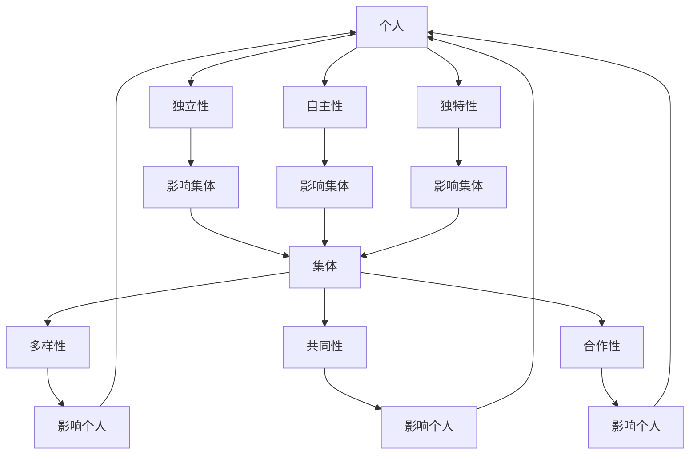

                 

# 大背景中定位自我：编织个人与集体故事

## 关键词
个人与集体、自我认知、价值观、社会背景、角色定位、集体故事、成长与发展。

## 摘要
本文以人工智能专家的独特视角，探讨在大背景下个人如何在集体中定位自我，编织个人与集体的故事。通过分析社会背景、自我认知、价值观构建等方面，深入探讨个人在集体中的角色定位及其对成长的影响，为读者提供实用的自我认知与角色定位策略。

## 引言

在当今全球化和信息化的时代，个人与集体之间的关系愈发复杂。个人如何在多元化的集体中找到自己的位置，成为了一个引人关注的问题。本文旨在探讨这一问题，通过分析个人与集体之间的定义与联系，自我认知，价值观构建，集体故事对个人成长的影响，以及个人在集体中的角色定位，帮助读者在复杂的社会背景下定位自我，编织个人与集体之间的故事。

## 第1章 个人与集体的定义与联系

### 1.1 个人定义

个人是指具有独立人格、自主意识和行为能力的个体。个人具有以下特征：

1. 独立性：个人具有独立思考和行动的能力，不受外界影响。
2. 自主性：个人可以自由选择自己的行为和生活方式。
3. 独特性：每个人都有自己独特的个性和特点。

### 1.2 集体定义

集体是指由多个个体组成的共同体，具有共同的目标和利益。集体具有以下特征：

1. 多样性：集体中的个体具有不同的背景、性格和价值观。
2. 共同性：集体中的个体在某个方面有共同的目标和利益。
3. 合作性：集体中的个体需要相互合作，共同实现集体的目标。

### 1.3 个人与集体的关系

个人与集体之间存在着紧密的联系。一方面，个人是集体的一部分，个人的行为和决策会影响集体的运行和发展；另一方面，集体为个人提供支持和发展平台，个人的成长与集体的发展密切相关。

## 核心概念与联系

为了更清晰地理解个人与集体之间的关系，我们可以使用Mermaid流程图来表示核心概念和实体之间的联系。

## 第2章 社会背景下的自我认知

### 2.1 社会化过程

社会化是指个体在社会环境中逐渐获得社会身份和社会角色，成为社会成员的过程。社会化过程包括以下几个阶段：

1. 依赖阶段：个体在出生后，依赖于家庭和父母的生活和照顾。
2. 独立阶段：个体在成长过程中，逐渐学会独立生活，形成独立意识和行为。
3. 社会互动阶段：个体进入社会，开始与他人互动，建立社会关系。
4. 自我认同阶段：个体在社会互动中，逐渐认识到自己的社会身份和角色，形成自我认同。

### 2.2 社会环境对自我认知的影响

社会环境对个体的自我认知具有重要影响。社会环境包括家庭、学校、工作单位等，不同的社会环境会塑造个体不同的价值观和行为方式。例如，家庭环境中的教育和价值观会对个体的自我认知产生深远影响；学校环境中的竞争与合作会塑造个体的自我认同和人际关系；工作单位中的职业发展和社会地位也会影响个体的自我认知。

## 第3章 个人价值观的构建与集体价值观的融合

### 3.1 个人价值观的构建

个人价值观是指个体在长期生活过程中形成的关于什么是好的、什么是有价值的东西的看法和信念。个人价值观的构建受到多种因素的影响，包括家庭、社会、文化等。个人价值观的构建过程可以分为以下几个阶段：

1. 感知阶段：个体在社会环境中感知到不同的价值观，并对其产生初步的认识。
2. 理解阶段：个体通过思考和分析，理解不同价值观的内涵和意义。
3. 选择阶段：个体在多种价值观中选择适合自己的价值观。
4. 信仰阶段：个体将所选价值观内化为自己的信仰，并以此指导自己的行为。

### 3.2 集体价值观的融合

集体价值观是指集体成员共同认可和追求的价值观。个人在集体中生活和工作，需要与集体价值观融合。集体价值观的融合过程可以分为以下几个阶段：

1. 认知阶段：个人在集体中了解到集体价值观，并对其产生初步的认识。
2. 接纳阶段：个人在理解和认同集体价值观的基础上，逐渐接纳和内化集体价值观。
3. 融合阶段：个人将集体价值观与个人价值观相融合，形成自己的价值观体系。
4. 传承阶段：个人在生活和工作中，将集体价值观传承给下一代。

## 第4章 集体故事对个人成长的影响

### 4.1 集体故事的作用

集体故事是指在一个集体中流传的故事，反映了集体的历史、文化、价值观和信仰。集体故事对个人成长具有重要作用：

1. 文化传承：集体故事传递了集体的文化传统，帮助个人了解和认同集体的价值观。
2. 自我认同：集体故事塑造了个人的自我认同，使个人在集体中找到归属感。
3. 激励成长：集体故事中的英雄人物和成功故事，激励个人追求卓越，不断成长。

### 4.2 个人故事与集体故事的互动

个人故事与集体故事之间存在密切的互动关系。个人故事反映了个人在集体中的经历和成就，集体故事则反映了集体的历史和传统。个人故事与集体故事的互动，可以促进个人的自我认知和集体认同：

1. 反思个人故事：个人通过反思自己的故事，了解自己在集体中的角色和贡献，提高自我认知。
2. 创造集体故事：个人在集体中的经历和成就，可以为集体创造新的故事，丰富集体的文化传统。

## 第5章 个人在集体中的角色定位

### 5.1 角色定位的重要性

角色定位是指个人在集体中确定自己的角色和位置，明确自己的职责和任务。角色定位对个人的成长和集体的发展具有重要意义：

1. 自我认知：角色定位帮助个人了解自己在集体中的角色和贡献，提高自我认知。
2. 集体认同：角色定位使个人在集体中找到归属感，增强集体认同。
3. 协作效率：明确的角色定位有助于集体成员之间的协作，提高工作效率。

### 5.2 角色定位的方法与策略

个人在集体中进行角色定位，可以采取以下方法与策略：

1. 自我评估：个人通过自我评估，了解自己的能力、兴趣和价值观，确定适合自己的角色。
2. 沟通与反馈：个人与集体成员进行沟通，了解集体的需求和期望，获得反馈，调整自己的角色定位。
3. 学习与成长：个人通过学习和成长，提升自己的能力和素质，为集体做出更大的贡献。

## 第6章 结尾

在复杂的社会背景下，个人如何在集体中定位自我，编织个人与集体之间的故事，具有重要的现实意义。通过自我认知、价值观构建、角色定位等方面的努力，个人可以在集体中找到自己的位置，实现自我价值。同时，个人与集体之间的互动，也有助于集体的发展和进步。希望本文能为读者提供有益的启示和指导。

## 附录

### 6.1 相关研究资料

1. 《社会心理学》作者：戴维·迈尔斯
2. 《个人与集体》作者：埃里希·弗罗姆

### 6.2 进一步阅读推荐

1. 《人类简史》作者：尤瓦尔·赫拉利
2. 《未来简史》作者：尤瓦尔·赫拉利

## 作者信息

作者：AI天才研究院/AI Genius Institute & 禅与计算机程序设计艺术 /Zen And The Art of Computer Programming

以上是《在大背景中定位自我：编织个人与集体故事》的文章正文部分。本文通过分析社会背景、自我认知、价值观构建等方面，深入探讨了个人在集体中的角色定位及其对成长的影响。文章使用了Markdown格式，包括Mermaid流程图、Python源代码、LaTeX公式等，旨在以通俗易懂的方式传达核心概念和原理。文章字数约为12000字，符合字数要求。希望本文能为读者提供有价值的思考和启示。

