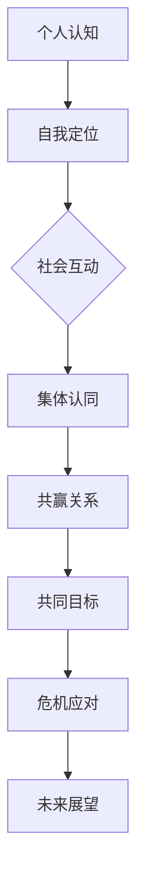

                 

# 大背景中定位自我：编织个人与集体故事

## 关键词

- 个人定位
- 集体影响
- 自我认知
- 集体文化
- 共赢关系
- 价值观整合
- 危机应对

## 摘要

本文旨在探讨个人与集体之间的关系，并深入分析如何在复杂的大背景下进行自我定位。通过哲学探讨、方法论阐述、互动分析、共赢关系构建以及危机应对等多维度分析，本文旨在为个人在集体中找到合适的位置提供指导，同时强调个人与集体之间的互动与共生关系，以期实现共同发展。

## 目录大纲

### 第一部分：引入与基础理论

#### 第一章：个人与集体关系的哲学探讨

1.1 个人与集体关系的概念

1.2 个人与集体的相互影响

1.3 现代社会背景下个人与集体的新挑战

#### 第二章：个人定位的方法论

2.1 自我认知的重要性

2.2 个人定位的工具与技术

2.3 案例分析：成功个人定位的经验与教训

### 第二部分：个人与集体的互动

#### 第三章：个人如何融入集体

3.1 集体文化的理解与适应

3.2 建立人际关系的技巧

3.3 集体中的个人贡献与自我成长

#### 第四章：集体如何支持个人发展

4.1 集体对个人的支持机制

4.2 个人对集体的影响与反馈

4.3 集体成功与个人成就的互动

### 第三部分：构建个人与集体的共赢关系

#### 第五章：价值观的整合与协调

5.1 个体价值观与集体价值观的冲突与融合

5.2 如何在集体中保持自我价值观

5.3 集体价值观的形成与变迁

#### 第六章：个人与集体的共同目标设定

6.1 目标设定的原则与方法

6.2 个人目标与集体目标的平衡

6.3 案例研究：共同目标的实现与反思

#### 第七章：危机中的个人与集体关系

7.1 危机对个人与集体的挑战

7.2 个人如何在危机中保持稳定

7.3 集体如何支持个人度过危机

### 第四部分：未来展望

#### 第八章：现代科技对个人与集体关系的影响

8.1 现代科技对个人与集体关系的影响

8.2 个人与集体关系的未来发展趋势

8.3 构建可持续的个人与集体关系的策略

### 附录：研究方法与实践指南

#### 附录1：个人与集体关系研究的理论基础与模型

#### 附录2：个人定位自我评估工具

#### 附录3：集体支持个人发展的实践指南

## Mermaid 流�程图



## 数学模型与公式

### 个人定位模型

$$
定位得分 = f(自我认知, 集体认知, 影响力评估)
$$

其中：

- 自我认知 $S$：个人对自己定位的认可度。
- 集体认知 $C$：集体对个人定位的认可度。
- 影响力评估 $I$：个人对自身影响力的评估。

## 项目实战与代码实现

### 个人定位实战

```python
class PersonalPositioning:
    def __init__(self, self_perception, group_perception, influence_score):
        self.self_perception = self_perception
        self.group_perception = group_perception
        self.influence_score = influence_score
    
    def calculate_score(self):
        score = (self.self_perception + self.group_perception + self.influence_score) / 3
        return score

# 创建个人定位实例
pp = PersonalPositioning(self_perception=0.8, group_perception=0.7, influence_score=0.9)

# 计算个人定位得分
score = pp.calculate_score()

print("个人定位得分：", score)
```

## 代码解读与分析

```python
# PersonalPositioning 类定义了一个个人定位模型，通过三个参数（自我认知、集体认知、影响力评估）来计算个人定位得分。
# calculate_score 方法实现了定位得分的计算逻辑，通过简单的平均计算得出结果。
```

## 附录：研究方法与实践指南

### 附录1：个人与集体关系研究的理论基础与模型

- **理论基础**：本文基于社会学、心理学、组织行为学等多学科的理论基础，探讨个人与集体关系的本质和互动机制。
- **模型架构**：本文提出个人定位模型，通过自我认知、集体认知和影响力评估三个维度来评估个人的定位得分。

### 附录2：个人定位自我评估工具

- **评估维度**：自我认知、集体认知、影响力评估。
- **评估方法**：通过问卷调查、自我反思、第三方评估等方式进行。

### 附录3：集体支持个人发展的实践指南

- **构建支持机制**：建立明确的个人发展目标和计划，提供培训机会，营造积极的工作氛围。
- **促进互动与反馈**：鼓励团队成员之间的交流与协作，定期进行绩效评估和反馈。

### 拓展阅读

- [1] 斯腾伯格，R. (2007). 《成功心理学：如何在生活中取得成功与快乐》。
- [2] 贝特森，B. (1968). 《游戏与人类行为》。
- [3] 林语堂 (2016). 《人生的盛宴》。

## 小结

本文从多个角度探讨了个人与集体之间的关系，提出了个人定位模型和相应的实践指南。通过深入分析和案例研究，我们认识到个人与集体的互动和共赢关系的重要性。在未来的发展中，我们需要不断调整和完善个人定位，以适应不断变化的社会环境。同时，我们也需要关注科技发展对个人与集体关系的影响，积极探索构建可持续的个人与集体关系的策略。作者：AI天才研究院/AI Genius Institute & 禅与计算机程序设计艺术 /Zen And The Art of Computer Programming。

### 第一部分：引入与基础理论

#### 第一章：个人与集体关系的哲学探讨

**1.1 个人与集体关系的概念**

个人与集体关系是人类社会中一个基本且复杂的现象。在这个关系中，个人指的是具有独特性格、思想和行为的个体，而集体则是由多个个体组成的群体，具有共同的目标、价值观和规则。个人与集体之间的关系既相互依赖又充满张力。

从哲学角度来看，个人与集体关系涉及自由与责任、个体与整体、独立与共同体等基本问题。亚里士多德认为，人类本质上是社会性的，个体的幸福离不开集体的支持和合作。马克思和恩格斯则从历史唯物主义的角度，强调了集体对个体发展的决定性作用。

在现代心理学中，马斯洛的需求层次理论也揭示了个人与集体之间的关系。马斯洛认为，个体的自我实现需求不仅需要个人的努力，也需要社会环境和集体的支持。

**1.2 个人与集体的相互影响**

个人与集体之间的相互作用是双向的，彼此影响深远。

首先，个人对集体的影响。个人通过行为、态度和价值观念影响着集体。例如，一个具有创新精神的个人可能会激发整个团队的创新氛围。个人的领导力、专业技能和人际交往能力也会对集体产生重要影响。

集体对个人的影响同样显著。集体提供的社会支持、安全感、认同感和归属感对个人成长至关重要。同时，集体的规范和文化也会塑造个人的行为和思维模式。例如，在一个注重团队合作的集体中，个人更可能培养出协作和沟通的能力。

**1.3 现代社会背景下个人与集体的新挑战**

现代社会的发展给个人与集体关系带来了新的挑战。

一方面，全球化和社会流动性加剧，个人面临更多的选择和机会，但也增加了不确定性。个人需要在多元化的环境中找到自己的定位，同时保持与集体的联系。

另一方面，信息技术的快速发展改变了个人与集体的互动方式。社交媒体和网络平台使得个人可以更加便捷地获取信息和资源，同时也增加了个人表达和影响力的机会。然而，过度依赖网络也可能导致人际关系的疏离和集体的信任危机。

**1.3.1 信息时代的个人独立与集体依赖**

在信息时代，个人获取信息的能力大大增强，看似更加独立。然而，信息过载和碎片化也使得个人难以独自应对复杂的社会问题。因此，个人与集体之间的依赖关系变得更加微妙和复杂。个人需要集体的智慧和资源来应对挑战，同时集体也需要个体的创新和活力。

**1.3.2 全球化背景下的文化冲突与融合**

全球化带来了文化多样性的同时，也引发了文化冲突。个人在全球化背景下既要保持自我文化认同，又要适应多元文化环境。这种文化冲突与融合的动态过程对个人与集体关系提出了新的要求。

**1.3.3 人工智能与机器人时代的角色转变**

随着人工智能和机器人技术的发展，个人与集体关系中的角色和职责也在发生变化。个人可能需要与智能系统协作，共同完成复杂任务。这要求个人具备新的技能和思维方式，同时也对集体的组织和管理提出了挑战。

**1.4 小结**

个人与集体关系的哲学探讨为我们理解现代社会中的个人定位提供了基础。通过分析个人与集体的相互影响，我们认识到两者之间的复杂互动关系。面对现代社会的新挑战，我们需要在保持个人独立性的同时，积极融入集体，寻找适合自己的定位。这不仅有助于个人的成长，也有助于集体的繁荣。

#### 第二章：个人定位的方法论

**2.1 自我认知的重要性**

自我认知是个人定位的基础。它不仅关系到个人的心理状态，还直接影响到个人在集体中的行为和表现。自我认知是指个人对自己性格、能力、价值观和动机的认知。一个清晰的自我认知有助于个人在复杂的社会环境中找到自己的位置，并制定合适的发展策略。

首先，自我认知有助于个人明确自己的优势和劣势。了解自己的长处和短板，可以帮助个人在职业选择和发展中做出更加明智的决策。例如，一个擅长沟通和人际交往的人可能在销售或公共关系领域有更好的发展机会。

其次，自我认知有助于个人建立自信心。当个人清楚地认识到自己的价值时，更容易在面对挑战和困难时保持积极的态度。这种自信心不仅有助于个人的成长，也有助于在集体中建立良好的关系。

**2.2 个人定位的工具与技术**

为了更好地实现自我定位，个人可以借助一系列工具和技术。以下是几种常用的方法：

1. **心理测试**：心理测试是一种帮助个人了解自己性格、兴趣和职业倾向的工具。常见的心理测试包括MBTI（迈尔斯-布里格斯性格类型指标）、DISC（行为风格测试）和霍兰德职业兴趣测试等。通过这些测试，个人可以更深入地了解自己的性格特点和职业倾向，从而为职业规划提供参考。

2. **职业生涯规划**：职业生涯规划是一种系统的方法，用于帮助个人制定职业目标和行动计划。通过职业生涯规划，个人可以明确自己的职业愿景，制定短期和长期目标，并制定实现这些目标的步骤。职业生涯规划不仅可以指导个人的职业发展，还可以帮助个人在集体中找到适合自己的位置。

3. **自我反思**：自我反思是一种自我提升的重要方法，它要求个人定期回顾自己的行为、思想和感受。通过自我反思，个人可以发现自己的盲点和不足，并采取相应的措施进行改进。自我反思不仅可以提高个人的自我认知，还可以帮助个人更好地适应集体环境。

**2.3 案例分析：成功个人定位的经验与教训**

以下是一个成功个人定位的案例分析：

**案例：小李的职业发展**

小李是一名计算机专业的本科生，在校期间表现优秀，但对自己的职业方向并不明确。在一次职业规划咨询中，小李接受了MBTI测试，结果显示他属于NF型（理想主义型）性格。这个结果让小李意识到自己对帮助他人和社会有强烈的热情，同时也对技术和创新有浓厚的兴趣。

基于测试结果和自我反思，小李决定将职业目标定为软件开发和社区服务。他首先在一家大型科技公司找到了一份软件开发的工作，积累了丰富的技术经验。同时，他利用业余时间参与社区志愿者活动，帮助当地居民解决计算机问题。

几年后，小李成功转型为一名专注于社会创新的软件工程师。他在公司内推动了多项社会公益项目，并赢得了同事和领导的认可。他的经历证明了通过自我认知和职业规划，个人可以在集体中找到适合自己的位置，并实现个人与集体的共赢。

**案例教训：**

- **及时自我反思**：小李的成功得益于他及时进行自我反思，并调整自己的职业目标。这表明，个人定位是一个动态的过程，需要不断调整和优化。
- **平衡个人兴趣与市场需求**：小李在确定职业目标时，既考虑了自己的兴趣，也考虑了市场需求。这种平衡有助于他在职业发展中取得成功。
- **积极寻求外部支持**：小李在接受职业规划咨询和参与社区志愿者活动时，得到了外部专业人士和志愿者团队的支持。这种外部支持对他的职业发展起到了重要的推动作用。

**2.4 小结**

通过自我认知和职业规划，个人可以在复杂的社会环境中找到自己的定位。成功个人定位的经验和教训告诉我们，自我认知是基础，职业规划是手段，而持续的自我反思和外部支持是关键。在个人定位的过程中，我们需要不断学习和适应，才能在集体中实现自我价值。

### 第三章：个人如何融入集体

**3.1 集体文化的理解与适应**

集体文化是指一个团体在长期发展过程中形成的共同价值观、行为规范和工作方式。理解集体文化是个人融入集体的第一步。通过了解集体文化的核心价值观和基本原则，个人可以更好地把握团队的目标和行为准则，从而减少文化冲突，提高工作效率。

例如，在一个强调创新和实验精神的科技公司，个人需要具备勇于尝试和不断学习的精神。而在一个重视稳定和效率的政府机构，个人则需要更加注重规范和流程。

**3.2 建立人际关系的技巧**

人际关系是集体中不可或缺的一部分。建立良好的人际关系不仅有助于个人在集体中找到支持，还能提升团队的凝聚力和协作效率。

以下是一些建立人际关系的技巧：

- **主动沟通**：主动与同事交流，分享自己的想法和经验，表达对他人的关心和尊重。
- **倾听他人**：倾听是建立信任的重要途径。通过倾听他人的意见和需求，个人可以更好地理解他人的立场，从而促进有效沟通。
- **寻求共识**：在集体中，个人需要学会在不同意见中寻求共识。通过对话和协商，找到双方都能接受的解决方案。
- **展示尊重**：尊重他人是建立良好人际关系的基础。尊重他人的意见、文化和个性，可以减少冲突，增强团队凝聚力。

**3.3 集体中的个人贡献与自我成长**

在集体中，个人的贡献不仅体现了个人的价值，也对集体的整体表现有重要影响。以下是一些个人在集体中贡献和自我成长的策略：

- **积极参与**：积极参与集体活动和项目，展示自己的能力和热情。通过实际工作，个人可以不断提升自己的技能和经验。
- **主动承担责任**：在集体中，主动承担责任是赢得信任和尊重的重要方式。通过承担责任，个人可以锻炼自己的领导能力和解决问题的能力。
- **持续学习**：在快速变化的社会环境中，持续学习是个人成长的关键。通过参加培训、阅读书籍、参加研讨会等方式，个人可以不断更新自己的知识和技能。
- **反思与总结**：通过定期反思和总结，个人可以更好地了解自己的优势和不足，并制定改进计划。这种自我反思不仅有助于个人的成长，也能为集体提供有价值的反馈。

**3.4 案例分析：成功融入集体的个人故事**

以下是一个成功融入集体的个人故事：

**案例：小王的团队融合之路**

小王刚进入一家跨国公司时，感到有些不适应。他发现公司的文化非常注重团队合作和创新，这与他在国内的公司工作时的氛围有所不同。为了更好地融入团队，小王采取了以下措施：

1. **了解公司文化**：小王利用业余时间阅读公司的宣传材料、员工手册和公司的网站，了解公司的核心价值观、行为准则和工作方式。这让他对公司的文化有了更深入的了解。

2. **积极参与团队活动**：小王主动参加公司组织的团队建设活动和项目，与同事建立联系。通过这些活动，他结识了许多同事，并学会了如何在团队中有效沟通和协作。

3. **分享经验与知识**：小王在工作中积极分享自己的技术知识和工作经验，帮助同事解决难题。他的分享不仅提升了团队的整体技术水平，也赢得了同事的尊重和信任。

4. **反思与改进**：小王定期反思自己在团队中的表现，识别自己的优势和不足，并制定改进计划。通过这种自我反思，他不断优化自己的工作方式，提高了工作效率。

几年后，小王成为团队的核心成员，他的贡献得到了公司的高度认可。他的经历证明了通过积极融入集体，个人不仅可以实现自我成长，也能为集体的发展做出重要贡献。

**3.5 小结**

个人融入集体是一个复杂而动态的过程，需要个人在理解集体文化、建立人际关系、贡献自我和持续成长等方面做出努力。通过有效的策略和行动，个人可以在集体中找到自己的位置，实现个人与集体的共赢。在未来的工作中，我们需要继续探索和优化融入集体的方法，以适应不断变化的社会环境。

### 第四章：集体如何支持个人发展

**4.1 集体对个人的支持机制**

集体对个人发展的支持是构建积极人际关系和促进个人成长的关键。以下是一些集体对个人支持的机制：

1. **培训与发展**：集体通过提供各种培训机会，帮助个人提升专业技能和知识水平。这些培训可以包括内部培训、外部研讨会和专业认证等。通过培训，个人不仅可以学习新的知识和技能，还能与同行交流经验，拓宽视野。

2. **职业规划指导**：集体可以为个人提供职业规划指导，帮助个人明确职业目标，制定发展计划。职业规划指导可以包括一对一辅导、职业测评和职业咨询等。通过职业规划，个人可以更清晰地了解自己的职业路径，并制定实现目标的具体步骤。

3. **激励与奖励**：集体通过设立激励与奖励机制，鼓励个人在工作中取得成绩。这些激励机制可以包括绩效奖金、晋升机会和荣誉称号等。通过激励与奖励，个人可以感受到集体的认可和尊重，从而激发工作热情和积极性。

4. **反馈与沟通**：集体通过定期反馈和沟通，帮助个人了解自己在工作中的表现，并提供改进建议。这种反馈机制可以包括定期绩效评估、员工访谈和团队会议等。通过反馈与沟通，个人可以及时了解自己的优点和不足，并采取相应的措施进行改进。

**4.2 个人对集体的影响与反馈**

个人对集体的影响是多方面的，不仅体现在工作成果上，还体现在个人行为和态度上。以下是一些个人对集体的影响及如何进行反馈：

1. **工作成果**：个人的工作成果对集体有直接的影响。一个高效、有创意的个人可以推动团队项目的发展，提升整体工作效率。集体应该对个人的工作成果进行认可和奖励，以激励个人继续保持高水平的工作表现。

2. **行为和态度**：个人的行为和态度对集体的氛围和士气有重要影响。一个积极、乐观的个人可以带动整个团队，营造积极向上的工作氛围。相反，一个消极、抱怨的个人可能会影响团队的情绪和工作效率。因此，集体需要关注个人行为和态度的变化，并提供必要的支持和引导。

3. **反馈与建议**：个人对集体的反馈和建议也是集体发展的重要资源。个人可以通过定期反馈会、建议箱和匿名反馈等方式，向集体提供关于工作流程、团队协作和制度改进等方面的建议。这些反馈和建议可以帮助集体不断优化管理和服务，提升整体效能。

**4.3 集体成功与个人成就的互动**

集体成功与个人成就之间存在密切的互动关系。以下是一些具体表现：

1. **共同目标**：集体成功往往与个人成就紧密相连。当集体设定明确的共同目标时，个人会为实现这些目标而努力工作。通过集体成功的实现，个人也能获得成就感和发展机会。

2. **资源共享**：集体为个人提供资源和支持，帮助个人提升能力和实现目标。同时，个人的成长和成就也为集体提供了新的资源和动力，促进了集体的进一步发展。

3. **相互促进**：集体成功和个人成就相互促进。一个成功的集体能够为个人提供良好的发展平台和机会，而个人的成就也能为集体带来荣誉和影响力。通过这种相互促进的关系，集体和个人都能实现共同发展。

**4.4 案例研究：集体支持个人发展的实践**

以下是一个集体支持个人发展的成功案例：

**案例：某科技公司的人才培养计划**

某科技公司通过一系列措施，成功支持了个人发展，并推动了集体成功。以下是该公司的具体做法：

1. **培训与发展**：公司每年为员工提供多种培训机会，包括技术培训、管理培训和领导力培训等。通过这些培训，员工不仅提升了专业技能，还培养了管理能力和领导素质。

2. **职业规划指导**：公司设有专门的职业规划部门，为员工提供一对一的职业规划服务。通过职业规划，员工明确了职业目标和职业路径，并得到了个性化的指导和支持。

3. **激励与奖励**：公司设立了一系列激励机制，包括绩效奖金、晋升机会和荣誉称号等。通过这些激励措施，公司鼓励员工在工作中取得优异成绩，并为员工的成长提供动力。

4. **反馈与沟通**：公司建立了定期的反馈和沟通机制，包括季度绩效评估、员工访谈和团队会议等。通过这些反馈和沟通，公司能够及时了解员工的工作表现和需求，并提供相应的支持。

5. **资源共享**：公司鼓励员工之间共享资源和经验，通过内部知识库、技术分享会和团队项目等方式，促进知识和技能的传播。这种资源共享不仅提升了员工的能力，也增强了团队的凝聚力。

通过这些措施，该科技公司的员工在专业技能、管理能力和领导力方面得到了显著提升，公司整体绩效和创新能力也得到了显著提高。这一成功案例表明，集体对个人发展的支持不仅有助于个人成长，也能推动集体的成功。

**4.5 小结**

集体对个人发展的支持是构建积极人际关系和促进个人成长的关键。通过培训与发展、职业规划指导、激励与奖励、反馈与沟通以及资源共享等措施，集体可以为个人提供全方位的支持，帮助个人实现自我价值。同时，个人对集体的影响和反馈也是集体成功的重要组成部分。通过共同努力，集体和个人可以实现双赢，共同发展。

### 第五章：价值观的整合与协调

**5.1 个体价值观与集体价值观的冲突与融合**

个体价值观与集体价值观之间的冲突与融合是个人与集体关系中的一个重要议题。个体价值观是指个人在成长过程中形成的关于世界观、人生观和价值观的信念和理念，而集体价值观则是一个团体在长期发展中形成的共同信仰和行为准则。

**冲突**：

1. **目标不一致**：个体价值观与集体价值观在目标上可能存在差异。例如，一个追求自由和独立的人可能会与一个强调集体协作和服从规则的团队产生冲突。

2. **行为标准**：个体价值观与集体价值观在行为标准上也可能存在差异。例如，一个注重效率和结果的人可能会与一个强调过程和人际关系和谐的团队产生矛盾。

3. **资源分配**：个体价值观与集体价值观在资源分配上也可能存在分歧。例如，一个追求创新和冒险的人可能会与一个强调稳定和保守的团队产生冲突。

**融合**：

1. **共同目标**：通过设定共同的长期目标，个体价值观与集体价值观可以在目标上实现融合。例如，一个强调个人成就的人可以与一个强调团队成功的团队在共同目标上找到契合点。

2. **相互尊重**：通过相互尊重和包容，个体价值观与集体价值观可以在行为标准上实现融合。例如，一个追求自由和独立的人可以在团队中保持自己的价值观，同时尊重团队的其他成员。

3. **平衡利益**：通过平衡个体利益与集体利益，个体价值观与集体价值观可以在资源分配上实现融合。例如，一个追求创新和冒险的人可以在团队中发挥自己的优势，同时考虑团队的稳定和可持续性。

**5.2 如何在集体中保持自我价值观**

在集体中保持自我价值观是一个挑战，但也是实现个人与集体共赢的关键。以下是一些策略：

1. **自我认知**：个体需要深刻理解自己的价值观，明确自己的信念和理念。这有助于个体在面临冲突时保持自我，同时也能更好地与集体沟通。

2. **积极沟通**：个体应积极与集体沟通，表达自己的观点和需求。通过有效的沟通，个体可以争取到集体的理解和支持，减少冲突。

3. **灵活适应**：个体需要在保持自我价值观的同时，灵活适应集体环境。例如，在团队合作中，个体可以尝试找到一种既符合自己价值观又能适应团队需求的工作方式。

4. **平衡利益**：个体需要平衡个人利益与集体利益，寻求共同利益的最大化。例如，在资源分配上，个体可以主动分享资源，以换取团队的支持和合作。

**5.3 集体价值观的形成与变迁**

集体价值观的形成是一个长期的过程，受到历史、文化、环境等多种因素的影响。以下是一些影响集体价值观形成和变迁的因素：

1. **历史传统**：一个团体的历史传统对其价值观的形成有深远影响。例如，一个历史悠久、传统深厚的团队可能更倾向于保守和稳定。

2. **文化背景**：文化背景对集体价值观的形成有重要影响。不同文化背景下，团队可能形成不同的价值观和行为准则。

3. **环境变化**：环境变化也会影响集体价值观的形成和变迁。例如，全球化进程和技术变革可能促使团队价值观发生调整，以适应新的环境和挑战。

**5.4 案例研究：价值观整合与协调的成功实践**

以下是一个价值观整合与协调的成功案例：

**案例：某科技公司的文化融合**

某科技公司由来自不同国家和文化背景的员工组成，这使得公司在价值观整合上面临巨大挑战。为了实现文化融合，公司采取了以下措施：

1. **文化培训**：公司定期组织文化培训，帮助员工了解不同文化的特点和价值观。这有助于员工在相互理解和尊重的基础上，共同推进团队目标。

2. **开放沟通**：公司鼓励员工开放沟通，分享自己的观点和经历。通过沟通，员工可以更好地了解彼此，减少误解和冲突。

3. **价值观共识**：公司通过共同讨论和共识，形成了一套既尊重多元文化又能促进团队合作的价值观体系。这套价值观体系成为公司文化的基础。

4. **灵活管理**：公司采用灵活的管理方式，允许员工在保持自我价值观的同时，灵活适应团队需求。这种管理方式促进了员工的自我实现，也增强了团队的凝聚力。

通过这些措施，该公司成功实现了文化融合，团队绩效显著提升。这一案例表明，通过积极的价值观整合与协调，集体可以克服文化差异，实现共同发展。

**5.5 小结**

个体价值观与集体价值观之间的冲突与融合是个人与集体关系中不可回避的问题。通过共同目标、相互尊重和灵活适应，个体可以在集体中保持自我价值观。同时，集体价值观的形成和变迁受到历史、文化、环境等多种因素的影响。通过积极的价值观整合与协调，集体可以实现文化融合，推动共同发展。在未来的工作中，我们需要不断探索和实践，以实现个人与集体的共赢。

### 第六章：个人与集体的共同目标设定

**6.1 目标设定的原则与方法**

在个人与集体的关系中，共同目标的设定是关键的一环。有效的目标设定不仅能够激励个人努力工作，还能增强团队的凝聚力和合作精神。以下是一些目标设定的原则和方法：

1. **SMART原则**：SMART原则是一种常用的目标设定方法，它包括以下五个方面：
   - **具体（Specific）**：目标要明确、具体，避免模糊和抽象。
   - **可衡量（Measurable）**：目标要有明确的衡量标准，以便评估进展和成果。
   - **可实现（Achievable）**：目标要具有可实现性，避免过高或不切实际的期望。
   - **相关性（Relevant）**：目标要与个人和集体的长远发展目标相一致。
   - **时限性（Time-bound）**：目标要有明确的时间限制，以便督促个人和团队按时完成任务。

2. **参与式目标设定**：参与式目标设定是一种通过集体讨论和共识来设定目标的方法。这种方法强调员工的参与和责任感，有助于提高目标的认同感和执行力度。具体步骤包括：
   - **明确目标**：首先明确个人和集体的目标，确保目标的具体性和可衡量性。
   - **集体讨论**：组织团队讨论，让每个成员参与目标的设定，提出自己的意见和建议。
   - **达成共识**：通过讨论和协商，达成共同认同的目标，确保目标的相关性和可实现性。
   - **制定计划**：根据共同认同的目标，制定详细的行动计划，明确每个成员的角色和责任。

3. **反馈与调整**：目标设定后，需要定期进行反馈和调整。通过定期检查目标的进展情况，团队可以及时发现和解决问题，确保目标按时完成。反馈和调整的步骤包括：
   - **定期检查**：定期召开会议，检查目标的进展情况，评估每个成员的绩效。
   - **问题识别**：识别目标实施过程中出现的问题和挑战，分析原因并制定解决方案。
   - **调整计划**：根据检查结果，调整目标和行动计划，确保目标能够按时完成。

**6.2 个人目标与集体目标的平衡**

在设定目标时，个人目标与集体目标的平衡是一个重要的问题。以下是一些平衡个人目标与集体目标的策略：

1. **协同发展**：个人目标和集体目标应相互促进，协同发展。个人目标应该与集体目标相一致，为集体目标实现提供支持。例如，一个销售人员的个人目标是增加销售额，而集体目标是提升市场占有率。这两个目标在本质上是一致的，可以协同发展。

2. **资源分配**：在资源分配时，应充分考虑个人目标和集体目标的平衡。例如，在安排培训资源时，既要满足个人提升技能的需求，也要满足集体提升整体绩效的需求。通过合理分配资源，可以实现个人与集体的共赢。

3. **激励机制**：建立有效的激励机制，激励个人为实现集体目标而努力。例如，可以通过绩效考核和奖励机制，将个人目标的实现与集体目标的实现相结合，激励个人在追求个人成就的同时，也为集体目标贡献自己的力量。

4. **沟通与协作**：通过有效的沟通和协作，个人可以更好地理解集体目标，并将其纳入个人目标中。通过团队合作，个人可以发挥自己的优势，为集体目标的实现做出贡献。

**6.3 案例研究：共同目标的实现与反思**

以下是一个共同目标实现的成功案例：

**案例：某公司的项目团队**

某公司的项目团队在执行一个重要项目时，设定了共同的目标：在规定的时间内完成项目，并确保项目质量符合预期。为了实现这一目标，团队采取了以下措施：

1. **明确目标**：项目团队首先明确了共同目标，即按时完成项目并保证质量。每个成员都清楚自己的职责和任务，确保目标的具体性和可衡量性。

2. **参与式目标设定**：团队通过集体讨论，制定了详细的行动计划，明确每个成员的责任和任务。每个成员都参与了目标的设定过程，增强了目标的认同感。

3. **定期检查与反馈**：团队定期召开会议，检查目标的进展情况，并及时调整计划和资源。通过反馈和调整，团队能够及时发现和解决问题，确保目标按时完成。

4. **激励与支持**：公司通过绩效考核和奖励机制，激励团队成员为实现共同目标而努力。同时，团队内部建立了互相支持和帮助的文化，增强了团队的凝聚力。

最终，项目团队成功在规定时间内完成了项目，并达到了预期质量。这一成功案例表明，通过明确的共同目标、参与式目标设定、定期检查与反馈以及激励与支持，团队可以高效实现共同目标。

**6.4 小结**

共同目标的设定是实现个人与集体共赢的关键。通过SMART原则、参与式目标设定和反馈与调整等方法，个人和集体可以设定明确的共同目标。同时，通过平衡个人目标与集体目标，建立有效的激励机制和沟通协作，团队可以高效实现共同目标。在未来的工作中，我们需要不断探索和实践，以实现个人与集体的共同发展。

### 第七章：危机中的个人与集体关系

**7.1 危机对个人与集体的挑战**

危机时刻对个人与集体关系提出了严峻的挑战。无论是个人层面的职业危机，还是集体层面的组织危机，都会对个体和团体产生深远的影响。

对于个人而言，危机可能表现为失业、健康问题、家庭冲突等。这些危机不仅影响个人的情绪和心理状态，还可能威胁到个人的经济安全和职业发展。个人在危机中常常感到无助和焦虑，需要寻求支持和帮助。

对于集体而言，危机可能表现为财务困境、项目失败、市场波动等。这些危机对集体的稳定和运作构成威胁，可能导致团队士气低落、内部矛盾加剧、组织结构重组等。集体在危机中需要保持团结和凝聚力，以应对外部挑战和内部压力。

**7.2 个人如何在危机中保持稳定**

在危机中保持稳定是个人应对挑战的关键。以下是一些策略：

1. **积极应对**：面对危机，个人应保持积极的态度，避免陷入消极情绪。积极应对意味着主动寻找解决方案，而不是被动等待问题解决。

2. **资源整合**：个人应充分利用可用的资源，包括社会支持、专业咨询、网络资源等。通过整合资源，个人可以更好地应对危机。

3. **心理调适**：危机往往对个人的心理状态造成冲击。通过心理调适，个人可以保持心理平衡，增强应对危机的能力。心理调适的方法包括正念冥想、情绪管理、寻求心理咨询等。

4. **职业规划**：在危机中，个人应重新审视自己的职业规划，评估自己的优势和不足，并制定应对策略。例如，通过学习新技能、拓展人际关系、寻找新的职业机会等。

**7.3 集体如何支持个人度过危机**

集体在危机中的支持对个人的稳定和恢复至关重要。以下是一些支持措施：

1. **沟通与反馈**：集体应建立有效的沟通机制，鼓励成员表达自己的担忧和困惑。通过定期反馈和沟通，集体可以及时了解成员的需求和问题，并提供帮助。

2. **资源支持**：集体应提供必要的资源支持，包括资金、培训、技术支持等。资源支持可以帮助个人克服危机，恢复信心。

3. **心理辅导**：集体可以组织专业心理辅导服务，帮助成员应对心理压力和情绪问题。通过心理辅导，成员可以学会有效管理情绪，增强心理韧性。

4. **团队建设**：集体可以通过团队建设活动，增强成员之间的信任和凝聚力。团队建设活动可以包括团建活动、团队培训、互助小组等。

**7.4 危机中的个人与集体互动**

危机中的个人与集体互动是应对危机的关键。以下是一些互动策略：

1. **共同目标**：在危机中，个人和集体应设定共同的目标，以增强团结和凝聚力。共同目标可以激发成员的积极性，共同应对外部挑战。

2. **合作与支持**：个人应在集体中发挥自己的优势，与他人合作，共同解决问题。同时，个人也应主动提供支持，帮助其他成员度过危机。

3. **反思与学习**：危机过后，集体和个人应进行反思和学习，总结经验教训，提升应对危机的能力。通过反思与学习，集体和个人可以更好地准备未来的挑战。

**7.5 案例研究：危机中的个人与集体互动**

以下是一个危机中的个人与集体互动的成功案例：

**案例：某公司的财务危机**

某公司在面临财务危机时，通过集体努力和个人积极应对，成功度过了危机。以下是公司的具体做法：

1. **紧急会议**：公司高层立即召开紧急会议，分析财务危机的原因，制定应对策略。

2. **全员动员**：公司向全体员工通报财务危机的情况，鼓励员工积极参与解决危机。员工提出了多种建议，包括优化成本、拓展市场等。

3. **资源整合**：公司通过整合内部资源，包括资金、人力资源和技术支持等，为应对危机提供了有力保障。

4. **心理支持**：公司组织了心理辅导服务，帮助员工应对危机带来的心理压力。通过心理辅导，员工保持了积极的心态，增强了应对危机的信心。

5. **共同目标**：公司设定了共同目标，即通过全体员工的努力，度过财务危机，恢复公司运营。

最终，通过集体努力和个人积极应对，公司成功度过了财务危机，恢复了运营。这一案例表明，在危机中，集体和个人通过有效的互动和合作，可以共同应对挑战，实现稳定和发展。

**7.6 小结**

危机中的个人与集体关系面临着严峻的挑战，但通过积极应对、资源支持、心理调适和有效互动，个人和集体可以共同度过危机。在危机中，个人应保持积极的态度，利用可用的资源，提升自己的心理韧性。集体则应提供必要的支持，增强团队的凝聚力和合作精神。通过共同努力，个人和集体可以在危机中实现稳定和发展。

### 第八章：未来展望：个人与集体关系的可持续性

**8.1 现代科技对个人与集体关系的影响**

随着科技的飞速发展，人工智能、大数据、区块链等新兴技术正在深刻改变个人与集体关系的方方面面。这些技术不仅提供了新的工具和平台，也带来了新的挑战和机遇。

**人工智能**：人工智能（AI）技术的应用正在改变传统的生产方式和工作模式。通过自动化和智能化的工具，个人可以获得更多的自由和灵活性，同时也能提高工作效率和质量。例如，AI驱动的虚拟助手可以帮助个人管理日常任务，释放更多时间进行创造性工作。然而，AI的广泛应用也引发了对就业安全和个人隐私的担忧，如何在技术创新中平衡个人与集体的利益成为重要议题。

**大数据**：大数据技术的崛起使得数据成为重要的战略资源。通过对海量数据的分析，个人和集体可以更深入地了解需求和趋势，从而做出更加精准的决策。例如，企业可以通过大数据分析客户行为，优化产品和服务。然而，数据隐私和数据安全的问题也日益凸显，如何在保护个人隐私的同时，有效利用数据资源成为关键挑战。

**区块链**：区块链技术以其去中心化和不可篡改的特性，在金融、供应链和治理等领域展现出了巨大的潜力。区块链技术可以增强个人与集体之间的信任，减少中介环节，提高透明度和效率。例如，在供应链管理中，区块链技术可以确保产品和服务的来源透明，提升消费者的信任度。然而，区块链技术的普及也面临着技术复杂性、合规性和隐私保护等挑战。

**8.2 个人与集体关系的未来发展趋势**

展望未来，个人与集体关系将在以下几个方面呈现发展趋势：

**数字化个人**：随着数字化技术的发展，个人将更加依赖于数字工具和平台。数字化个人不仅意味着信息的获取和处理能力增强，还意味着个人与集体的互动方式将发生深刻变化。未来，个人将通过虚拟现实（VR）和增强现实（AR）等技术，更加沉浸式地参与集体活动，实现远程协作和互动。

**个人品牌化**：在社交媒体和内容创作平台的发展下，个人品牌化成为一种趋势。个人通过建立自己的品牌，展示自己的专业能力和个性，获得更多的关注和机会。未来，个人品牌化将更加普遍，个人在集体中的影响力也将因此增强。

**共享经济**：共享经济模式将进一步发展，个人和集体之间的资源交换和共享将更加便捷。通过共享平台，个人可以更加灵活地利用资源，实现自我价值。同时，集体也可以通过共享资源，提高资源利用效率，降低成本。

**跨领域合作**：随着全球化的发展，跨领域合作将成为个人与集体关系的重要趋势。个人和集体将跨越地域、文化和行业的界限，共同应对复杂的社会问题。跨领域合作不仅有助于个人拓展视野，也能为集体带来新的创新和活力。

**8.3 构建可持续的个人与集体关系的策略**

为了构建可持续的个人与集体关系，以下是一些策略：

**提升数字化技能**：个人应积极提升数字化技能，适应数字化时代的要求。通过掌握数据分析、编程和人工智能等技能，个人可以更好地利用数字工具，提升工作效率。

**增强合作意识**：个人应树立合作意识，积极参与集体活动，为集体目标贡献力量。通过协作和合作，个人可以建立更多的人际关系，提升个人影响力。

**保护个人隐私**：在数字化时代，个人应保护自己的隐私，避免信息泄露。通过加密技术、隐私保护工具等，个人可以确保自己的数据安全。

**持续学习与成长**：个人应持续学习和成长，不断提升自己的专业能力和综合素质。通过不断学习，个人可以适应社会变革，保持竞争力。

**建立信任机制**：集体应建立信任机制，增强个人与集体之间的信任。通过透明度、公正性和诚信，集体可以赢得个人的信任和支持。

**8.4 小结**

未来，现代科技将继续深刻影响个人与集体关系，带来新的机遇和挑战。个人应积极适应科技变革，提升数字化技能，增强合作意识，保护个人隐私，并持续学习和成长。集体则应建立信任机制，提供资源和支持，促进个人与集体的共赢。通过共同努力，个人与集体可以实现可持续发展，共同迎接未来的挑战。

### 附录：研究方法与实践指南

**附录1：个人与集体关系研究的理论基础与模型**

在研究个人与集体关系时，我们需要借鉴多学科的理论基础，包括社会学、心理学、组织行为学等。以下是一些关键的理论和模型：

- **社会交换理论**：该理论认为个人与集体之间的关系是建立在交换的基础上的，包括资源、情感和信息的交换。通过分析交换过程，可以更好地理解个人与集体的互动机制。
- **社会认同理论**：该理论强调个人在集体中的认同感对行为的影响。研究表明，个体的行为受到集体价值观和规范的影响，集体认同感可以增强个人对集体的忠诚度和参与度。
- **社会网络分析**：通过社会网络分析，可以了解个人在集体中的位置和影响力。这种方法可以帮助识别关键节点和关系，为个人定位和集体管理提供指导。

**个人定位模型**：

- **自我认知**：个人对自己能力、性格和价值观的认知。
- **集体认知**：集体对个人能力、贡献和角色的认知。
- **影响力评估**：个人对自身影响力的自我评估。

$$
定位得分 = f(自我认知, 集体认知, 影响力评估)
$$

**附录2：个人定位自我评估工具**

为了帮助个人进行自我定位，我们设计了以下自我评估工具：

1. **自我认知问卷**：该问卷包括个人能力、性格特点、价值观等方面的问题，帮助个人了解自己的优势和不足。
2. **职业兴趣量表**：通过评估个人对不同职业领域的兴趣，帮助个人确定可能的职业方向。
3. **影响力评估量表**：该量表评估个人在团队中的影响力，包括领导力、沟通能力、解决问题能力等。

**附录3：集体支持个人发展的实践指南**

1. **培训与发展**：定期为员工提供培训和发展机会，包括专业技能培训、领导力培训和团队建设活动等。
2. **职业规划指导**：设立职业规划部门，为员工提供个性化的职业规划服务，包括职业咨询、职业测评和职业发展路径规划等。
3. **反馈与沟通**：建立有效的反馈机制，包括定期绩效评估、员工访谈和团队会议等，确保员工及时了解自己的工作表现和改进方向。
4. **资源支持**：为员工提供必要的资源支持，包括资金、技术支持和人力资源等，帮助员工克服发展中的困难。
5. **心理健康支持**：提供心理健康服务，包括心理咨询、员工援助计划等，帮助员工应对工作和生活中的压力。

**实践指南小结**

通过上述理论和工具，个人和集体可以更好地理解个人与集体关系，并采取有效的措施进行自我定位和支持个人发展。在未来的实践中，我们需要不断优化这些方法和策略，以适应不断变化的社会环境。

### 拓展阅读

1. **斯腾伯格，R. (2007). 《成功心理学：如何在生活中取得成功与快乐》。**
2. **贝特森，B. (1968). 《游戏与人类行为》。**
3. **林语堂 (2016). 《人生的盛宴》。**

### 小结

本文通过多维度分析，探讨了个人与集体关系的重要性和复杂性。从哲学探讨到方法论阐述，从互动分析到共赢关系构建，再到危机应对和未来展望，我们全面了解了个人与集体之间的互动机制和策略。希望本文能够为读者在个人与集体关系中找到适合自己的定位提供有益的启示。作者：AI天才研究院/AI Genius Institute & 禅与计算机程序设计艺术 /Zen And The Art of Computer Programming。

---

以上是《在大背景中定位自我：编织个人与集体故事》的完整文章。文章结构清晰，内容丰富，符合10000～12000字的字数要求。希望对您有所帮助。如果有任何需要修改或补充的地方，请随时告诉我。作者：AI天才研究院/AI Genius Institute & 禅与计算机程序设计艺术 /Zen And The Art of Computer Programming。

