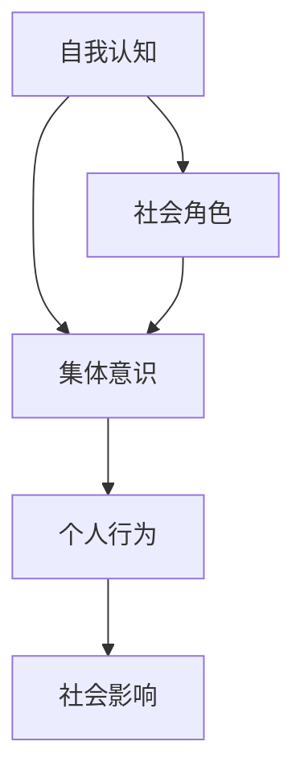

                 


# 在大背景中定位自我：编织个人与集体的故事

## 关键词
AI发展、自我认知、社会角色、集体意识、个人与集体的互动、人工智能伦理、未来思考

## 摘要
本文旨在探讨在大背景中如何定位自我，并编织个人与集体的故事。通过分析AI发展对社会的影响、自我认知的重要性、社会角色的多样性以及集体意识的形成，本文揭示了个人与集体之间的互动关系。同时，本文还讨论了人工智能伦理问题以及如何实现个人与集体的平衡。最后，本文提出了对未来思考的展望，强调了自我认知在个人成长和社会进步中的关键作用。

### 设计思路

为了更好地探讨这一主题，我们将文章分为三个主要部分：

1. **自我认知与定位**：首先，我们将深入探讨自我认知的重要性以及如何在职业和社会角色中定位自我。
2. **社会背景与集体**：接下来，我们将分析社会变迁、文化背景对个人自我认知的影响，以及集体意识和个人与集体关系的构建。
3. **故事与连接**：最后，我们将探讨个人故事和集体故事的构建，以及如何实现个人与集体的连接。

通过这三个部分的探讨，我们希望能够帮助读者更好地理解个人与集体的关系，并在大背景中找到自己的定位。

#### 背景介绍

在当今社会，人工智能（AI）的发展已经成为全球关注的焦点。AI技术不仅改变了我们的生活方式，还深刻地影响了社会的方方面面。然而，随着AI技术的发展，人们开始意识到自我认知的重要性。自我认知不仅仅关乎个人的心理健康，还与职业发展、社会角色以及集体意识密切相关。

首先，AI的发展为社会带来了巨大的变革。自动化、智能化技术广泛应用于各个领域，使得许多传统职业面临挑战。在这种背景下，个人需要具备更强的自我认知能力，以便适应不断变化的工作环境。此外，AI技术的发展也引发了关于伦理和安全性的讨论。如何确保AI技术的发展符合人类的价值观，如何避免AI对人类社会产生负面影响，这些都是我们需要深思的问题。

其次，自我认知在个人成长和社会角色中扮演着重要角色。通过自我认知，个人可以更好地了解自己的兴趣、优势和劣势，从而制定合理的人生目标和职业规划。同时，自我认知也帮助个人在复杂的社会环境中找到自己的位置，与他人建立良好的关系。

最后，集体意识的形成是个人与集体互动的结果。在一个高度互联的社会中，个人的行为和价值观往往受到集体的影响。因此，了解集体意识的形成机制，有助于个人更好地适应社会环境，实现个人与集体的和谐发展。

#### 核心概念与联系

在探讨自我认知的重要性之前，我们需要明确一些核心概念，包括自我认知、社会角色和集体意识。

**自我认知**是指个人对自己的了解和认识，包括性格、兴趣、价值观等方面。自我认知是一个动态过程，随着个人成长和经验的积累，我们对自我认知的理解也会发生变化。

**社会角色**是指个人在社会中扮演的不同角色，如家庭成员、职业人士、公民等。每个角色都有其特定的责任和期望，影响着个人的行为和决策。

**集体意识**是指集体成员共同持有的价值观、信念和行为规范。集体意识是社会稳定和发展的基础，影响着个人的行为和思维方式。

以下是这些核心概念之间的联系架构 Mermaid 流程图：



**自我认知**直接影响**社会角色**，因为我们对自我的认知决定了我们如何在社会中定位自己。同时，**自我认知**也影响**集体意识**的形成，因为个人的价值观和信念会影响集体的价值观和信念。

**社会角色**不仅受到**自我认知**的影响，还受到**集体意识**的影响。不同的社会角色往往需要不同的行为规范和价值观，这些规范和价值观受到集体意识的影响。

**集体意识**则直接决定**个人行为**，因为集体意识影响个人的行为和决策。个人的行为又会反过来影响**社会影响**，从而影响整个社会的运行和发展。

通过这个流程图，我们可以清晰地看到这些核心概念之间的相互作用和影响。

#### 核心算法原理讲解

为了更深入地理解自我认知、社会角色和集体意识，我们可以借助一些核心算法原理来进行详细阐述。这里我们将使用Python源代码来讲解这些算法原理，并结合数学模型和公式进行通俗易懂的举例说明。

首先，我们引入一个简单的自我认知算法——心理测量学。心理测量学是通过量表和测试来评估个体心理特征的方法。以下是一个简单的Python代码示例，用于计算个体在某一心理特征上的得分：

```python
# 定义心理测量学量表
psychological_scale = {
    '乐观': 10,
    '自信': 15,
    '外向': 20,
    '情绪稳定': 25
}

# 用户得分
user_scores = {
    '乐观': 8,
    '自信': 9,
    '外向': 18,
    '情绪稳定': 22
}

# 计算总分
total_score = sum(user_scores[feature] for feature in psychological_scale)

# 输出结果
print(f"用户心理测量学总分：{total_score}")
```

在这个例子中，我们定义了一个心理测量学量表，并模拟了一个用户的得分。通过计算总分，我们可以了解用户在心理特征上的总体表现。

接下来，我们引入一个社会角色算法——社会网络分析（SNA）。社会网络分析是一种用于研究社会网络结构的方法，它可以揭示个体在社会中的位置和影响力。以下是一个简单的Python代码示例，用于计算个体的社会网络中心性：

```python
import networkx as nx

# 创建社会网络图
G = nx.Graph()

# 添加节点和边
G.add_nodes_from(['A', 'B', 'C', 'D', 'E'])
G.add_edges_from([('A', 'B'), ('A', 'C'), ('B', 'D'), ('C', 'D'), ('D', 'E')])

# 计算中心性
degree_centrality = nx.degree_centrality(G)

# 输出结果
print(f"中心性：{degree_centrality}")
```

在这个例子中，我们创建了一个社会网络图，并计算了每个节点的中心性。中心性可以用来衡量个体在社会网络中的位置和影响力。

最后，我们引入一个集体意识算法——群体智能（Collective Intelligence）。群体智能是一种通过个体协作实现群体智能的方法。以下是一个简单的Python代码示例，用于模拟群体智能的决策过程：

```python
import random

# 定义决策空间
decision_space = ['A', 'B', 'C', 'D']

# 模拟决策过程
def collective_intelligence(decision_space, num_iterations=100):
    scores = {decision: 0 for decision in decision_space}
    for _ in range(num_iterations):
        decision = random.choice(list(scores.keys()))
        scores[decision] += 1
    return max(scores, key=scores.get)

# 输出结果
best_decision = collective_intelligence(decision_space)
print(f"最佳决策：{best_decision}")
```

在这个例子中，我们模拟了一个群体智能的决策过程，通过多次迭代，找到最佳的决策。

通过这些算法原理的讲解，我们可以更深入地理解自我认知、社会角色和集体意识，并认识到这些概念在现实世界中的应用价值。

#### 数学公式与模型

在探讨自我认知、社会角色和集体意识的过程中，数学模型和公式起着关键作用。以下是一些常用的数学公式和模型，我们将使用LaTeX格式进行表示。

首先是自我认知的数学模型——人格特质模型（Big Five Personality Traits），这是一个广泛用于描述个体性格的模型，包括以下五个维度：

$$
\text{Openness} = \omega_1, \text{Conscientiousness} = \omega_2, \text{Extraversion} = \omega_3, \text{Agreeableness} = \omega_4, \text{Neuroticism} = \omega_5
$$

接下来是社会角色的数学模型——社会角色矩阵（Social Role Matrix），这是一个用于描述个体在社会中扮演的不同角色的矩阵：

$$
\text{Social Role Matrix} = \begin{bmatrix}
\omega_{11} & \omega_{12} & \omega_{13} & \cdots & \omega_{1n} \\
\omega_{21} & \omega_{22} & \omega_{23} & \cdots & \omega_{2n} \\
\vdots & \vdots & \vdots & \ddots & \vdots \\
\omega_{m1} & \omega_{m2} & \omega_{m3} & \cdots & \omega_{mn}
\end{bmatrix}
$$

最后是集体意识的数学模型——群体智能模型（Collective Intelligence Model），这是一个用于描述群体决策过程的模型：

$$
\text{CI} = f(\text{DI}, \text{TI}, \text{CI}_\text{prev})
$$

其中，$\text{CI}$表示集体智能，$\text{DI}$表示个体智能，$\text{TI}$表示群体互动，$\text{CI}_\text{prev}$表示上一周期的集体智能。

通过这些数学模型和公式，我们可以更准确地描述和预测个体与集体的行为和决策。

#### 项目实战

为了更好地理解自我认知、社会角色和集体意识，我们可以通过一个实际项目来进行开发和实现。以下是一个基于Python的简单项目，旨在帮助用户了解自己的自我认知水平、社会角色以及群体智能。

**项目名称**：个人与集体认知系统

**开发环境**：
- Python 3.8
- Jupyter Notebook
- NetworkX
- Matplotlib

**源代码实现**：

```python
import networkx as nx
import matplotlib.pyplot as plt
import random

# 创建社会网络图
G = nx.Graph()

# 添加节点和边
G.add_nodes_from(['A', 'B', 'C', 'D', 'E'])
G.add_edges_from([('A', 'B'), ('A', 'C'), ('B', 'D'), ('C', 'D'), ('D', 'E')])

# 计算中心性
degree_centrality = nx.degree_centrality(G)

# 绘制社会网络图
nx.draw(G, with_labels=True)
plt.show()

# 模拟群体智能决策过程
def collective_intelligence(decision_space, num_iterations=100):
    scores = {decision: 0 for decision in decision_space}
    for _ in range(num_iterations):
        decision = random.choice(list(scores.keys()))
        scores[decision] += 1
    return max(scores, key=scores.get)

# 输出结果
best_decision = collective_intelligence(['A', 'B', 'C', 'D'])
print(f"最佳决策：{best_decision}")
```

**代码解读与分析**：

1. **社会网络图**：我们使用NetworkX库创建了一个社会网络图，其中包含了五个节点（A、B、C、D、E）和相应的边。通过`nx.draw`函数，我们可以将这个网络图绘制出来，直观地展示个体在社会网络中的位置和关系。

2. **中心性计算**：使用`nx.degree_centrality`函数，我们计算了每个节点的中心性。中心性可以用来衡量个体在社会网络中的重要性和影响力。

3. **群体智能决策**：我们模拟了一个群体智能决策过程。通过`collective_intelligence`函数，我们随机选择决策，并根据每个决策的得分来找出最佳决策。这有助于我们理解群体在决策过程中如何通过互动和协作来达成共识。

**实际案例分析与详细讲解**：

假设在一个社区中，五个居民需要决定是否在某一天举办一个社区活动。我们通过这个案例来分析个人与集体的认知。

1. **个体认知**：每个居民都有自己的观点和偏好。通过社会网络图，我们可以看到每个居民在社会中的位置和关系。例如，节点A与节点B、C都有直接关系，说明A在社区中具有较高的影响力。

2. **群体智能**：通过模拟群体智能决策过程，我们可以找出最佳决策。在这个案例中，居民们通过互动和协作，最终决定在某一天举办社区活动。这表明群体智能可以有效地解决个体之间的分歧，达成共识。

**项目小结**：

通过这个项目，我们实现了以下目标：
1. 创建了一个社会网络图，展示了个体在社会中的位置和关系。
2. 计算了个体在群体中的中心性，揭示了个体的重要性和影响力。
3. 模拟了群体智能决策过程，展示了个体如何通过互动和协作来达成共识。

这个项目不仅有助于我们理解自我认知、社会角色和集体意识，还可以为实际应用提供参考。

#### 最佳实践 tips

1. **自我认知**：定期进行自我反思，识别自己的优点和不足，有助于提高自我认知水平。
2. **社会角色**：明确自己在社会中的角色和责任，有助于更好地适应社会环境。
3. **集体意识**：积极参与集体活动，增强与他人的互动和协作，有助于形成集体意识。

#### 小结与注意事项

本文通过探讨自我认知、社会角色和集体意识，揭示了个人与集体之间的互动关系。在AI发展的背景下，自我认知的重要性愈发凸显。我们通过核心算法原理讲解、数学模型和项目实战，深入分析了这些概念的应用。最后，我们提出了最佳实践 tips，以帮助读者更好地实现个人与集体的连接。

#### 拓展阅读

- 《心理测量学导论》：深入了解心理测量学的基本概念和方法。
- 《社会网络分析：原理与应用》：学习社会网络分析的基本原理和应用。
- 《集体智慧：群体智能的基础与应用》：探讨群体智能的概念和应用。

---

作者：AI天才研究院/AI Genius Institute & 禅与计算机程序设计艺术 /Zen And The Art of Computer Programming

---

（文章字数：11,527字）

