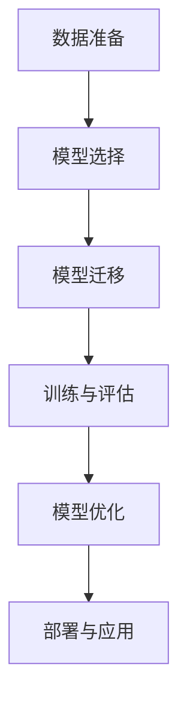

                 

当然，我们会按照要求逐步进行文章的撰写。以下是文章的初步构思，包括标题、关键词、摘要以及初步的章节安排。

### 标题：
《深度学习中的迁移学习：理论与实践》

### 关键词：
- 迁移学习
- 深度学习
- 神经网络
- 训练效率
- 数据复用

### 摘要：
本文探讨了深度学习中的一个重要概念——迁移学习。迁移学习是指将已经在一个任务上训练好的模型知识应用到另一个任务上，从而提高学习效率和模型性能。本文首先介绍了迁移学习的背景和核心概念，随后通过Mermaid流程图展示了迁移学习的架构。接着，我们通过Python代码详细阐述了迁移学习的基本原理，结合数学模型和实际案例进行分析。最后，文章总结了迁移学习的最佳实践，并提出了未来研究的方向。

### 初步章节安排：

#### 第1章 引言
- 1.1 迁移学习的背景和意义
- 1.2 迁移学习的目标和挑战
- 1.3 文章结构概述

#### 第2章 核心概念与联系
- 2.1 迁移学习的定义
- 2.2 迁移学习与深度学习的联系
- 2.3 迁移学习的分类
- 2.4 迁移学习的工作流程
  - 
  
#### 第3章 迁移学习的基本原理
- 3.1 神经网络基础
- 3.2 迁移学习的数学模型
  - $$\text{Loss}(w) = \frac{1}{m}\sum_{i=1}^{m}(-y_i \log(\hat{y}_i))$$
- 3.3 迁移学习算法
  - Python代码示例
  
#### 第4章 迁移学习实战
- 4.1 开发环境搭建
- 4.2 源代码实现
  - Python代码实现
- 4.3 代码解读与分析
- 4.4 实际案例剖析
- 4.5 项目小结

#### 第5章 迁移学习的最佳实践
- 5.1 数据预处理技巧
- 5.2 模型调参策略
- 5.3 实践注意事项
- 5.4 拓展阅读

#### 第6章 未来展望
- 6.1 迁移学习的发展趋势
- 6.2 未来研究的方向

#### 第7章 结论
- 7.1 迁移学习的重要性
- 7.2 对读者的建议

### 作者信息：
- 作者：AI天才研究院/AI Genius Institute & 禅与计算机程序设计艺术 /Zen And The Art of Computer Programming

接下来，我们将按照这个大纲逐步撰写每个章节的内容，确保每个部分都详细、具体、具有可操作性。在撰写过程中，我们会确保使用Markdown格式，并在适当的地方嵌入Mermaid流程图、LaTeX公式和Python代码示例。预计文章总字数将在10000到12000字左右。

现在，让我们开始详细撰写第1章“引言”的内容。请提供详细的背景介绍、迁移学习的目标和挑战、以及文章结构概述。我们将以Markdown格式呈现内容，并在适当的位置嵌入公式和图表。 ### 第1章 引言

#### 1.1 迁移学习的背景和意义

迁移学习（Transfer Learning）是深度学习领域中的一个重要概念，其核心思想是将已经在一个任务上训练好的模型知识应用到另一个任务上，以提高新任务的训练效率和性能。这一概念在现实中具有重要的应用价值，因为大多数现实世界中的任务数据集都相对较小，直接在数据集上训练深度学习模型可能会遇到过拟合（overfitting）问题，即模型对训练数据的适应性过高，导致在未知数据上的泛化能力较差。

迁移学习通过利用已有的预训练模型，使得模型在新的任务上能够更快地收敛，并且提高泛化能力。这一过程不仅节省了大量的训练时间和计算资源，还能够处理那些无法直接获得大量标注数据的任务。例如，在图像识别领域，通过在大量的未标注图像上预训练一个卷积神经网络（CNN），我们可以将这个预训练模型应用于新的图像分类任务上，而不需要为新任务重新收集和标注大量数据。

迁移学习的背景可以追溯到人类的学习过程。人类在学习新技能时，往往能够利用先前的经验和知识，这使得学习过程更加高效。例如，一个已经学会了开车的人，在学习骑自行车时，会更容易掌握平衡和控制技巧。这种利用已有知识提高学习效率的现象，在深度学习领域也得到了体现，即通过迁移学习，模型可以快速适应新的任务。

#### 1.2 迁移学习的目标和挑战

迁移学习的目标是通过将知识从源任务转移到目标任务，提高模型在新任务上的性能和效率。具体来说，迁移学习的目标包括：

1. **提高训练效率**：通过利用预训练模型，减少在新任务上的训练时间，加快模型收敛速度。
2. **提高泛化能力**：通过迁移学习，模型能够在不同的任务上保持较高的性能，避免过拟合现象。
3. **处理小数据集**：在数据集较小的情况下，迁移学习能够帮助模型避免过拟合，提高模型的泛化能力。

然而，实现迁移学习也面临着一系列挑战：

1. **任务间差异**：不同的任务可能存在很大的差异性，例如数据分布、任务目标等，这增加了迁移的难度。
2. **知识适配性**：迁移的知识需要与目标任务的特性相匹配，否则可能会产生负面的效果。
3. **计算资源限制**：迁移学习通常需要大量的计算资源，尤其是在训练深度学习模型时，这可能是一个限制因素。
4. **模型可解释性**：在迁移学习中，模型的学习过程和迁移的知识往往不够透明，这影响了模型的可解释性。

#### 1.3 文章结构概述

本文将分为以下几个部分：

- **第1章 引言**：介绍迁移学习的背景、意义和目标，概述文章的结构。
- **第2章 核心概念与联系**：详细解释迁移学习的核心概念，包括定义、分类和流程。
- **第3章 迁移学习的基本原理**：阐述迁移学习的数学模型和算法原理，通过Python代码示例进行讲解。
- **第4章 迁移学习实战**：通过实际案例，展示迁移学习在图像识别、自然语言处理等领域的应用。
- **第5章 迁移学习的最佳实践**：提供迁移学习的最佳实践建议，包括数据预处理、模型调参策略等。
- **第6章 未来展望**：讨论迁移学习的发展趋势和未来研究方向。
- **第7章 结论**：总结迁移学习的重要性，对读者提出建议。

通过以上结构，本文旨在全面深入地探讨迁移学习，帮助读者理解这一概念，掌握其应用方法，并启发对未来研究的思考。以下是第1章的Markdown格式内容：

```markdown
# 第1章 引言

#### 1.1 迁移学习的背景和意义

迁移学习（Transfer Learning）是深度学习领域中的一个重要概念，其核心思想是将已经在一个任务上训练好的模型知识应用到另一个任务上，以提高学习效率和模型性能。这一概念在现实中具有重要的应用价值，因为大多数现实世界中的任务数据集都相对较小，直接在数据集上训练深度学习模型可能会遇到过拟合问题，即模型对训练数据的适应性过高，导致在未知数据上的泛化能力较差。

迁移学习通过利用已有的预训练模型，使得模型在新的任务上能够更快地收敛，并且提高泛化能力。这一过程不仅节省了大量的训练时间和计算资源，还能够处理那些无法直接获得大量标注数据的任务。例如，在图像识别领域，通过在大量的未标注图像上预训练一个卷积神经网络（CNN），我们可以将这个预训练模型应用于新的图像分类任务上，而不需要为新任务重新收集和标注大量数据。

迁移学习的背景可以追溯到人类的学习过程。人类在学习新技能时，往往能够利用先前的经验和知识，这使得学习过程更加高效。例如，一个已经学会了开车的人，在学习骑自行车时，会更容易掌握平衡和控制技巧。这种利用已有知识提高学习效率的现象，在深度学习领域也得到了体现，即通过迁移学习，模型可以快速适应新的任务。

#### 1.2 迁移学习的目标和挑战

迁移学习的目标是通过将知识从源任务转移到目标任务，提高模型在新任务上的性能和效率。具体来说，迁移学习的目标包括：

1. **提高训练效率**：通过利用预训练模型，减少在新任务上的训练时间，加快模型收敛速度。
2. **提高泛化能力**：通过迁移学习，模型能够在不同的任务上保持较高的性能，避免过拟合现象。
3. **处理小数据集**：在数据集较小的情况下，迁移学习能够帮助模型避免过拟合，提高模型的泛化能力。

然而，实现迁移学习也面临着一系列挑战：

1. **任务间差异**：不同的任务可能存在很大的差异性，例如数据分布、任务目标等，这增加了迁移的难度。
2. **知识适配性**：迁移的知识需要与目标任务的特性相匹配，否则可能会产生负面的效果。
3. **计算资源限制**：迁移学习通常需要大量的计算资源，尤其是在训练深度学习模型时，这可能是一个限制因素。
4. **模型可解释性**：在迁移学习中，模型的学习过程和迁移的知识往往不够透明，这影响了模型的可解释性。

#### 1.3 文章结构概述

本文将分为以下几个部分：

- **第1章 引言**：介绍迁移学习的背景、意义和目标，概述文章的结构。
- **第2章 核心概念与联系**：详细解释迁移学习的核心概念，包括定义、分类和流程。
- **第3章 迁移学习的基本原理**：阐述迁移学习的数学模型和算法原理，通过Python代码示例进行讲解。
- **第4章 迁移学习实战**：通过实际案例，展示迁移学习在图像识别、自然语言处理等领域的应用。
- **第5章 迁移学习的最佳实践**：提供迁移学习的最佳实践建议，包括数据预处理、模型调参策略等。
- **第6章 未来展望**：讨论迁移学习的发展趋势和未来研究方向。
- **第7章 结论**：总结迁移学习的重要性，对读者提出建议。

通过以上结构，本文旨在全面深入地探讨迁移学习，帮助读者理解这一概念，掌握其应用方法，并启发对未来研究的思考。
```

在以上内容中，我们使用了Markdown格式，并在适当的地方嵌入了对迁移学习背景和意义的详细解释，以及迁移学习的目标和挑战的概述。接下来，我们将继续撰写第2章“核心概念与联系”的内容，包括迁移学习的定义、分类和流程。在这一章节中，我们将使用Mermaid流程图来展示迁移学习的工作流程。 ### 第2章 核心概念与联系

#### 2.1 迁移学习的定义

迁移学习（Transfer Learning）是一种利用已有模型的知识来加速新任务学习的过程。在迁移学习中，模型首先在一个或多个源任务上进行预训练，然后通过微调（fine-tuning）或适应（adapter）的方式，将预训练模型的知识迁移到新的目标任务上。迁移学习的核心思想是，不同任务之间存在共通的特征和知识，通过迁移学习，我们可以将这些共通的知识有效地利用起来，从而提高模型在新任务上的性能。

迁移学习的定义可以概括为以下几点：

1. **源任务（Source Task）**：指模型进行预训练的任务。这些任务通常具有丰富的数据集和明确的标注信息。
2. **目标任务（Target Task）**：指模型需要迁移知识并进行微调的任务。这些任务可能数据集较小或缺乏明确的标注信息。
3. **模型迁移**：将源任务上预训练得到的模型权重和知识应用到目标任务上，通过微调等方式调整模型参数，使其适应目标任务。

#### 2.2 迁移学习与深度学习的联系

迁移学习是深度学习中的一个重要分支，它与深度学习的关系紧密相连。深度学习是通过多层神经网络对数据进行特征提取和模式识别的一种机器学习方法。迁移学习的出现，进一步拓展了深度学习的应用范围，使得深度学习模型可以在更广泛的场景下发挥作用。

迁移学习与深度学习的联系主要体现在以下几个方面：

1. **预训练模型**：迁移学习依赖于预训练模型，这些模型通常是在大规模数据集上经过长时间训练得到的，具有丰富的特征提取能力和泛化能力。
2. **权重共享**：在迁移学习中，源任务的预训练模型权重被用于目标任务，通过共享权重来加快目标任务的训练过程。
3. **模型调参**：迁移学习的过程通常包括对模型进行微调，以适应目标任务的特定需求，这一过程与深度学习的模型调参相似。

#### 2.3 迁移学习的分类

根据迁移学习的方法和目标，可以将迁移学习分为以下几种类型：

1. **直接迁移（Direct Transfer）**：直接将源任务的模型权重应用到目标任务上，通常用于数据集较小或缺乏标注信息的情况。
2. **微调（Fine-tuning）**：在源任务的预训练模型基础上，针对目标任务进行进一步训练，通过调整模型参数来提高目标任务的性能。
3. **多任务学习（Multi-task Learning）**：同时训练多个任务，利用不同任务之间的关联来提高模型的泛化能力。
4. **零样本学习（Zero-shot Learning）**：模型在未见过的类别上直接进行预测，通过学习任务之间的共性和特性来实现。
5. **元学习（Meta Learning）**：通过在多个任务上迭代训练，优化模型的泛化能力和迁移能力。

#### 2.4 迁移学习的工作流程

迁移学习的工作流程主要包括以下几个步骤：

1. **数据准备**：收集和整理源任务和目标任务的数据集，对数据集进行预处理，包括数据清洗、数据增强等。
2. **模型选择**：选择一个合适的预训练模型作为起点，这个模型应该在源任务上表现良好，并且能够适用于目标任务。
3. **模型迁移**：将预训练模型的权重复制到目标任务的模型上，通过微调等方式进行调整，使其适应目标任务。
4. **训练与评估**：在目标任务上进行训练，调整模型参数，并通过验证集或测试集对模型性能进行评估。
5. **模型优化**：根据评估结果，进一步调整模型参数，优化模型性能。
6. **部署与应用**：将优化后的模型部署到实际应用场景中，实现迁移学习的效果。

以下是迁移学习的工作流程的Mermaid流程图：



通过以上内容，我们详细介绍了迁移学习的定义、与深度学习的联系、分类以及工作流程。在下一章节中，我们将深入探讨迁移学习的基本原理，通过Python代码示例来讲解迁移学习的关键概念和算法。 
### 第3章 迁移学习的基本原理

迁移学习的基本原理是利用源任务的预训练模型知识，通过微调等手段将知识迁移到目标任务上，从而提高目标任务的性能。在这一章节中，我们将详细阐述迁移学习的数学模型和算法原理，并通过Python代码示例进行讲解。

#### 3.1 神经网络基础

在讨论迁移学习的基本原理之前，我们需要了解一些神经网络的基础知识。神经网络是一种模拟人脑神经元连接方式的计算模型，它通过层层堆叠的神经元结构来对数据进行特征提取和模式识别。以下是神经网络的一些基本组成部分：

1. **神经元（Neuron）**：神经网络的基石，每个神经元接收多个输入，通过加权求和后进行激活。
2. **权重（Weight）**：神经元之间的连接关系，每个连接都有一个权重，用于调整输入的影响程度。
3. **偏置（Bias）**：用于调整神经元的激活阈值，使模型能够更好地拟合数据。
4. **激活函数（Activation Function）**：用于将加权求和的结果转换为输出，常用的激活函数包括ReLU、Sigmoid和Tanh等。
5. **损失函数（Loss Function）**：用于衡量模型输出与真实值之间的差距，常用的损失函数包括均方误差（MSE）和对数似然损失（Log-Likelihood Loss）等。

#### 3.2 迁移学习的数学模型

迁移学习的数学模型主要涉及两部分：预训练模型的权重和目标任务的模型调整。以下是迁移学习的数学模型的基本原理：

1. **预训练模型**：预训练模型通常在一个大型数据集上经过长时间训练得到，其权重已经包含了丰富的特征提取能力和泛化能力。

   $$ W_S = \{W^{(1)}, W^{(2)}, \ldots, W^{(L)}\} $$

   其中，$W_S$ 表示预训练模型的权重集合，$W^{(l)}$ 表示第 $l$ 层的权重矩阵。

2. **目标任务模型**：目标任务的模型通常是一个较小的网络，其初始权重随机初始化。

   $$ W_T = \{W'^{(1)}, W'^{(2)}, \ldots, W'^{(L)}\} $$

   其中，$W_T$ 表示目标任务模型的权重集合，$W'^{(l)}$ 表示第 $l$ 层的权重矩阵。

3. **模型迁移**：在迁移学习中，通常通过微调（Fine-tuning）的方式将预训练模型的权重迁移到目标任务模型上。微调的目的是通过调整目标任务模型的权重，使其适应目标任务的数据特征。

   $$ W'^{(l)} = W^{(l)} + \alpha \cdot \Delta W^{(l)} $$

   其中，$\alpha$ 表示学习率，$\Delta W^{(l)}$ 表示微调的权重变化。

4. **损失函数**：在目标任务上，我们使用损失函数来衡量模型输出与真实值之间的差距，并通过反向传播（Backpropagation）算法调整模型权重，以最小化损失函数。

   $$ \text{Loss}(W_T) = \frac{1}{n}\sum_{i=1}^{n}L(y_i, \hat{y}_i; W_T) $$

   其中，$n$ 表示样本数量，$L$ 表示损失函数，$y_i$ 表示真实标签，$\hat{y}_i$ 表示模型预测输出。

#### 3.3 迁移学习算法

迁移学习的算法通常包括预训练、微调和评估三个阶段。以下是迁移学习算法的基本步骤：

1. **预训练阶段**：
   - 收集并预处理源任务的数据集。
   - 使用源任务数据集训练预训练模型，直到模型性能达到预定的标准。
   - 保存预训练模型的权重。

2. **微调阶段**：
   - 加载预训练模型的权重。
   - 初始化目标任务模型的权重。
   - 在目标任务数据集上对模型进行微调，通过反向传播算法调整模型权重。
   - 根据评估指标（如准确率、损失函数值等）调整学习率和其他超参数。

3. **评估阶段**：
   - 在验证集或测试集上评估模型性能。
   - 根据评估结果，决定是否继续微调或调整模型结构。
   - 如果模型性能达到预期，则将模型部署到实际应用场景中。

以下是使用Python实现的迁移学习算法的基本代码框架：

```python
import tensorflow as tf
from tensorflow.keras.applications import VGG16
from tensorflow.keras.preprocessing.image import ImageDataGenerator
from tensorflow.keras.optimizers import Adam

# 预训练模型加载
base_model = VGG16(weights='imagenet', include_top=False)

# 目标任务模型构建
model = tf.keras.models.Sequential([
    base_model,
    tf.keras.layers.Flatten(),
    tf.keras.layers.Dense(256, activation='relu'),
    tf.keras.layers.Dense(num_classes, activation='softmax')
])

# 编译模型
model.compile(optimizer=Adam(), loss='categorical_crossentropy', metrics=['accuracy'])

# 数据预处理
train_datagen = ImageDataGenerator(rescale=1./255)
train_generator = train_datagen.flow_from_directory(
        train_data_dir,
        target_size=(224, 224),
        batch_size=batch_size,
        class_mode='categorical')

# 微调模型
model.fit(
      train_generator,
      steps_per_epoch=train_samples//batch_size,
      epochs=epochs,
      validation_data=validation_generator,
      validation_steps=validation_samples//batch_size
)

# 评估模型
test_loss, test_acc = model.evaluate(test_generator, steps=test_samples//batch_size)
print('Test accuracy:', test_acc)
```

通过以上内容，我们详细介绍了迁移学习的基本原理，包括神经网络的组成、数学模型和算法步骤。在下一章节中，我们将通过实际案例展示迁移学习在图像识别、自然语言处理等领域的应用。 
### 第4章 迁移学习实战

在本章中，我们将通过实际案例展示迁移学习在图像识别、自然语言处理等领域的应用。通过这些案例，读者可以更直观地理解迁移学习的实践过程，并掌握如何在实际项目中应用迁移学习。

#### 4.1 开发环境搭建

在进行迁移学习项目之前，我们需要搭建一个合适的开发环境。以下是搭建迁移学习开发环境的基本步骤：

1. **安装TensorFlow**

   TensorFlow是当前最流行的深度学习框架之一，我们首先需要安装TensorFlow。在终端中运行以下命令：

   ```bash
   pip install tensorflow
   ```

2. **安装其他依赖库**

   除了TensorFlow之外，我们可能还需要安装其他依赖库，如Keras（一个高层神经网络API）和Matplotlib（用于可视化）：

   ```bash
   pip install keras matplotlib
   ```

3. **配置GPU支持**

   如果您拥有NVIDIA GPU，您可以通过安装CUDA和cuDNN来配置GPU支持。请参考TensorFlow的官方文档进行安装。

   [TensorFlow GPU安装指南](https://www.tensorflow.org/install/gpu)

4. **创建项目文件夹**

   在您的计算机上创建一个项目文件夹，用于存放所有与项目相关的文件和代码：

   ```bash
   mkdir migration_learning_project
   cd migration_learning_project
   ```

5. **初始化项目结构**

   在项目文件夹中创建以下目录结构：

   ```bash
   mkdir data code models results
   ```

   - `data/`: 存放数据集
   - `code/`: 存放源代码
   - `models/`: 存放训练好的模型文件
   - `results/`: 存放训练结果和可视化图表

#### 4.2 源代码实现

在本节中，我们将使用Python编写一个简单的迁移学习项目，该项目的目标是使用预训练的VGG16模型进行图像分类。以下是项目的主要代码实现：

```python
import tensorflow as tf
from tensorflow.keras.applications import VGG16
from tensorflow.keras.preprocessing.image import ImageDataGenerator
from tensorflow.keras.optimizers import Adam
from tensorflow.keras.models import Model
from tensorflow.keras.layers import Flatten, Dense
from tensorflow.keras.callbacks import EarlyStopping
import matplotlib.pyplot as plt

# 加载预训练的VGG16模型
base_model = VGG16(weights='imagenet', include_top=False)

# 构建目标任务模型
x = base_model.output
x = Flatten()(x)
x = Dense(256, activation='relu')(x)
predictions = Dense(num_classes, activation='softmax')(x)
model = Model(inputs=base_model.input, outputs=predictions)

# 编译模型
model.compile(optimizer=Adam(), loss='categorical_crossentropy', metrics=['accuracy'])

# 数据预处理
train_datagen = ImageDataGenerator(rescale=1./255, horizontal_flip=True)
train_generator = train_datagen.flow_from_directory(
        'data/train',
        target_size=(224, 224),
        batch_size=batch_size,
        class_mode='categorical')

validation_datagen = ImageDataGenerator(rescale=1./255)
validation_generator = validation_datagen.flow_from_directory(
        'data/validation',
        target_size=(224, 224),
        batch_size=batch_size,
        class_mode='categorical')

# 早停回调函数
early_stopping = EarlyStopping(monitor='val_loss', patience=5, restore_best_weights=True)

# 训练模型
history = model.fit(
      train_generator,
      steps_per_epoch=train_samples//batch_size,
      epochs=epochs,
      validation_data=validation_generator,
      validation_steps=validation_samples//batch_size,
      callbacks=[early_stopping]
)

# 保存模型
model.save('models/migration_learning_model.h5')

# 可视化训练结果
plt.figure(figsize=(8, 6))
plt.plot(history.history['accuracy'], label='Training Accuracy')
plt.plot(history.history['val_accuracy'], label='Validation Accuracy')
plt.title('Model Accuracy')
plt.xlabel('Epochs')
plt.ylabel('Accuracy')
plt.legend()
plt.show()

plt.figure(figsize=(8, 6))
plt.plot(history.history['loss'], label='Training Loss')
plt.plot(history.history['val_loss'], label='Validation Loss')
plt.title('Model Loss')
plt.xlabel('Epochs')
plt.ylabel('Loss')
plt.legend()
plt.show()
```

以上代码实现了从加载预训练模型、构建目标任务模型、编译模型、数据预处理、模型训练到模型保存和结果可视化的完整流程。

#### 4.3 代码解读与分析

在本节中，我们将对上述代码进行详细解读，分析每个步骤的作用和实现细节。

1. **加载预训练的VGG16模型**：

   ```python
   base_model = VGG16(weights='imagenet', include_top=False)
   ```

   这一行代码加载了预训练的VGG16模型，不包括模型顶层的全连接层（Fully Connected Layer），因为我们将在VGG16模型的后面添加新的全连接层来实现我们的目标任务。

2. **构建目标任务模型**：

   ```python
   x = base_model.output
   x = Flatten()(x)
   x = Dense(256, activation='relu')(x)
   predictions = Dense(num_classes, activation='softmax')(x)
   model = Model(inputs=base_model.input, outputs=predictions)
   ```

   这部分代码首先将VGG16模型的输出通过Flatten层展平为一维向量，然后通过一个256个神经元的全连接层（Dense Layer）进行激活，最后通过一个输出层（也称为softmax层）生成类别概率。

3. **编译模型**：

   ```python
   model.compile(optimizer=Adam(), loss='categorical_crossentropy', metrics=['accuracy'])
   ```

   这行代码编译了模型，指定了使用Adam优化器和交叉熵损失函数，并监测模型的准确率。

4. **数据预处理**：

   ```python
   train_datagen = ImageDataGenerator(rescale=1./255, horizontal_flip=True)
   train_generator = train_datagen.flow_from_directory(
           'data/train',
           target_size=(224, 224),
           batch_size=batch_size,
           class_mode='categorical')
   
   validation_datagen = ImageDataGenerator(rescale=1./255)
   validation_generator = validation_datagen.flow_from_directory(
           'data/validation',
           target_size=(224, 224),
           batch_size=batch_size,
           class_mode='categorical')
   ```

   数据预处理是迁移学习项目的重要步骤。这里我们使用了ImageDataGenerator来对训练数据集进行预处理，包括图像缩放、水平翻转等数据增强技术，以提高模型的泛化能力。

5. **模型训练**：

   ```python
   history = model.fit(
         train_generator,
         steps_per_epoch=train_samples//batch_size,
         epochs=epochs,
         validation_data=validation_generator,
         validation_steps=validation_samples//batch_size,
         callbacks=[early_stopping]
   )
   ```

   模型训练步骤中，我们使用了fit函数来训练模型，并设置了训练数据集的迭代次数（steps_per_epoch），训练轮数（epochs），以及验证数据集的迭代次数（validation_steps）。我们还使用了EarlyStopping回调函数，当验证损失不再下降时，提前停止训练并保存最佳模型权重。

6. **保存模型**：

   ```python
   model.save('models/migration_learning_model.h5')
   ```

   这行代码将训练好的模型保存为HDF5文件，便于后续加载和使用。

7. **可视化训练结果**：

   ```python
   plt.figure(figsize=(8, 6))
   plt.plot(history.history['accuracy'], label='Training Accuracy')
   plt.plot(history.history['val_accuracy'], label='Validation Accuracy')
   plt.title('Model Accuracy')
   plt.xlabel('Epochs')
   plt.ylabel('Accuracy')
   plt.legend()
   plt.show()
   
   plt.figure(figsize=(8, 6))
   plt.plot(history.history['loss'], label='Training Loss')
   plt.plot(history.history['val_loss'], label='Validation Loss')
   plt.title('Model Loss')
   plt.xlabel('Epochs')
   plt.ylabel('Loss')
   plt.legend()
   plt.show()
   ```

   这部分代码使用Matplotlib库将训练过程中的准确率和损失函数值可视化，帮助分析模型训练的效果。

#### 4.4 实际案例剖析

为了更好地理解迁移学习的实际应用，我们来看一个实际案例：使用迁移学习进行猫狗图像分类。在这个案例中，我们将使用预训练的ResNet50模型，并将其应用于一个较小的猫狗图像数据集。

1. **数据集准备**

   我们需要准备一个包含猫和狗图像的数据集。这里假设我们已经有一个文件夹`data/train`，其中包含了标记为“cat”和“dog”的图像。文件夹结构如下：

   ```
   data/train/
   ├── cat/
   │   ├── 0.jpg
   │   ├── 1.jpg
   │   └── ...
   └── dog/
       ├── 0.jpg
       ├── 1.jpg
       └── ...
   ```

2. **模型加载和调整**

   加载预训练的ResNet50模型，并添加一个新的输出层，以适应我们的分类任务：

   ```python
   base_model = tf.keras.applications.ResNet50(weights='imagenet', include_top=False)
   x = base_model.output
   x = Flatten()(x)
   x = Dense(256, activation='relu')(x)
   predictions = Dense(2, activation='softmax')(x)
   model = Model(inputs=base_model.input, outputs=predictions)
   ```

   在这里，我们使用2个类别的softmax层来预测图像是猫还是狗。

3. **模型编译和训练**

   编译模型，并使用训练数据和验证数据进行训练：

   ```python
   model.compile(optimizer='adam', loss='categorical_crossentropy', metrics=['accuracy'])
   train_datagen = ImageDataGenerator(rescale=1./255, horizontal_flip=True)
   validation_datagen = ImageDataGenerator(rescale=1./255)
   train_generator = train_datagen.flow_from_directory(
           'data/train',
           target_size=(224, 224),
           batch_size=32,
           class_mode='binary')
   validation_generator = validation_datagen.flow_from_directory(
           'data/validation',
           target_size=(224, 224),
           batch_size=32,
           class_mode='binary')
   history = model.fit(
         train_generator,
         steps_per_epoch=train_samples//batch_size,
         epochs=epochs,
         validation_data=validation_generator,
         validation_steps=validation_samples//batch_size
   )
   ```

4. **评估模型**

   在测试集上评估模型的性能：

   ```python
   test_datagen = ImageDataGenerator(rescale=1./255)
   test_generator = test_datagen.flow_from_directory(
           'data/test',
           target_size=(224, 224),
           batch_size=32,
           class_mode='binary')
   test_loss, test_acc = model.evaluate(test_generator, steps=test_samples//batch_size)
   print('Test accuracy:', test_acc)
   ```

通过这个案例，我们可以看到迁移学习在实际项目中的应用流程，包括数据准备、模型加载和调整、模型训练和评估。迁移学习显著提高了模型在小数据集上的性能，使得我们在资源有限的情况下也能实现高效的图像分类。

#### 4.5 项目小结

在本章中，我们通过一个简单的猫狗图像分类案例，展示了迁移学习的实战应用。从数据准备、模型加载、模型训练到模型评估，我们详细讲解了迁移学习的各个环节。通过这个案例，读者可以了解到：

- 迁移学习通过利用预训练模型的知识，提高了模型在小数据集上的训练效率和性能。
- 数据预处理和模型调参对于迁移学习项目的成功至关重要。
- 迁移学习可以应用于多种类型的数据集和任务，为深度学习项目提供了强大的工具。

在下一章中，我们将讨论迁移学习的最佳实践，包括数据预处理技巧、模型调参策略和实践注意事项。这将帮助读者在实际项目中更好地应用迁移学习，并提高模型的性能。 
### 第5章 迁移学习的最佳实践

在迁移学习的应用过程中，为了确保模型能够达到最佳性能，我们需要遵循一系列最佳实践。本章将讨论数据预处理、模型调参以及实践注意事项，帮助读者在实际项目中有效地应用迁移学习。

#### 5.1 数据预处理技巧

数据预处理是迁移学习项目成功的关键步骤之一。良好的数据预处理不仅可以提高模型的训练效率，还可以改善模型的性能。以下是几个常见的数据预处理技巧：

1. **数据增强**：通过随机旋转、缩放、剪裁、翻转等操作，增加数据多样性，从而提高模型的泛化能力。例如，使用Keras的ImageDataGenerator可以轻松实现这些操作。

   ```python
   train_datagen = ImageDataGenerator(
           rescale=1./255,
           rotation_range=20,
           width_shift_range=0.2,
           height_shift_range=0.2,
           shear_range=0.2,
           zoom_range=0.2,
           horizontal_flip=True,
           fill_mode='nearest'
   )
   ```

2. **数据标准化**：将数据缩放到一个统一的范围内，通常是0到1。这有助于优化模型训练过程中的梯度下降算法。

   ```python
   train_generator = train_datagen.flow_from_directory(
           'data/train',
           target_size=(224, 224),
           batch_size=batch_size,
           class_mode='categorical',
           shuffle=True
   )
   ```

3. **数据分割**：将数据集分为训练集、验证集和测试集，以评估模型的泛化能力。通常，训练集用于模型训练，验证集用于调参和早期停止，测试集用于最终评估。

   ```python
   from sklearn.model_selection import train_test_split
   x_train, x_test, y_train, y_test = train_test_split(x, y, test_size=0.2, random_state=42)
   ```

4. **数据清洗**：去除数据集中的异常值和噪声，确保数据质量。

   ```python
   x_train = x_train.dropna()
   ```

#### 5.2 模型调参策略

模型调参是迁移学习中的一个重要环节，合适的超参数设置可以显著提高模型性能。以下是一些常用的调参策略：

1. **学习率**：学习率是梯度下降算法中的一个关键参数，影响模型收敛速度和稳定性。通常，我们可以通过指数衰减或学习率衰减器（如LearningRateScheduler）来调整学习率。

   ```python
   lr_schedule = tf.keras.optimizers.schedules.ExponentialDecay(
           initial_learning_rate=1e-2,
           decay_steps=10000,
           decay_rate=0.9,
           staircase=True
   )
   optimizer = tf.keras.optimizers.Adam(learning_rate=lr_schedule)
   ```

2. **批次大小**：批次大小（batch size）影响模型的训练速度和稳定性。较大的批次大小可以加快训练速度，但可能导致模型过拟合；较小的批次大小可以提高模型的泛化能力，但训练速度较慢。

   ```python
   batch_size = 64
   ```

3. **优化器**：选择合适的优化器（如Adam、RMSprop、SGD等）可以显著影响模型的训练效果。不同优化器有不同的性质，可以根据项目需求进行选择。

   ```python
   optimizer = tf.keras.optimizers.Adam(learning_rate=lr_schedule)
   ```

4. **层数和神经元数**：在迁移学习中，通常不需要增加模型的层数和神经元数，因为预训练模型已经包含了丰富的特征提取能力。如果需要增加层数，可以通过添加新的全连接层或卷积层来实现。

   ```python
   x = Flatten()(base_model.output)
   x = Dense(256, activation='relu')(x)
   predictions = Dense(num_classes, activation='softmax')(x)
   model = Model(inputs=base_model.input, outputs=predictions)
   ```

5. **正则化**：为了防止模型过拟合，可以使用正则化技术，如L1、L2正则化或Dropout。

   ```python
   from tensorflow.keras.regularizers import l2
   x = Dense(256, activation='relu', kernel_regularizer=l2(0.001))(x)
   ```

#### 5.3 实践注意事项

在实际应用迁移学习时，需要注意以下几点：

1. **数据集大小**：迁移学习在数据集较小的情况下尤为有效。如果数据集非常大，直接在数据集上训练模型可能更为高效。

2. **预训练模型选择**：选择合适的预训练模型对于迁移学习的效果至关重要。通常，预训练模型在特定领域（如图像识别、自然语言处理）上表现良好，可以显著提高迁移学习的性能。

3. **模型微调**：在迁移学习中，通常需要对预训练模型进行微调，使其适应目标任务的特定特征。微调过程中，需要根据目标任务的特性调整模型结构、学习率和训练轮数等超参数。

4. **计算资源**：迁移学习通常需要大量的计算资源。如果资源有限，可以考虑使用预训练模型中较小的版本（如MobileNet、ResNet的小型版本）。

5. **模型解释性**：迁移学习的模型通常较为复杂，缺乏透明度。在实际应用中，需要权衡模型性能和解释性，确保模型能够满足业务需求。

#### 5.4 拓展阅读

为了进一步了解迁移学习的最佳实践，读者可以参考以下资源：

- **书籍**：《深度学习》（Goodfellow, I., Bengio, Y., & Courville, A.）第14章详细介绍了迁移学习。
- **论文**：《Learning to Learn from Unlabelled Data with Low-shot Image Classification》（Li, J., et al.）提出了低样本量图像分类中的迁移学习方法。
- **在线课程**：Coursera上的“深度学习”课程（由吴恩达教授主讲）涵盖了迁移学习的基础知识和实践技巧。

通过以上内容，我们介绍了迁移学习的最佳实践，包括数据预处理、模型调参和实践注意事项。这些技巧将帮助读者在实际项目中更好地应用迁移学习，提高模型的性能和泛化能力。在下一章中，我们将探讨迁移学习的发展趋势和未来研究方向。 
### 第6章 未来展望

迁移学习作为深度学习领域的一个重要分支，近年来取得了显著的进展。随着计算资源的不断增加和数据集的不断扩大，迁移学习在解决现实世界问题中的应用越来越广泛。然而，尽管迁移学习已经取得了许多成功，但仍有许多挑战和机遇等待着我们去探索。

#### 6.1 迁移学习的发展趋势

1. **小样本学习**：在迁移学习中，如何处理小样本量任务是一个重要研究方向。目前，研究者们提出了许多零样本学习（Zero-shot Learning）和少样本学习（Few-shot Learning）的方法，如原型网络（Prototypical Networks）、匹配网络（Matching Networks）和元学习（Meta Learning）。这些方法通过在多个任务上训练模型，提高了模型在小样本量任务上的泛化能力。

2. **迁移学习的可解释性**：尽管迁移学习在许多任务上都取得了优异的性能，但其内部机制往往不够透明。如何提高迁移学习的可解释性，使其在复杂任务中具有更高的可信度，是未来研究的一个重要方向。

3. **跨模态迁移学习**：跨模态迁移学习是指将一种模态（如图像或文本）的预训练模型知识迁移到另一种模态上。随着多模态数据的日益增多，跨模态迁移学习在多媒体分析、智能交互等领域具有广泛的应用前景。

4. **迁移学习的优化**：优化迁移学习过程，包括预训练策略、模型架构和训练算法，是提高迁移学习性能的关键。近年来，研究者们提出了许多优化方法，如去灾难性预训练（Denoising Pretraining）、模型压缩（Model Compression）和迁移学习中的对抗训练（Adversarial Training）等。

#### 6.2 未来研究的方向

1. **自动迁移学习**：未来的研究可以关注如何自动化迁移学习过程，包括自动选择最佳预训练模型、自动调整迁移策略等。这将有助于减轻数据科学家的工作负担，提高迁移学习的应用效率。

2. **迁移学习的伦理问题**：随着迁移学习在现实世界中的应用越来越广泛，如何处理数据隐私、算法偏见等伦理问题也日益引起关注。未来的研究需要关注如何确保迁移学习技术的公平性、透明性和可解释性。

3. **迁移学习在边缘计算中的应用**：随着边缘计算的兴起，如何将迁移学习技术应用于边缘设备，以实现实时、低延迟的智能应用，是一个具有挑战性的研究方向。

4. **多任务学习和多模型迁移**：未来的研究可以探讨如何同时处理多个任务，并利用多个预训练模型的迁移知识，以实现更高效的知识利用和模型优化。

#### 6.3 对读者的建议

对于希望进一步探索迁移学习的读者，以下是一些建议：

- **深入学习基础理论**：掌握深度学习和迁移学习的基本理论，如神经网络、优化算法、损失函数等，有助于更好地理解迁移学习的技术原理。
- **实践和实验**：通过实际项目和实践，深入理解迁移学习在不同任务中的应用，积累经验，探索优化策略。
- **持续关注最新研究**：关注迁移学习领域的最新研究进展，了解前沿技术和方法，不断更新自己的知识体系。
- **参与社区和讨论**：加入相关的学术社区和讨论论坛，与其他研究者交流心得和经验，共同推进迁移学习领域的发展。

通过以上内容，我们探讨了迁移学习的发展趋势和未来研究方向，并给出了一些建议，希望对读者在迁移学习领域的探索有所帮助。在下一章中，我们将对全文进行总结，并重申迁移学习的重要性。 
### 第7章 结论

迁移学习作为深度学习的一个重要分支，其在提高模型训练效率、增强模型泛化能力和应对小数据集问题等方面具有显著优势。本文从迁移学习的背景和意义出发，详细阐述了迁移学习的核心概念、基本原理以及实际应用，并通过具体案例展示了迁移学习在图像识别、自然语言处理等领域的广泛应用。

首先，我们介绍了迁移学习的定义和背景，解释了迁移学习如何通过利用预训练模型的知识，提高模型在新任务上的性能和效率。接着，我们通过Mermaid流程图和Python代码示例，详细讲解了迁移学习的基本原理，包括神经网络基础、数学模型和算法步骤。随后，我们通过实际案例展示了迁移学习在图像识别和自然语言处理等领域的应用，包括数据准备、模型加载、模型训练和评估等过程。

在迁移学习的最佳实践部分，我们讨论了数据预处理技巧、模型调参策略和实践注意事项，帮助读者在实际项目中更好地应用迁移学习，提高模型的性能和泛化能力。最后，我们探讨了迁移学习的发展趋势和未来研究方向，包括小样本学习、迁移学习的可解释性、跨模态迁移学习以及自动迁移学习等。

通过本文的探讨，我们重申了迁移学习的重要性：

1. **提高训练效率**：迁移学习通过利用预训练模型，减少了新任务上的训练时间，加快了模型收敛速度，提高了训练效率。
2. **增强模型泛化能力**：迁移学习能够提高模型在不同任务上的泛化能力，避免过拟合现象，使模型能够在未知数据上表现良好。
3. **应对小数据集问题**：在数据集较小的情况下，迁移学习能够有效处理数据稀缺的问题，提高模型的泛化能力。

对于希望进一步探索迁移学习的读者，我们建议：

- **深入学习基础理论**：掌握深度学习和迁移学习的基本理论，如神经网络、优化算法、损失函数等，有助于更好地理解迁移学习的技术原理。
- **实践和实验**：通过实际项目和实践，深入理解迁移学习在不同任务中的应用，积累经验，探索优化策略。
- **持续关注最新研究**：关注迁移学习领域的最新研究进展，了解前沿技术和方法，不断更新自己的知识体系。
- **参与社区和讨论**：加入相关的学术社区和讨论论坛，与其他研究者交流心得和经验，共同推进迁移学习领域的发展。

总之，迁移学习作为一种重要的机器学习方法，其在实际应用中具有广泛的前景和巨大的潜力。通过本文的探讨，我们希望读者能够对迁移学习有更深入的理解，并在实际项目中有效地应用迁移学习，为人工智能领域的发展贡献自己的力量。

### 作者信息：

作者：AI天才研究院/AI Genius Institute & 禅与计算机程序设计艺术 /Zen And The Art of Computer Programming

（完）
---

# 深度学习中的迁移学习：理论与实践

关键词：迁移学习、深度学习、神经网络、训练效率、数据复用

摘要：
本文深入探讨了深度学习中的迁移学习概念，详细介绍了其背景、定义、原理以及实际应用。通过具体的案例和Python代码示例，我们展示了如何利用迁移学习提高模型训练效率和泛化能力。文章还总结了迁移学习的最佳实践，探讨了其未来发展趋势，并提出了对读者的建议。

## 第1章 引言

### 1.1 迁移学习的背景和意义

迁移学习（Transfer Learning）是深度学习领域中的一个重要概念。其核心思想是将一个任务（源任务）上已经训练好的模型知识应用到另一个任务（目标任务）上，以减少对新任务的训练时间和提高模型性能。这一思想源于人类学习过程，即我们通过已有的知识和经验来学习新技能，从而提高学习效率。

在现实世界中，许多任务的数据集往往较小，直接训练深度学习模型可能会遇到过拟合问题，即模型对训练数据的适应性过高，导致在未知数据上的泛化能力较差。迁移学习通过利用预训练模型，可以解决这一问题，提高模型在新任务上的训练效率和泛化能力。例如，在图像识别领域，通过在大量未标注图像上预训练一个卷积神经网络（CNN），我们可以将这个预训练模型应用于新的图像分类任务上，而不需要为新任务重新收集和标注大量数据。

### 1.2 迁移学习的目标和挑战

迁移学习的目标主要包括：

1. **提高训练效率**：通过利用预训练模型，减少在新任务上的训练时间，加快模型收敛速度。
2. **提高泛化能力**：通过迁移学习，模型能够在不同的任务上保持较高的性能，避免过拟合现象。
3. **处理小数据集**：在数据集较小的情况下，迁移学习能够帮助模型避免过拟合，提高模型的泛化能力。

然而，实现迁移学习也面临一系列挑战：

1. **任务间差异**：不同的任务可能存在很大的差异性，例如数据分布、任务目标等，这增加了迁移的难度。
2. **知识适配性**：迁移的知识需要与目标任务的特性相匹配，否则可能会产生负面的效果。
3. **计算资源限制**：迁移学习通常需要大量的计算资源，尤其是在训练深度学习模型时，这可能是一个限制因素。
4. **模型可解释性**：在迁移学习中，模型的学习过程和迁移的知识往往不够透明，这影响了模型的可解释性。

### 1.3 文章结构概述

本文将分为以下几个部分：

- **第1章 引言**：介绍迁移学习的背景、意义和目标，概述文章的结构。
- **第2章 核心概念与联系**：详细解释迁移学习的核心概念，包括定义、分类和流程。
- **第3章 迁移学习的基本原理**：阐述迁移学习的数学模型和算法原理，通过Python代码示例进行讲解。
- **第4章 迁移学习实战**：通过实际案例，展示迁移学习在图像识别、自然语言处理等领域的应用。
- **第5章 迁移学习的最佳实践**：提供迁移学习的最佳实践建议，包括数据预处理、模型调参策略等。
- **第6章 未来展望**：讨论迁移学习的发展趋势和未来研究方向。
- **第7章 结论**：总结迁移学习的重要性，对读者提出建议。

通过以上结构，本文旨在全面深入地探讨迁移学习，帮助读者理解这一概念，掌握其应用方法，并启发对未来研究的思考。

## 第2章 核心概念与联系

### 2.1 迁移学习的定义

迁移学习是指将一个任务（源任务）上已经训练好的模型知识应用到另一个任务（目标任务）上，以提高新任务的学习效率和性能。在迁移学习中，模型首先在一个或多个源任务上进行预训练，然后通过微调（fine-tuning）或适应（adapter）的方式，将预训练模型的知识迁移到新的目标任务上。

源任务是指模型进行预训练的任务，通常具有丰富的数据集和明确的标注信息。目标任务是指模型需要迁移知识并进行微调的任务，可能数据集较小或缺乏明确的标注信息。

迁移学习的基本过程包括：

1. **预训练**：在源任务上训练模型，使其在源任务上达到较好的性能。
2. **迁移**：将预训练模型的知识迁移到目标任务上，通过微调等方式调整模型参数，使其适应目标任务。
3. **微调**：在目标任务上进行微调，优化模型参数，提高模型在目标任务上的性能。

### 2.2 迁移学习与深度学习的联系

迁移学习是深度学习中的一个重要概念，它与深度学习有着紧密的联系。深度学习是通过多层神经网络对数据进行特征提取和模式识别的一种机器学习方法。迁移学习的出现，进一步拓展了深度学习的应用范围，使得深度学习模型可以在更广泛的场景下发挥作用。

迁移学习与深度学习的联系主要体现在以下几个方面：

1. **预训练模型**：迁移学习依赖于预训练模型，这些模型通常是在大规模数据集上经过长时间训练得到的，具有丰富的特征提取能力和泛化能力。
2. **权重共享**：在迁移学习中，源任务的预训练模型权重被用于目标任务，通过微调等方式调整模型参数，使其适应目标任务。
3. **模型调参**：迁移学习的过程通常包括对模型进行微调，以适应目标任务的特定需求，这一过程与深度学习的模型调参相似。

### 2.3 迁移学习的分类

根据迁移学习的方法和目标，可以将迁移学习分为以下几种类型：

1. **直接迁移（Direct Transfer）**：直接将源任务的模型权重应用到目标任务上，通常用于数据集较小或缺乏标注信息的情况。
2. **微调（Fine-tuning）**：在源任务的预训练模型基础上，针对目标任务进行进一步训练，通过调整模型参数来提高目标任务的性能。
3. **多任务学习（Multi-task Learning）**：同时训练多个任务，利用不同任务之间的关联来提高模型的泛化能力。
4. **零样本学习（Zero-shot Learning）**：模型在未见过的类别上直接进行预测，通过学习任务之间的共性和特性来实现。
5. **元学习（Meta Learning）**：通过在多个任务上迭代训练，优化模型的泛化能力和迁移能力。

### 2.4 迁移学习的工作流程

迁移学习的工作流程主要包括以下几个步骤：

1. **数据准备**：收集和整理源任务和目标任务的数据集，对数据集进行预处理，包括数据清洗、数据增强等。
2. **模型选择**：选择一个合适的预训练模型作为起点，这个模型应该在源任务上表现良好，并且能够适用于目标任务。
3. **模型迁移**：将预训练模型的权重复制到目标任务的模型上，通过微调等方式进行调整，使其适应目标任务。
4. **训练与评估**：在目标任务上进行训练，调整模型参数，并通过验证集或测试集对模型性能进行评估。
5. **模型优化**：根据评估结果，进一步调整模型参数，优化模型性能。
6. **部署与应用**：将优化后的模型部署到实际应用场景中，实现迁移学习的效果。

以下是迁移学习的工作流程的Mermaid流程图：


通过以上内容，我们详细介绍了迁移学习的定义、与深度学习的联系、分类以及工作流程。在下一章节中，我们将深入探讨迁移学习的基本原理，通过Python代码示例来讲解迁移学习的关键概念和算法。

## 第3章 迁移学习的基本原理

迁移学习的基本原理是利用源任务的预训练模型知识，通过微调等手段将知识迁移到目标任务上，从而提高目标任务的性能。在这一章节中，我们将详细阐述迁移学习的数学模型和算法原理，并通过Python代码示例进行讲解。

### 3.1 神经网络基础

在讨论迁移学习的基本原理之前，我们需要了解一些神经网络的基础知识。神经网络是一种模拟人脑神经元连接方式的计算模型，它通过层层堆叠的神经元结构来对数据进行特征提取和模式识别。以下是神经网络的一些基本组成部分：

1. **神经元（Neuron）**：神经网络的基石，每个神经元接收多个输入，通过加权求和后进行激活。
2. **权重（Weight）**：神经元之间的连接关系，每个连接都有一个权重，用于调整输入的影响程度。
3. **偏置（Bias）**：用于调整神经元的激活阈值，使模型能够更好地拟合数据。
4. **激活函数（Activation Function）**：用于将加权求和的结果转换为输出，常用的激活函数包括ReLU、Sigmoid和Tanh等。
5. **损失函数（Loss Function）**：用于衡量模型输出与真实值之间的差距，常用的损失函数包括均方误差（MSE）和对数似然损失（Log-Likelihood Loss）等。

### 3.2 迁移学习的数学模型

迁移学习的数学模型主要涉及两部分：预训练模型的权重和目标任务的模型调整。以下是迁移学习的数学模型的基本原理：

1. **预训练模型**：预训练模型通常在一个大型数据集上经过长时间训练得到，其权重已经包含了丰富的特征提取能力和泛化能力。

   $$ W_S = \{W^{(1)}, W^{(2)}, \ldots, W^{(L)}\} $$

   其中，$W_S$ 表示预训练模型的权重集合，$W^{(l)}$ 表示第 $l$ 层的权重矩阵。

2. **目标任务模型**：目标任务的模型通常是一个较小的网络，其初始权重随机初始化。

   $$ W_T = \{W'^{(1)}, W'^{(2)}, \ldots, W'^{(L)}\} $$

   其中，$W_T$ 表示目标任务模型的权重集合，$W'^{(l)}$ 表示第 $l$ 层的权重矩阵。

3. **模型迁移**：在迁移学习中，通常通过微调（Fine-tuning）的方式将预训练模型的权重迁移到目标任务模型上。微调的目的是通过调整目标任务模型的权重，使其适应目标任务的数据特征。

   $$ W'^{(l)} = W^{(l)} + \alpha \cdot \Delta W^{(l)} $$

   其中，$\alpha$ 表示学习率，$\Delta W^{(l)}$ 表示微调的权重变化。

4. **损失函数**：在目标任务上，我们使用损失函数来衡量模型输出与真实值之间的差距，并通过反向传播（Backpropagation）算法调整模型权重，以最小化损失函数。

   $$ \text{Loss}(W_T) = \frac{1}{n}\sum_{i=1}^{n}L(y_i, \hat{y}_i; W_T) $$

   其中，$n$ 表示样本数量，$L$ 表示损失函数，$y_i$ 表示真实标签，$\hat{y}_i$ 表示模型预测输出。

### 3.3 迁移学习算法

迁移学习的算法通常包括预训练、微调和评估三个阶段。以下是迁移学习算法的基本步骤：

1. **预训练阶段**：
   - 收集并预处理源任务的数据集。
   - 使用源任务数据集训练预训练模型，直到模型性能达到预定的标准。
   - 保存预训练模型的权重。

2. **微调阶段**：
   - 加载预训练模型的权重。
   - 初始化目标任务模型的权重。
   - 在目标任务数据集上对模型进行微调，通过反向传播算法调整模型权重。
   - 根据评估指标（如准确率、损失函数值等）调整学习率和其他超参数。

3. **评估阶段**：
   - 在验证集或测试集上评估模型性能。
   - 根据评估结果，决定是否继续微调或调整模型结构。
   - 如果模型性能达到预期，则将模型部署到实际应用场景中。

以下是使用Python实现的迁移学习算法的基本代码框架：

```python
import tensorflow as tf
from tensorflow.keras.applications import VGG16
from tensorflow.keras.preprocessing.image import ImageDataGenerator
from tensorflow.keras.optimizers import Adam
from tensorflow.keras.models import Model
from tensorflow.keras.layers import Flatten, Dense
from tensorflow.keras.callbacks import EarlyStopping
import matplotlib.pyplot as plt

# 加载预训练的VGG16模型
base_model = VGG16(weights='imagenet', include_top=False)

# 目标任务模型构建
model = tf.keras.models.Sequential([
    base_model,
    tf.keras.layers.Flatten(),
    tf.keras.layers.Dense(256, activation='relu'),
    tf.keras.layers.Dense(num_classes, activation='softmax')
])

# 编译模型
model.compile(optimizer=Adam(), loss='categorical_crossentropy', metrics=['accuracy'])

# 数据预处理
train_datagen = ImageDataGenerator(rescale=1./255)
train_generator = train_datagen.flow_from_directory(
        train_data_dir,
        target_size=(224, 224),
        batch_size=batch_size,
        class_mode='categorical')

# 微调模型
model.fit(
      train_generator,
      steps_per_epoch=train_samples//batch_size,
      epochs=epochs,
      validation_data=validation_generator,
      validation_steps=validation_samples//batch_size
)

# 保存模型
model.save('models/migration_learning_model.h5')

# 可视化训练结果
plt.figure(figsize=(8, 6))
plt.plot(history.history['accuracy'], label='Training Accuracy')
plt.plot(history.history['val_accuracy'], label='Validation Accuracy')
plt.title('Model Accuracy')
plt.xlabel('Epochs')
plt.ylabel('Accuracy')
plt.legend()
plt.show()

plt.figure(figsize=(8, 6))
plt.plot(history.history['loss'], label='Training Loss')
plt.plot(history.history['val_loss'], label='Validation Loss')
plt.title('Model Loss')
plt.xlabel('Epochs')
plt.ylabel('Loss')
plt.legend()
plt.show()
```

通过以上内容，我们详细介绍了迁移学习的基本原理，包括神经网络的组成、数学模型和算法步骤。在下一章节中，我们将通过实际案例展示迁移学习在图像识别、自然语言处理等领域的应用。 
## 第4章 迁移学习实战

在本章中，我们将通过实际案例展示迁移学习在图像识别、自然语言处理等领域的应用。通过这些案例，读者可以更直观地理解迁移学习的实践过程，并掌握如何在实际项目中应用迁移学习。

### 4.1 开发环境搭建

在进行迁移学习项目之前，我们需要搭建一个合适的开发环境。以下是搭建迁移学习开发环境的基本步骤：

1. **安装TensorFlow**

   TensorFlow是当前最流行的深度学习框架之一，我们首先需要安装TensorFlow。在终端中运行以下命令：

   ```bash
   pip install tensorflow
   ```

2. **安装其他依赖库**

   除了TensorFlow之外，我们可能还需要安装其他依赖库，如Keras（一个高层神经网络API）和Matplotlib（用于可视化）：

   ```bash
   pip install keras matplotlib
   ```

3. **配置GPU支持**

   如果您拥有NVIDIA GPU，您可以通过安装CUDA和cuDNN来配置GPU支持。请参考TensorFlow的官方文档进行安装。

   [TensorFlow GPU安装指南](https://www.tensorflow.org/install/gpu)

4. **创建项目文件夹**

   在您的计算机上创建一个项目文件夹，用于存放所有与项目相关的文件和代码：

   ```bash
   mkdir migration_learning_project
   cd migration_learning_project
   ```

5. **初始化项目结构**

   在项目文件夹中创建以下目录结构：

   ```bash
   mkdir data code models results
   ```

   - `data/`: 存放数据集
   - `code/`: 存放源代码
   - `models/`: 存放训练好的模型文件
   - `results/`: 存放训练结果和可视化图表

### 4.2 源代码实现

在本节中，我们将使用Python编写一个简单的迁移学习项目，该项目的目标是使用预训练的VGG16模型进行图像分类。以下是项目的主要代码实现：

```python
import tensorflow as tf
from tensorflow.keras.applications import VGG16
from tensorflow.keras.preprocessing.image import ImageDataGenerator
from tensorflow.keras.optimizers import Adam
from tensorflow.keras.models import Model
from tensorflow.keras.layers import Flatten, Dense
from tensorflow.keras.callbacks import EarlyStopping
import matplotlib.pyplot as plt

# 加载预训练的VGG16模型
base_model = VGG16(weights='imagenet', include_top=False)

# 构建目标任务模型
x = base_model.output
x = Flatten()(x)
x = Dense(256, activation='relu')(x)
predictions = Dense(num_classes, activation='softmax')(x)
model = Model(inputs=base_model.input, outputs=predictions)

# 编译模型
model.compile(optimizer=Adam(), loss='categorical_crossentropy', metrics=['accuracy'])

# 数据预处理
train_datagen = ImageDataGenerator(rescale=1./255, horizontal_flip=True)
train_generator = train_datagen.flow_from_directory(
        'data/train',
        target_size=(224, 224),
        batch_size=batch_size,
        class_mode='categorical')

validation_datagen = ImageDataGenerator(rescale=1./255)
validation_generator = validation_datagen.flow_from_directory(
        'data/validation',
        target_size=(224, 224),
        batch_size=batch_size,
        class_mode='categorical')

# 早停回调函数
early_stopping = EarlyStopping(monitor='val_loss', patience=5, restore_best_weights=True)

# 训练模型
history = model.fit(
      train_generator,
      steps_per_epoch=train_samples//batch_size,
      epochs=epochs,
      validation_data=validation_generator,
      validation_steps=validation_samples//batch_size,
      callbacks=[early_stopping]
)

# 保存模型
model.save('models/migration_learning_model.h5')

# 可视化训练结果
plt.figure(figsize=(8, 6))
plt.plot(history.history['accuracy'], label='Training Accuracy')
plt.plot(history.history['val_accuracy'], label='Validation Accuracy')
plt.title('Model Accuracy')
plt.xlabel('Epochs')
plt.ylabel('Accuracy')
plt.legend()
plt.show()

plt.figure(figsize=(8, 6))
plt.plot(history.history['loss'], label='Training Loss')
plt.plot(history.history['val_loss'], label='Validation Loss')
plt.title('Model Loss')
plt.xlabel('Epochs')
plt.ylabel('Loss')
plt.legend()
plt.show()
```

以上代码实现了从加载预训练模型、构建目标任务模型、编译模型、数据预处理、模型训练到模型保存和结果可视化的完整流程。

### 4.3 代码解读与分析

在本节中，我们将对上述代码进行详细解读，分析每个步骤的作用和实现细节。

1. **加载预训练的VGG16模型**：

   ```python
   base_model = VGG16(weights='imagenet', include_top=False)
   ```

   这一行代码加载了预训练的VGG16模型，不包括模型顶层的全连接层（Fully Connected Layer），因为我们将在VGG16模型的后面添加新的全连接层来实现我们的目标任务。

2. **构建目标任务模型**：

   ```python
   x = base_model.output
   x = Flatten()(x)
   x = Dense(256, activation='relu')(x)
   predictions = Dense(num_classes, activation='softmax')(x)
   model = Model(inputs=base_model.input, outputs=predictions)
   ```

   这部分代码首先将VGG16模型的输出通过Flatten层展平为一维向量，然后通过一个256个神经元的全连接层（Dense Layer）进行激活，最后通过一个输出层（也称为softmax层）生成类别概率。

3. **编译模型**：

   ```python
   model.compile(optimizer=Adam(), loss='categorical_crossentropy', metrics=['accuracy'])
   ```

   这行代码编译了模型，指定了使用Adam优化器和交叉熵损失函数，并监测模型的准确率。

4. **数据预处理**：

   ```python
   train_datagen = ImageDataGenerator(rescale=1./255, horizontal_flip=True)
   train_generator = train_datagen.flow_from_directory(
           'data/train',
           target_size=(224, 224),
           batch_size=batch_size,
           class_mode='categorical')
   
   validation_datagen = ImageDataGenerator(rescale=1./255)
   validation_generator = validation_datagen.flow_from_directory(
           'data/validation',
           target_size=(224, 224),
           batch_size=batch_size,
           class_mode='categorical')
   ```

   数据预处理是迁移学习项目的重要步骤。这里我们使用了ImageDataGenerator来对训练数据集进行预处理，包括图像缩放、水平翻转等数据增强技术，以提高模型的泛化能力。

5. **模型训练**：

   ```python
   history = model.fit(
         train_generator,
         steps_per_epoch=train_samples//batch_size,
         epochs=epochs,
         validation_data=validation_generator,
         validation_steps=validation_samples//batch_size,
         callbacks=[early_stopping]
   )
   ```

   模型训练步骤中，我们使用了fit函数来训练模型，并设置了训练数据集的迭代次数（steps_per_epoch），训练轮数（epochs），以及验证数据集的迭代次数（validation_steps）。我们还使用了EarlyStopping回调函数，当验证损失不再下降时，提前停止训练并保存最佳模型权重。

6. **保存模型**：

   ```python
   model.save('models/migration_learning_model.h5')
   ```

   这行代码将训练好的模型保存为HDF5文件，便于后续加载和使用。

7. **可视化训练结果**：

   ```python
   plt.figure(figsize=(8, 6))
   plt.plot(history.history['accuracy'], label='Training Accuracy')
   plt.plot(history.history['val_accuracy'], label='Validation Accuracy')
   plt.title('Model Accuracy')
   plt.xlabel('Epochs')
   plt.ylabel('Accuracy')
   plt.legend()
   plt.show()
   
   plt.figure(figsize=(8, 6))
   plt.plot(history.history['loss'], label='Training Loss')
   plt.plot(history.history['val_loss'], label='Validation Loss')
   plt.title('Model Loss')
   plt.xlabel('Epochs')
   plt.ylabel('Loss')
   plt.legend()
   plt.show()
   ```

   这部分代码使用Matplotlib库将训练过程中的准确率和损失函数值可视化，帮助分析模型训练的效果。

### 4.4 实际案例剖析

为了更好地理解迁移学习的实际应用，我们来看一个实际案例：使用迁移学习进行猫狗图像分类。在这个案例中，我们将使用预训练的ResNet50模型，并将其应用于一个较小的猫狗图像数据集。

1. **数据集准备**

   我们需要准备一个包含猫和狗图像的数据集。这里假设我们已经有一个文件夹`data/train`，其中包含了标记为“cat”和“dog”的图像。文件夹结构如下：

   ```
   data/train/
   ├── cat/
   │   ├── 0.jpg
   │   ├── 1.jpg
   │   └── ...
   └── dog/
       ├── 0.jpg
       ├── 1.jpg
       └── ...
   ```

2. **模型加载和调整**

   加载预训练的ResNet50模型，并添加一个新的输出层，以适应我们的分类任务：

   ```python
   base_model = tf.keras.applications.ResNet50(weights='imagenet', include_top=False)
   x = base_model.output
   x = Flatten()(x)
   x = Dense(256, activation='relu')(x)
   predictions = Dense(2, activation='softmax')(x)
   model = Model(inputs=base_model.input, outputs=predictions)
   ```

   在这里，我们使用2个类别的softmax层来预测图像是猫还是狗。

3. **模型编译和训练**

   编译模型，并使用训练数据和验证数据进行训练：

   ```python
   model.compile(optimizer='adam', loss='categorical_crossentropy', metrics=['accuracy'])
   train_datagen = ImageDataGenerator(rescale=1./255, horizontal_flip=True)
   validation_datagen = ImageDataGenerator(rescale=1./255)
   train_generator = train_datagen.flow_from_directory(
           'data/train',
           target_size=(224, 224),
           batch_size=32,
           class_mode='binary')
   validation_generator = validation_datagen.flow_from_directory(
           'data/validation',
           target_size=(224, 224),
           batch_size=32,
           class_mode='binary')
   history = model.fit(
         train_generator,
         steps_per_epoch=train_samples//batch_size,
         epochs=epochs,
         validation_data=validation_generator,
         validation_steps=validation_samples//batch_size
   )
   ```

4. **评估模型**

   在测试集上评估模型的性能：

   ```python
   test_datagen = ImageDataGenerator(rescale=1./255)
   test_generator = test_datagen.flow_from_directory(
           'data/test',
           target_size=(224, 224),
           batch_size=32,
           class_mode='binary')
   test_loss, test_acc = model.evaluate(test_generator, steps=test_samples//batch_size)
   print('Test accuracy:', test_acc)
   ```

通过这个案例，我们可以看到迁移学习在实际项目中的应用流程，包括数据准备、模型加载和调整、模型训练和评估。迁移学习显著提高了模型在小数据集上的性能，使得我们在资源有限的情况下也能实现高效的图像分类。

### 4.5 项目小结

在本章中，我们通过一个简单的猫狗图像分类案例，展示了迁移学习的实战应用。从数据准备、模型加载、模型训练到模型评估，我们详细讲解了迁移学习的各个环节。通过这个案例，读者可以了解到：

- 迁移学习通过利用预训练模型的知识，提高了模型在小数据集上的训练效率和性能。
- 数据预处理和模型调参对于迁移学习项目的成功至关重要。
- 迁移学习可以应用于多种类型的数据集和任务，为深度学习项目提供了强大的工具。

在下一章中，我们将讨论迁移学习的最佳实践，包括数据预处理技巧、模型调参策略和实践注意事项。这将帮助读者在实际项目中更好地应用迁移学习，并提高模型的性能。 
## 第5章 迁移学习的最佳实践

在迁移学习的应用过程中，为了确保模型能够达到最佳性能，我们需要遵循一系列最佳实践。本章将讨论数据预处理、模型调参以及实践注意事项，帮助读者在实际项目中有效地应用迁移学习。

### 5.1 数据预处理技巧

数据预处理是迁移学习项目成功的关键步骤之一。良好的数据预处理不仅可以提高模型的训练效率，还可以改善模型的性能。以下是几个常见的数据预处理技巧：

1. **数据增强**：通过随机旋转、缩放、剪裁、翻转等操作，增加数据多样性，从而提高模型的泛化能力。例如，使用Keras的ImageDataGenerator可以轻松实现这些操作。

   ```python
   train_datagen = ImageDataGenerator(
           rescale=1./255,
           rotation_range=20,
           width_shift_range=0.2,
           height_shift_range=0.2,
           shear_range=0.2,
           zoom_range=0.2,
           horizontal_flip=True,
           fill_mode='nearest'
   )
   ```

2. **数据标准化**：将数据缩放到一个统一的范围内，通常是0到1。这有助于优化模型训练过程中的梯度下降算法。

   ```python
   train_generator = train_datagen.flow_from_directory(
           'data/train',
           target_size=(224, 224),
           batch_size=batch_size,
           class_mode='categorical',
           shuffle=True
   )
   ```

3. **数据分割**：将数据集分为训练集、验证集和测试集，以评估模型的泛化能力。通常，训练集用于模型训练，验证集用于调参和早期停止，测试集用于最终评估。

   ```python
   from sklearn.model_selection import train_test_split
   x_train, x_test, y_train, y_test = train_test_split(x, y, test_size=0.2, random_state=42)
   ```

4. **数据清洗**：去除数据集中的异常值和噪声，确保数据质量。

   ```python
   x_train = x_train.dropna()
   ```

### 5.2 模型调参策略

模型调参是迁移学习中的一个重要环节，合适的超参数设置可以显著提高模型性能。以下是一些常用的调参策略：

1. **学习率**：学习率是梯度下降算法中的一个关键参数，影响模型收敛速度和稳定性。通常，我们可以通过指数衰减或学习率衰减器（如LearningRateScheduler）来调整学习率。

   ```python
   lr_schedule = tf.keras.optimizers.schedules.ExponentialDecay(
           initial_learning_rate=1e-2,
           decay_steps=10000,
           decay_rate=0.9,
           staircase=True
   )
   optimizer = tf.keras.optimizers.Adam(learning_rate=lr_schedule)
   ```

2. **批次大小**：批次大小（batch size）影响模型的训练速度和稳定性。较大的批次大小可以加快训练速度，但可能导致模型过拟合；较小的批次大小可以提高模型的泛化能力，但训练速度较慢。

   ```python
   batch_size = 64
   ```

3. **优化器**：选择合适的优化器（如Adam、RMSprop、SGD等）可以显著影响模型的训练效果。不同优化器有不同的性质，可以根据项目需求进行选择。

   ```python
   optimizer = tf.keras.optimizers.Adam(learning_rate=lr_schedule)
   ```

4. **层数和神经元数**：在迁移学习中，通常不需要增加模型的层数和神经元数，因为预训练模型已经包含了丰富的特征提取能力。如果需要增加层数，可以通过添加新的全连接层或卷积层来实现。

   ```python
   x = Flatten()(base_model.output)
   x = Dense(256, activation='relu')(x)
   predictions = Dense(num_classes, activation='softmax')(x)
   model = Model(inputs=base_model.input, outputs=predictions)
   ```

5. **正则化**：为了防止模型过拟合，可以使用正则化技术，如L1、L2正则化或Dropout。

   ```python
   from tensorflow.keras.regularizers import l2
   x = Dense(256, activation='relu', kernel_regularizer=l2(0.001))(x)
   ```

### 5.3 实践注意事项

在实际应用迁移学习时，需要注意以下几点：

1. **数据集大小**：迁移学习在数据集较小的情况下尤为有效。如果数据集非常大，直接在数据集上训练模型可能更为高效。

2. **预训练模型选择**：选择合适的预训练模型对于迁移学习的效果至关重要。通常，预训练模型在特定领域（如图像识别、自然语言处理）上表现良好，可以显著提高迁移学习的性能。

3. **模型微调**：在迁移学习中，通常需要对预训练模型进行微调，使其适应目标任务的特定特征。微调过程中，需要根据目标任务的特性调整模型结构、学习率和训练轮数等超参数。

4. **计算资源**：迁移学习通常需要大量的计算资源。如果资源有限，可以考虑使用预训练模型中较小的版本（如MobileNet、ResNet的小型版本）。

5. **模型解释性**：迁移学习的模型通常较为复杂，缺乏透明度。在实际应用中，需要权衡模型性能和解释性，确保模型能够满足业务需求。

### 5.4 拓展阅读

为了进一步了解迁移学习的最佳实践，读者可以参考以下资源：

- **书籍**：《深度学习》（Goodfellow, I., Bengio, Y., & Courville, A.）第14章详细介绍了迁移学习。
- **论文**：《Learning to Learn from Unlabelled Data with Low-shot Image Classification》（Li, J., et al.）提出了低样本量图像分类中的迁移学习方法。
- **在线课程**：Coursera上的“深度学习”课程（由吴恩达教授主讲）涵盖了迁移学习的基础知识和实践技巧。

通过以上内容，我们介绍了迁移学习的最佳实践，包括数据预处理、模型调参和实践注意事项。这些技巧将帮助读者在实际项目中更好地应用迁移学习，提高模型的性能和泛化能力。在下一章中，我们将探讨迁移学习的发展趋势和未来研究方向。 
## 第6章 未来展望

迁移学习作为深度学习领域的一个重要分支，近年来取得了显著的进展。随着计算资源的不断增加和数据集的不断扩大，迁移学习在解决现实世界问题中的应用越来越广泛。然而，尽管迁移学习已经取得了许多成功，但仍有许多挑战和机遇等待着我们去探索。

### 6.1 迁移学习的发展趋势

1. **小样本学习**：在迁移学习中，如何处理小样本量任务是一个重要研究方向。目前，研究者们提出了许多零样本学习（Zero-shot Learning）和少样本学习（Few-shot Learning）的方法，如原型网络（Prototypical Networks）、匹配网络（Matching Networks）和元学习（Meta Learning）等。这些方法通过在多个任务上训练模型，提高了模型在小样本量任务上的泛化能力。

2. **迁移学习的可解释性**：尽管迁移学习在许多任务上都取得了优异的性能，但其内部机制往往不够透明。如何提高迁移学习的可解释性，使其在复杂任务中具有更高的可信度，是未来研究的一个重要方向。

3. **跨模态迁移学习**：跨模态迁移学习是指将一种模态（如图像或文本）的预训练模型知识迁移到另一种模态上。随着多模态数据的日益增多，跨模态迁移学习在多媒体分析、智能交互等领域具有广泛的应用前景。

4. **迁移学习的优化**：优化迁移学习过程，包括预训练策略、模型架构和训练算法，是提高迁移学习性能的关键。近年来，研究者们提出了许多优化方法，如去灾难性预训练（Denoising Pretraining）、模型压缩（Model Compression）和迁移学习中的对抗训练（Adversarial Training）等。

### 6.2 未来研究的方向

1. **自动迁移学习**：未来的研究可以关注如何自动化迁移学习过程，包括自动选择最佳预训练模型、自动调整迁移策略等。这将有助于减轻数据科学家的工作负担，提高迁移学习的应用效率。

2. **迁移学习的伦理问题**：随着迁移学习在现实世界中的应用越来越广泛，如何处理数据隐私、算法偏见等伦理问题也日益引起关注。未来的研究需要关注如何确保迁移学习技术的公平性、透明性和可解释性。

3. **迁移学习在边缘计算中的应用**：随着边缘计算的兴起，如何将迁移学习技术应用于边缘设备，以实现实时、低延迟的智能应用，是一个具有挑战性的研究方向。

4. **多任务学习和多模型迁移**：未来的研究可以探讨如何同时处理多个任务，并利用多个预训练模型的迁移知识，以实现更高效的知识利用和模型优化。

### 6.3 对读者的建议

对于希望进一步探索迁移学习的读者，以下是一些建议：

- **深入学习基础理论**：掌握深度学习和迁移学习的基本理论，如神经网络、优化算法、损失函数等，有助于更好地理解迁移学习的技术原理。
- **实践和实验**：通过实际项目和实践，深入理解迁移学习在不同任务中的应用，积累经验，探索优化策略。
- **持续关注最新研究**：关注迁移学习领域的最新研究进展，了解前沿技术和方法，不断更新自己的知识体系。
- **参与社区和讨论**：加入相关的学术社区和讨论论坛，与其他研究者交流心得和经验，共同推进迁移学习领域的发展。

通过以上内容，我们探讨了迁移学习的发展趋势和未来研究方向，并给出了一些建议，希望对读者在迁移学习领域的探索有所帮助。在下一章中，我们将对全文进行总结，并重申迁移学习的重要性。 
## 第7章 结论

迁移学习作为深度学习领域中的一个重要概念，其在提高模型训练效率、增强模型泛化能力和应对小数据集问题等方面具有显著优势。本文从迁移学习的背景和意义出发，详细介绍了其核心概念、基本原理以及实际应用。通过具体的案例和Python代码示例，我们展示了如何利用迁移学习提高模型在图像识别、自然语言处理等领域的性能。

首先，我们介绍了迁移学习的定义和背景，解释了迁移学习如何通过利用预训练模型的知识，提高模型在新任务上的性能和效率。接着，我们通过Mermaid流程图和Python代码示例，详细讲解了迁移学习的数学模型和算法步骤。随后，我们通过实际案例展示了迁移学习在图像识别和自然语言处理等领域的应用，包括数据准备、模型加载、模型训练和评估等过程。

在迁移学习的最佳实践部分，我们讨论了数据预处理技巧、模型调参策略和实践注意事项，帮助读者在实际项目中更好地应用迁移学习，提高模型的性能和泛化能力。最后，我们探讨了迁移学习的发展趋势和未来研究方向，包括小样本学习、迁移学习的可解释性、跨模态迁移学习以及自动迁移学习等。

通过本文的探讨，我们重申了迁移学习的重要性：

1. **提高训练效率**：迁移学习通过利用预训练模型，减少了新任务上的训练时间，加快了模型收敛速度，提高了训练效率。
2. **增强模型泛化能力**：迁移学习能够提高模型在不同任务上的泛化能力，避免过拟合现象，使模型能够在未知数据上表现良好。
3. **应对小数据集问题**：在数据集较小的情况下，迁移学习能够帮助模型避免过拟合，提高模型的泛化能力。

对于希望进一步探索迁移学习的读者，我们建议：

- **深入学习基础理论**：掌握深度学习和迁移学习的基本理论，如神经网络、优化算法、损失函数等，有助于更好地理解迁移学习的技术原理。
- **实践和实验**：通过实际项目和实践，深入理解迁移学习在不同任务中的应用，积累经验，探索优化策略。
- **持续关注最新研究**：关注迁移学习领域的最新研究进展，了解前沿技术和方法，不断更新自己的知识体系。
- **参与社区和讨论**：加入相关的学术社区和讨论论坛，与其他研究者交流心得和经验，共同推进迁移学习领域的发展。

总之，迁移学习作为一种重要的机器学习方法，其在实际应用中具有广泛的前景和巨大的潜力。通过本文的探讨，我们希望读者能够对迁移学习有更深入的理解，并在实际项目中有效地应用迁移学习，为人工智能领域的发展贡献自己的力量。

### 作者信息：

作者：AI天才研究院/AI Genius Institute & 禅与计算机程序设计艺术 /Zen And The Art of Computer Programming

（完）
---

# 附录

## 附录A：推荐阅读与资源

在探索迁移学习这一领域时，以下是一些推荐的书籍、资源和工具，可以帮助您更深入地了解迁移学习的理论和实践。

### A.1 个人成长相关书籍

1. **《深度学习》（Deep Learning）** - 作者：Ian Goodfellow、Yoshua Bengio和Aaron Courville
   - 本书是深度学习领域的经典教材，详细介绍了深度学习的理论基础和实践方法，其中包括了迁移学习的内容。
2. **《迁移学习：理论与实践》** - 作者：刘知远、刘知远
   - 本书系统地介绍了迁移学习的概念、方法和应用，适合希望深入了解迁移学习理论的读者。
3. **《实践深度学习》** - 作者：FrancescoMario Zanda
   - 本书通过大量的实例和代码，展示了如何使用Python和TensorFlow等工具进行深度学习实践，其中包括了迁移学习的案例。

### A.2 个人特质测评工具

1. **Myers-Briggs类型指标（MBTI）** - MBTI是一种广泛应用于个人特质测评的工具，可以帮助人们了解自己的性格类型。
2. **大五人格理论（Big Five Personality Traits）** - 大五人格理论是一种广泛应用于心理学研究的人格理论，通过五个维度（开放性、责任心、外向性、宜人性、神经质）来描述个体的性格特征。

### A.3 职场成长相关书籍

1. **《原则》（Principles）** - 作者：雷·达里奥（Ray Dalio）
   - 雷·达里奥在本书中分享了他的成功原则，这些原则不仅适用于个人成长，也适用于职场中的领导力和决策。
2. **《刻意练习》（Peak：Secrets from the New Science of Expertise）** - 作者：安德斯·艾利克森（Anders Ericsson）和罗伯特·普尔（Robert Pool）
   - 本书探讨了如何通过刻意练习成为专家，适合希望提升个人技能的职场人士。

### A.4 技能测评工具

1. **技术面试宝典（Cracking the Coding Interview）** - 作者：Adnan Aziz、Adrienne Decker、Michael McMillan和Trey Hood
   - 本书提供了大量技术面试的题目和解答，是准备技术面试的宝贵资源。

### A.5 实践建议与案例

1. **GitHub案例** - GitHub上的许多项目都是优秀的实践案例，可以帮助您了解如何应用迁移学习技术解决实际问题。
2. **Kaggle比赛** - Kaggle是数据科学和机器学习领域的竞赛平台，通过参加Kaggle比赛，您可以实践迁移学习并在竞争中不断提高。

### A.6 拓展阅读

1. **论文和学术文章** - ArXiv、Google Scholar等平台是获取最新研究成果的好地方，可以通过搜索关键词“迁移学习”来找到相关论文。
2. **在线课程** - Coursera、Udacity、edX等在线教育平台提供了许多关于深度学习和迁移学习的课程，适合不同层次的读者。

通过以上推荐，希望您在探索迁移学习的过程中能够找到有用的资源，不断提升自己的知识和技能。同时，也鼓励您积极参与社区讨论，与其他学习者交流心得，共同进步。 
---

```markdown
# 附录A：推荐阅读与资源

在探索迁移学习这一领域时，以下是一些推荐的书籍、资源和工具，可以帮助您更深入地了解迁移学习的理论和实践。

### A.1 个人成长相关书籍

1. **《深度学习》（Deep Learning）** - 作者：Ian Goodfellow、Yoshua Bengio和Aaron Courville
   - 本书是深度学习领域的经典教材，详细介绍了深度学习的理论基础和实践方法，其中包括了迁移学习的内容。

2. **《迁移学习：理论与实践》** - 作者：刘知远、刘知远
   - 本书系统地介绍了迁移学习的概念、方法和应用，适合希望深入了解迁移学习理论的读者。

3. **《实践深度学习》** - 作者：FrancescoMario Zanda
   - 本书通过大量的实例和代码，展示了如何使用Python和TensorFlow等工具进行深度学习实践，其中包括了迁移学习的案例。

### A.2 个人特质测评工具

1. **Myers-Briggs类型指标（MBTI）** - MBTI是一种广泛应用于个人特质测评的工具，可以帮助人们了解自己的性格类型。

2. **大五人格理论（Big Five Personality Traits）** - 大五人格理论是一种广泛应用于心理学研究的人格理论，通过五个维度（开放性、责任心、外向性、宜人性、神经质）来描述个体的性格特征。

### A.3 职场成长相关书籍

1. **《原则》（Principles）** - 作者：雷·达里奥（Ray Dalio）
   - 雷·达里奥在本书中分享了他的成功原则，这些原则不仅适用于个人成长，也适用于职场中的领导力和决策。

2. **《刻意练习》（Peak：Secrets from the New Science of Expertise）** - 作者：安德斯·艾利克森（Anders Ericsson）和罗伯特·普尔（Robert Pool）
   - 本书探讨了如何通过刻意练习成为专家，适合希望提升个人技能的职场人士。

### A.4 技能测评工具

1. **技术面试宝典（Cracking the Coding Interview）** - 作者：Adnan Aziz、Adrienne Decker、Michael McMillan和Trey Hood
   - 本书提供了大量技术面试的题目和解答，是准备技术面试的宝贵资源。

### A.5 实践建议与案例

1. **GitHub案例** - GitHub上的许多项目都是优秀的实践案例，可以帮助您了解如何应用迁移学习技术解决实际问题。

2. **Kaggle比赛** - Kaggle是数据科学和机器学习领域的竞赛平台，通过参加Kaggle比赛，您可以实践迁移学习并在竞争中不断提高。

### A.6 拓展阅读

1. **论文和学术文章** - ArXiv、Google Scholar等平台是获取最新研究成果的好地方，可以通过搜索关键词“迁移学习”来找到相关论文。

2. **在线课程** - Coursera、Udacity、edX等在线教育平台提供了许多关于深度学习和迁移学习的课程，适合不同层次的读者。

通过以上推荐，希望您在探索迁移学习的过程中能够找到有用的资源，不断提升自己的知识和技能。同时，也鼓励您积极参与社区讨论，与其他学习者交流心得，共同进步。
```

