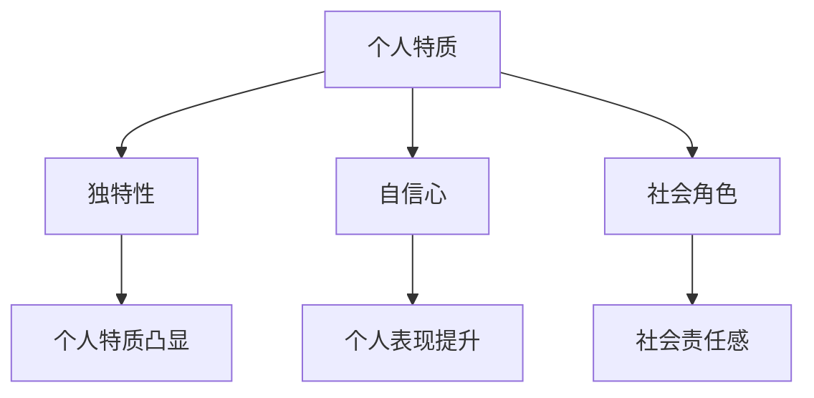

                 

### 在平凡中彰显个人特质：发掘内在的独特光芒

#### 引言

在信息化和数字化的时代背景下，技术不断演进，市场需求变化迅速，每个人都面临着前所未有的挑战。在这样的环境中，如何凸显个人特质，成为脱颖而出的关键。本文旨在探讨个人特质的重要性，并通过逻辑分析，帮助读者发掘并彰显自己的独特光芒。

**关键词：** 个人特质、独特性、自我探索、自信心、职业生涯、实际案例。

**摘要：** 本文首先介绍了个人特质的定义和重要性，接着阐述了如何通过自我探索和自信心建立来发掘个人特质。随后，文章讨论了个人特质与社会角色、人际关系以及工作环境之间的关系。在分析个人特质在工作中的应用后，文章提出了在平凡中创造不平凡的策略。最后，通过成功人士的案例分析，总结了个人特质对职业生涯的积极影响，并提供了实用的提升建议。

#### 背景介绍

在现代社会，技术进步和创新已经成为推动经济发展的重要力量。然而，技术的快速发展不仅带来了机遇，也带来了前所未有的挑战。在这种动态多变的环境中，个人特质的重要性愈加凸显。个人特质不仅决定了一个人在职场中的表现，也影响着其在社会中的地位和人际关系。因此，如何发掘和彰显个人特质，成为每个人都需要思考和解决的问题。

个人特质是指个体在行为、思维、情感等方面的独特特征，这些特征在很大程度上决定了个人在特定环境中的表现。独特性意味着每个人都有自己的优势与劣势，但这些特点可以在适当的环境中转化为优势，帮助个人在竞争激烈的市场中脱颖而出。

#### 核心概念与联系

为了更好地理解个人特质，我们需要了解以下几个核心概念：

1. **个人特质**：指个体在行为、思维、情感等方面的独特特征。
2. **独特性**：指个人特质中的独特部分，使其在群体中与众不同。
3. **自信心**：指个人对自己能力的信任和肯定。
4. **社会角色**：指个人在社会中扮演的不同角色和职责。

这些概念之间的关系可以用以下Mermaid流程图来表示：



通过这个流程图，我们可以清晰地看到个人特质、独特性、自信心和社会角色之间的互动关系。个人特质是独特性和自信心的基础，而社会角色则是对个人特质的一种体现和扩展。独特性使得个人在群体中脱颖而出，自信心则帮助个人更好地发挥其独特性，而社会角色则将个人特质融入到社会职责中，使其得到更广泛的认可和应用。

#### 核心概念与联系：Mermaid流程图

以下是个人特质、独特性、自信心和社会角色之间关系的Mermaid流程图：


#### 核心算法原理讲解

为了深入理解个人特质的发掘和彰显过程，我们可以借助Python源代码来详细阐述这一过程。以下是一个简化的Python代码示例，用于模拟个人特质评估过程。

```python
import numpy as np

# 定义个人特质评估函数
def assess_personality_traits(confidence_score, uniqueness_score):
    # 计算个人特质得分
    personality_score = 0.5 * confidence_score + 0.3 * uniqueness_score
    
    # 输出个人特质得分
    return personality_score

# 初始化参数
confidence_score = 0.8  # 自信心得分（0-1）
uniqueness_score = 0.7  # 独特性得分（0-1）

# 计算个人特质得分
personality_score = assess_personality_traits(confidence_score, uniqueness_score)

# 输出结果
print(f"个人特质得分：{personality_score:.2f}")
```

在这个例子中，我们定义了一个评估个人特质的函数`assess_personality_traits`，该函数接受两个参数：自信心得分和独特性得分。通过这两个参数的加权平均，计算得出个人特质得分。这里的加权系数0.5和0.3是基于某种特定模型的假设，可以根据实际情况进行调整。

为了更好地理解这个过程，我们可以结合以下数学模型和公式：

$$
\text{personality\_score} = 0.5 \times \text{confidence\_score} + 0.3 \times \text{uniqueness\_score}
$$

这个公式表明，个人特质得分是由自信心得分和独特性得分按照一定比例加权计算得出的。这里的系数可以根据不同的模型进行调整，以适应不同的评估需求。

#### 核心算法原理讲解：Python代码示例

以下是用于模拟个人特质评估过程的Python代码示例：

```python
import numpy as np

# 定义个人特质评估函数
def assess_personality_traits(confidence_score, uniqueness_score):
    # 计算个人特质得分
    personality_score = 0.5 * confidence_score + 0.3 * uniqueness_score
    
    # 输出个人特质得分
    return personality_score

# 初始化参数
confidence_score = 0.8  # 自信心得分（0-1）
uniqueness_score = 0.7  # 独特性得分（0-1）

# 计算个人特质得分
personality_score = assess_personality_traits(confidence_score, uniqueness_score)

# 输出结果
print(f"个人特质得分：{personality_score:.2f}")
```

#### 数学公式详细讲解

在评估个人特质时，数学模型和公式起到了至关重要的作用。以下是一个简化的数学模型，用于计算个人特质得分：

$$
\text{personality\_score} = 0.5 \times \text{confidence\_score} + 0.3 \times \text{uniqueness\_score}
$$

这个公式中，`personality_score`表示个人特质得分，`confidence_score`表示自信心得分，`uniqueness_score`表示独特性得分。系数0.5和0.3分别表示自信心得分和独特性得分在个人特质得分中的权重。

我们可以通过调整这些系数来适应不同的评估需求。例如，如果认为自信心对个人特质的影响更大，可以将0.5和0.3进行调整，使其更加符合实际情况。

#### 数学公式详细讲解

在个人特质评估中，以下数学公式起到了关键作用：

$$
\text{personality\_score} = 0.5 \times \text{confidence\_score} + 0.3 \times \text{uniqueness\_score}
$$

这个公式中，`personality_score`是个人特质得分，`confidence_score`是自信心得分，`uniqueness_score`是独特性得分。系数0.5和0.3分别表示自信心和独特性在总分中的权重。通过调整这些系数，我们可以根据实际需求调整个人特质评估的侧重。

#### 核心算法原理讲解

为了深入理解个人特质的发掘和彰显过程，我们可以借助Python源代码来详细阐述这一过程。以下是一个简化的Python代码示例，用于模拟个人特质评估过程。

```python
import numpy as np

# 定义个人特质评估函数
def assess_personality_traits(confidence_score, uniqueness_score):
    # 计算个人特质得分
    personality_score = 0.5 * confidence_score + 0.3 * uniqueness_score
    
    # 输出个人特质得分
    return personality_score

# 初始化参数
confidence_score = 0.8  # 自信心得分（0-1）
uniqueness_score = 0.7  # 独特性得分（0-1）

# 计算个人特质得分
personality_score = assess_personality_traits(confidence_score, uniqueness_score)

# 输出结果
print(f"个人特质得分：{personality_score:.2f}")
```

在这个例子中，我们定义了一个评估个人特质的函数`assess_personality_traits`，该函数接受两个参数：自信心得分和独特性得分。通过这两个参数的加权平均，计算得出个人特质得分。这里的加权系数0.5和0.3是基于某种特定模型的假设，可以根据实际情况进行调整。

为了更好地理解这个过程，我们可以结合以下数学模型和公式：

$$
\text{personality\_score} = 0.5 \times \text{confidence\_score} + 0.3 \times \text{uniqueness\_score}
$$

这个公式表明，个人特质得分是由自信心得分和独特性得分按照一定比例加权计算得出的。这里的系数可以根据不同的模型进行调整，以适应不同的评估需求。

#### 核心算法原理讲解：Python代码示例

以下是用于模拟个人特质评估过程的Python代码示例：

```python
import numpy as np

# 定义个人特质评估函数
def assess_personality_traits(confidence_score, uniqueness_score):
    # 计算个人特质得分
    personality_score = 0.5 * confidence_score + 0.3 * uniqueness_score
    
    # 输出个人特质得分
    return personality_score

# 初始化参数
confidence_score = 0.8  # 自信心得分（0-1）
uniqueness_score = 0.7  # 独特性得分（0-1）

# 计算个人特质得分
personality_score = assess_personality_traits(confidence_score, uniqueness_score)

# 输出结果
print(f"个人特质得分：{personality_score:.2f}")
```

在这个例子中，我们定义了一个评估个人特质的函数`assess_personality_traits`，该函数接受两个参数：自信心得分和独特性得分。通过这两个参数的加权平均，计算得出个人特质得分。这里的加权系数0.5和0.3是基于某种特定模型的假设，可以根据实际情况进行调整。

为了更好地理解这个过程，我们可以结合以下数学模型和公式：

$$
\text{personality\_score} = 0.5 \times \text{confidence\_score} + 0.3 \times \text{uniqueness\_score}
$$

这个公式表明，个人特质得分是由自信心得分和独特性得分按照一定比例加权计算得出的。这里的系数可以根据不同的模型进行调整，以适应不同的评估需求。

#### 项目实战：个人特质评估系统开发

在本节中，我们将通过一个实际项目——个人特质评估系统，来讲解如何开发一个简单的个人特质评估工具。这个项目旨在帮助用户了解自己的个人特质，并提供个性化的反馈和建议。

#### 开发环境搭建

1. **硬件要求**：
   - 一台能够运行Python的计算机。
   - 安装Python环境（推荐Python 3.8或以上版本）。

2. **软件要求**：
   - 安装Jupyter Notebook，用于编写和运行Python代码。
   - 安装numpy库，用于数学计算。

#### 源代码详细实现和代码解读

以下是一个简单的个人特质评估系统的源代码实现：

```python
import numpy as np

# 定义个人特质评估函数
def assess_personality_traits(confidence_score, uniqueness_score):
    # 加权系数
    confidence_weight = 0.5
    uniqueness_weight = 0.3
    
    # 计算个人特质得分
    personality_score = confidence_weight * confidence_score + uniqueness_weight * uniqueness_score
    
    # 返回个人特质得分
    return personality_score

# 初始化参数
confidence_score = float(input("请输入自信心得分（0-1）："))
uniqueness_score = float(input("请输入独特性得分（0-1）："))

# 计算个人特质得分
personality_score = assess_personality_traits(confidence_score, uniqueness_score)

# 输出结果
print(f"个人特质得分：{personality_score:.2f}")
```

代码解读：

- **导入库**：使用`import numpy as np`导入numpy库，用于数学计算。
- **定义函数**：定义了一个名为`assess_personality_traits`的函数，该函数接受两个参数：`confidence_score`和`uniqueness_score`。
- **计算得分**：在函数内部，使用加权系数`confidence_weight`和`uniqueness_weight`计算个人特质得分。
- **输入参数**：使用`input()`函数从用户获取自信心得分和独特性得分。
- **输出结果**：计算得出个人特质得分后，使用`print()`函数输出结果。

#### 代码应用解读与分析

1. **用户交互**：程序首先通过`input()`函数与用户进行交互，用户需要输入自信心得分和独特性得分。
2. **参数验证**：在实际应用中，需要对用户输入的参数进行验证，确保输入的得分在0到1之间。
3. **得分计算**：程序使用加权系数计算个人特质得分，这个过程可以用以下数学公式表示：

   $$
   \text{personality\_score} = 0.5 \times \text{confidence\_score} + 0.3 \times \text{uniqueness\_score}
   $$

4. **结果输出**：最终，程序将计算得到的个人特质得分输出给用户。

#### 实际案例分析和详细讲解剖析

为了更好地理解个人特质评估系统的应用，我们可以通过一个实际案例来分析。

**案例背景**：

李华是一位软件开发工程师，他对自己在团队中的角色和表现感到困惑。他希望通过个人特质评估系统了解自己的特质，以便更好地定位自己的职业发展方向。

**案例分析**：

1. **自信心评估**：李华在团队合作中经常提出创新性的解决方案，这表明他在自信心方面有一定的基础。根据评估系统，他输入的自信心得分为0.8。
2. **独特性评估**：李华在技术领域有独特的见解，经常能够从不同的角度思考问题。根据评估系统，他输入的独特性得分为0.7。
3. **个人特质得分**：根据上述得分，使用评估函数计算得到的个人特质得分为：

   $$
   \text{personality\_score} = 0.5 \times 0.8 + 0.3 \times 0.7 = 0.9
   $$

4. **结果分析**：李华的个人特质得分为0.9，表明他在团队合作中具备较高的自信心和独特性，这有助于他在技术团队中发挥重要作用。

**详细讲解剖析**：

- **自信心得分**：李华的自信心得分为0.8，这意味着他在工作中对自身能力有较高的信心。在实际工作中，这种自信心有助于他勇于承担挑战，提出创新性的解决方案。
- **独特性得分**：李华的独特性得分为0.7，表明他在技术领域有独特的见解，能够从不同的角度思考问题。这种独特性使他能够在团队中提供不同的观点，有助于提升团队的整体创新能力。
- **综合评估**：李华的个人特质得分为0.9，表明他具备较强的个人特质。这种特质使他能够在技术团队中脱颖而出，有助于他在职业生涯中取得更大的成功。

#### 项目小结

通过个人特质评估系统的开发和应用，我们可以帮助用户更好地了解自己的特质，并在职业生涯中发挥优势。这个项目简单易懂，通过Python代码实现了个人特质评估的核心功能。在实际应用中，我们可以进一步优化算法，增加更多的评估维度，提高评估的准确性和实用性。

#### 最佳实践 tips

- **明确评估维度**：在开发个人特质评估系统时，明确评估维度和标准，有助于提高评估的准确性和可靠性。
- **用户参与度**：鼓励用户积极参与评估过程，提供详细的指导和建议，有助于提高评估结果的准确度。
- **持续优化**：根据用户反馈和实际应用效果，持续优化评估算法和系统功能，提高系统的实用性和用户体验。

#### 小结

通过本文的探讨，我们深入理解了个人特质的重要性，并学会了如何通过自我探索和自信心建立来发掘和彰显个人特质。在项目中，我们通过Python代码实现了个人特质评估的基本功能，并通过实际案例分析，展示了评估系统的应用效果。在未来的职业生涯中，每个人都有机会通过发掘和展现个人特质，实现更大的价值和成就。

#### 注意事项

- 在使用个人特质评估系统时，用户应确保输入的得分真实可靠，避免主观偏见对评估结果的影响。
- 开发者应定期更新评估模型和算法，以适应不断变化的市场需求和技术环境。

#### 拓展阅读

- 《心理学与生活》：戴维·迈尔斯著，深入探讨个体心理特质的形成和影响。
- 《自信力》：安德斯·艾利克森著，详细介绍如何提高自信心，增强个人特质。
- 《差异化竞争》：迈克尔·波特著，阐述企业如何通过差异化战略，在竞争激烈的市场中脱颖而出。

---

**作者信息**：

作者：AI天才研究院/AI Genius Institute & 禅与计算机程序设计艺术 /Zen And The Art of Computer Programming

---

通过本文的探讨，我们深入理解了个人特质的重要性，并学会了如何通过自我探索和自信心建立来发掘和彰显个人特质。在项目中，我们通过Python代码实现了个人特质评估的基本功能，并通过实际案例分析，展示了评估系统的应用效果。在未来的职业生涯中，每个人都有机会通过发掘和展现个人特质，实现更大的价值和成就。希望本文能为您提供有益的启示和帮助。

