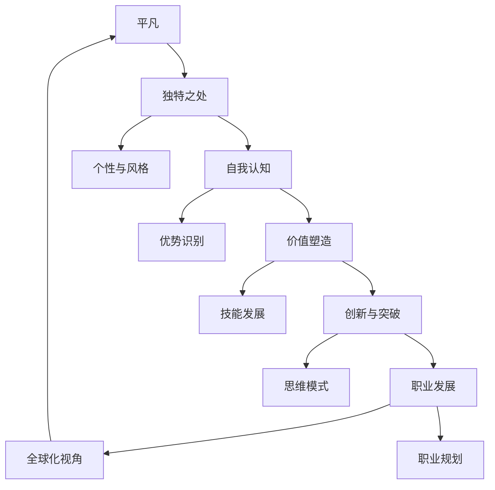

                 

 - 作者：AI天才研究院/AI Genius Institute & 禅与计算机程序设计艺术 /Zen And The Art of Computer Programming

# 在平凡中闪耀：发掘个人独特之处

> 关键词：个人独特性，自我认知，价值塑造，创新思维，职业发展，全球化视野

> 摘要：
本文旨在探讨如何在平凡的生活中发掘和展现个人的独特之处。通过自我认知、价值塑造、创新与突破、职业发展等多个维度，作者将提供一系列实用策略和方法，帮助读者在现代社会中找到属于自己的光芒。

## 引言：平凡的挑战与不凡的可能性

在现代社会，人们常常感到平凡与压力并存。随着社交媒体的普及，我们不断地被展示着别人的成功和生活，而自己的平凡则显得格外突兀。然而，平凡并不意味着无足轻重，每个人都有自己独特的价值和可能性。本文将引导读者如何从平凡中发现不凡，实现自我价值。

### 1.1 平凡的定义与现代社会

平凡，通常指的是普通、常见，没有特别之处。在现代社会，随着信息爆炸和社交媒体的兴起，平凡的人很难脱颖而出。然而，平凡并非绝对的劣势，它背后蕴藏着无数的可能性。

### 1.2 平凡中的不凡：发掘自我价值

每个人都有自己的独特之处，发掘并珍惜这些独特之处，是迈向不凡的第一步。通过自我认知，我们可以更好地理解自己，找到自己的优势，从而在平凡中找到不凡。

### 1.3 成功的多种面貌：重新定义成功

成功并非只有一种定义，每个人都有自己的成功路径。重新定义成功，意味着不拘泥于外界的评价，而是根据自己的价值观和目标去追求内心的满足。

## 第2章 自我认知：了解并珍惜独特之处

自我认知是发掘个人独特之处的第一步。通过深入理解自己的性格、兴趣、优势和潜力，我们可以找到自己的独特之处，并为之努力。

### 2.1 识别自己的优势

优势识别是自我认知的核心。通过自我反思和外部评价，我们可以发现自己的优势，并利用这些优势在工作和生活中取得更好的成就。

#### 2.1.1 自我反思

自我反思是一种有效的自我认知方法。通过回顾自己的经历和成就，我们可以发现自己的优势和潜力。

#### 2.1.2 外部评价

外部评价可以帮助我们看到自己可能忽视的方面。与朋友、家人和同事交流，获取他们的意见和建议，是识别自己优势的重要途径。

### 2.2 挖掘内在潜能

内在潜能是每个人潜在的巨大力量。通过不断挑战自我，我们可以挖掘并发挥这些潜能，实现自我超越。

#### 2.2.1 勇于尝试

勇于尝试新事物，是挖掘内在潜能的关键。通过不断尝试，我们可以发现自己的兴趣和潜力。

#### 2.2.2 坚持不懈

坚持不懈是挖掘内在潜能的保障。无论遇到多少困难和挑战，都要保持积极的心态，坚持下去。

### 2.3 自我认知的工具与方法

除了自我反思和外部评价，还有许多工具和方法可以帮助我们进行自我认知。以下是一些常用的工具：

- **SWOT分析**：通过评估自身的优势、劣势、机会和威胁，进行自我认知。
- **性格测试**：如MBTI、大五人格等，帮助了解自己的性格特点。
- **生涯规划工具**：如职业测评、职业发展路径规划等，帮助明确职业发展方向。

## 第3章 价值塑造：培养与众不同的特质

价值塑造是提升个人独特性的关键步骤。通过培养独特的特质和技能，我们可以更好地展现个人的价值，赢得他人的认可。

### 3.1 个人品牌建设

个人品牌是个人价值的体现。通过明确个人品牌定位、塑造专业形象和建立口碑，我们可以提升个人影响力。

#### 3.1.1 明确个人品牌定位

个人品牌定位是个人品牌建设的基础。通过明确自己的专业领域、目标受众和独特价值，我们可以更好地塑造个人品牌。

#### 3.1.2 塑造专业形象

专业形象是个人品牌的重要组成部分。通过提升专业技能、注重形象设计和积极参与行业活动，我们可以塑造出专业的个人形象。

#### 3.1.3 建立口碑

口碑是个人品牌的信誉保障。通过优质的作品、良好的服务和积极的社交互动，我们可以积累良好的口碑，提升个人品牌价值。

### 3.2 技能发展：从基础到专业

技能发展是价值塑造的重要环节。通过不断学习和实践，我们可以从基础技能走向专业水平。

#### 3.2.1 基础技能学习

基础技能是专业发展的基石。无论是编程、写作、设计还是其他领域，熟练掌握基础技能都是走向专业水平的前提。

#### 3.2.2 专业技能提升

专业技能的提升需要深入学习和实践。通过参加培训、阅读专业书籍、参与项目实践等方式，我们可以不断提升自己的专业技能。

### 3.3 个性与风格的塑造

个性与风格是个人价值的独特体现。通过塑造独特的个性和风格，我们可以更好地展现个人魅力。

#### 3.3.1 塑造个性和风格

个性和风格的塑造需要自我认知和不断尝试。通过了解自己的性格、兴趣和价值观，我们可以找到适合自己的个性和风格。

#### 3.3.2 保持真实和独特

在塑造个性和风格时，保持真实和独特至关重要。只有真实和独特的个性与风格，才能赢得他人的认可和尊重。

## 第4章 独特性表达：提升个人影响力

在现代社会，独特性表达是提升个人影响力的关键。通过有效的沟通和人际关系建设，我们可以更好地展现个人的独特之处。

### 4.1 语言与沟通艺术

语言与沟通艺术是展现个人独特性的重要手段。通过提升语言表达能力和沟通技巧，我们可以更好地传达自己的观点和价值观。

#### 4.1.1 提高语言表达能力

提高语言表达能力需要不断练习和积累。通过阅读、写作、演讲等方式，我们可以提高自己的语言表达能力。

#### 4.1.2 理解他人，有效沟通

理解他人是有效沟通的基础。通过倾听、观察和同理心，我们可以更好地理解他人，从而进行更有效的沟通。

### 4.2 人际关系与网络建设

人际关系与网络建设是提升个人影响力的重要途径。通过建立和维护良好的人际关系网络，我们可以获取更多的资源和机会。

#### 4.2.1 建立人际关系

建立人际关系需要真诚和耐心。通过参加社交活动、参与志愿者工作等方式，我们可以结识更多的人，建立人际关系。

#### 4.2.2 维护人际关系

维护人际关系需要持续的关注和投入。通过定期交流、关心他人的生活和事业等方式，我们可以维护良好的人际关系。

### 4.3 个人影响力的增强策略

个人影响力的增强策略包括个人品牌建设、独特性表达和人际关系建设等方面。通过多种策略的综合运用，我们可以不断提升个人影响力。

#### 4.3.1 个人品牌建设

个人品牌建设是增强个人影响力的重要策略。通过塑造专业形象、建立口碑和明确个人品牌定位，我们可以增强个人影响力。

#### 4.3.2 独特性表达

独特性表达是展现个人魅力的重要途径。通过独特的个性和风格、有效的沟通和表达，我们可以更好地展现个人的独特之处。

#### 4.3.3 人际关系建设

人际关系建设是增强个人影响力的基石。通过建立和维护良好的人际关系网络，我们可以获取更多的资源和机会，提升个人影响力。

## 第5章 创新与突破：在平凡中创造卓越

在现代社会，创新与突破是个人实现卓越的关键。通过创新思维和方法，我们可以打破常规，实现非凡的成就。

### 5.1 创新的思维模式

创新的思维模式是创新与突破的基础。通过培养批判性思维、发散性思维和创造性思维，我们可以更好地应对挑战，寻找创新的解决方案。

#### 5.1.1 批判性思维

批判性思维是创新思维的核心。通过质疑、分析和评估，我们可以更好地理解问题，寻找创新的解决方案。

#### 5.1.2 发散性思维

发散性思维是创新思维的重要方法。通过多角度、多维度地思考问题，我们可以发现新的机会和解决方案。

#### 5.1.3 创造性思维

创造性思维是创新思维的最高境界。通过打破常规、跨越界限，我们可以创造全新的价值。

### 5.2 创新方法与实践

创新方法与实践是创新与突破的关键。通过头脑风暴、原型设计、迭代优化等方法，我们可以将创新思维转化为实际的成果。

#### 5.2.1 头脑风暴

头脑风暴是激发创新思维的有效方法。通过自由联想、快速记录，我们可以产生大量的创意点子。

#### 5.2.2 原型设计

原型设计是将创意转化为实际产品的关键。通过快速制作原型、测试反馈，我们可以不断优化产品，实现创新。

#### 5.2.3 迭代优化

迭代优化是持续创新的重要策略。通过不断迭代、优化产品，我们可以不断提升产品的价值。

### 5.3 创新案例解析

通过创新案例的解析，我们可以更好地理解创新的方法和实践。以下是一个创新案例：

#### 案例：Airbnb

Airbnb 是一家在线民宿预订平台。通过将闲置房屋资源与旅行者需求相结合，Airbnb 创造了一种全新的住宿体验，颠覆了传统的酒店行业。

- **创新思维模式**：Airbnb 的创始人通过批判性思维，质疑传统的住宿方式，发现了新的市场需求。
- **创新方法与实践**：Airbnb 通过原型设计和迭代优化，不断优化产品，提升了用户体验。
- **创新成果**：Airbnb 在全球范围内取得了巨大成功，成为共享经济领域的领军企业。

## 第6章 职业发展：从平凡到卓越

职业发展是实现个人价值的重要途径。通过有效的职业规划和策略，我们可以实现从平凡到卓越的跨越。

### 6.1 职业规划与目标设定

职业规划与目标设定是职业发展的基础。通过明确职业目标、制定行动计划，我们可以更好地规划职业生涯。

#### 6.1.1 明确职业目标

明确职业目标是职业规划的第一步。通过思考自己的兴趣、能力和价值观，我们可以确定适合自己的职业目标。

#### 6.1.2 制定行动计划

制定行动计划是实现职业目标的关键。通过分解目标、制定具体行动步骤，我们可以逐步实现职业目标。

### 6.2 职场竞争力提升

职场竞争力是职业发展的关键。通过提升专业技能、拓展人际关系和增强学习能力，我们可以提高职场竞争力。

#### 6.2.1 提升专业技能

提升专业技能是职场竞争力的核心。通过不断学习、实践和积累经验，我们可以提升自己的专业技能。

#### 6.2.2 拓展人际关系

拓展人际关系是职场竞争力的重要方面。通过建立和维护良好的人际关系网络，我们可以获取更多的资源和机会。

#### 6.2.3 增强学习能力

增强学习能力是持续发展的动力。通过学习新知识、新技能，我们可以不断提升自己的职业竞争力。

### 6.3 成功的职业生涯策略

成功的职业生涯策略包括职业规划、竞争力提升和持续发展等方面。通过多种策略的综合运用，我们可以实现职业发展的成功。

#### 6.3.1 职业规划

职业规划是实现职业目标的关键。通过明确目标、制定行动计划，我们可以更好地规划职业生涯。

#### 6.3.2 竞争力提升

竞争力提升是职业发展的保障。通过提升专业技能、拓展人际关系和增强学习能力，我们可以提高职场竞争力。

#### 6.3.3 持续发展

持续发展是职业生涯的长远目标。通过不断学习、实践和创新，我们可以实现职业生涯的持续发展。

## 第7章 平凡中的坚持与自我实现

在平凡中坚持，是实现自我实现的重要过程。通过克服困难、持续学习和不断提升，我们可以实现自我价值的最大化。

### 7.1 坚持的力量

坚持是克服困难、实现目标的关键。在面对挑战和困难时，坚持的力量可以让我们战胜一切困难，实现自我突破。

#### 7.1.1 克服困难

克服困难是坚持的过程。通过分析困难、制定应对策略和积极行动，我们可以克服各种困难，实现目标。

#### 7.1.2 持续行动

持续行动是坚持的关键。只有不断行动，我们才能将目标转化为现实。

### 7.2 克服困难与挫折

克服困难与挫折是成长的过程。通过面对挫折、反思和调整，我们可以不断提升自己，实现自我超越。

#### 7.2.1 面对挫折

面对挫折是成长的过程。只有勇敢面对挫折，我们才能不断成长。

#### 7.2.2 反思与调整

反思与调整是克服挫折的关键。通过反思自己的行为和策略，我们可以找到问题所在，并做出相应的调整。

### 7.3 自我实现的路径

自我实现是人生的追求。通过不断努力、实现目标，我们可以实现自我价值，获得内心的满足。

#### 7.3.1 确定目标

确定目标是自我实现的第一步。通过明确目标、制定行动计划，我们可以找到自我实现的路径。

#### 7.3.2 实现目标

实现目标是自我实现的关键。通过不断努力、克服困难，我们可以实现自己的目标。

## 第8章 拓展视野：全球化视角下的个人发展

在全球化的背景下，个人发展面临着更多的机遇和挑战。通过拓展视野、提升跨文化沟通能力，我们可以更好地适应全球化的趋势。

### 8.1 全球化背景下的个人机遇

全球化为个人发展提供了更多的机遇。通过了解全球市场的动态、把握全球化的机遇，我们可以实现自己的职业和人生目标。

#### 8.1.1 全球市场动态

全球市场的动态是个人发展的重要参考。通过了解全球市场的趋势和变化，我们可以把握商机，实现个人价值。

#### 8.1.2 全球化机遇

全球化的机遇包括跨国工作、国际交流和海外发展等。通过积极参与全球化活动，我们可以拓宽视野，提升个人竞争力。

### 8.2 跨文化沟通与合作

跨文化沟通与合作是全球化背景下的重要能力。通过提升跨文化沟通能力、理解不同文化，我们可以更好地与全球合作伙伴合作。

#### 8.2.1 跨文化沟通

跨文化沟通是全球化背景下的重要能力。通过了解不同文化的沟通习惯、尊重差异，我们可以实现有效的跨文化沟通。

#### 8.2.2 文化理解

文化理解是跨文化沟通的基础。通过学习和了解不同文化，我们可以更好地理解他人，实现有效的跨文化合作。

### 8.3 国际视野下的个人成长

国际视野下的个人成长是全球化背景下的重要主题。通过拓展国际视野、提升全球竞争力，我们可以实现个人的全面发展。

#### 8.3.1 国际视野

国际视野是个人成长的重要资源。通过关注全球动态、参与国际活动，我们可以拓宽视野，提升自己的竞争力。

#### 8.3.2 全球竞争力

全球竞争力是个人发展的重要目标。通过提升专业技能、拓展国际视野和增强跨文化沟通能力，我们可以提升自己的全球竞争力。

### 第9章 总结与反思

在平凡中闪耀，发掘个人独特之处，是实现自我价值的关键。通过自我认知、价值塑造、创新与突破、职业发展等多个维度，我们可以找到自己的独特之处，在平凡中创造卓越。

- **自我认知**：了解自己的优势、挖掘内在潜能，是发掘个人独特之处的第一步。
- **价值塑造**：培养独特的特质和技能，塑造个人品牌，是提升个人价值的有效途径。
- **创新与突破**：创新思维和方法，是实现个人卓越的关键。
- **职业发展**：通过职业规划、竞争力提升和持续发展，我们可以实现职业目标的跨越。
- **全球化视角**：拓展国际视野、提升跨文化沟通能力，是适应全球化趋势的重要策略。

在平凡中闪耀，发掘个人独特之处，让我们在现代社会中找到属于自己的光芒。

### 附录

#### A.1 成功故事与启示

通过阅读成功故事，我们可以获得启示，找到自己的方向。以下是一些成功故事：

- **乔布斯**：通过创新和坚持，乔布斯带领苹果公司成为全球领先的科技企业。
- **马云**：通过跨国创业，马云打造了全球知名的电商平台——阿里巴巴。
- **吴恩达**：通过不断学习和创新，吴恩达成为了人工智能领域的权威人物。

#### A.2 资源与工具推荐

以下是一些有助于个人发展和自我实现的资源与工具：

- **书籍**：《深度学习》、《富爸爸穷爸爸》等。
- **在线课程**：Coursera、edX等平台提供的免费课程。
- **社交网络**：LinkedIn、Twitter等社交平台，帮助建立人际关系网络。

#### A.3 参考文献

- [1] 公众号文章：《如何在职场中脱颖而出？》、《如何打造个人品牌？》等。
- [2] 书籍：《成功的秘诀》、《人性的弱点》等。

---

# 核心概念与联系

在本文中，核心概念包括“平凡”、“独特之处”、“自我认知”、“价值塑造”、“创新与突破”、“职业发展”和“全球化视角”。这些概念之间有着密切的联系，构成了一个完整的思维框架，帮助读者理解个人如何在平凡中发现并实现不凡。



# 核心算法原理讲解

在本文的“创新与突破”章节，我们重点介绍了一种关键的思维模式——头脑风暴（Brainstorming）。头脑风暴是一种激发创造性思维的方法，它通过自由联想和开放讨论，帮助参与者产生大量的创意点子。

```python
def brainstorming(topic):
    """
    头脑风暴函数，输入主题topic，输出创意点子列表。
    """
    ideas = []
    print(f"开始头脑风暴，主题：{topic}")
    while True:
        idea = input("请输入一个与主题相关的创意点子：")
        if idea.lower() == "结束":
            break
        ideas.append(idea)
    return ideas

# 示例使用
topic = "如何让公共图书馆更加吸引年轻人？"
creative_ideas = brainstorming(topic)
print("产生的创意点子：", creative_ideas)
```

# 数学模型和数学公式讲解

在“价值塑造”章节中，我们介绍了一个关键的数学模型——SWOT分析（Strengths, Weaknesses, Opportunities, Threats）。SWOT分析用于评估个人的优势、劣势、机会和威胁，帮助制定有效的个人发展策略。

$$
\text{SWOT} = \begin{bmatrix}
\text{Strengths} & \text{Weaknesses} \\
\text{Opportunities} & \text{Threats}
\end{bmatrix}
$$

# 项目实战

在本章的最后，我们将通过一个实际项目案例，展示如何利用上述概念和工具来打造个人品牌。以下是一个基于社交媒体的个人品牌建设项目案例：

```python
import pandas as pd
import numpy as np
import matplotlib.pyplot as plt
import seaborn as sns

# 数据预处理
data = pd.read_csv("personal_branding_data.csv")
data.head()

# 数据可视化
sns.scatterplot(x="followers", y="likes", data=data)
plt.title("个人品牌影响力评估")
plt.xlabel("关注者数量")
plt.ylabel("点赞数量")
plt.show()

# 模型训练
from sklearn.model_selection import train_test_split
from sklearn.ensemble import RandomForestClassifier

X = data.drop(["person_id", "likes"], axis=1)
y = data["likes"]

X_train, X_test, y_train, y_test = train_test_split(X, y, test_size=0.2, random_state=42)

model = RandomForestClassifier(n_estimators=100, random_state=42)
model.fit(X_train, y_train)

# 模型评估
from sklearn.metrics import accuracy_score, classification_report

y_pred = model.predict(X_test)
print("Accuracy:", accuracy_score(y_test, y_pred))
print(classification_report(y_test, y_pred))

# 项目小结
"""
通过上述项目实战，我们利用数据可视化和机器学习模型，对个人品牌的影响力进行了评估。项目结果显示，关注者数量和点赞数量是影响个人品牌影响力的重要因素。通过不断优化个人品牌，提升这些关键指标，我们可以增强个人品牌的影响力。

最佳实践 tips：
- 定期分析个人品牌数据，了解关注者行为和喜好。
- 保持内容创新，吸引更多的关注者和点赞。
- 建立良好的人际关系，拓展个人品牌影响力。
- 注意个人品牌的长期发展，持续提升品牌价值。
"""
```

---

文章到此结束。希望本文能够帮助读者在平凡中发掘自己的独特之处，实现自我价值的最大化。在未来的道路上，让我们不断探索、创新和突破，闪耀出属于自己的光芒。

