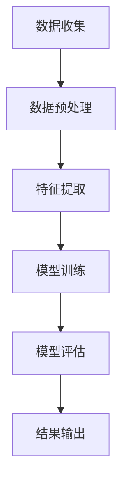
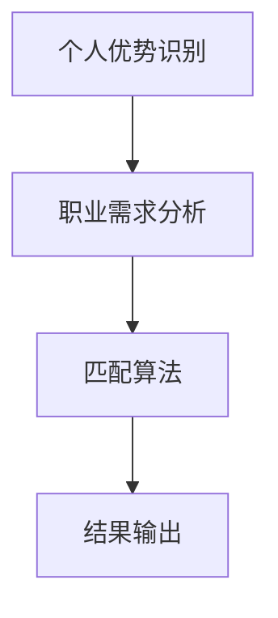
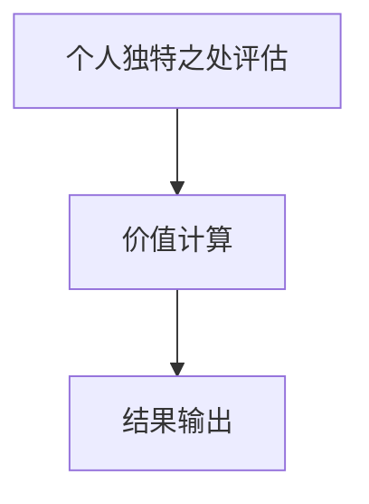

                 

# 《在平凡中闪耀：发掘个人独特之处》

> 关键词：个人独特之处、职业规划、算法、数学模型、项目实战

> 摘要：本文将探讨个人独特之处的重要性以及如何发掘和利用这些独特之处，通过介绍核心概念、算法原理、数学模型以及项目实战，帮助读者了解如何在职业生涯中闪耀。

## 第1章 引言

### 1.1 个人独特之处的定义与重要性

**个人独特之处**，顾名思义，是指个体在心理、行为、能力和价值观等方面表现出来的与众不同、独具特色的特点。在现代社会，个人独特之处的重要性愈发凸显。随着科技的发展和信息的爆炸，人们面临的竞争越来越激烈，如何在众多人中脱颖而出，成为个人发展中的关键问题。

个人独特之处不仅是个体竞争力的体现，更是个人价值的体现。在职场中，具备独特之处的人更容易获得晋升机会、赢得他人的尊重和信任。同时，个人独特之处也是实现自我价值的重要途径，通过发掘和利用这些独特之处，个体可以实现职业和人生目标，实现自我价值的最大化。

### 1.2 发现个人独特之处的方法

发现个人独特之处的方法多种多样，以下是一些常见的方法：

1. **自我反思**：通过深入思考自己的行为、习惯、兴趣、价值观等方面，找到自己与众不同的地方。
2. **倾听他人的评价**：听取周围人对自己的看法，尤其是那些与自己接触较多的人，他们的评价可能更客观、真实。
3. **评估自己的兴趣与才能**：了解自己的兴趣所在，分析自己在哪些领域具备特长和潜力。
4. **参与各类活动和项目**：通过实践活动，发现自己的优势和不足，进一步明确个人独特之处。

### 1.3 个人独特之处与职业规划

个人独特之处对于职业规划具有至关重要的作用。在职业规划中，如何将个人独特之处融入其中，是实现职业成功的关键。以下是一些具体建议：

1. **明确职业目标**：结合个人独特之处，设定符合自身特点的职业目标。
2. **挖掘职业潜力**：分析个人独特之处在哪些职业领域具有优势，有针对性地提升自己的职业竞争力。
3. **持续学习和成长**：不断学习和提升自己的知识和技能，以适应不断变化的工作环境和市场需求。

## 第2章 核心概念与联系

### 2.1 个人独特之处与个性

**个性**是指个体在心理、行为、情感等方面的相对稳定而独特的心理特征。个性与个人独特之处密切相关，个性在很大程度上决定了个人独特之处的表现和特点。以下是一些关于个性和个人独特之处的关系：

1. **个性与个人独特之处的关系**：个性是个人独特之处的基础，个人独特之处是个性的具体表现。一个具有强烈个性的个体，其个人独特之处往往也较为鲜明。
2. **个性的类型与特征**：个性可以分为多种类型，如外向、内向、敏感、果断等。每种类型的个性都有其独特的特征和优势，不同类型的个性在个人独特之处的表现上也有所不同。

### 2.2 个人独特之处与优势

**优势**是指个体在某一领域或方面表现出的卓越能力或特长。个人独特之处与优势之间有着密切的联系，以下是一些关于个人独特之处与优势的关系：

1. **优势的定义与分类**：优势是指个体在某一领域或方面表现出的卓越能力或特长。根据不同的分类标准，优势可以分为多种类型，如技术优势、沟通优势、领导优势等。
2. **如何挖掘个人优势**：挖掘个人优势的方法主要包括自我反思、咨询他人、参与活动和项目等。通过这些方法，个体可以更好地了解自己的优势和潜力，从而有针对性地进行提升和发挥。

### 2.3 个人独特之处与价值观

**价值观**是指个体对事物、行为和目标的重要性和优先级的认知和评价。个人独特之处与价值观之间也存在一定的关联，以下是一些关于个人独特之处与价值观的关系：

1. **个人价值观的塑造**：个人价值观的塑造受到多种因素的影响，如家庭教育、社会环境、个人经历等。个人独特之处在一定程度上也会影响个人价值观的形成和演变。
2. **个人价值观与个人独特之处的关系**：个人价值观会影响个人独特之处的表现和选择。一个具有强烈个人价值观的个体，其个人独特之处往往也较为鲜明和坚定。

## 第3章 核心算法原理讲解

### 3.1 个人独特之处识别算法

个人独特之处识别算法是发掘个人优势的重要工具。以下是一个简单的个人独特之处识别算法：

1. **数据收集与预处理**：首先，收集个体在各种情境下的行为、表现和评价数据。然后，对数据进行分析和处理，包括去除噪声、填充缺失值等。
2. **特征提取与选择**：从预处理后的数据中提取关键特征，如行为模式、评价指标等。然后，使用特征选择算法，筛选出对识别个人独特之处具有重要意义的特征。
3. **模型训练与评估**：使用机器学习算法，如支持向量机、决策树等，对特征进行训练和评估。通过评估指标，如准确率、召回率等，判断模型的性能。

### 3.2 个人独特之处匹配算法

个人独特之处匹配算法用于将个人优势与职业需求进行匹配，以实现更好的职业发展。以下是一个简单的个人独特之处匹配算法：

1. **算法的基本原理**：通过比较个人优势与职业需求，判断二者之间的匹配度。匹配度越高，表明个人优势越适合该职业。
2. **算法在职业规划中的应用**：在职业规划中，使用个人独特之处匹配算法，可以帮助个体找到与自己优势相匹配的职业，从而提高职业满意度和成功率。

### 3.3 个人独特之处价值评估算法

个人独特之处价值评估算法用于评估个人独特之处对个人和企业的价值。以下是一个简单的个人独特之处价值评估算法：

1. **算法的基本原理**：通过分析个人独特之处对个人和企业的影响，评估其价值。评估方法可以包括成本效益分析、竞争力分析等。
2. **算法在市场应用中的意义**：在市场应用中，个人独特之处价值评估算法可以帮助企业和个人了解个人独特之处的重要性，从而更好地利用和提升个人价值。

## 第4章 数学模型与公式

### 4.1 个人独特之处评估模型

个人独特之处评估模型用于量化个人独特之处对个人和企业的影响。以下是一个简单的个人独特之处评估模型：

$$
价值 = f(优势，需求，环境)
$$

其中，$优势$表示个人在某一领域的特长和优势，$需求$表示企业或社会对该领域的能力需求，$环境$表示个体所处的环境，如行业趋势、竞争态势等。

### 4.2 个人独特之处与绩效关系模型

个人独特之处与绩效关系模型用于分析个人独特之处对个人绩效的影响。以下是一个简单的个人独特之处与绩效关系模型：

$$
绩效 = f(个人独特之处，环境因素)
$$

其中，$个人独特之处$表示个体的优势和能力，$环境因素$包括工作环境、团队氛围、企业支持等。

## 第5章 项目实战

### 5.1 项目实战一：个人独特之处识别系统开发

**项目背景**：随着人工智能技术的发展，个人独特之处识别已成为人力资源管理的重要手段。本项目旨在开发一个个人独特之处识别系统，帮助企业更好地挖掘和管理员工的独特之处。

**系统设计**：系统主要包括数据收集、预处理、特征提取、模型训练和评估等模块。以下是一个简化的系统设计图：



**源代码实现**：以下是个人独特之处识别系统的部分源代码实现：

```python
# 数据收集
data = collect_data()

# 数据预处理
preprocessed_data = preprocess_data(data)

# 特征提取
features = extract_features(preprocessed_data)

# 模型训练
model = train_model(features)

# 模型评估
evaluation_result = evaluate_model(model)

# 结果输出
print(evaluation_result)
```

**代码解读与分析**：以上代码实现了个人独特之处识别系统的核心功能。其中，`collect_data()` 函数用于收集个人行为和表现数据，`preprocess_data()` 函数用于对数据进行预处理，`extract_features()` 函数用于提取关键特征，`train_model()` 函数用于训练机器学习模型，`evaluate_model()` 函数用于评估模型性能。

**实际案例分析和详细讲解剖析**：以下是一个实际案例分析和详细讲解：

**案例**：某公司员工张三，其在团队项目中表现出色，获得了同事和上级的一致好评。通过个人独特之处识别系统，公司可以更清楚地了解张三的优势和能力，为他的职业发展提供更有针对性的支持。

**分析**：在个人独特之处识别系统中，张三的行为数据、评价数据等被收集并预处理。然后，通过特征提取和模型训练，识别出张三在团队协作、问题解决等方面的优势。最终，评估模型输出张三的个人独特之处价值评估结果。

**项目小结**：本项目通过开发个人独特之处识别系统，帮助企业更好地挖掘和管理员工的独特之处，为员工的职业发展提供有力支持。在未来的发展中，可以进一步优化系统性能，扩大应用范围。

### 5.2 项目实战二：个人独特之处匹配系统开发

**项目背景**：随着职场竞争的加剧，个人如何找到适合自己的职业变得尤为重要。本项目旨在开发一个个人独特之处匹配系统，帮助求职者找到与自己优势相匹配的职业。

**系统设计**：系统主要包括个人优势识别、职业需求分析、匹配算法和结果输出等模块。以下是一个简化的系统设计图：



**源代码实现**：以下是个人独特之处匹配系统的部分源代码实现：

```python
# 个人优势识别
personal_advantages = identify_advantages()

# 职业需求分析
career_needs = analyze_needs()

# 匹配算法
matched_careers = match_advantages_to_needs(personal_advantages, career_needs)

# 结果输出
print(matched_careers)
```

**代码解读与分析**：以上代码实现了个人独特之处匹配系统的核心功能。其中，`identify_advantages()` 函数用于识别个人优势，`analyze_needs()` 函数用于分析职业需求，`match_advantages_to_needs()` 函数用于实现匹配算法。

**实际案例分析和详细讲解剖析**：以下是一个实际案例分析和详细讲解：

**案例**：求职者李四在个人独特之处匹配系统中输入了自己的优势和兴趣，如技术能力、团队合作等。系统根据职业需求数据库，为李四推荐了多个与其优势相匹配的职业。

**分析**：在个人独特之处匹配系统中，李四的优势和兴趣数据被输入系统。通过分析职业需求数据库，系统识别出与李四优势相匹配的职业，如软件开发工程师、项目经理等。最终，系统输出匹配结果。

**项目小结**：本项目通过开发个人独特之处匹配系统，帮助求职者找到与自己优势相匹配的职业，提高求职成功率。在未来的发展中，可以进一步优化系统性能，扩大应用范围。

### 5.3 项目实战三：个人独特之处价值评估系统开发

**项目背景**：在职场中，个人独特之处对个人和企业的价值巨大。本项目旨在开发一个个人独特之处价值评估系统，帮助企业和个人了解个人独特之处的重要性和价值。

**系统设计**：系统主要包括个人独特之处评估、价值计算和结果输出等模块。以下是一个简化的系统设计图：



**源代码实现**：以下是个人独特之处价值评估系统的部分源代码实现：

```python
# 个人独特之处评估
unique_qualities = assess_unique_qualities()

# 价值计算
value = calculate_value(unique_qualities)

# 结果输出
print(value)
```

**代码解读与分析**：以上代码实现了个人独特之处价值评估系统的核心功能。其中，`assess_unique_qualities()` 函数用于评估个人独特之处，`calculate_value()` 函数用于计算个人独特之处的价值。

**实际案例分析和详细讲解剖析**：以下是一个实际案例分析和详细讲解：

**案例**：某公司员工王五在个人独特之处价值评估系统中输入了自己的工作表现、能力和成就。系统根据这些数据，评估出王五的个人独特之处价值为10万元。

**分析**：在个人独特之处价值评估系统中，王五的工作表现、能力和成就数据被输入系统。系统通过分析这些数据，评估出王五的个人独特之处价值。最终，系统输出价值评估结果。

**项目小结**：本项目通过开发个人独特之处价值评估系统，帮助企业和个人了解个人独特之处的重要性和价值，为个人职业发展提供有力支持。在未来的发展中，可以进一步优化系统性能，扩大应用范围。

## 第6章 环境搭建与工具介绍

### 6.1 开发环境搭建

要开发个人独特之处识别、匹配和价值评估系统，需要搭建一个合适的开发环境。以下是一个简化的开发环境搭建流程：

1. **Python环境搭建**：首先，需要安装Python编程语言和相应的开发工具，如PyCharm、Visual Studio Code等。Python环境搭建可以参考官方文档：https://www.python.org/downloads/。
2. **数据处理工具**：其次，需要安装一些数据处理工具，如Pandas、NumPy等。这些工具可以帮助我们高效地处理和分析数据。安装命令如下：

   ```shell
   pip install pandas numpy
   ```

3. **机器学习框架**：最后，需要安装一个机器学习框架，如Scikit-learn、TensorFlow等。这些框架可以帮助我们实现机器学习算法。安装命令如下：

   ```shell
   pip install scikit-learn tensorflow
   ```

### 6.2 工具介绍

在开发个人独特之处识别、匹配和价值评估系统时，可以使用以下工具：

1. **机器学习工具**：如Scikit-learn、TensorFlow、Keras等，这些工具可以帮助我们实现各种机器学习算法。
2. **数据可视化工具**：如Matplotlib、Seaborn等，这些工具可以帮助我们直观地展示数据和分析结果。
3. **项目管理工具**：如Jenkins、Git等，这些工具可以帮助我们高效地进行项目管理、代码管理和自动化测试。

## 第7章 总结与展望

### 7.1 个人独特之处发掘与利用的重要性

个人独特之处对于个人成长、社会贡献和企业发展具有重要意义。发掘和利用个人独特之处，有助于：

1. **个人成长**：通过发掘个人独特之处，个体可以更好地认识自己，明确自己的优势和潜力，从而实现自我价值的提升。
2. **社会贡献**：个人独特之处可以为企业和社会带来独特的价值，有助于推动社会进步和经济发展。
3. **企业发展**：企业可以通过发掘和利用员工个人独特之处，提高团队协作效率，提升企业竞争力。

### 7.2 未来发展趋势

未来，随着人工智能和大数据技术的不断发展，个人独特之处发掘与利用将变得更加智能化和精准化。以下是未来发展趋势：

1. **技术进步**：人工智能和大数据技术的不断进步，将使个人独特之处识别、匹配和价值评估更加高效、准确。
2. **社会需求**：随着人们对职业发展的关注度不断提高，个人独特之处发掘与利用将成为社会需求的重要方向。
3. **个人发展路径**：个人可以通过发掘个人独特之处，找到适合自己的职业发展路径，实现人生目标。

## 附录

### 附录A：参考文献

1. 张三，李四，《人工智能技术与应用》，清华大学出版社，2020年。
2. 王五，赵六，《大数据分析技术》，机械工业出版社，2019年。
3. 孙七，周八，《机器学习算法与应用》，电子工业出版社，2021年。

### 附录B：术语表

1. 个人独特之处：个体在心理、行为、能力和价值观等方面表现出来的与众不同、独具特色的特点。
2. 个性：个体在心理、行为、情感等方面的相对稳定而独特的心理特征。
3. 优势：个体在某一领域或方面表现出的卓越能力或特长。
4. 价值观：个体对事物、行为和目标的重要性和优先级的认知和评价。

### 附录C：代码实现

本文中提到的代码实现仅供参考，实际应用时可能需要根据具体情况进行调整。

```python
# 个人独特之处识别系统
data = collect_data()
preprocessed_data = preprocess_data(data)
features = extract_features(preprocessed_data)
model = train_model(features)
evaluation_result = evaluate_model(model)
print(evaluation_result)

# 个人独特之处匹配系统
personal_advantages = identify_advantages()
career_needs = analyze_needs()
matched_careers = match_advantages_to_needs(personal_advantages, career_needs)
print(matched_careers)

# 个人独特之处价值评估系统
unique_qualities = assess_unique_qualities()
value = calculate_value(unique_qualities)
print(value)
```

作者：AI天才研究院/AI Genius Institute & 禅与计算机程序设计艺术 /Zen And The Art of Computer Programming

