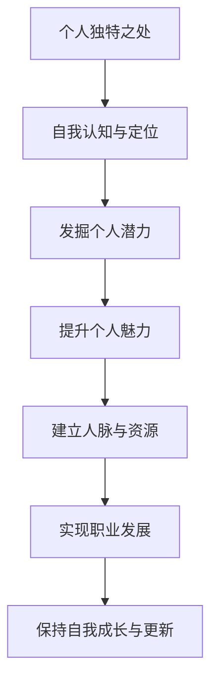

                 

### 第一部分：引言与核心概念

#### 第1章：本书概述与目标

##### 1.1 书籍背景与目标

在当今信息爆炸的时代，每个人都渴望在平凡中闪耀，发掘并展现自己的独特之处。本书旨在为读者提供一套系统、实用的方法和技巧，帮助他们在日常生活中发现自己的独特之处，从而在职业生涯和个人生活中取得成功。

我们的目标是通过以下几个步骤，帮助读者实现这一目标：

1. **自我认知与定位**：通过自我反思和性格分析，帮助读者了解自己的性格特点、价值观和职业发展方向。
2. **发掘个人潜力**：通过目标设定和自我能力提升，帮助读者挖掘和发挥自己的潜力。
3. **提升个人魅力**：通过语言表达、社交技巧和形象设计，提升读者的个人魅力。
4. **建立人脉与资源**：通过人际关系的拓展和管理，帮助读者积累资源，为个人成长提供支持。
5. **实现职业发展**：通过职业规划和求职技巧，帮助读者实现职业目标。
6. **保持自我成长与更新**：强调终身学习的重要性，提供持续自我提升的建议和方法。

##### 1.2 主要内容与章节结构

本书共分为七个部分，每个部分都紧密相连，共同构成了一个完整的学习体系。

- **第1部分：引言与核心概念**：介绍本书的背景、目标和结构，以及核心概念的联系。
- **第2部分：自我认知与定位**：帮助读者进行自我反思和性格分析，明确职业发展方向。
- **第3部分：发掘个人潜力**：通过目标设定和自我能力提升，挖掘和发挥个人潜力。
- **第4部分：提升个人魅力**：探讨如何通过语言表达、社交技巧和形象设计提升个人魅力。
- **第5部分：建立人脉与资源**：分享如何拓展人脉、积累资源和运用人际关系来实现个人成长。
- **第6部分：面对挑战与困难**：介绍应对挫折和压力的方法，帮助读者在逆境中保持积极心态。
- **第7部分：实现职业发展**：探讨职业规划、求职技巧和职场晋升策略，帮助读者实现职业目标。
- **第8部分：保持自我成长与更新**：强调终身学习的重要性，提供持续自我提升的建议和方法。

##### 1.3 核心概念与联系

本书的核心概念包括个人独特之处、自我认知与定位、发掘个人潜力、提升个人魅力、建立人脉与资源、实现职业发展和保持自我成长与更新。这些概念相互联系，构成了一个完整的学习体系。

- **个人独特之处**：每个人的性格特点、兴趣爱好、价值观和技能都是独特的，这是我们个人品牌的基石。
- **自我认知与定位**：了解自己的优点和不足，明确自己的发展方向和目标。
- **发掘个人潜力**：通过目标设定和自我能力提升，挖掘和发挥个人潜力。
- **提升个人魅力**：通过语言表达、社交技巧和形象设计等途径提升个人魅力。
- **建立人脉与资源**：建立和维护良好的人际关系，积累资源，为个人成长提供支持。
- **实现职业发展**：职业规划和求职技巧，助力读者实现职业目标。
- **保持自我成长与更新**：终身学习，不断适应社会发展的需要。

##### 1.4 核心概念与联系

为了更清晰地展示这些核心概念之间的关系，我们可以使用Mermaid流程图进行可视化：

通过这张图，我们可以看到，个人独特之处是整个体系的起点，而保持自我成长与更新则是整个体系的归宿。在这两个核心概念之间，还有一系列紧密相连的步骤，帮助读者逐步实现个人成长和职业发展。

##### 1.5 推荐阅读与资源

为了帮助读者更好地理解和应用本书中的内容，我们推荐了一些优秀的书籍和在线资源。

- **推荐书籍**：
  - 《高效能人士的七个习惯》
  - 《关键对话》
  - 《职场定位：如何找到最适合自己的工作》
- **在线资源**：
  - TED演讲：关于个人成长和自我发现的优秀演讲
  - Coursera、edX等在线课程：提升专业技能和知识水平

通过这些书籍和资源，读者可以进一步扩展自己的知识面，提升个人能力和魅力，从而更好地发掘自己的独特之处。

---

在接下来的章节中，我们将逐一深入探讨这些核心概念，帮助读者在平凡中闪耀，实现个人和职业目标。让我们开始这段探索之旅吧！

