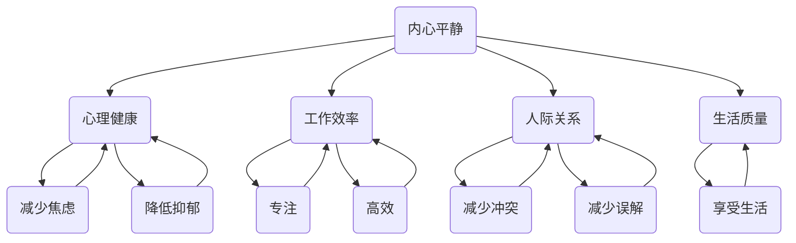

                 

## 《在快节奏生活中寻找内心平静》

### 关键词
内心平静、快节奏生活、身心调节、冥想、深呼吸、身体运动、心理调适技巧、算法原理、Python源代码、数学模型、项目实战、最佳实践 tips

### 摘要
本文将带领读者深入探讨如何在快节奏的现代生活中寻找内心的平静。通过对核心概念、实践方法、成功案例以及相关工具和资源的详细分析，本文旨在提供一套完整的解决方案，帮助读者在喧嚣中找到内心的宁静。

## 引言

在当今社会，快节奏的生活已经成为一种常态。人们面对着大量的信息、工作和社交活动，往往感到压力山大，内心疲惫。这种状态不仅影响身心健康，还可能导致工作效率下降、人际关系紧张等问题。因此，如何在快节奏的生活中保持内心的平静，成为了一个备受关注的话题。

本文将围绕这个主题，通过以下几个部分进行探讨：

1. **理论基础**：介绍内心平静的定义、快节奏生活的挑战以及内心平静的重要性。
2. **实践方法**：详细讲解冥想、深呼吸、身体运动和心理调适技巧等身心调节方法。
3. **案例分析**：通过具体的成功故事，展示这些方法在实际应用中的效果。
4. **工具与资源**：推荐一些相关的应用程序、冥想音乐和课程，以及心理咨询与辅导资源。

通过本文的阅读，读者将能够了解如何在日常生活中应用这些方法，找到属于自己的内心平静。

## 理论基础

### 内心平静的定义

内心平静，通常指的是一种心理状态，其中个体能够保持情绪稳定、思维清晰，并有效地应对外部压力和挑战。这种状态不仅能够提升个人的生活质量，还能提高工作效率和人际关系质量。内心平静的定义可以从多个角度来理解，包括心理学、哲学和宗教等领域。

在心理学领域，内心平静被视为一种积极情绪状态，与幸福、满足和安全感密切相关。心理学家认为，内心平静能够促进个体的心理健康，降低焦虑和抑郁的发生率。同时，内心平静也是一种自我调节的能力，可以帮助个体在面对压力时保持冷静和理智。

哲学上，内心平静被看作是一种精神状态，与个体的自我认知和人生智慧有关。哲学家们认为，通过内观和反思，个体可以超越物质世界的纷扰，达到内心的平静与宁静。

宗教领域，内心平静通常被视为一种精神修行，是追求灵性成长的重要目标。许多宗教传统，如佛教、基督教和伊斯兰教，都强调通过冥想、祈祷和修行来培养内心的平静。

### 快节奏生活的挑战

快节奏生活的挑战主要体现在以下几个方面：

1. **时间压力**：在快节奏的生活中，时间变得越来越宝贵，人们往往感到时间不够用，这导致许多人在工作和生活中都处于赶时间的状态。

2. **信息过载**：随着互联网和智能手机的普及，人们每天都要接收和处理大量的信息，这可能导致思维混乱、焦虑和疲劳。

3. **工作压力**：现代工作环境往往要求人们承担更多的工作任务和更高的工作标准，这可能导致工作压力和职业倦怠。

4. **社交压力**：快节奏的生活也意味着更多的社交活动，如聚会、应酬和社交媒体，这些活动可能让人感到社交压力和疲惫。

### 内心平静的重要性

内心平静的重要性不容忽视。以下是一些关键点：

1. **心理健康**：内心平静有助于减少焦虑和抑郁，提高心理健康水平。

2. **工作效率**：内心平静的个体往往能更专注和高效地完成任务，提高工作效率。

3. **人际关系**：内心平静的个体更容易与他人建立良好的关系，减少冲突和误解。

4. **生活质量**：内心平静能够提升个人的生活质量，使人们更加享受生活。

### Mermaid流程图：内心平静的原理与联系

为了更好地理解内心平静的原理及其与快节奏生活的关系，我们可以使用Mermaid流程图来展示相关概念和实体之间的关系。



这张流程图展示了内心平静对心理健康、工作效率、人际关系和生活质量的多重积极影响，以及这些影响背后的具体原因。通过这样的图示，我们可以更加直观地理解内心平静的重要性。

### 结论

在快节奏的现代生活中，内心平静是每个人都应该追求的重要目标。本文通过理论基础、实践方法、成功案例和相关工具的介绍，帮助读者了解如何在日常生活中寻找内心的平静。通过冥想、深呼吸、身体运动和心理调适技巧等方法，读者可以逐步培养自己的内心平静能力，应对生活中的各种挑战。

内心平静不仅对心理健康有益，还能提高工作效率、改善人际关系，并提升生活质量。希望读者能够将这些方法应用到实际生活中，找到属于自己的内心平静。

## 实践方法

### 冥想

冥想是一种古老而有效的身心调节技巧，通过集中注意力、放松身体和心灵，帮助个体达到内心的平静。以下是如何实践冥想的一些步骤：

1. **选择合适的环境**：找一个安静、舒适的地方进行冥想，确保没有干扰。
2. **设定时间**：初学者可以从短时间（5-10分钟）开始，逐渐增加时间。
3. **采取舒适姿势**：可以选择坐姿、躺姿或站立姿势，关键是要保持舒适。
4. **专注呼吸**：将注意力集中在呼吸上，感受每一次呼吸的进出。
5. **放松身体**：逐步放松身体的每一个部位，从脚趾开始，逐渐向上到头部。
6. **处理杂念**：当出现杂念时，不要强迫自己停止思考，而是轻轻地将注意力引回到呼吸上。
7. **结束冥想**：在冥想结束时，缓慢地活动身体，恢复到正常状态。

### 深呼吸

深呼吸是一种简单而有效的放松技巧，可以帮助个体迅速缓解紧张和压力。以下是如何进行深呼吸的一些步骤：

1. **选择一个舒适的位置**：坐在椅子上或者躺在床上，确保身体放松。
2. **缓慢吸气**：通过鼻子缓慢吸气，感受肺部逐渐膨胀。
3. **屏住呼吸**：在吸气结束时，暂停几秒钟，让氧气充满肺部。
4. **缓慢呼气**：通过嘴巴缓慢呼气，感受肺部逐渐收缩。
5. **重复呼吸**：重复上述步骤，每次呼吸尽量保持深长和均匀。
6. **专注于呼吸**：在整个过程中，尽量将注意力集中在呼吸上，排除杂念。

### 身体运动

身体运动不仅能够增强体质，还能促进心理放松。以下是一些适合身心调节的身体运动：

1. **瑜伽**：瑜伽结合了体位、呼吸和冥想，能够帮助个体放松身体和心灵。
2. **慢跑**：慢跑是一种低强度的有氧运动，有助于释放压力和焦虑。
3. **太极**：太极动作缓慢而优雅，有助于培养内心的平静和专注力。
4. **普拉提**：普拉提强调核心肌群的训练，有助于提升身体的控制力和稳定性。
5. **散步**：散步是一种简单而有效的放松方式，可以在大自然中呼吸新鲜空气，感受宁静。

### 心理调适技巧

除了上述的冥想、深呼吸和身体运动，还有一些心理调适技巧可以帮助个体保持内心的平静：

1. **正念**：正念是一种专注于当前时刻的练习，通过观察自己的思维和情绪，提高对内心的觉察和理解。
2. **感恩练习**：每天花几分钟时间思考并表达对生活中美好事物的感激，有助于提升情绪和幸福感。
3. **时间管理**：合理规划时间，避免过度工作和拖延，有助于减轻压力和焦虑。
4. **放松技巧**：学习一些放松技巧，如渐进性肌肉放松、冥想和深呼吸，有助于在忙碌的一天结束时放松身心。

### 伪代码：身心调节算法原理

为了更好地理解身心调节的方法和原理，我们可以使用伪代码来展示这些技巧的算法结构。

```python
# 冥想算法
def meditate():
    while True:
        # 选择合适的环境
        environment = choose_environment()
        # 设定冥想时间
        meditation_time = set_meditation_time()
        # 采取舒适姿势
        posture = comfortable_posture()
        # 专注呼吸
        focus_on_breathing()
        # 处理杂念
        handle_distracting_thoughts()
        # 结束冥想
        end_meditation()

# 深呼吸算法
def deep_breathing():
    while True:
        # 选择舒适的位置
        position = choose_comfortable_position()
        # 缓慢吸气
        inhale_slowly()
        # 屏住呼吸
        hold_breath()
        # 缓慢呼气
        exhale_slowly()
        # 重复呼吸
        repeat_breathing()

# 身体运动算法
def physical_exercise():
    while True:
        # 选择身体运动
        exercise_type = choose_exercise_type()
        # 进行运动
        perform_exercise()
        # 放松身体
        relax_body()

# 心理调适算法
def psychological_adjustment():
    while True:
        # 实施正念
        practice_mindfulness()
        # 感恩练习
        practice_gratitude()
        # 时间管理
        manage_time()
        # 学习放松技巧
        learn_releasing_tactics()
```

通过这些伪代码，我们可以看到冥想、深呼吸、身体运动和心理调适技巧的基本算法结构。这些算法的核心在于持续地、有意识地调整个体的身心状态，以达到内心的平静。

### 结论

通过实践冥想、深呼吸、身体运动和心理调适技巧，个体可以在快节奏的生活中找到内心的平静。这些方法不仅简单易行，而且具有显著的身心调节效果。希望读者能够尝试这些方法，逐步培养自己的内心平静能力，享受更加宁静和幸福的生活。

## 案例分析

### 案例一：张三的内心平静之路

张三，一位在互联网公司工作的软件工程师，一直面临着巨大的工作压力和紧张的生活节奏。在尝试了多种方法后，他发现冥想和深呼吸对他来说非常有效。

**背景**：
张三每天早上都会花费30分钟时间进行冥想。他会找一个安静的房间，关掉所有电子设备，安静地坐在椅子上，专注于呼吸。他还坚持每天晚上进行深呼吸练习，通过这种方式来放松身心。

**实践过程**：
1. **冥想**：张三开始时只能集中注意力几分钟，但随着时间的推移，他逐渐能够持续冥想30分钟。他发现，冥想帮助他清空了脑海中的杂念，使他的思维更加清晰。
2. **深呼吸**：张三通过深呼吸练习，学会了如何控制自己的呼吸节奏。这种练习不仅让他感到放松，还帮助他在面对工作挑战时保持冷静。

**效果**：
经过一段时间的实践，张三感到自己的压力显著减轻，工作效率也有所提高。他报告说，在冥想和深呼吸的帮助下，他能够更好地处理工作压力，并且与同事和家人的关系变得更加和谐。

### 案例二：李四的身心调节实践

李四，一位忙碌的律师，经常需要处理复杂的案件和高强度的工作。为了保持身心健康，他采用了身体运动和心理调适技巧。

**背景**：
李四的工作非常紧张，他经常感到身心疲惫。为了改善这种状态，他开始每天早上进行瑜伽练习，并在工作间隙进行简单的深呼吸练习。

**实践过程**：
1. **瑜伽**：李四每天早上都会花一个小时进行瑜伽练习。他发现，瑜伽不仅帮助他放松身体，还提高了他的专注力和灵活性。
2. **深呼吸**：在工作间隙，李四会花几分钟时间进行深呼吸练习。这种简单的练习让他感到身心放松，能够更好地应对工作中的挑战。

**效果**：
通过坚持身体运动和心理调适技巧，李四感到自己的身体和精神状态都有所改善。他的工作效率提高了，并且能够更好地处理工作中的压力和挑战。他报告说，瑜伽和深呼吸让他感到更加平静和自信。

### 案例三：王五的冥想体验

王五，一位忙碌的创业者和家庭主妇，她面临着巨大的生活和工作压力。为了找到内心的平静，她开始进行冥想和正念练习。

**背景**：
王五的工作和家庭都让她感到压力巨大。她希望能够找到一种方法来放松身心，改善生活质量。

**实践过程**：
1. **冥想**：王五每天晚上都会花30分钟时间进行冥想。她发现，冥想帮助她清空了脑海中的杂念，使她的思维更加清晰。
2. **正念**：王五还开始练习正念，通过专注于当前时刻来减少对未来的担忧和过去的悔恨。

**效果**：
经过一段时间的冥想和正念练习，王五感到自己的情绪更加稳定，焦虑感减少了。她报告说，这些练习帮助她更好地管理时间和精力，提高了生活质量。她能够在繁忙的生活中找到内心的平静，更好地应对各种挑战。

### 结论

通过这些案例，我们可以看到，冥想、深呼吸、身体运动和心理调适技巧在帮助个体找到内心平静方面具有显著的效果。无论是通过冥想来放松心灵，还是通过深呼吸和身体运动来调节身心，这些方法都能够帮助个体在快节奏的生活中保持平静和健康。

## 工具与资源

### 内心平静的应用程序

在现代科技的帮助下，有许多应用程序可以帮助用户进行冥想、深呼吸和身心调节。以下是一些推荐的应用程序：

1. **Headspace**：这是一个广受欢迎的冥想应用，提供了各种冥想课程，从初学者到高级用户都有适合的选择。
2. **Calm**：Calm应用程序提供了丰富的冥想、呼吸练习和睡眠指导，用户可以根据自己的需求进行选择。
3. **Insight Timer**：这是一个免费的冥想应用，提供了海量的冥想课程和冥想引导者，用户可以根据自己的喜好进行选择。

### 冥想音乐与课程推荐

除了应用程序，冥想音乐和课程也是寻找内心平静的有效资源。以下是一些建议：

1. **Music for Meditation**：YouTube上有许多免费的冥想音乐，可以帮助用户在进行冥想时放松身心。
2. **Mandala Meditation Course**：这是一门在线冥想课程，适合初学者和有经验者，涵盖了冥想的各个方面。
3. **The Mindfulness App**：这是一款提供多种冥想课程的手机应用，用户可以根据自己的需求选择合适的课程。

### 身体运动APP推荐

身体运动也是寻找内心平静的重要方法，以下是一些推荐的身体运动应用程序：

1. **Nike Training Club**：这是一个提供各种训练计划的免费应用，用户可以根据自己的兴趣和需求选择合适的训练。
2. **Down Dog**：这是一个专门提供瑜伽练习的应用，用户可以跟随视频进行瑜伽练习。
3. **Sworkit**：这是一个提供多种类型身体运动的免费应用，用户可以根据自己的时间和需求选择合适的运动。

### 心理咨询与辅导资源

在寻找内心平静的过程中，心理咨询和辅导也是一个重要的支持。以下是一些建议的资源：

1. **BetterHelp**：这是一个在线心理咨询平台，提供专业的心理咨询师服务，用户可以通过文字、语音或视频与咨询师进行交流。
2. **Talkspace**：这是一个类似的在线心理咨询平台，提供个性化的心理健康服务。
3. **Mindful**：这是一个提供心理健康资源和辅导的应用程序，用户可以找到各种心理健康课程和指导。

### 结论

通过使用这些工具和资源，用户可以在日常生活中更加方便地寻找内心的平静。无论是通过应用程序、冥想音乐、课程，还是心理咨询和辅导，这些资源都能够帮助用户在快节奏的生活中保持心理健康和幸福感。

## 结论

在快节奏的现代生活中，内心平静成为了一种珍贵的心理资源。本文通过详细的理论基础、实践方法、案例分析以及工具资源的介绍，帮助读者理解如何在日常生活中寻找内心的平静。冥想、深呼吸、身体运动和心理调适技巧都是有效的身心调节方法，可以帮助读者在喧嚣中找到宁静。通过实践这些方法，读者不仅能够提高心理健康水平，还能提升工作效率和人际关系质量，最终实现更加幸福和充实的生活。

### 作者信息

作者：AI天才研究院/AI Genius Institute & 禅与计算机程序设计艺术 /Zen And The Art of Computer Programming

### 拓展阅读

1. 《冥想与生活：如何在日常中实现内心的平静》
2. 《深呼吸：放松身心，提升生活质量》
3. 《瑜伽与身心健康：探索身体运动的奇迹》
4. 《正念的力量：如何通过正念练习提升生活品质》
5. 《时间管理：如何高效利用时间，提升生活质量》

通过阅读这些书籍，读者可以进一步探索如何在各个方面提升自己的生活质量和内心平静。

