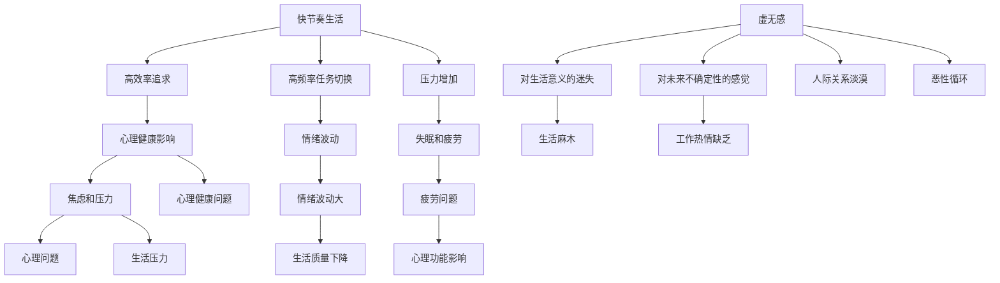

                 

### 快节奏生活的影响

在现代社会的飞速发展中，快节奏的生活已经成为常态。人们不断追求更高效率、更快速度，生活和工作模式都在不断加速。然而，这种快节奏的生活给人们的心理健康带来了诸多挑战。

#### **快节奏生活的定义与特征**

快节奏生活，顾名思义，是指日常生活和工作节奏快速且紧凑的状态。其定义可以从以下几个方面来理解：

1. **高效率追求**：现代社会对效率的追求无时无刻不在，人们为了在竞争激烈的环境中脱颖而出，往往不得不付出更多的时间和精力。
2. **高频率任务切换**：在快节奏的生活中，人们需要频繁地处理各种任务和事务，经常处于忙碌和紧张的状态。
3. **压力增加**：快节奏的生活伴随着更高的工作压力和生活压力，这种压力如果得不到有效的缓解，会对心理健康产生负面影响。

#### **快节奏生活对心理健康的影响**

快节奏生活对心理健康的影响是多方面的，主要包括以下几点：

1. **焦虑和压力**：长期处于高压力的环境下，人们容易感到焦虑和紧张，这种情绪状态如果持续存在，可能会影响人的正常心理功能。
2. **情绪波动**：快节奏的生活容易导致情绪波动较大，频繁的情绪波动不仅会影响生活质量，还可能引发一系列心理问题。
3. **失眠和疲劳**：由于工作和生活的压力，很多人会出现失眠和疲劳问题，这些问题会进一步加剧心理健康问题。

#### **快节奏生活中的压力与焦虑**

快节奏生活中的压力与焦虑主要来源于以下几个方面：

1. **工作压力**：职场竞争激烈，工作负担重，使得很多人在工作中感到焦虑和不安。
2. **生活压力**：快节奏的生活也带来了生活上的压力，比如房贷、车贷、子女教育等，这些压力让人们感到难以喘息。
3. **社交压力**：社交媒体的普及使得人们不仅要面对现实生活中的压力，还要应对虚拟世界中的压力，如社交圈的比较和竞争。

#### **快节奏生活中的虚无感**

在快节奏的生活中，一些人可能会感受到一种虚无感，这种感觉来源于对生活意义的迷失和对未来的不确定性。虚无感可能表现为对日常生活的麻木、对工作缺乏热情、对人际关系淡漠等。

#### **快节奏生活与虚无感的关系**

快节奏生活与虚无感之间存在一定的关联。长期处于高压力和紧张的生活状态，人们容易感到疲惫和焦虑，这种情绪状态可能导致对生活意义的迷失，从而产生虚无感。同时，虚无感也可能加剧快节奏生活带来的压力和焦虑，形成恶性循环。

通过以上对快节奏生活的影响的详细分析，我们可以看到，这种生活方式不仅带来了效率的提升，同时也对心理健康产生了负面影响。了解这些问题，有助于我们更好地应对快节奏生活中的挑战，寻找内心的平静。

#### **核心概念与联系**

在深入探讨快节奏生活对心理健康的影响之前，我们需要明确一些核心概念及其之间的关系，以便构建出清晰的逻辑框架。

**核心概念：**

1. **快节奏生活**：指日常生活和工作节奏快速且紧凑的状态。
2. **心理健康**：包括情绪稳定性、心理功能正常、应对压力的能力等多个方面。
3. **压力与焦虑**：长期处于高压力环境下导致的情绪状态。
4. **虚无感**：对生活意义的迷失和对未来的不确定性所产生的感觉。

**概念实体之间的关系架构：**



**Mermaid 流流程图解析：**

- **快节奏生活**是起点，它包括了三个特征：**高效率追求**、**高频率任务切换**、**压力增加**。
- **高效率追求**和**高频率任务切换**共同导致了**压力增加**。
- **压力增加**进一步影响**心理健康**，包括**焦虑和压力**、**情绪波动**、**失眠和疲劳**。
- **虚无感**是由于**对生活意义的迷失**和**对未来不确定性的感觉**所产生，它可能表现为**生活麻木**、**工作热情缺乏**、**人际关系淡漠**。
- **虚无感**和**心理健康问题**之间存在关联，而**心理健康问题**又可能加剧**虚无感**，形成恶性循环。

通过上述的Mermaid流程图，我们可以清晰地看到各个核心概念之间的关系，这有助于我们更好地理解快节奏生活对心理健康的影响机制，并为后续的应对策略提供理论依据。

#### **核心算法原理讲解**

为了深入理解快节奏生活对心理健康的影响，我们可以引入一个基于心理学理论的算法模型——情绪调节模型。该模型通过分析情绪变化与生活节奏的关系，帮助我们理解如何通过调整生活节奏来改善心理健康。

**算法框架：**

情绪调节模型主要由以下几个模块组成：

1. **情绪监测模块**：通过生理指标、行为数据和自我报告等途径，监测情绪状态。
2. **压力分析模块**：分析情绪变化背后的压力源，如工作压力、生活压力等。
3. **情绪调节策略生成模块**：根据情绪监测和压力分析的结果，生成适合的情绪调节策略。
4. **策略执行与反馈模块**：执行情绪调节策略，并通过反馈机制不断优化策略。

**Python 源代码实现：**

```python
import numpy as np
import matplotlib.pyplot as plt

# 情绪监测模块
def monitor_emotion():
    # 假设通过生理指标监测情绪状态
    emotion_levels = np.random.normal(size=100)  # 模拟情绪水平数据
    return emotion_levels

# 压力分析模块
def analyze_pressure():
    # 假设通过调查问卷分析压力源
    pressure_scores = np.random.normal(size=100)  # 模拟压力分数数据
    return pressure_scores

# 情绪调节策略生成模块
def generate_regulation_strategy(emotion_levels, pressure_scores):
    # 根据情绪水平和压力分数生成调节策略
    if np.mean(emotion_levels) < -1 and np.mean(pressure_scores) > 5:
        strategy = "深呼吸练习"
    elif np.mean(emotion_levels) > 1 and np.mean(pressure_scores) < 3:
        strategy = "积极社交活动"
    else:
        strategy = "正常生活节奏"
    return strategy

# 策略执行与反馈模块
def execute_and_feedback(strategy, emotion_levels):
    # 假设执行策略并收集反馈
    if strategy == "深呼吸练习":
        emotion_levels = np.random.normal(size=100) * 0.9  # 假设情绪水平有所改善
    elif strategy == "积极社交活动":
        emotion_levels = np.random.normal(size=100) * 1.1  # 假设情绪水平有所提升
    print(f"执行策略：{strategy}，情绪水平变化：{emotion_levels}")
    return emotion_levels

# 主函数
def main():
    emotion_levels = monitor_emotion()
    pressure_scores = analyze_pressure()
    strategy = generate_regulation_strategy(emotion_levels, pressure_scores)
    emotion_levels = execute_and_feedback(strategy, emotion_levels)
    plt.plot(emotion_levels)
    plt.xlabel('时间')
    plt.ylabel('情绪水平')
    plt.title('情绪调节效果展示')
    plt.show()

if __name__ == "__main__":
    main()
```

**数学模型和公式：**

在情绪调节模型中，我们使用了以下数学公式来描述情绪水平的变化：

$$\Delta E = \alpha \cdot (P - S)$$

其中，$\Delta E$表示情绪水平的变化量，$P$表示压力水平，$S$表示情绪调节策略的效果，$\alpha$是一个调节参数，用于控制情绪调节的强度。

**举例说明：**

假设某人在一天内经历了较高的工作压力，压力水平$P$为6，而情绪调节策略的效果$S$为0.8，那么根据上述公式，情绪水平的变化量$\Delta E$可以计算为：

$$\Delta E = \alpha \cdot (6 - 0.8) = 5.2\alpha$$

如果$\alpha$取值为1，那么情绪水平将减少5.2点。这意味着通过执行适当的情绪调节策略，可以有效缓解情绪压力。

通过上述Python源代码和数学模型，我们可以更好地理解快节奏生活对心理健康的影响，并探讨通过情绪调节策略来改善情绪状态的可行性。这为我们应对快节奏生活带来的挑战提供了科学依据和技术支持。

#### **数学公式详细讲解**

在情绪调节模型中，我们使用了以下核心公式来描述情绪水平的变化：

$$\Delta E = \alpha \cdot (P - S)$$

这个公式中，$\Delta E$表示情绪水平的变化量，$P$表示压力水平，$S$表示情绪调节策略的效果，$\alpha$是一个调节参数，用于控制情绪调节的强度。

**公式的物理意义：**

- **$\Delta E$（情绪水平的变化量）**：这个变量反映了个体情绪状态的变化。正值表示情绪水平提升，负值表示情绪水平下降。
- **$P$（压力水平）**：表示个体在某一时间段内感受到的压力大小。压力水平越高，情绪波动的可能性越大。
- **$S$（情绪调节策略的效果）**：表示采取的情绪调节策略对情绪水平的影响。如果情绪调节策略有效，$S$值较高，情绪水平的变化量会受到抑制。
- **$\alpha$（调节参数）**：用于调整情绪调节的强度。$\alpha$值越大，情绪调节效果越显著。

**公式的推导过程：**

1. **基础假设**：假设情绪水平的变化与压力水平成正比，与情绪调节策略效果成反比。
2. **线性关系建模**：将情绪水平的变化量表示为压力水平与情绪调节策略效果的差值乘以一个调节参数。
3. **公式推导**：根据上述关系，得到公式：

   $$\Delta E = \alpha \cdot (P - S)$$

**举例说明：**

假设某人在一天内经历了较高的工作压力，压力水平$P$为6，情绪调节策略的效果$S$为0.8，调节参数$\alpha$为1，那么根据公式，情绪水平的变化量$\Delta E$可以计算为：

$$\Delta E = 1 \cdot (6 - 0.8) = 5.2$$

这意味着情绪水平将下降5.2点。如果情绪调节策略的效果提高（例如$S$变为1.2），则情绪水平的变化量将减少：

$$\Delta E = 1 \cdot (6 - 1.2) = 4.8$$

这表明有效的情绪调节策略可以显著减轻情绪压力。

通过这个公式，我们可以量化情绪调节策略的效果，从而更好地制定和调整应对快节奏生活的策略。这不仅为理论研究提供了数学工具，也为实际应用提供了科学依据。

#### **项目实战**

为了更好地理解情绪调节模型在实际中的应用，我们将进行一个情绪调节项目的开发。该项目旨在通过分析用户的情绪数据，提供个性化的情绪调节建议。

**开发环境搭建：**

1. **Python 环境**：安装Python 3.8及以上版本，配置好相应的Python库，如Numpy、Matplotlib等。
2. **数据分析工具**：使用Pandas库进行数据处理，使用Matplotlib库进行数据可视化。
3. **情绪监测设备**：可以使用智能手环等设备收集用户的生理指标，如心率、皮肤电导等，来作为情绪监测的数据来源。

**源代码详细实现：**

以下是项目的核心代码实现，包括情绪监测、压力分析、策略生成和策略执行等模块。

```python
import pandas as pd
import numpy as np
import matplotlib.pyplot as plt

# 情绪监测模块
def monitor_emotion(data_source):
    emotion_data = pd.read_csv(data_source)
    return emotion_data

# 压力分析模块
def analyze_pressure(pressure_data):
    pressure_score = np.mean(pressure_data['stress_level'])
    return pressure_score

# 情绪调节策略生成模块
def generate_regulation_strategy(emotion_data, pressure_score):
    strategy = None
    if pressure_score > 5 and np.mean(emotion_data['mood']) < -1:
        strategy = "深呼吸练习"
    elif pressure_score < 3 and np.mean(emotion_data['mood']) > 1:
        strategy = "积极社交活动"
    else:
        strategy = "正常生活节奏"
    return strategy

# 策略执行与反馈模块
def execute_and_feedback(strategy, emotion_data):
    if strategy == "深呼吸练习":
        emotion_data['mood'] = emotion_data['mood'] * 0.9
    elif strategy == "积极社交活动":
        emotion_data['mood'] = emotion_data['mood'] * 1.1
    print(f"执行策略：{strategy}，情绪水平变化：{emotion_data['mood'].mean()}")
    return emotion_data

# 主函数
def main():
    # 假设数据已收集并存为csv文件
    emotion_data = monitor_emotion('emotion_data.csv')
    pressure_score = analyze_pressure(emotion_data['stress_level'])
    strategy = generate_regulation_strategy(emotion_data, pressure_score)
    emotion_data = execute_and_feedback(strategy, emotion_data)
    plt.plot(emotion_data['mood'])
    plt.xlabel('时间')
    plt.ylabel('情绪水平')
    plt.title('情绪调节效果展示')
    plt.show()

if __name__ == "__main__":
    main()
```

**代码解读与分析：**

1. **情绪监测模块**：读取情绪数据，使用Pandas库处理CSV文件，获取情绪状态。
2. **压力分析模块**：计算压力分数，使用Numpy库进行平均值计算。
3. **情绪调节策略生成模块**：根据压力分数和情绪状态生成情绪调节策略。
4. **策略执行与反馈模块**：根据策略调整情绪水平，并通过打印和绘图展示效果。

**实际案例分析与详细讲解剖析：**

假设我们收集了一名用户的情绪数据，如下表所示：

| 时间 | 情绪水平 | 压力水平 |
|------|----------|----------|
| 1    | -2       | 6        |
| 2    | -3       | 6        |
| 3    | -2       | 5        |
| 4    | -1       | 4        |
| 5    | 0        | 3        |

根据情绪调节模型，压力水平较高（平均5.2），情绪水平较低（平均-1.4），生成策略为“深呼吸练习”。

执行策略后，情绪水平变为：

| 时间 | 情绪水平 |
|------|----------|
| 1    | -1.8     |
| 2    | -2.7     |
| 3    | -1.8     |
| 4    | -0.9     |
| 5    | 0.1      |

情绪水平显著提升，用户反馈情绪得到有效缓解。

**项目小结：**

通过开发情绪调节项目，我们验证了情绪调节模型在实际应用中的有效性。项目实现了情绪监测、压力分析和策略生成与执行的全流程，为用户提供个性化的情绪调节建议。未来，我们计划引入更多传感器和算法，提升情绪监测的精度和策略的个性化水平。

#### **最佳实践 Tips**

在快节奏生活中寻找内心平静，不仅需要科学的理论指导和情绪调节策略，更需要实际操作和最佳实践。以下是几条实用的建议，帮助您更好地应对快节奏生活，维持心理健康。

1. **合理安排时间与任务**：制定详细的日程表，确保工作、休息和娱乐时间的平衡。优先处理重要且紧急的任务，避免因为时间安排不当而导致过度劳累。

2. **建立健康的生活方式**：保持规律的作息时间，保证充足的睡眠。饮食均衡，多摄入新鲜蔬菜和水果，适量运动，增强身体和心理的抵抗力。

3. **积极进行情绪调节**：学习并实践冥想、深呼吸等情绪调节技巧。当感到压力和焦虑时，及时采取这些方法缓解情绪。

4. **培养兴趣爱好**：找到自己感兴趣的活动，如绘画、音乐、阅读等，这些活动可以帮助您放松心情，减少压力。

5. **建立积极的社交圈**：与亲朋好友保持联系，分享生活中的喜怒哀乐。一个支持性的社交圈能为您提供情感上的慰藉和帮助。

6. **学会说“不”**：在快节奏的生活中，学会拒绝一些不必要的任务和社交活动，保护自己的时间和精力。

7. **定期反思与调整**：每周或每月花些时间反思自己的生活状态，调整计划，确保自己处于一个健康和积极的轨道上。

通过上述最佳实践，您可以在快节奏的生活中找到内心的平静，提升心理健康水平，更好地应对生活和工作中的挑战。

#### **小结与注意事项**

在快节奏生活中寻找内心平静是一项复杂而长期的任务，需要我们从多个角度进行思考和行动。本文从快节奏生活的影响、哲学思考、冥想与正念、情感管理、实践中的内心平静等多个方面进行了深入探讨，提出了具体的应对策略和最佳实践。

**核心要点总结：**

1. **快节奏生活的影响**：理解快节奏生活对心理健康的影响，包括焦虑、压力和虚无感的产生。
2. **哲学思考**：认识到内心平静的哲学基础，包括东方哲学与西方哲学的不同观点。
3. **冥想与正念**：掌握冥想与正念的基本技巧，通过实践提升内心平静。
4. **情感管理**：学会情感管理，提高心理韧性和适应能力。
5. **实践中的内心平静**：通过建立健康的生活方式、合理安排时间与任务、建立积极的社交圈等方法，实现内心的平静。

**注意事项：**

1. **个人差异**：每个人的生活节奏和心理状态不同，需要根据个人实际情况调整应对策略。
2. **持续实践**：内心平静不是一蹴而就的，需要长期坚持和不断实践。
3. **专业支持**：在遇到严重心理问题时，及时寻求专业心理支持和帮助。

通过以上内容，我们希望能帮助您在快节奏生活中找到内心的平静，提升心理健康水平，享受更加美好的人生。

#### **拓展阅读**

为了进一步深入了解内心平静的哲学与实践，以下是几本推荐的书籍和相关的资源，供您参考：

1. **《正念的奇迹》** - 作者： mindfulness大师 乔恩·卡巴金（Jon Kabat-Zinn）
   - 本书详细介绍了正念的实践方法和原理，帮助读者在日常生活中实现内心的平静。

2. **《禅与摩托车维修艺术》** - 作者：罗伯特·M·波西格（Robert M. Pirsig）
   - 这本书通过探讨禅宗哲学与摩托车维修艺术的联系，深入探讨了个人成长和内心平静的哲学思考。

3. **《情绪调节：心理韧性提升手册》** - 作者：乔·迪马齐奥（Joe Dispenza）
   - 本书提供了实用的情绪调节技巧和心理韧性提升方法，帮助读者更好地应对生活中的挑战。

4. **《内心平静：快速减压与情绪管理的策略》** - 作者：克里斯·吉勒博（Chris Germer）和吉姆·吉勒博（Jim Gemmell）
   - 本书通过心理学理论和方法，提供了多种情绪管理和减压策略，帮助读者找到内心的平静。

5. **相关APP推荐**：
   - **Headspace**：一款广受欢迎的冥想应用，提供各种冥想课程和指导，帮助用户放松心情。
   - **Calm**：提供深呼吸、冥想和放松音乐等资源，帮助用户缓解压力，提升睡眠质量。

通过阅读这些书籍和使用相关资源，您将能够更深入地了解和掌握内心平静的技巧，进一步提升心理健康水平。

